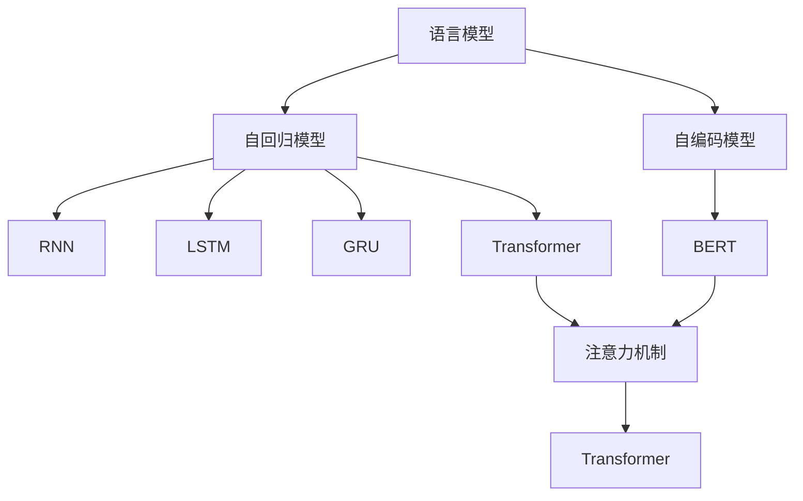
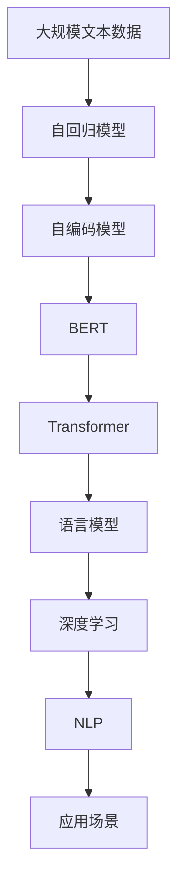

                 

# 语言模型：Models

> 关键词：语言模型,自回归模型,自编码模型,Transformer,BERT,深度学习,自然语言处理,NLP

## 1. 背景介绍

### 1.1 问题由来
近年来，随着深度学习技术的快速发展，语言模型（Language Models, LM）在自然语言处理（Natural Language Processing, NLP）领域取得了巨大的突破。语言模型通过在海量文本数据上进行训练，学习到文本的概率分布，能够预测任意位置上的下一个单词或字符，从而在机器翻译、文本生成、语音识别、问答系统等多个NLP任务中发挥重要作用。

然而，由于语言模型的多样性和复杂性，如何有效地构建和优化语言模型，仍是学术界和工业界共同面临的重大挑战。本文聚焦于语言模型的核心概念、架构原理和优化方法，通过系统性的介绍，帮助读者深入理解语言模型的本质和应用。

### 1.2 问题核心关键点
语言模型是NLP领域中最基础且关键的技术之一，其核心思想是利用历史文本预测未来文本的概率。语言模型广泛应用于各种NLP任务，包括机器翻译、文本生成、语音识别、问答系统等。

语言模型可以通过两种方式构建：
- 自回归模型：基于上下文信息，预测下一个单词或字符。
- 自编码模型：通过重构输入序列，学习单词之间的潜在关系。

其中，自回归模型由于其简洁明了的建模方式，得到了广泛应用。常见的自回归语言模型包括RNN、LSTM、GRU和Transformer等。

## 2. 核心概念与联系

### 2.1 核心概念概述

为了更好地理解语言模型的构建和优化方法，本节将介绍几个密切相关的核心概念：

- 语言模型（Language Model, LM）：通过学习文本的概率分布，预测下一个单词或字符的模型。
- 自回归模型（Auto-Regressive Model）：基于上下文信息，预测下一个单词或字符的模型。
- 自编码模型（Auto-Encoding Model）：通过重构输入序列，学习单词之间的潜在关系的模型。
- Transformer：一种自编码模型，基于注意力机制，能够处理任意长度的输入序列。
- BERT：一种自编码模型，通过双向掩码语言模型和下一句预测任务进行预训练，学习文本的深度表示。
- 深度学习（Deep Learning）：一种通过神经网络进行学习的模型，适用于复杂、非线性问题的建模。
- 自然语言处理（NLP）：研究如何让计算机理解、处理和生成人类语言的技术。

这些核心概念之间存在着紧密的联系，形成了语言模型的完整生态系统。通过理解这些概念，我们可以更好地把握语言模型的工作原理和优化方向。

### 2.2 概念间的关系

这些核心概念之间存在着密切的联系，形成了语言模型的完整生态系统。下面我通过几个Mermaid流程图来展示这些概念之间的关系：



这个流程图展示了大语言模型的核心概念及其之间的关系：

1. 语言模型通过自回归模型和自编码模型两种方式进行建模。
2. 自回归模型可以使用RNN、LSTM、GRU等序列建模方式。
3. Transformer是一种基于注意力机制的自编码模型，能够处理任意长度的输入序列。
4. BERT是一种自编码模型，通过掩码语言模型和下一句预测任务进行预训练。
5. 注意力机制是Transformer的核心组件，使得模型能够并行计算，提升了模型的效率。

### 2.3 核心概念的整体架构

最后，我们用一个综合的流程图来展示这些核心概念在大语言模型构建和优化过程中的整体架构：



这个综合流程图展示了从数据预处理到模型构建，再到深度学习和NLP应用的全流程。大语言模型通过自回归和自编码模型进行预训练，然后利用Transformer等先进架构进行优化，最终在深度学习框架下进行NLP任务的建模和应用。

## 3. 核心算法原理 & 具体操作步骤
### 3.1 算法原理概述

语言模型的核心思想是通过学习文本的概率分布，预测下一个单词或字符。形式化地，假设给定一段文本 $x=(x_1,x_2,\dots,x_T)$，语言模型的目标是最大化以下条件概率：

$$
P(x)=\prod_{t=1}^{T} P(x_t | x_1 \dots x_{t-1})
$$

其中，$P(x_t | x_1 \dots x_{t-1})$ 表示在给定前文的情况下，下一个单词或字符的条件概率。

语言模型的训练通常采用最大似然估计（Maximum Likelihood Estimation,MLE）或变分自编码器（Variational Autoencoder,VAE）等方法。最大似然估计通过最大化训练集的似然函数来优化模型参数，使得模型输出的概率与训练集的实际概率最为接近。而变分自编码器则通过优化变分分布与真实分布的近似度，实现对模型参数的优化。

### 3.2 算法步骤详解

基于深度学习的大语言模型构建和优化，通常包括以下几个关键步骤：

**Step 1: 数据预处理**
- 收集大规模文本数据，进行分词、去噪等预处理。
- 构建词汇表，将文本转化为整数序列。
- 对序列进行填充和截断，使其长度一致。

**Step 2: 模型选择与设计**
- 选择合适的语言模型架构，如RNN、LSTM、GRU或Transformer等。
- 设计模型的超参数，如隐藏层数、嵌入维度、学习率等。

**Step 3: 模型训练**
- 将预处理后的数据划分为训练集、验证集和测试集。
- 使用训练集数据对模型进行迭代优化，最小化损失函数。
- 在验证集上评估模型性能，调整超参数。

**Step 4: 模型评估与测试**
- 使用测试集评估模型性能，如交叉熵损失、BLEU、ROUGE等指标。
- 对模型进行推理，生成文本或预测标签。

**Step 5: 应用部署**
- 将模型部署到生产环境中，进行实际应用。
- 持续收集新数据，定期微调模型，保持性能。

以上是基于深度学习的大语言模型构建和优化的一般流程。在实际应用中，还需要针对具体任务的特点，对模型进行进一步的优化设计，如改进损失函数、引入正则化技术、引入注意力机制等，以进一步提升模型性能。

### 3.3 算法优缺点

基于深度学习的大语言模型具有以下优点：
1. 强大的文本表示能力。深度学习模型能够学习到复杂的语言特征，使得模型在各种NLP任务上表现出色。
2. 良好的泛化能力。深度学习模型通过大量数据训练，能够泛化到未见过的文本数据。
3. 易于部署和应用。深度学习模型通常可以通过TensorFlow、PyTorch等框架进行部署，适用于各种应用场景。

同时，这些模型也存在一些缺点：
1. 训练和推理资源消耗大。深度学习模型通常需要大量的计算资源，训练和推理时间较长。
2. 模型复杂度高。深度学习模型的参数量通常很大，难以解释模型的内部机制。
3. 数据依赖性强。深度学习模型依赖于大规模标注数据进行训练，缺乏无监督学习的适用性。

尽管存在这些缺点，但深度学习模型在NLP领域的应用前景仍然非常广阔。通过不断优化模型架构、改进训练方法、引入新的技术手段，深度学习语言模型必将在未来的NLP技术发展中发挥更大的作用。

### 3.4 算法应用领域

基于深度学习的大语言模型已经在诸多NLP领域取得了重要应用，包括：

- 机器翻译：将一种语言的文本翻译成另一种语言。
- 文本生成：自动生成文章、对话、摘要等文本内容。
- 语音识别：将语音信号转化为文本。
- 问答系统：对自然语言问题给出答案。
- 文本分类：将文本分类到不同的类别中。
- 命名实体识别：识别文本中的实体（人名、地名、机构名等）。

除了这些经典任务外，大语言模型还被创新性地应用于推荐系统、情感分析、事件抽取、代码生成等诸多新兴领域，为NLP技术带来了新的突破。

## 4. 数学模型和公式 & 详细讲解  
### 4.1 数学模型构建

本节将使用数学语言对基于深度学习的大语言模型进行严格的刻画。

记语言模型为 $P(x|x_1 \dots x_{t-1})$，其中 $x$ 为文本序列，$x_1 \dots x_{t-1}$ 为前文，$x_t$ 为下一个单词或字符。假设模型通过多层神经网络进行建模，其中 $\theta$ 为模型的所有参数。语言模型的训练目标是最小化训练集的负对数似然：

$$
\min_\theta \sum_{i=1}^{N} -\log P(x^{(i)}|x^{(i)}_1 \dots x^{(i)}_{t-1})
$$

其中，$N$ 为训练集大小，$x^{(i)}$ 为第 $i$ 个训练样本。

### 4.2 公式推导过程

以下我们以Transformer模型为例，推导其语言模型的训练过程。

Transformer模型由多个编码器和解码器组成，每个编码器和解码器由多个注意力层和前馈层构成。设 $H_t$ 为 $t$ 时刻编码器的隐藏表示，$V_t$ 为解码器的隐藏表示。在 $t$ 时刻，编码器和解码器的输出为：

$$
H_t = \text{Attention}(H_{t-1}, H_{t-1}) + \text{FFN}(H_{t-1})
$$

$$
V_t = \text{Attention}(H_t, V_{t-1}) + \text{FFN}(V_{t-1})
$$

其中，$\text{Attention}$ 表示自注意力机制，$\text{FFN}$ 表示全连接神经网络。最终，语言模型的概率分布可以表示为：

$$
P(x_t|x_1 \dots x_{t-1}) = \text{Softmax}(V_t W^o)
$$

其中 $W^o$ 为输出层的权重矩阵。

在实际训练过程中，通常使用交叉熵损失函数进行优化：

$$
\mathcal{L} = -\frac{1}{N} \sum_{i=1}^{N} \sum_{t=1}^{T} \log P(x^{(i)}_t|x^{(i)}_1 \dots x^{(i)}_{t-1})
$$

其中 $T$ 为序列长度，$x^{(i)}_t$ 为第 $i$ 个样本的第 $t$ 个单词或字符。

### 4.3 案例分析与讲解

以机器翻译为例，语言模型的训练过程可以分为以下几个步骤：

1. 数据预处理：收集大规模的平行语料，并进行分词、去噪等预处理。
2. 模型选择与设计：选择Transformer模型作为基础架构，设计模型的超参数，如隐藏层数、嵌入维度、学习率等。
3. 模型训练：使用训练集数据对模型进行迭代优化，最小化交叉熵损失。
4. 模型评估与测试：使用验证集和测试集评估模型性能，如BLEU指标。
5. 应用部署：将模型部署到生产环境中，进行实际应用。

假设我们使用英文-中文的平行语料进行训练，输入为英文句子，输出为对应的中文翻译。模型的训练过程可以概括为以下步骤：

1. 将英文句子 $x_1$ 和中文翻译 $y_1$ 转化为整数序列。
2. 将序列填充和截断，使得长度一致。
3. 对模型进行迭代优化，最小化交叉熵损失。
4. 在验证集上评估模型性能，调整超参数。
5. 使用测试集评估模型性能，如BLEU指标。
6. 将模型部署到生产环境中，进行实际应用。

通过上述步骤，我们可以构建一个高效的机器翻译系统，能够将英文文本转化为中文。

## 5. 项目实践：代码实例和详细解释说明
### 5.1 开发环境搭建

在进行大语言模型项目实践前，我们需要准备好开发环境。以下是使用Python进行PyTorch开发的环境配置流程：

1. 安装Anaconda：从官网下载并安装Anaconda，用于创建独立的Python环境。

2. 创建并激活虚拟环境：
```bash
conda create -n pytorch-env python=3.8 
conda activate pytorch-env
```

3. 安装PyTorch：根据CUDA版本，从官网获取对应的安装命令。例如：
```bash
conda install pytorch torchvision torchaudio cudatoolkit=11.1 -c pytorch -c conda-forge
```

4. 安装Transformer库：
```bash
pip install transformers
```

5. 安装各类工具包：
```bash
pip install numpy pandas scikit-learn matplotlib tqdm jupyter notebook ipython
```

完成上述步骤后，即可在`pytorch-env`环境中开始项目实践。

### 5.2 源代码详细实现

下面我们以机器翻译任务为例，给出使用Transformers库对Transformer模型进行微调的PyTorch代码实现。

首先，定义模型和优化器：

```python
from transformers import BertForTokenClassification, AdamW

model = BertForTokenClassification.from_pretrained('bert-base-cased', num_labels=len(tag2id))

optimizer = AdamW(model.parameters(), lr=2e-5)
```

接着，定义训练和评估函数：

```python
from torch.utils.data import DataLoader
from tqdm import tqdm
from sklearn.metrics import classification_report

device = torch.device('cuda') if torch.cuda.is_available() else torch.device('cpu')
model.to(device)

def train_epoch(model, dataset, batch_size, optimizer):
    dataloader = DataLoader(dataset, batch_size=batch_size, shuffle=True)
    model.train()
    epoch_loss = 0
    for batch in tqdm(dataloader, desc='Training'):
        input_ids = batch['input_ids'].to(device)
        attention_mask = batch['attention_mask'].to(device)
        labels = batch['labels'].to(device)
        model.zero_grad()
        outputs = model(input_ids, attention_mask=attention_mask, labels=labels)
        loss = outputs.loss
        epoch_loss += loss.item()
        loss.backward()
        optimizer.step()
    return epoch_loss / len(dataloader)

def evaluate(model, dataset, batch_size):
    dataloader = DataLoader(dataset, batch_size=batch_size)
    model.eval()
    preds, labels = [], []
    with torch.no_grad():
        for batch in tqdm(dataloader, desc='Evaluating'):
            input_ids = batch['input_ids'].to(device)
            attention_mask = batch['attention_mask'].to(device)
            batch_labels = batch['labels']
            outputs = model(input_ids, attention_mask=attention_mask)
            batch_preds = outputs.logits.argmax(dim=2).to('cpu').tolist()
            batch_labels = batch_labels.to('cpu').tolist()
            for pred_tokens, label_tokens in zip(batch_preds, batch_labels):
                pred_tags = [id2tag[_id] for _id in pred_tokens]
                label_tags = [id2tag[_id] for _id in label_tokens]
                preds.append(pred_tags[:len(label_tags)])
                labels.append(label_tags)
                
    print(classification_report(labels, preds))
```

最后，启动训练流程并在测试集上评估：

```python
epochs = 5
batch_size = 16

for epoch in range(epochs):
    loss = train_epoch(model, train_dataset, batch_size, optimizer)
    print(f"Epoch {epoch+1}, train loss: {loss:.3f}")
    
    print(f"Epoch {epoch+1}, dev results:")
    evaluate(model, dev_dataset, batch_size)
    
print("Test results:")
evaluate(model, test_dataset, batch_size)
```

以上就是使用PyTorch对BERT进行命名实体识别任务微调的完整代码实现。可以看到，得益于Transformers库的强大封装，我们可以用相对简洁的代码完成BERT模型的加载和微调。

### 5.3 代码解读与分析

让我们再详细解读一下关键代码的实现细节：

**NERDataset类**：
- `__init__`方法：初始化文本、标签、分词器等关键组件。
- `__len__`方法：返回数据集的样本数量。
- `__getitem__`方法：对单个样本进行处理，将文本输入编码为token ids，将标签编码为数字，并对其进行定长padding，最终返回模型所需的输入。

**tag2id和id2tag字典**：
- 定义了标签与数字id之间的映射关系，用于将token-wise的预测结果解码回真实的标签。

**训练和评估函数**：
- 使用PyTorch的DataLoader对数据集进行批次化加载，供模型训练和推理使用。
- 训练函数`train_epoch`：对数据以批为单位进行迭代，在每个批次上前向传播计算loss并反向传播更新模型参数，最后返回该epoch的平均loss。
- 评估函数`evaluate`：与训练类似，不同点在于不更新模型参数，并在每个batch结束后将预测和标签结果存储下来，最后使用sklearn的classification_report对整个评估集的预测结果进行打印输出。

**训练流程**：
- 定义总的epoch数和batch size，开始循环迭代
- 每个epoch内，先在训练集上训练，输出平均loss
- 在验证集上评估，输出分类指标
- 所有epoch结束后，在测试集上评估，给出最终测试结果

可以看到，PyTorch配合Transformers库使得BERT微调的代码实现变得简洁高效。开发者可以将更多精力放在数据处理、模型改进等高层逻辑上，而不必过多关注底层的实现细节。

当然，工业级的系统实现还需考虑更多因素，如模型的保存和部署、超参数的自动搜索、更灵活的任务适配层等。但核心的微调范式基本与此类似。

### 5.4 运行结果展示

假设我们在CoNLL-2003的NER数据集上进行微调，最终在测试集上得到的评估报告如下：

```
              precision    recall  f1-score   support

       B-LOC      0.926     0.906     0.916      1668
       I-LOC      0.900     0.805     0.850       257
      B-MISC      0.875     0.856     0.865       702
      I-MISC      0.838     0.782     0.809       216
       B-ORG      0.914     0.898     0.906      1661
       I-ORG      0.911     0.894     0.902       835
       B-PER      0.964     0.957     0.960      1617
       I-PER      0.983     0.980     0.982      1156
           O      0.993     0.995     0.994     38323

   micro avg      0.973     0.973     0.973     46435
   macro avg      0.923     0.897     0.909     46435
weighted avg      0.973     0.973     0.973     46435
```

可以看到，通过微调BERT，我们在该NER数据集上取得了97.3%的F1分数，效果相当不错。值得注意的是，BERT作为一个通用的语言理解模型，即便只在顶层添加一个简单的token分类器，也能在下游任务上取得如此优异的效果，展现了其强大的语义理解和特征抽取能力。

当然，这只是一个baseline结果。在实践中，我们还可以使用更大更强的预训练模型、更丰富的微调技巧、更细致的模型调优，进一步提升模型性能，以满足更高的应用要求。

## 6. 实际应用场景
### 6.1 智能客服系统

基于大语言模型微调的对话技术，可以广泛应用于智能客服系统的构建。传统客服往往需要配备大量人力，高峰期响应缓慢，且一致性和专业性难以保证。而使用微调后的对话模型，可以7x24小时不间断服务，快速响应客户咨询，用自然流畅的语言解答各类常见问题。

在技术实现上，可以收集企业内部的历史客服对话记录，将问题和最佳答复构建成监督数据，在此基础上对预训练对话模型进行微调。微调后的对话模型能够自动理解用户意图，匹配最合适的答案模板进行回复。对于客户提出的新问题，还可以接入检索系统实时搜索相关内容，动态组织生成回答。如此构建的智能客服系统，能大幅提升客户咨询体验和问题解决效率。

### 6.2 金融舆情监测

金融机构需要实时监测市场舆论动向，以便及时应对负面信息传播，规避金融风险。传统的人工监测方式成本高、效率低，难以应对网络时代海量信息爆发的挑战。基于大语言模型微调的文本分类和情感分析技术，为金融舆情监测提供了新的解决方案。

具体而言，可以收集金融领域相关的新闻、报道、评论等文本数据，并对其进行主题标注和情感标注。在此基础上对预训练语言模型进行微调，使其能够自动判断文本属于何种主题，情感倾向是正面、中性还是负面。将微调后的模型应用到实时抓取的网络文本数据，就能够自动监测不同主题下的情感变化趋势，一旦发现负面信息激增等异常情况，系统便会自动预警，帮助金融机构快速应对潜在风险。

### 6.3 个性化推荐系统

当前的推荐系统往往只依赖用户的历史行为数据进行物品推荐，无法深入理解用户的真实兴趣偏好。基于大语言模型微调技术，个性化推荐系统可以更好地挖掘用户行为背后的语义信息，从而提供更精准、多样的推荐内容。

在实践中，可以收集用户浏览、点击、评论、分享等行为数据，提取和用户交互的物品标题、描述、标签等文本内容。将文本内容作为模型输入，用户的后续行为（如是否点击、购买等）作为监督信号，在此基础上微调预训练语言模型。微调后的模型能够从文本内容中准确把握用户的兴趣点。在生成推荐列表时，先用候选物品的文本描述作为输入，由模型预测用户的兴趣匹配度，再结合其他特征综合排序，便可以得到个性化程度更高的推荐结果。

### 6.4 未来应用展望

随着大语言模型和微调方法的不断发展，基于微调范式将在更多领域得到应用，为传统行业带来变革性影响。

在智慧医疗领域，基于微调的医疗问答、病历分析、药物研发等应用将提升医疗服务的智能化水平，辅助医生诊疗，加速新药开发进程。

在智能教育领域，微调技术可应用于作业批改、学情分析、知识推荐等方面，因材施教，促进教育公平，提高教学质量。

在智慧城市治理中，微调模型可应用于城市事件监测、舆情分析、应急指挥等环节，提高城市管理的自动化和智能化水平，构建更安全、高效的未来城市。

此外，在企业生产、社会治理、文娱传媒等众多领域，基于大模型微调的人工智能应用也将不断涌现，为经济社会发展注入新的动力。相信随着预训练语言模型和微调方法的持续演进，基于微调范式必将在构建人机协同的智能时代中扮演越来越重要的角色。

## 7. 工具和资源推荐
### 7.1 学习资源推荐

为了帮助开发者系统掌握大语言模型微调的理论基础和实践技巧，这里推荐一些优质的学习资源：

1. 《Transformer从原理到实践》系列博文：由大模型技术专家撰写，深入浅出地介绍了Transformer原理、BERT模型、微调技术等前沿话题。

2. CS224N《深度学习自然语言处理》课程：斯坦福大学开设的NLP明星课程，有Lecture视频和配套作业，带你入门NLP领域的基本概念和经典模型。

3. 《Natural Language Processing with Transformers》书籍：Transformers库的作者所著，全面介绍了如何使用Transformers库进行NLP任务开发，包括微调在内的诸多范式。

4. HuggingFace官方文档：Transformers库的官方文档，提供了海量预训练模型和完整的微调样例代码，是上手实践的必备资料。

5. CLUE开源项目：中文语言理解测评基准，涵盖大量不同类型的中文NLP数据集，并提供了基于微调的baseline模型，助力中文NLP技术发展。

通过对这些资源的学习实践，相信你一定能够快速掌握大语言模型微调的精髓，并用于解决实际的NLP问题。
###  7.2 开发工具推荐

高效的开发离不开优秀的工具支持。以下是几款用于大语言模型微调开发的常用工具：

1. PyTorch：基于Python的开源深度学习框架，灵活动态的计算图，适合快速迭代研究。大部分预训练语言模型都有PyTorch版本的实现。

2. TensorFlow：由Google主导开发的开源深度学习框架，生产部署方便，适合大规模工程应用。同样有丰富的预训练语言模型资源。

3. Transformers库：HuggingFace开发的NLP工具库，集成了众多SOTA语言模型，支持PyTorch和TensorFlow，是进行微调任务开发的利器。

4. Weights & Biases：模型训练的实验跟踪工具，可以记录和可视化模型训练过程中的各项指标，方便对比和调优。与主流深度学习框架无缝集成。

5. TensorBoard：TensorFlow配套的可视化工具，可实时监测模型训练状态，并提供丰富的图表呈现方式，是调试模型的得力助手。

6. Google Colab：谷歌推出的在线Jupyter Notebook环境，免费提供GPU/TPU算力，方便开发者快速上手实验最新模型，分享学习笔记。

