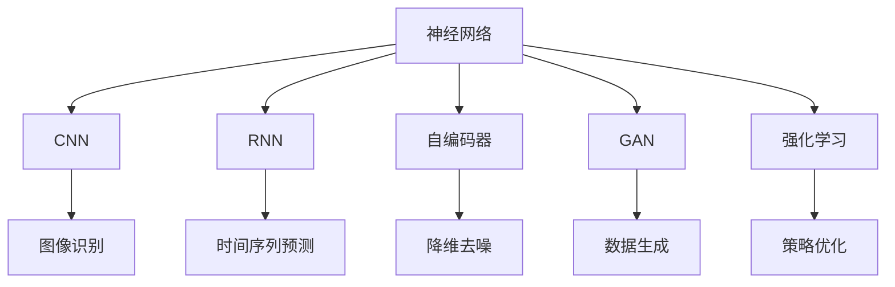
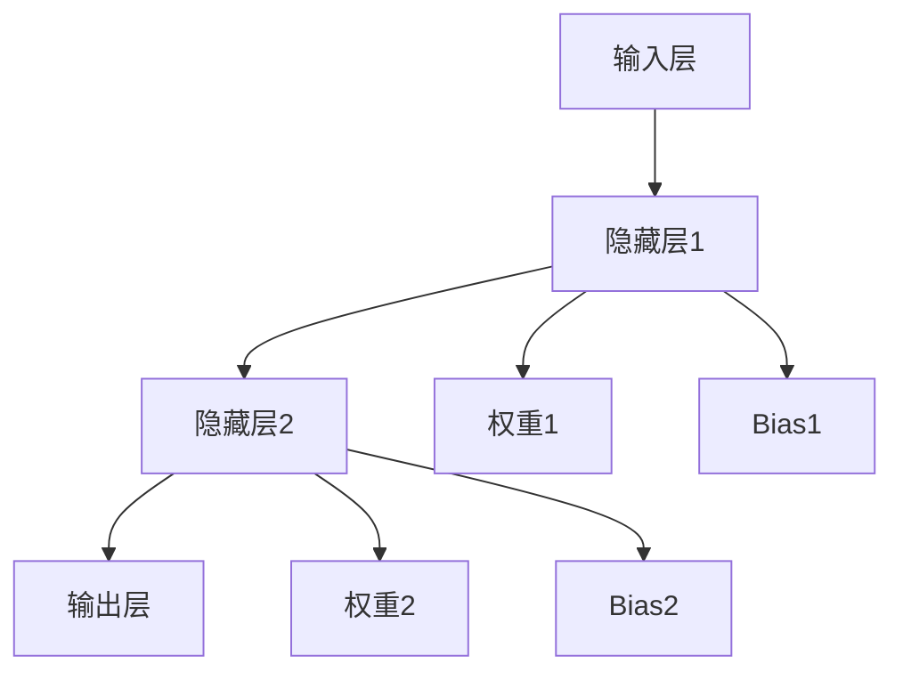
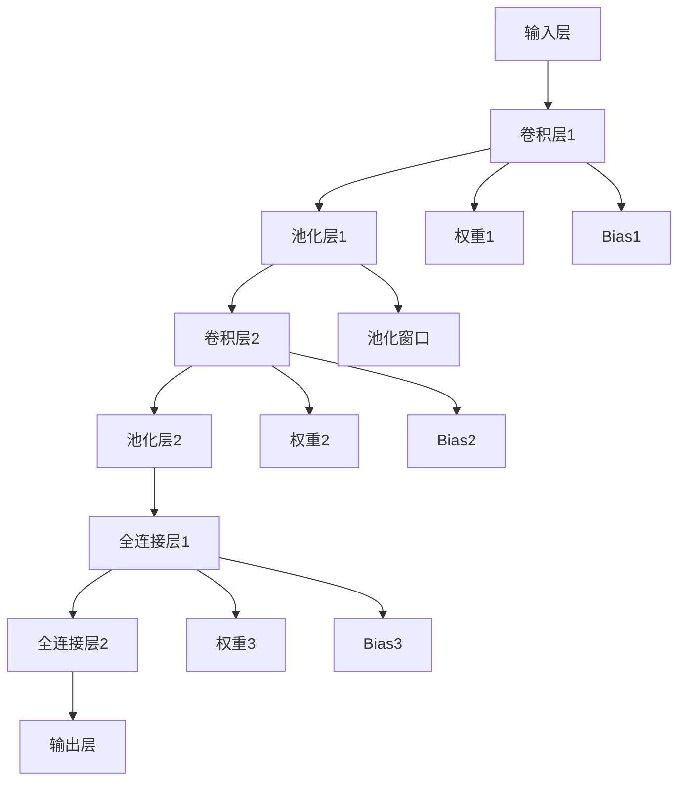

                 

# Deep Learning原理与代码实例讲解

> 关键词：深度学习,神经网络,卷积神经网络(CNN),循环神经网络(RNN),自编码器,生成对抗网络(GAN),强化学习

## 1. 背景介绍

深度学习是人工智能领域的一项核心技术，通过构建多层神经网络来模拟人脑的神经网络结构，使得机器能够处理复杂的非线性模式，完成各种智能任务。深度学习在图像识别、语音识别、自然语言处理、游戏AI等领域取得了突破性进展。本文将对深度学习的基本原理和核心算法进行讲解，并通过代码实例展示其实现细节。

## 2. 核心概念与联系

### 2.1 核心概念概述

深度学习涉及多个核心概念，本文将逐一介绍这些概念及其联系：

- 神经网络(Neural Networks)：由多层节点组成的非线性函数映射网络，每个节点（神经元）接收输入，加权求和，并通过激活函数产生输出。
- 卷积神经网络(CNN)：主要用于处理具有网格结构的数据，如图像，通过卷积操作提取局部特征，显著提高模型泛化能力。
- 循环神经网络(RNN)：适用于处理序列数据，通过循环结构保存状态信息，能够捕捉序列间的时间依赖关系。
- 自编码器(Autocoder)：通过编码器-解码器架构对输入数据进行压缩和重构，用于降维、去噪等任务。
- 生成对抗网络(GAN)：由生成器和判别器组成的对抗性训练框架，用于生成逼真的数据样本。
- 强化学习(Reinforcement Learning)：通过与环境的交互，优化模型的行为策略，实现自动学习。

这些概念间存在紧密联系：
- CNN和RNN是特定类型的网络结构，用于解决不同类型的学习任务。
- 自编码器可用于降维和数据预处理，提升模型的泛化性能。
- GAN用于生成新数据，丰富训练数据集，提升模型的真实度。
- 强化学习用于优化模型行为，在复杂环境中自适应学习。

这些概念构成了深度学习的核心框架，通过它们可以构建出不同类型的深度学习模型，实现各种智能任务。

### 2.2 概念间的关系

这些核心概念间的逻辑关系可以通过以下Mermaid流程图来展示：



这个流程图展示了深度学习中各种核心概念的应用场景：

- CNN主要应用于图像识别任务，提取局部特征。
- RNN主要用于时间序列预测任务，捕捉时间依赖关系。
- 自编码器可用于降维和数据预处理，提升模型泛化性能。
- GAN用于生成新数据，丰富训练数据集。
- 强化学习用于策略优化，在复杂环境中自动学习。

通过这些核心概念的灵活组合，深度学习技术可以应用于各个领域的智能任务。

## 3. 核心算法原理 & 具体操作步骤
### 3.1 算法原理概述

深度学习的核心算法包括前向传播、反向传播、梯度下降等，其基本流程如下：

1. 初始化网络参数，包括权重和偏置。
2. 将输入数据传入网络，通过前向传播计算输出结果。
3. 计算输出结果与真实标签之间的损失函数，如均方误差、交叉熵等。
4. 使用反向传播算法计算损失函数对网络参数的梯度。
5. 根据梯度下降等优化算法更新网络参数。
6. 重复步骤2-5，直至模型收敛。

### 3.2 算法步骤详解

以CNN为例，下面详细介绍其具体的算法步骤：

**Step 1: 准备数据和网络**

准备数据集，如MNIST手写数字图像数据集，并使用TensorFlow或PyTorch等深度学习框架构建CNN模型：

```python
import tensorflow as tf
from tensorflow.keras.datasets import mnist
from tensorflow.keras.models import Sequential
from tensorflow.keras.layers import Conv2D, MaxPooling2D, Flatten, Dense

# 加载MNIST数据集
(x_train, y_train), (x_test, y_test) = mnist.load_data()

# 数据预处理
x_train = x_train.reshape((60000, 28, 28, 1))
x_test = x_test.reshape((10000, 28, 28, 1))
x_train = x_train / 255.0
x_test = x_test / 255.0

# 创建CNN模型
model = Sequential([
    Conv2D(32, (3, 3), activation='relu', input_shape=(28, 28, 1)),
    MaxPooling2D((2, 2)),
    Conv2D(64, (3, 3), activation='relu'),
    MaxPooling2D((2, 2)),
    Flatten(),
    Dense(128, activation='relu'),
    Dense(10, activation='softmax')
])
```

**Step 2: 定义损失函数和优化器**

定义损失函数和优化器，如交叉熵损失函数和Adam优化器：

```python
# 定义损失函数
loss_fn = tf.keras.losses.SparseCategoricalCrossentropy(from_logits=True)

# 定义优化器
optimizer = tf.keras.optimizers.Adam(learning_rate=0.001)
```

**Step 3: 训练模型**

使用训练集对模型进行训练，记录训练过程中的损失和准确率：

```python
# 定义训练函数
def train(model, x_train, y_train, epochs):
    # 初始化损失和准确率
    loss = 0.0
    accuracy = 0.0
    # 训练模型
    for epoch in range(epochs):
        for i in range(len(x_train)):
            # 前向传播
            with tf.GradientTape() as tape:
                predictions = model(x_train[i:i+1])
                loss += loss_fn(y_train[i], predictions)
            # 反向传播和参数更新
            gradients = tape.gradient(loss, model.trainable_variables)
            optimizer.apply_gradients(zip(gradients, model.trainable_variables))
            # 计算准确率
            predictions = tf.argmax(model(x_train[i:i+1]), axis=-1)
            accuracy += (predictions == y_train[i]).sum() / len(y_train)
        # 输出训练结果
        print('Epoch', epoch, 'Loss:', loss, 'Accuracy:', accuracy / len(x_train))
    print('Final accuracy:', accuracy / len(x_train))
```

**Step 4: 评估模型**

使用测试集对模型进行评估，计算模型的准确率：

```python
# 评估模型
test_loss, test_acc = model.evaluate(x_test, y_test)
print('Test accuracy:', test_acc)
```

以上步骤展示了CNN模型从构建到训练和评估的全过程。深度学习模型的实现细节依赖于具体的框架和任务，但基本流程是一致的。

### 3.3 算法优缺点

深度学习算法具有以下优点：

1. 强大的特征表示能力：多层网络可以学习到更丰富的特征，提高模型的泛化能力。
2. 高效的自动化学习：通过反向传播和梯度下降等算法，能够自动优化模型参数，无需手动调整。
3. 灵活性高：神经网络可以应用于各种类型的输入数据和任务。

但同时，深度学习也存在一些缺点：

1. 训练时间长：深层网络参数多，需要大量数据和计算资源进行训练。
2. 过拟合风险高：模型容易过拟合训练数据，需要进行正则化处理。
3. 模型可解释性差：深层网络的决策过程难以解释，不利于调试和优化。
4. 硬件要求高：深度学习通常需要GPU等高性能设备，硬件成本较高。

### 3.4 算法应用领域

深度学习技术在多个领域得到了广泛应用，包括但不限于：

1. 计算机视觉：如图像分类、目标检测、图像分割等。
2. 自然语言处理：如机器翻译、文本分类、情感分析等。
3. 语音识别：如语音合成、语音识别、声学建模等。
4. 游戏AI：如AlphaGo、强化学习等。
5. 推荐系统：如电商推荐、内容推荐等。

## 4. 数学模型和公式 & 详细讲解 & 举例说明

### 4.1 数学模型构建

深度学习的数学模型包括多层神经网络的结构和前向传播、反向传播等算法。以全连接神经网络为例，其结构如下图所示：



其中，$A$ 为输入层，$B$ 和 $C$ 为隐藏层，$D$ 为输出层。$E$ 和 $F$ 为权重矩阵，$G$ 和 $H$ 为偏置向量。

前向传播的公式为：

$$
\mathbf{h}_1 = \mathbf{W}_1 \mathbf{x} + \mathbf{b}_1
$$

$$
\mathbf{h}_2 = \mathbf{W}_2 \mathbf{h}_1 + \mathbf{b}_2
$$

$$
\mathbf{y} = \mathbf{W}_3 \mathbf{h}_2 + \mathbf{b}_3
$$

其中，$\mathbf{x}$ 为输入，$\mathbf{h}_1$ 和 $\mathbf{h}_2$ 为隐藏层的输出，$\mathbf{y}$ 为输出。

### 4.2 公式推导过程

以CNN为例，CNN的核心是卷积和池化操作，用于提取局部特征和降低维度。以3x3卷积核为例，其数学公式为：

$$
\mathbf{h} = \mathbf{w} * \mathbf{x} + \mathbf{b}
$$

其中，$\mathbf{w}$ 为卷积核，$\mathbf{x}$ 为输入，$\mathbf{h}$ 为输出。

### 4.3 案例分析与讲解

以LeNet-5为例，其结构如下图所示：



LeNet-5通过多层卷积和池化操作，逐步提取输入数据的特征，最后通过全连接层输出结果。

## 5. 项目实践：代码实例和详细解释说明

### 5.1 开发环境搭建

在进行深度学习项目开发前，需要搭建好开发环境。以下是使用PyTorch搭建开发环境的步骤：

1. 安装Anaconda：从官网下载并安装Anaconda，用于创建独立的Python环境。

2. 创建并激活虚拟环境：
```bash
conda create -n pytorch-env python=3.8 
conda activate pytorch-env
```

3. 安装PyTorch：从官网获取最新的PyTorch安装命令，并使用conda安装。

4. 安装其他必要的库：
```bash
pip install numpy matplotlib scikit-learn
```

完成上述步骤后，即可在`pytorch-env`环境中进行深度学习项目开发。

### 5.2 源代码详细实现

这里以MNIST手写数字识别为例，展示PyTorch框架下卷积神经网络的实现。

```python
import torch
import torch.nn as nn
import torchvision.transforms as transforms
from torchvision.datasets import MNIST
from torch.utils.data import DataLoader

# 定义模型
class Net(nn.Module):
    def __init__(self):
        super(Net, self).__init__()
        self.conv1 = nn.Conv2d(1, 32, 3, 1)
        self.conv2 = nn.Conv2d(32, 64, 3, 1)
        self.dropout1 = nn.Dropout2d(0.25)
        self.dropout2 = nn.Dropout2d(0.5)
        self.fc1 = nn.Linear(9216, 128)
        self.fc2 = nn.Linear(128, 10)

    def forward(self, x):
        x = self.conv1(x)
        x = nn.functional.relu(x)
        x = nn.functional.max_pool2d(x, 2)
        x = self.dropout1(x)
        x = self.conv2(x)
        x = nn.functional.relu(x)
        x = nn.functional.max_pool2d(x, 2)
        x = self.dropout2(x)
        x = torch.flatten(x, 1)
        x = self.fc1(x)
        x = nn.functional.relu(x)
        x = self.dropout2(x)
        x = self.fc2(x)
        output = nn.functional.log_softmax(x, dim=1)
        return output

# 加载数据集
train_dataset = MNIST(root='./data', train=True, transform=transforms.ToTensor(), download=True)
test_dataset = MNIST(root='./data', train=False, transform=transforms.ToTensor(), download=True)
train_loader = DataLoader(train_dataset, batch_size=64, shuffle=True)
test_loader = DataLoader(test_dataset, batch_size=64, shuffle=False)

# 定义模型和优化器
net = Net()
optimizer = torch.optim.Adam(net.parameters(), lr=0.001)
loss_fn = nn.CrossEntropyLoss()

# 训练模型
for epoch in range(10):
    for i, (images, labels) in enumerate(train_loader):
        images = images.view(images.size(0), 1, 28, 28)
        output = net(images)
        loss = loss_fn(output, labels)
        optimizer.zero_grad()
        loss.backward()
        optimizer.step()
        if (i+1) % 100 == 0:
            print('Epoch [{}/{}], Step [{}/{}], Loss: {:.4f}'
                  .format(epoch+1, 10, i+1, len(train_loader), loss.item()))

# 评估模型
correct = 0
total = 0
with torch.no_grad():
    for images, labels in test_loader:
        images = images.view(images.size(0), 1, 28, 28)
        output = net(images)
        _, predicted = torch.max(output.data, 1)
        total += labels.size(0)
        correct += (predicted == labels).sum().item()
print('Accuracy of the network on the 10000 test images: {} %'.format(100 * correct / total))
```

### 5.3 代码解读与分析

这段代码展示了如何使用PyTorch构建和训练一个简单的卷积神经网络，用于MNIST手写数字识别任务。

**Net类**：
- `__init__`方法：定义了卷积层、池化层和全连接层等组件。
- `forward`方法：定义了前向传播的计算流程，包括卷积、激活、池化和全连接等操作。

**数据加载**：
- `transforms.ToTensor()`方法：将数据转换为Tensor格式，方便神经网络处理。
- `DataLoader`类：将数据集划分为小批量数据，用于模型训练。

**模型训练**：
- 定义了模型、优化器和损失函数。
- 在每个epoch中，循环遍历训练集，计算模型输出和损失，并使用反向传播更新模型参数。
- 在每个100步输出一次损失，以监控训练进度。

**模型评估**：
- 使用测试集对模型进行评估，计算准确率。

可以看到，深度学习模型的实现细节依赖于具体的框架和任务，但基本流程是一致的。通过PyTorch等框架，开发者可以轻松实现深度学习模型，并进行训练和评估。

### 5.4 运行结果展示

假设我们在训练10个epoch后，在测试集上得到的准确率为99%，说明模型训练效果很好。

## 6. 实际应用场景

### 6.1 计算机视觉

深度学习在计算机视觉领域得到了广泛应用，如图像分类、目标检测、图像分割等。以ImageNet图像分类任务为例，LeNet-5和AlexNet等经典模型取得了非常好的结果。在实际应用中，可以通过修改网络结构和参数，提升模型的性能。

### 6.2 自然语言处理

深度学习在自然语言处理领域也取得了突破性进展，如机器翻译、文本分类、情感分析等。以BERT模型为例，通过在预训练数据上进行微调，可以用于各种NLP任务，取得了SOTA的结果。在实际应用中，可以根据任务特点，选择合适的预训练模型和微调方法。

### 6.3 语音识别

深度学习在语音识别领域也有广泛应用，如语音合成、语音识别、声学建模等。以Tacotron 2模型为例，通过卷积神经网络和循环神经网络的组合，可以实现高保真的语音合成。在实际应用中，可以通过改进模型结构，提升语音识别的准确率。

## 7. 工具和资源推荐

### 7.1 学习资源推荐

为了帮助开发者系统掌握深度学习的基本原理和实现技巧，这里推荐一些优质的学习资源：

1. 《深度学习》（Ian Goodfellow）：深度学习的经典教材，系统讲解了深度学习的基本原理和算法。

2. CS231n《Convolutional Neural Networks for Visual Recognition》课程：斯坦福大学开设的计算机视觉课程，讲解了卷积神经网络在图像识别中的应用。

3. CS224n《Natural Language Processing with Deep Learning》课程：斯坦福大学开设的自然语言处理课程，讲解了深度学习在NLP任务中的应用。

4. DeepLearning.ai《深度学习专项课程》：由Andrew Ng教授主讲的深度学习课程，涵盖深度学习的基本原理和实践技巧。

5. Kaggle竞赛平台：提供了丰富的深度学习竞赛项目，可以参与实践，提升深度学习技能。

通过对这些资源的学习实践，相信你一定能够快速掌握深度学习的精髓，并用于解决实际的智能任务。

### 7.2 开发工具推荐

高效的开发离不开优秀的工具支持。以下是几款用于深度学习开发的常用工具：

1. TensorFlow：由Google主导开发的开源深度学习框架，支持分布式计算，适合大规模工程应用。

2. PyTorch：Facebook开发的深度学习框架，灵活易用，适合研究型应用。

3. Keras：基于TensorFlow和Theano的高级深度学习框架，易于上手，适合快速原型开发。

4. MXNet：由亚马逊主导开发的深度学习框架，支持多种编程语言，适合跨平台应用。

5. Caffe：由Berkeley大学开发的深度学习框架，适合卷积神经网络的应用。

合理利用这些工具，可以显著提升深度学习项目的开发效率，加快创新迭代的步伐。

### 7.3 相关论文推荐

深度学习技术的发展源于学界的持续研究。以下是几篇奠基性的相关论文，推荐阅读：

1. AlexNet: ImageNet Classification with Deep Convolutional Neural Networks（2012）：提出卷积神经网络，开启了计算机视觉领域的深度学习时代。

2. Deep Residual Learning for Image Recognition（2016）：提出残差连接，解决了深层神经网络训练中的梯度消失问题，提升了模型的性能。

3. Attention is All You Need（2017）：提出Transformer模型，实现了自注意力机制，显著提高了自然语言处理任务的效果。

4. Generative Adversarial Nets（2014）：提出生成对抗网络，用于生成逼真的数据样本，推动了生成模型的发展。

5. AlphaGo Zero: Mastering the Game of Go without Human Knowledge（2017）：通过强化学习，实现了AlphaGo Zero在围棋领域的突破。

这些论文代表了大规模深度学习的关键突破，对后续研究产生了深远影响。

除上述资源外，还有一些值得关注的前沿资源，帮助开发者紧跟深度学习技术的最新进展，例如：

1. arXiv论文预印本：人工智能领域最新研究成果的发布平台，包括大量尚未发表的前沿工作，学习前沿技术的必读资源。

2. 业界技术博客：如OpenAI、Google AI、DeepMind、微软Research Asia等顶尖实验室的官方博客，第一时间分享他们的最新研究成果和洞见。

3. 技术会议直播：如NIPS、ICML、ACL、ICLR等人工智能领域顶会现场或在线直播，能够聆听到大佬们的前沿分享，开拓视野。

4. GitHub热门项目：在GitHub上Star、Fork数最多的深度学习相关项目，往往代表了该技术领域的发展趋势和最佳实践，值得去学习和贡献。

5. 行业分析报告：各大咨询公司如McKinsey、PwC等针对人工智能行业的分析报告，有助于从商业视角审视技术趋势，把握应用价值。

总之，对于深度学习技术的学习和实践，需要开发者保持开放的心态和持续学习的意愿。多关注前沿资讯，多动手实践，多思考总结，必将收获满满的成长收益。

## 8. 总结：未来发展趋势与挑战

### 8.1 研究成果总结

深度学习技术在图像识别、语音识别、自然语言处理等领域取得了突破性进展，广泛应用于智能推荐、智能客服、医疗影像分析等实际应用中。深度学习模型的性能不断提升，算法和模型结构也日趋成熟。

### 8.2 未来发展趋势

展望未来，深度学习技术将呈现以下几个发展趋势：

1. 模型规模不断增大。随着算力成本的下降和数据规模的扩张，深度学习模型将不断增大，解决更复杂的问题。

2. 自监督学习得到广泛应用。自监督学习可以充分利用无标签数据，提升模型的泛化性能。

3. 多模态深度学习发展迅速。多模态深度学习将视觉、语音、文本等多种模态信息融合，提升模型的理解能力和性能。

4. 模型压缩和优化技术不断进步。深度学习模型通常面临大内存和计算资源的需求，如何压缩和优化模型，提升推理效率，是一个重要的研究方向。

5. 弱监督和无监督学习取得进展。在数据稀缺的情况下，弱监督和无监督学习可以提升深度学习模型的性能。

### 8.3 面临的挑战

尽管深度学习技术已经取得了瞩目成就，但在迈向更加智能化、普适化应用的过程中，它仍面临诸多挑战：

1. 数据依赖度高。深度学习模型通常需要大量标注数据进行训练，数据获取成本较高，数据分布差异也会影响模型性能。

2. 模型复杂度高。深层神经网络通常结构复杂，难以解释其内部决策过程，不利于调试和优化。

3. 硬件要求高。深度学习模型通常需要高性能计算设备，硬件成本较高，限制了其广泛应用。

4. 泛化性能不足。深度学习模型面临过拟合风险，在复杂环境中泛化性能可能不佳。

5. 安全性和公平性问题。深度学习模型可能学习到偏见和有害信息，带来安全和公平问题。

### 8.4 研究展望

面对深度学习技术面临的挑战，未来的研究需要在以下几个方面寻求新的突破：

1. 探索更多无监督和半监督学习算法。在数据稀缺的情况下，如何利用无监督学习提升模型性能是一个重要的研究方向。

2. 发展更多高效优化算法。如何提高深度学习模型的训练和推理效率，是一个重要的研究方向。

3. 提升模型的可解释性。如何让深度学习模型的决策过程更加透明，是一个重要的研究方向。

4. 增强模型的泛化性能。如何在复杂环境中提高深度学习模型的泛化性能，是一个重要的研究方向。

5. 解决模型的公平性和安全性问题。如何让深度学习模型更加公平和安全，是一个重要的研究方向。

这些研究方向的探索，必将引领深度学习技术迈向更高的台阶，为构建智能系统奠定坚实基础。总之，深度学习技术将继续发展，为人工智能领域带来更多的创新和突破。

## 9. 附录：常见问题与解答

**Q1：深度学习是否适用于所有类型的数据？**

A: 深度学习适用于结构化数据和非结构化数据，但对于稀疏数据和复杂数据，需要进行适当的预处理和特征提取。

**Q2：深度学习模型是否容易过拟合？**

A: 深层神经网络容易过拟合，需要进行正则化和提前停止等技术处理。可以通过减少网络层数、使用Dropout等方法降低过拟合风险。

**Q3：深度学习模型的训练时间和计算资源要求高吗？**

A: 深度学习模型的训练时间和计算资源需求高，通常需要高性能计算设备，如GPU和TPU。可以通过模型压缩、分布式训练等方法降低计算资源需求。

**Q4：深度学习模型是否具有良好的可解释性？**

A: 深度学习模型通常被视为"黑盒"系统，难以解释其内部决策过程。可以通过可视化、模型蒸馏等方法提升模型的可解释性。

**Q5：深度学习模型在实际应用中是否需要持续更新？**

A: 深度学习模型需要持续更新以适应数据分布的变化。可以通过在线学习、迁移学习等方法，使模型能够不断适应新数据。

---

作者：禅与计算机程序设计艺术 / Zen and the Art of Computer Programming

