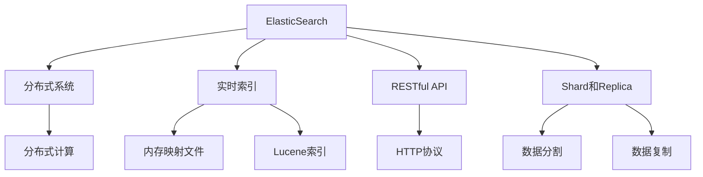

                 

# ElasticSearch 原理与代码实例讲解

> 关键词：ElasticSearch, 搜索引擎, 分布式系统, RESTful API, 搜索算法, 代码实例, 部署实践

## 1. 背景介绍

### 1.1 问题由来
随着互联网数据的急剧增长，如何高效地存储和查询这些数据成为一项重大挑战。传统的关系型数据库和搜索系统已经难以满足高并发、大容量、低延迟的实时查询需求。ElasticSearch（以下简称ES）是一个高性能、可扩展、分布式、实时的搜索和分析引擎，由Shay Green、Dilip Goswami和Elastic首席科学家Danny broad在2009年创办，旨在为海量数据提供快速、灵活、实时的搜索和分析能力。

ES的应用范围非常广泛，包括但不限于电商搜索、社交媒体分析、日志分析、时间序列数据管理等。其高性能和分布式特性使其成为全球顶级公司如Amazon、Netflix、Twitter等的重要技术组件。

### 1.2 问题核心关键点
ElasticSearch的核心技术包括分布式架构、实时索引、RESTful API、Shard和Replica机制等。

- 分布式架构：ES采用分布式计算框架，能够在多个节点上并行处理查询请求，提升了系统的高可用性和扩展性。
- 实时索引：ES通过内存映射文件和Lucene索引库，实现数据的快速读取和索引，支持实时搜索和分析。
- RESTful API：ES提供简单易用的RESTful API，使得开发人员能够通过HTTP请求实现数据的增删改查和高级搜索。
- Shard和Replica机制：ES将数据分为多个Shard（分片），并通过Replica（副本）机制，保证数据的冗余和可靠性。

### 1.3 问题研究意义
ElasticSearch的核心技术为大数据搜索和分析提供了可靠、高效的解决方案。通过学习ES的核心原理和实践经验，开发者可以更好地设计和实现自己的分布式搜索系统，提升应用的性能和可靠性。

## 2. 核心概念与联系

### 2.1 核心概念概述

为了更好地理解ElasticSearch的工作原理和优化方法，我们需要首先掌握以下几个核心概念：

- ElasticSearch：基于Lucene搜索引擎的分布式搜索和分析引擎，提供高效的搜索、聚合、分析和可视化能力。
- 分布式系统：由多个节点组成，通过分布式计算和数据复制，提高系统的可靠性和扩展性。
- RESTful API：基于HTTP协议，提供标准的增删改查和高级搜索API。
- Shard和Replica：将数据分割为多个Shard，并通过Replica机制，保证数据的冗余和可靠性。

这些核心概念构成了ElasticSearch的技术基础，通过深入理解这些概念，我们才能更好地掌握ElasticSearch的核心思想和优化方法。

### 2.2 概念间的关系

以下是一个Mermaid流程图，展示了ElasticSearch的核心概念及其之间的关系：



这个流程图展示了ElasticSearch的核心概念及其之间的关系：

- ElasticSearch基于分布式系统，通过分布式计算提升系统的扩展性和可靠性。
- 实时索引通过内存映射文件和Lucene索引库，实现数据的快速读取和索引，支持实时搜索和分析。
- RESTful API提供简单易用的HTTP接口，方便开发人员进行数据操作。
- Shard和Replica机制通过数据分割和复制，保证数据的冗余和可靠性。

## 3. 核心算法原理 & 具体操作步骤
### 3.1 算法原理概述

ElasticSearch的核心算法原理主要包括以下几个方面：

- 分布式存储和计算：ElasticSearch采用分布式架构，通过多个节点并行处理查询请求，提升系统性能和可靠性。
- 实时索引和搜索：ElasticSearch利用内存映射文件和Lucene索引库，实现数据的快速读取和索引，支持实时搜索和分析。
- 高效的数据聚合和分析：ElasticSearch支持多种聚合操作，如分组聚合、嵌套聚合、滚动窗口聚合等，能够高效地进行数据统计和分析。

### 3.2 算法步骤详解

以下是ElasticSearch的核心算法步骤详解：

1. **分布式存储和计算**：
   - 数据分片（Sharding）：ElasticSearch将数据分割为多个Shard（分片），并分配到不同的节点上进行存储和计算。
   - 数据副本（Replica）：每个Shard生成多个Replica（副本），以提高数据的冗余和可靠性。
   - 分布式计算：每个节点可以独立计算并返回结果，最终通过聚合得到全局结果。

2. **实时索引和搜索**：
   - 内存映射文件：ElasticSearch将数据以内存映射文件的形式存储在节点中，实现快速读取和索引。
   - Lucene索引库：ElasticSearch使用Apache Lucene索引库，实现高效的索引和搜索功能。
   - 倒排索引：Lucene的倒排索引技术，使得ElasticSearch能够高效地进行关键词搜索和文本分析。

3. **高效的数据聚合和分析**：
   - 分组聚合：ElasticSearch支持基于字段的分组聚合操作，方便进行数据分组统计。
   - 嵌套聚合：ElasticSearch支持嵌套聚合操作，方便处理复杂的层次结构数据。
   - 滚动窗口聚合：ElasticSearch支持滚动窗口聚合操作，方便处理时间序列数据。

### 3.3 算法优缺点

ElasticSearch的核心算法具有以下优点：

- 高性能：通过分布式计算和实时索引，ElasticSearch能够高效地处理大规模数据，实现低延迟的实时搜索和分析。
- 高可用性：通过Shard和Replica机制，ElasticSearch能够保证数据的冗余和可靠性，提高系统的可用性和容错性。
- 可扩展性：通过分布式架构和Shard机制，ElasticSearch能够轻松地扩展数据容量和处理能力。

同时，ElasticSearch也存在一些缺点：

- 数据存储成本高：由于Shard和Replica机制，ElasticSearch需要大量的存储资源，成本较高。
- 复杂配置：ElasticSearch的配置和管理相对复杂，需要一定的技术背景。
- 查询限制：虽然支持多种聚合操作，但一些复杂的查询可能需要编写自定义脚本或插件。

### 3.4 算法应用领域

ElasticSearch的核心算法在以下领域有着广泛的应用：

- 搜索引擎：ElasticSearch的高性能和实时搜索能力，使得其成为电商、社交媒体等领域的核心搜索引擎。
- 日志分析：ElasticSearch的数据聚合和分析能力，使其能够高效地处理和分析日志数据。
- 时间序列数据管理：ElasticSearch的滚动窗口聚合和数据聚合能力，使其能够处理时间序列数据。
- 大数据分析：ElasticSearch的高性能和分布式架构，使其能够处理大规模数据，支持各种数据分析任务。

## 4. 数学模型和公式 & 详细讲解 & 举例说明（备注：数学公式请使用latex格式，latex嵌入文中独立段落使用 $$，段落内使用 $)
### 4.1 数学模型构建

为了更好地理解ElasticSearch的搜索算法，我们将通过数学模型对其进行详细讲解。

假设我们有一个文档集$D=\{d_1, d_2, ..., d_N\}$，每个文档$d_i$包含多个字段$F_{i,j}$，其中$i$表示文档编号，$j$表示字段编号。我们希望搜索包含特定关键词$k$的文档，并返回相关性最高的$K$个文档。

### 4.2 公式推导过程

ElasticSearch的搜索算法主要基于Lucene的倒排索引技术，以下是对搜索算法的详细推导：

1. **倒排索引构建**：
   - 每个字段$F_{i,j}$构建一个倒排索引，记录包含该字段的文档编号。
   - 对于关键词$k$，记录所有包含该关键词的文档编号。

2. **文档评分**：
   - 对于每个文档$d_i$，计算其与关键词$k$的相关性评分$score_i$。
   - 相关性评分可以基于词频-逆文档频率（TF-IDF）、文档长度、相关文档的平均评分等。

3. **排序和返回**：
   - 根据文档评分$score_i$对文档进行排序。
   - 返回排序后前$K$个文档作为搜索结果。

### 4.3 案例分析与讲解

假设我们有一个包含多个学生成绩的文档集$D$，每个文档包含学生的姓名、班级、成绩等信息。我们需要搜索班级$C$中成绩最高的前$K$个学生，并计算其平均成绩。

使用ElasticSearch进行查询，代码如下：

```python
from elasticsearch import Elasticsearch

es = Elasticsearch()
query = {
    "query": {
        "bool": {
            "must": [
                {"term": {"class": "C"}},
                {"range": {"score": {"gt": 0}}},
            ],
        },
    },
    "sort": [{"score": "desc"}],
    "size": 10,
    "aggs": {
        "avg_score": {"avg": {"field": "score"}},
    },
}

result = es.search(index="students", body=query)
print(result["hits"]["total"]["value"])
print(result["aggregations"]["avg_score"]["value"])
```

以上代码首先创建了一个ElasticSearch客户端，然后定义了一个查询，该查询包括：

- 使用布尔查询（Bool Query）筛选班级为$C$且成绩大于$0$的文档。
- 使用排序（Sort）将文档按照成绩从高到低排序。
- 返回前$K=10$个文档，并计算平均成绩。

执行该查询后，ElasticSearch返回了符合条件的文档数和平均成绩。

## 5. 项目实践：代码实例和详细解释说明
### 5.1 开发环境搭建

在进行ElasticSearch项目实践前，我们需要准备好开发环境。以下是使用Python进行ElasticSearch开发的环境配置流程：

1. 安装Anaconda：从官网下载并安装Anaconda，用于创建独立的Python环境。

2. 创建并激活虚拟环境：
```bash
conda create -n elasticsearch-env python=3.8 
conda activate elasticsearch-env
```

3. 安装ElasticSearch-Py：
```bash
pip install elasticsearch
```

4. 安装其他必需工具包：
```bash
pip install pandas numpy scipy torch
```

完成上述步骤后，即可在`elasticsearch-env`环境中开始ElasticSearch项目实践。

### 5.2 源代码详细实现

以下是一个简单的Python代码实例，展示了如何向ElasticSearch中写入文档，并进行基本查询：

```python
from elasticsearch import Elasticsearch

es = Elasticsearch()

# 向索引中写入文档
doc = {
    "index": "my_index",
    "doc": {
        "_id": 1,
        "name": "Alice",
        "age": 25,
        "email": "alice@example.com"
    }
}
es.index(**doc)

# 查询索引中的所有文档
result = es.search(index="my_index")
print(result["hits"]["total"]["value"])
for hit in result["hits"]["hits"]:
    print(hit["_source"])
```

### 5.3 代码解读与分析

让我们再详细解读一下关键代码的实现细节：

- **安装Anaconda**：使用Anaconda创建虚拟环境，方便管理和隔离依赖。

- **安装ElasticSearch-Py**：使用pip安装ElasticSearch-Py，提供ElasticSearch的Python接口。

- **安装其他工具包**：安装pandas、numpy、scipy、torch等常用工具包，方便进行数据处理和可视化。

- **创建ElasticSearch客户端**：使用ElasticSearch-Py创建ElasticSearch客户端，用于与ElasticSearch进行通信。

- **向索引中写入文档**：使用`es.index`方法向索引`my_index`中写入文档，包括文档ID、字段名称和值等。

- **查询索引中的所有文档**：使用`es.search`方法查询索引`my_index`中的所有文档，返回文档总数和所有文档的JSON格式数据。

## 6. 实际应用场景
### 6.1 智能推荐系统

ElasticSearch的高效搜索和数据聚合能力，使其非常适合用于智能推荐系统。通过ElasticSearch，可以根据用户的历史行为数据，实时搜索和分析用户偏好，快速推荐最符合用户需求的物品。

在技术实现上，可以收集用户浏览、点击、评分等行为数据，并存储到ElasticSearch中。通过ElasticSearch的聚合操作，可以统计用户对不同物品的兴趣程度，并根据兴趣程度进行推荐排序。

### 6.2 实时日志分析

ElasticSearch的实时索引和数据聚合能力，使其非常适合用于日志分析。通过ElasticSearch，可以快速搜索和分析大规模日志数据，发现异常和瓶颈，优化系统性能。

在技术实现上，可以将日志数据实时写入ElasticSearch，并使用ElasticSearch的聚合操作，统计不同时间段、不同IP地址、不同错误代码等维度的日志数据。通过可视化工具，可以实时展示日志数据的趋势和变化，帮助运维人员快速定位问题。

### 6.3 电商搜索

ElasticSearch的高性能和实时搜索能力，使其非常适合用于电商搜索。通过ElasticSearch，可以快速搜索和匹配商品，提升用户体验和销售转化率。

在技术实现上，可以将商品信息存储到ElasticSearch中，并使用ElasticSearch的查询操作，搜索匹配关键词的商品。通过ElasticSearch的排序和分页操作，可以优化搜索结果的展示效果，提高用户满意度。

### 6.4 未来应用展望

随着ElasticSearch技术的不断发展，其在更多领域的应用前景将更加广阔。

在智慧城市治理中，ElasticSearch可以用于实时监测和分析城市事件，提供智能化预警和辅助决策支持。

在金融领域，ElasticSearch可以用于实时监控和分析金融市场数据，发现市场趋势和异常行为，帮助投资者进行风险控制和投资决策。

在医疗领域，ElasticSearch可以用于实时搜索和分析患者数据，提供精准的诊断和治疗建议。

## 7. 工具和资源推荐
### 7.1 学习资源推荐

为了帮助开发者系统掌握ElasticSearch的技术基础和实践技巧，这里推荐一些优质的学习资源：

1. **官方文档**：ElasticSearch官方文档，提供了丰富的API参考和示例代码，是学习和实践ElasticSearch的必备资料。

2. **Kibana**：ElasticSearch的可视化工具，提供实时数据展示和分析功能，方便进行数据探索和监控。

3. **ElasticSearch-Py**：ElasticSearch-Py官方文档，提供了Python客户端的详细说明和示例代码，方便进行Python开发。

4. **ES Deep Dive**：一本由Elastic官方出版的书籍，系统介绍了ElasticSearch的核心原理和实践经验，适合初学者和进阶者阅读。

5. **ElasticSearch for Dummies**：一本适合入门级的书籍，详细介绍了ElasticSearch的基本概念和操作技巧。

6. **ElasticSearch High Performance**：一本深入讲解ElasticSearch性能优化和最佳实践的书籍，适合有经验的开发人员阅读。

7. **ElasticSearch with Python**：一本专门讲解ElasticSearch-Py的使用技巧和实战案例的书籍，适合Python开发者使用。

### 7.2 开发工具推荐

高效的开发离不开优秀的工具支持。以下是几款用于ElasticSearch开发常用的工具：

1. **Visual Studio Code**：一款流行的开源代码编辑器，支持ElasticSearch-Py插件，方便进行ElasticSearch开发。

2. **Jupyter Notebook**：一款交互式笔记本工具，支持Python和ElasticSearch-Py的集成，方便进行实时数据探索和可视化。

3. **Kibana**：一款开源的可视化工具，支持ElasticSearch的数据导入和展示，方便进行数据探索和监控。

4. **ElasticSearch-Py**：官方提供的Python客户端，提供了丰富的API接口和示例代码，方便进行Python开发。

5. **ElasticSearch Monitoring**：一款监控工具，支持实时监控ElasticSearch的集群状态和性能指标，帮助维护ElasticSearch集群。

### 7.3 相关论文推荐

ElasticSearch的核心技术源于学界的持续研究。以下是几篇奠基性的相关论文，推荐阅读：

1. **An Introduction to Lucene and Elasticsearch**：介绍Lucene和ElasticSearch的基本原理和实现方法，适合初学者阅读。

2. **A Real-Time Indexing Algorithm for Elasticsearch**：介绍ElasticSearch的实时索引算法和实现机制，适合进阶开发者阅读。

3. **Scalable Indexing and Searching in Elasticsearch**：介绍ElasticSearch的分布式架构和数据分片机制，适合研究分布式系统的人员阅读。

4. **ElasticSearch in Practice**：介绍ElasticSearch的实际应用案例和最佳实践，适合有经验的开发人员阅读。

5. **Search Performance Tuning for Elasticsearch**：介绍ElasticSearch的性能优化技巧和最佳实践，适合追求高性能的开发人员阅读。

## 8. 总结：未来发展趋势与挑战
### 8.1 研究成果总结

ElasticSearch作为一款高性能、可扩展、实时的搜索和分析引擎，已经在多个领域得到了广泛应用。其分布式架构、实时索引和搜索算法、数据聚合和分析能力，使其成为大规模数据搜索和分析的理想选择。

### 8.2 未来发展趋势

展望未来，ElasticSearch的发展趋势将包括以下几个方面：

1. **更大规模的集群**：随着大数据和云计算的发展，ElasticSearch集群规模将不断扩大，实现更高效的分布式计算和数据存储。

2. **更丰富的聚合操作**：ElasticSearch将不断扩展其聚合操作，支持更复杂的数据分析和统计。

3. **更强大的查询语言**：ElasticSearch将不断改进其查询语言，支持更灵活的查询和过滤操作。

4. **更高效的搜索算法**：ElasticSearch将不断优化其搜索算法，提升搜索性能和实时性。

5. **更友好的开发体验**：ElasticSearch将不断优化其API和工具，提供更友好的开发体验。

### 8.3 面临的挑战

尽管ElasticSearch在搜索和分析领域取得了显著成果，但其发展仍面临一些挑战：

1. **数据存储成本高**：ElasticSearch需要大量的存储资源，成本较高，如何优化数据存储和压缩技术，降低存储成本，将是未来的一个重要研究方向。

2. **系统复杂度高**：ElasticSearch的配置和管理相对复杂，如何简化配置和管理流程，提高用户友好性，将是未来的重要研究方向。

3. **查询性能瓶颈**：ElasticSearch在高并发和大规模数据下的查询性能仍存在瓶颈，如何提升查询性能，优化查询算法，将是未来的重要研究方向。

4. **多语言支持不足**：ElasticSearch目前仅支持英文搜索，如何扩展到多语言搜索，支持更多的语言和字符集，将是未来的重要研究方向。

5. **安全性和隐私保护**：ElasticSearch需要面对数据安全和隐私保护的问题，如何提升数据安全和隐私保护能力，将是未来的重要研究方向。

### 8.4 研究展望

面对ElasticSearch面临的挑战，未来的研究需要在以下几个方面寻求新的突破：

1. **分布式存储和计算**：探索更高效的数据分片和副本机制，提高系统的可扩展性和可靠性。

2. **实时索引和搜索**：优化实时索引和搜索算法，提高系统的实时性和查询性能。

3. **数据聚合和分析**：扩展聚合操作，支持更复杂的数据统计和分析，提高系统的数据处理能力。

4. **查询语言和算法**：改进查询语言和算法，支持更灵活的查询和过滤操作，提升查询性能和用户体验。

5. **多语言支持和国际化**：扩展到多语言搜索，支持更多的语言和字符集，提高系统的国际化能力。

6. **安全性和隐私保护**：加强数据安全和隐私保护，提升系统的安全性和可靠性。

通过这些研究方向的探索，ElasticSearch必将在未来继续引领搜索和分析领域的发展，为大规模数据处理和实时搜索提供更加强大的支持。

## 9. 附录：常见问题与解答
### Q1：ElasticSearch的索引和分片是什么？

A: ElasticSearch的索引（Index）是数据的容器，类似于数据库的表。每个索引包含多个文档（Document），每个文档包含多个字段（Field）。ElasticSearch的文档可以动态添加和删除，方便进行数据增删改查。

ElasticSearch的分片（Shard）是索引的一部分，用于分布式计算和存储。每个索引可以划分为多个Shard，每个Shard包含索引的一部分数据。Shard的数量取决于数据量大小和集群配置，通常每个Shard存储100MB到10GB的数据。

### Q2：ElasticSearch如何实现实时索引？

A: ElasticSearch通过内存映射文件和Lucene索引库实现实时索引。内存映射文件将数据存储在内存中，实现快速读取和索引。Lucene索引库实现高效的倒排索引和搜索功能，支持关键词搜索和文本分析。

ElasticSearch将数据以内存映射文件的形式存储在节点中，并使用Lucene索引库进行索引和搜索。每个节点可以独立计算并返回结果，最终通过聚合得到全局结果。

### Q3：ElasticSearch如何进行分布式计算？

A: ElasticSearch通过Shard和Replica机制实现分布式计算。每个索引被划分为多个Shard，并分配到不同的节点上进行存储和计算。每个Shard生成多个Replica（副本），以提高数据的冗余和可靠性。

ElasticSearch将每个Shard分配到不同的节点上进行计算，每个节点可以独立计算并返回结果，最终通过聚合得到全局结果。每个Shard生成多个Replica（副本），以提高数据的冗余和可靠性。

### Q4：ElasticSearch的查询语言和查询操作有哪些？

A: ElasticSearch提供了丰富的查询语言和查询操作，包括：

- 布尔查询（Bool Query）：用于组合多个查询条件。
- 匹配查询（Match Query）：用于查询包含特定关键词的文档。
- 短语查询（Phrase Query）：用于查询包含特定短语或单词序列的文档。
- 范围查询（Range Query）：用于查询符合特定范围的数值字段。
- 嵌套查询（Nested Query）：用于查询嵌套字段的文档。
- 分页查询（Pagination Query）：用于分页显示搜索结果。

以上查询操作可以通过ElasticSearch的RESTful API进行调用，方便进行数据增删改查和高级搜索。

### Q5：ElasticSearch的聚合操作有哪些？

A: ElasticSearch支持多种聚合操作，包括：

- 分组聚合（Group Aggregation）：用于按照某个字段进行分组统计。
- 嵌套聚合（Nested Aggregation）：用于处理嵌套字段的数据聚合。
- 滚动窗口聚合（Rollup Aggregation）：用于处理时间序列数据，支持滑动窗口聚合。

ElasticSearch的聚合操作可以通过RESTful API进行调用，方便进行数据统计和分析。

---

作者：禅与计算机程序设计艺术 / Zen and the Art of Computer Programming

