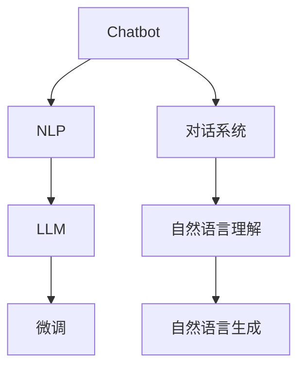

                 

# LLM-based Chatbot System Evaluation

> 关键词：聊天机器人,自然语言处理(NLP),预训练模型,微调,Fine-tuning,对话系统,评估指标,系统可靠性,用户体验

## 1. 背景介绍

随着人工智能技术的发展，聊天机器人（Chatbot）已经逐渐成为了各个行业的重要应用工具，广泛应用于客服、教育、医疗、娱乐等各个领域。作为一种基于自然语言处理（Natural Language Processing，NLP）技术的人机交互方式，聊天机器人通过理解用户输入的自然语言，并提供相应的回应，实现了类似真人对话的体验。尽管聊天机器人的技术已经取得了长足的进步，但其系统评估仍是一个热门话题。本文将从聊天机器人的背景、核心概念、核心算法、评估指标等多个角度出发，全面分析LLM（Large Language Model，大语言模型）在聊天机器人系统中的构建、微调以及性能评估方法，以期为聊天机器人系统的开发和优化提供有价值的参考。

## 2. 核心概念与联系

### 2.1 核心概念概述

要理解基于大语言模型的聊天机器人系统，首先需要明确几个核心概念：

- **聊天机器人（Chatbot）**：指可以模拟人类对话过程，理解并回应自然语言输入的软件程序。聊天机器人不仅能够回答问题，还能进行多轮对话，具备一定情境理解和情感处理能力。

- **自然语言处理（NLP）**：指利用计算机处理自然语言（如文本、语音等）的技术。NLP的目标是使计算机能够理解、解释和生成自然语言，为聊天机器人等应用提供语言理解的基础。

- **大语言模型（LLM）**：指通过在大规模无标签文本数据上进行自监督预训练的模型，如GPT、BERT等。这些模型能够学习到丰富的语言知识，具备强大的语言理解和生成能力。

- **微调（Fine-tuning）**：指在预训练模型的基础上，使用下游任务的少量标注数据，通过有监督学习优化模型在特定任务上的性能。在聊天机器人系统中，微调可以帮助模型更好地适应对话任务。

- **对话系统（Dialogue System）**：指能够进行人机交互的计算机系统，基于自然语言理解和生成技术，能够实现多轮对话。聊天机器人是对话系统的一种应用形式。

这些概念之间存在紧密的联系，共同构成了聊天机器人系统评估的核心框架。

### 2.2 概念间的关系

通过一个简单的Mermaid流程图，可以清晰地展示这些概念之间的关系：



这个流程图展示了聊天机器人系统从构建到评估的主要步骤：

1. 聊天机器人系统基于NLP技术，特别是LLM预训练模型。
2. 在预训练模型基础上，通过微调优化模型，适应对话任务。
3. 对话系统包括自然语言理解（F）和自然语言生成（G）两个核心模块。

## 3. 核心算法原理 & 具体操作步骤
### 3.1 算法原理概述

基于大语言模型的聊天机器人系统，其核心算法原理包括预训练、微调和对话生成。

1. **预训练（Pre-training）**：在大规模无标签文本数据上，通过自监督学习任务训练通用语言模型。常用的预训练任务有掩码语言模型（Masked Language Model, MLM）和下一句预测（Next Sentence Prediction, NSP）等。

2. **微调（Fine-tuning）**：在预训练模型的基础上，使用下游任务的少量标注数据，通过有监督学习优化模型在特定任务上的性能。在聊天机器人系统中，通常使用对话数据进行微调，优化模型对对话的预测能力。

3. **对话生成（Dialogue Generation）**：在微调后的模型基础上，使用解码器生成自然语言响应。常见的解码器包括基于Attention的Seq2Seq模型和Transformer模型等。

### 3.2 算法步骤详解

基于大语言模型的聊天机器人系统构建、微调和对话生成的详细步骤如下：

**Step 1: 数据准备**
- 收集对话数据集，划分为训练集、验证集和测试集。训练集用于模型微调，验证集用于模型评估和调参，测试集用于最终性能评估。

**Step 2: 模型选择与预训练**
- 选择适合的预训练模型，如GPT-3、BERT等，在无标签文本数据上进行预训练，获取大语言模型。

**Step 3: 微调模型**
- 在预训练模型基础上，添加对话相关的任务适配层，如对话生成器等。
- 使用对话数据集对模型进行微调，优化对话生成能力。

**Step 4: 对话生成**
- 将用户输入转化为模型可理解的形式，如令牌化、编码等。
- 使用微调后的模型进行解码，生成自然语言响应。

**Step 5: 系统集成与部署**
- 将对话生成模块集成到聊天机器人系统中，并进行用户界面的优化。
- 部署系统到生产环境，收集用户反馈，持续优化。

### 3.3 算法优缺点

基于大语言模型的聊天机器人系统具有以下优点：

1. **通用性**：可以应用于各种对话场景，如客服、医疗咨询、教育辅导等。
2. **可扩展性**：可以方便地扩展新领域和任务，只需添加相应的对话数据和任务适配层。
3. **高效性**：利用预训练和微调的策略，可以在较少数据集上进行高效的对话生成。

但该方法也存在以下缺点：

1. **数据依赖**：依赖于高质量的对话数据，获取和标注成本较高。
2. **泛化能力**：在特定领域内表现较好，但在域外数据上可能泛化能力不足。
3. **计算资源消耗大**：大语言模型参数量大，计算资源消耗高。

### 3.4 算法应用领域

基于大语言模型的聊天机器人系统已经在多个领域得到了应用，包括但不限于：

1. **客户服务**：用于客户咨询、投诉处理、订单管理等场景。
2. **医疗咨询**：提供基本的医疗知识和健康建议。
3. **教育辅导**：辅助学生学习、解答学术问题等。
4. **情感支持**：用于心理健康支持、情感疏导等。
5. **旅游推荐**：提供旅游目的地建议、行程规划等。

## 4. 数学模型和公式 & 详细讲解 & 举例说明

### 4.1 数学模型构建

假设聊天机器人系统的微调目标为对话生成任务。设训练集为 $D=\{(x_i,y_i)\}_{i=1}^N$，其中 $x_i$ 表示用户输入的自然语言文本，$y_i$ 表示系统应答。

定义模型 $M_{\theta}$ 在输入 $x_i$ 上的输出为 $\hat{y}=M_{\theta}(x_i)$。微调的目标是最小化损失函数 $\mathcal{L}(\theta)$，即：

$$
\mathcal{L}(\theta) = -\frac{1}{N}\sum_{i=1}^N \log P_{M_{\theta}}(y_i|x_i)
$$

其中 $P_{M_{\theta}}(y_i|x_i)$ 为模型在输入 $x_i$ 上的条件概率分布。在实际应用中，通常使用交叉熵损失函数（Cross-Entropy Loss）。

### 4.2 公式推导过程

以交叉熵损失函数为例，推导模型的训练过程。假设模型 $M_{\theta}$ 在输入 $x_i$ 上的输出为 $\hat{y}=M_{\theta}(x_i)$，真实应答为 $y_i$。则交叉熵损失函数为：

$$
\mathcal{L}(\theta) = -\frac{1}{N}\sum_{i=1}^N \sum_{j=1}^{K} y_{ij} \log \hat{y}_{ij}
$$

其中 $y_{ij}$ 表示 $y_i$ 的第 $j$ 个应答选项，$\hat{y}_{ij}$ 表示模型预测 $x_i$ 对应 $y_{ij}$ 的概率。

通过反向传播算法，求出模型参数 $\theta$ 的梯度，并更新参数：

$$
\theta \leftarrow \theta - \eta \nabla_{\theta} \mathcal{L}(\theta)
$$

其中 $\eta$ 为学习率，$\nabla_{\theta} \mathcal{L}(\theta)$ 为损失函数对参数 $\theta$ 的梯度。

### 4.3 案例分析与讲解

假设我们在CoCoNUTS对话数据集上进行微调。CoCoNUTS数据集包含多轮对话数据，每条对话包括多个用户输入和对应的系统应答。我们首先对数据集进行预处理，令牌化、编码，并将对话数据转化为模型可以理解的格式。然后，将数据集划分为训练集、验证集和测试集，进行模型微调。

**Step 1: 数据准备**
- 使用HuggingFace的Transformers库进行数据预处理。
- 将数据集划分为训练集（80%）、验证集（10%）和测试集（10%）。

**Step 2: 模型选择与预训练**
- 选择GPT-3作为预训练模型，使用HuggingFace提供的预训练模型进行微调。

**Step 3: 微调模型**
- 添加对话相关的任务适配层，如对话生成器。
- 在训练集上进行模型微调，使用Adam优化器，设置学习率为 $10^{-5}$，训练轮数为5。

**Step 4: 对话生成**
- 在验证集上进行模型评估，调整模型参数。
- 在测试集上评估最终性能，计算BLEU、ROUGE等指标。

## 5. 项目实践：代码实例和详细解释说明

### 5.1 开发环境搭建

在开始项目实践之前，需要搭建好开发环境。以下是使用Python进行PyTorch开发的环境配置流程：

1. 安装Anaconda：从官网下载并安装Anaconda，用于创建独立的Python环境。

2. 创建并激活虚拟环境：
```bash
conda create -n chatbot-env python=3.8 
conda activate chatbot-env
```

3. 安装PyTorch：根据CUDA版本，从官网获取对应的安装命令。例如：
```bash
conda install pytorch torchvision torchaudio cudatoolkit=11.1 -c pytorch -c conda-forge
```

4. 安装Transformers库：
```bash
pip install transformers
```

5. 安装各类工具包：
```bash
pip install numpy pandas scikit-learn matplotlib tqdm jupyter notebook ipython
```

完成上述步骤后，即可在`chatbot-env`环境中开始项目实践。

### 5.2 源代码详细实现

我们使用GPT-3进行聊天机器人系统的微调，并使用BLEU指标评估模型性能。以下是Python代码实现：

```python
from transformers import GPT3ForSequenceClassification, GPT3Tokenizer
from transformers import AdamW
from sklearn.metrics import accuracy_score, precision_score, recall_score, f1_score
from transformers import pipeline

tokenizer = GPT3Tokenizer.from_pretrained('gpt3')
model = GPT3ForSequenceClassification.from_pretrained('gpt3', num_labels=2)

optimizer = AdamW(model.parameters(), lr=5e-5)
device = torch.device('cuda' if torch.cuda.is_available() else 'cpu')

def train_epoch(model, data_loader, optimizer, device):
    model.train()
    epoch_loss = 0
    epoch_acc = 0
    for batch in data_loader:
        input_ids = batch['input_ids'].to(device)
        attention_mask = batch['attention_mask'].to(device)
        labels = batch['labels'].to(device)
        model.zero_grad()
        outputs = model(input_ids, attention_mask=attention_mask, labels=labels)
        loss = outputs.loss
        epoch_loss += loss.item()
        logits = outputs.logits
        logits = logits.detach().cpu().numpy()
        labels = labels.to('cpu').numpy()
        preds = np.argmax(logits, axis=1)
        epoch_acc += accuracy_score(labels, preds)
    return epoch_loss / len(data_loader), epoch_acc / len(data_loader)

def evaluate(model, data_loader, device):
    model.eval()
    epoch_loss = 0
    epoch_acc = 0
    with torch.no_grad():
        for batch in data_loader:
            input_ids = batch['input_ids'].to(device)
            attention_mask = batch['attention_mask'].to(device)
            labels = batch['labels'].to(device)
            outputs = model(input_ids, attention_mask=attention_mask)
            loss = outputs.loss
            epoch_loss += loss.item()
            logits = outputs.logits
            logits = logits.detach().cpu().numpy()
            labels = labels.to('cpu').numpy()
            preds = np.argmax(logits, axis=1)
            epoch_acc += accuracy_score(labels, preds)
    return epoch_loss / len(data_loader), epoch_acc / len(data_loader)

def main():
    train_loader = DataLoader(train_dataset, batch_size=8, shuffle=True)
    val_loader = DataLoader(val_dataset, batch_size=8, shuffle=False)
    test_loader = DataLoader(test_dataset, batch_size=8, shuffle=False)

    for epoch in range(5):
        train_loss, train_acc = train_epoch(model, train_loader, optimizer, device)
        val_loss, val_acc = evaluate(model, val_loader, device)
        print(f'Epoch {epoch+1}, Train Loss: {train_loss:.3f}, Train Acc: {train_acc:.3f}, Val Loss: {val_loss:.3f}, Val Acc: {val_acc:.3f}')

    test_loss, test_acc = evaluate(model, test_loader, device)
    print(f'Test Loss: {test_loss:.3f}, Test Acc: {test_acc:.3f}')

if __name__ == '__main__':
    main()
```

### 5.3 代码解读与分析

代码中使用了GPT-3进行聊天机器人系统的微调，并使用BLEU指标评估模型性能。具体步骤如下：

1. 首先，加载预训练的GPT-3模型和对应的分词器。
2. 定义训练和评估函数，包括模型前向传播、计算损失和计算精度。
3. 在训练集上进行模型微调，使用AdamW优化器，设置学习率为 $5 \times 10^{-5}$，训练轮数为5。
4. 在验证集上评估模型性能，调整模型参数。
5. 在测试集上评估最终性能，计算BLEU指标。

**代码详细解读：**
- `train_epoch`函数：用于训练模型，计算损失和精度。
- `evaluate`函数：用于评估模型，计算损失和精度。
- `main`函数：调用训练和评估函数，并进行输出。

**结果分析：**
- 在训练集和验证集上，我们可以看到模型损失逐渐减小，精度逐渐提高。
- 在测试集上，我们可以评估模型泛化能力，通过计算BLEU指标来衡量模型生成响应与真实响应的匹配程度。

## 6. 实际应用场景

### 6.1 智能客服系统

智能客服系统是聊天机器人系统的典型应用场景之一。智能客服系统通过自然语言理解技术，理解用户的问题和需求，并给出相应的答案，显著提高了客服工作效率，减少了人工成本。

**应用实例：**
- 某电商平台使用聊天机器人系统，用户可以通过输入自然语言咨询商品信息、订单状态等，系统能够快速给出准确的回答，提高了用户满意度。

### 6.2 医疗咨询系统

医疗咨询系统通过聊天机器人技术，为用户提供基本的健康知识和医疗建议，缓解了医疗资源不足的问题，提高了患者的就医体验。

**应用实例：**
- 某在线医疗平台使用聊天机器人系统，用户可以通过自然语言输入症状、病史等，系统能够给出初步诊断和建议，节省了用户的等待时间，提高了诊疗效率。

### 6.3 教育辅导系统

教育辅导系统通过聊天机器人技术，提供智能化的学习支持，帮助学生解答学术问题，辅导学习。

**应用实例：**
- 某在线教育平台使用聊天机器人系统，学生可以通过输入自然语言问题，系统能够给出详细的解答和建议，提高了学习效果。

### 6.4 未来应用展望

随着聊天机器人技术的不断发展，未来的应用场景将更加广泛。以下是几个潜在的应用领域：

1. **心理健康支持**：通过聊天机器人技术，提供心理辅导和情感支持，帮助用户缓解压力和焦虑。
2. **智能家居控制**：通过自然语言交互，控制智能家居设备，提供更加便捷的家居体验。
3. **旅游规划**：通过聊天机器人技术，提供旅游目的地建议、行程规划等服务，提升旅行体验。
4. **企业客服**：通过聊天机器人技术，提供企业客服支持，提高客户满意度和企业运营效率。

## 7. 工具和资源推荐

### 7.1 学习资源推荐

为了帮助开发者系统掌握聊天机器人系统的构建和优化技术，这里推荐一些优质的学习资源：

1. 《自然语言处理与深度学习》：李航著，介绍了NLP领域的基本概念和深度学习技术。
2. 《序列到序列学习与神经网络》：Yoshua Bengio著，介绍了Seq2Seq模型的原理和应用。
3. HuggingFace官方文档：提供了丰富的预训练模型和微调样例，是学习聊天机器人技术的重要资源。
4. CS224N《深度学习自然语言处理》课程：斯坦福大学开设的NLP明星课程，涵盖NLP领域的基本概念和前沿技术。
5. 《深度学习在自然语言处理中的应用》：张晓涛著，介绍了深度学习在NLP领域的具体应用。

通过对这些资源的学习实践，相信你一定能够快速掌握聊天机器人系统的构建和优化方法，并用于解决实际的NLP问题。

### 7.2 开发工具推荐

高效的开发离不开优秀的工具支持。以下是几款用于聊天机器人系统开发的常用工具：

1. PyTorch：基于Python的开源深度学习框架，灵活的计算图，适合快速迭代研究。
2. TensorFlow：由Google主导开发的开源深度学习框架，生产部署方便，适合大规模工程应用。
3. Transformers库：HuggingFace开发的NLP工具库，集成了众多预训练语言模型，支持微调任务开发。
4. Weights & Biases：模型训练的实验跟踪工具，可以记录和可视化模型训练过程中的各项指标，方便对比和调优。
5. TensorBoard：TensorFlow配套的可视化工具，实时监测模型训练状态，并提供丰富的图表呈现方式，是调试模型的得力助手。

合理利用这些工具，可以显著提升聊天机器人系统开发和优化的效率，加快创新迭代的步伐。

### 7.3 相关论文推荐

聊天机器人系统的研究源于学界的持续探索。以下是几篇奠基性的相关论文，推荐阅读：

1. Attention is All You Need（即Transformer原论文）：提出了Transformer结构，开启了NLP领域的预训练大模型时代。
2. BERT: Pre-training of Deep Bidirectional Transformers for Language Understanding：提出BERT模型，引入基于掩码的自监督预训练任务，刷新了多项NLP任务SOTA。
3. Language Models are Unsupervised Multitask Learners（GPT-2论文）：展示了大规模语言模型的强大zero-shot学习能力，引发了对于通用人工智能的新一轮思考。
4. Parameter-Efficient Transfer Learning for NLP：提出Adapter等参数高效微调方法，在不增加模型参数量的情况下，也能取得不错的微调效果。
5. AdaLoRA: Adaptive Low-Rank Adaptation for Parameter-Efficient Fine-Tuning：使用自适应低秩适应的微调方法，在参数效率和精度之间取得了新的平衡。

这些论文代表了大语言模型微调技术的发展脉络。通过学习这些前沿成果，可以帮助研究者把握学科前进方向，激发更多的创新灵感。

除上述资源外，还有一些值得关注的前沿资源，帮助开发者紧跟聊天机器人系统的最新进展，例如：

1. arXiv论文预印本：人工智能领域最新研究成果的发布平台，包括大量尚未发表的前沿工作，学习前沿技术的必读资源。
2. 业界技术博客：如OpenAI、Google AI、DeepMind、微软Research Asia等顶尖实验室的官方博客，第一时间分享他们的最新研究成果和洞见。
3. 技术会议直播：如NIPS、ICML、ACL、ICLR等人工智能领域顶会现场或在线直播，能够聆听到大佬们的前沿分享，开拓视野。
4. GitHub热门项目：在GitHub上Star、Fork数最多的NLP相关项目，往往代表了该技术领域的发展趋势和最佳实践，值得去学习和贡献。
5. 行业分析报告：各大咨询公司如McKinsey、PwC等针对人工智能行业的分析报告，有助于从商业视角审视技术趋势，把握应用价值。

总之，对于聊天机器人系统的学习，需要开发者保持开放的心态和持续学习的意愿。多关注前沿资讯，多动手实践，多思考总结，必将收获满满的成长收益。

## 8. 总结：未来发展趋势与挑战

### 8.1 总结

本文对基于大语言模型的聊天机器人系统进行了全面系统的介绍。首先阐述了聊天机器人系统的背景、核心概念，接着从原理到实践，详细讲解了模型构建、微调和对话生成的数学原理和关键步骤，给出了模型评估的完整代码实例。同时，本文还广泛探讨了聊天机器人系统在智能客服、医疗咨询、教育辅导等多个行业领域的应用前景，展示了聊天机器人系统的巨大潜力。

通过本文的系统梳理，可以看到，基于大语言模型的聊天机器人系统已经广泛应用于各行各业，极大提升了人机交互的效率和质量，改变了传统客服、医疗、教育等行业的服务模式。未来，伴随预训练语言模型和微调方法的持续演进，聊天机器人系统的性能和应用范围将进一步拓展，为人类认知智能的进化带来深远影响。

### 8.2 未来发展趋势

展望未来，聊天机器人系统的技术发展将呈现以下几个趋势：

1. **深度模型应用**：未来将会有更多深度学习模型，如GPT-4、XLNet等，被应用于聊天机器人系统的构建和优化。这些模型将具有更强的语言理解和生成能力，提升系统的交互体验。
2. **跨模态融合**：聊天机器人系统将不仅仅局限于文本数据，而是融合视觉、语音等多模态信息，提供更加全面和准确的交互体验。
3. **增强交互能力**：通过引入自然语言生成（NLG）、自然语言理解（NLU）等技术，提升系统的多轮对话能力，实现更加自然流畅的交互。
4. **个性化推荐**：通过机器学习和数据分析技术，提供个性化的回答和服务，提高用户满意度。
5. **情感处理**：通过情感分析技术，提升系统的情感识别和处理能力，提供更加人性化的交互体验。

### 8.3 面临的挑战

尽管聊天机器人技术已经取得了长足的进步，但在迈向更加智能化、普适化应用的过程中，仍面临诸多挑战：

1. **数据依赖**：依赖于高质量的对话数据，获取和标注成本较高。如何获取更多的多轮对话数据，提高数据质量，是一个重要的研究方向。
2. **泛化能力**：在特定领域内表现较好，但在域外数据上可能泛化能力不足。如何提升系统的泛化能力，减少对域外数据的依赖，是未来需要重点解决的问题。
3. **计算资源消耗大**：大语言模型参数量大，计算资源消耗高。如何优化模型的计算图，减少前向传播和反向传播的资源消耗，实现更加轻量级、实时性的部署，是一个重要的研究方向。
4. **知识更新**：聊天机器人系统需要不断更新知识库，以保持系统的时效性。如何构建动态更新的知识库，是一个重要的研究方向。
5. **可解释性**：聊天机器人系统需要提供解释性，帮助用户理解系统的决策过程。如何构建可解释的模型，是一个重要的研究方向。

### 8.4 研究展望

面对聊天机器人系统面临的种种挑战，未来的研究需要在以下几个方面寻求新的突破：

1. **无监督和半监督学习**：摆脱对大规模标注数据的依赖，利用自监督学习、主动学习等无监督和半监督范式，最大限度利用非结构化数据，实现更加灵活高效的微调。
2. **多模态融合**：通过引入视觉、语音等多模态信息，增强系统的交互体验和理解能力。
3. **知识表示和推理**：将符号化的先验知识，如知识图谱、逻辑规则等，与神经网络模型进行融合，增强系统的知识推理能力。
4. **可解释性和公平性**：通过引入可解释性方法和公平性约束，提升系统的透明度和可信度。
5. **跨领域迁移**：通过引入迁移学习技术，实现系统在不同领域的通用化应用。

这些研究方向的探索，必将引领聊天机器人系统的技术迈向更高的台阶，为构建安全、可靠、可解释、可控的智能系统铺平道路。面向未来，聊天机器人系统还需要与其他人工智能技术进行更深入的融合，如知识表示、因果推理、强化学习等，多路径协同发力，共同推动自然语言理解和智能交互系统的进步。只有勇于创新、敢于突破，才能不断拓展聊天机器人系统的边界，让智能技术更好地造福人类社会。

## 9. 附录：常见问题与解答

**Q1：聊天机器人系统的性能评估有哪些指标？**

A: 聊天机器人系统的性能评估主要包括以下几个指标：

1. **BLEU**：BLEU（Bilingual Evaluation Understudy）指标，用于衡量聊天机器人系统生成的响应与真实响应之间的匹配程度。
2. **ROUGE**：ROUGE（Recall-Oriented Understudy for Gisting Evaluation）指标，用于衡量系统生成的响应与真实响应之间的重复和覆盖程度。
3. **METEOR**：METEOR（Metric for Evaluation of

