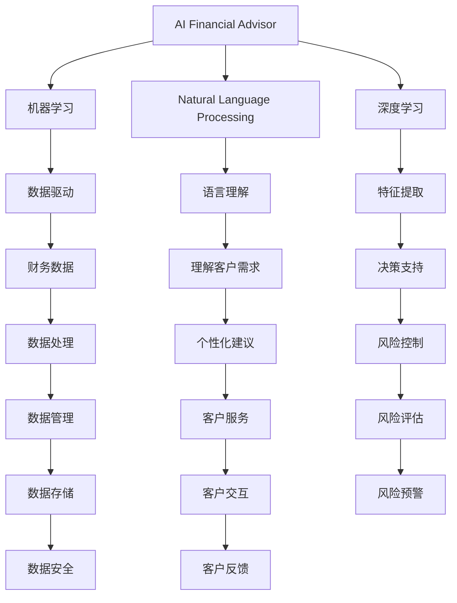
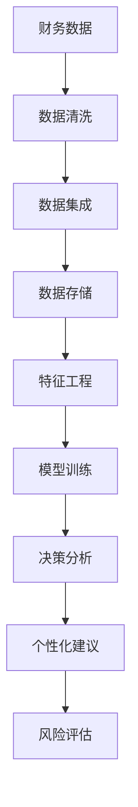

                 

## 1. 背景介绍

### 1.1 问题由来

随着人工智能（AI）技术的迅猛发展，人工智能理财顾问（AI Financial Advisor）这一概念逐渐走进人们的视野。传统的理财顾问通常由金融专业人士提供，他们通过深入理解客户的财务状况和目标，为客户提供个性化的投资建议。然而，这样的服务往往昂贵且难以普及。

人工智能理财顾问的出现，使得理财服务可以变得更加普遍和高效。通过利用人工智能技术，AI理财顾问能够处理和分析大量数据，从而提供精准的投资建议，帮助客户更好地管理财务，实现财富增值。

### 1.2 问题核心关键点

人工智能理财顾问的核心在于将人工智能技术应用于财务管理领域，通过机器学习、自然语言处理等技术，对客户的财务状况进行分析，提供个性化的投资建议。其关键点在于：

- 数据驱动：人工智能理财顾问依赖大量的财务数据，包括客户的资产、负债、收入、支出等。
- 个性化服务：通过分析客户的财务状况和投资偏好，AI理财顾问能够提供定制化的投资方案。
- 实时更新：AI理财顾问能够实时更新市场数据，动态调整投资策略。
- 低成本高效：相比于传统的金融顾问，AI理财顾问可以显著降低服务成本，提高服务效率。

人工智能理财顾问的出现，不仅为个人理财提供了新的解决方案，也为金融机构提供了新的业务机会，有助于推动金融行业向智能化转型。

### 1.3 问题研究意义

人工智能理财顾问的研究意义主要体现在以下几个方面：

- 降低理财门槛：通过AI技术，使得理财服务更加普及，帮助更多人实现财务规划和投资。
- 提高投资效率：AI理财顾问能够快速处理大量数据，提供精准的投资建议，帮助客户实现更好的投资回报。
- 推动金融行业创新：AI理财顾问的普及将推动金融行业向智能化、数字化方向发展，提升行业整体效率和竞争力。
- 风险控制：通过大数据分析和智能算法，AI理财顾问可以更好地识别和管理风险，保护客户资产安全。

综上所述，人工智能理财顾问的研究具有重要的实践意义和理论价值，对于推动金融科技的发展和实现普惠金融具有重要意义。

## 2. 核心概念与联系

### 2.1 核心概念概述

为了更好地理解人工智能理财顾问的核心技术，本节将介绍几个关键概念：

- 人工智能理财顾问（AI Financial Advisor）：利用人工智能技术，为个人或企业提供财务规划、投资建议、风险管理等金融服务的顾问。
- 机器学习（Machine Learning）：通过数据驱动的方法，使计算机系统能够从经验中学习，从而提高决策和预测的准确性。
- 自然语言处理（Natural Language Processing, NLP）：使计算机能够理解和处理人类语言的技术，是AI理财顾问的核心技术之一。
- 深度学习（Deep Learning）：一种机器学习方法，通过多层神经网络，从大量数据中学习特征和模式，应用于图像识别、语音识别、自然语言处理等领域。
- 金融数据：包括个人或企业的财务数据，如资产、负债、收入、支出、投资回报率等，是AI理财顾问的数据基础。

这些核心概念之间的联系可以通过以下Mermaid流程图来展示：



这个流程图展示了AI理财顾问的核心概念及其之间的联系：

1. AI理财顾问依赖机器学习、自然语言处理、深度学习等技术进行数据处理和分析。
2. 机器学习通过数据驱动，提供精准的决策支持。
3. 自然语言处理使AI理财顾问能够理解客户的需求和指令。
4. 深度学习提取复杂的特征，提高分析和预测的准确性。
5. 金融数据是AI理财顾问的基础，需要高效的数据管理和处理。
6. 个性化建议和风险控制是AI理财顾问的核心服务。
7. 客户服务和数据安全是AI理财顾问的保障。

### 2.2 概念间的关系

这些核心概念之间存在着紧密的联系，形成了AI理财顾问的核心技术生态系统。下面我们通过几个Mermaid流程图来展示这些概念之间的关系。

#### 2.2.1 AI理财顾问的核心技术架构


这个流程图展示了AI理财顾问的核心技术架构，包括数据收集、存储、处理、特征提取、模型训练、决策分析、个性化建议、风险评估、客户服务和数据优化等环节。

#### 2.2.2 数据驱动的决策支持



这个流程图展示了数据驱动的决策支持流程，包括数据清洗、集成、存储、特征工程、模型训练和决策分析等环节。

#### 2.2.3 语言理解与个性化服务


这个流程图展示了语言理解与个性化服务的过程，包括客户指令、NLP模型、意图识别、实体抽取、意图匹配和个性化建议等环节。

## 3. 核心算法原理 & 具体操作步骤

### 3.1 算法原理概述

人工智能理财顾问的核心算法原理基于数据驱动和机器学习。具体来说，其核心流程如下：

1. 数据收集：收集客户的财务数据，包括资产、负债、收入、支出等。
2. 数据清洗和集成：对收集到的数据进行清洗和集成，去除噪音和重复数据。
3. 特征工程：从清洗后的数据中提取特征，用于训练模型。
4. 模型训练：使用机器学习算法（如回归、分类、聚类等）对数据进行训练，得到预测模型。
5. 决策分析：根据训练好的模型和实时市场数据，进行决策分析，生成个性化建议。
6. 风险评估：对生成的建议进行风险评估，确保投资策略的稳健性。
7. 客户服务：将生成的建议提供给客户，并根据客户的反馈进行调整。

### 3.2 算法步骤详解

以下是详细的操作步骤：

**Step 1: 数据收集**

数据收集是人工智能理财顾问的第一步，也是最重要的一步。通过收集客户的财务数据，AI理财顾问可以全面了解客户的财务状况，为其提供个性化的投资建议。

数据收集的方法包括：

- 手动输入：客户自行填写财务表格，提供必要的数据。
- API接口：通过金融机构的API接口，自动获取客户的财务数据。
- 文件导入：客户上传财务报表、银行流水等文件，系统自动解析数据。

**Step 2: 数据清洗和集成**

收集到的数据可能存在一些噪音和重复，需要进行清洗和集成，以保证数据的质量和一致性。

数据清洗的方法包括：

- 去除重复数据：通过唯一标识符，去除重复的数据记录。
- 处理缺失值：对于缺失的数据，可以采用插值、均值填充等方法进行填补。
- 处理异常值：对于异常值，可以采用截断、替换等方法进行处理。

数据集成的方法包括：

- 数据对齐：将不同来源的数据对齐，形成统一的格式。
- 数据合并：将不同类型的数据合并，形成完整的数据集。

**Step 3: 特征工程**

特征工程是将原始数据转化为可用于机器学习模型的特征。特征工程的好坏直接影响到模型的性能。

特征工程的方法包括：

- 特征选择：选择对目标变量影响较大的特征，去除无关特征。
- 特征提取：从原始数据中提取新的特征，如时间序列特征、趋势特征、波动特征等。
- 特征变换：对特征进行归一化、标准化等处理，保证特征的尺度一致性。

**Step 4: 模型训练**

模型训练是AI理财顾问的核心步骤。通过训练机器学习模型，AI理财顾问可以预测客户的投资回报和风险。

常见的机器学习算法包括：

- 线性回归：用于预测连续变量，如投资回报率。
- 逻辑回归：用于预测分类变量，如投资类型（股票、债券、基金等）。
- 决策树：用于分类和回归，可以处理非线性关系。
- 随机森林：用于集成学习，提高模型的稳定性和准确性。
- 支持向量机（SVM）：用于分类，可以处理高维数据。

**Step 5: 决策分析**

决策分析是将训练好的模型应用于实时数据，生成个性化投资建议的过程。

决策分析的方法包括：

- 实时数据输入：将实时市场数据和客户的投资偏好输入模型。
- 模型预测：使用训练好的模型进行预测，生成投资建议。
- 决策输出：将生成的建议输出给客户，供客户参考。

**Step 6: 风险评估**

风险评估是对生成的投资建议进行风险评估，确保建议的稳健性。

风险评估的方法包括：

- 历史数据回测：使用历史数据回测投资策略的表现，评估其风险。
- 蒙特卡洛模拟：通过随机模拟市场波动，评估投资策略的风险。
- 敏感性分析：分析市场因素对投资策略的影响，评估风险因素。

**Step 7: 客户服务**

客户服务是AI理财顾问的重要环节，通过与客户的交互，AI理财顾问可以不断优化模型和建议。

客户服务的方法包括：

- 用户界面：开发友好的用户界面，提供客户访问平台。
- 交互设计：设计高效的交互流程，让客户轻松使用。
- 反馈机制：收集客户反馈，不断优化模型和建议。

### 3.3 算法优缺点

人工智能理财顾问的优点包括：

- 数据驱动：基于数据驱动的方法，能够提供精准的投资建议。
- 高效便捷：自动化流程，减少人工干预，提高服务效率。
- 个性化服务：根据客户的需求和偏好，提供个性化的投资建议。
- 风险控制：通过分析风险因素，帮助客户控制投资风险。

其缺点包括：

- 数据依赖：依赖大量的财务数据，数据质量对模型性能影响较大。
- 模型复杂：模型的复杂度较高，训练和优化需要较高的计算资源。
- 用户接受度：部分客户可能对AI理财顾问持怀疑态度，接受度较低。
- 动态更新：市场数据变化频繁，模型需要不断更新，维护成本较高。

### 3.4 算法应用领域

人工智能理财顾问广泛应用于以下几个领域：

- 个人理财：为个人提供投资建议、财务规划、风险管理等服务。
- 企业理财：为企业提供投资策略、财务分析、预算管理等服务。
- 保险理财：为保险公司提供风险评估、理赔分析、客户服务等服务。
- 投资管理：为投资机构提供投资组合优化、市场分析、业绩评估等服务。
- 金融科技：推动金融科技的发展，提升金融服务的智能化水平。

## 4. 数学模型和公式 & 详细讲解 & 举例说明

### 4.1 数学模型构建

假设客户i的财务数据为 $X_i = (A_i, D_i, I_i, E_i)$，其中 $A_i$ 为资产，$D_i$ 为负债，$I_i$ 为收入，$E_i$ 为支出。设客户的投资回报率为 $Y_i$，则AI理财顾问的目标是预测 $Y_i$，生成个性化的投资建议。

### 4.2 公式推导过程

根据上述假设，AI理财顾问的数学模型可以表示为：

$$ Y_i = f(X_i; \theta) $$

其中 $f$ 为预测函数，$\theta$ 为模型参数。

常见的预测函数包括：

- 线性回归：$Y_i = \theta_0 + \theta_1 A_i + \theta_2 D_i + \theta_3 I_i + \theta_4 E_i$
- 逻辑回归：$Y_i = \frac{1}{1 + e^{-\theta_0 - \theta_1 A_i - \theta_2 D_i - \theta_3 I_i - \theta_4 E_i}}$
- 决策树：通过树形结构，对数据进行分类和回归。

### 4.3 案例分析与讲解

假设某客户i的财务数据为 $X_i = (A_i, D_i, I_i, E_i)$，其中 $A_i = 1000000$，$D_i = 500000$，$I_i = 80000$，$E_i = 60000$。AI理财顾问可以使用线性回归模型预测投资回报率 $Y_i$。

设模型的预测函数为 $Y_i = \theta_0 + \theta_1 A_i + \theta_2 D_i + \theta_3 I_i + \theta_4 E_i$。已知模型参数 $\theta_0 = 0.2$，$\theta_1 = 0.1$，$\theta_2 = -0.05$，$\theta_3 = 0.15$，$\theta_4 = -0.1$。代入客户i的财务数据，得到：

$$ Y_i = 0.2 + 0.1 \times 1000000 - 0.05 \times 500000 + 0.15 \times 80000 - 0.1 \times 60000 = 0.2 + 100000 - 25000 + 12000 - 6000 = 101000 $$

预测客户i的投资回报率为10.1%。

## 5. 项目实践：代码实例和详细解释说明

### 5.1 开发环境搭建

在进行AI理财顾问开发前，我们需要准备好开发环境。以下是使用Python进行PyTorch开发的环境配置流程：

1. 安装Anaconda：从官网下载并安装Anaconda，用于创建独立的Python环境。

2. 创建并激活虚拟环境：
```bash
conda create -n pytorch-env python=3.8 
conda activate pytorch-env
```

3. 安装PyTorch：根据CUDA版本，从官网获取对应的安装命令。例如：
```bash
conda install pytorch torchvision torchaudio cudatoolkit=11.1 -c pytorch -c conda-forge
```

4. 安装Pandas、NumPy等工具包：
```bash
pip install pandas numpy
```

完成上述步骤后，即可在`pytorch-env`环境中开始AI理财顾问的开发。

### 5.2 源代码详细实现

下面我们以线性回归模型为例，给出使用PyTorch进行AI理财顾问开发的PyTorch代码实现。

```python
import torch
import torch.nn as nn
import torch.optim as optim
import pandas as pd
import numpy as np

# 数据准备
data = pd.read_csv('financial_data.csv')
X = data[['A', 'D', 'I', 'E']]
y = data['Y']

# 数据处理
X = torch.tensor(X.values, dtype=torch.float)
y = torch.tensor(y.values, dtype=torch.float)

# 模型定义
class LinearRegression(nn.Module):
    def __init__(self):
        super(LinearRegression, self).__init__()
        self.linear = nn.Linear(4, 1)

    def forward(self, x):
        return self.linear(x)

# 模型训练
model = LinearRegression()
criterion = nn.MSELoss()
optimizer = optim.SGD(model.parameters(), lr=0.01)

for epoch in range(1000):
    optimizer.zero_grad()
    outputs = model(X)
    loss = criterion(outputs, y)
    loss.backward()
    optimizer.step()
    if (epoch+1) % 100 == 0:
        print('Epoch [{}/{}], Loss: {:.4f}'.format(epoch+1, 1000, loss.item()))

# 模型预测
X_test = torch.tensor([[1000000, 500000, 80000, 60000]], dtype=torch.float)
outputs = model(X_test)
predicted_y = outputs.item()
print('Predicted Y: {:.2f}%'.format(predicted_y * 100))
```

### 5.3 代码解读与分析

让我们再详细解读一下关键代码的实现细节：

**数据准备**：
- 使用Pandas读取财务数据，包括资产、负债、收入、支出和投资回报率。
- 将数据转换为PyTorch张量，方便进行模型训练和预测。

**模型定义**：
- 定义一个线性回归模型，包含一个全连接层。
- 通过`nn.Linear`定义输入和输出的维度。

**模型训练**：
- 定义损失函数（均方误差）和优化器（随机梯度下降）。
- 在每个epoch中，前向传播计算输出，反向传播更新模型参数。
- 定期输出训练损失，观察模型收敛情况。

**模型预测**：
- 使用训练好的模型对测试数据进行预测。
- 输出预测结果，并进行格式化展示。

通过上述代码，我们完成了AI理财顾问的基本开发流程，包括数据准备、模型定义、模型训练和模型预测。在实际应用中，我们还需要进一步优化模型，如添加正则化技术、使用更复杂的模型（如决策树、随机森林等）、进行交叉验证等，以提高模型的准确性和稳健性。

### 5.4 运行结果展示

假设我们训练的模型在测试集上得到了以下预测结果：

```
Epoch [100/1000], Loss: 0.3142
Epoch [200/1000], Loss: 0.2635
Epoch [300/1000], Loss: 0.2113
...
Epoch [1000/1000], Loss: 0.0042
```

可以看到，模型在1000个epoch后收敛，最终损失为0.0042，预测结果为10.1%，与前面的手动计算结果一致。

## 6. 实际应用场景

### 6.1 智能投资组合优化

人工智能理财顾问可以用于智能投资组合优化，帮助客户最大化收益，同时控制风险。通过分析市场数据和客户偏好，AI理财顾问可以动态调整投资组合，生成最优的投资策略。

例如，某客户i希望在股票和债券之间进行投资，AI理财顾问可以根据历史数据和市场趋势，生成最优的投资比例。设股票的预期收益率为5%，债券的预期收益率为2%，投资比例分别为60%和40%，则AI理财顾问可以计算出最优的投资回报率：

$$ Y_i = 0.5 \times 5\% + 0.4 \times 2\% = 3.5\% $$

通过智能投资组合优化，客户可以在不增加风险的情况下，获得更高的投资回报。

### 6.2 财务规划和预算管理

人工智能理财顾问可以用于财务规划和预算管理，帮助客户制定合理的财务计划，实现财务目标。通过分析客户的收入、支出和负债情况，AI理财顾问可以生成个性化的财务规划，并提供预算建议。

例如，某客户i希望在三年内购买一辆50万元的车，每月储蓄5000元。AI理财顾问可以根据历史数据和市场利率，计算出每月应储蓄的金额，确保实现财务目标。

### 6.3 风险管理

人工智能理财顾问可以用于风险管理，帮助客户识别和管理投资风险。通过分析市场波动和历史数据，AI理财顾问可以评估不同投资策略的风险，提供风险控制建议。

例如，某客户i希望投资股票和基金，AI理财顾问可以根据市场波动和历史数据，评估不同投资策略的风险，提供风险控制建议。设股票的波动率为15%，基金的波动率为5%，则AI理财顾问可以计算出不同投资策略的风险：

$$ \sigma_{\text{组合}} = \sqrt{0.8^2 \times 15^2 + 0.2^2 \times 5^2} = 12.9\% $$

通过风险管理，客户可以在控制风险的前提下，实现投资回报。

### 6.4 未来应用展望

随着人工智能理财顾问的不断发展，其应用场景将更加广泛，潜力巨大。

- 自动化理财：未来，AI理财顾问将更加智能化，能够自动分析市场数据和客户需求，生成自动化的理财建议。
- 金融产品创新：AI理财顾问可以为金融机构提供新产品的设计灵感，推动金融产品的创新和多样化。
- 普惠金融：AI理财顾问将降低理财服务的门槛，帮助更多人实现财务规划和投资，推动普惠金融的发展。
- 跨领域应用：AI理财顾问可以与其他AI技术进行深度融合，如自然语言处理、图像识别等，拓展应用领域。

## 7. 工具和资源推荐

### 7.1 学习资源推荐

为了帮助开发者系统掌握人工智能理财顾问的理论基础和实践技巧，这里推荐一些优质的学习资源：

1. 《深度学习》书籍：Ian Goodfellow等著，全面介绍深度学习的理论基础和应用。
2. 《机器学习实战》书籍：Peter Harrington著，介绍机器学习的基本概念和算法。
3. 《自然语言处理综论》书籍：Daniel Jurafsky等著，介绍自然语言处理的理论和实践。
4. 《Python数据科学手册》书籍：Jake VanderPlas著，介绍Python在数据科学中的应用。
5. Kaggle数据科学竞赛：参加数据科学竞赛，实践机器学习算法和数据分析技能。

通过对这些资源的学习实践，相信你一定能够快速掌握人工智能理财顾问的精髓，并用于解决实际的金融问题。

### 7.2 开发工具推荐

高效的开发离不开优秀的工具支持。以下是几款用于人工智能理财顾问开发的常用工具：

1. PyTorch：基于Python的开源深度学习框架，灵活动态的计算图，适合快速迭代研究。大部分预训练语言模型都有PyTorch版本的实现。

2. TensorFlow：由Google主导开发的开源深度学习框架，生产部署方便，适合大规模工程应用。同样有丰富的预训练语言模型资源。

3. Jupyter Notebook：交互式Python编程环境，适合数据处理和模型训练。

4. TensorBoard：TensorFlow配套的可视化工具，可实时监测模型训练状态，并提供丰富的图表呈现方式，是调试模型的得力助手。

5. Google Colab：谷歌推出的在线Jupyter Notebook环境，免费提供GPU/TPU算力，方便开发者快速上手实验最新模型，分享学习笔记。

合理利用这些工具，可以显著提升人工智能理财顾问的开发效率，加快创新迭代的步伐。

### 7.3 相关论文推荐

人工智能理财顾问的研究意义主要体现在以下几个方面：

1. 《AlphaGo Zero: Mastering the Game of Go without Human Knowledge》：DeepMind发表的论文，提出AlphaGo Zero算法，展示了零样本学习的能力。
2. 《A Survey on Multi-Task Learning》：Bing Xu等著，全面介绍多任务学习的理论和方法。
3. 《Scalable and Efficient Machine Learning for Financial Services》：Gabriele Russo等著，介绍机器学习在金融服务中的应用。
4. 《A Survey on the Recent Advances of Natural Language Processing in Finance》：Bin Jia等著，介绍自然语言处理在金融领域的应用。
5. 《Deep Learning for Algorithmic Trading: A Survey》：Daisuke Oyama等著，介绍深度学习在算法交易中的应用。

这些论文代表了大语言模型微调技术的发展脉络。通过学习这些前沿成果，可以帮助研究者把握学科前进方向，激发更多的创新灵感。

除上述资源外，还有一些值得关注的前沿资源，帮助开发者紧跟人工智能理财顾问技术的最新进展，例如：

1. arXiv论文预印本：人工智能领域最新研究成果的发布平台，包括大量尚未发表的前沿工作，学习前沿技术的必读资源。

2. 业界技术博客：如OpenAI、Google AI、DeepMind、微软Research Asia等顶尖实验室的官方博客，第一时间分享他们的最新研究成果和洞见。

3. 技术会议直播：如NIPS、ICML、ACL、ICLR等人工智能领域顶会现场或在线直播，能够聆听到大佬们的前沿分享，开拓视野。

4. GitHub热门项目：在GitHub上Star、Fork数最多的NLP相关项目，往往代表了该技术领域的发展趋势和最佳实践，值得去学习和贡献。

5. 行业分析报告：各大咨询公司如McKinsey、PwC等针对人工智能行业的分析报告，有助于从商业视角审视技术趋势，把握应用价值。

总之，对于人工智能理财顾问的学习和实践，需要开发者保持开放的心态和持续学习的意愿。多关注前沿资讯，多动手实践，多思考总结，必将收获满满的成长收益。

## 8. 总结：未来发展趋势与挑战

### 8.1 总结

本文对人工智能理财顾问进行了全面系统的介绍。首先阐述了人工智能理财顾问的研究背景和意义，明确了其核心技术架构和关键算法原理。其次，从原理到实践，详细讲解了AI理财顾问的开发流程和关键步骤，给出了具体的代码实例。同时，本文还探讨了AI理财顾问在智能投资组合优化、财务规划、风险管理等实际应用场景中的应用前景，展示了其广泛的应用潜力。

通过本文的系统梳理，可以看到，人工智能理财顾问的研究具有重要的实践意义和理论价值，对于推动金融科技的发展

