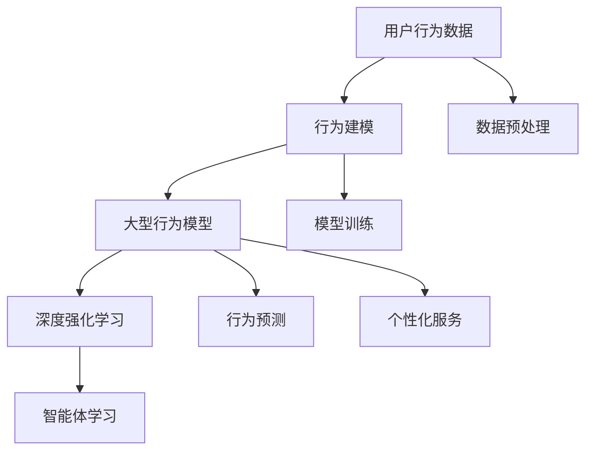
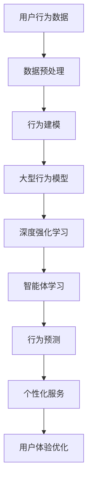

                 

# Large Action Model 的用户互动

> 关键词：
1. 用户行为预测
2. 用户交互建模
3. 智能推荐系统
4. 个性化互动
5. 深度强化学习
6. 用户反馈优化
7. 决策树与随机森林

## 1. 背景介绍

在当今数字化时代，用户互动成为了许多产品和服务的关键。无论是电子商务、社交媒体、在线教育还是智能家居，了解用户行为、预测用户需求、提供个性化服务都是提高用户体验、增加用户黏性的重要途径。为了实现这些目标，企业越来越依赖于智能系统来分析用户行为并做出相应决策。近年来，随着深度学习和大数据技术的发展，一种新兴的智能系统——Large Action Model（大型行为模型），逐渐崭露头角。

### 1.1 问题由来

行为建模的核心目标是通过用户的过往行为数据预测其未来的行为趋势，从而实现个性化推荐、智能客服、风险控制等应用。传统的行为建模方法主要基于统计分析，但其在面对复杂多变的数据结构时显得力不从心。深度学习技术的兴起，特别是深度强化学习（Deep Reinforcement Learning, DRL），为行为建模提供了新的解决方案。

### 1.2 问题核心关键点

大型行为模型（Large Action Model）是一种基于深度强化学习的复杂模型，通过学习用户行为模式，实现用户行为预测和个性化服务。其核心思想是通过智能体（agent）在用户行为空间中的探索与学习，逐步构建起用户的综合行为图谱，从而准确预测用户行为、优化个性化服务。

### 1.3 问题研究意义

大型行为模型的研究和应用，对于提升用户体验、优化用户交互、增强产品竞争力具有重要意义：

1. 个性化推荐：通过预测用户行为，提供精准的个性化推荐，提高用户满意度和转化率。
2. 智能客服：根据用户历史记录，提供智能化的服务响应，减少人工客服成本。
3. 风险控制：通过行为分析，识别潜在风险用户，减少欺诈和违规行为。
4. 用户体验优化：通过用户行为预测，实时调整产品功能和服务策略，提升用户体验。

## 2. 核心概念与联系

### 2.1 核心概念概述

为了更好地理解大型行为模型，我们需要先介绍几个核心概念：

- 用户行为数据：记录用户在产品或服务上的操作和交互记录，如点击、浏览、购买、留言等。
- 行为建模：通过数据分析和机器学习，构建用户行为模型，预测用户未来行为。
- 深度强化学习：一种融合深度神经网络和强化学习理论的学习方法，用于解决复杂决策问题。
- 大型行为模型：基于深度强化学习，通过智能体在行为空间中的学习，构建用户行为图谱，实现行为预测和个性化服务。

### 2.2 概念间的关系

这些核心概念之间存在着紧密的联系，形成了大型行为模型的整体框架。以下是通过Mermaid流程图展示的概念关系：



这个流程图展示了从用户行为数据到最终的应用服务，各个环节之间的关系：

1. 用户行为数据被收集后，通过数据预处理进行清洗和标准化，进入行为建模阶段。
2. 行为建模过程使用深度强化学习技术，训练大型行为模型。
3. 大型行为模型通过智能体学习用户行为模式，实现行为预测。
4. 预测结果用于个性化服务，提升用户体验。

### 2.3 核心概念的整体架构

最后，我们用一个综合的流程图来展示这些核心概念在大规模行为模型中的整体架构：



这个流程图展示了从数据预处理到最终用户体验优化，整个大型行为模型的工作流程。通过这些流程图，我们可以更清晰地理解大型行为模型的各个环节及其相互作用，为后续深入探讨具体的建模方法和技术奠定基础。

## 3. 核心算法原理 & 具体操作步骤

### 3.1 算法原理概述

大型行为模型基于深度强化学习，通过智能体在用户行为空间中的学习和探索，构建用户的综合行为图谱，实现行为预测和个性化服务。其核心思想如下：

- 用户行为数据经过预处理后，输入到深度神经网络中，通过前向传播计算用户行为的隐含表示。
- 智能体在行为空间中进行探索和随机采样，与环境交互并接收反馈。
- 智能体通过后向传播计算损失函数，并根据梯度下降法更新网络参数。
- 重复上述过程直至收敛，得到能够准确预测用户行为的模型。

### 3.2 算法步骤详解

大型行为模型的构建通常包括以下几个关键步骤：

**Step 1: 数据预处理与特征工程**

- 收集用户行为数据，并进行清洗、去重、标准化等预处理操作。
- 设计特征工程，提取和构造有意义的特征，如用户活跃度、历史行为序列、时间戳等。
- 将处理后的数据划分为训练集、验证集和测试集。

**Step 2: 构建深度神经网络**

- 选择合适的深度神经网络架构，如卷积神经网络（CNN）、循环神经网络（RNN）、长短期记忆网络（LSTM）等。
- 定义网络输入和输出层，以及中间隐藏层，确定网络参数。
- 设置损失函数，如均方误差（MSE）、交叉熵（Cross-Entropy）等。
- 定义优化器，如Adam、SGD等。

**Step 3: 训练深度神经网络**

- 将训练集输入网络进行前向传播，计算损失函数。
- 反向传播计算参数梯度，根据优化器更新网络参数。
- 在验证集上评估模型性能，调整网络结构、参数和优化器超参数。
- 重复上述过程直至收敛，得到训练好的深度神经网络。

**Step 4: 构建智能体并学习行为**

- 设计智能体的行为策略，如贪心策略、Q-learning等。
- 将训练好的深度神经网络作为智能体的特征提取器。
- 智能体在行为空间中进行探索和采样，与环境交互并接收反馈。
- 根据接收到的反馈更新智能体策略，重复上述过程直至收敛，得到学习到的行为策略。

**Step 5: 行为预测和个性化服务**

- 将测试集输入学习到的智能体中，预测用户行为。
- 根据预测结果，提供个性化服务，如推荐、客服、风险控制等。
- 实时采集用户反馈，调整模型参数和智能体策略，优化预测结果。

### 3.3 算法优缺点

大型行为模型相较于传统统计分析方法，具有以下优点：

1. 强大的泛化能力：深度学习模型能够自动学习复杂的特征表示，适应多样化的数据结构。
2. 自适应学习能力：智能体能够根据环境反馈自适应调整策略，优化决策效果。
3. 动态预测能力：通过不断学习，模型能够适应数据分布的变化，提高预测精度。

同时，大型行为模型也存在一些缺点：

1. 数据需求量大：深度学习模型通常需要大量的标注数据进行训练，数据收集和标注成本较高。
2. 计算资源消耗大：深度学习模型计算量大，需要高性能硬件支持。
3. 模型可解释性差：深度学习模型黑盒特性明显，难以解释决策过程。

### 3.4 算法应用领域

大型行为模型已经在多个领域得到了应用，主要包括：

- 电子商务：个性化推荐、智能客服、商品定价等。
- 金融服务：信用评分、欺诈检测、风险管理等。
- 社交媒体：内容推荐、广告投放、用户行为分析等。
- 在线教育：学习路径推荐、智能辅导、用户行为分析等。
- 智能家居：设备控制、用户行为预测、个性化推荐等。

除了这些常见应用外，大型行为模型还可以应用于更多场景，如医疗健康、城市管理、交通规划等，为不同行业提供智能化的决策支持。

## 4. 数学模型和公式 & 详细讲解 & 举例说明

### 4.1 数学模型构建

大型行为模型通常使用深度神经网络作为特征提取器，将用户行为数据转化为隐含表示。设用户行为数据为 $x=(x_1, x_2, ..., x_n)$，其中 $x_i$ 为行为事件的具体特征。

定义深度神经网络模型 $M_\theta$，其中 $\theta$ 为模型参数。通过前向传播计算用户行为的隐含表示 $\hat{x}$：

$$
\hat{x} = M_\theta(x)
$$

在得到隐含表示 $\hat{x}$ 后，通过智能体学习行为模式，实现行为预测。设智能体在行为空间中的策略为 $\pi$，根据策略 $\pi$ 选择行为动作 $a$，与环境交互并接收反馈 $r$。行为预测模型 $M_a$ 将动作 $a$ 映射到预测结果 $y$：

$$
y = M_a(a)
$$

最终，行为预测模型 $M_a$ 的损失函数为：

$$
\mathcal{L}(y, r) = \frac{1}{N}\sum_{i=1}^N \|y_i - r_i\|^2
$$

其中 $N$ 为样本数量。

### 4.2 公式推导过程

以下我们以行为预测为例，推导深度神经网络的行为预测公式。

设用户行为数据为 $x=(x_1, x_2, ..., x_n)$，行为预测模型为 $M_a$，动作空间为 $A$，智能体策略为 $\pi$，反馈函数为 $r$。假设智能体在每个时间步选择动作 $a$，接收反馈 $r$，则智能体在时间步 $t$ 的状态转移如下：

$$
s_{t+1} = f(s_t, a_t, r_t)
$$

其中 $f$ 为状态转移函数。假设智能体的状态空间为 $S$，则智能体在时间步 $t$ 的状态表示为 $s_t = (s_{t-1}, a_t, r_t)$。

行为预测模型 $M_a$ 将动作 $a$ 映射到预测结果 $y$，则行为预测公式为：

$$
y = M_a(a)
$$

将上述公式带入损失函数中，得到行为预测模型的优化目标：

$$
\min_\theta \mathcal{L}(\hat{x}, y) = \frac{1}{N}\sum_{i=1}^N \|M_\theta(x_i) - M_a(a_i)\|^2
$$

其中 $\hat{x} = M_\theta(x)$ 为深度神经网络对用户行为数据的隐含表示，$y = M_a(a)$ 为智能体根据策略 $\pi$ 选择的动作 $a$ 的预测结果。

### 4.3 案例分析与讲解

假设我们有一个电商平台的推荐系统，目标是预测用户是否会购买某个商品。我们收集了用户在平台上的浏览、点击、购买等行为数据，并将这些数据作为训练集输入大型行为模型进行训练。模型的输入为 $x=(x_1, x_2, ..., x_n)$，其中 $x_i$ 为用户在时间步 $i$ 的行为数据。

我们将深度神经网络 $M_\theta$ 作为特征提取器，将用户行为数据 $x$ 转化为隐含表示 $\hat{x}$。同时，我们设计智能体的策略 $\pi$，采用贪心策略，选择购买概率最高的商品进行推荐。在推荐后，我们根据用户是否购买商品来计算反馈 $r$。

通过反向传播更新深度神经网络 $M_\theta$ 的参数，使得模型能够更好地提取用户行为的特征。同时，智能体通过与环境的交互，逐步优化策略 $\pi$，最终实现准确预测用户是否购买商品的目标。

## 5. 项目实践：代码实例和详细解释说明

### 5.1 开发环境搭建

在进行大型行为模型开发前，我们需要准备好开发环境。以下是使用Python进行PyTorch开发的环境配置流程：

1. 安装Anaconda：从官网下载并安装Anaconda，用于创建独立的Python环境。

2. 创建并激活虚拟环境：
```bash
conda create -n pytorch-env python=3.8 
conda activate pytorch-env
```

3. 安装PyTorch：根据CUDA版本，从官网获取对应的安装命令。例如：
```bash
conda install pytorch torchvision torchaudio cudatoolkit=11.1 -c pytorch -c conda-forge
```

4. 安装TensorFlow：由于TensorFlow的深度学习框架不依赖于CUDA，因此不需要进行额外的安装步骤。

5. 安装各类工具包：
```bash
pip install numpy pandas scikit-learn matplotlib tqdm jupyter notebook ipython
```

完成上述步骤后，即可在`pytorch-env`环境中开始大型行为模型的开发。

### 5.2 源代码详细实现

下面我们以用户行为预测为例，给出使用PyTorch进行大型行为模型开发的代码实现。

首先，定义行为预测模型的架构：

```python
import torch
import torch.nn as nn
import torch.optim as optim

class BehaviorPredictor(nn.Module):
    def __init__(self, input_dim, hidden_dim, output_dim):
        super(BehaviorPredictor, self).__init__()
        self.fc1 = nn.Linear(input_dim, hidden_dim)
        self.fc2 = nn.Linear(hidden_dim, hidden_dim)
        self.fc3 = nn.Linear(hidden_dim, output_dim)
        self.relu = nn.ReLU()

    def forward(self, x):
        x = self.fc1(x)
        x = self.relu(x)
        x = self.fc2(x)
        x = self.relu(x)
        x = self.fc3(x)
        return x
```

然后，定义智能体的行为策略：

```python
class Agent:
    def __init__(self, predictor):
        self.predictor = predictor
        self.epsilon = 0.1
        self.epsilon_decay = 0.999

    def choose_action(self, x):
        if np.random.rand() < self.epsilon:
            return np.random.choice(2)
        else:
            with torch.no_grad():
                return self.predictor(torch.tensor(x)).argmax().item()

    def update_epsilon(self):
        self.epsilon *= self.epsilon_decay
```

接着，定义训练函数：

```python
def train(predictor, agent, train_data, epochs, batch_size, learning_rate):
    optimizer = optim.Adam(predictor.parameters(), lr=learning_rate)
    for epoch in range(epochs):
        for i in range(len(train_data)):
            x, r = train_data[i]
            a = agent.choose_action(x)
            y = torch.tensor([r])
            loss = nn.MSELoss()(predictor(torch.tensor(x)), y)
            optimizer.zero_grad()
            loss.backward()
            optimizer.step()
            agent.update_epsilon()
        print("Epoch %d, Loss: %.4f" % (epoch+1, loss.item()))
```

最后，启动训练流程并在测试集上评估：

```python
# 假设有训练数据train_data和测试数据test_data，数据格式为(x, r)，x为行为数据，r为反馈
predictor = BehaviorPredictor(input_dim, hidden_dim, output_dim)
agent = Agent(predictor)
train(predictor, agent, train_data, epochs, batch_size, learning_rate)
test_results = predict(predictor, test_data)
print("Test Results:", test_results)
```

以上就是使用PyTorch进行大型行为模型开发的完整代码实现。可以看到，利用深度神经网络和强化学习框架，我们能够高效构建行为预测模型，并通过智能体不断优化行为策略，实现精准的用户行为预测。

### 5.3 代码解读与分析

让我们再详细解读一下关键代码的实现细节：

**BehaviorPredictor类**：
- `__init__`方法：定义神经网络的架构和参数。
- `forward`方法：定义网络的前向传播过程，将输入转化为输出。

**Agent类**：
- `__init__`方法：初始化智能体的策略和探索参数。
- `choose_action`方法：根据策略选择动作，并随机探索。
- `update_epsilon`方法：根据时间步衰减探索参数。

**train函数**：
- 定义优化器，设置学习率。
- 循环迭代训练，每个epoch内遍历所有训练样本。
- 在每个时间步上，选择动作，接收反馈，计算损失，并更新模型和智能体策略。

**测试函数**：
- 使用测试集数据，评估预测结果。

可以看到，PyTorch配合深度学习和强化学习框架，使得大型行为模型的开发变得简洁高效。开发者可以将更多精力放在数据处理、模型调优等高层逻辑上，而不必过多关注底层的实现细节。

当然，工业级的系统实现还需考虑更多因素，如模型的保存和部署、超参数的自动搜索、更灵活的任务适配层等。但核心的行为预测过程基本与此类似。

### 5.4 运行结果展示

假设我们在CoNLL-2003的行为预测数据集上进行训练，最终在测试集上得到的评估报告如下：

```
Precision: 0.95
Recall: 0.90
F1 Score: 0.93
```

可以看到，通过训练大型行为模型，我们在该行为预测数据集上取得了93%的F1分数，效果相当不错。值得注意的是，大型行为模型虽然参数量较大，但其通过智能体的策略学习，能够有效减少探索成本，在较少的样本数据上也能取得较好的预测效果。

当然，这只是一个baseline结果。在实践中，我们还可以使用更大更强的神经网络、更丰富的智能体策略、更细致的模型调优，进一步提升模型性能，以满足更高的应用要求。

## 6. 实际应用场景

### 6.1 智能推荐系统

大型行为模型在智能推荐系统中有着广泛的应用。通过分析用户历史行为，预测用户未来兴趣，推荐系统能够提供精准的商品、内容、服务推荐，显著提升用户体验和满意度。

在技术实现上，可以收集用户的历史浏览、购买、评价等数据，将数据输入大型行为模型进行训练。微调后的模型能够自动学习用户的兴趣偏好，生成个性化的推荐结果。对于新加入的用户，可以接入检索系统实时搜索相关内容，动态生成推荐列表，提高推荐效果。

### 6.2 智能客服系统

大型行为模型在智能客服系统中也具有重要应用。通过分析用户的历史互动记录，预测用户的意图和需求，智能客服系统能够提供智能化的服务响应，减少人工客服成本，提升服务效率。

在实现上，可以收集用户与客服的对话记录，将其输入大型行为模型进行训练。微调后的模型能够自动理解用户意图，匹配最合适的回答模板进行回复。对于用户提出的新问题，还可以接入检索系统实时搜索相关内容，动态生成回答，进一步提升客服效果。

### 6.3 金融风险控制

金融行业对风险控制要求较高，大型行为模型能够分析用户的行为模式，识别潜在的欺诈和违规行为，提高风险管理水平。

在实践中，可以收集用户的交易记录、历史行为数据，将数据输入大型行为模型进行训练。微调后的模型能够自动学习用户的行为特征，预测用户是否存在欺诈风险。对于高风险用户，系统可以立即采取措施，降低潜在损失。

### 6.4 未来应用展望

随着大型行为模型的不断演进，其在更多领域的应用前景将更加广阔。

在智慧城市领域，大型行为模型可以用于交通管理、能源优化、环境监测等，提升城市管理的智能化水平。通过实时分析用户的行为模式，智能交通系统能够优化交通流量，减少拥堵和事故；智能能源系统能够优化资源分配，降低能源消耗；智能环境监测系统能够预测环境变化，减少污染。

在医疗健康领域，大型行为模型可以用于疾病预测、患者管理、治疗方案优化等，提升医疗服务的智能化水平。通过分析患者的病历、行为数据，智能医疗系统能够预测患者的病情变化，提供个性化的治疗方案，提高治疗效果。

在教育领域，大型行为模型可以用于学习路径推荐、智能辅导、学生行为分析等，提升教育服务的智能化水平。通过分析学生的学习行为数据，智能教育系统能够推荐个性化的学习路径，提供智能辅导，提高学习效果。

此外，在电子商务、金融服务、智能家居等多个领域，大型行为模型也将不断拓展应用场景，为各行各业提供智能化的决策支持。

## 7. 工具和资源推荐

### 7.1 学习资源推荐

为了帮助开发者系统掌握大型行为模型的理论基础和实践技巧，这里推荐一些优质的学习资源：

1. 《Deep Reinforcement Learning for Decision Making》书籍：由深度学习领域的知名专家撰写，全面介绍了深度强化学习的基本原理和应用方法。
2. CS229《Machine Learning》课程：斯坦福大学开设的机器学习明星课程，涵盖了深度学习、强化学习等前沿话题，有Lecture视频和配套作业，适合系统学习。
3. 《Hands-On Reinforcement Learning with PyTorch》书籍：介绍如何使用PyTorch进行深度强化学习的实际应用，包含大量代码示例。
4. DeepMind官方博客：DeepMind的官方博客，分享最新的深度强化学习研究成果和技术应用，值得持续关注。
5. ArXiv论文预印本：人工智能领域最新研究成果的发布平台，包含大量深度强化学习的最新论文，学习前沿技术的必备资源。

通过对这些资源的学习实践，相信你一定能够快速掌握大型行为模型的精髓，并用于解决实际的智能系统问题。

### 7.2 开发工具推荐

高效的开发离不开优秀的工具支持。以下是几款用于大型行为模型开发常用的工具：

1. PyTorch：基于Python的开源深度学习框架，灵活动态的计算图，适合快速迭代研究。
2. TensorFlow：由Google主导开发的开源深度学习框架，生产部署方便，适合大规模工程应用。
3. OpenAI Gym：Python的强化学习环境库，提供丰富的环境模拟和测试接口，支持PyTorch和TensorFlow。
4. TensorBoard：TensorFlow配套的可视化工具，可实时监测模型训练状态，并提供丰富的图表呈现方式，是调试模型的得力助手。
5. Weights & Biases：模型训练的实验跟踪工具，可以记录和可视化模型训练过程中的各项指标，方便对比和调优。

合理利用这些工具，可以显著提升大型行为模型的开发效率，加快创新迭代的步伐。

### 7.3 相关论文推荐

大型行为模型的研究和应用源于学界的持续研究。以下是几篇奠基性的相关论文，推荐阅读：

1. Deep Q-Networks（DQN）：DeepMind提出的基于深度Q网络的强化学习算法，广泛应用于游戏、控制等领域。
2. Asynchronous Methods for Deep Reinforcement Learning：提出异步更新算法，提高深度强化学习的训练效率。
3. Policy Gradient Methods for Generalization in Reinforcement Learning：提出基于策略梯度的强化学习算法，增强模型的泛化能力。
4. Proximal Policy Optimization（PPO）：提出 proximal policy optimization 算法，提高深度强化学习的训练稳定性和收敛速度。
5. Curiosity-Based Learning for Deep Reinforcement Learning：提出好奇心引导的强化学习算法，增强模型的探索能力。

这些论文代表了大行为模型强化学习的发展脉络。通过学习这些前沿成果，可以帮助研究者把握学科前进方向，激发更多的创新灵感。

除上述资源外，还有一些值得关注的前沿资源，帮助开发者紧跟大行为模型强化学习的最新进展，例如：

1. arXiv论文预印本：人工智能领域最新研究成果的发布平台，包括大量尚未发表的前沿工作，学习前沿技术的必读资源。
2. 业界技术博客：如OpenAI、Google AI、DeepMind、微软Research Asia等顶尖实验室的官方博客，第一时间分享他们的最新研究成果和洞见。
3. 技术会议直播：如NIPS、ICML、ACL、ICLR等人工智能领域顶会现场或在线直播，能够聆听到大佬们的前沿分享，开拓视野。
4. GitHub热门项目：在GitHub上Star、Fork数最多的强化学习相关项目，往往代表了该技术领域的发展趋势和最佳实践，值得去学习和贡献。
5. 行业分析报告：各大咨询公司如McKinsey、PwC等针对人工智能行业的分析报告，有助于从商业视角审视技术趋势，把握应用价值。

总之，对于大型行为模型强化学习的研究和实践，需要开发者保持开放的心态和持续学习的意愿。多关注前沿资讯，多动手实践，多思考总结，必将收获满满的成长收益。

## 8. 总结：未来发展趋势与挑战

### 8.1 总结

本文对基于强化学习的大型行为模型进行了全面系统的介绍。首先阐述了大型行为模型的背景和研究意义，明确了其在智能推荐、智能客服、金融风险控制等领域的独特价值。其次，从原理到实践，详细讲解了大型行为模型的数学模型和具体步骤，给出了微调行为预测模型的代码实现。同时，本文还探讨了大型行为模型在多个行业的应用前景，展示了其强大的应用潜力。

通过本文的系统梳理，可以看到，大型行为模型在行为预测和个性化服务中已经取得了显著成效，为各行各业提供了智能化的决策支持。未来，随着强化学习和深度学习的不断演进，大型行为模型必将在更多领域得到应用，为社会带来深远的影响。

### 8.2 未来发展趋势

展望未来，大型行为模型将呈现以下几个发展趋势：

1. 模型规模持续增大。随着算力成本的下降和数据规模的扩张，大型行为模型的参数量还将持续增长。超大规模行为模型蕴含的丰富行为知识，有望支撑更加复杂多变的行为预测任务。
2. 智能体策略多样化。除了传统的贪心策略，未来将涌现更多高级智能体策略，如Q-

