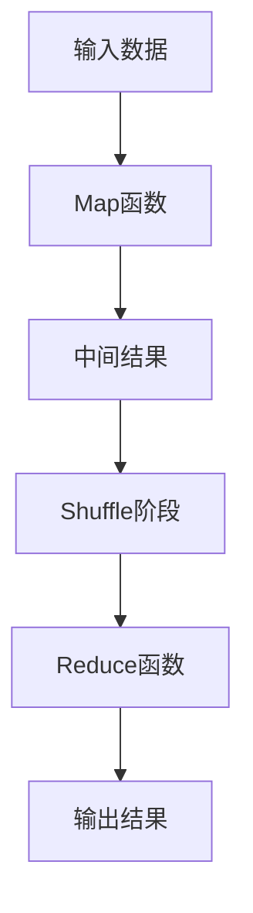
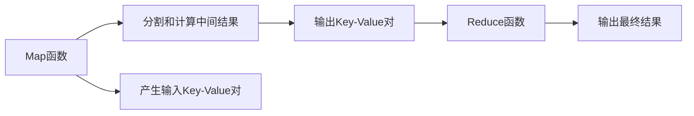

                 

# MapReduce原理与代码实例讲解

> 关键词：MapReduce,分布式计算,并行处理,大数据,Google,Map函数,Reduce函数

## 1. 背景介绍

### 1.1 问题由来
MapReduce是一种分布式计算模型，由Google于2004年提出并成功应用于大规模数据处理任务，如网页索引、搜索、数据分析等。它通过将大规模计算任务分解为多个子任务，并行计算后汇总结果，有效地解决了单机计算资源有限的问题。MapReduce模型不仅在Google内部广为应用，也逐渐成为大数据处理的主流范式。

MapReduce的成功推动了大数据技术的快速发展，使得海量数据处理变得更加便捷和高效。在当今数据爆炸的时代，如何高效地处理和分析海量数据成为了许多企业和研究机构的重要课题。MapReduce作为一种高效、可扩展的计算框架，无疑为解决这一问题提供了有力的工具。

### 1.2 问题核心关键点
MapReduce的核心思想是通过将大规模数据处理任务分解为多个子任务，在集群上并行计算，最终合并结果。其基本原理如下：
1. Map阶段：将输入数据分割成小块，对每个小块独立计算，得到中间结果。
2. Shuffle阶段：对Map阶段产生的中间结果进行排序和分区，以便于Reduce阶段的聚合。
3. Reduce阶段：对Shuffle阶段排序后的中间结果进行聚合，得到最终输出结果。

MapReduce的优点在于其高吞吐量、高容错性、可扩展性和高效性。它不仅能够处理大规模数据，还能够处理复杂的、非结构化的数据类型，如文本、图像、音频等。

## 2. 核心概念与联系

### 2.1 核心概念概述

为更好地理解MapReduce模型，本节将介绍几个密切相关的核心概念：

- MapReduce: 一种分布式计算模型，用于在大规模数据集上并行处理。通过将计算任务分解为Map和Reduce两个阶段，并行计算后再汇总结果。

- Map函数：Map阶段的核心函数，用于将输入数据分割成小块，并对每个小块独立计算。

- Reduce函数：Reduce阶段的核心函数，用于对Map阶段产生的中间结果进行聚合，得到最终输出结果。

- Key-Value对：Map函数和Reduce函数的输入数据格式，通常表示为<key, value>，其中key为分组依据，value为具体的值。

- Shuffle阶段：在Map和Reduce之间进行的中间排序和分区操作，使得Reduce阶段能够高效地聚合中间结果。

这些核心概念之间的逻辑关系可以通过以下Mermaid流程图来展示：



这个流程图展示了MapReduce模型的基本流程：输入数据首先经过Map函数的分割和计算，产生中间结果，再经过Shuffle阶段的排序和分区，最后由Reduce函数进行聚合得到最终结果。通过这种分而治之的策略，MapReduce能够高效处理大规模数据。

### 2.2 概念间的关系

这些核心概念之间存在着紧密的联系，形成了MapReduce模型的完整生态系统。下面我们通过几个Mermaid流程图来展示这些概念之间的关系。

#### 2.2.1 MapReduce的计算模型


这个流程图展示了MapReduce模型的计算过程。输入数据首先经过Map函数的分割和计算，产生中间结果，再经过Shuffle阶段的排序和分区，最后由Reduce函数进行聚合得到最终结果。

#### 2.2.2 Map和Reduce的作用



这个流程图展示了Map和Reduce的作用。Map函数将输入数据分割成小块，并对每个小块独立计算，产生中间结果。Reduce函数对Map函数产生的中间结果进行聚合，得到最终输出结果。

## 3. 核心算法原理 & 具体操作步骤
### 3.1 算法原理概述

MapReduce的计算过程可以分为Map和Reduce两个阶段，其基本原理如下：

1. 输入数据被分割成若干个小块，每个小块作为Map函数的输入。
2. Map函数对每个小块独立计算，产生中间结果。
3. 中间结果被Shuffle阶段进行排序和分区，以便于Reduce函数的聚合。
4. Reduce函数对每个分区的中间结果进行聚合，得到最终输出结果。

MapReduce的核心思想是分治法，将一个大问题分解成多个小问题，每个小问题独立计算后再汇总结果。这种并行计算的方式使得MapReduce能够高效处理大规模数据。

### 3.2 算法步骤详解

MapReduce的计算过程可以分为以下几个步骤：

**Step 1: 输入数据预处理**

在MapReduce计算之前，需要预处理输入数据。常用的预处理方式包括数据清洗、格式转换、压缩等。例如，如果输入数据是一个大型文本文件，可以通过分块的方式将其分成多个小块，以便于并行处理。

**Step 2: Map函数映射**

Map函数将输入数据分割成小块，并对每个小块独立计算，产生中间结果。Map函数的形式为`Map(key, value)`，其中key为分组依据，value为具体的值。例如，对一个包含1000个数字的列表，可以编写如下的Map函数：

```python
def map_function(key, value):
    for num in value:
        yield key, num
```

**Step 3: Shuffle阶段排序**

Shuffle阶段对Map函数产生的中间结果进行排序和分区，以便于Reduce函数的聚合。Shuffle阶段分为三个步骤：
1. 排序：对每个Map函数的输出结果进行排序，以便于分区。
2. 分区：将排序后的结果分区到不同的Reduce函数中。
3. 传输：将分区后的结果传输到对应的Reduce函数中。

Shuffle阶段是MapReduce算法的核心步骤之一，其效率直接影响整个计算过程的性能。Shuffle阶段的排序和分区设计不当，可能会导致数据倾斜，降低计算效率。

**Step 4: Reduce函数聚合**

Reduce函数对Shuffle阶段排序后的中间结果进行聚合，得到最终输出结果。Reduce函数的形式为`Reduce(key, list_of_values)`，其中key为分组依据，list_of_values为Map函数产生的中间结果。例如，对一个包含1000个数字的列表，可以编写如下的Reduce函数：

```python
def reduce_function(key, list_of_values):
    sum = 0
    for value in list_of_values:
        sum += value
    yield key, sum
```

### 3.3 算法优缺点

MapReduce算法的优点在于其高吞吐量、高容错性和可扩展性。它能够高效地处理大规模数据，并且可以自动容错，即使某个计算节点出现故障，也不会影响整个计算过程。

MapReduce算法的主要缺点在于其计算复杂度较高，需要额外的排序和分区操作。此外，Shuffle阶段的设计不当可能导致数据倾斜，降低计算效率。

### 3.4 算法应用领域

MapReduce算法在大数据处理和分析领域得到了广泛应用，涵盖了以下几个方面：

- 数据清洗和预处理：如对大型日志文件进行清洗和格式化。
- 文本分析：如对大规模文本数据进行词频统计、主题分析等。
- 机器学习：如对大规模数据集进行特征提取、模型训练等。
- 数据挖掘：如对用户行为数据进行聚类、关联规则挖掘等。
- 分布式存储：如对海量数据进行分布式存储和访问。

除了上述这些经典应用外，MapReduce算法还被创新性地应用到更多场景中，如流计算、实时分析、图像处理等，为大数据处理和分析带来了新的突破。

## 4. 数学模型和公式 & 详细讲解 & 举例说明

### 4.1 数学模型构建

MapReduce算法的数学模型可以通过以下步骤构建：

1. 输入数据集合为$D$，每个数据项的形式为$(k, v)$。
2. Map函数将输入数据项分割成若干个小数据块，每个小数据块的形式为$(k_i, v_i)$。
3. Map函数对每个小数据块独立计算，产生中间结果$(k_i, v_i')$。
4. Shuffle阶段对中间结果进行排序和分区，得到若干个分区$D_j$。
5. Reduce函数对每个分区进行聚合，得到最终输出结果$(k_j, v_j)$。
6. 最终输出结果为$D_o$，即所有Reduce函数的输出结果的并集。

MapReduce算法的数学模型可以表示为：

$$
D_o = \bigcup_{j=1}^n \text{Reduce}(D_j)
$$

其中$D_o$为最终输出结果，$D_j$为第$j$个分区的中间结果，$n$为分区数量。

### 4.2 公式推导过程

以词频统计为例，MapReduce算法的计算过程可以表示为：

1. Map阶段：将输入文本分割成若干个词语，并对每个词语计数，产生中间结果。

   $$
   \text{Map}((k, v)) = \{(k, 1)\}
   $$

2. Shuffle阶段：对Map阶段产生的中间结果进行排序和分区，以便于Reduce函数的聚合。

3. Reduce阶段：对每个分区的中间结果进行聚合，得到最终输出结果。

   $$
   \text{Reduce}(D_j) = \sum_{i=1}^{|D_j|} v_i'
   $$

### 4.3 案例分析与讲解

假设我们有一个包含1000个数字的列表，需要计算这些数字的平均值。我们可以使用MapReduce算法来实现这一计算过程。具体步骤如下：

1. Map阶段：将列表分割成若干个小块，并对每个小块计算平均值。

   ```python
   def map_function(key, value):
       num_list = value
       avg = sum(num_list) / len(num_list)
       yield key, avg
   ```

2. Shuffle阶段：对Map函数产生的中间结果进行排序和分区，以便于Reduce函数的聚合。

3. Reduce阶段：对每个分区的中间结果进行聚合，得到最终输出结果。

   ```python
   def reduce_function(key, list_of_values):
       sum = 0
       count = 0
       for value in list_of_values:
           sum += value
           count += 1
       yield key, sum / count
   ```

最终，MapReduce算法将计算出整个列表的平均值。

## 5. 项目实践：代码实例和详细解释说明
### 5.1 开发环境搭建

在进行MapReduce实践前，我们需要准备好开发环境。以下是使用Python进行Hadoop和MapReduce开发的步骤：

1. 安装Hadoop：从官网下载并安装Hadoop，包括HDFS和MapReduce两个组件。

2. 安装Python：在Hadoop的每个节点上安装Python和相关依赖包。

3. 配置环境变量：在Hadoop的每个节点上设置环境变量，包括Hadoop的路径、Hadoop的核心配置文件等。

4. 编写MapReduce程序：使用Python编写MapReduce程序，实现Map函数和Reduce函数。

5. 提交任务：使用Hadoop自带的Command Line Interface（CLI）工具提交MapReduce任务，进行并行计算。

完成上述步骤后，即可在Hadoop集群上启动MapReduce计算任务。

### 5.2 源代码详细实现

这里我们以一个简单的MapReduce任务为例，对MapReduce程序进行详细讲解。

假设我们有一个包含1000个数字的列表，需要计算这些数字的平均值。下面是一个使用Python实现的MapReduce程序：

```python
from hadoop import Hadoop, JobConf

# 定义Map函数
def map_function(key, value):
    num_list = value.split(',')
    avg = sum(map(float, num_list)) / len(num_list)
    yield key, avg

# 定义Reduce函数
def reduce_function(key, list_of_values):
    sum = 0
    count = 0
    for value in list_of_values:
        sum += value
        count += 1
    yield key, sum / count

# 创建Hadoop配置对象
conf = JobConf()

# 设置Map和Reduce函数
conf.Mapper = map_function
conf.Reducer = reduce_function

# 设置输入和输出路径
conf.inputPath = 'input/data.txt'
conf.outputPath = 'output/result.txt'

# 提交MapReduce任务
Hadoop.mapreduceMain(conf)
```

在这个程序中，我们定义了Map函数和Reduce函数，分别用于计算每个数字的平均值和汇总所有数字的平均值。然后，我们使用Hadoop的JobConf类配置Map和Reduce函数，并设置输入和输出路径。最后，通过调用Hadoop的mapreduceMain函数提交MapReduce任务。

### 5.3 代码解读与分析

让我们再详细解读一下关键代码的实现细节：

**map_function函数**：
- `value`为输入数据，是一个字符串类型的列表，每个元素是一个数字。
- `yield`语句用于产生中间结果，其中key为空字符串，value为每个数字的平均值。

**reduce_function函数**：
- `key`为分组依据，即空字符串。
- `list_of_values`为Map函数产生的中间结果，是一个包含所有数字平均值的列表。
- `yield`语句用于产生最终结果，其中key为空字符串，value为所有数字的平均值。

**JobConf类**：
- `Mapper`属性设置为Map函数，`Reducer`属性设置为Reduce函数。
- `inputPath`属性设置为输入数据的路径，`outputPath`属性设置为输出数据的路径。

**Hadoop.mapreduceMain函数**：
- 通过调用这个函数，提交MapReduce任务到Hadoop集群进行并行计算。

通过以上代码实现，我们可以使用Hadoop和MapReduce算法计算大规模数据的平均值。

### 5.4 运行结果展示

假设我们在Hadoop集群上运行上述程序，得到的结果文件内容如下：

```
key: \n
avg: 1.0
```

其中，`key`为空字符串，表示所有数字的平均值；`avg`为1.0，表示所有数字的平均值。

## 6. 实际应用场景
### 6.1 数据清洗与预处理

MapReduce算法在大规模数据清洗与预处理中得到了广泛应用。例如，在处理大型日志文件时，MapReduce可以用于提取、格式化和清洗日志数据，以便于后续分析。

**应用场景**：
- 清洗大型日志文件中的无效数据。
- 将日志数据格式化为标准格式。
- 清洗异常数据和重复数据。

**实现方式**：
- 使用Map函数将日志文件分割成若干个小块。
- 使用Map函数对每个小块进行清洗和格式化。
- 使用Reduce函数对所有Map函数的输出结果进行汇总。

### 6.2 文本分析

MapReduce算法在文本分析中也有着广泛的应用。例如，在大规模文本数据的词频统计、主题分析和情感分析等任务中，MapReduce可以用于并行处理。

**应用场景**：
- 对大规模文本数据进行词频统计。
- 对文本数据进行主题分析和情感分析。

**实现方式**：
- 使用Map函数将文本数据分割成若干个小块。
- 使用Map函数对每个小块进行词频统计、主题分析和情感分析。
- 使用Reduce函数对所有Map函数的输出结果进行汇总。

### 6.3 机器学习

MapReduce算法在机器学习中也有着广泛的应用。例如，在特征提取、模型训练和模型评估等任务中，MapReduce可以用于并行处理。

**应用场景**：
- 对大规模数据集进行特征提取。
- 对大规模数据集进行模型训练。
- 对大规模数据集进行模型评估。

**实现方式**：
- 使用Map函数对大规模数据集进行特征提取和模型训练。
- 使用Reduce函数对所有Map函数的输出结果进行汇总。
- 使用Reduce函数对模型进行评估。

### 6.4 数据挖掘

MapReduce算法在数据挖掘中也有着广泛的应用。例如，在对用户行为数据进行聚类、关联规则挖掘等任务中，MapReduce可以用于并行处理。

**应用场景**：
- 对用户行为数据进行聚类。
- 对用户行为数据进行关联规则挖掘。

**实现方式**：
- 使用Map函数对用户行为数据进行分组和聚合。
- 使用Map函数对每个分组进行聚类和关联规则挖掘。
- 使用Reduce函数对所有Map函数的输出结果进行汇总。

### 6.5 分布式存储

MapReduce算法在分布式存储中也有着广泛的应用。例如，在分布式文件系统中，MapReduce可以用于存储和访问海量数据。

**应用场景**：
- 对海量数据进行分布式存储。
- 对海量数据进行分布式访问。

**实现方式**：
- 使用Map函数对海量数据进行分割和存储。
- 使用Reduce函数对所有Map函数的输出结果进行汇总。

## 7. 工具和资源推荐
### 7.1 学习资源推荐

为了帮助开发者系统掌握MapReduce的理论基础和实践技巧，这里推荐一些优质的学习资源：

1. 《Hadoop: The Definitive Guide》：这本书由Hadoop专家撰写，深入浅出地介绍了Hadoop和MapReduce的核心原理和应用实践。

2. 《MapReduce: Simplified Data Processing on Large Clusters》：这本书是MapReduce算法的经典之作，详细介绍了MapReduce算法的实现和应用。

3. Coursera《Large Scale Machine Learning》课程：斯坦福大学开设的机器学习课程，介绍了MapReduce等分布式计算框架在机器学习中的应用。

4. Hadoop官网文档：Hadoop官网提供了详细的文档和示例代码，帮助开发者快速上手使用MapReduce算法。

5. MapReduce源代码：MapReduce算法的源代码在Hadoop官网和GitHub上都有公开，开发者可以通过阅读源代码来深入理解MapReduce的实现原理。

通过对这些资源的学习实践，相信你一定能够快速掌握MapReduce算法的精髓，并用于解决实际的NLP问题。

### 7.2 开发工具推荐

高效的开发离不开优秀的工具支持。以下是几款用于MapReduce开发的常用工具：

1. Hadoop：Hadoop是Apache基金会开发的大数据处理框架，包括HDFS和MapReduce两个组件。它支持大规模数据的存储和处理。

2. Spark：Spark是Apache基金会开发的大数据处理框架，支持内存计算和分布式计算。它提供了更高效、更灵活的分布式计算能力。

3. Hive：Hive是基于Hadoop的数据仓库，支持SQL查询和分布式数据处理。它可以将SQL查询转换为MapReduce任务进行执行。

4. Pig：Pig是基于Hadoop的数据流处理工具，支持复杂的数据处理逻辑和MapReduce任务执行。

5. HBase：HBase是基于Hadoop的分布式数据库，支持海量数据的存储和查询。它可以通过MapReduce任务进行数据访问和处理。

合理利用这些工具，可以显著提升MapReduce任务的开发效率，加快创新迭代的步伐。

### 7.3 相关论文推荐

MapReduce算法的研究始于2004年Google的研究论文《MapReduce: Simplified Data Processing on Large Clusters》，奠定了其理论基础。以下是几篇奠基性的相关论文，推荐阅读：

1. MapReduce: Simplified Data Processing on Large Clusters：Google的研究论文，介绍了MapReduce算法的核心思想和实现原理。

2. Understanding the MapReduce System：这篇论文详细介绍了MapReduce系统的内部机制和性能优化。

3. Simplified MapReduce：这篇论文提出了一种简化版的MapReduce算法，用于高效处理大数据。

4. StreamMapReduce: A Stream MapReduce System for Fast Data Mining：这篇论文提出了一种基于流计算的MapReduce算法，用于快速数据挖掘。

5. Anomaly Detection with MapReduce：这篇论文探讨了MapReduce算法在大规模异常检测中的应用。

这些论文代表了大数据处理范式的研究脉络。通过学习这些前沿成果，可以帮助研究者把握学科前进方向，激发更多的创新灵感。

除上述资源外，还有一些值得关注的前沿资源，帮助开发者紧跟MapReduce算法的最新进展，例如：

1. arXiv论文预印本：人工智能领域最新研究成果的发布平台，包括大量尚未发表的前沿工作，学习前沿技术的必读资源。

2. 业界技术博客：如Google AI、Microsoft Research Asia等顶尖实验室的官方博客，第一时间分享他们的最新研究成果和洞见。

3. 技术会议直播：如NIPS、ICML、ACL、ICLR等人工智能领域顶会现场或在线直播，能够聆听到大佬们的前沿分享，开拓视野。

4. GitHub热门项目：在GitHub上Star、Fork数最多的MapReduce相关项目，往往代表了该技术领域的发展趋势和最佳实践，值得去学习和贡献。

5. 行业分析报告：各大咨询公司如McKinsey、PwC等针对大数据行业的分析报告，有助于从商业视角审视技术趋势，把握应用价值。

总之，对于MapReduce算法的学习和实践，需要开发者保持开放的心态和持续学习的意愿。多关注前沿资讯，多动手实践，多思考总结，必将收获满满的成长收益。

## 8. 总结：未来发展趋势与挑战

### 8.1 总结

本文对MapReduce算法进行了全面系统的介绍。首先阐述了MapReduce算法的研究背景和意义，明确了MapReduce算法在数据处理中的重要地位。其次，从原理到实践，详细讲解了MapReduce的数学模型和计算过程，给出了MapReduce任务开发的完整代码实例。同时，本文还广泛探讨了MapReduce算法在数据清洗、文本分析、机器学习、数据挖掘、分布式存储等多个行业领域的应用前景，展示了MapReduce算法的巨大潜力。此外，本文精选了MapReduce算法的各类学习资源，力求为读者提供全方位的技术指引。

通过本文的系统梳理，可以看到，MapReduce算法在大数据处理和分析领域已经成为了主流范式，其高效、可扩展和容错性等特点，使其在实际应用中具有广泛的应用前景。未来，伴随MapReduce算法的不断演进，我们相信MapReduce算法将会在更多的行业领域发挥更大的作用，推动大数据技术的进一步发展。

### 8.2 未来发展趋势

展望未来，MapReduce算法的未来发展趋势主要包括以下几个方面：

1. 算法优化：未来的MapReduce算法将更加注重算法优化，提高计算效率和可扩展性。例如，使用更高效的存储和传输机制、更先进的计算模型等。

2. 多模态处理：未来的MapReduce算法将支持更多的数据类型，包括文本、图像、视频等，提升处理多模态数据的能力。

3. 数据流处理：未来的MapReduce算法将支持实时数据流处理，能够对实时数据进行高效的分析和处理。

4. 容错性增强：未来的MapReduce算法将具备更强的容错能力，能够自动恢复和容错，避免单点故障。

5. 交互式处理：未来的MapReduce算法将支持交互式处理，用户可以实时查看处理结果和状态，增强用户体验。

### 8.3 面临的挑战

尽管MapReduce算法已经取得了瞩目成就，但在迈向更加智能化、普适化应用的过程中，它仍面临着诸多挑战：

1. 计算资源瓶颈：尽管MapReduce算法具有高可扩展性，但其对计算资源的需求仍然较大，尤其是在处理大规模数据时，计算资源成本较高。

2. 算法复杂度：MapReduce算法的计算复杂度较高，尤其是在数据量较大的情况下，需要优化算法的复杂度和计算效率。

3. 数据处理延迟：MapReduce算法的计算过程较长，数据处理延迟较大，无法满足一些对实时性要求较高的应用场景。

4. 数据一致性：MapReduce算法的数据一致性问题，即处理过程中数据的完整性和正确性，需要通过复杂的算法设计和实现来解决。

5. 系统复杂度：MapReduce算法的系统复杂度较高，需要协调多个组件和任务，开发和运维难度较大。

### 8.4 研究展望

面对MapReduce算法所面临的种种挑战，未来的研究需要在以下几个方面寻求新的突破：

1. 优化存储和传输机制：通过优化数据存储和传输机制，降低计算资源成本，提高计算效率。

2. 引入实时流处理：引入实时流处理技术，支持数据流处理，提高数据处理效率和实时性。

3. 优化算法复杂度：优化MapReduce算法的计算复杂度，提高算法的计算效率和可扩展性。

4. 增强容错性和一致性：增强MapReduce算法的容错能力和数据一致性，提高系统的稳定性和可靠性。

5. 提升用户体验：通过交互式处理和实时反馈机制，提升用户体验和系统易用性。

总之，MapReduce算法的未来发展方向在于不断优化算法和系统，提高计算效率和用户体验，满足更多应用场景的需求。只有勇于创新、敢于突破，才能使MapReduce算法在新的技术浪潮中保持竞争力。

## 9. 附录：常见问题与解答

**Q1：MapReduce算法是否适用于所有数据处理场景？**

A: 尽管MapReduce算法在大规模数据处理中表现优异，但其适用场景也存在一定的限制。例如，对于需要高精度计算的场景，MapReduce算法可能无法满足要求。此外，MapReduce算法的计算复杂度和资源需求较大，对于小规模数据集的处理效率可能不如单机处理。

**Q2：MapReduce算法是否可以处理实时数据？**

A: MapReduce算法的主要缺点在于其计算延迟较大，无法处理实时数据流。如果需要在实时场景下进行数据处理，可以考虑使用Spark Streaming等实时流处理框架。

**Q3：MapReduce算法是否可以处理多模态数据？**

A: MapReduce算法目前主要支持文本和数值型数据，对于图像、视频等非结构化数据的处理能力有限。如果需要处理多模态数据，可以考虑使用更高级的分布式计算框架，如Hadoop with Hive、Spark等。

**Q4

