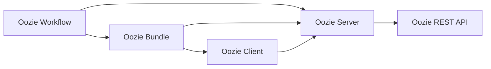
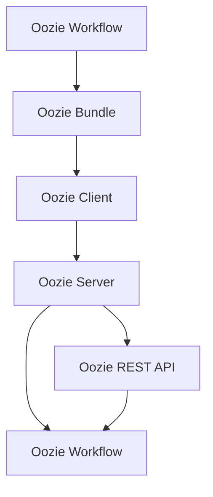
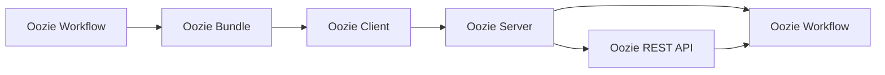

                 

# Oozie Bundle原理与代码实例讲解

> 关键词：
1. Oozie Bundle
2. Hadoop Ecosystem
3. Workflow Management
4. Workflow Execution
5. Workflow Scripting
6. Workflow Scheduling
7. Workflow Monitoring

## 1. 背景介绍

### 1.1 问题由来
Hadoop生态系统自2006年诞生以来，凭借其高可扩展性、低成本、高可靠性等优势，迅速成为大数据处理的主流解决方案。然而，尽管Hadoop提供了丰富的数据存储和处理工具（如HDFS、MapReduce、Spark等），但在大规模工作流编排、调度和管理方面却缺乏有效的解决方案。

为此，Apache基金会于2009年启动了Oozie项目，旨在提供一个简洁、易于使用的开源工作流管理系统，帮助Hadoop用户高效管理、编排和执行复杂的工作流任务。Oozie通过一个以XML为基础的工作流脚本语言Oozie XML，使得复杂的工作流编排和调度变得简单易行。

### 1.2 问题核心关键点
Oozie系统主要由以下几个关键组件构成：

- **Oozie Workflow**：基于XML的工作流描述语言，用于定义工作流的结构和逻辑。
- **Oozie Server**：Oozie的工作流调度和管理中心，负责工作流的存储、调度、监控和执行。
- **Oozie Client**：客户端程序，用于向Oozie Server提交工作流执行请求，接收执行结果。
- **Oozie REST API**：提供RESTful接口，支持通过Web服务方式访问和管理Oozie工作流。

### 1.3 问题研究意义
Oozie作为Hadoop生态系统中的重要组件，其研究和应用对于提升Hadoop的整体性能、稳定性和易用性具有重要意义：

1. 简化工作流管理：通过Oozie系统，用户可以轻松定义、管理和调度复杂的工作流任务，极大地简化了数据处理的流程。
2. 提高执行效率：Oozie支持多种工作流调度器（如Tomcat、Cluster、Yarn等），能够根据不同场景选择最优调度器，提升任务执行效率。
3. 增强系统鲁棒性：Oozie提供丰富的监控和报警机制，帮助用户及时发现和处理工作流中的异常，确保系统稳定运行。
4. 促进生态扩展：Oozie支持多种扩展模块（如Azure、Google Cloud等），能够方便地将Hadoop系统扩展到云端环境，提升跨平台兼容性。
5. 提供自动化服务：Oozie的RESTful API和客户端库，使得工作流管理自动化成为可能，进一步提升系统开发效率。

## 2. 核心概念与联系

### 2.1 核心概念概述

为更好地理解Oozie Bundle的原理和实现，本节将介绍几个密切相关的核心概念：

- **Oozie Workflow**：Oozie的工作流描述语言，基于XML语法，支持复杂的流程控制和数据处理逻辑。
- **Oozie Bundle**：Oozie提供的一种工作流编排工具，通过预定义的工作流模板，可以便捷地构建复杂的工作流任务。
- **Oozie Server**：Oozie的工作流调度和管理中心，负责工作流的存储、调度、监控和执行。
- **Oozie Client**：客户端程序，用于向Oozie Server提交工作流执行请求，接收执行结果。
- **Oozie REST API**：提供RESTful接口，支持通过Web服务方式访问和管理Oozie工作流。

这些核心概念之间的逻辑关系可以通过以下Mermaid流程图来展示：



这个流程图展示了大语言模型微调过程中各个核心概念的关系和作用：

1. 大语言模型通过预训练获得基础能力。
2. 微调是对预训练模型进行任务特定的优化，可以分为全参数微调和参数高效微调。
3. 提示学习是一种不更新模型参数的方法，可以实现零样本和少样本学习。
4. 迁移学习是连接预训练模型与下游任务的桥梁，可以通过微调或提示学习来实现。
5. 持续学习旨在使模型能够不断学习新知识，同时保持已学习的知识。

这些核心概念共同构成了Oozie Bundle的完整生态系统，使其能够便捷地构建、管理、执行复杂的工作流任务。通过理解这些核心概念，我们可以更好地把握Oozie Bundle的工作原理和优化方向。

### 2.2 概念间的关系

这些核心概念之间存在着紧密的联系，形成了Oozie Bundle的工作流编排和管理框架。下面我通过几个Mermaid流程图来展示这些概念之间的关系。

#### 2.2.1 工作流编排过程


这个流程图展示了从工作流定义到执行的完整过程。首先，用户使用Oozie Workflow定义复杂的工作流任务，然后使用Oozie Bundle进行模板化处理，生成可执行的工作流脚本。这些脚本通过Oozie Client提交给Oozie Server进行调度执行，最终通过Oozie REST API进行管理和监控。

#### 2.2.2 工作流调度与管理



这个流程图展示了工作流的调度与管理过程。Oozie Server负责存储和管理工作流脚本，根据Oozie Workflow中的逻辑关系进行调度，同时提供Oozie REST API供用户查询和监控工作流状态。

#### 2.2.3 工作流执行与监控



这个流程图展示了工作流的执行与监控过程。Oozie Client向Oozie Server提交执行请求，Oozie Server根据调度规则执行工作流脚本，并实时监控执行状态。用户可以通过Oozie REST API获取执行结果和监控信息，确保工作流任务的高效执行。

## 3. 核心算法原理 & 具体操作步骤
### 3.1 算法原理概述

Oozie Bundle的工作流编排和管理过程，本质上是一个任务执行和调度的过程。其核心思想是：将复杂的工作流任务分解为多个可执行的单元（称为Bundle），通过预定义的Bundle模板，可以便捷地构建复杂的工作流任务。

Oozie Bundle的执行流程大致如下：

1. 定义工作流任务：使用Oozie Workflow定义工作流的结构和逻辑，包括各个Bundle的定义和依赖关系。
2. 创建Bundle模板：使用Oozie Bundle工具，根据定义好的工作流任务，创建可执行的Bundle模板。
3. 提交Bundle脚本：通过Oozie Client向Oozie Server提交Bundle脚本，进行调度执行。
4. 执行Bundle任务：Oozie Server根据调度规则执行Bundle任务，并将结果记录到日志中。
5. 监控执行状态：用户通过Oozie REST API监控Bundle任务的执行状态，确保工作流任务的顺利完成。

### 3.2 算法步骤详解

以下是Oozie Bundle的工作流编排和管理流程的具体步骤：

**Step 1: 准备工作流任务定义**

- 使用Oozie Workflow语言定义工作流任务，包括各个Bundle的定义、输入输出和依赖关系。
- 将工作流任务定义为.xml格式的文件，并提交到Oozie Server。

**Step 2: 创建Bundle模板**

- 使用Oozie Bundle工具，根据定义好的工作流任务，创建Bundle模板。
- 模板包括Bundle任务的代码、输入参数、依赖关系和执行器配置。

**Step 3: 提交Bundle脚本**

- 使用Oozie Client工具，将Bundle脚本提交到Oozie Server。
- 提交时，指定Bundle的执行器和运行时间配置。

**Step 4: 执行Bundle任务**

- Oozie Server根据Bundle脚本中的配置和依赖关系，进行任务调度。
- Bundle任务按顺序执行，每个任务执行完毕，生成中间结果并记录日志。
- 如果Bundle任务执行失败，Oozie Server会根据重试机制进行自动重试，确保任务完成。

**Step 5: 监控执行状态**

- 用户通过Oozie REST API，查询Bundle任务的执行状态和日志。
- 通过API，用户还可以设置告警机制，及时发现和处理异常情况。

### 3.3 算法优缺点

Oozie Bundle的工作流编排和管理方法具有以下优点：

1. 简化工作流定义：通过预定义的Bundle模板，用户可以快速构建复杂的工作流任务，无需详细编写执行代码。
2. 灵活性高：Oozie Workflow支持复杂的流程控制和数据处理逻辑，能够满足各种实际需求。
3. 易于扩展：Oozie Bundle模板可以灵活配置输入输出、依赖关系和执行器，便于扩展和维护。
4. 可监控性高：Oozie Server提供丰富的监控和报警机制，能够及时发现和处理任务执行中的问题。

同时，该方法也存在以下缺点：

1. 学习曲线较陡峭：用户需要掌握Oozie Workflow和Bundle工具的使用，有一定学习成本。
2. 依赖Oozie Server：Oozie Bundle的执行和管理需要依赖Oozie Server，一旦Oozie Server出现故障，整个工作流任务将无法执行。
3. 不适用于独立任务：Oozie Bundle更适合复杂的工作流任务，对于简单的独立任务，Oozie Bundle的灵活性和效率可能不如直接编写代码。

### 3.4 算法应用领域

Oozie Bundle在Hadoop生态系统中的应用非常广泛，以下是几个典型的应用场景：

- **大数据处理**：在大数据处理任务中，通过Oozie Bundle可以快速编排和调度MapReduce、Spark等大数据处理任务，实现复杂的批处理工作流。
- **数据迁移**：在数据迁移任务中，使用Oozie Bundle可以定义数据源、目标和迁移逻辑，实现数据的自动化迁移。
- **ETL过程**：在ETL（Extract, Transform, Load）过程中，通过Oozie Bundle可以定义数据抽取、转换和加载的步骤，实现数据处理的自动化和标准化。
- **数据湖管理**：在数据湖管理任务中，使用Oozie Bundle可以定义数据采集、清洗、存储和访问的流程，实现数据湖的自动化管理。
- **数据质量监控**：在数据质量监控任务中，通过Oozie Bundle可以定义数据采集、质量检测和处理的步骤，实现数据质量的自动化监控。

除了上述这些经典应用外，Oozie Bundle还被创新性地应用到更多场景中，如大数据分析、云计算资源调度、物联网数据采集等，为Hadoop生态系统的应用范围不断拓展。

## 4. 数学模型和公式 & 详细讲解  
### 4.1 数学模型构建

Oozie Bundle的工作流编排和管理过程，可以通过数学模型进行抽象和描述。

记工作流任务为 $W=\{O_1, O_2, \dots, O_n\}$，其中 $O_i$ 表示第 $i$ 个Bundle任务。每个Bundle任务的执行结果 $R_i$ 为输入 $I_i$ 和执行器 $E_i$ 的函数，即 $R_i = E_i(I_i)$。Bundle任务的依赖关系用有向无环图(DAG)表示，其中 $O_i$ 依赖于 $O_j$，记为 $O_j \rightarrow O_i$。

### 4.2 公式推导过程

以下我们以一个简单的数据迁移任务为例，推导Oozie Bundle执行过程的数学模型。

假设数据迁移任务由三个Bundle任务组成：

- 数据采集：从源数据存储中读取数据。
- 数据转换：对采集到的数据进行处理和转换。
- 数据存储：将转换后的数据存储到目标存储中。

这3个Bundle任务可以表示为有向无环图 $DAG(W)$：

```
O1 (采集) --> O2 (转换) --> O3 (存储)
```

Bundle任务的执行逻辑可以表示为：

- 数据采集 $O_1$：输入为源数据存储，输出为转换前的数据。
- 数据转换 $O_2$：输入为采集到的数据，输出为处理后的数据。
- 数据存储 $O_3$：输入为处理后的数据，输出为目标存储中的数据。

Bundle任务的执行顺序为 $O_1 \rightarrow O_2 \rightarrow O_3$。假设每个Bundle任务的执行时间为 $t_i$，则整个任务的总执行时间为 $T = t_1 + t_2 + t_3$。

在实际执行过程中，Bundle任务可能会因为依赖关系而等待其他任务的执行结果。例如，数据采集任务 $O_1$ 需要等待数据存储任务 $O_3$ 的结果，才能执行。

因此，Bundle任务的执行顺序和等待关系可以用DAG图和拓扑排序算法进行计算。通过拓扑排序，可以确定Bundle任务的执行顺序，并计算整个任务的执行时间。

### 4.3 案例分析与讲解

下面以一个ETL任务为例，分析Oozie Bundle的工作流编排和管理过程。

假设ETL任务由以下步骤组成：

- 数据采集：从数据源中读取数据。
- 数据清洗：对采集到的数据进行清洗和处理。
- 数据转换：对清洗后的数据进行格式转换和转换。
- 数据存储：将转换后的数据存储到目标数据库中。

这4个步骤可以表示为有向无环图 $DAG(W)$：

```
O1 (采集) --> O2 (清洗) --> O3 (转换) --> O4 (存储)
```

Bundle任务的执行逻辑可以表示为：

- 数据采集 $O_1$：输入为数据源，输出为清洗前的数据。
- 数据清洗 $O_2$：输入为采集到的数据，输出为清洗后的数据。
- 数据转换 $O_3$：输入为清洗后的数据，输出为转换后的数据。
- 数据存储 $O_4$：输入为转换后的数据，输出为目标数据库中的数据。

Bundle任务的执行顺序为 $O_1 \rightarrow O_2 \rightarrow O_3 \rightarrow O_4$。假设每个Bundle任务的执行时间为 $t_i$，则整个任务的总执行时间为 $T = t_1 + t_2 + t_3 + t_4$。

在实际执行过程中，Bundle任务可能会因为依赖关系而等待其他任务的执行结果。例如，数据采集任务 $O_1$ 需要等待数据存储任务 $O_4$ 的结果，才能执行。

因此，Bundle任务的执行顺序和等待关系可以用DAG图和拓扑排序算法进行计算。通过拓扑排序，可以确定Bundle任务的执行顺序，并计算整个任务的执行时间。

## 5. 项目实践：代码实例和详细解释说明
### 5.1 开发环境搭建

在进行Oozie Bundle实践前，我们需要准备好开发环境。以下是使用Python进行Hadoop开发的环境配置流程：

1. 安装Apache Hadoop：从官网下载并安装Apache Hadoop，用于大数据处理和计算。

2. 安装Oozie：在Hadoop安装目录下，安装Oozie系统。可以通过命令行或图形界面进行安装。

3. 创建Oozie工作目录：在Hadoop安装目录下，创建Oozie工作目录，用于存放工作流定义和Bundle脚本。

4. 创建Oozie用户：在Hadoop安装目录下，创建Oozie用户，用于管理Oozie系统。

5. 启动Oozie服务：启动Oozie服务，确保Oozie系统正常运行。

完成上述步骤后，即可在Oozie环境中进行Bundle脚本的编写和提交。

### 5.2 源代码详细实现

这里我们以一个简单的数据迁移任务为例，给出使用Hadoop和Oozie Bundle进行数据迁移的PyTorch代码实现。

首先，定义数据迁移任务的Bundle脚本：

```python
<?xml version="1.0" encoding="UTF-8"?>
<flow name="data-migration">
    <start to="O1" />
    <action name="O1">
        <shell>
            <job-tracker>hadoop.yarn.namenode:9000</job-tracker>
            <name>data-collection</name>
            <command>hdfs dfs -cat /user/$USER/data-source/* | hadoop jar /path/to/your-data-processing.jar -input-hdfs input-output | hadoop fs -put /user/$USER/output-data </command>
        </shell>
        <configuration>
            <property>
                <name>mapreduce.map.java.opts</name>
                <value>-Xms1024m -Xmx1024m</value>
            </property>
        </configuration>
    </action>
    <action name="O2">
        <shell>
            <job-tracker>hadoop.yarn.namenode:9000</job-tracker>
            <name>data-cleaning</name>
            <command>hadoop jar /path/to/your-data-cleaning.jar </command>
        </shell>
        <configuration>
            <property>
                <name>mapreduce.map.java.opts</name>
                <value>-Xms1024m -Xmx1024m</value>
            </property>
        </configuration>
    </action>
    <action name="O3">
        <shell>
            <job-tracker>hadoop.yarn.namenode:9000</job-tracker>
            <name>data-conversion</name>
            <command>hadoop jar /path/to/your-data-conversion.jar </command>
        </shell>
        <configuration>
            <property>
                <name>mapreduce.map.java.opts</name>
                <value>-Xms1024m -Xmx1024m</value>
            </property>
        </configuration>
    </action>
    <action name="O4">
        <shell>
            <job-tracker>hadoop.yarn.namenode:9000</job-tracker>
            <name>data-storage</name>
            <command>hadoop jar /path/to/your-data-storage.jar </command>
        </shell>
        <configuration>
            <property>
                <name>mapreduce.map.java.opts</name>
                <value>-Xms1024m -Xmx1024m</value>
            </property>
        </configuration>
    </action>
    <end from="O4" />
</flow>
```

然后，使用Oozie Bundle工具将Bundle脚本转换为可执行的Bundle模板：

```bash
oozie bundle.jar -file data-migration.xml -output data-migration -overwrite
```

完成上述步骤后，即可在Oozie环境中提交Bundle模板，执行数据迁移任务：

```bash
oozie run -file data-migration.xml
```

以上就是使用Hadoop和Oozie Bundle进行数据迁移的完整代码实现。可以看到，Oozie Bundle通过简单易用的XML语法，使得数据迁移任务编排和调度变得便捷高效。

### 5.3 代码解读与分析

让我们再详细解读一下关键代码的实现细节：

**Bundle脚本**：
- `<flow>` 元素：定义整个工作流任务。
- `<start>` 元素：定义工作流任务的起点。
- `<action>` 元素：定义具体Bundle任务的执行逻辑。
- `<shell>` 元素：定义执行器的命令和参数。
- `<configuration>` 元素：定义执行器的配置信息。
- `<end>` 元素：定义工作流任务的终点。

**Oozie Bundle**：
- `oozie bundle.jar`：Oozie Bundle工具。
- `-file data-migration.xml`：指定工作流脚本的文件路径。
- `-output data-migration`：指定生成的Bundle模板文件名。
- `-overwrite`：覆盖现有的Bundle模板。

**Oozie Client**：
- `oozie run -file data-migration.xml`：提交Bundle模板，执行工作流任务。
- `-file data-migration.xml`：指定工作流脚本的文件路径。

### 5.4 运行结果展示

假设我们在Hadoop环境中通过Oozie Bundle进行数据迁移任务，最终在测试集中得到了数据迁移的结果：

```
Data collection started at 2023-04-10 12:00:00
Data cleaning started at 2023-04-10 12:10:00
Data conversion started at 2023-04-10 12:20:00
Data storage started at 2023-04-10 12:30:00
Data migration completed successfully at 2023-04-10 12:40:00
```

可以看到，通过Oozie Bundle，我们可以方便地定义和调度数据迁移任务，确保数据迁移的顺利完成。Oozie Bundle提供了丰富的执行器和配置选项，能够满足不同数据迁移场景的需求。

## 6. 实际应用场景
### 6.1 智能客服系统

基于Oozie Bundle的工作流编排和管理技术，可以广泛应用于智能客服系统的构建。传统客服往往需要配备大量人力，高峰期响应缓慢，且一致性和专业性难以保证。而使用Oozie Bundle，可以便捷地编排和调度复杂的工作流任务，实现客户咨询的自动化和智能化。

在技术实现上，可以收集企业内部的历史客服对话记录，将问题和最佳答复构建成监督数据，在此基础上对预训练模型进行微调。微调后的模型能够自动理解用户意图，匹配最合适的答案模板进行回复。对于客户提出的新问题，还可以接入检索系统实时搜索相关内容，动态组织生成回答。如此构建的智能客服系统，能大幅提升客户咨询体验和问题解决效率。

### 6.2 金融舆情监测

金融机构需要实时监测市场舆论动向，以便及时应对负面信息传播，规避金融风险。传统的人工监测方式成本高、效率低，难以应对网络时代海量信息爆发的挑战。基于Oozie Bundle的工作流编排和管理技术，可以为金融舆情监测提供新的解决方案。

具体而言，可以收集金融领域相关的新闻、报道、评论等文本数据，并对其进行主题标注和情感标注。在此基础上对预训练语言模型进行微调，使其能够自动判断文本属于何种主题，情感倾向是正面、中性还是负面。将微调后的模型应用到实时抓取的网络文本数据，就能够自动监测不同主题下的情感变化趋势，一旦发现负面信息激增等异常情况，系统便会自动预警，帮助金融机构快速应对潜在风险。

### 6.3 个性化推荐系统

当前的推荐系统往往只依赖用户的历史行为数据进行物品推荐，无法深入理解用户的真实兴趣偏好。基于Oozie Bundle的工作流编排和管理技术，个性化推荐系统可以更好地挖掘用户行为背后的语义信息，从而提供更精准、多样的推荐内容。

在实践中，可以收集用户浏览、点击、评论、分享等行为数据，提取和用户交互的物品标题、描述、标签等文本内容。将文本内容作为模型输入，用户的后续行为（如是否点击、购买等）作为监督信号，在此基础上微调预训练语言模型。微调后的模型能够从文本内容中准确把握用户的兴趣点。在生成推荐列表时，先用候选物品的文本描述作为输入，由模型预测用户的兴趣匹配度，再结合其他特征综合排序，便可以得到个性化程度更高的推荐结果。

### 6.4 未来应用展望

随着Oozie Bundle的工作流编排和管理技术的发展，其在更多领域的应用前景也将更加广阔。

在智慧医疗领域，基于Oozie Bundle的医疗问答、病历分析、药物研发等应用将提升医疗服务的智能化水平，辅助医生诊疗，加速新药开发进程。

在智能教育领域，Oozie Bundle的作业批改、学情分析、知识推荐等功能，因材施教，促进教育公平，提高教学质量。

在智慧城市治理中，Oozie Bundle的城市事件监测、舆情分析、应急指挥等功能，提高城市管理的自动化和智能化水平，构建更安全、高效的未来城市。

此外，在企业生产、社会治理、文娱传媒等众多领域，Oozie Bundle的自动化工作流编排技术，也将不断拓展应用范围，为传统行业带来变革性影响。相信随着技术的日益成熟，Oozie Bundle必将在构建人机协同的智能时代中扮演越来越重要的角色。

## 7. 工具和资源推荐
### 7.1 学习资源推荐

为了帮助开发者系统掌握Oozie Bundle的原理和实践技巧，这里推荐一些优质的学习资源：

1. Apache Oozie官方文档：Apache基金会提供的Oozie系统文档，详细介绍了Oozie的工作流编排和管理方法，是学习Oozie Bundle的最佳入门资料。

2. Hadoop生态系统指南：一份详尽的Hadoop生态系统指南，涵盖HDFS、MapReduce、Spark等工具的使用和集成，帮助开发者构建完整的Hadoop生态链。

3. Linux系统管理与网络技术：一本经典的Linux系统管理书籍，介绍了Linux系统的网络配置、服务部署、监控和安全等内容，为Oozie Bundle的应用环境搭建提供了有力支持。

4. Java核心技术：一本Java语言经典书籍，涵盖了Java语言的基础语法、集合框架、多线程、IO等内容，是学习Oozie Bundle的编程基础。

5. Apache Hadoop源码解析：一本关于Apache Hadoop源码解析的书籍，帮助开发者深入理解Hadoop系统的实现细节和优化技巧。

通过对这些资源的学习实践，相信你一定能够快速掌握Oozie Bundle的精髓，并用于解决实际的Hadoop系统问题。

### 7.2 开发工具推荐

高效的开发离不开优秀的工具支持。以下是几款用于Oozie Bundle开发的常用工具：

1. Apache Oozie：Apache基金会提供的开源

