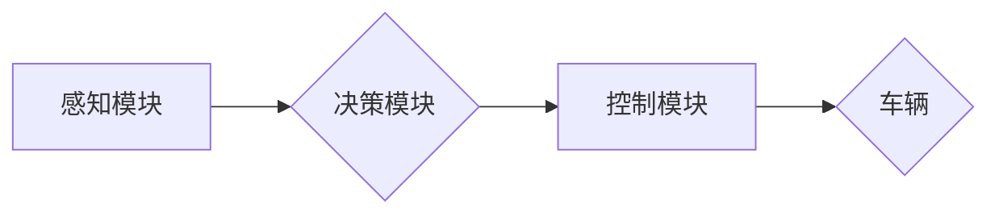

## 自动驾驶中的深度强化学习模型设计

> 关键词：自动驾驶、深度强化学习、模型设计、Q学习、DDPG、环境建模、奖励函数、安全保障

## 1. 背景介绍

自动驾驶技术作为未来交通运输的重要发展方向，近年来取得了显著进展。其中，深度强化学习 (Deep Reinforcement Learning, DRL) 由于其强大的学习能力和适应性，在自动驾驶领域展现出巨大的潜力。DRL 算法能够通过与环境交互学习最优的控制策略，从而实现车辆在复杂环境下的自主驾驶。

传统的自动驾驶方法主要依赖于规则-基于的系统和模型预测，但这些方法难以应对复杂、动态变化的驾驶场景。DRL 算法则能够学习驾驶策略，并根据环境反馈不断优化策略，从而实现更灵活、更安全、更智能的驾驶行为。

## 2. 核心概念与联系

### 2.1 深度强化学习

深度强化学习 (DRL) 是一种机器学习方法，它结合了深度神经网络和强化学习算法。

* **强化学习 (Reinforcement Learning, RL)**：是一种基于交互学习的机器学习方法，其核心是通过奖励机制引导智能体学习最优的行为策略。智能体与环境交互，根据环境反馈获得奖励，并根据奖励调整策略，最终学习到能够最大化累积奖励的策略。
* **深度神经网络 (Deep Neural Network, DNN)**：是一种能够学习复杂函数关系的神经网络结构，其具有强大的表示能力和泛化能力。

DRL 将深度神经网络应用于强化学习算法，能够学习更复杂的驾驶策略，并处理更丰富的环境信息。

### 2.2 自动驾驶系统架构

自动驾驶系统通常由以下几个主要模块组成：

* **感知模块**: 负责收集车辆周围环境的信息，例如道路状况、车辆位置、行人信息等。常用的感知技术包括摄像头、雷达、激光雷达等。
* **决策模块**: 负责根据感知模块获取的信息，制定车辆的驾驶决策，例如转向、加速、制动等。
* **控制模块**: 负责将决策模块的指令转化为车辆的实际控制信号，例如油门、刹车、方向盘等。

DRL 算法通常应用于决策模块，学习最优的驾驶策略。

**Mermaid 流程图**



## 3. 核心算法原理 & 具体操作步骤

### 3.1 算法原理概述

常见的DRL算法用于自动驾驶包括Q学习和深度确定性策略梯度(DDPG)。

* **Q学习**: 是一种经典的强化学习算法，它通过学习一个Q表来评估不同状态下采取不同动作的价值。Q表中每个元素代表了在特定状态下采取特定动作的期望回报。通过不断与环境交互，Q学习算法更新Q表，最终学习到最优的策略。
* **DDPG**: 是一种基于深度神经网络的强化学习算法，它能够学习连续动作空间的策略。DDPG 结合了深度神经网络和策略梯度方法，通过学习一个Actor网络和一个Critic网络来实现策略优化。Actor网络负责生成动作，Critic网络负责评估动作价值。

### 3.2 算法步骤详解

**Q学习**

1. 初始化Q表，将所有状态-动作对的价值设置为0。
2. 在环境中进行交互，观察当前状态和采取的动作。
3. 根据环境反馈获得奖励。
4. 更新Q表，使用Bellman方程更新状态-动作对的价值。
5. 重复步骤2-4，直到Q表收敛。

**DDPG**

1. 初始化Actor网络和Critic网络。
2. 在环境中进行交互，观察当前状态。
3. Actor网络根据当前状态生成动作。
4. 根据环境反馈获得奖励。
5. Critic网络评估动作价值。
6. 使用策略梯度方法更新Actor网络和Critic网络。
7. 重复步骤2-6，直到网络收敛。

### 3.3 算法优缺点

**Q学习**

* **优点**: 算法简单易懂，易于实现。
* **缺点**: 只能处理离散动作空间，难以应用于连续动作空间的自动驾驶场景。

**DDPG**

* **优点**: 可以处理连续动作空间，适用于自动驾驶场景。
* **缺点**: 算法复杂度较高，训练时间较长。

### 3.4 算法应用领域

DRL 算法在自动驾驶领域有广泛的应用，例如：

* **路径规划**: 学习最优的路径，避免碰撞和拥堵。
* **车速控制**: 学习合适的车速，保证安全行驶。
* **变道**: 学习安全、高效地变道。
* **自动泊车**: 学习自动泊车。

## 4. 数学模型和公式 & 详细讲解 & 举例说明

### 4.1 数学模型构建

DRL 算法的核心是强化学习的数学模型，该模型描述了智能体与环境的交互过程。

* **状态 (State)**：描述车辆当前的运行环境，例如车辆位置、速度、周围车辆信息等。
* **动作 (Action)**：车辆可以采取的行动，例如加速、减速、转向等。
* **奖励 (Reward)**：环境对智能体采取的动作给予的反馈，例如安全行驶奖励、碰撞惩罚等。
* **策略 (Policy)**：智能体根据当前状态选择动作的映射关系。

### 4.2 公式推导过程

**Bellman方程**: Q学习算法的核心是Bellman方程，它描述了状态-动作对价值的更新规则。

$$
Q(s, a) = R(s, a) + \gamma \max_{a'} Q(s', a')
$$

其中：

* $Q(s, a)$：在状态 $s$ 下采取动作 $a$ 的价值。
* $R(s, a)$：在状态 $s$ 下采取动作 $a$ 得到的奖励。
* $\gamma$：折扣因子，控制未来奖励的权重。
* $s'$：采取动作 $a$ 后进入的下一个状态。
* $a'$：在下一个状态 $s'$ 中采取的动作。

**策略梯度方法**: DDPG 算法使用策略梯度方法更新Actor网络。策略梯度方法的目标是最大化策略的期望回报。

$$
\nabla_{\theta} J(\theta) = \mathbb{E}_{\tau \sim \pi_{\theta}} \left[ \nabla_{\theta} \log \pi_{\theta}(a_t | s_t) \cdot A(s_t, a_t) \right]
$$

其中：

* $J(\theta)$：策略的期望回报。
* $\theta$：Actor网络的参数。
* $\pi_{\theta}(a_t | s_t)$：Actor网络在状态 $s_t$ 下采取动作 $a_t$ 的概率。
* $A(s_t, a_t)$：动作价值函数。

### 4.3 案例分析与讲解

**Q学习案例**: 

假设一个自动驾驶车辆需要学习在十字路口停车的策略。

* 状态：车辆位置、速度、红绿灯状态等。
* 动作：加速、减速、刹车等。
* 奖励：安全停车奖励、碰撞惩罚等。

通过Q学习算法，车辆可以学习到在不同状态下采取不同动作的价值，最终学习到最优的停车策略。

**DDPG案例**:

假设一个自动驾驶车辆需要学习在高速公路上保持车距的策略。

* 状态：车辆位置、速度、前车位置、前车速度等。
* 动作：加速、减速等。
* 奖励：安全行驶奖励、碰撞惩罚等。

通过DDPG算法，车辆可以学习到在不同状态下采取不同动作的策略，最终学习到最优的保持车距策略。

## 5. 项目实践：代码实例和详细解释说明

### 5.1 开发环境搭建

* **操作系统**: Ubuntu 18.04 或更高版本
* **Python**: 3.6 或更高版本
* **深度学习框架**: TensorFlow 或 PyTorch
* **其他依赖**: NumPy, Matplotlib 等

### 5.2 源代码详细实现

以下是一个使用TensorFlow实现DDPG算法的简单代码示例：

```python
import tensorflow as tf

# 定义Actor网络
class Actor(tf.keras.Model):
    def __init__(self, state_dim, action_dim):
        super(Actor, self).__init__()
        self.dense1 = tf.keras.layers.Dense(128, activation='relu')
        self.dense2 = tf.keras.layers.Dense(64, activation='relu')
        self.output = tf.keras.layers.Dense(action_dim, activation='tanh')

    def call(self, state):
        x = self.dense1(state)
        x = self.dense2(x)
        return self.output(x)

# 定义Critic网络
class Critic(tf.keras.Model):
    def __init__(self, state_dim, action_dim):
        super(Critic, self).__init__()
        self.dense1 = tf.keras.layers.Dense(128, activation='relu')
        self.dense2 = tf.keras.layers.Dense(64, activation='relu')
        self.output = tf.keras.layers.Dense(1)

    def call(self, state, action):
        x = tf.concat([state, action], axis=-1)
        x = self.dense1(x)
        x = self.dense2(x)
        return self.output(x)

#... (其他代码，例如训练循环、损失函数等)
```

### 5.3 代码解读与分析

* **Actor网络**: 负责生成动作，输出的动作值在-1到1之间，表示加速度或减速的幅度。
* **Critic网络**: 负责评估动作价值，输出一个标量值，表示采取该动作的期望回报。
* **训练循环**: 使用策略梯度方法更新Actor网络，并使用Bellman方程更新Critic网络。

### 5.4 运行结果展示

训练完成后，可以将训练好的Actor网络应用于自动驾驶车辆，使其能够在复杂环境下自主驾驶。

## 6. 实际应用场景

DRL 算法在自动驾驶领域有广泛的应用场景，例如：

* **自动驾驶汽车**: DRL 算法可以用于训练自动驾驶汽车的决策模块，使其能够在复杂道路环境下安全、高效地行驶。
* **无人机**: DRL 算法可以用于训练无人机的飞行控制系统，使其能够自主避障、路径规划和目标跟踪。
* **机器人**: DRL 算法可以用于训练机器人的运动控制系统，使其能够在复杂环境中自主导航和完成任务。

### 6.4 未来应用展望

随着技术的不断发展，DRL 算法在自动驾驶领域的应用将更加广泛和深入。未来，DRL 算法可能用于：

* **更复杂的驾驶场景**: 例如高速公路、拥堵路段、复杂天气条件等。
* **更高级的驾驶功能**: 例如自动泊车、自动换道、自动驾驶员接管等。
* **更安全的驾驶**: 例如预测潜在危险、避免碰撞等。

## 7. 工具和资源推荐

### 7.1 学习资源推荐

* **书籍**:
    * Reinforcement Learning: An Introduction by Richard S. Sutton and Andrew G. Barto
    * Deep Reinforcement Learning Hands-On by Maxim Lapan
* **在线课程**:
    * Deep Reinforcement Learning Specialization by DeepLearning.AI
    * Reinforcement Learning by David Silver (University of DeepMind)

### 7.2 开发工具推荐

* **深度学习框架**: TensorFlow, PyTorch
* **仿真环境**: CARLA, Gazebo
* **数据标注工具**: LabelImg, CVAT

### 7.3 相关论文推荐

* Deep Deterministic Policy Gradient by Lillicrap et al. (2015)
* Proximal Policy Optimization Algorithms by Schulman et al. (2017)
* Dueling Network Architectures for Deep Reinforcement Learning by Wang et al. (