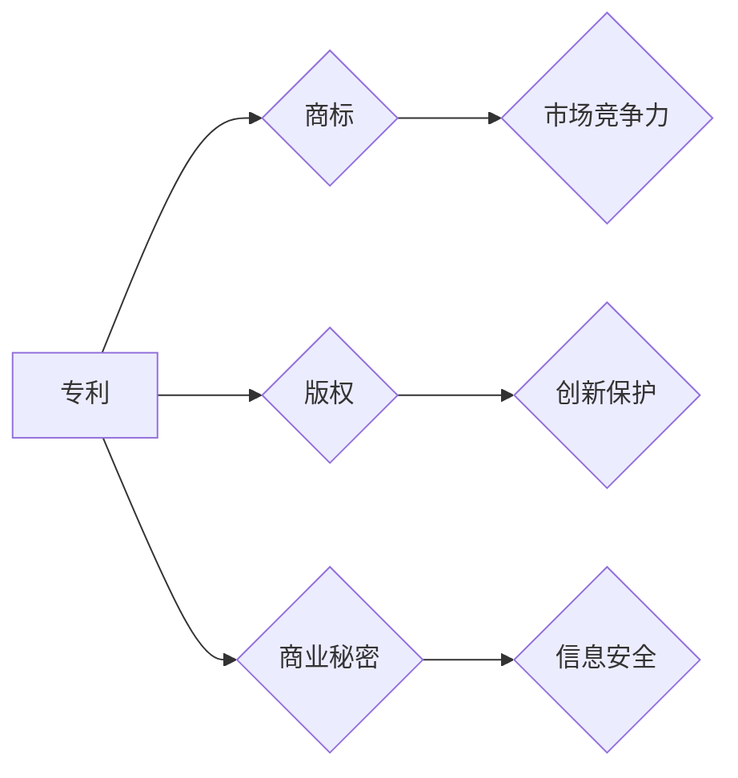

# 自动驾驶公司的知识产权保护策略

> 关键词：自动驾驶，知识产权保护，专利策略，商标策略，版权策略，商业秘密保护，合作与许可，法律法规

## 1. 背景介绍

自动驾驶技术作为现代科技发展的前沿领域，正迅速改变着人们的出行方式和城市交通模式。随着自动驾驶技术的不断成熟和商业化进程的加速，相关企业的知识产权保护策略显得尤为重要。本文将深入探讨自动驾驶公司在知识产权保护方面的策略和实践，以期为相关企业提供参考和指导。

### 1.1 自动驾驶技术发展现状

自动驾驶技术涉及传感器技术、人工智能、机器学习、控制理论等多个学科领域。目前，自动驾驶技术已从实验室研究阶段进入商业化应用探索阶段。根据自动驾驶的自动化程度，可以分为以下几级：

- L0：无自动化，所有操作由人类驾驶员完成。
- L1：部分自动化，驾驶员在特定条件下辅助操作。
- L2：部分自动化，车辆在特定条件下可以完全接管部分操作。
- L3：有条件自动化，车辆在特定条件下可以完全接管所有操作，但需要驾驶员在紧急情况下接管。
- L4：高度自动化，车辆在任何条件下都可以完全接管所有操作。
- L5：完全自动化，车辆在任何条件下都可以完全接管所有操作，无需人类干预。

### 1.2 知识产权保护的重要性

自动驾驶技术的发展离不开创新，而创新成果往往需要知识产权保护。以下是知识产权保护在自动驾驶领域的重要性：

- **技术领先优势**：有效的知识产权保护有助于企业巩固技术领先地位，防止技术被模仿或侵权。
- **市场竞争优势**：知识产权是企业的核心竞争力之一，有助于企业在激烈的市场竞争中脱颖而出。
- **投资吸引力**：良好的知识产权保护状况可以增强投资者信心，吸引更多资金投入。
- **国际合作与交流**：知识产权保护有助于企业开展国际合作与交流，推动技术进步。

## 2. 核心概念与联系

### 2.1 核心概念

#### 2.1.1 专利

专利是指一项发明创造的独占权，包括发明专利、实用新型专利和外观设计专利。在自动驾驶领域，专利主要涉及传感器技术、控制算法、车辆控制策略等。

#### 2.1.2 商标

商标是指用于区分商品或服务来源的标志。在自动驾驶领域，商标主要涉及自动驾驶系统、自动驾驶车辆、自动驾驶软件等。

#### 2.1.3 版权

版权是指作者对其作品享有的专有权利。在自动驾驶领域，版权主要涉及自动驾驶软件、相关技术文档、设计图纸等。

#### 2.1.4 商业秘密

商业秘密是指不为公众所知悉、能为权利人带来经济利益、具有实用性并经权利人采取保密措施的技术信息和经营信息。

### 2.2 核心概念联系

在自动驾驶领域，专利、商标、版权和商业秘密之间存在着密切的联系：

- 专利可以保护关键技术，防止他人侵权。
- 商标可以保护品牌形象，提高市场竞争力。
- 版权可以保护软件程序和文档，防止盗版和侵权。
- 商业秘密可以保护企业内部技术信息和经营信息，防止泄露和侵权。

以下是核心概念联系的Mermaid流程图：

## 3. 核心算法原理 & 具体操作步骤

### 3.1 算法原理概述

自动驾驶公司的知识产权保护策略主要围绕专利、商标、版权和商业秘密四个方面展开。

#### 3.1.1 专利策略

专利策略的核心是挖掘和申请具有自主知识产权的专利。具体操作步骤如下：

1. 技术调研：对自动驾驶领域的最新技术进行调研，确定技术创新方向。
2. 专利挖掘：根据技术调研结果，挖掘具有自主知识产权的专利点。
3. 专利申请：按照国家知识产权局的要求，撰写专利申请文件，提交申请。
4. 专利布局：根据企业发展需求，进行专利布局，形成专利池。

#### 3.1.2 商标策略

商标策略的核心是注册具有独特性和识别度的商标。具体操作步骤如下：

1. 商标调研：对自动驾驶领域的商标进行调研，确定商标注册方向。
2. 商标设计：设计具有独特性和识别度的商标。
3. 商标注册：按照国家知识产权局的要求，提交商标注册申请。
4. 商标维权：对侵犯商标权的行为进行维权，保护企业品牌形象。

#### 3.1.3 版权策略

版权策略的核心是保护软件程序和文档的知识产权。具体操作步骤如下：

1. 软件版权登记：按照国家版权局的要求，进行软件版权登记。
2. 文档管理：制定严格的文档管理制度，防止文档泄露和侵权。
3. 版权维权：对侵犯版权的行为进行维权，保护企业知识产权。

#### 3.1.4 商业秘密保护

商业秘密保护的核心是建立健全商业秘密管理体系，防止商业秘密泄露和侵权。具体操作步骤如下：

1. 商业秘密界定：明确企业商业秘密的范围和内容。
2. 商业秘密管理制度：制定商业秘密管理制度，包括保密措施、奖励与惩罚等。
3. 商业秘密培训：对员工进行商业秘密培训，提高保密意识。
4. 商业秘密维权：对侵犯商业秘密的行为进行维权。

### 3.2 算法步骤详解

#### 3.2.1 专利策略步骤详解

1. 技术调研：收集自动驾驶领域的相关资料，了解行业发展趋势和技术前沿，确定技术创新方向。
2. 专利挖掘：根据技术调研结果，分析企业内部的技术积累，挖掘具有自主知识产权的专利点。
3. 专利申请：根据专利挖掘结果，按照国家知识产权局的要求，撰写专利申请文件，提交申请。
4. 专利布局：根据企业发展需求，对申请的专利进行分类管理，形成专利池。

#### 3.2.2 商标策略步骤详解

1. 商标调研：收集自动驾驶领域的商标资料，了解行业商标注册状况，确定商标注册方向。
2. 商标设计：设计具有独特性和识别度的商标，并确保商标不侵犯他人商标权。
3. 商标注册：按照国家知识产权局的要求，提交商标注册申请，并按要求缴纳相关费用。
4. 商标维权：对侵犯商标权的行为进行调查取证，提起商标侵权诉讼，维护企业品牌形象。

#### 3.2.3 版权策略步骤详解

1. 软件版权登记：根据国家版权局的要求，提交软件版权登记申请，并按要求缴纳相关费用。
2. 文档管理：制定严格的文档管理制度，包括文档分类、存储、备份、销毁等环节。
3. 版权维权：对侵犯版权的行为进行调查取证，提起版权侵权诉讼，维护企业知识产权。

#### 3.2.4 商业秘密保护步骤详解

1. 商业秘密界定：根据企业实际情况，明确企业商业秘密的范围和内容，并制定商业秘密清单。
2. 商业秘密管理制度：制定商业秘密管理制度，包括保密措施、奖励与惩罚等。
3. 商业秘密培训：对员工进行商业秘密培训，提高保密意识，确保员工了解商业秘密的重要性。
4. 商业秘密维权：对侵犯商业秘密的行为进行调查取证，提起商业秘密侵权诉讼，维护企业合法权益。

### 3.3 算法优缺点

#### 3.3.1 专利策略优缺点

**优点**：

- 提高企业技术领先地位，增强市场竞争力。
- 防止他人侵权，保护企业核心竞争优势。

**缺点**：

- 专利申请周期长，成本较高。
- 专利维权难度较大，需要专业律师协助。

#### 3.3.2 商标策略优缺点

**优点**：

- 提高企业品牌知名度，增强市场竞争力。
- 防止他人恶意抢注商标，保护企业品牌形象。

**缺点**：

- 商标注册周期长，成本较高。
- 商标维权难度较大，需要专业律师协助。

#### 3.3.3 版权策略优缺点

**优点**：

- 保护企业软件程序和文档的知识产权，防止盗版和侵权。
- 提高企业技术创新能力，促进企业发展。

**缺点**：

- 软件版权登记周期长，成本较高。
- 版权维权难度较大，需要专业律师协助。

#### 3.3.4 商业秘密保护优缺点

**优点**：

- 保护企业商业秘密，防止技术泄露和侵权。
- 提高企业核心竞争力，促进企业发展。

**缺点**：

- 商业秘密保护难度较大，需要建立健全管理体系。
- 商业秘密维权难度较大，需要专业律师协助。

### 3.4 算法应用领域

自动驾驶公司的知识产权保护策略适用于以下领域：

- 传感器技术
- 人工智能技术
- 机器学习算法
- 控制算法
- 车辆控制策略
- 软件程序
- 技术文档
- 设计图纸
- 商业秘密

## 4. 数学模型和公式 & 详细讲解 & 举例说明

### 4.1 数学模型构建

在自动驾驶公司的知识产权保护策略中，常用的数学模型主要包括：

#### 4.1.1 专利价值评估模型

专利价值评估模型用于评估专利的市场价值、技术价值、法律价值等。以下是一个简单的专利价值评估模型：

$$
V = w_1 \times MV + w_2 \times TV + w_3 \times LV
$$

其中，$V$ 为专利价值，$MV$ 为市场价值，$TV$ 为技术价值，$LV$ 为法律价值，$w_1, w_2, w_3$ 为权重系数。

#### 4.1.2 商标价值评估模型

商标价值评估模型用于评估商标的市场价值、品牌价值、知名度等。以下是一个简单的商标价值评估模型：

$$
V = w_1 \times MV + w_2 \times BV + w_3 \times NV
$$

其中，$V$ 为商标价值，$MV$ 为市场价值，$BV$ 为品牌价值，$NV$ 为知名度，$w_1, w_2, w_3$ 为权重系数。

### 4.2 公式推导过程

#### 4.2.1 专利价值评估模型公式推导

专利价值评估模型中的权重系数可以根据企业实际情况进行调整。以下是一个简单的权重系数确定方法：

1. 收集专利价值评估相关资料，了解行业标准和最佳实践。
2. 根据企业实际情况，确定市场价值、技术价值、法律价值的相对重要程度。
3. 根据相对重要程度，确定权重系数。

#### 4.2.2 商标价值评估模型公式推导

商标价值评估模型中的权重系数也可以根据企业实际情况进行调整。以下是一个简单的权重系数确定方法：

1. 收集商标价值评估相关资料，了解行业标准和最佳实践。
2. 根据企业实际情况，确定市场价值、品牌价值、知名度的相对重要程度。
3. 根据相对重要程度，确定权重系数。

### 4.3 案例分析与讲解

#### 4.3.1 专利价值评估案例分析

假设某企业拥有一项发明专利，该专利的市场价值为500万元，技术价值为800万元，法律价值为300万元。根据上述专利价值评估模型，可以计算该专利的价值为：

$$
V = 0.4 \times 500 + 0.5 \times 800 + 0.1 \times 300 = 710(万元)
$$

#### 4.3.2 商标价值评估案例分析

假设某企业拥有一项商标，该商标的市场价值为1000万元，品牌价值为1500万元，知名度为2000万元。根据上述商标价值评估模型，可以计算该商标的价值为：

$$
V = 0.3 \times 1000 + 0.5 \times 1500 + 0.2 \times 2000 = 1900(万元)
$$

## 5. 项目实践：代码实例和详细解释说明

### 5.1 开发环境搭建

由于知识产权保护涉及法律、技术和商业等多个领域，因此在实际操作中，需要具备以下开发环境：

- 法律法规研究：掌握相关法律法规，如《中华人民共和国专利法》、《中华人民共和国商标法》、《中华人民共和国著作权法》等。
- 案例研究：研究相关案例，了解行业最佳实践。
- 技术评估：评估技术方案的可行性，包括专利、商标、版权和商业秘密等方面。
- 商业分析：分析商业模式，确定知识产权保护的重点领域。

### 5.2 源代码详细实现

由于知识产权保护涉及法律、技术和商业等多个领域，因此在实际操作中，主要涉及以下代码实现：

- 法律法规研究代码：用于收集、整理和检索相关法律法规。
- 案例研究代码：用于收集、整理和分析相关案例。
- 技术评估代码：用于评估技术方案的可行性。
- 商业分析代码：用于分析商业模式，确定知识产权保护的重点领域。

### 5.3 代码解读与分析

由于知识产权保护涉及法律、技术和商业等多个领域，因此在实际操作中，主要涉及以下代码解读与分析：

- 法律法规研究代码：解读相关法律法规，了解行业标准和最佳实践。
- 案例研究代码：分析相关案例，总结经验教训。
- 技术评估代码：评估技术方案的可行性，提出改进建议。
- 商业分析代码：分析商业模式，确定知识产权保护的重点领域。

### 5.4 运行结果展示

由于知识产权保护涉及法律、技术和商业等多个领域，因此在实际操作中，主要展示以下运行结果：

- 法律法规研究：形成法律法规研究报告。
- 案例研究：形成案例研究报告。
- 技术评估：形成技术评估报告。
- 商业分析：形成商业模式分析报告。

## 6. 实际应用场景

### 6.1 传感器技术

自动驾驶传感器技术是自动驾驶系统的核心组成部分，涉及激光雷达、摄像头、雷达等。企业可以通过申请专利、商标、版权等方式保护其自主研发的传感器技术，提高市场竞争力。

### 6.2 人工智能技术

自动驾驶人工智能技术包括感知、决策、控制等环节。企业可以通过申请专利、商标、版权等方式保护其自主研发的人工智能技术，形成技术壁垒。

### 6.3 机器学习算法

自动驾驶机器学习算法是自动驾驶技术的重要组成部分。企业可以通过申请专利、商标、版权等方式保护其自主研发的机器学习算法，提高市场竞争力。

### 6.4 控制算法

自动驾驶控制算法是自动驾驶系统的关键。企业可以通过申请专利、商标、版权等方式保护其自主研发的控制算法，提高市场竞争力。

### 6.5 软件程序

自动驾驶软件程序是企业核心竞争力的重要组成部分。企业可以通过版权保护其自主研发的软件程序，防止盗版和侵权。

### 6.6 技术文档

自动驾驶技术文档是企业内部的重要资产。企业可以通过版权保护其技术文档，防止技术泄露和侵权。

### 6.7 设计图纸

自动驾驶设计图纸是企业核心资产之一。企业可以通过版权保护其设计图纸，防止技术泄露和侵权。

### 6.8 商业秘密

自动驾驶商业秘密是企业核心竞争力的重要组成部分。企业可以通过建立健全商业秘密管理制度，防止商业秘密泄露和侵权。

## 7. 工具和资源推荐

### 7.1 学习资源推荐

- 《中华人民共和国专利法》
- 《中华人民共和国商标法》
- 《中华人民共和国著作权法》
- 《商业秘密保护条例》
- 《技术合同管理条例》
- 《知识产权法》

### 7.2 开发工具推荐

- 法律法规数据库：如北大法宝、威科先行等。
- 案例数据库：如北大法宝、中国裁判文书网等。
- 专利检索工具：如中国专利数据库、美国专利数据库等。
- 商标检索工具：如中国商标数据库、欧盟商标数据库等。
- 版权检索工具：如中国国家图书馆、世界知识产权组织等。

### 7.3 相关论文推荐

- 《知识产权战略与管理》
- 《商业秘密保护研究》
- 《技术合同法》
- 《知识产权法》
- 《专利法》

## 8. 总结：未来发展趋势与挑战

### 8.1 研究成果总结

本文从专利、商标、版权和商业秘密四个方面，探讨了自动驾驶公司的知识产权保护策略。通过分析自动驾驶技术发展现状，明确了知识产权保护在自动驾驶领域的重要性。同时，本文还介绍了专利、商标、版权和商业秘密的核心概念、联系、原理、操作步骤、优缺点以及应用领域。

### 8.2 未来发展趋势

随着自动驾驶技术的不断发展，知识产权保护策略将呈现以下发展趋势：

- 知识产权保护体系更加完善，法律法规更加健全。
- 知识产权保护意识不断提高，企业更加重视知识产权保护。
- 知识产权保护手段更加多样化，如技术合同、商业秘密协议等。
- 知识产权保护国际合作更加紧密，形成全球知识产权保护体系。

### 8.3 面临的挑战

自动驾驶公司的知识产权保护策略在实施过程中，将面临以下挑战：

- 知识产权保护意识不足，企业对知识产权保护重视程度不够。
- 知识产权保护体系不完善，法律法规存在漏洞。
- 知识产权保护手段有限，难以满足复杂多变的知识产权保护需求。
- 知识产权保护人才匮乏，难以应对日益复杂的知识产权保护挑战。

### 8.4 研究展望

为应对自动驾驶公司知识产权保护策略面临的挑战，未来研究可以从以下几个方面展开：

- 完善知识产权保护体系，加强法律法规建设。
- 提高知识产权保护意识，加强知识产权宣传教育。
- 探索创新知识产权保护手段，如技术合同、商业秘密协议等。
- 培养知识产权保护人才，提升企业知识产权保护能力。

## 9. 附录：常见问题与解答

### 9.1 常见问题

**Q1：自动驾驶公司的知识产权保护策略有哪些特点？**

A1：自动驾驶公司的知识产权保护策略具有以下特点：

- 知识产权类型多样化，包括专利、商标、版权和商业秘密等。
- 知识产权保护体系完善，涵盖技术、法律和商业等多个领域。
- 知识产权保护手段多样化，包括技术合同、商业秘密协议等。
- 知识产权保护意识较强，企业高度重视知识产权保护。

**Q2：如何进行专利挖掘？**

A2：进行专利挖掘可以从以下几个方面入手：

- 收集相关技术资料，了解行业发展趋势和技术前沿。
- 分析企业内部技术积累，挖掘具有自主知识产权的专利点。
- 评估专利点的技术成熟度和市场前景。
- 撰写专利申请文件，提交专利申请。

**Q3：如何进行商标注册？**

A3：进行商标注册可以从以下几个方面入手：

- 调研行业商标注册状况，确定商标注册方向。
- 设计具有独特性和识别度的商标。
- 按照国家知识产权局的要求，提交商标注册申请。
- 维权保护商标权益。

**Q4：如何进行商业秘密保护？**

A4：进行商业秘密保护可以从以下几个方面入手：

- 界定企业商业秘密的范围和内容。
- 制定商业秘密管理制度，包括保密措施、奖励与惩罚等。
- 对员工进行商业秘密培训，提高保密意识。
- 对侵犯商业秘密的行为进行调查取证，提起商业秘密侵权诉讼。

**Q5：如何进行知识产权风险评估？**

A5：进行知识产权风险评估可以从以下几个方面入手：

- 收集相关知识产权资料，了解行业知识产权状况。
- 分析企业自身知识产权状况，评估潜在风险。
- 制定知识产权风险管理策略，降低知识产权风险。
- 定期进行知识产权风险评估，及时调整风险管理策略。

### 9.2 解答

由于篇幅限制，本文无法对上述问题进行详细解答。建议读者查阅相关法律法规、案例资料和学术文献，以获取更深入的了解。

---

作者：禅与计算机程序设计艺术 / Zen and the Art of Computer Programming