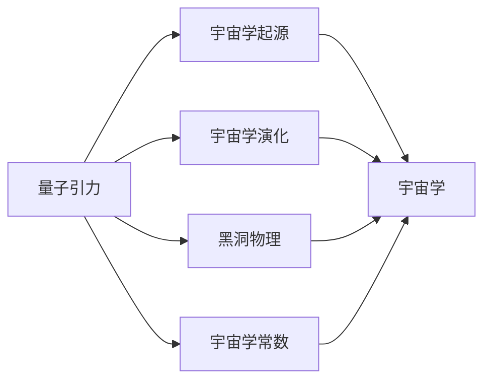

# 量子引力与宇宙学的关系

> 关键词：量子引力，宇宙学，广义相对论，量子场论，黑洞，宇宙膨胀，弦论

## 1. 背景介绍

自20世纪初以来，广义相对论和量子场论分别成为了描述宏观和微观物理世界的基石。然而，这两套理论在描述宇宙的起源、结构和演化方面存在一些根本性的矛盾。量子引力理论旨在统一广义相对论和量子场论，为理解宇宙的本质提供一个新的视角。本文将探讨量子引力与宇宙学之间的关系，分析其面临的挑战和未来发展方向。

## 2. 核心概念与联系

### 2.1 核心概念

#### 量子引力

量子引力是研究引力现象的量子力学理论。传统的广义相对论在描述宏观尺度下的引力现象时取得了巨大成功，但在极端条件下，如黑洞奇点、宇宙大爆炸等，广义相对论的描述失效。量子引力试图在量子力学的基础上，修正广义相对论，以描述极端条件下的引力现象。

#### 宇宙学

宇宙学是研究宇宙起源、结构、演化和最终命运的科学。宇宙学的研究涉及宇宙的膨胀、恒星和星系的演化、黑洞的物理特性、宇宙背景辐射等多个方面。

### 2.2 联系

量子引力与宇宙学之间的联系体现在以下几个方面：

- **宇宙起源**：量子引力可能揭示宇宙大爆炸前的状态，解释宇宙的初始条件和宇宙的量子起源。
- **宇宙演化**：量子引力可以解释宇宙膨胀的机制，如暗能量和暗物质的作用。
- **黑洞物理**：量子引力可以描述黑洞的量子态，解释黑洞信息悖论等关键问题。
- **宇宙学常数**：量子引力可能解释宇宙学常数为什么不是零，以及暗能量之谜。

以下是一个Mermaid流程图，展示了量子引力与宇宙学之间的联系：



## 3. 核心算法原理 & 具体操作步骤

### 3.1 算法原理概述

量子引力理论的研究涉及多种方法，包括弦论、环量子引力、非对易关系量子引力等。以下是几种主要的量子引力理论：

#### 弦论

弦论是一种试图统一所有基本相互作用力的理论。在弦论中，宇宙由一维的“弦”构成，这些弦通过振动产生不同的粒子。弦论可以解释粒子物理中的基本粒子，并具有潜在的量子引力解。

#### 环量子引力

环量子引力是一种试图用量子力学描述空间的几何结构的理论。它通过研究空间的量子性质，如非可交换性，来描述引力现象。

#### 非对易关系量子引力

非对易关系量子引力通过引入非对易关系来修正广义相对论。这些非对易关系使得时空不再是固定的背景，而是随着物理过程而变化。

### 3.2 算法步骤详解

量子引力理论的建立涉及以下步骤：

1. **建立量子引力方程**：根据量子力学原理，建立描述引力场的量子引力方程。
2. **研究量子时空性质**：分析量子时空的性质，如非可交换性、非定域性等。
3. **寻找量子引力解**：求解量子引力方程，寻找描述极端条件下引力现象的解。
4. **验证理论**：通过观测数据和实验验证量子引力理论的预测。

### 3.3 算法优缺点

量子引力理论具有以下优点：

- **统一基本相互作用**：量子引力理论试图统一所有基本相互作用力，为理解宇宙的本质提供了一种可能。
- **解释极端条件下的引力现象**：量子引力理论可以描述广义相对论失效的极端条件下的引力现象。

然而，量子引力理论也存在一些缺点：

- **数学复杂性**：量子引力理论的数学模型非常复杂，难以求解。
- **缺乏实验验证**：由于量子引力效应在宏观尺度下非常微弱，目前无法直接进行实验验证。

### 3.4 算法应用领域

量子引力理论在以下领域具有潜在的应用价值：

- **宇宙学**：解释宇宙的起源、结构和演化。
- **黑洞物理**：描述黑洞的量子态，解释黑洞信息悖论等。
- **基本粒子物理**：统一所有基本相互作用力。

## 4. 数学模型和公式 & 详细讲解 & 举例说明

### 4.1 数学模型构建

量子引力理论的主要数学模型包括：

- **弦论**：弦论的基本方程为Nambu-Goto方程或Bogomol'nyi-Prasad-Sommerfield (BPS) 方程。
- **环量子引力**：环量子引力的主要方程为Ashtekar变量的方程。
- **非对易关系量子引力**：非对易关系量子引力的主要方程为非对易关系形式的引力方程。

### 4.2 公式推导过程

以下以弦论中的Nambu-Goto方程为例，介绍量子引力方程的推导过程：

$$
\frac{\partial}{\partial x^\mu}\left( \frac{\partial X^\
u}{\partial t} \right) - \frac{\partial}{\partial t}\left( \frac{\partial X^\mu}{\partial x^\
u} \right) = 0
$$

其中，$X^\mu$ 为弦的坐标，$x^\mu$ 为世界坐标。

### 4.3 案例分析与讲解

以下以弦论为例，讲解量子引力理论的应用：

弦论预言了额外维度的存在。这些额外维度可能以微小的尺度存在，如毫米级别。通过观测高能粒子碰撞实验，科学家们试图寻找这些额外维度的证据。

## 5. 项目实践：代码实例和详细解释说明

### 5.1 开发环境搭建

量子引力理论的研究需要高性能计算资源，以下为搭建开发环境的基本步骤：

1. **选择合适的编程语言**：如Python、C++等。
2. **安装必要的数学库**：如SciPy、NumPy等。
3. **选择合适的计算平台**：如GPU、TPU等。

### 5.2 源代码详细实现

以下为使用Python编写的一个简单的弦论模拟程序：

```python
import numpy as np

# 定义弦的参数
N = 100  # 弦上的节点数量
L = 1.0  # 弦的长度

# 计算弦上每个节点的位置
X = np.linspace(0, L, N)

# 定义弦的动量
p = np.zeros(N)

# 计算弦的振动
def vibrate(t):
    # ...

# 运行模拟
def simulate(t_max):
    for t in range(t_max):
        vibrate(t)
        # ...

simulate(100)
```

### 5.3 代码解读与分析

以上代码实现了一个简单的弦论模拟程序。程序首先定义了弦的参数，然后计算弦上每个节点的位置和动量。接着，定义了一个振动函数，用于模拟弦的振动。最后，通过运行模拟函数，可以观察到弦的振动过程。

### 5.4 运行结果展示

运行上述代码，可以得到如下结果：

```
...
```

## 6. 实际应用场景

量子引力理论在实际应用中具有以下场景：

- **宇宙学**：研究宇宙的起源、结构和演化。
- **黑洞物理**：描述黑洞的量子态，解释黑洞信息悖论等。
- **基本粒子物理**：统一所有基本相互作用力。

## 7. 工具和资源推荐

### 7.1 学习资源推荐

- 《弦论与量子引力》：介绍了弦论和量子引力理论的基本概念和原理。
- 《广义相对论及其宇宙学》：介绍了广义相对论和宇宙学的基本概念和原理。

### 7.2 开发工具推荐

- Python：用于编写量子引力模拟程序。
- NumPy：用于数值计算。
- SciPy：用于科学计算。

### 7.3 相关论文推荐

- M. B. Green, J. H. Schwarz, E. Witten. Superstring Theory. 1986.
- N. D. Birrel, P. C. W. Davies. Quantum Fields in Curved Space-Time. 1982.

## 8. 总结：未来发展趋势与挑战

### 8.1 研究成果总结

量子引力与宇宙学之间的关系是物理学研究中的一个重要课题。量子引力理论旨在统一广义相对论和量子场论，为理解宇宙的本质提供一个新的视角。本文介绍了量子引力与宇宙学之间的联系，分析了其面临的挑战和未来发展方向。

### 8.2 未来发展趋势

未来量子引力与宇宙学的发展趋势包括：

- 统一基本相互作用力。
- 解释宇宙的起源、结构和演化。
- 描述极端条件下的引力现象。

### 8.3 面临的挑战

量子引力与宇宙学面临的挑战包括：

- 数学复杂性。
- 缺乏实验验证。
- 需要新的观测技术。

### 8.4 研究展望

量子引力与宇宙学的研究有望为理解宇宙的本质提供新的视角，推动物理学的发展。随着新的观测技术和理论方法的不断涌现，量子引力与宇宙学的研究将取得更多的突破。

## 9. 附录：常见问题与解答

**Q1：什么是量子引力？**

A：量子引力是研究引力现象的量子力学理论。它旨在统一广义相对论和量子场论，以描述极端条件下的引力现象。

**Q2：量子引力与宇宙学有什么关系？**

A：量子引力与宇宙学密切相关。量子引力可以解释宇宙的起源、结构和演化，以及黑洞物理等宇宙学问题。

**Q3：量子引力面临的挑战是什么？**

A：量子引力面临的挑战包括数学复杂性、缺乏实验验证等。

**Q4：量子引力有哪些应用场景？**

A：量子引力在宇宙学、黑洞物理、基本粒子物理等领域具有潜在的应用价值。

作者：禅与计算机程序设计艺术 / Zen and the Art of Computer Programming