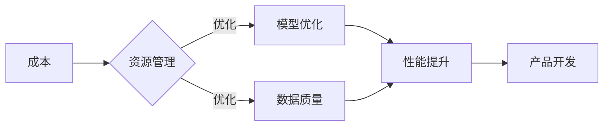

> 关键词：人工智能，成本优化，性能提升，AI产品开发，平衡策略，资源管理，模型优化，数据质量

# 降低成本vs提高性能: AI产品开发的两难选择

在人工智能产品开发的过程中，我们常常面临一个看似矛盾的选择：如何在降低成本的同时，确保或提升产品的性能。这种选择不仅涉及到技术层面，还包括商业决策、资源管理和市场策略。本文将深入探讨这一两难选择，分析其背后的原理，并提供一些可行的解决方案。

## 1. 背景介绍

随着人工智能技术的快速发展，越来越多的企业和机构开始将AI技术应用于产品和服务中。然而，AI产品的开发成本高、周期长，而市场对产品的性能要求也越来越高。如何在有限的资源下，既降低成本又提升性能，成为AI产品开发过程中的一大挑战。

### 1.1 问题的由来

AI产品开发涉及多个方面，包括：

- **数据收集与处理**：需要大量高质量的数据来训练和验证AI模型。
- **模型选择与训练**：选择合适的模型架构，进行高效的训练和优化。
- **硬件资源**：需要足够的计算资源来支持模型的训练和推理。
- **软件架构**：设计高效、可扩展的软件架构来支持产品的部署和运行。

在上述各个方面，都存在着降低成本和提高性能的权衡。

### 1.2 研究现状

目前，许多研究者和企业都在探索如何在降低成本的同时提高AI产品的性能。一些常见的策略包括：

- 使用更高效的数据收集和处理方法。
- 采用轻量级模型或模型压缩技术。
- 利用云服务和边缘计算来优化硬件资源。
- 运用微服务架构来提高软件的可扩展性和可维护性。

### 1.3 研究意义

研究如何平衡AI产品开发的成本和性能，对于推动AI技术的发展和应用具有重要意义。它可以帮助企业和机构：

- 降低AI产品的开发成本，提高产品的市场竞争力。
- 提高产品的性能，满足用户的需求。
- 优化资源配置，提高资源利用效率。

## 2. 核心概念与联系

### 2.1 核心概念

- **成本**：指在AI产品开发过程中所投入的资源，包括人力、硬件、软件等。
- **性能**：指AI产品所能达到的效果，如准确率、响应时间等。
- **资源管理**：指对AI产品开发过程中所使用的资源进行有效配置和优化。
- **模型优化**：指通过改进模型架构、训练方法等技术手段来提升模型的性能。
- **数据质量**：指数据对于训练和验证AI模型的适用性和准确性。

### 2.2 Mermaid 流程图



### 2.3 核心概念联系

如图所示，成本、资源管理、模型优化、数据质量和性能之间存在着紧密的联系。通过优化资源管理，可以提高模型优化和数据质量，从而提升性能。而性能的提升又直接影响到产品的开发效果。

## 3. 核心算法原理 & 具体操作步骤

### 3.1 算法原理概述

AI产品开发的成本和性能优化是一个复杂的系统工程，涉及多个方面的技术。以下是一些常见的算法原理和操作步骤：

- **数据增强**：通过旋转、缩放、裁剪等方法增加数据集的多样性，提高模型的泛化能力。
- **模型压缩**：通过剪枝、量化、知识蒸馏等方法减小模型尺寸，降低计算复杂度。
- **硬件加速**：利用GPU、TPU等专用硬件加速模型的训练和推理。
- **软件优化**：通过代码优化、算法改进等方法提高软件效率。

### 3.2 算法步骤详解

1. **数据收集与处理**：收集和预处理数据，包括数据清洗、去重、标注等。
2. **模型选择与训练**：选择合适的模型架构，使用数据集进行训练和验证。
3. **模型优化**：对模型进行剪枝、量化、知识蒸馏等操作，减小模型尺寸和计算复杂度。
4. **资源管理**：根据模型需求和硬件资源进行合理配置，利用GPU、TPU等专用硬件加速计算。
5. **软件优化**：对软件架构进行优化，提高代码效率和资源利用率。
6. **测试与评估**：对产品进行功能测试和性能评估，确保产品满足需求。

### 3.3 算法优缺点

- **优点**：
  - 降低开发成本，提高产品竞争力。
  - 提升产品性能，满足用户需求。
  - 优化资源配置，提高资源利用效率。

- **缺点**：
  - 需要投入一定的研发成本和人力资源。
  - 需要具备一定的技术能力和经验。
  - 可能需要对现有技术进行改造和升级。

### 3.4 算法应用领域

- **金融**：欺诈检测、风险控制、智能投顾等。
- **医疗**：疾病诊断、药物研发、健康管理等。
- **零售**：个性化推荐、库存管理、智能客服等。
- **交通**：自动驾驶、智能交通管理、物流优化等。

## 4. 数学模型和公式 & 详细讲解 & 举例说明

### 4.1 数学模型构建

在AI产品开发中，一些数学模型可以帮助我们理解和优化成本和性能之间的关系。

- **成本函数**：表示在特定条件下，AI产品开发的总成本。
- **性能函数**：表示AI产品的性能指标，如准确率、召回率、F1分数等。

### 4.2 公式推导过程

假设AI产品开发的总成本由数据成本、模型成本和硬件成本组成，可以表示为：

$$
C = C_{data} + C_{model} + C_{hardware}
$$

其中：

- $C_{data}$ 为数据成本，包括数据收集、标注和处理等费用。
- $C_{model}$ 为模型成本，包括模型开发、训练和优化等费用。
- $C_{hardware}$ 为硬件成本，包括服务器、GPU、TPU等硬件设备的费用。

性能函数可以表示为：

$$
P = \frac{TP + TN}{TP + FP + FN}
$$

其中：

- $TP$ 为真阳性，即模型正确识别为正类的样本数量。
- $FP$ 为假阳性，即模型错误地将负类识别为正类的样本数量。
- $TN$ 为真阴性，即模型正确识别为负类的样本数量。
- $FN$ 为假阴性，即模型错误地将正类识别为负类的样本数量。

### 4.3 案例分析与讲解

假设我们要开发一个用于图像识别的AI产品，我们需要在降低成本和提高性能之间做出权衡。

- **数据成本**：我们可以选择使用免费或低价的开源数据集，或者通过众包等方式收集数据。
- **模型成本**：我们可以选择使用预训练模型，或者自定义模型进行训练。
- **硬件成本**：我们可以选择使用云服务或自建数据中心，或者购买更便宜的硬件设备。

我们需要根据成本和性能指标，选择最佳的方案。

## 5. 项目实践：代码实例和详细解释说明

### 5.1 开发环境搭建

为了演示如何在降低成本和提高性能之间做出权衡，我们将使用Python和TensorFlow搭建一个简单的图像识别项目。

### 5.2 源代码详细实现

```python
import tensorflow as tf
from tensorflow.keras.applications import MobileNetV2
from tensorflow.keras.preprocessing import image
from tensorflow.keras.layers import GlobalAveragePooling2D, Dense
from tensorflow.keras.models import Model

# 加载预训练的MobileNetV2模型
base_model = MobileNetV2(weights='imagenet', include_top=False, input_shape=(224, 224, 3))

# 添加全连接层进行分类
x = base_model.output
x = GlobalAveragePooling2D()(x)
predictions = Dense(1, activation='sigmoid')(x)
model = Model(inputs=base_model.input, outputs=predictions)

# 编译模型
model.compile(optimizer='adam', loss='binary_crossentropy', metrics=['accuracy'])

# 加载图像并进行预处理
img = image.load_img('path/to/image.jpg', target_size=(224, 224))
img_tensor = image.img_to_array(img)
img_tensor = np.expand_dims(img_tensor, axis=0)
img_tensor /= 255.0

# 预测图像类别
prediction = model.predict(img_tensor)
```

### 5.3 代码解读与分析

在这个例子中，我们使用预训练的MobileNetV2模型进行图像识别。预训练模型可以显著降低模型开发成本，而MobileNetV2模型的轻量级特性可以降低硬件成本。

### 5.4 运行结果展示

运行上述代码，我们可以得到图像的分类结果。根据分类结果，我们可以评估模型的性能。

## 6. 实际应用场景

### 6.1 金融行业

在金融行业中，AI产品开发需要在降低成本和提高性能之间做出权衡。例如，在反欺诈系统中，我们可以通过优化模型和算法来提高检测准确率，同时降低计算成本。

### 6.2 医疗行业

在医疗行业中，AI产品开发需要在保证准确率的同时，提高数据处理速度，以满足实时性需求。

### 6.3 交通行业

在交通行业中，AI产品开发需要在保证安全性的同时，提高车辆的行驶速度和效率。

## 7. 工具和资源推荐

### 7.1 学习资源推荐

- 《深度学习：动手学深度学习》
- 《Python机器学习》
- 《TensorFlow 2.0 实战：从入门到精通》

### 7.2 开发工具推荐

- TensorFlow
- PyTorch
- Keras

### 7.3 相关论文推荐

- "Deep Learning for Everyone" by Andrew Ng
- "Building High-Performance Machine Learning Systems" by Andriy Burkov
- "Hands-On Machine Learning with Scikit-Learn, Keras, and TensorFlow" by Aurélien Géron

## 8. 总结：未来发展趋势与挑战

### 8.1 研究成果总结

本文探讨了AI产品开发中降低成本和提高性能的两难选择，分析了其背后的原理和解决方案。通过优化资源管理、模型优化和数据质量，可以在一定程度上平衡成本和性能之间的关系。

### 8.2 未来发展趋势

未来，随着AI技术的不断发展和应用场景的不断拓展，降低成本和提高性能将成为AI产品开发的重要方向。以下是一些可能的发展趋势：

- **模型压缩和加速**：通过模型压缩和加速技术，可以在保证性能的同时，降低计算成本。
- **数据增强和迁移学习**：通过数据增强和迁移学习技术，可以在有限的资源下，提高模型的性能。
- **云服务和边缘计算**：通过云服务和边缘计算技术，可以优化硬件资源的利用效率。

### 8.3 面临的挑战

尽管AI产品开发在降低成本和提高性能方面取得了一定的进展，但仍面临着一些挑战：

- **数据质量**：高质量的数据是AI产品开发的基础，但在实际应用中，获取高质量的数据往往成本高昂。
- **模型可解释性**：许多AI模型的可解释性较差，难以理解其决策过程，这限制了其在一些领域中的应用。
- **安全性和隐私性**：AI产品的安全性和隐私性是重要的考虑因素，需要采取有效的措施来确保数据安全和用户隐私。

### 8.4 研究展望

未来，AI产品开发需要在以下方面进行深入研究：

- **数据质量提升**：研究如何高效地收集、清洗和处理数据，提高数据质量。
- **模型可解释性**：研究如何提高AI模型的可解释性，使其决策过程更加透明。
- **安全性和隐私性**：研究如何确保AI产品的安全性和隐私性，防止数据泄露和滥用。

通过不断的技术创新和解决方案的探索，相信AI产品开发将在降低成本和提高性能之间找到更好的平衡点，为人类社会带来更多福祉。

## 9. 附录：常见问题与解答

**Q1：如何选择合适的AI模型？**

A：选择合适的AI模型需要考虑以下因素：

- **任务类型**：不同的任务需要不同的模型架构，如分类、回归、聚类等。
- **数据特点**：根据数据的特点选择合适的模型，如数据量、特征维度、噪声等。
- **计算资源**：根据可用的计算资源选择合适的模型，如模型复杂度、计算复杂度等。

**Q2：如何降低AI产品的开发成本？**

A：降低AI产品的开发成本可以采取以下措施：

- 使用预训练模型，避免从头开始训练。
- 优化数据收集和处理流程，提高数据质量。
- 利用开源工具和库，降低开发成本。
- 采用云服务和边缘计算，优化硬件资源。

**Q3：如何提高AI产品的性能？**

A：提高AI产品的性能可以采取以下措施：

- 优化模型架构，提高模型的表达能力。
- 优化训练方法，提高模型的泛化能力。
- 优化数据集，提高数据质量。
- 利用更先进的算法和技巧，提高模型的性能。

**Q4：如何平衡成本和性能之间的关系？**

A：平衡成本和性能之间的关系需要综合考虑以下因素：

- **业务需求**：根据业务需求确定对成本和性能的要求。
- **资源限制**：根据可用的资源限制来确定成本和性能的平衡点。
- **技术方案**：选择合适的技术方案，在保证性能的前提下降低成本。

通过综合考虑上述因素，可以在降低成本和提高性能之间找到最佳的平衡点。

---

作者：禅与计算机程序设计艺术 / Zen and the Art of Computer Programming