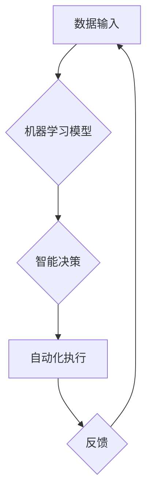

## 软件 2.0 的未来展望：更智能、更强大

> 关键词：人工智能、软件架构、机器学习、深度学习、自动化、可解释性、软件工程

### 1. 背景介绍

软件已经深刻地改变了我们的生活，从智能手机到云计算，再到自动驾驶汽车，软件无处不在。然而，传统的软件开发模式面临着越来越多的挑战。随着数据量的爆炸式增长和计算能力的提升，我们迫切需要一种新的软件开发 paradigm，一种能够更好地适应复杂环境、自动学习和自我优化的软件。这就是软件 2.0 的时代。

软件 2.0 并非简单的软件升级，而是一种根本性的变革。它将人工智能 (AI) 作为核心驱动力，赋予软件更强的智能、更强大的功能和更灵活的适应能力。

### 2. 核心概念与联系

软件 2.0 的核心概念包括：

* **智能化:** 软件能够通过机器学习和深度学习等技术，从数据中学习，识别模式，并做出智能决策。
* **自动化:** 软件能够自动完成许多重复性任务，例如代码生成、测试和部署。
* **可解释性:** 软件的决策过程能够被人类理解和解释，提高软件的透明度和可信度。
* **自适应性:** 软件能够根据环境变化自动调整其行为，提高其适应性和可靠性。

**Mermaid 流程图:**



### 3. 核心算法原理 & 具体操作步骤

#### 3.1  算法原理概述

软件 2.0 的核心算法主要包括机器学习和深度学习。

* **机器学习:**  是一种人工智能技术，通过算法训练模型，使模型能够从数据中学习，并做出预测或决策。
* **深度学习:**  是一种更高级的机器学习技术，使用多层神经网络来模拟人类大脑的学习过程，能够处理更复杂的数据和任务。

#### 3.2  算法步骤详解

**机器学习算法步骤:**

1. **数据收集和预处理:** 收集相关数据，并进行清洗、转换和特征工程等预处理操作。
2. **模型选择:** 根据任务需求选择合适的机器学习算法，例如线性回归、逻辑回归、决策树、支持向量机等。
3. **模型训练:** 使用训练数据训练模型，调整模型参数，使模型能够准确地预测或分类。
4. **模型评估:** 使用测试数据评估模型的性能，例如准确率、召回率、F1-score等。
5. **模型部署:** 将训练好的模型部署到实际应用场景中，用于预测或决策。

**深度学习算法步骤:**

1. **数据收集和预处理:** 与机器学习类似，需要收集和预处理数据。
2. **网络结构设计:** 设计多层神经网络的结构，包括神经元数量、连接方式、激活函数等。
3. **模型训练:** 使用训练数据训练深度学习模型，调整模型参数，使模型能够学习数据中的复杂模式。
4. **模型评估:** 使用测试数据评估模型的性能，例如准确率、损失函数等。
5. **模型调优:** 根据评估结果，调整模型参数、网络结构等，进一步提高模型性能。
6. **模型部署:** 将训练好的深度学习模型部署到实际应用场景中。

#### 3.3  算法优缺点

**机器学习算法:**

* **优点:** 能够从数据中学习，适应不断变化的环境，无需明确编程规则。
* **缺点:** 需要大量的数据进行训练，模型解释性较差，容易受到数据噪声的影响。

**深度学习算法:**

* **优点:** 能够处理更复杂的数据和任务，学习能力更强，性能更优异。
* **缺点:** 需要更大的计算资源和数据量进行训练，模型训练时间更长，模型解释性更差。

#### 3.4  算法应用领域

机器学习和深度学习算法在各个领域都有广泛的应用，例如：

* **图像识别:** 人脸识别、物体检测、图像分类等。
* **自然语言处理:** 语音识别、机器翻译、文本摘要等。
* **推荐系统:** 商品推荐、内容推荐、用户画像等。
* **医疗诊断:** 疾病预测、影像分析、药物研发等。
* **金融风险控制:** 欺诈检测、信用评分、投资决策等。

### 4. 数学模型和公式 & 详细讲解 & 举例说明

#### 4.1  数学模型构建

机器学习和深度学习算法都基于数学模型。

* **线性回归模型:** 用于预测连续值，假设目标变量与输入变量之间存在线性关系。

$$
y = w_0 + w_1x_1 + w_2x_2 +... + w_nx_n + \epsilon
$$

其中：

* $y$ 是目标变量
* $x_1, x_2,..., x_n$ 是输入变量
* $w_0, w_1, w_2,..., w_n$ 是模型参数
* $\epsilon$ 是误差项

* **神经网络模型:**  由多个层的神经元组成，每个神经元接收输入信号，进行计算，并输出信号。

#### 4.2  公式推导过程

深度学习模型的训练过程基于梯度下降算法，通过不断调整模型参数，使模型预测结果与真实值之间的误差最小化。

梯度下降算法的核心公式为：

$$
w = w - \alpha \frac{\partial Loss}{\partial w}
$$

其中：

* $w$ 是模型参数
* $\alpha$ 是学习率
* $Loss$ 是损失函数，用于衡量模型预测结果与真实值之间的误差
* $\frac{\partial Loss}{\partial w}$ 是损失函数对模型参数的梯度

#### 4.3  案例分析与讲解

例如，在图像分类任务中，可以使用卷积神经网络 (CNN) 模型进行训练。CNN 模型能够学习图像中的特征，并将其用于分类。

训练 CNN 模型的过程包括：

1. 使用大量图像数据训练模型，学习图像特征。
2. 使用测试数据评估模型的性能，例如准确率。
3. 根据评估结果，调整模型参数，提高模型性能。

### 5. 项目实践：代码实例和详细解释说明

#### 5.1  开发环境搭建

* Python 3.x
* TensorFlow 或 PyTorch 深度学习框架
* Jupyter Notebook 或 VS Code 开发环境

#### 5.2  源代码详细实现

```python
import tensorflow as tf

# 定义模型结构
model = tf.keras.models.Sequential([
    tf.keras.layers.Conv2D(32, (3, 3), activation='relu', input_shape=(28, 28, 1)),
    tf.keras.layers.MaxPooling2D((2, 2)),
    tf.keras.layers.Conv2D(64, (3, 3), activation='relu'),
    tf.keras.layers.MaxPooling2D((2, 2)),
    tf.keras.layers.Flatten(),
    tf.keras.layers.Dense(10, activation='softmax')
])

# 编译模型
model.compile(optimizer='adam',
              loss='sparse_categorical_crossentropy',
              metrics=['accuracy'])

# 训练模型
model.fit(x_train, y_train, epochs=5)

# 评估模型
loss, accuracy = model.evaluate(x_test, y_test)
print('Test loss:', loss)
print('Test accuracy:', accuracy)
```

#### 5.3  代码解读与分析

这段代码定义了一个简单的卷积神经网络模型，用于手写数字识别任务。

* `tf.keras.models.Sequential` 创建了一个顺序模型，将层级依次连接。
* `tf.keras.layers.Conv2D` 定义了一个卷积层，用于学习图像特征。
* `tf.keras.layers.MaxPooling2D` 定义了一个最大池化层，用于降维和提取更抽象的特征。
* `tf.keras.layers.Flatten` 将多维特征转换为一维向量。
* `tf.keras.layers.Dense` 定义了一个全连接层，用于分类。
* `model.compile` 编译模型，指定优化器、损失函数和评价指标。
* `model.fit` 训练模型，使用训练数据进行训练。
* `model.evaluate` 评估模型，使用测试数据评估模型性能。

#### 5.4  运行结果展示

训练完成后，模型能够准确地识别手写数字。

### 6. 实际应用场景

软件 2.0 的应用场景非常广泛，例如：

* **智能客服:** 使用自然语言处理技术，自动回答用户问题，提供个性化服务。
* **自动驾驶:** 使用计算机视觉和机器学习技术，实现车辆自动驾驶。
* **个性化推荐:** 使用机器学习技术，根据用户行为和偏好，推荐个性化商品、内容和服务。
* **医疗辅助诊断:** 使用机器学习技术，辅助医生进行疾病诊断和治疗方案制定。
* **金融风险管理:** 使用机器学习技术，识别欺诈行为，评估风险，进行智能投资决策。

#### 6.4  未来应用展望

随着人工智能技术的不断发展，软件 2.0 的应用场景将更加广泛，例如：

* **智能家居:** 使用人工智能技术，实现家居自动化，提供更加舒适的生活体验。
* **工业自动化:** 使用人工智能技术，提高工业生产效率，降低生产成本。
* **教育个性化:** 使用人工智能技术，提供个性化的学习方案，提高学习效率。
* **科学研究:** 使用人工智能技术，加速科学研究，发现新的知识。

### 7. 工具和资源推荐

#### 7.1  学习资源推荐

* **在线课程:** Coursera, edX, Udacity 等平台提供丰富的机器学习和深度学习课程。
* **书籍:** 《深度学习》、《机器学习实战》等书籍是学习人工智能的经典教材。
* **博客和论坛:** TensorFlow, PyTorch 等框架的官方博客和论坛提供大量学习资源和技术支持。

#### 7.2  开发工具推荐

* **TensorFlow:** Google 开发的开源深度学习框架。
* **PyTorch:** Facebook 开发的开源深度学习框架。
* **Keras:** TensorFlow 上的深度学习 API，易于使用。

#### 7.3  相关论文推荐

* **《ImageNet Classification with Deep Convolutional Neural Networks》:** AlexNet 模型的论文，标志着深度学习在图像识别领域的突破。
* **《Attention Is All You Need》:** Transformer 模型的论文，在自然语言处理领域取得了重大进展。
* **《Generative Adversarial Networks》:** 生成对抗网络的论文，在图像生成和数据合成领域具有重要应用。

### 8. 总结：未来发展趋势与挑战

#### 8.1  研究成果总结

软件 2.0 的研究取得了显著成果，人工智能技术在各个领域得到了广泛应用。

#### 8.2  未来发展趋势

* **更强大的模型:** 研究更强大的深度学习模型，例如 Transformer、GPT 等，提高模型的学习能力和泛化能力。
* **更强的解释性:** 研究更可解释的机器学习模型，提高模型的透明度和可信度。
* **更广泛的应用:** 将人工智能技术应用到更多领域，例如医疗、教育、金融等，解决更多现实问题。

#### 8.3  面临的挑战

* **数据安全和隐私:** 人工智能模型的训练需要大量数据，如何保证数据安全和隐私是一个重要挑战。
* **算法偏见:** 人工智能模型可能存在算法偏见，导致不公平的结果，需要研究如何解决算法偏见问题。
* **伦理问题:** 人工智能技术的快速发展引发了伦理问题，例如人工智能的责任和义务，需要进行深入探讨和规范。

#### 8.4  研究展望

未来，软件 2.0 的研究将更加注重模型的可解释性、安全性、可靠性和伦理性，并将其应用到更多领域，为人类社会带来更多福祉。

### 9. 附录：常见问题与解答