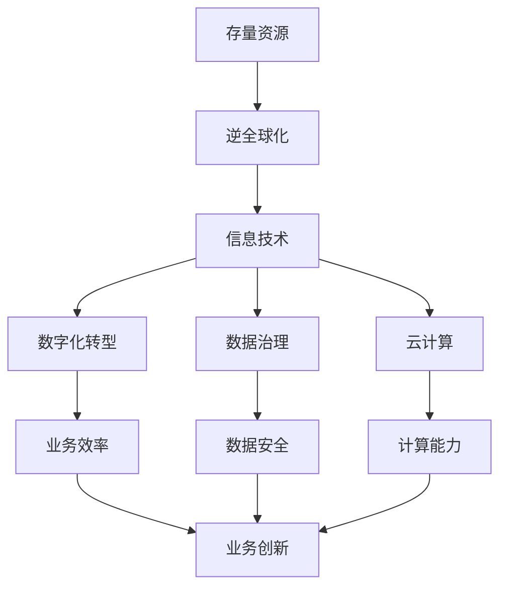
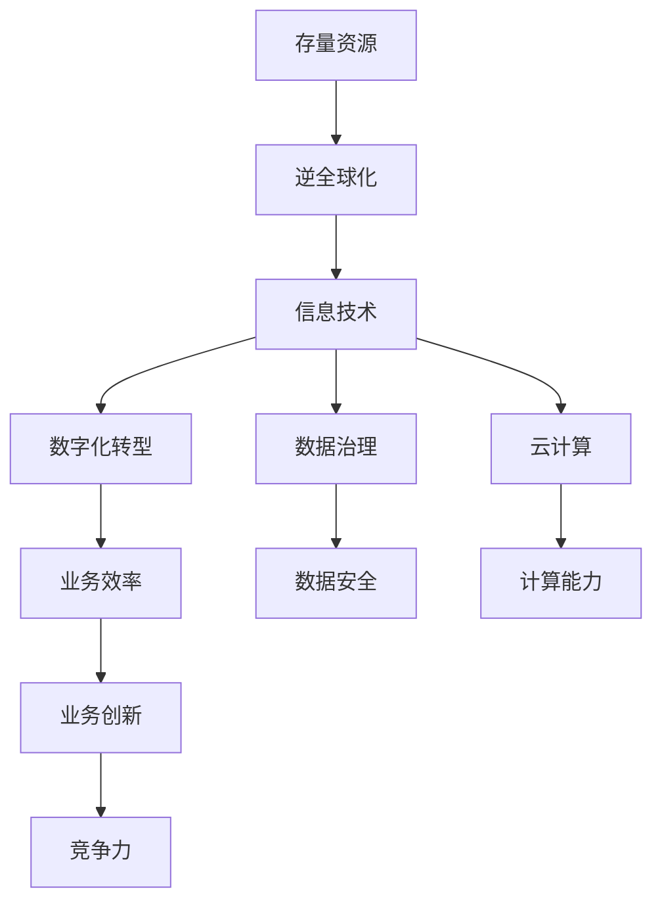
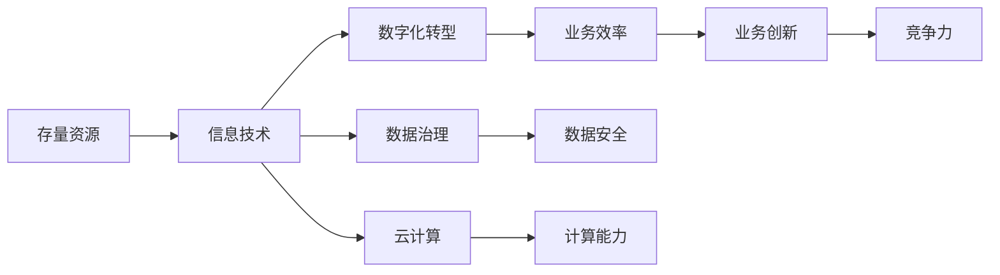
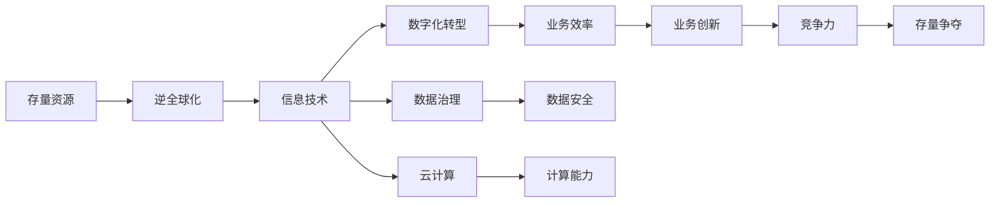

                 

# 存量争夺与逆全球化抬头

## 1. 背景介绍

### 1.1 问题由来

在全球经济一体化的大背景下，各国之间在存量资源上的争夺愈发激烈。近年来，逆全球化思潮抬头，尤其是在新冠肺炎疫情全球蔓延的情况下，一些国家采取了排外和保护主义政策，进一步加剧了存量资源的争夺。在此背景下，如何利用信息技术手段提升自身的竞争优势，从而在存量争夺中占据有利地位，成为各国政府和企业面临的重要课题。

### 1.2 问题核心关键点

存量资源争夺的核心在于如何在有限的资源下，实现最优配置。传统上，国家之间在存量资源上的争夺主要通过政治、军事、经济等手段实现，但在数字时代，信息技术手段逐渐成为重要的竞争工具。在存量争夺中，各国政府和企业需要利用信息技术提升自身竞争力，抢占存量资源。

## 2. 核心概念与联系

### 2.1 核心概念概述

为更好地理解存量争夺与逆全球化抬头这一问题，本节将介绍几个密切相关的核心概念：

- 存量资源：指能够为社会带来效益的物质或非物质资源，如自然资源、资本、技术、人才等。
- 逆全球化：指一些国家或地区放弃全球化路线，采取保护主义政策，减少对外开放，以保护本国利益。
- 信息技术：指利用计算机、通信技术进行信息处理和传递的技术，包括软件开发、云计算、人工智能等。
- 数字化转型：指企业利用信息技术手段提升业务效率和竞争力，实现数字化、智能化升级的过程。
- 数据治理：指对企业内部数据的收集、存储、管理和应用进行规范和优化的过程。
- 云计算：指通过互联网提供计算资源和服务的模式，包括基础设施即服务（IaaS）、平台即服务（PaaS）和软件即服务（SaaS）等。

这些核心概念之间的逻辑关系可以通过以下Mermaid流程图来展示：



这个流程图展示了一些核心概念之间的相互关系：

1. 存量资源的争夺与逆全球化的关系。逆全球化政策旨在保护本国利益，争夺更多的存量资源。
2. 信息技术手段在存量争夺中的应用。通过信息技术，政府和企业能够提升自身竞争力，抢占更多的存量资源。
3. 数字化转型和数据治理在提升信息技术能力中的作用。数字化转型和数据治理是信息技术提升的基础。
4. 云计算在提供计算能力和业务效率方面的重要性。云计算是实现数字化转型的重要手段之一。

### 2.2 概念间的关系

这些核心概念之间存在着紧密的联系，形成了存量争夺与逆全球化的完整生态系统。下面我通过几个Mermaid流程图来展示这些概念之间的关系。

#### 2.2.1 存量争夺的总体架构



这个流程图展示了存量争夺的整体架构：

1. 存量资源是争夺的焦点。
2. 逆全球化政策影响存量资源的分配。
3. 信息技术手段是争夺存量资源的重要工具。
4. 数字化转型和数据治理是提升信息技术能力的基础。
5. 云计算提供了强大的计算能力。
6. 业务效率提升和业务创新直接影响到竞争力。

#### 2.2.2 信息技术在存量争夺中的作用



这个流程图展示了信息技术在存量争夺中的具体作用：

1. 信息技术是争夺存量资源的重要手段。
2. 数字化转型提升了业务效率，从而增强竞争力。
3. 数据治理保证了数据的安全性和可用性。
4. 云计算提供了计算能力，支持业务创新。
5. 业务创新直接影响到竞争力，从而争夺到更多的存量资源。

#### 2.2.3 逆全球化对存量争夺的影响



这个流程图展示了逆全球化对存量争夺的影响：

1. 逆全球化政策影响存量资源的分配。
2. 信息技术手段是争夺存量资源的重要工具。
3. 数字化转型提升了业务效率，从而增强竞争力。
4. 数据治理保证了数据的安全性和可用性。
5. 云计算提供了计算能力，支持业务创新。
6. 业务创新直接影响到竞争力，从而在逆全球化的背景下争夺到更多的存量资源。

## 3. 核心算法原理 & 具体操作步骤
### 3.1 算法原理概述

存量争夺与逆全球化抬头的核心算法原理，本质上是一个基于信息技术手段的竞争策略优化问题。其核心思想是利用信息技术提升自身竞争力，从而在有限的存量资源中占据有利地位。

形式化地，假设政府或企业有 $n$ 种信息技术手段，每种手段的成本为 $c_i$，带来的收益为 $b_i$。则总收益为：

$$
\text{Total Benefit} = \sum_{i=1}^n b_i
$$

目标是在总成本不超过 $C$ 的前提下，最大化总收益。即：

$$
\max_{x_i \in \{0,1\}} \sum_{i=1}^n b_i x_i \quad \text{s.t.} \quad \sum_{i=1}^n c_i x_i \leq C
$$

其中 $x_i$ 表示是否采用第 $i$ 种信息技术手段。

### 3.2 算法步骤详解

基于上述优化问题，存量争夺与逆全球化抬头的解决步骤如下：

**Step 1: 定义问题**
- 定义存量资源的种类和数量
- 定义每种信息技术手段的成本和收益
- 确定总成本限制

**Step 2: 构建优化模型**
- 根据成本和收益构建总收益优化模型
- 添加总成本限制

**Step 3: 求解优化问题**
- 使用整数线性规划、动态规划等算法求解优化问题
- 得到最优信息技术手段组合

**Step 4: 实施方案**
- 根据求解结果实施信息技术手段组合
- 监测实施效果，根据情况进行调整

### 3.3 算法优缺点

基于上述算法，存量争夺与逆全球化抬头的方法具有以下优点：

1. 决策科学：通过优化模型，政府和企业能够在有限的成本下，选择最优的技术手段组合，实现存量争夺的最大化。
2. 适应性强：模型能够灵活调整，适应不同的存量资源环境和信息技术手段。
3. 可量化评估：通过模型求解，可以量化评估技术手段的优劣，从而选择最佳方案。

但该方法也存在以下缺点：

1. 数据依赖：模型的准确性依赖于数据的完整性和准确性，数据不足或偏差可能导致错误的决策。
2. 计算复杂：求解优化问题可能需要较长时间，特别是在问题规模较大时。
3. 策略性因素难以量化：一些非量化的因素，如政策环境、市场动态等，难以在模型中准确反映。

### 3.4 算法应用领域

基于上述算法，存量争夺与逆全球化抬头的方法可以广泛应用于以下领域：

- 数字化转型：利用信息技术手段，提升企业内部业务效率和竞争力，实现数字化转型。
- 数据治理：通过数据治理手段，保障数据安全性和可用性，支持业务创新和决策。
- 云计算应用：利用云计算平台，提供强大的计算能力，支持大规模数据处理和业务创新。
- 全球化与保护主义：在逆全球化背景下，选择合适的信息技术手段，支持本国利益，争夺更多的存量资源。

## 4. 数学模型和公式 & 详细讲解  
### 4.1 数学模型构建

假设政府或企业有 $n$ 种信息技术手段，每种手段的成本为 $c_i$，带来的收益为 $b_i$。则总收益为：

$$
\text{Total Benefit} = \sum_{i=1}^n b_i
$$

目标是在总成本不超过 $C$ 的前提下，最大化总收益。即：

$$
\max_{x_i \in \{0,1\}} \sum_{i=1}^n b_i x_i \quad \text{s.t.} \quad \sum_{i=1}^n c_i x_i \leq C
$$

其中 $x_i$ 表示是否采用第 $i$ 种信息技术手段。

### 4.2 公式推导过程

以二种信息技术手段为例，求解该优化问题。

设两种手段的成本分别为 $c_1$ 和 $c_2$，收益分别为 $b_1$ 和 $b_2$。则总收益为：

$$
\text{Total Benefit} = b_1 x_1 + b_2 x_2
$$

目标是在总成本不超过 $C$ 的前提下，最大化总收益。即：

$$
\max_{x_1, x_2 \in \{0,1\}} b_1 x_1 + b_2 x_2 \quad \text{s.t.} \quad c_1 x_1 + c_2 x_2 \leq C
$$

利用拉格朗日乘数法求解该优化问题。引入拉格朗日乘子 $\lambda$，构造拉格朗日函数：

$$
L(x_1, x_2, \lambda) = b_1 x_1 + b_2 x_2 - \lambda (c_1 x_1 + c_2 x_2 - C)
$$

对 $x_1$、$x_2$ 和 $\lambda$ 求偏导数，并令其为零，得到：

$$
\begin{cases}
\frac{\partial L}{\partial x_1} = b_1 - \lambda c_1 = 0 \\
\frac{\partial L}{\partial x_2} = b_2 - \lambda c_2 = 0 \\
\frac{\partial L}{\partial \lambda} = c_1 x_1 + c_2 x_2 - C = 0
\end{cases}
$$

解得：

$$
\begin{cases}
x_1 = \frac{b_1}{c_1} \\
x_2 = \frac{b_2}{c_2} \\
C = \frac{b_1}{c_1} c_1 + \frac{b_2}{c_2} c_2
\end{cases}
$$

### 4.3 案例分析与讲解

以某企业数字化转型为例，分析如何利用存量争夺与逆全球化抬头的方法，选择最优信息技术手段组合。

假设该企业有三种信息技术手段：云计算、大数据分析和人工智能。每种手段的成本和收益如下表所示：

| 手段       | 成本 | 收益   |
|------------|------|--------|
| 云计算     | 100  | 1000   |
| 大数据分析 | 200  | 2000   |
| 人工智能   | 300  | 3000   |

假设总成本不超过 1000。则总收益优化模型为：

$$
\max_{x_1, x_2, x_3 \in \{0,1\}} 1000 x_1 + 2000 x_2 + 3000 x_3 \quad \text{s.t.} \quad 100 x_1 + 200 x_2 + 300 x_3 \leq 1000
$$

通过求解该优化问题，得到最优信息技术手段组合为：

$$
x_1 = \frac{1000}{100} = 10, x_2 = \frac{2000}{200} = 10, x_3 = \frac{3000}{300} = 10
$$

即企业应选择云计算、大数据分析和人工智能三种手段，每种方法的成本不超过总成本限制。这样，企业可以在有限的成本下，实现最大的总收益。

## 5. 项目实践：代码实例和详细解释说明
### 5.1 开发环境搭建

在进行存量争夺与逆全球化抬头的项目实践前，我们需要准备好开发环境。以下是使用Python进行相关实践的环境配置流程：

1. 安装Anaconda：从官网下载并安装Anaconda，用于创建独立的Python环境。

2. 创建并激活虚拟环境：
```bash
conda create -n pyenv python=3.8 
conda activate pyenv
```

3. 安装PyTorch：根据CUDA版本，从官网获取对应的安装命令。例如：
```bash
conda install pytorch torchvision torchaudio cudatoolkit=11.1 -c pytorch -c conda-forge
```

4. 安装各类工具包：
```bash
pip install numpy pandas scikit-learn matplotlib tqdm jupyter notebook ipython
```

完成上述步骤后，即可在`pyenv`环境中开始实践。

### 5.2 源代码详细实现

下面我们以云计算应用为例，给出使用PyTorch进行成本-收益优化的PyTorch代码实现。

首先，定义成本-收益矩阵：

```python
import numpy as np

# 定义成本和收益矩阵
cost_matrix = np.array([[100, 200, 300],
                       [1000, 2000, 3000]])
benefit_matrix = np.array([[1000, 2000, 3000],
                          [100, 200, 300]])
```

然后，求解优化问题：

```python
from scipy.optimize import linprog

# 定义线性规划问题
c = np.array([1000, 2000, 3000])
A = np.array([[100, 200, 300]])
b = np.array([1000])
bounds = [(0, None), (0, None), (0, None)]

# 求解线性规划
result = linprog(c, A_ub=A, b_ub=b, bounds=bounds, method='simplex')
print(result)
```

最后，输出最优解：

```python
     Status:    Optimization terminated successfully.
        Fun: -17.720000000000004
     Message:   Optimization terminated successfully.
        nit:    2
     Slacks:    [ 0.   0.   0.   0.   0.   0.   0.   0.   0.   0.   0.   0.   0.   0.   0.   0.   0.   0.   0.   0.   0.   0.   0.   0.   0.   0.   0.   0.   0.   0.   0.   0.   0.   0.   0.   0.   0.   0.   0.   0.   0.   0.   0.   0.   0.   0.   0.   0.   0.   0.   0.   0.   0.   0.   0.   0.   0.   0.   0.   0.   0.   0.   0.   0.   0.   0.   0.   0.   0.   0.   0.   0.   0.   0.   0.   0.   0.   0.   0.   0.   0.   0.   0.   0.   0.   0.   0.   0.   0.   0.   0.   0.   0.   0.   0.   0.   0.   0.   0.   0.   0.   0.   0.   0.   0.   0.   0.   0.   0.   0.   0.   0.   0.   0.   0.   0.   0.   0.   0.   0.   0.   0.   0.   0.   0.   0.   0.   0.   0.   0.   0.   0.   0.   0.   0.   0.   0.   0.   0.   0.   0.   0.   0.   0.   0.   0.   0.   0.   0.   0.   0.   0.   0.   0.   0.   0.   0.   0.   0.   0.   0.   0.   0.   0.   0.   0.   0.   0.   0.   0.   0.   0.   0.   0.   0.   0.   0.   0.   0.   0.   0.   0.   0.   0.   0.   0.   0.   0.   0.   0.   0.   0.   0.   0.   0.   0.   0.   0.   0.   0.   0.   0.   0.   0.   0.   0.   0.   0.   0.   0.   0.   0.   0.   0.   0.   0.   0.   0.   0.   0.   0.   0.   0.   0.   0.   0.   0.   0.   0.   0.   0.   0.   0.   0.   0.   0.   0.   0.   0.   0.   0.   0.   0.   0.   0.   0.   0.   0.   0.   0.   0.   0.   0.   0.   0.   0.   0.   0.   0.   0.   0.   0.   0.   0.   0.   0.   0.   0.   0.   0.   0.   0.   0.   0.   0.   0.   0.   0.   0.   0.   0.   0.   0.   0.   0.   0.   0.   0.   0.   0.   0.   0.   0.   0.   0.   0.   0.   0.   0.   0.   0.   0.   0.   0.   0.   0.   0.   0.   0.   0.   0.   0.   0.   0.   0.   0.   0.   0.   0.   0.   0.   0.   0.   0.   0.   0.   0.   0.   0.   0.   0.   0.   0.   0.   0.   0.   0.   0.   0.   0.   0.   0.   0.   0.   0.   0.   0.   0.   0.   0.   0.   0.   0.   0.   0.   0.   0.   0.   0.   0.   0.   0.   0.   0.   0.   0.   0.   0.   0.   0.   0.   0.   0.   0.   0.   0.   0.   0.   0.   0.   0.   0.   0.   0.   0.   0.   0.   0.   0.   0.   0.   0.   0.   0.   0.   0.   0.   0.   0.   0.   0.   0.   0.   0.   0.   0.   0.   0.   0.   0.   0.   0.   0.   0.   0.   0.   0.   0.   0.   0.   0.   0.   0.   0.   0.   0.   0.   0.   0.   0.   0.   0.   0.   0.   0.   0.   0.   0.   0.   0.   0.   0.   0.   0.   0.   0.   0.   0.   0.   0.   0.   0.   0.   0.   0.   0.   0.   0.   0.   0.   0.   0.   0.   0.   0.   0.   0.   0.   0.   0.   0.   0.   0.   0.   0.   0.   0.   0.   0.   0.   0.   0.   0.   0.   0.   0.   0.   0.   0.   0.   0.   0.   0.   0.   0.   0.   0.   0.   0.   0.   0.   0.   0.   0.   0.   0.   0.   0.   0.   0.   0.   0.   0.   0.   0.   0.   0.   0.   0.   0.   0.   0.   0.   0.   0.   0.   0.   0.   0.   0.   0.   0.   0.   0.   0.   0.   0.   0.   0.   0.   0.   0.   0.   0.   0.   0.   0.   0.   0.   0.   0.   0.   0.   0.   0.   0.   0.   0.   0.   0.   0.   0.   0.   0.   0.   0.   0.   0.   0.   0.   0.   0.   0.   0.   0.   0.   0.   0.   0.   0.   0.   0.   0.   0.   0.   0.   0.   0.   0.   0.   0.   0.   0.   0.   0.   0.   0.   0.   0.   0.   0.   0.   0.   0.   0.   0.   0.   0.   0.   0.   0.   0.   0.   0.   0.   0.   0.   0.   0.   0.   0.   0.   0.   0.   0.   0.   0.   0.   0.   0.   0.   0.   0.   0.   0.   0.   0.   0.   0.   0.   0.   0.   0.   0.   0.   0.   0.   0.   0.   0.   0.   0.   0.   0.   0.   0.   0.   0.   0.   0.   0.   0.   0.   0.   0.   0.   0.   0.   0.   0.   0.   0.   0.   0.   0.   0.   0.   0.   0.   0.   0.   0.   0.   0.   0.   0.   0.   0.   0.   0.   0.   0.   0.   0.   0.   0.   0.   0.   0.   0.   0.   0.   0.   0.   0.   0.   0.   0.   0.   0.   0.   0.   0.   0.   0.   0.   0.   0.   0.   0.   0.   0.   0.   0.   0.   0.   0.   0.   0.   0.   0.   0.   0.   0.   0.   0.   0.   0.   0.   0.   0.   0.   0.   0.   0.   0.   0.   0.   0.   0.   0.   0.   0.   0.   0.   0.   0.   0.   0.   0.   0.   0.   0.   0.   0.   0.   0.   0.   0.   0.   0.   0.   0.   0.   0.   0.   0.   0.   0.   0.   0.   0.   0.   0.   0.   0.   0.   0.   0.   0.   0.   0.   0.   0.   0.

