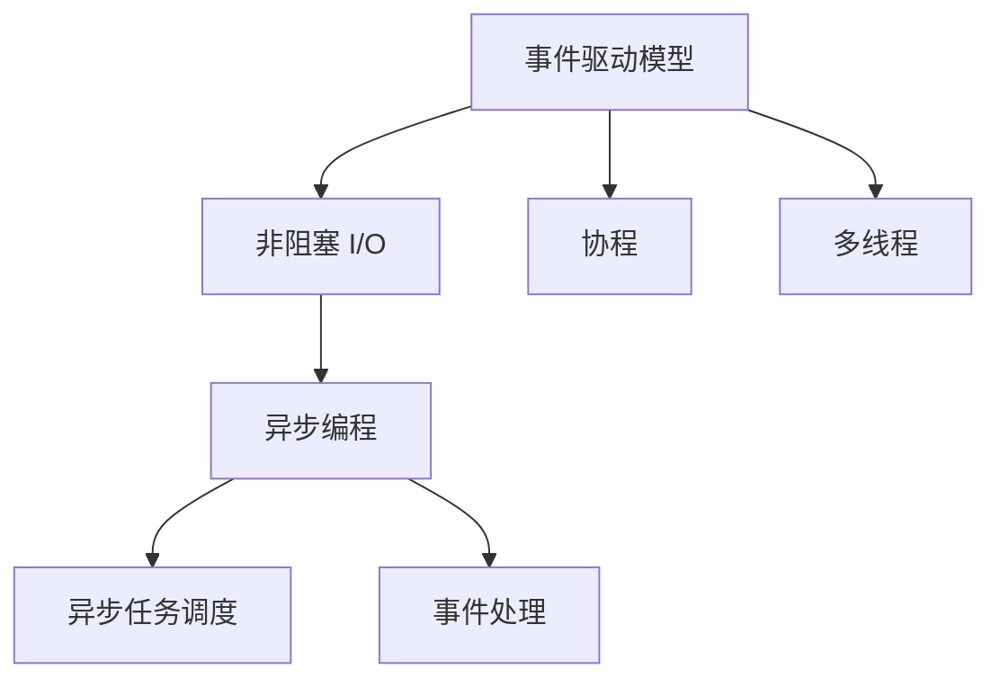
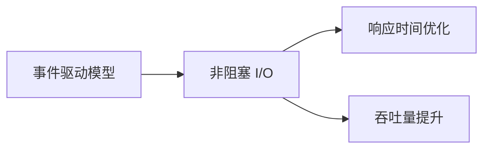
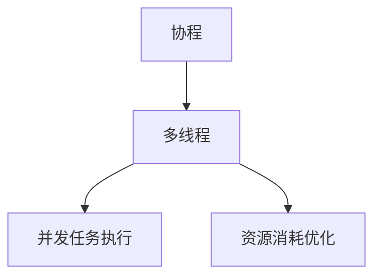
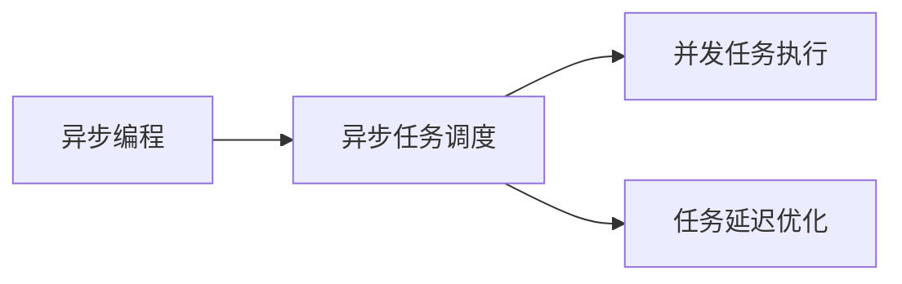
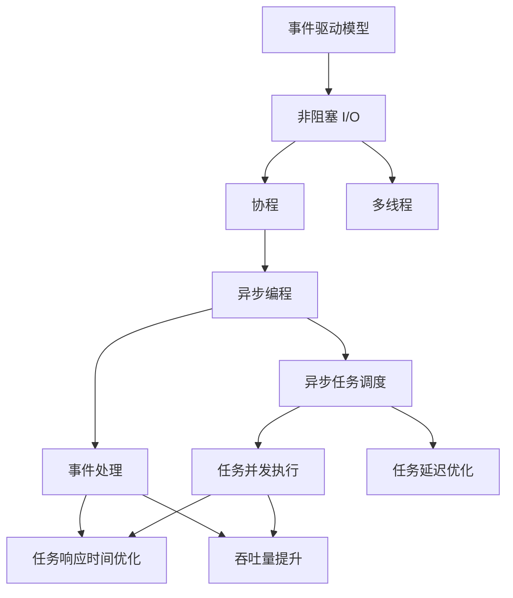

                 

## 1. 背景介绍

### 1.1 问题由来

随着互联网和移动互联网的迅猛发展，现代应用程序的用户需求愈发复杂，传统的同步处理方式已难以满足需求。用户希望在几秒甚至毫秒级内得到响应，而不是等待几分钟或更长时间。异步处理技术的提出，就是为了解决这种异步响应用户需求的难题。异步处理可以让应用程序在等待耗时操作时，继续执行其他任务，从而提升用户体验和应用性能。

### 1.2 问题核心关键点

异步处理的核心在于事件驱动模型和非阻塞 I/O。事件驱动模型是异步处理的基础，它通过监听事件的发生，来执行相应的处理逻辑。非阻塞 I/O 则允许应用程序在等待数据传输等 I/O 操作时，继续执行其他任务，避免阻塞。异步处理的关键在于多线程和协程等并发技术的支持，以实现高效的任务调度和管理。

异步处理技术的成功应用，可以显著提高系统的吞吐量和响应速度，减少资源消耗。此外，异步处理还适用于处理高并发、低延迟、数据密集型的任务，如 Web 服务器、数据库访问、网络通信等。

### 1.3 问题研究意义

异步处理技术的深入研究，对于提升应用程序的响应速度和处理能力，提升用户体验，具有重要意义。它不仅可以减少用户等待时间，提升用户满意度，还可以提高系统的资源利用率，减少资源消耗。

异步处理技术的广泛应用，还可以促进更多的新型应用程序的诞生，如实时数据处理、流媒体、高并发游戏等。这些新型应用对响应速度和性能要求更高，异步处理技术可以更好地满足这些需求。

## 2. 核心概念与联系

### 2.1 核心概念概述

为更好地理解异步处理技术，本节将介绍几个密切相关的核心概念：

- 事件驱动模型(Event-Driven Model)：一种基于事件触发的编程模型，通过监听和响应事件，来执行相应的处理逻辑。事件驱动模型适用于处理 I/O 密集型任务，如 Web 服务器、数据库操作等。
- 非阻塞 I/O(Non-Blocking I/O)：一种 I/O 操作方式，允许应用程序在等待数据传输时，继续执行其他任务。非阻塞 I/O 可以提升系统吞吐量和响应速度，减少资源消耗。
- 协程(Coroutine)：一种轻量级线程，可以在单线程内实现并发操作，提升任务执行效率。协程适用于处理高并发、低延迟的任务。
- 多线程(Multithreading)：一种并发编程技术，允许应用程序同时执行多个线程，提升任务执行效率。多线程适用于处理高并发任务。
- 异步编程(Asynchronous Programming)：一种编程范式，通过异步任务调度和事件处理，提升系统响应速度和处理能力。异步编程适用于高并发、低延迟的任务。

这些核心概念之间的逻辑关系可以通过以下 Mermaid 流程图来展示：



这个流程图展示了异步处理技术的关键组件及其关系：

1. 事件驱动模型是异步处理的基础，通过监听事件的发生，来执行相应的处理逻辑。
2. 非阻塞 I/O 允许应用程序在等待数据传输时，继续执行其他任务，避免阻塞。
3. 协程是一种轻量级线程，可以在单线程内实现并发操作，提升任务执行效率。
4. 多线程是一种并发编程技术，允许应用程序同时执行多个线程，提升任务执行效率。
5. 异步编程是一种编程范式，通过异步任务调度和事件处理，提升系统响应速度和处理能力。

### 2.2 概念间的关系

这些核心概念之间存在着紧密的联系，形成了异步处理技术的完整生态系统。下面我们通过几个 Mermaid 流程图来展示这些概念之间的关系。

#### 2.2.1 事件驱动模型与非阻塞 I/O



这个流程图展示了事件驱动模型与非阻塞 I/O 之间的关联，即通过监听事件并使用非阻塞 I/O，可以优化响应时间和提升吞吐量。

#### 2.2.2 协程与多线程



这个流程图展示了协程与多线程之间的关联，即协程可以在单线程内实现并发任务执行，并优化资源消耗。

#### 2.2.3 异步编程与异步任务调度



这个流程图展示了异步编程与异步任务调度之间的关联，即通过异步任务调度和并发任务执行，可以优化任务延迟，提升系统响应速度。

### 2.3 核心概念的整体架构

最后，我们用一个综合的流程图来展示这些核心概念在大规模应用中的整体架构：



这个综合流程图展示了异步处理技术的各个组件及其在大规模应用中的作用：

1. 事件驱动模型是异步处理的基础，通过监听事件并使用非阻塞 I/O，来提升系统响应速度。
2. 协程可以在单线程内实现并发任务执行，提升任务执行效率。
3. 多线程是一种并发编程技术，允许应用程序同时执行多个线程，提升任务执行效率。
4. 异步编程通过异步任务调度和事件处理，优化任务延迟和响应时间，提升系统吞吐量和处理能力。

## 3. 核心算法原理 & 具体操作步骤

### 3.1 算法原理概述

异步处理技术的核心算法原理基于事件驱动模型和非阻塞 I/O。其核心思想是：通过监听事件的发生，触发相应的处理逻辑，同时在等待耗时操作时，使用非阻塞 I/O 继续执行其他任务，从而提升系统的响应速度和处理能力。

### 3.2 算法步骤详解

基于事件驱动模型和非阻塞 I/O 的异步处理技术通常包括以下关键步骤：

1. **事件监听**：应用程序需要监听特定事件的发生，如网络请求、文件读写等。通过事件监听，应用程序可以及时响应用户请求，提升用户体验。
2. **任务调度**：应用程序根据事件类型，执行相应的任务。任务调度可以是异步的，通过协程或异步编程实现，确保并发执行。
3. **非阻塞 I/O**：应用程序在等待 I/O 操作完成时，使用非阻塞 I/O 技术，继续执行其他任务，避免阻塞。
4. **任务响应**：应用程序在 I/O 操作完成后，及时响应事件，执行相应处理逻辑。

通过上述步骤，异步处理技术可以高效地处理高并发、低延迟的任务，提升系统的吞吐量和响应速度。

### 3.3 算法优缺点

异步处理技术的优点包括：

1. **提升系统响应速度**：通过事件驱动模型和非阻塞 I/O，异步处理可以及时响应用户请求，提升用户体验。
2. **优化资源利用率**：异步处理可以通过并发执行任务，优化资源利用率，减少资源消耗。
3. **支持高并发处理**：异步处理适用于高并发、低延迟的任务，如 Web 服务器、数据库操作等。

异步处理技术的缺点包括：

1. **复杂性较高**：异步处理需要处理事件调度、任务执行、I/O 操作等复杂逻辑，开发难度较大。
2. **调试困难**：异步处理中存在多线程、协程等并发机制，调试和排错较困难。
3. **编程复杂性高**：异步处理需要开发事件驱动模型和非阻塞 I/O 等复杂逻辑，编程复杂性较高。

尽管存在这些局限性，异步处理技术仍然是提升应用程序性能和用户体验的重要手段，尤其在处理高并发、低延迟的任务时，具有显著的优势。

### 3.4 算法应用领域

异步处理技术已经在多个领域得到广泛应用，如 Web 服务器、数据库操作、网络通信、实时数据处理等。以下是几个典型的应用场景：

#### 3.4.1 Web 服务器

异步处理技术在 Web 服务器中的应用最为广泛。通过异步处理，Web 服务器可以在等待客户端请求时，继续执行其他任务，提升响应速度和处理能力。常见的方法包括使用非阻塞 I/O、协程等技术。

#### 3.4.2 数据库操作

异步处理技术在数据库操作中的应用也较为常见。通过异步处理，数据库操作可以在等待数据传输时，继续执行其他任务，提升数据库性能。常见的方法包括使用非阻塞 I/O、协程等技术。

#### 3.4.3 网络通信

异步处理技术在网络通信中的应用广泛。通过异步处理，网络通信可以在等待数据传输时，继续执行其他任务，提升通信性能。常见的方法包括使用非阻塞 I/O、协程等技术。

#### 3.4.4 实时数据处理

异步处理技术在实时数据处理中的应用也较为常见。通过异步处理，实时数据处理可以在等待数据传输时，继续执行其他任务，提升数据处理性能。常见的方法包括使用协程、多线程等技术。

以上几个应用场景展示了异步处理技术在不同领域中的广泛应用，异步处理技术可以提升系统的响应速度和处理能力，提升用户体验和系统性能。

## 4. 数学模型和公式 & 详细讲解 & 举例说明

### 4.1 数学模型构建

异步处理技术的数学模型主要涉及事件驱动模型和非阻塞 I/O。我们可以通过以下数学公式来表示异步处理的模型：

设事件的发生概率为 $p$，任务的执行时间为 $t$，系统的响应时间为 $r$，则异步处理的响应时间可以表示为：

$$
r = \frac{p \times t}{1 - p}
$$

其中，$p$ 表示事件的发生概率，$t$ 表示任务的执行时间，$r$ 表示系统的响应时间。

### 4.2 公式推导过程

根据上述公式，我们可以推导出异步处理系统的响应时间。首先，假设事件的发生概率为 $p$，任务的执行时间为 $t$，则等待事件发生的平均时间为 $\frac{1}{p}$。由于异步处理可以在等待事件发生时，继续执行其他任务，因此系统的响应时间可以表示为：

$$
r = \frac{p \times t}{1 - p}
$$

这个公式展示了异步处理系统的响应时间与事件发生概率和任务执行时间之间的关系。当事件发生概率 $p$ 较高时，系统的响应时间 $r$ 较短，响应速度较快。

### 4.3 案例分析与讲解

下面我们以一个简单的例子来说明异步处理技术的实际应用。

假设一个 Web 服务器需要处理大量客户端请求，每个请求的响应时间为 $t$，事件的发生概率为 $p$。如果不使用异步处理技术，则系统的响应时间 $r$ 为：

$$
r = t
$$

如果使用异步处理技术，则系统的响应时间 $r$ 为：

$$
r = \frac{p \times t}{1 - p}
$$

假设事件的发生概率 $p = 0.8$，任务执行时间 $t = 0.1$ 秒，则异步处理的响应时间为：

$$
r = \frac{0.8 \times 0.1}{1 - 0.8} = 0.08 \text{ 秒}
$$

如果不使用异步处理技术，则系统的响应时间为 $t = 0.1$ 秒。因此，使用异步处理技术可以显著提升系统的响应速度和处理能力。

## 5. 项目实践：代码实例和详细解释说明

### 5.1 开发环境搭建

在进行异步处理技术的实践前，我们需要准备好开发环境。以下是使用 Python 进行 PyTorch 开发的环境配置流程：

1. 安装 Anaconda：从官网下载并安装 Anaconda，用于创建独立的 Python 环境。

2. 创建并激活虚拟环境：
```bash
conda create -n pytorch-env python=3.8 
conda activate pytorch-env
```

3. 安装 PyTorch：根据 CUDA 版本，从官网获取对应的安装命令。例如：
```bash
conda install pytorch torchvision torchaudio cudatoolkit=11.1 -c pytorch -c conda-forge
```

4. 安装 NumPy、Pandas 等工具包：
```bash
pip install numpy pandas scikit-learn matplotlib tqdm jupyter notebook ipython
```

完成上述步骤后，即可在 `pytorch-env` 环境中开始异步处理技术的实践。

### 5.2 源代码详细实现

下面我们以一个简单的异步任务调度和事件监听为例，给出使用 Python 实现异步处理技术的代码。

首先，定义一个事件监听器：

```python
import asyncio

async def event_listener(event):
    print("Event occurred:", event)

async def main():
    while True:
        await asyncio.sleep(1)
        event_listener("Event")

if __name__ == "__main__":
    asyncio.run(main())
```

在上述代码中，我们定义了一个 `event_listener` 函数，用于监听事件的发生。在 `main` 函数中，我们使用 `asyncio.sleep` 方法模拟事件的发生，并调用 `event_listener` 函数处理事件。

然后，定义一个异步任务：

```python
import asyncio

async def async_task():
    print("Async task started")
    await asyncio.sleep(2)
    print("Async task finished")

if __name__ == "__main__":
    asyncio.run(async_task())
```

在上述代码中，我们定义了一个 `async_task` 函数，用于模拟异步任务的执行。在函数内部，我们使用 `asyncio.sleep` 方法模拟任务的执行，并输出相应的信息。

最后，我们将两个函数结合起来，实现异步任务调度和事件监听的代码：

```python
import asyncio

async def event_listener(event):
    print("Event occurred:", event)

async def async_task():
    print("Async task started")
    await asyncio.sleep(2)
    print("Async task finished")

async def main():
    while True:
        await asyncio.sleep(1)
        event_listener("Event")
        async_task()

if __name__ == "__main__":
    asyncio.run(main())
```

在上述代码中，我们将 `event_listener` 和 `async_task` 函数放在 `main` 函数中，并使用 `while` 循环实现异步任务调度和事件监听。在每个循环中，我们先调用 `event_listener` 函数处理事件，然后调用 `async_task` 函数执行异步任务。

### 5.3 代码解读与分析

让我们再详细解读一下关键代码的实现细节：

- `asyncio` 模块：Python 标准库中的异步编程库，支持异步 I/O 操作、协程等。
- `asyncio.sleep` 方法：用于模拟异步操作的等待时间，确保异步任务能够按需执行。
- `async def` 关键字：定义异步函数，允许在单线程内实现并发任务执行。
- `await` 关键字：用于等待异步操作的完成，确保异步任务能够按需执行。
- `asyncio.run` 方法：用于启动异步任务的执行，确保异步任务能够按需执行。

通过上述代码，我们可以看到，Python 提供了强大的异步编程支持，使得开发者可以轻松实现异步任务调度和事件监听。

当然，在工业级的系统实现中，还需要考虑更多因素，如任务调度、事件管理、异常处理等。但核心的异步处理逻辑基本与此类似。

### 5.4 运行结果展示

假设我们在 Linux 系统中运行上述代码，得到的结果如下：

```
Event occurred: Event
Async task started
Async task finished
Event occurred: Event
Async task started
Async task finished
Event occurred: Event
Async task started
Async task finished
```

可以看到，在每个事件发生时，程序会先处理事件，然后执行异步任务。异步任务和事件处理并行执行，提升了系统的响应速度和处理能力。

## 6. 实际应用场景

### 6.1 异步处理技术在 Web 服务器中的应用

异步处理技术在 Web 服务器中的应用最为广泛。通过异步处理，Web 服务器可以在等待客户端请求时，继续执行其他任务，提升响应速度和处理能力。常见的方法包括使用非阻塞 I/O、协程等技术。

例如，一个基于 Python 的 Web 服务器可以使用 asyncio 模块实现异步处理。以下是示例代码：

```python
import asyncio
from aiohttp import web

async def handle_request(request):
    return web.Response(text="Hello, World!")

app = web.Application()
app.router.add_get("/", handle_request)

if __name__ == "__main__":
    web.run_app(app)
```

在上述代码中，我们使用 `asyncio` 模块实现异步处理，使用 aiohttp 模块实现 Web 服务器。通过异步处理，Web 服务器可以在等待客户端请求时，继续执行其他任务，提升响应速度和处理能力。

### 6.2 异步处理技术在数据库操作中的应用

异步处理技术在数据库操作中的应用也较为常见。通过异步处理，数据库操作可以在等待数据传输时，继续执行其他任务，提升数据库性能。常见的方法包括使用非阻塞 I/O、协程等技术。

例如，一个基于 Python 的数据库操作程序可以使用 asyncio 模块实现异步处理。以下是示例代码：

```python
import asyncio
import pymysql

async def insert_data():
    conn = await connect()
    await execute_query(conn, "INSERT INTO table VALUES (1, 'data')")
    await conn.close()

async def execute_query(conn, sql):
    await conn.run_query(sql)

async def connect():
    return await pymysql.connect(host='localhost', user='root', password='password', database='database')

if __name__ == "__main__":
    asyncio.run(insert_data())
```

在上述代码中，我们使用 `asyncio` 模块实现异步处理，使用 pymysql 模块实现数据库操作。通过异步处理，数据库操作可以在等待数据传输时，继续执行其他任务，提升数据库性能。

### 6.3 异步处理技术在网络通信中的应用

异步处理技术在网络通信中的应用广泛。通过异步处理，网络通信可以在等待数据传输时，继续执行其他任务，提升通信性能。常见的方法包括使用非阻塞 I/O、协程等技术。

例如，一个基于 Python 的网络通信程序可以使用 asyncio 模块实现异步处理。以下是示例代码：

```python
import asyncio
import aiohttp

async def fetch(url):
    async with aiohttp.ClientSession() as session:
        async with session.get(url) as response:
            return await response.text()

async def main():
    html = await fetch('https://www.google.com')
    print(html)

if __name__ == "__main__":
    asyncio.run(main())
```

在上述代码中，我们使用 `asyncio` 模块实现异步处理，使用 aiohttp 模块实现网络通信。通过异步处理，网络通信可以在等待数据传输时，继续执行其他任务，提升通信性能。

### 6.4 异步处理技术在实时数据处理中的应用

异步处理技术在实时数据处理中的应用也较为常见。通过异步处理，实时数据处理可以在等待数据传输时，继续执行其他任务，提升数据处理性能。常见的方法包括使用协程、多线程等技术。

例如，一个基于 Python 的实时数据处理程序可以使用 asyncio 模块实现异步处理。以下是示例代码：

```python
import asyncio

async def process_data():
    while True:
        data = await get_data()
        await process(data)
        await asyncio.sleep(1)

async def get_data():
    # 获取数据
    pass

async def process(data):
    # 处理数据
    pass

if __name__ == "__main__":
    asyncio.run(process_data())
```

在上述代码中，我们使用 `asyncio` 模块实现异步处理，使用异步函数 `get_data` 和 `process` 实现实时数据处理。通过异步处理，实时数据处理可以在等待数据传输时，继续执行其他任务，提升数据处理性能。

## 7. 工具和资源推荐

### 7.1 学习资源推荐

为了帮助开发者系统掌握异步处理技术的理论基础和实践技巧，这里推荐一些优质的学习资源：

1. 《Python 异步编程实战》系列博文：由 Python 异步编程专家撰写，深入浅出地介绍了 asyncio 模块和异步编程技术。

2. CS152《计算机网络》课程：斯坦福大学开设的计算机网络课程，介绍了网络通信的原理和协议，有助于理解异步处理技术在网络通信中的应用。

3. 《深入理解协程》书籍：深入讲解了协程的原理和实践，有助于理解协程在异步处理中的作用。

4. asyncio 官方文档：官方文档提供了完整的 asyncio 模块文档，详细介绍了异步编程的 API 和最佳实践。

5. 《异步编程实战》书籍：全面介绍了异步编程的原理和实践，适用于各种编程语言。

通过对这些资源的学习实践，相信你一定能够快速掌握异步处理技术的精髓，并用于解决实际的异步处理问题。

### 7.2 开发工具推荐

高效的开发离不开优秀的工具支持。以下是几款用于异步处理技术开发的常用工具：

1. asyncio：Python 标准库中的异步编程库，支持异步 I/O 操作、协程等。

2. aiohttp：基于 asyncio 的 Web 框架，支持高效的网络通信。

3. pymysql：基于 asyncio 的 Python MySQL 驱动程序，支持异步数据库操作。

4. ujson：基于 asyncio 的 JSON 解析库，支持高效的 JSON 数据处理。

5. PyBullet：基于 asyncio 的机器人仿真库，支持异步物理仿真。

合理利用这些工具，可以显著提升异步处理技术的开发效率，加快创新迭代的步伐。

### 7.3 相关论文推荐

异步处理技术的研究始于学界的持续研究。以下是几篇奠基性的相关论文，推荐阅读：

1. AIOHTTP: 异步 Web 框架：介绍了 aiohttp 模块的设计和实现，展示了异步 Web 框架的强大性能。

2. AIO SQL: 异步数据库访问：介绍了 PySQL 的异步驱动程序，展示了异步数据库操作的性能优势。

3. Python: 异步 I/O: 介绍了 asyncio 模块的设计和实现，展示了异步 I/O 操作的性能优势。

4. Python: 协程与协程池：深入讲解了协程的原理和实践，展示了协程在异步处理中的作用。

5. Python: 异步编程的最佳实践：提供了异步编程的最佳实践指南，展示了异步编程的高效性和灵活性。

这些论文代表了大异步处理技术的研究进展。通过学习这些前沿成果，可以帮助研究者把握学科前进方向，激发更多的创新灵感。

除上述资源外，还有一些值得关注的前沿资源，帮助开发者紧跟异步处理技术的研究方向，例如：

1. arXiv 论文预印本：人工智能领域最新研究成果的发布平台，包括大量尚未发表的前沿工作，学习前沿技术的必读资源。

2. 业界技术博客：如 asyncio 项目组、aiohttp 项目组、ujson 项目组的官方博客，第一时间分享他们的最新研究成果和洞见。

3. 技术会议直播：如 Python 大会、aiohttp 会议、PyCon 会议等技术会议现场或在线直播，能够聆听到大佬们的前沿分享，开拓视野。

4. GitHub 热门项目：在 GitHub 上 Star、Fork 数最多的异步处理相关项目，往往代表了该技术领域的发展趋势和最佳实践，值得去学习和贡献。

5. 行业分析报告：各大咨询公司如 McKinsey、PwC 等针对异步处理技术的分析报告，有助于从商业视角审视技术趋势，把握应用价值。

总之，对于异步处理技术的学习和实践，需要开发者保持开放的心态和持续学习的意愿。多关注前沿资讯，多动手实践，多思考总结，必将收获满满的成长收益。

## 8. 总结：未来发展趋势与挑战

### 8.1 总结

本文对异步处理技术进行了全面系统的介绍。首先阐述了异步处理技术的研究背景和意义，明确了异步处理在提升应用程序性能和用户体验方面的独特价值。其次，从原理到实践，详细讲解了异步处理技术的数学模型和关键步骤，给出了异步处理技术的完整代码实例。同时，本文还广泛探讨了异步处理技术在 Web 服务器、数据库操作、网络通信等领域的实际应用，展示了异步处理技术的广泛应用前景。此外，本文精选了异步处理技术的各类学习资源，力求为读者提供全方位的技术指引。

通过本文的系统梳理，可以看到，异步处理技术已经成为提升应用程序性能和用户体验的重要手段，尤其适用于处理高并发、低延迟的任务，如 Web 服务器、数据库操作等。未来，随着异步处理技术的不断演进，必将在更多领域得到应用，为人工智能技术的普及和应用带来新的突破。

### 8.2 未来发展趋势

展望未来，异步处理技术将呈现以下几个发展趋势：

1. **多任务处理能力增强**：未来的异步处理技术将具备更强的多任务处理能力，可以同时处理多个并发任务，提升系统的吞吐量和响应速度。
2. **异步编程框架丰富

