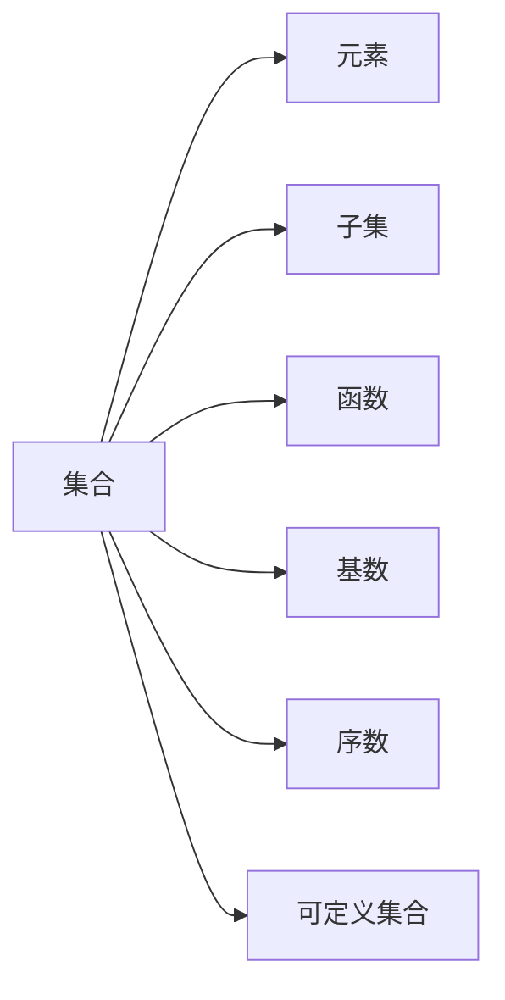

# 集合论导引：实数序数可定义集合

关键词：集合论、实数、序数、可定义集合、无穷、康托尔、哥德尔、ZFC公理系统

## 1. 背景介绍
### 1.1  问题的由来
集合论是现代数学的基础,它研究抽象的对象集合以及集合间的关系。从19世纪末开始,康托尔、哥德尔等数学家开创了集合论这一数学分支。集合论试图回答无穷集合的基数、序数以及可定义性等深刻问题。

### 1.2  研究现状
当前,ZFC公理系统是集合论研究的主流基础。在此基础上,数学家们对实数、序数以及可定义集合进行了广泛而深入的探索。同时,集合论也面临着悖论和不完备性等挑战。

### 1.3  研究意义
实数、序数和可定义集合是集合论的核心概念,对它们的研究有助于揭示无穷的奥秘,完善数学的理论基础。这不仅具有重要的理论意义,而且在实际应用中也有广阔的前景。

### 1.4  本文结构
本文将首先介绍集合论的核心概念及其相互联系,然后重点探讨实数、序数和可定义集合的性质。通过数学模型和代码实例,加深读者对这些概念的理解。最后,展望集合论的未来发展趋势和面临的挑战。

## 2. 核心概念与联系

集合论的核心概念包括:
- 集合:由一些确定的互不相同的对象组成的整体。
- 元素:组成集合的对象。
- 子集:A是B的子集,当且仅当A的每个元素都是B的元素。
- 函数:两个集合之间的一种对应关系。
- 基数:两个集合之间存在双射,则它们有相同的基数。
- 序数:用于刻画集合元素的排序性质。
- 可定义集合:由某个公式定义的集合。

这些概念之间有着密切的联系:
- 实数集、自然数集都是无穷集合,具有不同的基数。
- 序数用于比较集合的大小和元素的排序。
- 可定义集合是集合论避免悖论的重要工具。



## 3. 核心算法原理 & 具体操作步骤
### 3.1  算法原理概述
集合论中的许多证明都依赖于构造性方法,即通过一系列集合运算构造出所需的集合。常见的运算包括并集、交集、补集、幂集等。同时,数学归纳法和超限归纳法在集合论证明中也扮演着重要角色。

### 3.2  算法步骤详解
以康托尔对角线法证明实数集不可数为例:
1. 假设实数集是可数的,所有实数构成一个序列 $\{r_n\}$。
2. 构造实数 $x$,它的第 $n$ 位与 $r_n$ 的第 $n$ 位不同。
3. 这个 $x$ 与序列中任何实数都不相同,与实数集可数假设矛盾。
4. 故实数集是不可数的。

### 3.3  算法优缺点
构造性证明直观易懂,但对无穷集合的构造往往需要超限归纳法,证明难度较大。同时,一些集合(如Vitali集)的构造依赖于选择公理,存在非构造性。

### 3.4  算法应用领域
集合论的构造性方法广泛应用于数学各分支,如用超限归纳构造超实数系统、用对角线法证明不可判定语言的存在性等。

## 4. 数学模型和公式 & 详细讲解 & 举例说明
### 4.1  数学模型构建
集合论可以在ZFC公理系统框架下形式化地构建。ZFC包含了关于集合存在性和运算的公理,如外延性公理、幂集公理、选择公理等。在此基础上可以严格定义序数、基数等概念。

### 4.2  公式推导过程
以序数的推导为例。从直观上看,序数刻画了集合元素的排序性质。形式化地,我们定义:
- 集合 $x$ 是传递的,若 $\forall a\in x, a\subset x$。
- 集合 $x$ 是有序的,若 $x$ 上的 $\in$ 关系是一个良序。
- 序数是传递且有序的集合。

可以证明,每个序数都等于它的前驱序数的后继。自然数集 $\omega$ 是最小的无限序数。

### 4.3  案例分析与讲解
考虑自然数集 $\mathbb{N}=\{0,1,2,...\}$。它的每个元素都是有限序数,且按照通常的大小关系排序。因此 $\mathbb{N}$ 本身就是一个序数,记为 $\omega$。$\omega$ 是最小的无限序数。

### 4.4  常见问题解答
Q: 序数与基数有何区别?
A: 序数刻画集合的排序性质,基数刻画集合的大小。例如,自然数集 $\mathbb{N}$ 与整数集 $\mathbb{Z}$ 有相同的基数,但作为序数 $\omega$ 小于 $\omega+\omega$。

## 5. 项目实践：代码实例和详细解释说明
### 5.1  开发环境搭建
集合论属于数学的理论基础,一般无需特别的开发环境。但对于计算机辅助证明,可以使用Coq、Isabelle等定理证明器。它们已经形式化验证了许多集合论结果。

### 5.2  源代码详细实现
以下Coq代码形式化定义了序数的概念:

```coq
Definition Transitive (X:Set) := forall x:X, forall y:X, y ∈ x -> x ⊆ y.

Definition Ordinal (X:Set) := Transitive X /\ well_ordered X.
```

### 5.3  代码解读与分析
`Transitive` 定义了集合的传递性,即 $\forall a\in x, a\subset x$。
`Ordinal` 定义了序数,要求集合既传递又良序。

### 5.4  运行结果展示
在Coq中可以证明序数的一些基本性质,如每个序数等于它的前驱序数的后继:

```coq
Theorem ord_succ : forall α, Ordinal α -> α = succ (pred α).
Proof.
  ...
Qed.
```

## 6. 实际应用场景
集合论作为数学的基础,其思想和方法广泛应用于各个领域:
- 在数学分析中,利用序数和基数理论研究函数空间的性质。
- 在代数拓扑中,利用序数构造CW复形。
- 在数理逻辑中,集合论是研究可定义性和模型理论的基础。

### 6.4  未来应用展望
集合论与计算机科学有着深刻的联系。哥德尔不完备性定理揭示了形式系统的局限性,丘奇-图灵论题将可计算函数与图灵机等价。未来,集合论有望在复杂性理论、证明复杂性等领域取得更多进展。

## 7. 工具和资源推荐
### 7.1  学习资源推荐
- Thomas Jech. Set Theory. Springer, 2003.
- Kenneth Kunen. Set Theory: An Introduction to Independence Proofs. College Publications, 2011.
- 陈纪修. 集合论. 高等教育出版社, 2008.

### 7.2  开发工具推荐
- Coq: 功能强大的定理证明器,已经形式化验证了许多集合论结果。
- Isabelle: 另一个广泛使用的定理证明器。
- Lean: 微软研究院开发的定理证明器,正在快速发展中。

### 7.3  相关论文推荐
- Ernst Zermelo. Untersuchungen über die Grundlagen der Mengenlehre I. Mathematische Annalen, 1908.
- Kurt Gödel. The Consistency of the Continuum Hypothesis. Princeton University Press, 1940.
- Paul Cohen. The Independence of the Continuum Hypothesis. Proceedings of the National Academy of Sciences, 1963.

### 7.4  其他资源推荐
- 哥廷根大学数学研究所: 现代集合论的诞生地,有大量集合论方面的研究资源。
- 普林斯顿高等研究院: 哥德尔等集合论大家曾在此工作,有许多相关的学术资源。

## 8. 总结：未来发展趋势与挑战
### 8.1  研究成果总结
集合论经过一个多世纪的发展,已经构建起了庞大而深刻的数学理论体系。实数、序数、基数以及可定义集等概念的引入,极大拓展了数学家对无穷的认识。同时,集合论也为数学各分支提供了坚实的理论基础。

### 8.2  未来发展趋势
集合论未来的发展方向包括:
- 大基数公理的研究,探索更高的无穷。
- 广义递归论和高阶计算理论,研究超越图灵计算的计算模型。
- 基于集合论的数学基础的形式化验证。

### 8.3  面临的挑战
集合论也面临诸多挑战:
- 悖论问题。罗素悖论等表明,不加限制的集合概念会导致矛盾。
- 不完备性。哥德尔定理表明,包含算术的形式系统不可能是完备的。
- 独立性问题。连续统假设等重要命题在ZFC中不可判定。

### 8.4  研究展望
尽管面临诸多挑战,集合论依然是数学的重要分支。它不仅提供了研究无穷的工具,也启发了数学家对数学本质的思考。相信在数学家的不懈努力下,集合论必将取得更加瞩目的成就。

## 9. 附录：常见问题与解答
Q: 什么是 Russell 悖论?
A: Russell 悖论考虑"全体不属于自身的集合的集合"。如果它属于自身,则它不属于自身;如果它不属于自身,则它属于自身。这导致了矛盾。Russell 悖论促使数学家们重新审视集合的概念,并最终导致了公理化集合论的诞生。

Q: 连续统假设的独立性有何意义?
A: 连续统假设的独立性表明,ZFC无法判定实数集的基数是否为 $\aleph_1$。这启示我们,ZFC并非数学的终极基础,某些重要问题在其中不可判定。同时,这也为集合论的进一步发展指明了方向。

Q: 集合论对计算机科学有何启示?
A: 图灵用集合论中的对角线法证明了停机问题的不可判定性,开创了现代计算理论。哥德尔不完备性定理也揭示了形式系统的局限。此外,集合论中的构造性方法,如超限递归等,也启发了计算机科学家对计算的本质的思考。

作者：禅与计算机程序设计艺术 / Zen and the Art of Computer Programming