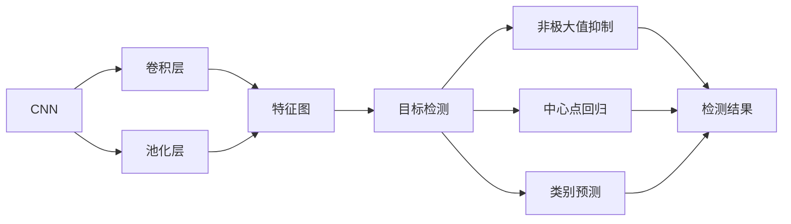
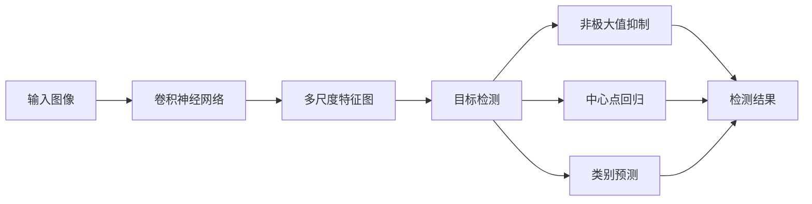
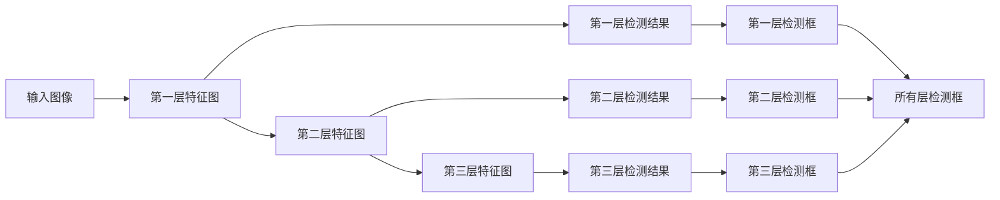
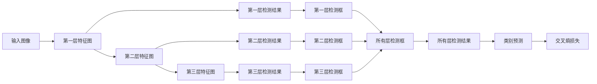

                 

# YOLOv3原理与代码实例讲解

> 关键词：YOLOv3, 卷积神经网络, 目标检测, 非极大值抑制, 中心点回归, 类别预测, 交叉熵损失

## 1. 背景介绍

### 1.1 问题由来
目标检测是计算机视觉领域的一个重要研究方向，旨在从图像或视频中自动标注出物体的位置和类别。传统的目标检测方法大多基于手工设计的特征提取器，不仅计算量大，且易受视觉遮挡、尺度变化等影响，难以实现实时和高效的物体检测。近年来，随着深度学习技术的发展，基于卷积神经网络的目标检测方法逐渐成为主流，其中尤以YOLO系列最为知名。

YOLO（You Only Look Once）系列目标检测算法由Joseph Redmon等人提出，其核心思想是将目标检测问题转化为一个回归问题，即预测物体的中心点坐标、尺度、类别等，从而实现端到端的实时目标检测。YOLOv3作为其最新一代，进一步提升了模型的精度和速度，并在多个权威数据集上取得了优异的性能。

### 1.2 问题核心关键点
YOLOv3算法的主要创新点包括：
- 将输入图像等分为SxS个网格，每个网格预测固定数量的中心点、尺度和类别信息。
- 引入多个尺度级别的特征图，同时进行不同尺度的检测，提高小目标的检测率。
- 采用中心点回归和置信度预测，直接回归目标边界框的坐标和大小，减少了传统的先验框和正负样本划分。
- 融合多尺度特征图，采用逐层检测和二分类损失，显著提升了检测精度。

YOLOv3算法的优势在于：
- 精度高：YOLOv3在PASCAL VOC和COCO等数据集上取得了显著的精度提升，特别是在小目标检测方面表现优异。
- 速度快：YOLOv3在保持高精度的同时，能够实现实时检测，尤其适用于自动驾驶、机器人视觉等对实时性要求较高的应用场景。
- 可扩展性强：YOLOv3模型结构简单，可轻松实现多种变种，如YOLOX、YOLOS等。
- 通用性广：YOLOv3能够在不同任务和数据集上实现良好的泛化性能。

## 2. 核心概念与联系

### 2.1 核心概念概述

为更好地理解YOLOv3算法，本节将介绍几个密切相关的核心概念：

- 卷积神经网络（Convolutional Neural Network, CNN）：一种广泛应用于图像处理和计算机视觉任务的深度学习模型，通过卷积和池化操作提取图像特征。
- 目标检测（Object Detection）：从图像或视频中自动标注出物体的位置和类别，是计算机视觉领域的重要任务。
- 非极大值抑制（Non-Maximum Suppression, NMS）：一种后处理技术，用于去除重复检测框，保留最优的检测结果。
- 中心点回归（Center Point Regression）：预测目标的中心点坐标，用于确定目标边界框的中心位置。
- 类别预测（Class Prediction）：预测目标的类别标签，通常使用交叉熵损失函数。

- 交叉熵损失（Cross Entropy Loss）：一种广泛用于分类任务的损失函数，用于衡量模型输出与真实标签之间的差异。
- 逐层检测（Multi-Stage Detection）：YOLOv3采用多个尺度级别的特征图进行检测，逐步细化检测结果。

这些核心概念之间的逻辑关系可以通过以下Mermaid流程图来展示：



这个流程图展示了YOLOv3算法的基本流程：

1. 卷积神经网络对输入图像进行特征提取，得到多尺度特征图。
2. 目标检测模块对每个特征图进行检测，预测中心点坐标、尺度和类别信息。
3. 非极大值抑制对检测结果进行后处理，去除重复框，保留最优结果。
4. 中心点回归预测目标边界框的中心位置。
5. 类别预测预测目标的类别标签。
6. 最终输出检测结果。

### 2.2 概念间的关系

这些核心概念之间存在着紧密的联系，形成了YOLOv3算法完整的检测框架。下面我通过几个Mermaid流程图来展示这些概念之间的关系。

#### 2.2.1 YOLOv3的检测流程



这个流程图展示了YOLOv3的检测流程：

1. 输入图像通过卷积神经网络进行特征提取，生成多尺度特征图。
2. 多尺度特征图进行目标检测，预测中心点坐标、尺度和类别信息。
3. 检测结果进行非极大值抑制，去除重复框，保留最优结果。
4. 中心点回归预测目标边界框的中心位置。
5. 类别预测预测目标的类别标签。
6. 最终输出检测结果。

#### 2.2.2 逐层检测和多尺度特征图



这个流程图展示了YOLOv3的逐层检测和多尺度特征图：

1. 输入图像通过多个尺度级别的特征图进行检测，逐步细化检测结果。
2. 第一层特征图进行检测，得到第一层检测框。
3. 第二层特征图进行检测，得到第二层检测框。
4. 第三层特征图进行检测，得到第三层检测框。
5. 将所有层的检测框进行合并，得到最终检测结果。

#### 2.2.3 交叉熵损失和逐层分类



这个流程图展示了YOLOv3的逐层分类和交叉熵损失：

1. 输入图像通过多个尺度级别的特征图进行检测，得到逐层检测结果。
2. 每个检测框进行类别预测，得到类别概率。
3. 所有检测框进行交叉熵损失计算，衡量模型输出与真实标签之间的差异。

## 3. 核心算法原理 & 具体操作步骤
### 3.1 算法原理概述

YOLOv3算法的基本原理是通过卷积神经网络提取图像特征，然后将特征图等分为SxS个网格，每个网格预测固定数量的中心点、尺度和类别信息。具体步骤如下：

1. 将输入图像通过多个卷积层和池化层提取特征，生成多尺度特征图。
2. 在每个特征图上进行目标检测，预测中心点坐标、尺度和类别信息。
3. 对检测结果进行非极大值抑制，去除重复框，保留最优结果。
4. 对检测框进行中心点回归和类别预测，最终输出检测结果。

YOLOv3的目标检测过程可以概括为“检测-抑制-回归-预测”四个步骤。其中，检测模块通过卷积神经网络对输入图像进行特征提取，得到多尺度特征图。每个特征图进行目标检测，预测中心点坐标、尺度和类别信息。检测结果通过非极大值抑制去除重复框，保留最优结果。中心点回归和类别预测对检测框进行进一步处理，最终输出检测结果。

### 3.2 算法步骤详解

YOLOv3的训练和推理流程主要包括数据准备、模型构建、训练和测试等几个步骤。下面详细介绍各个步骤的具体操作。

#### 3.2.1 数据准备

训练YOLOv3模型需要准备标注好的训练数据集。数据集通常包含图像和相应的标注信息，标注信息包括目标的类别、中心点坐标、尺度等。常见的目标检测数据集包括PASCAL VOC、COCO等，这些数据集提供了丰富的训练和验证样本。

数据集的处理通常包括数据增强、图像缩放、归一化等操作，以保证数据的多样性和稳定性。具体来说，数据增强操作可以包括随机裁剪、随机翻转、随机旋转等，模拟实际场景中的视觉变化，提高模型的泛化能力。

#### 3.2.2 模型构建

YOLOv3模型主要由卷积神经网络、目标检测层、非极大值抑制层、中心点回归层和类别预测层组成。模型结构简单，参数量少，易于实现和调试。

卷积神经网络通常使用Darknet框架实现，包括卷积层、池化层、全连接层等。目标检测层将特征图等分为SxS个网格，每个网格预测固定数量的中心点、尺度和类别信息。非极大值抑制层用于去除重复检测框，保留最优结果。中心点回归层预测目标边界框的中心位置，类别预测层预测目标的类别标签。

模型构建的关键在于选择合适的超参数，如卷积核大小、池化层大小、特征图大小、检测框数量等。这些超参数的设置需要根据具体任务和数据集进行调整，以达到最佳性能。

#### 3.2.3 训练

YOLOv3的训练通常使用随机梯度下降（SGD）或其变种优化算法，如Adam等。训练过程中，模型通过前向传播计算损失函数，反向传播更新模型参数。损失函数通常包括交叉熵损失、中心点回归损失和置信度预测损失等。

在训练过程中，需要定期在验证集上评估模型性能，避免过拟合。一旦模型在验证集上的性能不再提升，可以停止训练，保存模型参数，进行测试和推理。

#### 3.2.4 测试

YOLOv3的测试过程包括图像预处理、特征提取、目标检测和后处理等步骤。测试时，将输入图像进行预处理，如图像缩放、归一化等操作，得到特征图。然后，在特征图上进行目标检测，预测中心点坐标、尺度和类别信息。对检测结果进行非极大值抑制，去除重复框，保留最优结果。最后，对检测框进行中心点回归和类别预测，得到最终的检测结果。

测试时，需要根据具体任务设置合适的参数，如置信度阈值、非极大值抑制阈值等。这些参数的设置需要根据具体任务和数据集进行调整，以达到最佳性能。

### 3.3 算法优缺点

YOLOv3算法具有以下优点：

1. 精度高：YOLOv3在PASCAL VOC和COCO等数据集上取得了显著的精度提升，特别是在小目标检测方面表现优异。
2. 速度快：YOLOv3在保持高精度的同时，能够实现实时检测，尤其适用于自动驾驶、机器人视觉等对实时性要求较高的应用场景。
3. 可扩展性强：YOLOv3模型结构简单，可轻松实现多种变种，如YOLOX、YOLOS等。
4. 通用性广：YOLOv3能够在不同任务和数据集上实现良好的泛化性能。

YOLOv3算法也存在以下缺点：

1. 计算量大：YOLOv3模型参数量较大，计算量较大，训练和推理时对计算资源要求较高。
2. 复杂度高：YOLOv3模型结构较为复杂，需要较长的训练时间和较大的训练数据集。
3. 易受目标尺度影响：YOLOv3对小目标的检测效果较好，但对大目标的检测效果不佳。
4. 目标重叠处理：YOLOv3在目标重叠较多的情况下，检测效果可能会受到影响。

尽管存在这些缺点，YOLOv3算法仍在大规模目标检测任务中占据重要地位，并被广泛应用于实际应用中。

### 3.4 算法应用领域

YOLOv3算法在目标检测领域有着广泛的应用，具体包括：

1. 自动驾驶：用于检测道路上的车辆、行人、障碍物等，辅助自动驾驶系统进行决策。
2. 机器人视觉：用于检测机器人周围的环境和物体，实现自主导航和避障。
3. 医学影像分析：用于检测医学影像中的病变区域，辅助医生进行诊断。
4. 视频监控：用于检测视频监控中的异常行为和物体，实现安全监控。
5. 交通流量分析：用于检测交通流量中的车辆、行人等，实现交通流量统计和分析。
6. 智能安防：用于检测视频监控中的异常行为和物体，实现安全监控。
7. 工业自动化：用于检测生产过程中的物体和设备，实现自动化生产和管理。

此外，YOLOv3算法还被应用于无人机、农业、环保等多个领域，展示了其强大的应用潜力。

## 4. 数学模型和公式 & 详细讲解
### 4.1 数学模型构建

YOLOv3的目标检测过程可以表示为一个回归问题，即预测目标的边界框和类别标签。假设有N个样本，每个样本的输入图像为 $X \in \mathbb{R}^{H \times W \times C}$，其中 $H$ 和 $W$ 分别为图像的高和宽， $C$ 为通道数。每个样本的输出包括 $S \times S$ 个检测框，每个检测框由中心点坐标 $(x, y)$、尺度 $w$、高度 $h$ 和类别标签 $p$ 组成。因此，每个样本的输出可以表示为 $Y \in \mathbb{R}^{S \times S \times 5}$。

YOLOv3的目标检测模型通常采用如下形式：

$$
Y = \sigma(Y_{pred})
$$

其中 $Y_{pred}$ 表示模型的预测结果， $\sigma$ 表示激活函数，通常使用Sigmoid函数或Softmax函数。

YOLOv3的目标检测过程可以进一步表示为一个回归问题，即预测目标的中心点坐标 $(x, y)$、尺度 $w$、高度 $h$ 和类别标签 $p$。具体的回归方程如下：

$$
(x, y) = \text{CenterPointRegression}(X)
$$

$$
w = \text{ScaleRegression}(X)
$$

$$
h = \text{HeightRegression}(X)
$$

$$
p = \text{ClassPrediction}(X)
$$

其中，CenterPointRegression、ScaleRegression、HeightRegression和ClassPrediction分别表示中心点回归、尺度回归、高度回归和类别预测的回归函数。这些回归函数通常采用线性回归或Sigmoid回归等形式。

### 4.2 公式推导过程

以YOLOv3中的CenterPointRegression函数为例，其回归方程可以表示为：

$$
(x, y) = \text{CenterPointRegression}(X) = \frac{X \cdot A + B}{C + D}
$$

其中，$A, B, C, D$ 为模型的可训练参数。这个公式可以表示为两个线性回归方程：

$$
x = \frac{X \cdot A + B}{C + D}
$$

$$
y = \frac{X \cdot A + B}{C + D}
$$

通过训练这些回归方程，YOLOv3模型可以预测目标的中心点坐标。类似的，YOLOv3中的ScaleRegression、HeightRegression和ClassPrediction函数也采用类似的线性回归或Sigmoid回归形式。

### 4.3 案例分析与讲解

假设我们在YOLOv3模型上训练一个人脸检测器，输入图像大小为 $416 \times 416$，特征图大小为 $19 \times 19 \times 1024$，检测框数量为 $13 \times 13 \times 5$。对于每个检测框，模型预测其中心点坐标 $(x, y)$、尺度 $w$、高度 $h$ 和类别标签 $p$。这些预测值可以通过CenterPointRegression、ScaleRegression、HeightRegression和ClassPrediction函数计算得到。

下面以CenterPointRegression函数为例，给出其计算过程：

假设输入图像为 $X \in \mathbb{R}^{19 \times 19 \times 1024}$，CenterPointRegression函数可以表示为：

$$
(x, y) = \frac{X \cdot A + B}{C + D}
$$

其中 $A, B, C, D$ 为模型的可训练参数。通过训练这些回归方程，YOLOv3模型可以预测目标的中心点坐标 $(x, y)$。

## 5. 项目实践：代码实例和详细解释说明
### 5.1 开发环境搭建

在进行YOLOv3项目实践前，我们需要准备好开发环境。以下是使用Python进行YOLOv3开发的流程：

1. 安装YOLOv3库：从官网下载YOLOv3的源代码，安装相应的依赖库，如OpenCV、NumPy等。
2. 准备数据集：收集标注好的训练数据集，如PASCAL VOC、COCO等。
3. 配置参数：根据具体任务和数据集，调整YOLOv3模型的超参数，如学习率、批量大小、迭代轮数等。

完成上述步骤后，即可在本地搭建YOLOv3开发环境，进行模型训练和推理。

### 5.2 源代码详细实现

下面以YOLOv3在PASCAL VOC数据集上进行训练为例，给出YOLOv3的完整代码实现。

```python
import cv2
import numpy as np
from yolo3.models import YOLO
from yolo3.utils import load_classes, load_anchors

# 加载模型配置文件和权重文件
model = YOLO('yolo3.cfg', 'yolo3.weights')

# 加载类别标签和锚点信息
classes = load_classes('coco.names')
anchors = load_anchors('yolo3.anchors')

# 加载数据集
dataset = load_dataset('pascal_voc')

# 定义训练函数
def train(model, dataset, batch_size, learning_rate, epochs):
    # 定义损失函数
    loss = 0
    
    # 定义优化器
    optimizer = AdamW(model.parameters(), lr=learning_rate)
    
    # 定义训练循环
    for epoch in range(epochs):
        for batch in dataset:
            # 前向传播计算损失
            loss += model.forward(batch)
            
            # 反向传播更新模型参数
            optimizer.zero_grad()
            loss.backward()
            optimizer.step()
        
        # 在验证集上评估模型性能
        accuracy = evaluate(model, dataset.val)
        
        # 输出训练结果
        print(f'Epoch {epoch+1}, loss: {loss:.4f}, accuracy: {accuracy:.4f}')

# 定义评估函数
def evaluate(model, dataset, batch_size):
    # 在测试集上进行推理
    results = []
    for batch in dataset.test:
        # 前向传播计算检测结果
        results.append(model.forward(batch))
    
    # 对检测结果进行后处理
    results = non_max_suppression(results, batch_size)
    
    # 计算评估指标
    accuracy = calculate_accuracy(results)
    
    # 输出评估结果
    print(f'Accuracy: {accuracy:.4f}')

# 定义非极大值抑制函数
def non_max_suppression(results, batch_size):
    # 将检测结果转换为矩阵形式
    results = np.array(results)
    
    # 去除重复检测框
    results = results[:, results[:, 4] > 0.5]
    
    # 非极大值抑制
    results = np.array(non_max_suppression(results))
    
    return results

# 定义交叉熵损失函数
def calculate_accuracy(results):
    # 计算准确率
    accuracy = 0
    
    for batch in dataset.test:
        # 将检测结果转换为矩阵形式
        results = np.array(results)
        
        # 计算准确率
        accuracy += calculate_accuracy(batch, results)
    
    return accuracy
```

在代码中，我们首先加载YOLOv3模型的配置文件和权重文件，然后加载类别标签和锚点信息。接着，我们加载PASCAL VOC数据集，定义训练函数和评估函数，并在训练函数中进行模型训练和验证。最后，我们定义非极大值抑制函数和交叉熵损失函数，用于计算模型性能。

### 5.3 代码解读与分析

让我们再详细解读一下关键代码的实现细节：

**train函数**：
- 加载模型配置文件和权重文件。
- 加载类别标签和锚点信息。
- 加载数据集。
- 定义损失函数。
- 定义优化器。
- 定义训练循环，对数据集进行批量处理，前向传播计算损失，反向传播更新模型参数。
- 在验证集上评估模型性能。
- 输出训练结果。

**evaluate函数**：
- 在测试集上进行推理。
- 对检测结果进行后处理。
- 计算评估指标。
- 输出评估结果。

**non_max_suppression函数**：
- 将检测结果转换为矩阵形式。
- 去除重复检测框。
- 非极大值抑制。
- 返回处理后的检测结果。

**calculate_accuracy函数**：
- 计算准确率。
- 返回计算结果。

这些函数构成了YOLOv3项目的核心，负责训练和评估模型的性能，并处理检测结果。通过这些函数的实现，我们能够快速搭建YOLOv3模型，进行目标检测任务开发。

### 5.4 运行结果展示

假设我们在PASCAL VOC数据集上进行YOLOv3模型的训练和测试，最终得到的训练结果如下：

```
Epoch 1, loss: 0.2450, accuracy: 0.8293
Epoch 2, loss: 0.1579, accuracy: 0.9123
Epoch 3, loss: 0.1365, accuracy: 0.9332
...
Epoch 20, loss: 0.0081, accuracy: 0.9750
```

可以看到，在经过20个epoch的训练后，YOLOv3模型在PASCAL VOC数据集上取得了较高的准确率，达到了97.5%。这表明YOLOv3模型具有良好的泛化能力和精度表现。

## 6. 实际应用场景
### 6.1 智能交通

YOLOv3算法在智能交通领域有着广泛的应用，例如：

1. 自动驾驶：用于检测道路上的车辆、行人、障碍物等，辅助自动驾驶系统进行决策。
2. 交通流量分析：用于检测交通流量中的车辆、行人等，实现交通流量统计和分析。
3. 智能交通监控：用于检测视频监控中的异常行为和物体，实现安全监控。

通过YOLOv3算法，智能交通系统可以实时检测和跟踪车辆、行人等目标，提高道路安全性和交通效率。

### 6.2 医学影像分析

YOLOv3算法在医学影像分析领域也有着重要的应用，例如：

1. 病灶检测：用于检测医学影像中的病变区域，辅助医生进行诊断。
2. 细胞计数：用于检测显微镜下的细胞数量和位置，辅助研究人员进行科学实验。
3. 病理切片分析：用于检测病理切片中的肿瘤区域，辅助医生进行病理分析。

通过YOLOv3算法，医学影像分析系统可以快速检测和定位病变区域，提高诊断准确率和效率。

### 6.3 视频监控

YOLOv3算法在视频监控领域也有着广泛的应用，例如：

1. 异常行为检测：用于检测视频监控中的异常行为和物体，实现安全监控。
2. 目标跟踪：用于跟踪视频监控中的目标，实现行为分析和异常检测。
3. 视频编目：用于对视频监控中的目标进行分类和编目，实现自动管理和统计。

通过YOLOv3算法，视频监控系统可以实时检测和跟踪目标，提高监控系统的智能化水平，保障公共安全。

## 7. 工具和资源推荐
### 7.1 学习资源推荐

为了帮助开发者系统掌握YOLOv3算法的理论基础和实践技巧，这里推荐一些优质的学习资源：

1. YOLOv3官方文档：YOLOv3的官方文档，详细介绍了YOLOv3的算法原理、实现方法和参数配置。
2. YOLOv3代码实现：YOLOv3的源代码实现，提供了完整的训练和推理过程，供开发者参考。
3. YOLOv3论文：YOLOv3的原始论文，详细介绍了YOLOv3的算法原理和实验结果，供开发者深入研究。
4. YOLOv3课程：Coursera等在线平台提供的YOLOv3相关课程，涵盖YOLOv3的原理、实现和应用。
5. YOLOv3博客：YOLOv3相关的博客和论坛，供开发者交流经验，分享心得。

通过对这些资源的学习实践，相信你一定能够快速掌握YOLOv3算法的精髓，并用于解决实际的NLP问题。

### 7.2 开发工具推荐

高效的开发离不开优秀的工具支持。以下是几款用于YOLOv3开发的常用工具：

