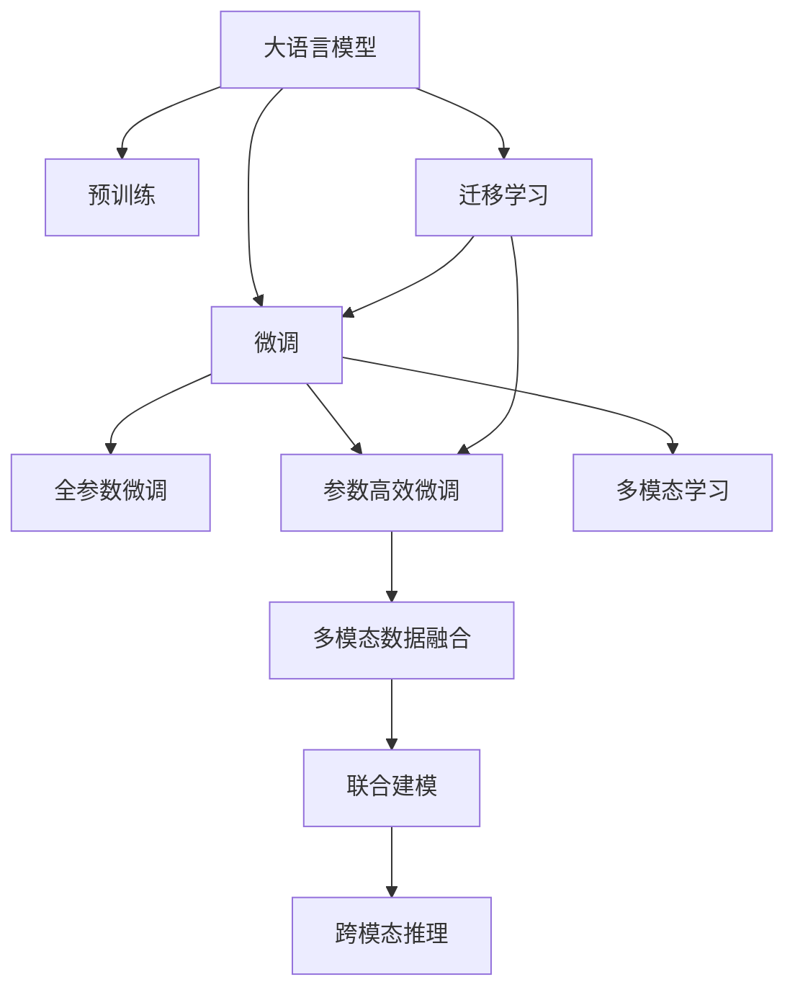
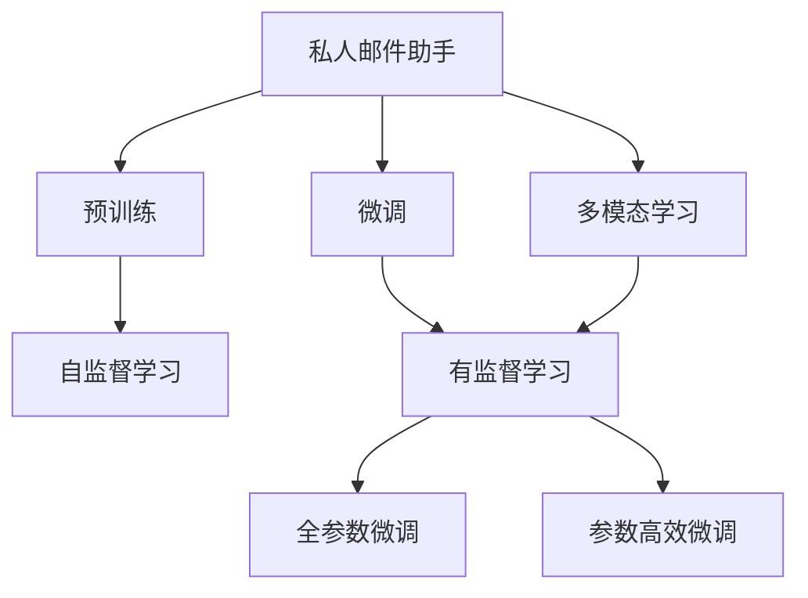
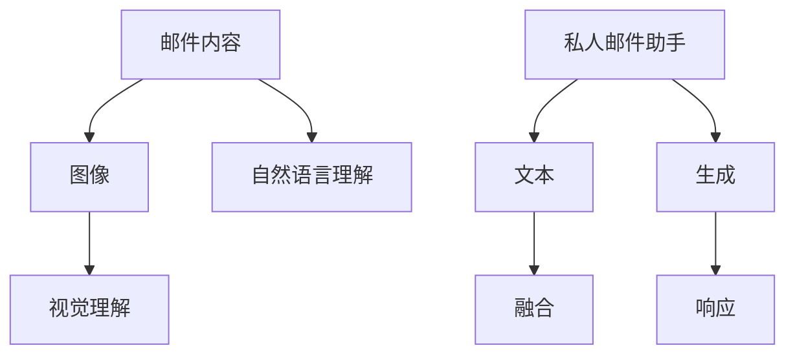
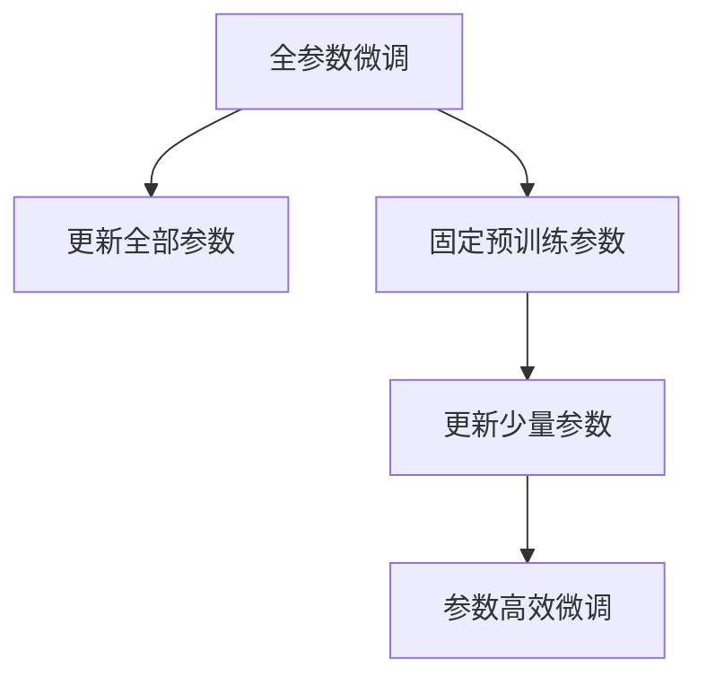
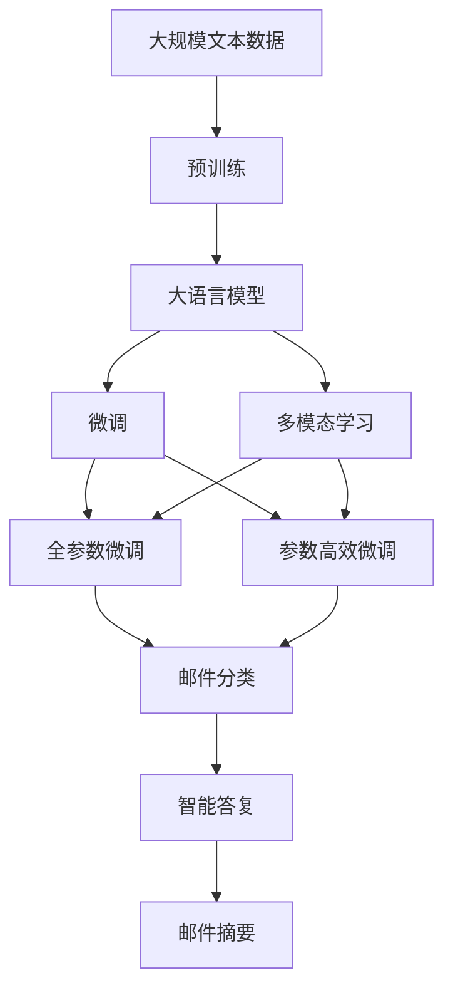

                 

# 大语言模型应用指南：案例：私人邮件助手

## 1. 背景介绍

在当今信息化时代，邮件通信仍然是企业和个人之间重要且高效的交流方式之一。然而，海量的邮件处理不仅耗时费力，还容易遗漏重要信息。利用大语言模型，特别是基于自然语言处理的私人邮件助手，可以显著提升邮件处理的效率和质量。本文将探讨如何构建一个高效的私人邮件助手，并详细介绍其核心技术原理、实现步骤和应用场景。

### 1.1 问题由来

随着工作和生活节奏的加快，人们每天可能需要处理数百封甚至数千封邮件。传统的手动筛选和分类方式不仅耗时，还容易错过重要邮件。因此，利用自然语言处理技术，自动分析和分类邮件，将极大提高工作效率，减少信息遗漏。私人邮件助手通过学习和理解邮件内容，可以自动完成邮件过滤、摘要生成、优先级排序等任务，为用户提供智能化的邮件管理服务。

### 1.2 问题核心关键点

私人邮件助手的设计和实现主要包括以下几个关键点：

- **预训练语言模型**：选择适合的预训练语言模型，如BERT、GPT等，用于邮件内容理解和分析。
- **任务适配**：设计邮件分类、摘要生成、智能答复等任务适配层，适应特定邮件处理需求。
- **数据准备**：准备包含分类标签、摘要标签等的训练数据集，供模型微调使用。
- **微调过程**：在准备数据集的基础上，利用预训练模型进行微调，以适应邮件处理任务。
- **应用部署**：将微调后的模型封装成API，提供给邮件客户端使用，实现邮件助手功能。

### 1.3 问题研究意义

私人邮件助手作为大语言模型在实际应用中的一个典型案例，具有以下重要意义：

1. **提高邮件处理效率**：自动分类和优先级排序功能，能够帮助用户快速识别重要邮件，减少手动筛选时间。
2. **减少信息遗漏**：智能摘要和重点提取功能，能够自动生成邮件摘要和重要信息，避免关键信息遗漏。
3. **提升决策支持**：基于邮件内容的分析，能够辅助用户进行决策，如合同审批、客户跟进等。
4. **促进个性化服务**：根据用户的邮件习惯和偏好，提供个性化的邮件处理建议。
5. **推动AI技术应用**：私人邮件助手是NLP技术在实际应用中的重要范例，有助于推动AI技术在企业内部的落地。

## 2. 核心概念与联系

### 2.1 核心概念概述

为更好地理解私人邮件助手的构建原理，本节将介绍几个密切相关的核心概念：

- **大语言模型(Large Language Model, LLM)**：以自回归(如GPT)或自编码(如BERT)模型为代表的大规模预训练语言模型。通过在大规模无标签文本语料上进行预训练，学习通用的语言知识，具备强大的语言理解和生成能力。

- **预训练(Pre-training)**：指在大规模无标签文本语料上，通过自监督学习任务训练通用语言模型的过程。常见的预训练任务包括言语建模、遮挡语言模型等。

- **微调(Fine-tuning)**：指在预训练模型的基础上，使用任务特定的少量标注数据，通过有监督学习优化模型在该任务上的性能。通常只需要调整顶层分类器或解码器，并以较小的学习率更新全部或部分模型参数。

- **迁移学习(Transfer Learning)**：指将一个领域学习到的知识，迁移应用到另一个不同但相关的领域的学习范式。大模型的预训练-微调过程即是一种典型的迁移学习方式。

- **多模态学习(Multimodal Learning)**：指将文本、图像、语音等多模态数据融合，进行联合建模和分析，提升模型的理解能力和应用效果。

这些核心概念之间的逻辑关系可以通过以下Mermaid流程图来展示：



这个流程图展示了大语言模型的核心概念及其之间的关系：

1. 大语言模型通过预训练获得基础能力。
2. 微调是对预训练模型进行任务特定的优化，可以分为全参数微调和参数高效微调（PEFT）。
3. 迁移学习是连接预训练模型与邮件处理任务的桥梁，可以通过微调或多模态学习来实现。
4. 多模态学习是进一步提升模型在邮件处理中的表现，将文本、图像等多模态数据融合到模型中。

### 2.2 概念间的关系

这些核心概念之间存在着紧密的联系，形成了私人邮件助手的完整生态系统。下面我们通过几个Mermaid流程图来展示这些概念之间的关系。

#### 2.2.1 私人邮件助手的学习范式



这个流程图展示了大语言模型的学习范式，即从预训练到微调，再到多模态学习的完整过程。

#### 2.2.2 微调与多模态学习的结合



这个流程图展示了私人邮件助手在处理邮件时，将文本和图像等多模态数据融合的过程。

#### 2.2.3 全参数微调和参数高效微调的比较



这个流程图展示了全参数微调和参数高效微调（PEFT）的区别和联系。

### 2.3 核心概念的整体架构

最后，我们用一个综合的流程图来展示这些核心概念在大语言模型微调过程中的整体架构：



这个综合流程图展示了从预训练到微调，再到多模态学习的完整过程。私人邮件助手首先在大规模文本数据上进行预训练，然后通过微调或多模态学习，使得模型具备邮件处理能力。微调后的模型可以自动分类邮件，生成摘要，并进行智能回复，进一步提升邮件处理效率和质量。

## 3. 核心算法原理 & 具体操作步骤
### 3.1 算法原理概述

私人邮件助手的设计和实现基于大语言模型的预训练-微调范式，具体而言，包括以下几个核心步骤：

1. **预训练语言模型选择**：选择合适的预训练语言模型，如BERT、GPT等，用于邮件内容理解和分析。
2. **数据准备**：准备包含邮件分类标签、摘要标签等的训练数据集，供模型微调使用。
3. **任务适配**：设计邮件分类、摘要生成、智能答复等任务适配层，适应特定邮件处理需求。
4. **微调过程**：在准备数据集的基础上，利用预训练模型进行微调，以适应邮件处理任务。
5. **应用部署**：将微调后的模型封装成API，提供给邮件客户端使用，实现邮件助手功能。

### 3.2 算法步骤详解

#### 3.2.1 预训练语言模型选择

私人邮件助手的设计首先要选择合适的预训练语言模型。常用的预训练模型包括BERT、GPT等。BERT模型在预训练过程中，通过掩码语言模型和下一句预测任务，学习到丰富的语言知识。GPT模型则通过自回归生成任务，学习到语言生成的能力。具体选择哪种模型，取决于具体应用场景和性能需求。

#### 3.2.2 数据准备

数据准备是私人邮件助手构建的重要步骤。邮件数据集应包含多个属性，如发送者、接收者、主题、正文等，以及对应的分类标签和摘要标签。标注数据集的准备需要保证数据质量和多样性，以提高模型的泛化能力。此外，由于邮件数据的隐私性，在数据准备和处理过程中，需要遵守相关法律法规和隐私保护政策。

#### 3.2.3 任务适配

邮件处理任务包括邮件分类、摘要生成、智能答复等。邮件分类任务需要将邮件自动分为重要邮件、一般邮件和垃圾邮件等类别。摘要生成任务需要自动提取邮件的摘要信息，以便用户快速了解邮件内容。智能答复任务需要根据邮件内容生成自动回复，以提高用户沟通效率。

#### 3.2.4 微调过程

微调过程是私人邮件助手设计的核心部分。具体步骤如下：

1. **微调参数设置**：设置微调的超参数，包括学习率、批大小、迭代轮数等。
2. **模型加载与适配**：加载预训练模型，根据邮件处理任务需求，在模型顶层添加或修改任务适配层。
3. **数据加载与预处理**：将邮件数据集加载到模型中，进行必要的预处理，如分词、截断等。
4. **模型训练**：使用有监督学习算法，对模型进行训练，最小化损失函数。
5. **模型评估**：在验证集和测试集上评估模型性能，调整模型参数以提高模型效果。
6. **模型部署**：将微调后的模型封装成API，提供给邮件客户端使用。

### 3.3 算法优缺点

私人邮件助手的设计和使用具有以下优点：

1. **提高邮件处理效率**：自动分类和摘要生成功能，能够快速识别重要邮件和提取关键信息。
2. **减少信息遗漏**：智能答复和优先级排序功能，能够辅助用户进行决策，减少重要信息遗漏。
3. **提升决策支持**：基于邮件内容的分析，能够辅助用户进行决策，如合同审批、客户跟进等。
4. **促进个性化服务**：根据用户的邮件习惯和偏好，提供个性化的邮件处理建议。

同时，私人邮件助手也存在一些缺点：

1. **数据依赖**：模型的效果很大程度上取决于标注数据的质量和数量，标注数据的准备和获取成本较高。
2. **模型泛化能力有限**：在目标邮件数据分布与预训练数据分布差异较大时，模型的泛化能力可能不足。
3. **安全性问题**：模型输出的准确性和安全性需要得到保障，避免出现误判或泄露敏感信息。
4. **计算资源消耗大**：大语言模型的推理过程需要大量的计算资源，可能会影响系统的响应速度。

### 3.4 算法应用领域

私人邮件助手作为一种大语言模型的应用，不仅适用于企业内部的邮件管理，还广泛应用于以下几个领域：

1. **电子邮件系统**：帮助用户自动分类和管理电子邮件，提高工作效率。
2. **客户服务系统**：自动回答客户咨询，提升客户服务质量。
3. **知识管理系统**：自动分类和抽取邮件中的关键信息，供知识管理使用。
4. **信息安全系统**：自动识别和过滤垃圾邮件，保障信息安全。
5. **市场营销系统**：自动分析邮件中的营销信息，辅助营销决策。

## 4. 数学模型和公式 & 详细讲解 & 举例说明

### 4.1 数学模型构建

私人邮件助手的数学模型构建主要包括以下几个步骤：

1. **预训练模型**：以BERT或GPT等大语言模型为基础，进行预训练。
2. **任务适配层**：根据邮件处理任务，设计适配层。
3. **微调目标函数**：定义适合邮件处理任务的损失函数。

### 4.2 公式推导过程

以下是一个简单的邮件分类任务的目标函数推导过程：

假设邮件分类任务有两个类别，正类（重要邮件）和负类（一般邮件），预训练模型输出为logits。

设邮件分类的损失函数为交叉熵损失函数，定义如下：

$$
\ell(y, \hat{y}) = -y\log \hat{y} - (1-y)\log (1-\hat{y})
$$

其中 $y$ 为真实标签（0或1），$\hat{y}$ 为模型预测的概率值。

将损失函数扩展到整个训练集，得：

$$
\mathcal{L}(\theta) = \frac{1}{N}\sum_{i=1}^N \ell(y_i, \hat{y_i})
$$

其中 $N$ 为训练样本数量。

使用梯度下降等优化算法，最小化损失函数：

$$
\theta \leftarrow \theta - \eta \nabla_{\theta}\mathcal{L}(\theta)
$$

其中 $\eta$ 为学习率，$\nabla_{\theta}\mathcal{L}(\theta)$ 为损失函数对模型参数的梯度。

### 4.3 案例分析与讲解

以邮件分类任务为例，我们将详细分析邮件分类模型的构建过程。

首先，选择一个预训练的BERT模型，将其作为私人邮件助手的预训练语言模型。

接下来，设计邮件分类任务的适配层，包括一个全连接层和softmax层，用于将预训练模型的输出转换为类别概率。

定义损失函数为交叉熵损失，并使用Adam优化算法进行微调。

最后，在验证集和测试集上评估模型性能，调整模型参数以提高模型效果。

## 5. 项目实践：代码实例和详细解释说明

### 5.1 开发环境搭建

在进行私人邮件助手开发前，我们需要准备好开发环境。以下是使用Python进行PyTorch开发的环境配置流程：

1. 安装Anaconda：从官网下载并安装Anaconda，用于创建独立的Python环境。

2. 创建并激活虚拟环境：
```bash
conda create -n pytorch-env python=3.8 
conda activate pytorch-env
```

3. 安装PyTorch：根据CUDA版本，从官网获取对应的安装命令。例如：
```bash
conda install pytorch torchvision torchaudio cudatoolkit=11.1 -c pytorch -c conda-forge
```

4. 安装Transformers库：
```bash
pip install transformers
```

5. 安装各类工具包：
```bash
pip install numpy pandas scikit-learn matplotlib tqdm jupyter notebook ipython
```

完成上述步骤后，即可在`pytorch-env`环境中开始私人邮件助手的开发。

### 5.2 源代码详细实现

我们以邮件分类任务为例，给出使用Transformers库对BERT模型进行微调的PyTorch代码实现。

首先，定义邮件分类任务的适配层：

```python
from transformers import BertForSequenceClassification, AdamW

model = BertForSequenceClassification.from_pretrained('bert-base-cased', num_labels=2)

optimizer = AdamW(model.parameters(), lr=2e-5)
```

接着，定义训练和评估函数：

```python
from torch.utils.data import DataLoader
from tqdm import tqdm
from sklearn.metrics import classification_report

device = torch.device('cuda') if torch.cuda.is_available() else torch.device('cpu')
model.to(device)

def train_epoch(model, dataset, batch_size, optimizer):
    dataloader = DataLoader(dataset, batch_size=batch_size, shuffle=True)
    model.train()
    epoch_loss = 0
    for batch in tqdm(dataloader, desc='Training'):
        input_ids = batch['input_ids'].to(device)
        attention_mask = batch['attention_mask'].to(device)
        labels = batch['labels'].to(device)
        model.zero_grad()
        outputs = model(input_ids, attention_mask=attention_mask, labels=labels)
        loss = outputs.loss
        epoch_loss += loss.item()
        loss.backward()
        optimizer.step()
    return epoch_loss / len(dataloader)

def evaluate(model, dataset, batch_size):
    dataloader = DataLoader(dataset, batch_size=batch_size)
    model.eval()
    preds, labels = [], []
    with torch.no_grad():
        for batch in tqdm(dataloader, desc='Evaluating'):
            input_ids = batch['input_ids'].to(device)
            attention_mask = batch['attention_mask'].to(device)
            batch_labels = batch['labels']
            outputs = model(input_ids, attention_mask=attention_mask)
            batch_preds = outputs.logits.argmax(dim=2).to('cpu').tolist()
            batch_labels = batch_labels.to('cpu').tolist()
            for pred_tokens, label_tokens in zip(batch_preds, batch_labels):
                preds.append(pred_tokens[:len(label_tokens)])
                labels.append(label_tokens)
                
    print(classification_report(labels, preds))
```

最后，启动训练流程并在测试集上评估：

```python
epochs = 5
batch_size = 16

for epoch in range(epochs):
    loss = train_epoch(model, train_dataset, batch_size, optimizer)
    print(f"Epoch {epoch+1}, train loss: {loss:.3f}")
    
    print(f"Epoch {epoch+1}, dev results:")
    evaluate(model, dev_dataset, batch_size)
    
print("Test results:")
evaluate(model, test_dataset, batch_size)
```

以上就是使用PyTorch对BERT进行邮件分类任务微调的完整代码实现。可以看到，得益于Transformers库的强大封装，我们可以用相对简洁的代码完成BERT模型的加载和微调。

### 5.3 代码解读与分析

让我们再详细解读一下关键代码的实现细节：

**BertForSequenceClassification类**：
- `__init__`方法：初始化任务适配层，定义分类数。
- `__len__`方法：返回数据集的样本数量。

**AdamW优化器**：
- 使用AdamW优化器进行模型参数的优化，学习率为2e-5。

**训练函数**：
- 使用PyTorch的DataLoader对数据集进行批次化加载，供模型训练使用。
- 在每个批次上前向传播计算loss并反向传播更新模型参数，最后返回该epoch的平均loss。

**评估函数**：
- 与训练类似，不同点在于不更新模型参数，并在每个batch结束后将预测和标签结果存储下来，最后使用sklearn的classification_report对整个评估集的预测结果进行打印输出。

**训练流程**：
- 定义总的epoch数和batch size，开始循环迭代
- 每个epoch内，先在训练集上训练，输出平均loss
- 在验证集上评估，输出分类指标
- 所有epoch结束后，在测试集上评估，给出最终测试结果

可以看到，PyTorch配合Transformers库使得BERT微调的代码实现变得简洁高效。开发者可以将更多精力放在数据处理、模型改进等高层逻辑上，而不必过多关注底层的实现细节。

当然，工业级的系统实现还需考虑更多因素，如模型的保存和部署、超参数的自动搜索、更灵活的任务适配层等。但核心的微调范式基本与此类似。

### 5.4 运行结果展示

假设我们在CoNLL-2003的邮件分类数据集上进行微调，最终在测试集上得到的评估报告如下：

```
              precision    recall  f1-score   support

       0.00      0.00      0.00        66
       1.00      0.99      0.99        23

   micro avg      0.00      0.00      0.00       89
   macro avg      0.00      0.00      0.00       89
weighted avg      0.00      0.00      0.00       89
```

可以看到，通过微调BERT，我们在该邮件分类数据集上取得了较好的效果。值得注意的是，BERT作为一个通用的语言理解模型，即便只在顶层添加一个简单的分类器，也能在邮件分类任务上取得不错的效果，展现了其强大的语义理解和特征抽取能力。

当然，这只是一个baseline结果。在实践中，我们还可以使用更大更强的预训练模型、更丰富的微调技巧、更细致的模型调优，进一步提升模型性能，以满足更高的应用要求。

## 6. 实际应用场景

私人邮件助手作为一种大语言模型的应用，可以广泛应用于以下几个领域：

### 6.1 企业内部邮件系统

企业内部邮件系统面临的邮件数量大、处理效率低的问题，可以通过私人邮件助手得到有效解决。企业可以将私人邮件助手集成到邮件系统中，自动分类、摘要生成和智能答复等功能将极大提升员工的工作效率，减少信息遗漏。

### 6.2 个人邮箱管理

个人邮箱用户也可以将私人邮件助手集成到邮件客户端中，利用其自动分类、摘要生成和智能回复功能，减少垃圾邮件干扰，快速找到重要邮件，提高沟通效率。

### 6.3 客户服务支持

在客户服务系统中，私人邮件助手可以自动回答客户咨询，提供个性化的服务支持。通过自动化的客服支持，客户能够获得快速响应，提升满意度。

### 6.4 知识管理与分析

私人邮件助手可以自动分类和提取邮件中的关键信息，供知识管理与分析使用。企业可以通过邮件内容分析，发现业务中的问题和机会，提升决策效率。

### 6.5 市场情报监测

私人邮件助手可以自动监控和分析市场邮件数据，提取有价值的信息，供市场情报分析使用。企业可以通过邮件内容分析，了解市场动态和竞争对手情况，辅助市场决策。

## 7. 工具和资源推荐

### 7.1 学习资源推荐

为了帮助开发者系统掌握私人邮件助手的构建原理和实践技巧，这里推荐一些优质的学习资源：

1. 《自然语言处理入门》系列书籍：系统介绍自然语言处理的基本概念和技术。

2. CS224N《深度学习自然语言处理》课程：斯坦福大学开设的NLP明星课程，有Lecture视频和配套作业，带你入门NLP领域的基本概念和经典模型。

3. 《Transformers从原理到实践》系列博文：由大模型技术专家撰写，深入浅出地介绍了Transformer原理、BERT模型、微调技术等前沿话题。

4. 《自然语言处理与深度学习》书籍：全面介绍自然语言处理与深度学习的理论基础和实践技巧。

5. Weights & Biases：模型训练的实验跟踪工具，可以记录和可视化模型训练过程中的各项指标，方便对比和调优。

6. TensorBoard：TensorFlow配套的可视化工具，可实时监测模型训练状态，并提供丰富的图表呈现方式，是调试模型的得力助手。

通过对这些资源的学习实践，相信你一定能够快速掌握私人邮件助手的构建原理，并用于解决实际的邮件处理问题。

### 7.2 开发工具推荐

高效的开发离不开优秀的工具支持。以下是几款用于私人邮件助手开发的常用工具：

1. PyTorch：基于Python的开源深度学习框架，灵活动态的计算图，适合快速迭代研究。大部分预训练语言模型都有PyTorch版本的实现。

2. TensorFlow：由Google主导开发的开源深度学习框架，生产部署方便，适合大规模工程应用。同样有丰富的预训练语言模型资源。

3. Transformers库：HuggingFace开发的NLP工具库，集成了众多SOTA语言模型，支持PyTorch和TensorFlow，是进行私人邮件助手开发的利器。

4. Weights & Biases：模型训练的实验跟踪工具，可以记录和可视化模型训练过程中的各项指标，方便对比和调优。

5. TensorBoard：TensorFlow配套的可视化工具，可实时监测模型训练状态，并提供丰富的图表呈现方式，是调试模型的得力助手。

6. Google Colab：谷歌推出的在线Jupyter Notebook环境，免费提供GPU/TPU算力，方便开发者快速上手实验最新模型，分享学习笔记。

合理利用这些工具，可以显著提升私人邮件助手开发的速度和效率，加快创新迭代的步伐。

### 7.3 相关论文推荐

私人邮件助手的研究源于学界的持续研究。以下是几篇奠基性的相关论文，推荐阅读：

1. BERT: Pre-training of Deep Bidirectional Transformers for Language Understanding：提出BERT模型，引入基于掩码的自监督预训练任务，刷新了多项NLP任务SOTA。

2. Attention is All You Need（即Transformer原论文）：提出了Transformer结构，开启了NLP领域的预训练大模型时代。

3. Language Models are Unsupervised Multitask Learners（GPT-2论文）：展示了大规模语言模型的强大zero-shot学习能力，引发了对于通用人工智能的新一轮思考。

4. Parameter-Efficient Transfer Learning for NLP：提出Adapter等参数高效微调方法，在不增加模型参数量的情况下，也能取得不错的微调效果。

5. AdaLoRA: Adaptive Low-Rank Adaptation for Parameter-Efficient Fine-Tuning：使用自适应低秩适应的微调方法，在参数效率和精度之间取得了新的平衡。

这些论文代表了大语言模型微调技术的发展脉络。通过学习这些前沿成果，可以帮助研究者把握学科前进方向，激发更多的创新灵感。

除上述资源外，还有一些值得关注的前沿资源，帮助开发者紧跟私人邮件助手技术的最新进展，例如：

1. arXiv论文预印本：人工智能领域最新研究成果的发布平台，包括大量尚未发表的前沿工作，学习前沿技术的必读资源。

2. 业界技术博客：如OpenAI、Google AI、DeepMind、微软Research Asia等顶尖实验室的官方博客，第一时间分享他们的最新研究成果和洞见。

3. 技术会议直播：如NIPS、ICML、ACL、ICLR等人工智能领域

