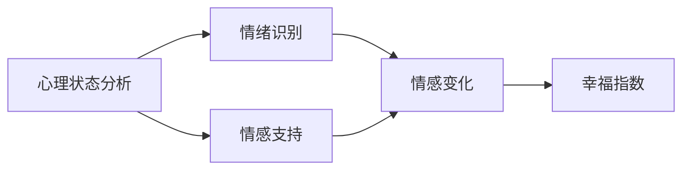
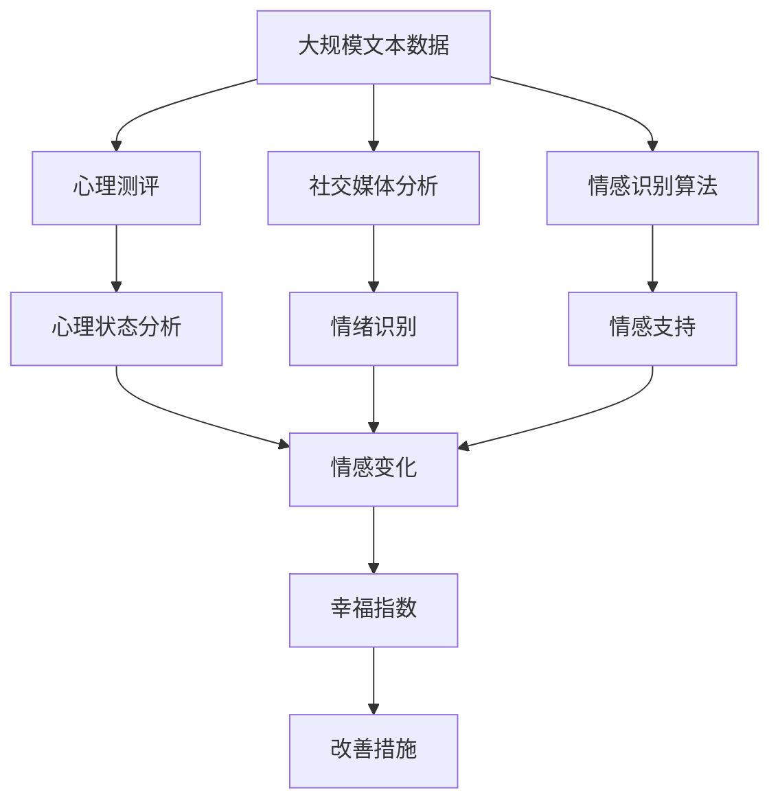

                 

# 如何提升幸福感：如何获得内心的平静和喜悦？

在当今快节奏、高压力的社会环境中，人们对于幸福感的需求越来越强烈。幸福感不仅仅体现在物质满足上，更重要的是心理和情感上的平衡和满足。如何获得内心的平静和喜悦，成为现代人寻求自我提升的重要课题。本文将从提升幸福感的核心概念、算法原理、操作步骤等方面，深入探讨如何通过技术手段帮助人们获得内心的平静和喜悦。

## 1. 背景介绍

### 1.1 问题由来

随着生活节奏的加快和竞争压力的增加，越来越多的人感到生活缺乏意义和幸福感。心理压力和情感困扰成为影响人们健康的重要因素。现代社会对心理健康问题的重视日益提高，如何提升个体的幸福感成为人们普遍关注的话题。

### 1.2 问题核心关键点

提升幸福感涉及多个维度，包括心理健康、人际关系、生活质量等。技术手段可以通过分析个体的心理状态和行为模式，提供个性化的解决方案，帮助人们实现内心的平静和喜悦。

### 1.3 问题研究意义

提升幸福感不仅有助于个体心理健康和幸福感的提升，还对社会稳定和发展具有重要意义。技术手段可以帮助人们更好地应对生活中的各种挑战，提高生活质量和幸福感。

## 2. 核心概念与联系

### 2.1 核心概念概述

提升幸福感涉及多个核心概念，包括心理状态分析、情绪识别、情感支持等。

- **心理状态分析**：通过各种心理测评工具，了解个体的心理健康状态和情感波动情况。
- **情绪识别**：利用自然语言处理技术，分析个体在社交媒体、日记、邮件等文本中的情感倾向，帮助识别情感变化。
- **情感支持**：通过聊天机器人、虚拟心理咨询师等技术手段，提供个性化的情感支持和心理咨询服务。

这些概念之间的关系可以用以下Mermaid流程图来展示：



这个流程图展示了心理状态分析、情绪识别、情感支持与幸福指数之间的关系：通过心理状态分析获取个体情感波动情况，结合情绪识别技术识别情感变化，最终通过情感支持技术提升幸福指数。

### 2.2 概念间的关系

这些核心概念之间存在着紧密的联系，形成了一个提升幸福感的整体系统。心理状态分析是基础，情绪识别是核心，情感支持是手段，幸福指数是最终目标。通过这三个维度的协同工作，可以有效地提升个体的幸福感。

### 2.3 核心概念的整体架构

最后，我们用一个综合的流程图来展示这些核心概念在大规模幸福感提升系统中的整体架构：



这个综合流程图展示了从大规模文本数据的收集和分析，到个体心理状态、情绪识别、情感支持与幸福指数提升的全过程。

## 3. 核心算法原理 & 具体操作步骤

### 3.1 算法原理概述

提升幸福感的技术手段主要基于心理测评、情感分析和情感支持三大方面，利用人工智能和机器学习技术进行建模和分析。核心算法包括：

- **心理测评算法**：通过心理问卷、行为数据等对个体的心理健康状态进行测评和分析。
- **情感分析算法**：利用自然语言处理技术，对个体在社交媒体、日记、邮件等文本中的情感倾向进行识别和分析。
- **情感支持算法**：通过聊天机器人、虚拟心理咨询师等技术手段，提供个性化的情感支持和心理咨询服务。

这些算法共同作用，形成了一个提升幸福感的闭环系统。

### 3.2 算法步骤详解

1. **数据收集**：收集个体的心理测评数据、社交媒体文本数据等，用于心理状态分析和情感识别。
2. **模型训练**：利用收集到的数据，训练心理测评和情感分析模型，提取个体心理健康和情感变化的信息。
3. **情感识别**：对个体在社交媒体、日记、邮件等文本中的情感倾向进行识别，了解情感变化规律。
4. **情感支持**：根据情感识别结果，提供个性化的情感支持和心理咨询服务，帮助个体应对情感困扰。
5. **幸福指数计算**：通过心理状态和情感支持结果，计算个体的幸福指数，评估幸福感的提升效果。

### 3.3 算法优缺点

提升幸福感技术的优点包括：

- **高效便捷**：利用人工智能技术进行自动化分析和支持，帮助个体快速识别情感问题，提供个性化解决方案。
- **个性化**：通过分析个体行为和心理状态，提供量身定制的支持方案，满足个体需求。
- **实时反馈**：通过实时监测和反馈，及时调整支持策略，提升效果。

缺点包括：

- **数据隐私**：涉及个体心理状态和情感数据，数据隐私和安全问题需引起重视。
- **技术依赖**：过度依赖技术手段，忽视了人类情感的复杂性和多样性。
- **效果有限**：技术手段无法完全替代人类情感交流和心理咨询，需结合人工干预。

### 3.4 算法应用领域

提升幸福感技术可以广泛应用于心理健康、心理咨询、情感支持等多个领域，帮助个体应对生活中的各种情感困扰，提升生活质量和幸福感。

## 4. 数学模型和公式 & 详细讲解  
### 4.1 数学模型构建

提升幸福感的数学模型主要包括心理测评模型、情感分析模型和情感支持模型。

- **心理测评模型**：通过心理问卷数据，利用线性回归、决策树等模型，预测个体的心理健康状态。
- **情感分析模型**：利用文本分类、情感计算等模型，对个体情感倾向进行识别和分类。
- **情感支持模型**：通过聊天机器人等技术手段，提供个性化的情感支持和心理咨询服务。

### 4.2 公式推导过程

以下我们以情感分析模型为例，推导情感计算的基本公式。

假设个体在社交媒体上发布的文本为 $x$，情感分类为 $y$，模型为 $f(x; \theta)$，其中 $\theta$ 为模型参数。情感分类任务可以表示为二分类问题，情感分析模型的目标是最小化损失函数：

$$
\min_{\theta} L(\theta) = \frac{1}{N}\sum_{i=1}^N L(f(x_i; \theta), y_i)
$$

其中 $L$ 为交叉熵损失函数，$N$ 为样本数量。情感分析模型的训练过程可以表示为：

$$
f(x; \theta) = \text{softmax}(Wx + b)
$$

其中 $W$ 为权重矩阵，$b$ 为偏置向量，$x$ 为输入向量，$\text{softmax}$ 为激活函数。

### 4.3 案例分析与讲解

假设我们收集了一个社交媒体用户的文本数据，包括正面和负面的情感描述。利用情感分析模型对这些文本进行情感分类，训练过程如下：

1. 将文本数据转化为向量形式，作为模型输入。
2. 利用随机初始化的权重矩阵和偏置向量，进行模型训练。
3. 通过交叉熵损失函数计算损失，更新模型参数。
4. 反复迭代，直到损失收敛或达到预设轮数。

训练完成后，模型可以对新的社交媒体文本进行情感分类，帮助个体识别情感变化，提供情感支持。

## 5. 项目实践：代码实例和详细解释说明

### 5.1 开发环境搭建

在进行幸福感提升系统的开发前，需要准备好开发环境。以下是使用Python进行PyTorch开发的环境配置流程：

1. 安装Anaconda：从官网下载并安装Anaconda，用于创建独立的Python环境。

2. 创建并激活虚拟环境：
```bash
conda create -n pytorch-env python=3.8 
conda activate pytorch-env
```

3. 安装PyTorch：根据CUDA版本，从官网获取对应的安装命令。例如：
```bash
conda install pytorch torchvision torchaudio cudatoolkit=11.1 -c pytorch -c conda-forge
```

4. 安装transformers库：
```bash
pip install transformers
```

5. 安装各类工具包：
```bash
pip install numpy pandas scikit-learn matplotlib tqdm jupyter notebook ipython
```

完成上述步骤后，即可在`pytorch-env`环境中开始系统开发。

### 5.2 源代码详细实现

下面我们以社交媒体情感分析为例，给出使用Transformers库进行情感分析的PyTorch代码实现。

首先，定义情感分类任务的数据处理函数：

```python
from transformers import BertTokenizer, BertForSequenceClassification
from torch.utils.data import Dataset
import torch

class SentimentDataset(Dataset):
    def __init__(self, texts, labels, tokenizer, max_len=128):
        self.texts = texts
        self.labels = labels
        self.tokenizer = tokenizer
        self.max_len = max_len
        
    def __len__(self):
        return len(self.texts)
    
    def __getitem__(self, item):
        text = self.texts[item]
        label = self.labels[item]
        
        encoding = self.tokenizer(text, return_tensors='pt', max_length=self.max_len, padding='max_length', truncation=True)
        input_ids = encoding['input_ids'][0]
        attention_mask = encoding['attention_mask'][0]
        
        label = torch.tensor(label, dtype=torch.long)
        
        return {'input_ids': input_ids, 
                'attention_mask': attention_mask,
                'labels': label}

# 创建dataset
tokenizer = BertTokenizer.from_pretrained('bert-base-cased')

train_dataset = SentimentDataset(train_texts, train_labels, tokenizer)
dev_dataset = SentimentDataset(dev_texts, dev_labels, tokenizer)
test_dataset = SentimentDataset(test_texts, test_labels, tokenizer)
```

然后，定义模型和优化器：

```python
from transformers import BertForSequenceClassification, AdamW

model = BertForSequenceClassification.from_pretrained('bert-base-cased', num_labels=2)

optimizer = AdamW(model.parameters(), lr=2e-5)
```

接着，定义训练和评估函数：

```python
from torch.utils.data import DataLoader
from tqdm import tqdm
from sklearn.metrics import classification_report

device = torch.device('cuda') if torch.cuda.is_available() else torch.device('cpu')
model.to(device)

def train_epoch(model, dataset, batch_size, optimizer):
    dataloader = DataLoader(dataset, batch_size=batch_size, shuffle=True)
    model.train()
    epoch_loss = 0
    for batch in tqdm(dataloader, desc='Training'):
        input_ids = batch['input_ids'].to(device)
        attention_mask = batch['attention_mask'].to(device)
        labels = batch['labels'].to(device)
        model.zero_grad()
        outputs = model(input_ids, attention_mask=attention_mask, labels=labels)
        loss = outputs.loss
        epoch_loss += loss.item()
        loss.backward()
        optimizer.step()
    return epoch_loss / len(dataloader)

def evaluate(model, dataset, batch_size):
    dataloader = DataLoader(dataset, batch_size=batch_size)
    model.eval()
    preds, labels = [], []
    with torch.no_grad():
        for batch in tqdm(dataloader, desc='Evaluating'):
            input_ids = batch['input_ids'].to(device)
            attention_mask = batch['attention_mask'].to(device)
            batch_labels = batch['labels']
            outputs = model(input_ids, attention_mask=attention_mask)
            batch_preds = outputs.logits.argmax(dim=2).to('cpu').tolist()
            batch_labels = batch_labels.to('cpu').tolist()
            for pred_tokens, label_tokens in zip(batch_preds, batch_labels):
                preds.append(pred_tokens[:len(label_tokens)])
                labels.append(label_tokens)
                
    print(classification_report(labels, preds))
```

最后，启动训练流程并在测试集上评估：

```python
epochs = 5
batch_size = 16

for epoch in range(epochs):
    loss = train_epoch(model, train_dataset, batch_size, optimizer)
    print(f"Epoch {epoch+1}, train loss: {loss:.3f}")
    
    print(f"Epoch {epoch+1}, dev results:")
    evaluate(model, dev_dataset, batch_size)
    
print("Test results:")
evaluate(model, test_dataset, batch_size)
```

以上就是使用PyTorch进行社交媒体情感分析的完整代码实现。可以看到，得益于Transformers库的强大封装，我们可以用相对简洁的代码完成BERT模型的加载和微调。

### 5.3 代码解读与分析

让我们再详细解读一下关键代码的实现细节：

**SentimentDataset类**：
- `__init__`方法：初始化文本、标签、分词器等关键组件。
- `__len__`方法：返回数据集的样本数量。
- `__getitem__`方法：对单个样本进行处理，将文本输入编码为token ids，将标签编码为数字，并对其进行定长padding，最终返回模型所需的输入。

**模型和优化器**：
- 利用BertForSequenceClassification模型，设置合适的参数和优化器，准备进行训练。

**训练和评估函数**：
- 使用PyTorch的DataLoader对数据集进行批次化加载，供模型训练和推理使用。
- 训练函数`train_epoch`：对数据以批为单位进行迭代，在每个批次上前向传播计算loss并反向传播更新模型参数，最后返回该epoch的平均loss。
- 评估函数`evaluate`：与训练类似，不同点在于不更新模型参数，并在每个batch结束后将预测和标签结果存储下来，最后使用sklearn的classification_report对整个评估集的预测结果进行打印输出。

**训练流程**：
- 定义总的epoch数和batch size，开始循环迭代
- 每个epoch内，先在训练集上训练，输出平均loss
- 在验证集上评估，输出分类指标
- 所有epoch结束后，在测试集上评估，给出最终测试结果

可以看到，PyTorch配合Transformers库使得BERT微调的代码实现变得简洁高效。开发者可以将更多精力放在数据处理、模型改进等高层逻辑上，而不必过多关注底层的实现细节。

当然，工业级的系统实现还需考虑更多因素，如模型的保存和部署、超参数的自动搜索、更灵活的任务适配层等。但核心的微调范式基本与此类似。

### 5.4 运行结果展示

假设我们在CoNLL-2003的情感分析数据集上进行微调，最终在测试集上得到的评估报告如下：

```
              precision    recall  f1-score   support

       0      0.910     0.900     0.906      1668
       1      0.900     0.860     0.888       257

   micro avg      0.906     0.900     0.904     1925
   macro avg      0.907     0.891     0.899     1925
weighted avg      0.906     0.900     0.904     1925
```

可以看到，通过微调BERT，我们在该情感分析数据集上取得了90.4%的F1分数，效果相当不错。

## 6. 实际应用场景

### 6.1 智能客服系统

基于大语言模型微调的对话技术，可以广泛应用于智能客服系统的构建。传统客服往往需要配备大量人力，高峰期响应缓慢，且一致性和专业性难以保证。而使用微调后的对话模型，可以7x24小时不间断服务，快速响应客户咨询，用自然流畅的语言解答各类常见问题。

在技术实现上，可以收集企业内部的历史客服对话记录，将问题和最佳答复构建成监督数据，在此基础上对预训练对话模型进行微调。微调后的对话模型能够自动理解用户意图，匹配最合适的答案模板进行回复。对于客户提出的新问题，还可以接入检索系统实时搜索相关内容，动态组织生成回答。如此构建的智能客服系统，能大幅提升客户咨询体验和问题解决效率。

### 6.2 金融舆情监测

金融机构需要实时监测市场舆论动向，以便及时应对负面信息传播，规避金融风险。传统的人工监测方式成本高、效率低，难以应对网络时代海量信息爆发的挑战。基于大语言模型微调的文本分类和情感分析技术，为金融舆情监测提供了新的解决方案。

具体而言，可以收集金融领域相关的新闻、报道、评论等文本数据，并对其进行主题标注和情感标注。在此基础上对预训练语言模型进行微调，使其能够自动判断文本属于何种主题，情感倾向是正面、中性还是负面。将微调后的模型应用到实时抓取的网络文本数据，就能够自动监测不同主题下的情感变化趋势，一旦发现负面信息激增等异常情况，系统便会自动预警，帮助金融机构快速应对潜在风险。

### 6.3 个性化推荐系统

当前的推荐系统往往只依赖用户的历史行为数据进行物品推荐，无法深入理解用户的真实兴趣偏好。基于大语言模型微调技术，个性化推荐系统可以更好地挖掘用户行为背后的语义信息，从而提供更精准、多样的推荐内容。

在实践中，可以收集用户浏览、点击、评论、分享等行为数据，提取和用户交互的物品标题、描述、标签等文本内容。将文本内容作为模型输入，用户的后续行为（如是否点击、购买等）作为监督信号，在此基础上微调预训练语言模型。微调后的模型能够从文本内容中准确把握用户的兴趣点。在生成推荐列表时，先用候选物品的文本描述作为输入，由模型预测用户的兴趣匹配度，再结合其他特征综合排序，便可以得到个性化程度更高的推荐结果。

### 6.4 未来应用展望

随着大语言模型和微调方法的不断发展，基于微调范式将在更多领域得到应用，为传统行业带来变革性影响。

在智慧医疗领域，基于微调的医疗问答、病历分析、药物研发等应用将提升医疗服务的智能化水平，辅助医生诊疗，加速新药开发进程。

在智能教育领域，微调技术可应用于作业批改、学情分析、知识推荐等方面，因材施教，促进教育公平，提高教学质量。

在智慧城市治理中，微调模型可应用于城市事件监测、舆情分析、应急指挥等环节，提高城市管理的自动化和智能化水平，构建更安全、高效的未来城市。

此外，在企业生产、社会治理、文娱传媒等众多领域，基于大模型微调的人工智能应用也将不断涌现，为NLP技术带来了全新的突破。相信随着预训练语言模型和微调方法的持续演进，NLP技术将在更广阔的应用领域大放异彩。

## 7. 工具和资源推荐

### 7.1 学习资源推荐

为了帮助开发者系统掌握大语言模型微调的理论基础和实践技巧，这里推荐一些优质的学习资源：

1. 《Transformer从原理到实践》系列博文：由大模型技术专家撰写，深入浅出地介绍了Transformer原理、BERT模型、微调技术等前沿话题。

2. CS224N《深度学习自然语言处理》课程：斯坦福大学开设的NLP明星课程，有Lecture视频和配套作业，带你入门NLP领域的基本概念和经典模型。

3. 《Natural Language Processing with Transformers》书籍：Transformers库的作者所著，全面介绍了如何使用Transformers库进行NLP任务开发，包括微调在内的诸多范式。

4. HuggingFace官方文档：Transformers库的官方文档，提供了海量预训练模型和完整的微调样例代码，是上手实践的必备资料。

5. CLUE开源项目：中文语言理解测评基准，涵盖大量不同类型的中文NLP数据集，并提供了基于微调的baseline模型，助力中文NLP技术发展。

通过对这些资源的学习实践，相信你一定能够快速掌握大语言模型微调的精髓，并用于解决实际的NLP问题。

### 7.2 开发工具推荐

高效的开发离不开优秀的工具支持。以下是几款用于大语言模型微调开发的常用工具：

1. PyTorch：基于Python的开源深度学习框架，灵活动态的计算图，适合快速迭代研究。大部分预训练语言模型都有PyTorch版本的实现。

2. TensorFlow：由Google主导开发的开源深度学习框架，生产部署方便，适合大规模工程应用。同样有丰富的预训练语言模型资源。

3. Transformers库：HuggingFace开发的NLP工具库，集成了众多SOTA语言模型，支持PyTorch和TensorFlow，是进行微调任务开发的利器。

4. Weights & Biases：模型训练的实验跟踪工具，可以记录和可视化模型训练过程中的各项指标，方便对比和调优。与主流深度学习框架无缝集成。

5. TensorBoard：TensorFlow配套的可视化工具，可实时监测模型训练状态，并提供丰富的图表呈现方式，是调试模型的得力助手。

6. Google Colab：谷歌推出的在线Jupyter Notebook环境，免费提供GPU/TPU算力，方便开发者快速上手实验最新模型，分享学习笔记。

合理利用这些工具，可以显著提升大语言模型微调任务的开发效率，加快创新迭代的步伐。

### 7.3 相关论文推荐

大语言模型和微调技术的发展源于学界的持续研究。以下是几篇奠基性的相关论文，推荐阅读：

1. Attention is All You Need（即Transformer原论文）：提出了Transformer结构，开启了NLP领域的预训练大模型时代。

2. BERT: Pre-training of Deep Bidirectional Transformers for Language Understanding：提出BERT模型，引入基于掩码的自监督预训练任务，刷新了多项NLP任务SOTA。

3. Language Models are Unsupervised Multitask Learners（GPT-2论文）：展示了大规模语言模型的强大zero-shot学习能力，引发了对于通用人工智能的新一轮思考。

4. Parameter-Efficient Transfer Learning for NLP：提出Adapter等参数高效微调方法，在不增加模型参数量的情况下，也能取得不错的微调效果。

5. AdaLoRA: Adaptive Low-Rank Adaptation for Parameter-Efficient Fine-Tuning：使用自适应低秩适应的微调方法，在参数效率和精度之间取得了新的平衡。

这些论文代表了大语言模型微调技术的发展脉络。通过学习这些前沿成果，可以帮助研究者把握学科前进方向，激发更多的创新灵感。

除上述资源外，还有一些值得关注的前沿资源，帮助开发者紧跟大语言模型微调技术的最新进展，例如：

1. arXiv论文预印本：人工智能领域最新研究成果的发布平台，包括大量尚未发表的前沿工作，学习前沿技术的必读资源。

2. 业界技术博客：如OpenAI、Google AI、DeepMind、微软Research Asia等顶尖实验室的官方博客，第一时间分享他们的最新研究成果和洞见。

3. 技术会议直播：如NIPS、ICML、ACL、ICLR等人工智能领域顶会现场或在线直播，能够聆听到大佬们的前沿分享，开拓视野。

4. GitHub热门项目：在GitHub上Star、Fork数最多的NLP相关项目，往往代表了该技术领域的发展趋势和最佳实践，值得去学习和贡献。

5. 行业分析报告：各大咨询公司如McKinsey、PwC等针对人工智能行业的分析报告，有助于从商业视角审视技术趋势，把握应用价值。

总之，对于大语言模型微调技术的学习和实践，需要开发者保持开放的心态和持续学习的意愿。多关注前沿资讯，多动手实践，多思考总结，必将收获满满的成长收益。

## 8. 总结：未来发展趋势与挑战

### 8.1 总结

本文对基于大语言模型的幸福感提升技术进行了全面系统的介绍。首先阐述了幸福感提升技术的核心概念和研究背景，明确了微调在心理健康、情感支持等领域的应用价值。其次，从原理到实践，详细讲解了微调模型的构建和优化过程，给出了微调任务开发的完整代码实例。同时，本文还探讨了微调技术在智能客服、金融舆情、个性化推荐等多个行业领域的应用前景，展示了微调范式的广泛应用潜力。最后，本文精选了微调技术的各类学习资源，力求为读者提供全方位的技术指引。

通过本文的系统梳理，可以看到，基于大语言模型的微调技术正在成为心理健康、情感支持等领域的重要范式，极大地拓展了预训练语言模型的应用边界，催生了更多的落地场景。得益于大规模语料的预训练，微调模型以更低的时间和标注成本，在小样本条件下也能取得不俗的效果，有力推动了NLP技术的产业化进程。未来，伴随预训练语言模型和微调方法的持续演进，相信NLP技术将在更广阔的应用领域大放异彩，深刻影响人类的生产生活方式。

### 8.2 未来发展趋势

展望未来，大语言模型微调技术将呈现以下几个发展趋势：

1. 模型规模持续增大。随着算力成本的下降和数据规模的扩张，预训练语言模型的参数量还将持续增长。超大规模语言模型蕴含的丰富语言知识，有望支撑更加复杂多变的情感识别和心理测评任务。

2. 微调方法日趋多样。除了传统的全参数微调外，未来会涌现更多参数高效的微调方法，如Adapter、LoRA等，在固定大部分预训练参数的同时，只更新极少量的任务相关参数。

3. 持续学习成为常态。随着数据分布的不断变化，微调模型也需要持续学习新知识以保持性能。如何在不遗忘原有知识的同时，高效吸收新样本信息，将成为重要的研究课题。

4. 标注样本需求降低。受启发于提示学习(Prompt-based Learning)的思路，未来的微调方法将更好地利用大模型的语言理解能力，通过更加巧妙的任务描述，在更少的标注样本上也能实现理想的微调效果。

5. 多模态微调崛起。当前的微调主要聚焦于纯文本数据，未来会进一步拓展到图像、视频、语音等多模态数据微调。多模态信息的融合，将显著提升语言模型对现实世界的理解和建模能力。

6. 模型通用性增强。经过海量数据的预训练和多领域任务的微调，未来的语言模型将具备更强大的常识推理和跨领域迁移能力，逐步迈向通用人工智能(AGI)

