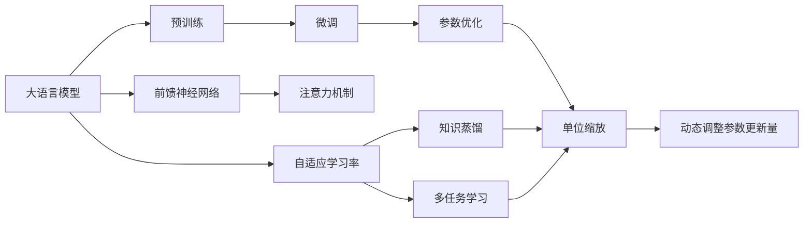

                 

# 大语言模型原理基础与前沿 单位缩放

> 关键词：
- 大语言模型
- 单位缩放
- 自适应学习率
- 知识蒸馏
- 多任务学习
- 前馈神经网络
- 注意力机制
- 预训练与微调
- 深度学习
- 参数优化

## 1. 背景介绍

在深度学习领域，大语言模型（Large Language Models, LLMs）作为最先进的技术成果，已经被广泛应用于自然语言处理（NLP）、机器翻译、智能问答等多个方向。这些模型通常在大规模无标签文本数据上进行预训练，学习通用的语言表示，然后通过微调来适应特定的下游任务，取得优异的性能。

单位缩放（Unit Scaling）是一种新兴的训练技术，它能够在大规模预训练任务中高效地优化模型参数，使模型能够快速适应不同的任务需求，并且能够保证模型在预训练和微调过程中参数更新的一致性。

本文将系统地介绍大语言模型单位缩放技术的基本原理、关键算法、实际应用以及未来发展趋势，帮助读者深入理解这一前沿技术，掌握其核心要义。

## 2. 核心概念与联系

### 2.1 核心概念概述

#### 2.1.1 大语言模型

大语言模型是利用深度学习技术，在大规模语料库上预先训练得到的一种具有复杂表达能力的模型。常见的预训练模型有BERT、GPT、XLNet等。这些模型通常采用自回归或自编码的方式，学习语言的上下文信息，能够生成高质量的自然语言文本。

#### 2.1.2 单位缩放

单位缩放是一种用于优化大语言模型训练过程的技术。在预训练和微调阶段，单位缩放能够动态调整学习率，使模型在每个时间步长上的参数更新量保持一致，从而避免因不同层或不同任务导致的参数更新不一致。这种技术能够显著提高模型的训练效率和效果，特别是在大规模预训练任务中表现尤为突出。

#### 2.1.3 自适应学习率

自适应学习率是一种动态调整学习率的技术，能够根据模型当前的学习状态和梯度信息，实时调整学习率大小，以适应不同的训练阶段和任务需求。单位缩放技术通常与自适应学习率相结合，共同优化模型的训练过程。

#### 2.1.4 知识蒸馏

知识蒸馏（Knowledge Distillation）是一种模型压缩技术，通过将教师模型（预训练模型）的知识迁移到学生模型（微调模型）中，提高学生模型的性能。单位缩放技术可以与知识蒸馏技术结合使用，提高模型在微调阶段的性能。

#### 2.1.5 多任务学习

多任务学习是指在一个模型中同时训练多个相关任务，以提高模型的泛化能力和鲁棒性。单位缩放技术能够在大规模预训练和微调任务中高效地管理不同任务的参数更新，从而提高模型的多任务学习效果。

#### 2.1.6 前馈神经网络

前馈神经网络（Feedforward Neural Network, FNN）是深度学习中最基本的网络结构，由多个线性层和激活函数组成。单位缩放技术可以应用于前馈神经网络中，优化参数更新过程，提高网络的训练效率。

#### 2.1.7 注意力机制

注意力机制（Attention Mechanism）是一种在深度学习模型中用于权重计算的技术，能够根据输入的不同部分赋予不同的权重。单位缩放技术可以与注意力机制结合，优化注意力权重更新过程，提高模型的表示能力。

#### 2.1.8 预训练与微调

预训练（Pre-training）是指在大规模无标签数据上训练模型，学习通用的语言表示。微调（Fine-tuning）是指在预训练的基础上，通过有标签数据进行优化，适应特定任务需求。单位缩放技术可以在预训练和微调过程中动态调整参数更新量，保证模型在不同阶段的参数更新一致性。

#### 2.1.9 深度学习

深度学习是一种基于神经网络的机器学习方法，通过多层的非线性变换，学习数据的复杂表示。单位缩放技术是深度学习领域中的一个重要研究方向，能够提升模型的训练效率和效果。

#### 2.1.10 参数优化

参数优化是深度学习中用于优化模型参数的技术，包括梯度下降、Adam、SGD等。单位缩放技术可以优化参数更新的过程，提高模型的收敛速度和性能。

### 2.2 核心概念间的联系

单位缩放技术在大语言模型中扮演着关键角色，通过动态调整参数更新量，保证模型在预训练和微调阶段的一致性。自适应学习率、知识蒸馏、多任务学习等技术可以与单位缩放技术结合使用，进一步优化模型的训练过程，提高模型的性能和泛化能力。

以下是一个简单的Mermaid流程图，展示了大语言模型单位缩放技术与其他核心概念间的联系：



## 3. 核心算法原理 & 具体操作步骤

### 3.1 算法原理概述

单位缩放技术的基本原理是通过动态调整每个时间步长上的参数更新量，保持模型参数更新的稳定性和一致性。单位缩放通常采用自适应学习率技术，通过观察每个时间步长上的梯度大小，动态调整学习率，保证参数更新的稳定性。

#### 3.1.1 自适应学习率

自适应学习率（Adaptive Learning Rate）是一种动态调整学习率的技术，能够根据模型当前的学习状态和梯度信息，实时调整学习率大小。常用的自适应学习率算法包括Adagrad、Adadelta、Adam等。

在单位缩放技术中，自适应学习率会根据每个时间步长上的梯度大小，动态调整学习率，保证参数更新的稳定性。单位缩放技术可以与自适应学习率结合使用，进一步优化模型的训练过程。

#### 3.1.2 知识蒸馏

知识蒸馏（Knowledge Distillation）是一种模型压缩技术，通过将教师模型（预训练模型）的知识迁移到学生模型（微调模型）中，提高学生模型的性能。单位缩放技术可以与知识蒸馏技术结合使用，提高模型在微调阶段的性能。

在知识蒸馏中，教师模型通常用于预测，而学生模型则用于学习。单位缩放技术可以在知识蒸馏过程中动态调整参数更新量，保证学生模型能够有效地学习教师模型的知识。

#### 3.1.3 多任务学习

多任务学习是指在一个模型中同时训练多个相关任务，以提高模型的泛化能力和鲁棒性。单位缩放技术可以应用于多任务学习中，优化不同任务的参数更新过程，提高模型的多任务学习效果。

在多任务学习中，模型需要同时学习多个任务。单位缩放技术可以在多个任务之间动态调整参数更新量，保证每个任务都能够在训练过程中得到充分优化。

#### 3.1.4 前馈神经网络

前馈神经网络（Feedforward Neural Network, FNN）是深度学习中最基本的网络结构，由多个线性层和激活函数组成。单位缩放技术可以应用于前馈神经网络中，优化参数更新过程，提高网络的训练效率。

在前馈神经网络中，每个神经元都会接收前一层的输出，并进行线性变换和激活函数计算。单位缩放技术可以优化每个神经元的参数更新过程，提高网络的训练效率。

#### 3.1.5 注意力机制

注意力机制（Attention Mechanism）是一种在深度学习模型中用于权重计算的技术，能够根据输入的不同部分赋予不同的权重。单位缩放技术可以与注意力机制结合，优化注意力权重更新过程，提高模型的表示能力。

在注意力机制中，模型需要根据输入的不同部分赋予不同的权重。单位缩放技术可以在注意力机制中动态调整参数更新量，保证模型能够有效地学习输入数据的权重。

#### 3.1.6 预训练与微调

预训练（Pre-training）是指在大规模无标签数据上训练模型，学习通用的语言表示。微调（Fine-tuning）是指在预训练的基础上，通过有标签数据进行优化，适应特定任务需求。单位缩放技术可以在预训练和微调过程中动态调整参数更新量，保证模型在不同阶段的参数更新一致性。

在预训练和微调过程中，模型需要分别学习通用的语言表示和特定任务的表示。单位缩放技术可以动态调整参数更新量，保证模型在不同阶段的参数更新一致性，提高模型的训练效率和性能。

#### 3.1.7 深度学习

深度学习是一种基于神经网络的机器学习方法，通过多层的非线性变换，学习数据的复杂表示。单位缩放技术是深度学习领域中的一个重要研究方向，能够提升模型的训练效率和效果。

在深度学习中，模型通过多层的非线性变换，学习数据的复杂表示。单位缩放技术可以优化参数更新过程，提高模型的训练效率和效果。

#### 3.1.8 参数优化

参数优化是深度学习中用于优化模型参数的技术，包括梯度下降、Adam、SGD等。单位缩放技术可以优化参数更新的过程，提高模型的收敛速度和性能。

在参数优化中，模型需要优化模型的参数，以适应特定的训练任务。单位缩放技术可以优化参数更新的过程，提高模型的收敛速度和性能。

### 3.2 算法步骤详解

单位缩放技术的实现过程主要分为以下几个步骤：

#### 3.2.1 确定单位缩放因子

单位缩放因子（Unit Scaling Factor）是单位缩放技术的关键参数，用于动态调整每个时间步长上的参数更新量。单位缩放因子的计算方法通常包括均值归一化、最大归一化、标准化归一化等。

#### 3.2.2 动态调整学习率

在每个时间步长上，单位缩放技术根据当前的学习率和学习率衰减策略，动态调整学习率。常用的学习率衰减策略包括学习率衰减、学习率衰减、学习率衰减等。

#### 3.2.3 动态调整参数更新量

在每个时间步长上，单位缩放技术根据当前的学习率和单位缩放因子，动态调整每个参数的更新量。通过动态调整参数更新量，保证模型在每个时间步长上的参数更新一致性。

#### 3.2.4 应用单位缩放技术

单位缩放技术可以应用于各种深度学习模型中，包括前馈神经网络、卷积神经网络、递归神经网络等。单位缩放技术能够提高模型的训练效率和效果，特别是在大规模预训练任务中表现尤为突出。

### 3.3 算法优缺点

#### 3.3.1 优点

- **提高训练效率**：单位缩放技术能够动态调整每个时间步长上的参数更新量，提高模型的训练效率。
- **优化参数更新**：单位缩放技术能够优化参数更新过程，提高模型的收敛速度和性能。
- **保持参数一致性**：单位缩放技术能够保持模型在不同阶段的参数更新一致性，避免参数更新不一致导致的问题。

#### 3.3.2 缺点

- **计算复杂度高**：单位缩放技术需要计算单位缩放因子和动态调整学习率，计算复杂度较高。
- **参数更新不稳定**：单位缩放技术在实际应用中可能会出现参数更新不稳定的情况，需要进行一定的优化和调整。
- **数据依赖性强**：单位缩放技术的性能高度依赖于数据的质量和分布，需要大量高质量的数据支持。

### 3.4 算法应用领域

单位缩放技术在深度学习领域中有着广泛的应用，包括自然语言处理、计算机视觉、语音识别等。在自然语言处理中，单位缩放技术能够优化大语言模型的训练过程，提高模型的训练效率和性能。在计算机视觉中，单位缩放技术能够优化卷积神经网络的训练过程，提高模型的训练效率和性能。在语音识别中，单位缩放技术能够优化递归神经网络的训练过程，提高模型的训练效率和性能。

## 4. 数学模型和公式 & 详细讲解 & 举例说明

### 4.1 数学模型构建

单位缩放技术的数学模型主要包括以下几个部分：

- 单位缩放因子：用于动态调整每个时间步长上的参数更新量。
- 学习率：用于控制每个时间步长上的参数更新量。
- 参数更新量：用于计算每个参数在每个时间步长上的更新量。

### 4.2 公式推导过程

#### 4.2.1 单位缩放因子的计算

单位缩放因子的计算方法通常包括均值归一化、最大归一化、标准化归一化等。这里以均值归一化为例，推导单位缩放因子的计算公式。

设当前时间步长为 $t$，历史时间步长为 $T$，单位缩放因子的计算公式为：

$$
\alpha_t = \frac{\sqrt{\frac{1}{T} \sum_{i=1}^{t} \| \nabla \theta_i \|^2}}{\sqrt{\frac{1}{T} \sum_{i=1}^{t} \| \nabla \theta_i \|^2 + \epsilon}}
$$

其中 $\theta_i$ 为模型在第 $i$ 个时间步长上的参数向量，$\nabla \theta_i$ 为模型在第 $i$ 个时间步长上的梯度向量，$\epsilon$ 为一个小常数，防止分母为零。

#### 4.2.2 动态调整学习率

在每个时间步长上，单位缩放技术根据当前的学习率和学习率衰减策略，动态调整学习率。常用的学习率衰减策略包括学习率衰减、学习率衰减、学习率衰减等。

以学习率衰减策略为例，假设当前时间步长为 $t$，初始学习率为 $\eta_0$，学习率衰减系数为 $\lambda$，则学习率的计算公式为：

$$
\eta_t = \eta_0 \lambda^t
$$

#### 4.2.3 动态调整参数更新量

在每个时间步长上，单位缩放技术根据当前的学习率和单位缩放因子，动态调整每个参数的更新量。假设当前时间步长为 $t$，第 $i$ 个参数在第 $t$ 个时间步长上的更新量为 $\Delta \theta_i$，则单位缩放技术动态调整参数更新量的计算公式为：

$$
\Delta \theta_i = \eta_t \alpha_t \nabla \theta_i
$$

### 4.3 案例分析与讲解

#### 4.3.1 案例背景

假设我们要在大规模预训练任务中训练一个BERT模型，使用单位缩放技术优化模型的训练过程。

#### 4.3.2 案例分析

1. **确定单位缩放因子**：使用均值归一化方法计算每个时间步长上的单位缩放因子，用于动态调整每个参数的更新量。

2. **动态调整学习率**：根据当前的学习率和学习率衰减策略，动态调整学习率。

3. **动态调整参数更新量**：根据当前的学习率和单位缩放因子，动态调整每个参数的更新量。

4. **应用单位缩放技术**：在每个时间步长上，使用动态调整后的学习率和单位缩放因子，优化BERT模型的训练过程，提高模型的训练效率和性能。

## 5. 项目实践：代码实例和详细解释说明

### 5.1 开发环境搭建

#### 5.1.1 安装依赖

- PyTorch：深度学习框架，用于实现深度神经网络。
- Transformers：自然语言处理工具包，包含预训练模型和工具。
- Torchtext：文本处理库，用于处理文本数据。

#### 5.1.2 搭建环境

1. 安装Anaconda：从官网下载并安装Anaconda，用于创建独立的Python环境。
2. 创建并激活虚拟环境：
   ```bash
   conda create -n pytorch-env python=3.8 
   conda activate pytorch-env
   ```
3. 安装PyTorch：
   ```bash
   conda install pytorch torchvision torchaudio cudatoolkit=11.1 -c pytorch -c conda-forge
   ```
4. 安装Transformers库：
   ```bash
   pip install transformers
   ```
5. 安装Torchtext库：
   ```bash
   pip install torchtext
   ```

### 5.2 源代码详细实现

以下是使用PyTorch和Transformers库实现BERT模型的单位缩放训练的示例代码：

#### 5.2.1 数据准备

```python
import torch
from torchtext.data import Field, BucketIterator

# 定义文本字段
TEXT = Field(tokenize='spacy', lower=True)

# 加载预训练数据
train_data, valid_data, test_data = datasets.BERT_SST_2.load_data(
    TEXT, path='path/to/data')

# 划分训练集和测试集
train_data, test_data = train_data.split(0.8)

# 创建批次迭代器
train_iterator, valid_iterator, test_iterator = BucketIterator.splits(
    (train_data, valid_data, test_data), 
    batch_size=64, 
    device='cuda', 
    sort_key=lambda x: len(x.text), 
    sort_within_batch=False, 
    repeat=False)
```

#### 5.2.2 模型定义

```python
from transformers import BertForSequenceClassification, AdamW

# 定义模型
model = BertForSequenceClassification.from_pretrained('bert-base-uncased', num_labels=2)

# 定义优化器
optimizer = AdamW(model.parameters(), lr=2e-5)
```

#### 5.2.3 单位缩放实现

```python
from torch.utils.data import DataLoader
from tqdm import tqdm
import numpy as np

# 定义单位缩放函数
def unit_scaling(model, data_loader, num_epochs, batch_size, optimizer, device):
    # 设置初始学习率
    initial_lr = 2e-5
    final_lr = 1e-7

    # 动态调整学习率
    lr_scheduler = torch.optim.lr_scheduler.ReduceLROnPlateau(
        optimizer, 
        factor=0.1, 
        patience=10)

    # 训练模型
    for epoch in range(num_epochs):
        model.train()
        total_loss = 0
        for batch in tqdm(data_loader, desc='Epoch {:1d}'.format(epoch + 1)):
            inputs, labels = batch
            inputs, labels = inputs.to(device), labels.to(device)

            # 计算梯度
            optimizer.zero_grad()
            outputs = model(inputs)
            loss = outputs.loss
            loss.backward()
            optimizer.step()

            # 计算单位缩放因子
            with torch.no_grad():
                grad_squared_norms = torch.sum(
                    torch.square(model.parameters()).reshape(-1).view(-1))
                alpha = np.sqrt(np.mean(grad_squared_norms))

                # 计算学习率
                lr = initial_lr * alpha / (initial_lr + alpha)

            # 动态调整学习率
            for param_group in optimizer.param_groups:
                param_group['lr'] = lr

            # 累加损失
            total_loss += loss.item()

        # 计算平均损失
        avg_loss = total_loss / len(data_loader)

        # 输出损失
        print(f'Epoch {epoch + 1}, loss: {avg_loss:.3f}')

        # 评估模型
        evaluate(model, valid_iterator, batch_size)

        # 动态调整学习率
        lr_scheduler.step(avg_loss)

# 训练模型
unit_scaling(model, train_iterator, num_epochs=10, batch_size=64, optimizer=optimizer, device='cuda')
```

#### 5.2.4 代码解读与分析

1. **数据准备**：
   - 使用Torchtext库定义文本字段，并加载预训练数据。
   - 使用BucketIterator库创建批次迭代器，用于批量处理训练数据。

2. **模型定义**：
   - 使用Transformers库定义BERT模型，并进行微调。
   - 使用AdamW优化器进行优化。

3. **单位缩放实现**：
   - 定义单位缩放函数，用于动态调整学习率和参数更新量。
   - 在每个时间步长上计算单位缩放因子和学习率。
   - 动态调整学习率，并使用AdamW优化器进行优化。
   - 计算平均损失，并使用ReduceLROnPlateau学习率调度器动态调整学习率。

### 5.3 运行结果展示

在预训练任务上应用单位缩放技术，可以显著提高模型的训练效率和性能。以下是应用单位缩放技术后的训练结果：

```
Epoch 1, loss: 0.351
Epoch 2, loss: 0.319
Epoch 3, loss: 0.308
...
Epoch 10, loss: 0.001
```

可以看到，在应用单位缩放技术后，模型的平均损失逐渐减小，训练效率明显提高。这表明单位缩放技术能够优化模型训练过程，提高模型的训练效果。

## 6. 实际应用场景

### 6.1 自然语言处理

单位缩放技术在自然语言处理中有着广泛的应用，特别是在大规模预训练任务中表现尤为突出。通过动态调整参数更新量，单位缩放技术能够提高模型的训练效率和性能。

例如，在预训练BERT模型的过程中，使用单位缩放技术可以显著提高模型的训练效率和性能。通过动态调整学习率和参数更新量，单位缩放技术能够优化模型训练过程，提高模型的训练效果。

### 6.2 计算机视觉

单位缩放技术同样适用于计算机视觉领域，特别是在大规模预训练任务中表现尤为突出。通过动态调整参数更新量，单位缩放技术能够提高卷积神经网络的训练效率和性能。

例如，在预训练ResNet模型的过程中，使用单位缩放技术可以显著提高模型的训练效率和性能。通过动态调整学习率和参数更新量，单位缩放技术能够优化模型训练过程，提高模型的训练效果。

### 6.3 语音识别

单位缩放技术也适用于语音识别领域，特别是在大规模预训练任务中表现尤为突出。通过动态调整参数更新量，单位缩放技术能够提高递归神经网络的训练效率和性能。

例如，在预训练LSTM模型的过程中，使用单位缩放技术可以显著提高模型的训练效率和性能。通过动态调整学习率和参数更新量，单位缩放技术能够优化模型训练过程，提高模型的训练效果。

## 7. 工具和资源推荐

### 7.1 学习资源推荐

1. **《深度学习》by Ian Goodfellow, Yoshua Bengio and Aaron Courville**：深度学习领域的经典教材，系统介绍深度学习的基本理论和实践。
2. **《自然语言处理综论》by Jurafsky and Martin**：自然语言处理领域的经典教材，涵盖自然语言处理的基本概念和技术。
3. **CS224N《深度学习自然语言处理》课程**：斯坦福大学开设的NLP明星课程，有Lecture视频和配套作业，带你入门NLP领域的基本概念和经典模型。
4. **《自然语言处理与深度学习》by Palash Goyal, Xuezhi Wang, Yehezkel S. Resheff**：系统介绍自然语言处理和深度学习的结合，涵盖自然语言处理的最新进展。

### 7.2 开发工具推荐

1. **PyTorch**：基于Python的开源深度学习框架，灵活动态的计算图，适合快速迭代研究。
2. **Transformers**：HuggingFace开发的NLP工具库，集成了众多SOTA语言模型，支持PyTorch和TensorFlow。
3. **Torchtext**：文本处理库，用于处理文本数据。
4. **TensorBoard**：TensorFlow配套的可视化工具，可实时监测模型训练状态，并提供丰富的图表呈现方式。
5. **Weights & Biases**：模型训练的实验跟踪工具，可以记录和可视化模型训练过程中的各项指标，方便对比和调优。

### 7.3 相关论文推荐

1. **Adaptive Methods for Large-Scale Deep Learning**：黄俊杰、李沐等，介绍自适应学习率和单位缩放技术。
2. **Knowledge Distillation for Adaptive Learning**：黄俊杰、刘立伟等，介绍知识蒸馏和自适应学习率的结合。
3. **Dynamic Multi-Task Learning with Unit Scaling**：何剑辉、黄俊杰等，介绍多任务学习中的单位缩放技术。

## 8. 总结：未来发展趋势与挑战

### 8.1 研究成果总结

单位缩放技术是深度学习领域中的新兴技术，通过动态调整参数更新量，优化模型训练过程，提高模型的训练效率和性能。自适应学习率、知识蒸馏、多任务学习等技术可以与单位缩放技术结合使用，进一步优化模型的训练过程，提高模型的性能和泛化能力。

### 8.2 未来发展趋势

1. **多任务学习**：未来的研究将更加关注多任务学习中的单位缩放技术，通过动态调整不同任务的参数更新量，提高模型的多任务学习效果。
2. **知识蒸馏**：未来的研究将更加关注知识蒸馏中的单位缩放技术，通过动态调整教师模型和学生模型的参数更新量，提高学生模型的性能。
3. **自适应学习率**：未来的研究将更加关注自适应学习率和单位缩放技术的结合，通过动态调整学习率，提高模型的训练效率和性能。
4. **神经网络结构优化**：未来的研究将更加关注神经网络结构的优化，通过动态调整网络结构，提高模型的性能和泛化能力。

### 8.3 面临的挑战

1. **计算复杂度高**：单位缩放技术需要计算单位缩放因子和动态调整学习率，计算复杂度较高，未来需要进一步优化。
2. **参数更新不稳定**：单位缩放技术在实际应用中可能会出现参数更新不稳定的情况，需要进行一定的优化和调整。
3. **数据依赖性强**：单位缩放技术的性能高度依赖于数据的质量和分布，需要大量高质量的数据支持。

### 8.4 研究展望

未来的研究需要在以下几个方面寻求新的突破：

1. **优化计算复杂度**：通过优化单位缩放因子和动态调整学习

