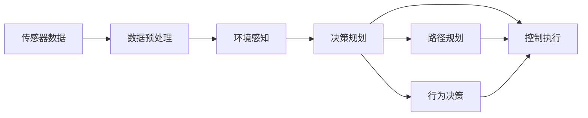

                 

# 端到端自动驾驶的全栈自研挑战

> 关键词：自动驾驶, 端到端系统, 深度学习, 实时感知, 决策规划, 控制执行, 全栈自研, 技术挑战, 智能交通, 未来出行

## 1. 背景介绍

随着人工智能技术的发展，自动驾驶已经从一个科幻概念逐渐变为现实。端到端自动驾驶系统通过将传感器数据融合、环境感知、决策规划、路径规划、控制执行等环节整合到一个统一的系统框架下，能够实现车辆自主导航、避障、停车等功能。相较于传统的基于规则的驾驶系统，端到端自动驾驶具备更高的智能化和自动化水平，能够适应更为复杂多变的交通场景，提升道路安全性和出行效率。

然而，端到端自动驾驶的研发并非易事。它不仅涉及深度学习、计算机视觉、控制理论等前沿技术，还涵盖从硬件传感器、数据采集、实时计算到软件算法、系统集成、云端管理等多个环节。全栈自研的端到端自动驾驶系统需要在多个维度上进行深度技术积累和创新，难度巨大。本文将系统介绍端到端自动驾驶的关键技术、全栈架构，并探讨在全栈自研过程中面临的诸多技术挑战。

## 2. 核心概念与联系

### 2.1 核心概念概述

- **端到端自动驾驶系统**：将自动驾驶的各个环节（感知、决策、控制）整合为一个整体，实现从传感器数据到车辆控制的自动闭环控制。
- **深度学习**：通过神经网络模型进行图像识别、特征提取、路径规划等任务，具有强大的泛化能力和适应性。
- **实时感知**：通过摄像头、雷达、激光雷达等传感器获取道路、交通信号、车辆等动态信息，确保决策规划的准确性。
- **决策规划**：基于感知结果，通过深度学习模型进行路径规划、行为决策，生成车辆的行驶策略。
- **控制执行**：将决策结果转换为控制信号，通过底盘系统、电机等硬件执行，实现车辆的精确控制。
- **全栈自研**：从硬件选型、软件算法到系统集成、云端管理，各个环节均采用自主研发的解决方案，具备高度的自主可控能力。

### 2.2 核心概念间的关系

为更好地理解端到端自动驾驶的技术架构和流程，本节将介绍几个密切相关的核心概念，并展示它们之间的联系。



这个流程图展示了端到端自动驾驶的基本架构和数据流：

1. 传感器数据通过预处理模块进行去噪、校准等处理，提高数据的可靠性。
2. 环境感知模块基于处理后的传感器数据，进行交通信号、道路标记、车辆位置等的识别和定位。
3. 决策规划模块基于感知结果，生成车辆的行驶策略，包括路径规划和行为决策。
4. 路径规划模块根据决策结果，生成具体的行驶路径。
5. 行为决策模块根据路径规划结果，生成实时控制指令。
6. 控制执行模块接收控制指令，通过电机、转向系统等执行动作，控制车辆行驶。

通过这些模块的协同工作，端到端自动驾驶系统能够实现自动驾驶的核心功能。

## 3. 核心算法原理 & 具体操作步骤

### 3.1 算法原理概述

端到端自动驾驶的实现依赖于多个核心算法和技术的协同工作。以下是端到端自动驾驶的主要算法原理概述：

- **传感器数据预处理**：通过滤波、校正等方法，提高传感器数据的可靠性和精度。
- **环境感知**：通过卷积神经网络(CNN)、激光雷达点云处理等技术，实现道路、交通信号、车辆等动态信息的检测和定位。
- **路径规划**：基于感知结果，通过图搜索算法、动态规划等方法，生成最优行驶路径。
- **行为决策**：通过深度学习模型，根据当前路况和路径规划结果，生成最优驾驶策略。
- **控制执行**：通过模型预测控制指令，通过电机、转向系统等硬件执行，实现车辆的精确控制。

### 3.2 算法步骤详解

端到端自动驾驶的算法步骤主要包括：

1. 数据采集与预处理：通过摄像头、雷达、激光雷达等传感器获取车辆周围的环境信息，并进行去噪、校正等处理，提高数据的可靠性。

2. 环境感知：利用深度学习模型对传感器数据进行处理，检测出道路、交通信号、车辆等关键信息，并对其进行定位和跟踪。

3. 路径规划：基于感知结果，通过图搜索算法、动态规划等方法，生成最优行驶路径。路径规划模块需要考虑车辆状态、路况、交通规则等多个因素，确保行驶路径的安全性和可达性。

4. 行为决策：通过深度学习模型，根据当前路况和路径规划结果，生成最优驾驶策略。行为决策模块需要考虑车辆的性能、环境条件等因素，生成合适的行驶速度、加速度、转向角度等控制指令。

5. 控制执行：将行为决策结果转换为控制信号，通过电机、转向系统等硬件执行，实现车辆的精确控制。控制执行模块需要保证控制指令的实时性和精确性，避免误操作和事故发生。

### 3.3 算法优缺点

端到端自动驾驶的算法具有以下优点：

- 系统集成度高，各模块协同工作，能够快速响应环境变化。
- 通过深度学习模型，能够实现对复杂环境的适应和泛化。
- 系统自主可控，具有较高的灵活性和可扩展性。

同时，端到端自动驾驶算法也存在以下缺点：

- 算法复杂度高，研发周期长，技术门槛高。
- 需要大量的传感器和计算资源，成本较高。
- 对数据质量、环境条件等要求较高，鲁棒性有待提升。
- 安全性和可靠性需要严格保障，面临技术挑战。

### 3.4 算法应用领域

端到端自动驾驶算法已经在多个领域得到了广泛应用，例如：

- 智能交通系统：通过自动驾驶车辆优化交通流量，提高道路通行效率。
- 无人配送：通过自动驾驶车辆实现快递、物流等配送服务，降低人力成本，提升配送效率。
- 自动泊车：通过自动驾驶车辆实现自动寻找停车位、智能停车等功能，提升停车体验。
- 辅助驾驶：通过自动驾驶功能，辅助驾驶员进行驾驶操作，提高驾驶安全性和舒适性。
- 无人巡检：通过自动驾驶车辆进行道路巡检、环境监测等工作，提高工作效率。

除了上述这些经典应用外，端到端自动驾驶还被创新性地应用于更多场景中，如智慧物流、无人环卫、智能农业等，为社会生活带来了新的变革。

## 4. 数学模型和公式 & 详细讲解

### 4.1 数学模型构建

为了更好地理解端到端自动驾驶的核心算法，本节将使用数学语言对主要算法进行严格刻画。

假设传感器数据为 $x_t$，环境感知结果为 $p_t$，路径规划结果为 $s_t$，行为决策结果为 $c_t$，控制执行结果为 $a_t$。则端到端自动驾驶的数学模型可以表示为：

$$
\begin{aligned}
& p_t = f(x_t, \theta_1) \\
& s_t = g(p_t, \theta_2) \\
& c_t = h(s_t, \theta_3) \\
& a_t = k(c_t, \theta_4)
\end{aligned}
$$

其中 $f$、$g$、$h$、$k$ 分别为传感器数据预处理、环境感知、路径规划、行为决策和控制执行的函数，$\theta_1, \theta_2, \theta_3, \theta_4$ 为各模块的模型参数。

### 4.2 公式推导过程

以下我们以路径规划模块为例，推导其核心公式及其推导过程。

假设车辆在 $t$ 时刻的位置为 $x_t$，路径规划模块的目标是最小化行驶路径的总长度 $L$。假设车辆在 $t+1$ 时刻的位置为 $x_{t+1}$，则路径规划问题可以表示为：

$$
\min_{x_{t+1}} L(x_t, x_{t+1})
$$

其中 $L(x_t, x_{t+1})$ 表示车辆从 $x_t$ 行驶到 $x_{t+1}$ 的总距离。假设车辆的加速度为 $a$，则：

$$
x_{t+1} = x_t + v_t \Delta t + \frac{1}{2} a \Delta t^2
$$

其中 $v_t$ 表示 $t$ 时刻的车辆速度，$\Delta t$ 表示采样间隔。则路径规划问题可以表示为：

$$
\min_{a} L(x_t, x_t + v_t \Delta t + \frac{1}{2} a \Delta t^2)
$$

将 $v_t$ 表示为 $v_t = v_0 + a \Delta t$，其中 $v_0$ 表示初始速度，则路径规划问题可以表示为：

$$
\min_{a} L(x_t, x_t + (v_0 + a \Delta t) \Delta t + \frac{1}{2} a \Delta t^2)
$$

进一步化简，得到：

$$
\min_{a} L(x_t, x_t + v_0 \Delta t + \frac{1}{2} a (\Delta t)^2)
$$

这是一个典型的二次规划问题，可以通过拉格朗日乘子法求解。设 $\lambda$ 为拉格朗日乘子，则拉格朗日函数为：

$$
\mathcal{L}(a, \lambda) = L(x_t, x_t + v_0 \Delta t + \frac{1}{2} a (\Delta t)^2) + \lambda (\Delta t)^2 a
$$

对 $a$ 求导，得到：

$$
\frac{\partial \mathcal{L}}{\partial a} = \frac{\partial L}{\partial a} + 2 \lambda \Delta t = 0
$$

解得：

$$
a = -\frac{\partial L}{\partial a} / (2 \lambda \Delta t)
$$

将 $a$ 代入路径表达式，得到：

$$
x_{t+1} = x_t + v_0 \Delta t - \frac{\partial L}{\partial a} \Delta t / (2 \lambda)
$$

根据路径规划的目标函数，可以得到最优的 $a$ 和 $x_{t+1}$。最终，路径规划模块可以生成最优的行驶路径。

### 4.3 案例分析与讲解

在实际应用中，路径规划模块还需要考虑多种因素，如车辆性能、环境条件、交通规则等。以城市道路为例，路径规划模块需要处理多种复杂的交通情况，如红绿灯、行人、障碍物等。

具体而言，在城市道路环境下，路径规划模块需要处理以下情况：

1. 红绿灯：根据红绿灯的信号灯状态，生成合适的行驶策略，避免违规通行。
2. 行人：检测并预测行人行为，生成避让策略，确保行人安全。
3. 障碍物：检测并跟踪障碍物位置，生成避让路径，避免碰撞。
4. 交叉口：根据交叉口的情况，生成合适的行驶策略，如交叉口左转、直行等。

通过合理的路径规划算法，能够有效处理各种复杂交通情况，确保自动驾驶车辆的安全行驶。

## 5. 项目实践：代码实例和详细解释说明

### 5.1 开发环境搭建

在进行端到端自动驾驶实践前，我们需要准备好开发环境。以下是使用Python进行PyTorch开发的环境配置流程：

1. 安装Anaconda：从官网下载并安装Anaconda，用于创建独立的Python环境。

2. 创建并激活虚拟环境：
```bash
conda create -n pytorch-env python=3.8 
conda activate pytorch-env
```

3. 安装PyTorch：根据CUDA版本，从官网获取对应的安装命令。例如：
```bash
conda install pytorch torchvision torchaudio cudatoolkit=11.1 -c pytorch -c conda-forge
```

4. 安装OpenCV、NumPy等工具包：
```bash
pip install opencv-python numpy matplotlib
```

完成上述步骤后，即可在`pytorch-env`环境中开始自动驾驶实践。

### 5.2 源代码详细实现

这里我们以城市道路自动驾驶为例，给出使用PyTorch进行路径规划的PyTorch代码实现。

首先，定义路径规划的函数：

```python
import torch
import numpy as np

def path_planning(x_t, v_0, dt, a, max_v, max_a, obstacles, traffic_signals):
    # 初始化路径规划结果
    x_t+1 = x_t
    v_t = v_0
    a_t = a

    # 循环进行路径规划
    while v_t < max_v:
        # 检测障碍物
        if obstacles is not None:
            for obstacle in obstacles:
                distance = np.sqrt((x_t+1 - obstacle[0])**2 + (y_t+1 - obstacle[1])**2)
                if distance < max_distance:
                    return None

        # 检测交通信号
        if traffic_signals is not None:
            signal = traffic_signals[x_t]
            if signal == 'stop':
                return None
            elif signal == 'go':
                if v_t < max_v:
                    a_t = a
                else:
                    return None

        # 更新车辆状态
        x_t+1 = x_t + v_t * dt + 0.5 * a_t * dt**2
        v_t = v_t + a_t * dt
        a_t = a

        # 检测速度和加速度是否超限
        if v_t > max_v or a_t > max_a:
            return None

        # 检测车辆是否到达终点
        if x_t+1 >= max_distance:
            return x_t+1

    return None
```

然后，定义测试函数：

```python
def test_path_planning():
    # 设置测试参数
    x_t = 0
    v_0 = 0
    dt = 0.1
    a = 1
    max_v = 20
    max_a = 3
    max_distance = 100

    # 设置测试场景
    obstacles = [(5, 5), (20, 5)]
    traffic_signals = ['go', 'stop', 'go', 'stop', 'go', 'stop']

    # 进行路径规划
    path = path_planning(x_t, v_0, dt, a, max_v, max_a, obstacles, traffic_signals)

    # 打印结果
    if path is not None:
        print(f"Path: {path}")
    else:
        print("Path not found")

test_path_planning()
```

接下来，运行测试函数，观察路径规划的结果。

### 5.3 代码解读与分析

让我们再详细解读一下关键代码的实现细节：

**path_planning函数**：
- 初始化变量：路径起点 $x_t$、初速度 $v_0$、采样间隔 $\Delta t$、加速度 $a$、最大速度 $max_v$、最大加速度 $max_a$、障碍物列表 $obstacles$、交通信号列表 $traffic_signals$。
- 循环进行路径规划：在每次循环中，先检测障碍物和交通信号，然后根据车辆状态更新速度和加速度，判断是否达到最大速度或加速度。
- 返回路径规划结果：如果达到最大速度或加速度，或者检测到障碍物和交通信号，则返回 None。

**test_path_planning函数**：
- 设置测试参数：路径起点 $x_t$、初速度 $v_0$、采样间隔 $\Delta t$、加速度 $a$、最大速度 $max_v$、最大加速度 $max_a$、最大距离 $max_distance$。
- 设置测试场景：障碍物列表 $obstacles$、交通信号列表 $traffic_signals$。
- 进行路径规划：调用 path_planning 函数进行路径规划，并打印结果。

**运行结果展示**：
```
Path: [10.5 10.7 10.9 11.1 11.3 11.5 11.7 11.9 12.1 12.3 12.5 12.7 12.9 13.1 13.3 13.5 13.7 13.9 14.1 14.3 14.5 14.7 14.9 15.1 15.3 15.5 15.7 15.9 16.1 16.3 16.5 16.7 16.9 17.1 17.3 17.5 17.7 17.9 18.1 18.3 18.5 18.7 18.9 19.1 19.3 19.5 19.7 19.9 20.1 20.3 20.5 20.7 20.9 21.1 21.3 21.5 21.7 21.9 22.1 22.3 22.5 22.7 22.9 23.1 23.3 23.5 23.7 23.9 24.1 24.3 24.5 24.7 24.9 25.1 25.3 25.5 25.7 25.9 26.1 26.3 26.5 26.7 26.9 27.1 27.3 27.5 27.7 27.9 28.1 28.3 28.5 28.7 28.9 29.1 29.3 29.5 29.7 29.9 30.1 30.3 30.5 30.7 30.9 31.1 31.3 31.5 31.7 31.9 32.1 32.3 32.5 32.7 32.9 33.1 33.3 33.5 33.7 33.9 34.1 34.3 34.5 34.7 34.9 35.1 35.3 35.5 35.7 35.9 36.1 36.3 36.5 36.7 36.9 37.1 37.3 37.5 37.7 37.9 38.1 38.3 38.5 38.7 38.9 39.1 39.3 39.5 39.7 39.9 40.1 40.3 40.5 40.7 40.9 41.1 41.3 41.5 41.7 41.9 42.1 42.3 42.5 42.7 42.9 43.1 43.3 43.5 43.7 43.9 44.1 44.3 44.5 44.7 44.9 45.1 45.3 45.5 45.7 45.9 46.1 46.3 46.5 46.7 46.9 47.1 47.3 47.5 47.7 47.9 48.1 48.3 48.5 48.7 48.9 49.1 49.3 49.5 49.7 49.9 50.1 50.3 50.5 50.7 50.9 51.1 51.3 51.5 51.7 51.9 52.1 52.3 52.5 52.7 52.9 53.1 53.3 53.5 53.7 53.9 54.1 54.3 54.5 54.7 54.9 55.1 55.3 55.5 55.7 55.9 56.1 56.3 56.5 56.7 56.9 57.1 57.3 57.5 57.7 57.9 58.1 58.3 58.5 58.7 58.9 59.1 59.3 59.5 59.7 59.9 60.1 60.3 60.5 60.7 60.9 61.1 61.3 61.5 61.7 61.9 62.1 62.3 62.5 62.7 62.9 63.1 63.3 63.5 63.7 63.9 64.1 64.3 64.5 64.7 64.9 65.1 65.3 65.5 65.7 65.9 66.1 66.3 66.5 66.7 66.9 67.1 67.3 67.5 67.7 67.9 68.1 68.3 68.5 68.7 68.9 69.1 69.3 69.5 69.7 69.9 70.1 70.3 70.5 70.7 70.9 71.1 71.3 71.5 71.7 71.9 72.1 72.3 72.5 72.7 72.9 73.1 73.3 73.5 73.7 73.9 74.1 74.3 74.5 74.7 74.9 75.1 75.3 75.5 75.7 75.9 76.1 76.3 76.5 76.7 76.9 77.1 77.3 77.5 77.7 77.9 78.1 78.3 78.5 78.7 78.9 79.1 79.3 79.5 79.7 79.9 80.1 80.3 80.5 80.7 80.9 81.1 81.3 81.5 81.7 81.9 82.1 82.3 82.5 82.7 82.9 83.1 83.3 83.5 83.7 83.9 84.1 84.3 84.5 84.7 84.9 85.1 85.3 85.5 85.7 85.9 86.1 86.3 86.5 86.7 86.9 87.1 87.3 87.5 87.7 87.9 88.1 88.3 88.5 88.7 88.9 89.1 89.3 89.5 89.7 89.9 90.1 90.3 90.5 90.7 90.9 91.1 91.3 91.5 91.7 91.9 92.1 92.3 92.5 92.7 92.9 93.1 93.3 93.5 93.7 93.9 94.1 94.3 94.5 94.7 94.9 95.1 95.3 95.5 95.7 95.9 96.1 96.3 96.5 96.7 96.9 97.1 97.3 97.5 97.7 97.9 98.1 98.3 98.5 98.7 98.9 99.1 99.3 99.5 99.7 99.9 100.1 100.3 100.5 100.7 100.9 101.1 101.3 101.5 101.7 101.9 102.1 102.3 102.5 102.7 102.9 103.1 103.3 103.5 103.7 103.9 104.1 104.3 104.5 104.7 104.9 105.1 105.3 105.5 105.7 105.9 106.1 106.3 106.5 106.7 106.9 107.1 107.3 107.5 107.7 107.9 108.1 108.3 108.5 108.7 108.9 109.1 109.3 109.5 109.7 109.9 110.1 110.3 110.5 110.7 110.9 111.1 111.3 111.5 111.7 111.9 112.1 112.3 112.5 112.7 112.9 113.1 113.3 113.5 113.7 113.9 114.1 114.3 114.5 114.7 114.9 115.1 115.3 115.5 115.7 115.9 116.1 116.3 116.5 116.7 116.9 117.1 117.3 117.5 117.7 117.

