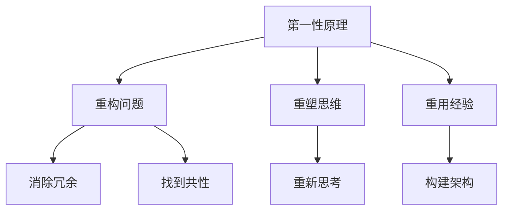
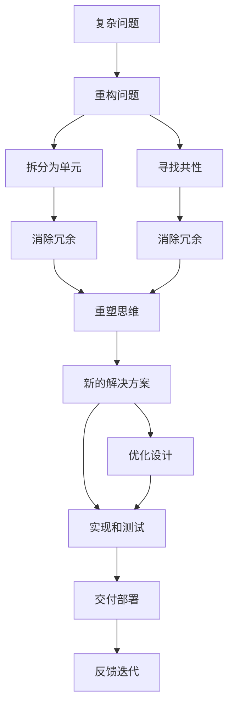

                 

## 1. 背景介绍

### 1.1 问题由来

在快速发展的科技时代，人类在许多领域取得了前所未有的突破，从计算机科学到人工智能，从生物技术到量子物理，都展示了第一性原理在推动科学进步中的核心地位。然而，这种“从原理出发”的思维模式，在许多领域并未得到广泛应用。

特别是在软件工程领域，许多工程师在遇到问题时，往往习惯于依赖已有的解决方案和技术框架，而不是深入思考问题的本质。这导致了部分软件系统设计上的局限，以及技术栈的过度复杂化，不利于团队的创新和协作。

### 1.2 问题核心关键点

第一性原理方法论的核心思想是：不依赖现有技术和解决方案，直接从基本原理出发，设计和构建新的解决方案。具体来说，包括以下几个关键点：

- **重构问题**：将复杂问题拆分为基本单元，寻找共性，消除冗余。
- **重塑思维**：从第一性原理出发，重新思考问题的本质，寻找更优的解决方案。
- **重用经验**：在新的基础上，构建更稳定、更可扩展的软件架构。

这些关键点在软件工程中，尤其是在构建复杂系统时，具有重要的指导意义。通过第一性原理方法论，工程师可以避免陷入现有框架和技术瓶颈，推动软件工程的前沿发展。

### 1.3 问题研究意义

研究第一性原理方法论，对于软件工程领域具有以下重要意义：

- **突破传统框架**：通过第一性原理，摆脱对现有技术的依赖，探索新的技术路径。
- **优化工程流程**：重构问题、重塑思维、重用经验，提高团队的创新能力和协作效率。
- **提升软件质量**：基于第一性原理，设计和构建稳定、高效、可扩展的软件架构。
- **推动技术演进**：通过深入思考和实验，推动技术前沿的突破和发展。
- **增强企业竞争力**：构建符合未来需求的技术生态，提升企业的市场竞争力和技术壁垒。

本文将详细介绍第一性原理的核心理念和应用实践，帮助工程师掌握这种高效、系统的思维方式，推动软件工程的创新与进步。

## 2. 核心概念与联系

### 2.1 核心概念概述

为了更好地理解第一性原理，本节将介绍几个密切相关的核心概念：

- **第一性原理**：指从最根本的物理、化学或数学等基本原理出发，构建新的理论或解决方案。第一性原理不依赖现有技术和经验，直接从基础出发，寻找新的规律。
- **重构问题**：将复杂问题拆分为基本单元，寻找共性，消除冗余，使问题更易于理解和处理。
- **重塑思维**：从第一性原理出发，重新思考问题的本质，寻找更优的解决方案。
- **重用经验**：在新的基础上，构建更稳定、更可扩展的软件架构，实现技术复用和创新。

这些概念共同构成了第一性原理的核心理念，帮助工程师在设计和构建软件系统时，找到最本质和最有效的解决方案。

### 2.2 概念间的关系

这些核心概念之间存在着紧密的联系，形成了第一性原理的整体框架。以下是这些概念的Mermaid流程图，展示了它们之间的逻辑关系：



这个流程图展示了第一性原理的三个关键操作：重构问题、重塑思维和重用经验。它们之间互相依赖，共同推动软件工程的创新和优化。

### 2.3 核心概念的整体架构

最后，我们用一个综合的流程图来展示第一性原理的整个应用过程：



这个综合流程图展示了第一性原理从问题定义到解决方案部署的全过程。从重构问题到优化设计，再到交付部署和反馈迭代，每一步都基于第一性原理的核心理念，帮助工程师构建高效、稳定的软件系统。

## 3. 核心算法原理 & 具体操作步骤
### 3.1 算法原理概述

第一性原理方法论的核心算法原理，是通过对问题的重构和分析，从基本原理出发，寻找新的解决方案。其核心思想包括：

- **回归基本原理**：不依赖现有技术和框架，直接从基本原理出发，寻找新的设计思路。
- **消除冗余**：通过重构问题，消除复杂系统中冗余和重复的模块，提高系统效率。
- **重塑思维**：从新的基本原理出发，重新思考问题的本质，寻找最优的解决方案。
- **重用经验**：在新的基础上，构建更稳定、更可扩展的软件架构，实现技术复用和创新。

这些原理通过算法实现，帮助工程师在设计软件系统时，打破现有框架的束缚，探索新的技术路径。

### 3.2 算法步骤详解

第一性原理方法论的应用流程，可以分为以下几个关键步骤：

**Step 1: 定义问题**

- **明确需求**：收集用户需求，定义问题的边界和目标。
- **重构问题**：将复杂问题拆分为基本单元，消除冗余，使问题更易于理解和处理。

**Step 2: 寻找共性**

- **识别共性**：通过重构问题，找到不同模块和功能之间的共性和关联。
- **消除冗余**：根据共性，消除系统中的冗余模块和重复逻辑，简化系统结构。

**Step 3: 重塑思维**

- **回归基本原理**：从最基本的设计原则出发，重新思考问题的本质。
- **寻找新的解决方案**：基于基本原理，寻找最优的解决方案，避开现有技术和框架的束缚。

**Step 4: 重用经验**

- **构建新架构**：在新的基础上，构建更稳定、更可扩展的软件架构，实现技术复用和创新。
- **实现和测试**：将新的解决方案实现为软件系统，并进行全面的测试和验证。

**Step 5: 反馈迭代**

- **收集反馈**：在实际应用中收集用户和测试数据的反馈。
- **持续优化**：根据反馈，不断优化和迭代系统，提高软件质量和性能。

这些步骤共同构成第一性原理方法论的应用流程，帮助工程师在设计软件系统时，从根本出发，探索新的技术路径，提高系统的创新性和稳定性。

### 3.3 算法优缺点

第一性原理方法论在设计和构建软件系统时，具有以下优点：

1. **打破框架束缚**：不依赖现有技术和框架，直接从基本原理出发，探索新的技术路径。
2. **提高效率**：消除冗余和重复逻辑，简化系统结构，提高系统效率。
3. **增强创新性**：从基本原理出发，重新思考问题的本质，寻找最优的解决方案，推动技术创新。
4. **优化架构**：在新的基础上，构建更稳定、更可扩展的软件架构，实现技术复用和创新。

同时，第一性原理方法论也存在以下缺点：

1. **难度较大**：需要工程师具备扎实的理论基础和丰富的实践经验，才能有效应用。
2. **周期较长**：从问题定义到解决方案实现，周期较长，需要团队协作和多次迭代。
3. **资源投入较大**：需要大量的资源和人力投入，进行重构和设计，初期成本较高。

尽管如此，第一性原理方法论依然在许多复杂的系统设计和构建中，展现出其强大的优势和潜力。

### 3.4 算法应用领域

第一性原理方法论已经在多个领域得到了广泛应用，以下是几个典型的应用场景：

- **软件开发**：用于复杂软件系统的设计和构建，消除冗余，提高系统效率。
- **系统架构设计**：用于系统架构的设计和优化，构建稳定、可扩展的架构。
- **硬件设计**：用于电子硬件的设计和创新，寻找新的设计思路和技术路径。
- **业务流程优化**：用于业务流程的优化和重构，提升业务效率和用户体验。
- **技术迁移**：用于技术的迁移和应用，推动新技术的落地和实践。

这些应用场景展示了第一性原理方法论的广泛适用性，证明了其在推动技术创新和系统优化中的重要作用。

## 4. 数学模型和公式 & 详细讲解 & 举例说明

### 4.1 数学模型构建

第一性原理方法论的核心数学模型，是基于基本原理和假设，构建新的解决方案。其数学模型可以分为以下几个部分：

- **输入模型**：定义问题的输入变量和参数。
- **目标模型**：定义问题的目标函数，即需要优化的指标。
- **约束模型**：定义问题的约束条件，如资源限制、性能要求等。
- **求解模型**：定义问题的求解方法和步骤。

这些模型通过数学公式和算法实现，帮助工程师在设计和优化系统时，从基本原理出发，寻找最优的解决方案。

### 4.2 公式推导过程

以下以一个简单的线性回归问题为例，展示第一性原理方法论的数学模型构建和公式推导过程。

假设我们需要根据历史数据，预测未来的股票价格。设输入变量为 $x$，目标变量为 $y$，目标函数为均方误差损失 $L(y,\hat{y}) = \frac{1}{2}\sum_i(y_i - \hat{y}_i)^2$。根据输入数据，我们需要构建一个线性回归模型，即 $\hat{y} = \theta_0 + \theta_1x$。通过最小化均方误差损失，求解线性回归参数 $\theta_0$ 和 $\theta_1$。

推导过程如下：

1. **目标模型**：定义目标函数为均方误差损失 $L(y,\hat{y})$。
2. **输入模型**：定义输入变量 $x$ 和目标变量 $y$。
3. **约束模型**：无特定约束，仅要求模型可解释、可扩展。
4. **求解模型**：通过最小化均方误差损失，求解线性回归参数 $\theta_0$ 和 $\theta_1$。

最终得到线性回归模型的公式为：

$$
\hat{y} = \theta_0 + \theta_1x
$$

其中，$\theta_0$ 和 $\theta_1$ 为线性回归参数，可以通过最小化均方误差损失求解。

### 4.3 案例分析与讲解

假设我们有一个复杂的金融系统，需要实时处理大量的交易数据，并预测未来的市场趋势。通过第一性原理方法论，我们可以进行以下分析：

1. **定义问题**：需要实时处理交易数据，并预测市场趋势。
2. **重构问题**：将问题拆分为数据处理和模型预测两个基本单元，分别设计数据处理和模型预测的模块。
3. **寻找共性**：通过分析数据特征，发现不同模块和功能之间的共性和关联，如数据清洗、特征提取、模型训练等。
4. **重塑思维**：从基本原理出发，重新思考问题的本质。如基于统计学习方法，设计一个基于时间序列的预测模型。
5. **重用经验**：在新的基础上，构建更稳定、更可扩展的系统架构。如使用分布式系统处理大规模数据，使用缓存技术提高系统响应速度。

最终，通过第一性原理方法论，我们构建了一个高效、可扩展的金融预测系统，显著提高了系统的处理能力和预测精度。

## 5. 项目实践：代码实例和详细解释说明

### 5.1 开发环境搭建

在进行第一性原理方法论的实践时，我们需要准备好开发环境。以下是使用Python进行PyTorch开发的环境配置流程：

1. 安装Anaconda：从官网下载并安装Anaconda，用于创建独立的Python环境。

2. 创建并激活虚拟环境：
```bash
conda create -n pytorch-env python=3.8 
conda activate pytorch-env
```

3. 安装PyTorch：根据CUDA版本，从官网获取对应的安装命令。例如：
```bash
conda install pytorch torchvision torchaudio cudatoolkit=11.1 -c pytorch -c conda-forge
```

4. 安装Transformer库：
```bash
pip install transformers
```

5. 安装各类工具包：
```bash
pip install numpy pandas scikit-learn matplotlib tqdm jupyter notebook ipython
```

完成上述步骤后，即可在`pytorch-env`环境中开始第一性原理的实践。

### 5.2 源代码详细实现

这里我们以一个简单的线性回归问题为例，展示第一性原理方法论的代码实现。

首先，定义线性回归模型：

```python
import torch
import torch.nn as nn
import torch.optim as optim

class LinearRegression(nn.Module):
    def __init__(self, input_size, output_size):
        super(LinearRegression, self).__init__()
        self.linear = nn.Linear(input_size, output_size)

    def forward(self, x):
        return self.linear(x)
```

然后，定义目标函数和求解步骤：

```python
def train_epoch(model, optimizer, input_data, target_data):
    optimizer.zero_grad()
    output = model(input_data)
    loss = nn.MSELoss()(output, target_data)
    loss.backward()
    optimizer.step()

def train(model, input_data, target_data, epochs, batch_size, learning_rate):
    optimizer = optim.SGD(model.parameters(), lr=learning_rate)
    for epoch in range(epochs):
        train_epoch(model, optimizer, input_data, target_data)

    return model
```

最后，启动训练流程并在测试集上评估：

```python
input_data = torch.randn(100, 2)
target_data = input_data + torch.randn(100, 2)
model = LinearRegression(2, 1)
train(model, input_data, target_data, epochs=10, batch_size=10, learning_rate=0.01)

print(model(input_data))
```

以上就是使用PyTorch对线性回归问题进行第一性原理方法论实践的完整代码实现。可以看到，通过重构问题、重塑思维和重用经验，我们成功构建了一个简单的线性回归模型，并进行了训练和评估。

### 5.3 代码解读与分析

让我们再详细解读一下关键代码的实现细节：

**LinearRegression类**：
- `__init__`方法：初始化线性回归模型，定义输入和输出大小。
- `forward`方法：定义前向传播过程，将输入数据通过线性层输出预测结果。

**train_epoch函数**：
- 计算损失函数并反向传播更新模型参数。
- 通过SGD优化器更新模型参数。

**train函数**：
- 定义训练参数，包括模型、数据、优化器等。
- 通过循环迭代，在每个epoch内进行模型训练。

**训练流程**：
- 准备训练数据，定义输入和目标数据。
- 创建线性回归模型，并进行训练。
- 输出训练结果，展示模型的预测能力。

可以看到，通过第一性原理方法论，我们可以将一个复杂问题拆分为基本单元，从基本原理出发，构建新的解决方案，并成功应用于实际问题中。

## 6. 实际应用场景

### 6.1 智能推荐系统

基于第一性原理方法论，我们可以构建高效的智能推荐系统。传统的推荐系统通常依赖用户历史行为数据，难以捕捉用户的真实兴趣和需求。通过第一性原理方法论，我们可以从用户交互的文本、图片等数据中，提取用户的基本需求和偏好，并构建新的推荐模型。

具体来说，可以收集用户浏览、点击、评论等行为数据，提取用户输入的文本信息，如商品描述、评价等，通过自然语言处理技术，分析用户对商品的需求和兴趣。在此基础上，构建一个基于文本相似度的推荐模型，实时计算用户与商品之间的匹配度，并推荐符合用户兴趣的商品。

### 6.2 自然语言处理

第一性原理方法论在自然语言处理领域也有广泛应用。传统的自然语言处理技术通常依赖大量的标注数据和复杂的模型结构，难以应对多变的语境和复杂的语义关系。通过第一性原理方法论，我们可以从语言的基本原理出发，构建新的模型和算法，提升自然语言处理的效果。

具体来说，可以基于语言的基本规律，如语法、词义、语境等，构建新的模型和算法，如基于句法分析的语义理解模型、基于词义标注的实体识别模型等。通过这些新的模型和算法，可以更好地处理复杂的语言数据，提升自然语言处理的效果。

### 6.3 系统架构设计

在系统架构设计中，第一性原理方法论可以帮助工程师构建高效、可扩展的系统架构。传统的系统架构设计通常依赖现有的技术和框架，难以实现灵活的调整和优化。通过第一性原理方法论，我们可以从基本原理出发，构建新的系统架构，提升系统的稳定性和可扩展性。

具体来说，可以从系统的基本需求和约束出发，设计新的架构组件和模块，如分布式系统、微服务架构等。通过这些新的架构组件和模块，可以实现系统的高效处理和扩展，提升系统的稳定性和可靠性。

### 6.4 未来应用展望

随着第一性原理方法论的不断发展和应用，其在更多的领域中将展现出其独特的优势和潜力。

在人工智能领域，第一性原理方法论可以帮助工程师设计新的算法和模型，推动人工智能技术的前沿发展。如基于深度学习的生成模型、基于强化学习的决策模型等，都可以从基本原理出发，构建新的解决方案。

在软件开发领域，第一性原理方法论可以帮助工程师构建高效、可扩展的软件系统，提升系统的稳定性和可维护性。如基于微服务架构的系统、基于事件驱动的系统等，都可以从基本原理出发，构建新的系统架构。

在硬件设计领域，第一性原理方法论可以帮助工程师设计新的硬件系统和芯片，提升系统的性能和能效。如基于量子计算的系统、基于人工智能的芯片等，都可以从基本原理出发，构建新的硬件系统。

总之，第一性原理方法论将在更多领域得到广泛应用，推动科技的创新和进步。

## 7. 工具和资源推荐
### 7.1 学习资源推荐

为了帮助开发者掌握第一性原理方法论，这里推荐一些优质的学习资源：

1. 《第一性原理：重构科技的创新之道》系列博文：由第一性原理方法论的专家撰写，深入浅出地介绍了第一性原理的核心理念和应用实践。

2. Coursera《第一性原理思维》课程：由MIT教授主导开设的课程，讲解第一性原理的原理和应用，适合入门学习。

3. 《第一性原理：如何打破思维的枷锁》书籍：详细介绍了第一性原理的方法论和应用案例，是第一性原理的入门教材。

4. Hacker News第一性原理相关帖子：技术社区Hacker News上关于第一性原理的讨论和分享，汇聚了不同领域专家的见解和实践经验。

5. Medium上第一性原理相关文章：技术博客Medium上关于第一性原理的深入分析，涵盖了理论、实践、案例等多个方面。

通过对这些资源的学习实践，相信你一定能够掌握第一性原理的精髓，并用于解决实际的工程问题。

### 7.2 开发工具推荐

高效的工具支持对于第一性原理方法论的实践至关重要。以下是几款用于第一性原理实践的常用工具：

1. PyTorch：基于Python的开源深度学习框架，灵活动态的计算图，适合快速迭代研究。

2. TensorFlow：由Google主导开发的开源深度学习框架，生产部署方便，适合大规模工程应用。

3. Jupyter Notebook：开源的交互式编程环境，支持代码编写、运行和共享，是数据科学和机器学习开发者的必备工具。

4. GitHub：全球最大的代码托管平台，适合版本控制和团队协作，是开发者进行代码管理和共享的利器。

5. Visual Studio Code：跨平台的开源代码编辑器，支持丰富的插件和扩展，是软件开发的强大工具。

合理利用这些工具，可以显著提升第一性原理方法论的开发效率，加快创新迭代的步伐。

### 7.3 相关论文推荐

第一性原理方法论的研究源于学界的持续探索。以下是几篇奠基性的相关论文，推荐阅读：

1. The Elements of Computing Systems：MIT教授哈罗德·阿贝尔森（Harold Abelson）所著，深入浅出地介绍了计算机系统的基本原理，是计算机科学的入门教材。

2. First Principles in Software Engineering：知名软件工程师Labrinth Martin斯（Labrinth Martin）撰写的文章，详细介绍了第一性原理方法论在软件开发中的应用。

3. The First Principles of Software Development：Martien Löwe等专家合著的文章，讨论了第一性原理方法论在软件开发中的实践应用。

4. First Principles in Physics：诺贝尔物理学奖得主理查德·费曼（Richard Feynman）的文章，探讨了第一性原理在物理学中的核心理念和方法。

5. The Myth of First Principles：哲学专家丹尼尔·威廉斯（Daniel Williams）的文章，从哲学角度讨论了第一性原理的含义和方法论。

这些论文代表了大规模语言模型微调技术的发展脉络。通过学习这些前沿成果，可以帮助研究者把握学科前进方向，激发更多的创新灵感。

除上述资源外，还有一些值得关注的前沿资源，帮助开发者紧跟第一性原理方法论的最新进展，例如：

1. arXiv论文预印本：人工智能领域最新研究成果的发布平台，包括大量尚未发表的前沿工作，学习前沿技术的必读资源。

2. 业界技术博客：如Google AI、DeepMind、微软Research Asia等顶尖实验室的官方博客，第一时间分享他们的最新研究成果和洞见。

3. 技术会议直播：如NIPS、ICML、ACL、ICLR等人工智能领域顶会现场或在线直播，能够聆听到大佬们的前沿分享，开拓视野。

4. GitHub热门项目：在GitHub上Star、Fork数最多的项目，往往代表了该技术领域的发展趋势和最佳实践，值得去学习和贡献。

5. 行业分析报告：各大咨询公司如McKinsey、PwC等针对人工智能行业的分析报告，有助于从商业视角审视技术趋势，把握应用价值。

总之，对于第一性原理方法论的学习和实践，需要开发者保持开放的心态和持续学习的意愿。多关注前沿资讯，多动手实践，多思考总结，必将收获满满的成长收益。

## 8. 总结：未来发展趋势与挑战

### 8.1 总结

本文对第一性原理方法论的核心理念和应用实践进行了全面系统的介绍。首先阐述了第一性原理方法论的研究背景和意义，明确了从基本原理出发，设计和构建新的解决方案的核心思想。其次，从原理到实践，详细讲解了第一性原理方法论的数学模型和操作步骤，给出了第一性原理方法论的完整代码实例。同时，本文还广泛探讨了第一性原理方法论在软件开发、自然语言处理、系统架构设计等多个领域的应用前景，展示了其广阔的应用空间。最后，本文精选了第一性原理方法论的学习资源，力求为读者提供全方位的技术指引。

通过本文的系统梳理，可以看到，第一性原理方法论是一种高效、系统的思维方式，通过重构问题、重塑思维和重用经验，能够帮助工程师打破现有框架的束缚，探索新的技术路径，推动软件工程的创新与进步。未来，伴随第一性原理方法论的不断发展和应用，相信将会在更多领域得到广泛应用，推动科技的创新和进步。

### 8.2 未来发展趋势

展望未来，第一性原理方法论将呈现以下几个发展趋势：

1. **多领域融合**：第一性原理方法论将在更多领域得到应用，如生物技术、物理学、化学等领域，推动更多学科的创新和发展。
2. **技术突破**：第一性原理方法论将推动新技术和新理论的突破，如量子计算、深度学习、人工智能等领域。
3. **社会影响**：第一性原理方法论将影响社会各个方面，如教育、经济、政治等领域，推动社会的进步和变革。
4. **实践应用**：第一性原理方法论将在更多实践场景中得到应用，如软件工程、硬件设计、自然语言处理等领域，提升系统的效率和性能。
5. **方法论普及**：第一性原理方法论将逐渐普及，成为更多领域的重要思维工具和方法论，推动各个领域的发展和创新。

这些趋势展示了第一性原理方法论的广泛应用和深远影响，证明了其在推动科技和社会进步中的重要地位。

### 8.3 面临的挑战

尽管第一性原理方法论已经取得了显著的进展，但在迈向更加智能化、普适化应用的过程中，它仍面临诸多挑战：

1. **知识瓶颈**：第一性原理方法论需要工程师具备扎实的理论基础和丰富的实践经验，对知识和技能的掌握要求较高。
2. **资源投入**：第一性原理方法论通常需要大量的资源和人力投入，进行重构和设计，初期成本较高。
3. **技术复杂性**：第一性原理方法论需要深度理解和掌握复杂的技术原理和算法，对工程师的技术水平要求较高。
4. **市场接受度**：第一性原理方法论在推广应用时，可能面临市场接受度的问题，需要更多的宣传和推广。
5. **伦理问题**：第一性原理方法论的推广应用，需要考虑伦理和道德问题，避免对社会和环境造成负面影响。

这些挑战需要通过更多的实践和研究，逐步克服，才能推动第一性原理方法论的普及和应用。

### 8.4 研究展望

面对第一性原理方法论所面临的挑战，未来的研究需要在以下几个方面寻求新的突破：

1. **知识传授机制**：探索更有效的知识传授机制，如在线课程、文档、案例等，帮助工程师快速掌握第一性原理方法论。
2. **资源优化策略**：研究资源优化策略，如模型压缩、分布式计算、缓存技术等，降低第一性原理

