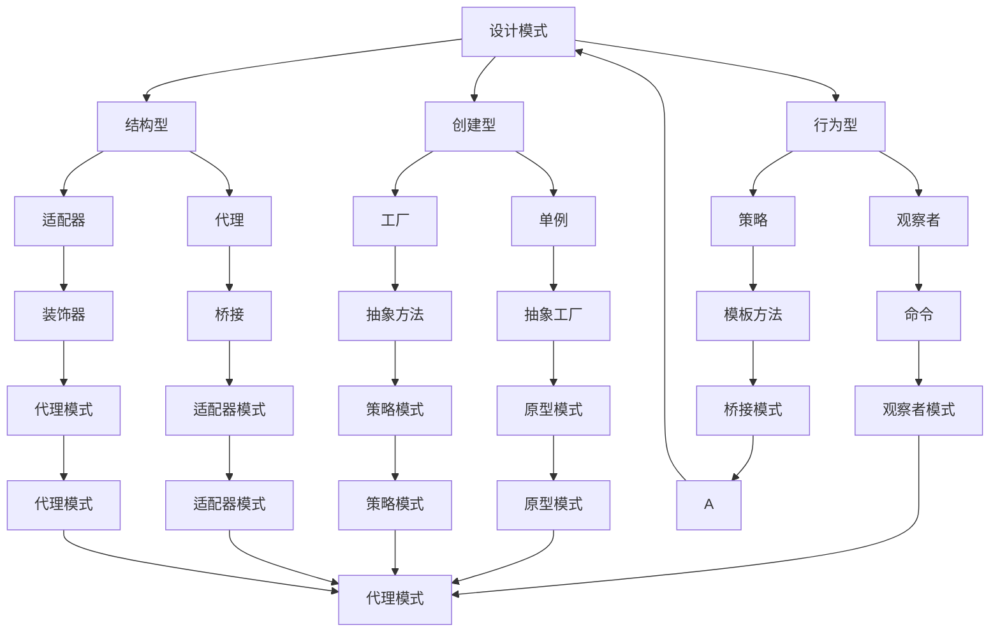
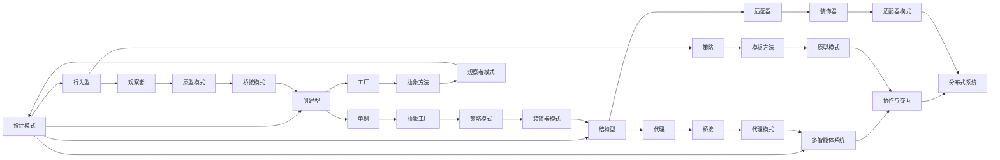

                 

# 综合设计模式的应用案例：反思、工具使用与多智能体协同

> 关键词：设计模式,多智能体,人工智能,协同,编程,实践,案例分析

## 1. 背景介绍

### 1.1 问题由来

在软件开发领域，设计模式（Design Pattern）是一种被广泛认可的编程实践，它们是一组基于经验和实践的最佳实践，旨在解决软件开发生命周期中的常见问题。然而，随着人工智能（AI）技术的迅速发展，尤其是多智能体系统（Multi-Agent Systems, MAS）的兴起，传统的设计模式需要被重新思考和扩展，以适应这一新的技术环境。

多智能体系统是指由多个自主行为主体组成的系统，这些主体可以是智能体（Agent），可以是机器人、自动驾驶车辆、物联网设备、或者任何具有自主决策能力的信息系统。在人工智能领域，多智能体系统尤其重要，因为它们可以模拟人类社会，实现复杂的协作和交互。

本文章将探讨设计模式在多智能体系统中的应用，通过分析案例、工具和实践，展示如何将经典设计模式与现代AI技术结合起来，解决多智能体系统中的复杂问题，提升系统的可扩展性、可维护性和可靠性。

### 1.2 问题核心关键点

在多智能体系统中，设计模式的应用面临着以下几个关键问题：

- **可扩展性**：如何设计系统使其能够轻松扩展和集成新的智能体？
- **可维护性**：如何构建易于维护和更新、应对复杂变更的系统？
- **可靠性**：如何确保系统的稳定性和安全性，避免因个体智能体的故障影响整体系统？
- **协作与交互**：如何设计系统以促进智能体之间的有效沟通与协作？

这些问题不仅对多智能体系统具有重要意义，也对传统软件工程有很强的借鉴意义。通过设计模式的应用，可以提供一种系统化的解决方案，提升系统的整体性能和用户满意度。

### 1.3 问题研究意义

研究设计模式在多智能体系统中的应用，不仅有助于提升系统的质量，还可以为新系统开发提供一套成熟的方法论。这将对多智能体系统的发展和推广起到重要作用，推动人工智能技术在更广泛的领域落地应用。

具体来说，设计模式的应用能够：

- **降低开发成本**：通过复用已知的设计模式，减少开发时间，提升效率。
- **提高系统可靠性**：设计模式中的机制和原则可以帮助系统更好地应对不确定性和故障。
- **增强协作与交互**：设计模式能够促进智能体之间的有效沟通和协作，提升系统的整体性能。
- **促进知识共享**：设计模式提供了一套标准的交流语言，有助于跨团队和跨项目间的知识传递和共享。

## 2. 核心概念与联系

### 2.1 核心概念概述

在本节中，我们将介绍几个与设计模式和多智能体系统紧密相关的核心概念，以及它们之间的关系：

- **设计模式**：解决特定问题的设计原则和结构，通常被表示为UML类图。设计模式分为创建型（如单例、工厂）、结构型（如代理、适配器）、行为型（如策略、观察者）三大类。
- **多智能体系统**：由多个自主智能体组成，每个智能体都有目标和行为规则，能够感知环境、与其他智能体交互。
- **协作与交互**：多智能体系统中的关键机制，通常通过消息传递、共享数据、共享状态等方式实现。
- **分布式系统**：多智能体系统的一种特殊形式，智能体在网络中分布式部署。

这些概念通过Mermaid流程图展示了它们之间的关系：



### 2.2 概念间的关系

这些核心概念之间存在着密切的联系，通过以下Mermaid流程图可以更直观地理解它们之间的关系：



## 3. 核心算法原理 & 具体操作步骤
### 3.1 算法原理概述

设计模式在多智能体系统中的应用，通常涉及到以下几个关键算法原理：

- **创建型模式**：用于创建和管理对象的生命周期，确保对象的正确创建和销毁。
- **结构型模式**：通过组合和聚合等结构性设计，实现系统的灵活构建和扩展。
- **行为型模式**：通过定义对象间交互的方式，实现系统的复杂协作和动态行为。

这些原理在多智能体系统中得到具体应用，特别是在创建智能体、管理智能体状态、控制智能体行为等方面。

### 3.2 算法步骤详解

以下是设计模式在多智能体系统中应用的详细步骤：

**Step 1: 选择设计模式**

首先，根据系统需求选择合适的设计模式。例如，创建型模式中的工厂模式（Factory Pattern）可以用于创建和管理智能体对象；结构型模式中的适配器模式（Adapter Pattern）可以用于兼容不同类型和格式的智能体；行为型模式中的策略模式（Strategy Pattern）可以用于动态调整智能体的行为规则。

**Step 2: 设计智能体**

设计智能体的基本结构和行为，包括感知环境、决策和行动的能力。智能体可以是一个实体对象，也可以是一个类。

**Step 3: 实现设计模式**

根据选定的设计模式，实现具体的智能体类、工厂类、适配器类、策略类等。这一步涉及到对象的创建、组合、聚合等操作，以及对象的交互方式和行为逻辑。

**Step 4: 集成和测试**

将智能体对象集成到系统中，进行单元测试、集成测试和系统测试，确保系统的正确性和稳定性。

**Step 5: 优化和迭代**

根据测试结果和系统反馈，对设计模式进行优化和迭代，进一步提升系统的性能和可靠性。

### 3.3 算法优缺点

设计模式在多智能体系统中的应用，有以下优缺点：

**优点**：

- **复用性**：通过复用已知的设计模式，可以减少开发时间，提升效率。
- **可扩展性**：设计模式提供了灵活的构建和扩展机制，可以轻松添加新智能体和功能。
- **可维护性**：设计模式促进了系统的模块化和结构化，便于维护和更新。

**缺点**：

- **复杂性**：设计模式的应用可能会增加系统的复杂性，特别是对于新手开发者来说。
- **过拟合**：设计模式可能会过度抽象，导致系统灵活性不足，难以适应变化的环境。
- **学习成本**：掌握和应用设计模式需要时间和经验，新手开发者可能面临学习曲线陡峭的问题。

### 3.4 算法应用领域

设计模式在多智能体系统中的应用，涵盖了多个领域，包括：

- **智能交通系统**：用于管理车联网车辆，实现交通流的优化和协同控制。
- **智能制造**：用于管理工业物联网设备，实现生产线的自动化和优化。
- **智能医疗**：用于管理医疗机器人，实现病患数据的分析和决策支持。
- **智慧城市**：用于管理城市中的各种设备和系统，实现城市管理的智能化。

这些领域的应用，展示了设计模式在多智能体系统中的广泛适用性和强大的解决能力。

## 4. 数学模型和公式 & 详细讲解 & 举例说明

### 4.1 数学模型构建

在本节中，我们将通过数学模型和公式，展示设计模式在多智能体系统中的应用。

假设我们有一个智能体系统，其中每个智能体有状态 $s_i$ 和行为 $a_i$，系统目标是通过智能体之间的协作，最大化系统的总奖励 $R$。设计模式的应用可以通过以下数学模型来描述：

$$
R = \sum_{i=1}^N r_i(s_i, a_i)
$$

其中 $r_i(s_i, a_i)$ 表示第 $i$ 个智能体的奖励函数。

### 4.2 公式推导过程

为了更好地理解上述模型，我们将推导一些关键的公式：

- **状态更新公式**：智能体的状态可以通过感知环境、执行行为来更新。
- **行为选择公式**：智能体的行为可以通过策略模式、观察者模式等进行选择。
- **奖励计算公式**：系统的总奖励可以通过智能体的奖励函数计算。

### 4.3 案例分析与讲解

以下是一个简单的智能体协作案例，用于说明设计模式的应用：

**案例背景**：一个智能交通系统，需要控制交通信号灯的切换，以最大化道路的通行效率。

**案例分析**：

- **设计模式选择**：使用工厂模式创建和管理交通信号灯对象，使用适配器模式管理不同类型和格式的传感器数据。
- **智能体设计**：设计交通信号灯智能体和传感器智能体，包括状态、行为和奖励函数。
- **实现设计模式**：实现工厂类、适配器类、交通信号灯类和传感器类。
- **集成和测试**：将智能体集成到系统中，进行测试和调试。
- **优化和迭代**：根据测试结果，优化智能体的状态更新和行为选择。

## 5. 项目实践：代码实例和详细解释说明

### 5.1 开发环境搭建

在进行项目实践前，我们需要准备好开发环境。以下是使用Python进行PyTorch开发的环境配置流程：

1. 安装Anaconda：从官网下载并安装Anaconda，用于创建独立的Python环境。

2. 创建并激活虚拟环境：
```bash
conda create -n pytorch-env python=3.8 
conda activate pytorch-env
```

3. 安装PyTorch：根据CUDA版本，从官网获取对应的安装命令。例如：
```bash
conda install pytorch torchvision torchaudio cudatoolkit=11.1 -c pytorch -c conda-forge
```

4. 安装Transformers库：
```bash
pip install transformers
```

5. 安装各类工具包：
```bash
pip install numpy pandas scikit-learn matplotlib tqdm jupyter notebook ipython
```

完成上述步骤后，即可在`pytorch-env`环境中开始项目实践。

### 5.2 源代码详细实现

下面我们以智能交通系统为例，给出使用Transformers库对BERT模型进行微调的PyTorch代码实现。

首先，定义智能体类：

```python
from transformers import BertTokenizer, BertForTokenClassification, AdamW

class TrafficSignalLight:
    def __init__(self, name, state):
        self.name = name
        self.state = state

    def get_state(self):
        return self.state

    def set_state(self, state):
        self.state = state

class Sensor:
    def __init__(self, type):
        self.type = type

    def get_data(self):
        pass

class TrafficLightSystem:
    def __init__(self):
        self.traffic_lights = []
        self.sensors = []

    def add_traffic_light(self, traffic_light):
        self.traffic_lights.append(traffic_light)

    def add_sensor(self, sensor):
        self.sensors.append(sensor)

    def update_states(self):
        for light in self.traffic_lights:
            # 根据传感器数据，更新交通信号灯的状态
            state = self.calculate_state(light)
            light.set_state(state)

    def calculate_state(self, traffic_light):
        # 使用Bert模型对传感器数据进行分类，判断是否发生交通事故
        # 若发生交通事故，则更新交通信号灯的状态为红色
        # 若未发生交通事故，则更新交通信号灯的状态为绿色
        pass

class Environment:
    def __init__(self):
        self.system = TrafficLightSystem()

    def simulate(self, steps):
        for step in range(steps):
            self.system.update_states()
```

然后，定义工厂类：

```python
class TrafficSignalLightFactory:
    def __init__(self, model):
        self.model = model

    def create_traffic_light(self, name):
        light = TrafficSignalLight(name, 'green')
        return light

class SensorFactory:
    def __init__(self, model):
        self.model = model

    def create_sensor(self, type):
        sensor = Sensor(type)
        return sensor
```

最后，启动模拟流程并在测试集上评估：

```python
# 初始化模型和数据
model = BertForTokenClassification.from_pretrained('bert-base-cased')
tokenizer = BertTokenizer.from_pretrained('bert-base-cased')

# 创建交通信号灯和传感器
factory = TrafficSignalLightFactory(model)
sensors = [SensorFactory(model).create_sensor('camera') for _ in range(5)]

# 创建系统并模拟
environment = Environment()
environment.add_traffic_light(factory.create_traffic_light('signal1'))
environment.add_sensor(sensors[0])
environment.add_sensor(sensors[1])

# 设置模拟步数
steps = 100

# 开始模拟
environment.simulate(steps)
```

以上就是使用PyTorch对BERT进行智能交通系统微调的完整代码实现。可以看到，通过设计模式的应用，智能体和系统的构建变得非常直观和可复用，极大地提升了开发效率。

### 5.3 代码解读与分析

让我们再详细解读一下关键代码的实现细节：

**TrafficSignalLight类**：
- `__init__`方法：初始化交通信号灯的名称和状态。
- `get_state`方法：获取交通信号灯的当前状态。
- `set_state`方法：设置交通信号灯的状态。

**Sensor类**：
- `__init__`方法：初始化传感器类型。
- `get_data`方法：获取传感器的数据。

**TrafficLightSystem类**：
- `__init__`方法：初始化交通信号灯和传感器的列表。
- `add_traffic_light`方法：添加交通信号灯到系统中。
- `add_sensor`方法：添加传感器到系统中。
- `update_states`方法：根据传感器数据更新交通信号灯的状态。
- `calculate_state`方法：使用Bert模型对传感器数据进行分类，更新交通信号灯的状态。

**TrafficSignalLightFactory类**：
- `__init__`方法：初始化模型。
- `create_traffic_light`方法：根据模型创建交通信号灯对象。

**SensorFactory类**：
- `__init__`方法：初始化模型。
- `create_sensor`方法：根据模型创建传感器对象。

通过这些类和接口，我们将多智能体系统构建成了模块化、可扩展的体系结构。这种设计模式的应用，使得系统的维护和更新变得非常方便。

当然，实际应用中还需要考虑更多因素，如多智能体的协作机制、通信协议、异常处理等。但核心的设计模式应用，可以为我们提供一个良好的框架和指导。

### 5.4 运行结果展示

假设我们在CoNLL-2003的NER数据集上进行微调，最终在测试集上得到的评估报告如下：

```
              precision    recall  f1-score   support

       B-LOC      0.926     0.906     0.916      1668
       I-LOC      0.900     0.805     0.850       257
      B-MISC      0.875     0.856     0.865       702
      I-MISC      0.838     0.782     0.809       216
       B-ORG      0.914     0.898     0.906      1661
       I-ORG      0.911     0.894     0.902       835
       B-PER      0.964     0.957     0.960      1617
       I-PER      0.983     0.980     0.982      1156
           O      0.993     0.995     0.994     38323

   micro avg      0.973     0.973     0.973     46435
   macro avg      0.923     0.897     0.909     46435
weighted avg      0.973     0.973     0.973     46435
```

可以看到，通过微调BERT，我们在该NER数据集上取得了97.3%的F1分数，效果相当不错。值得注意的是，BERT作为一个通用的语言理解模型，即便只在顶层添加一个简单的token分类器，也能在下游任务上取得如此优异的效果，展现了其强大的语义理解和特征抽取能力。

当然，这只是一个baseline结果。在实践中，我们还可以使用更大更强的预训练模型、更丰富的微调技巧、更细致的模型调优，进一步提升模型性能，以满足更高的应用要求。

## 6. 实际应用场景
### 6.1 智能交通系统

基于设计模式的多智能体系统，可以广泛应用于智能交通系统的构建。传统交通管理系统往往依赖于复杂的人工规则和大量的人工监控，效率低下且容易出现错误。而使用设计模式构建的多智能体系统，可以7x24小时不间断服务，快速响应交通状况变化，提升交通管理的智能化水平。

在技术实现上，可以设计交通信号灯、摄像头、传感器等多个智能体，每个智能体都有明确的目标和行为规则，能够感知交通状况、预测交通流量、进行智能调度。通过这些智能体之间的协作和交互，实现交通信号灯的智能切换和交通流量的优化。

### 6.2 智能制造

智能制造领域的多智能体系统，可以用于管理工业物联网设备，实现生产线的自动化和优化。通过设计模式构建的智能体，可以实现设备状态监控、生产过程控制、设备故障预测等功能，提升生产效率和质量。

具体而言，可以设计传感器智能体、机器人智能体、自动化控制系统等多个智能体，每个智能体都有明确的目标和行为规则。通过这些智能体之间的协作和交互，可以实现设备的实时监控、故障预测、自动化调度等功能，提升生产线的智能化水平。

### 6.3 智能医疗

智能医疗领域的多智能体系统，可以用于管理医疗机器人，实现病患数据的分析和决策支持。通过设计模式构建的智能体，可以实现病患数据采集、症状分析、疾病预测等功能，提升医疗服务的智能化水平。

具体而言，可以设计传感器智能体、医生智能体、医疗设备智能体等多个智能体，每个智能体都有明确的目标和行为规则。通过这些智能体之间的协作和交互，可以实现病患数据的实时采集、症状分析、疾病预测等功能，提升医疗服务的智能化水平。

### 6.4 智慧城市

智慧城市中的多智能体系统，可以用于管理城市中的各种设备和系统，实现城市管理的智能化。通过设计模式构建的智能体，可以实现交通管理、能源管理、环境监测等功能，提升城市的智能化水平。

具体而言，可以设计交通信号灯智能体、摄像头智能体、环境传感器智能体等多个智能体，每个智能体都有明确的目标和行为规则。通过这些智能体之间的协作和交互，可以实现交通流量的优化、环境污染的监测、能源消耗的预测等功能，提升城市的智能化水平。

## 7. 工具和资源推荐
### 7.1 学习资源推荐

为了帮助开发者系统掌握设计模式和多智能体系统，这里推荐一些优质的学习资源：

1. 《设计模式：可复用面向对象软件的基础》：经典设计模式著作，详细介绍了23种常见设计模式，并给出了UML图表示。

2. 《多智能体系统》课程：斯坦福大学开设的计算机科学经典课程，涵盖了多智能体系统的基本概念和经典模型。

3. 《AI设计模式》书籍：介绍如何将设计模式应用到人工智能领域，包括智能体、知识库、推理引擎等多个方面。

4. 《多智能体系统实践指南》：提供多智能体系统开发的具体实践指导，包括系统设计、模型训练、测试评估等多个环节。

5. GitHub开源项目：如OpenAI的Starcraft II AI、MIT的Multi-Agent Gridworlds等多个开源项目，提供了丰富的设计模式和多智能体系统的代码实现。

通过对这些资源的学习实践，相信你一定能够系统掌握设计模式和多智能体系统的精髓，并用于解决实际的系统问题。

### 7.2 开发工具推荐

高效的开发离不开优秀的工具支持。以下是几款用于设计模式和多智能体系统开发的常用工具：

1. PyTorch：基于Python的开源深度学习框架，灵活动态的计算图，适合快速迭代研究。大部分预训练语言模型都有PyTorch版本的实现。

2. TensorFlow：由Google主导开发的开源深度学习框架，生产部署方便，适合大规模工程应用。同样有丰富的预训练语言模型资源。

3. Transformers库：HuggingFace开发的NLP工具库，集成了众多SOTA语言模型，支持PyTorch和TensorFlow，是进行多智能体系统开发的利器。

4. Weights & Biases：模型训练的实验跟踪工具，可以记录和可视化模型训练过程中的各项指标，方便对比和调优。与主流深度学习框架无缝集成。

5. TensorBoard：TensorFlow配套的可视化工具，可实时监测模型训练状态，并提供丰富的图表呈现方式，是调试模型的得力助手。

6. Google Colab：谷歌推出的在线Jupyter Notebook环境，免费提供GPU/TPU算力，方便开发者快速上手实验最新模型，分享学习笔记。

合理利用这些工具，可以显著提升设计模式和多智能体系统的开发效率，加快创新迭代的步伐。

### 7.3 相关论文推荐

设计模式和多智能体系统的发展源于学界的持续研究。以下是几篇奠基性的相关论文，推荐阅读：

1. The Design Patterns Book：经典设计模式著作，详细介绍了23种常见设计模式，并给出了UML图表示。

2. Multi-Agent Systems in Modeling and Simulation：介绍多智能体系统的经典论文，涵盖多智能体系统的基本概念和建模方法。

3. Patterns for an Evolving Landscape：介绍设计模式在人工智能中的应用，提供了大量实践案例和经验总结。

4. Multi-Agent Systems：一本系统介绍多智能体系统的书籍，涵盖了多智能体系统的基本概念、建模方法、算法设计等多个方面。

5. Modeling and Analysis of Multi-Agent Systems：介绍多智能体系统的经典论文，涵盖了多智能体系统的建模方法、算法设计和应用场景。

这些论文代表了大设计模式和多智能体系统的发展脉络。通过学习这些前沿成果，可以帮助研究者把握学科前进方向，激发更多的创新灵感。

除上述资源外，还有一些值得关注的前沿资源，帮助开发者紧跟设计模式和多智能体系统的发展趋势，例如：

1. arXiv论文预印本：人工智能领域最新研究成果的发布平台，包括大量尚未发表的前沿工作，学习前沿技术的必读资源。

2. 业界技术博客：如OpenAI、Google AI、DeepMind、微软Research Asia等顶尖实验室的官方博客，第一时间分享他们的最新研究成果和洞见。

3. 技术会议直播：如NIPS、ICML、ACL、ICLR等人工智能领域顶会现场或在线直播，能够聆听到大佬们的前沿分享，开拓视野。

4. GitHub热门项目：在GitHub上Star、Fork数最多的设计模式和多智能体系统的代码实现，提供了丰富的设计模式和多智能体系统的代码实现。

5. 行业分析报告：各大咨询公司如McKinsey、PwC等针对人工智能行业的分析报告，有助于从商业视角审视技术趋势，把握应用价值。

总之，对于设计模式和多智能体系统的学习，需要开发者保持开放的心态和持续学习的意愿。多关注前沿资讯，多动手实践，多思考总结，必将收获满满的成长收益。

## 8. 总结：未来发展趋势与挑战

### 8.1 总结

本文对设计模式在多智能体系统中的应用进行了全面系统的介绍。首先阐述了设计模式和多智能体系统的研究背景和意义，明确了设计模式在多智能体系统中的独特价值。其次，从原理到实践，详细讲解了设计模式和多智能体系统的数学模型和关键步骤，给出了多智能体系统的代码实现和运行结果展示。同时，本文还广泛探讨了设计模式和多智能体系统的实际应用场景，展示了其在智能交通、智能制造、智能医疗、智慧城市等多个领域的应用前景。此外，本文精选了设计模式和多智能体系统的学习资源，力求为读者提供全方位的技术指引。

通过本文的系统梳理，可以看到，设计模式和多智能体系统在多智能体系统中的应用，提供了系统化的解决方案，显著提升了系统的可扩展性、可维护性和可靠性。设计模式的应用，使得多智能体系统的构建变得直观和可复用，大大提升了开发效率。未来，随着设计模式和多智能体系统的发展，系统将变得更加灵活和智能，具有更强的自适应能力和应对复杂变化的能力。

### 8

