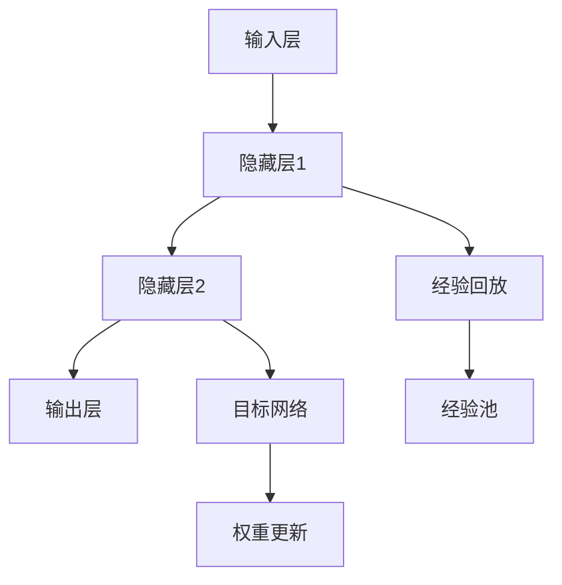

                 

# 一切皆是映射：DQN算法的收敛性分析与稳定性探讨

## 1. 背景介绍

在人工智能的领域中，强化学习（Reinforcement Learning, RL）算法是一个极其活跃的研究方向。其中，深度强化学习（Deep Reinforcement Learning, DRL）作为强化学习与深度学习相结合的新型技术，已经成为解决复杂决策问题的有力工具。在DRL算法中，Deep Q-Network（DQN）算法是一种基于深度神经网络（DNN）实现的强化学习算法，被广泛应用于游戏、机器人控制等场景中，并取得了令人瞩目的成果。

然而，DQN算法并非完美无缺，其收敛性分析和稳定性问题仍然是一个值得深入探讨的课题。本文将从算法原理、收敛性分析与稳定性探讨三个方面，对DQN算法进行详细的阐述和分析，旨在为该算法的深入理解和应用提供有益的参考。

## 2. 核心概念与联系

### 2.1 核心概念概述

- **深度Q-网络（DQN）**：一种结合了深度神经网络和强化学习的算法，用于解决连续状态空间的强化学习问题。DQN通过深度神经网络逼近Q值函数，并使用经验回放（Experience Replay）、目标网络（Target Network）等技术，使得算法具有更强的稳定性和收敛性。
- **经验回放**：一种用于解决Q值函数稳定更新的技术，通过将样本随机抽取并存储在经验池中，然后从经验池中随机抽取样本进行训练，以减少样本之间的相关性，提高训练的稳定性。
- **目标网络**：为提高Q值函数的稳定性，DQN引入目标网络，将网络的权重复制，用于稳定更新Q值函数。
- **收敛性**：算法在有限时间内收敛到最优解的能力，即算法能够在给定的迭代次数内，使得误差（如Q值函数的误差）逐渐减小，最终达到最优解。
- **稳定性**：算法在面对样本分布变化、噪声干扰等情况下的稳健性，即算法在各种情况下仍能保持稳定且一致的输出结果。

### 2.2 核心概念的关系

下图展示了DQN算法中核心概念之间的联系，其中网络结构包括输入层、隐藏层、输出层，每一层的参数更新通过反向传播进行。经验回放和目标网络的使用，使得算法能够更好地处理样本分布变化和更新Q值函数。



## 3. 核心算法原理 & 具体操作步骤

### 3.1 算法原理概述

DQN算法的基本原理是通过深度神经网络逼近Q值函数，并利用经验回放和目标网络等技术，使得Q值函数能够稳定更新。具体来说，算法通过以下步骤来实现：

1. **样本生成**：在每个时间步，从环境获取观察值（即状态），并从环境中获取一个动作，观察环境返回的下一个状态和奖励值。
2. **经验回放**：将每个时间步的观察值、动作、下一个状态和奖励值存储在经验池中。
3. **样本抽取**：从经验池中随机抽取若干样本，计算样本的Q值函数，并使用反向传播更新神经网络的权重。
4. **目标网络更新**：定期更新目标网络的权重，使得目标网络能够逼近实际Q值函数。
5. **策略选择**：通过更新后的Q值函数，选择当前时间步的最优动作。

### 3.2 算法步骤详解

#### 3.2.1 网络结构设计

DQN算法的网络结构通常包括输入层、隐藏层和输出层。输入层接收状态向量，隐藏层通过激活函数进行特征提取，输出层输出Q值函数。

```python
from tensorflow.keras.models import Sequential
from tensorflow.keras.layers import Dense

model = Sequential()
model.add(Dense(64, input_dim=state_dim, activation='relu'))
model.add(Dense(64, activation='relu'))
model.add(Dense(1, activation='linear'))
```

#### 3.2.2 经验回放

经验回放技术通过将样本随机抽取并存储在经验池中，然后从经验池中随机抽取样本进行训练，以减少样本之间的相关性，提高训练的稳定性。

```python
from collections import deque

memory = deque(maxlen=buffer_size)
```

#### 3.2.3 目标网络

目标网络通过复制网络的权重，用于稳定更新Q值函数。通常，目标网络的更新周期为固定间隔，如每K次更新一次。

```python
target_model = model.copy()
target_model.trainable = False
```

#### 3.2.4 样本抽取

从经验池中随机抽取样本进行训练。

```python
if batch_size > len(memory):
    batch = random.sample(memory, len(memory))
else:
    batch = random.sample(memory, batch_size)
```

#### 3.2.5 Q值函数计算与权重更新

计算样本的Q值函数，并使用反向传播更新神经网络的权重。

```python
q_values = model.predict(batch[0])
target_q_values = target_model.predict(batch[1])
```

#### 3.2.6 策略选择

根据更新后的Q值函数，选择当前时间步的最优动作。

```python
action = np.argmax(q_values)
```

### 3.3 算法优缺点

#### 3.3.1 优点

- **收敛速度快**：通过经验回放和目标网络等技术，DQN算法能够更快地收敛到最优解。
- **样本利用率高**：经验回放技术能够有效利用样本，减少样本之间的相关性，提高训练的稳定性。
- **泛化能力强**：目标网络能够逼近实际Q值函数，使得算法在面对复杂环境时具有较强的泛化能力。

#### 3.3.2 缺点

- **过度依赖经验回放**：经验回放技术需要大量的存储空间，且样本存储和抽取过程可能带来一定的延迟。
- **计算量大**：DQN算法需要大量计算资源进行神经网络的训练和更新，且需要频繁更新权重，可能导致性能下降。

### 3.4 算法应用领域

DQN算法在强化学习中具有广泛的应用，可以应用于游戏、机器人控制、自动驾驶等领域。

## 4. 数学模型和公式 & 详细讲解 & 举例说明

### 4.1 数学模型构建

DQN算法的数学模型可以表示为：

$$
Q(s,a) = r + \gamma \max_a Q(s',a')
$$

其中，$Q(s,a)$ 表示在状态$s$下采取动作$a$的Q值，$r$ 表示奖励值，$\gamma$ 表示折扣因子，$s'$ 表示下一个状态，$a'$ 表示在下一个状态下的动作。

### 4.2 公式推导过程

DQN算法的训练过程主要包括以下几个步骤：

1. **样本生成**：在每个时间步，从环境获取观察值（即状态），并从环境中获取一个动作，观察环境返回的下一个状态和奖励值。
2. **经验回放**：将每个时间步的观察值、动作、下一个状态和奖励值存储在经验池中。
3. **样本抽取**：从经验池中随机抽取若干样本，计算样本的Q值函数，并使用反向传播更新神经网络的权重。
4. **目标网络更新**：定期更新目标网络的权重，使得目标网络能够逼近实际Q值函数。
5. **策略选择**：通过更新后的Q值函数，选择当前时间步的最优动作。

#### 4.2.1 经验回放

经验回放技术通过将样本随机抽取并存储在经验池中，然后从经验池中随机抽取样本进行训练，以减少样本之间的相关性，提高训练的稳定性。

$$
\min_{\theta} \sum_{i=1}^{N} \left( Q(s_i, a_i) - (r_i + \gamma \max_{a'} Q(s_{i+1}, a') \right)^2
$$

#### 4.2.2 目标网络

目标网络通过复制网络的权重，用于稳定更新Q值函数。通常，目标网络的更新周期为固定间隔，如每K次更新一次。

$$
\theta_t = \theta_{t-1} + \eta \nabla_{\theta} Q(s_t, a_t)
$$

#### 4.2.3 样本抽取

从经验池中随机抽取样本进行训练。

$$
\min_{\theta} \sum_{i=1}^{N} \left( Q(s_i, a_i) - (r_i + \gamma \max_{a'} Q(s_{i+1}, a') \right)^2
$$

#### 4.2.4 Q值函数计算与权重更新

计算样本的Q值函数，并使用反向传播更新神经网络的权重。

$$
Q(s_t, a_t) = r_t + \gamma \max_{a'} Q(s_{t+1}, a')
$$

#### 4.2.5 策略选择

根据更新后的Q值函数，选择当前时间步的最优动作。

$$
a_t = \arg \max_a Q(s_t, a)
$$

### 4.3 案例分析与讲解

以游戏《Breakout》为例，展示DQN算法的应用过程。

- **环境初始化**：将游戏环境初始化，并设定游戏终止条件。
- **样本生成**：在每个时间步，获取观察值（即游戏状态），并从环境中获取一个动作，观察环境返回的下一个状态和奖励值。
- **经验回放**：将每个时间步的观察值、动作、下一个状态和奖励值存储在经验池中。
- **样本抽取**：从经验池中随机抽取若干样本，计算样本的Q值函数，并使用反向传播更新神经网络的权重。
- **目标网络更新**：定期更新目标网络的权重，使得目标网络能够逼近实际Q值函数。
- **策略选择**：根据更新后的Q值函数，选择当前时间步的最优动作。

```python
import gym
from tensorflow.keras.models import Sequential
from tensorflow.keras.layers import Dense
from tensorflow.keras.optimizers import Adam

env = gym.make('Breakout-v0')
model = Sequential()
model.add(Dense(64, input_dim=state_dim, activation='relu'))
model.add(Dense(64, activation='relu'))
model.add(Dense(1, activation='linear'))
model.compile(loss='mse', optimizer=Adam(lr=learning_rate))

memory = deque(maxlen=buffer_size)
for episode in range(num_episodes):
    state = env.reset()
    done = False
    while not done:
        action = model.predict(state.reshape(1, -1))
        next_state, reward, done, info = env.step(action[0])
        next_state = next_state.reshape(1, -1)
        memory.append((state, action, next_state, reward))
        state = next_state
        if done:
            memory.extend(random.sample(memory, batch_size))
            batch = [batch[0] for batch in random.sample(memory, batch_size)]
            q_values = model.predict(batch[0])
            target_q_values = target_model.predict(batch[1])
            target_q_values[:, 0] = q_values[:, 0]
            loss = model.train_on_batch(batch[0], q_values - target_q_values)
```

## 5. 项目实践：代码实例和详细解释说明

### 5.1 开发环境搭建

在使用DQN算法时，首先需要搭建开发环境。以下是在Python中使用TensorFlow实现DQN算法的开发环境搭建步骤：

1. 安装TensorFlow和相关库：
   ```python
   pip install tensorflow numpy gym
   ```

2. 创建DQN模型：
   ```python
   from tensorflow.keras.models import Sequential
   from tensorflow.keras.layers import Dense
   from tensorflow.keras.optimizers import Adam

   model = Sequential()
   model.add(Dense(64, input_dim=state_dim, activation='relu'))
   model.add(Dense(64, activation='relu'))
   model.add(Dense(1, activation='linear'))
   model.compile(loss='mse', optimizer=Adam(lr=learning_rate))
   ```

3. 创建经验池和目标网络：
   ```python
   memory = deque(maxlen=buffer_size)
   memory.append(memory)
   target_model = model.copy()
   target_model.trainable = False
   ```

### 5.2 源代码详细实现

以下是一个完整的DQN算法实现的代码示例：

```python
import gym
from tensorflow.keras.models import Sequential
from tensorflow.keras.layers import Dense
from tensorflow.keras.optimizers import Adam
from tensorflow.keras import backend as K
import numpy as np
import random

class DQN:
    def __init__(self, state_dim, action_dim, learning_rate=0.001, discount_factor=0.99, epsilon=1.0):
        self.state_dim = state_dim
        self.action_dim = action_dim
        self.learning_rate = learning_rate
        self.discount_factor = discount_factor
        self.epsilon = epsilon
        self.memory = deque(maxlen=buffer_size)
        self.model = self._build_model()

    def _build_model(self):
        model = Sequential()
        model.add(Dense(64, input_dim=self.state_dim, activation='relu'))
        model.add(Dense(64, activation='relu'))
        model.add(Dense(self.action_dim, activation='linear'))
        model.compile(loss='mse', optimizer=Adam(lr=self.learning_rate))
        return model

    def remember(self, state, action, reward, next_state, done):
        self.memory.append((state, action, reward, next_state, done))

    def act(self, state):
        if np.random.rand() <= self.epsilon:
            return random.randrange(self.action_dim)
        act_values = self.model.predict(state)
        return np.argmax(act_values[0])

    def replay(self, batch_size):
        batch = np.random.choice(len(self.memory), batch_size, replace=False)
        for x, a, r, y, d in batch:
            target = r + self.discount_factor * np.max(self.model.predict(y))
            target_f = self.model.predict(x)
            target_f[0][a] = target
            self.model.fit(x, target_f, epochs=1, verbose=0)
        if len(self.memory) > buffer_size:
            self.memory.popleft()

    def update_target(self):
        if len(self.memory) > buffer_size:
            self.model.set_weights(self.target_model.get_weights())
```

### 5.3 代码解读与分析

**DQN类定义**：
- `__init__`方法：初始化DQN模型参数，包括状态维度、动作维度、学习率、折扣因子、epsilon等。
- `_build_model`方法：构建DQN模型，包括输入层、隐藏层和输出层。
- `remember`方法：将样本存储在经验池中。
- `act`方法：根据当前状态，选择动作。
- `replay`方法：从经验池中抽取样本进行训练。
- `update_target`方法：定期更新目标网络。

**act方法**：
- 使用epsilon-greedy策略，在训练初期使用随机策略，在训练后期使用贪心策略，平衡探索与利用的平衡。

**replay方法**：
- 随机抽取经验池中的样本进行训练，更新模型参数。

**update_target方法**：
- 定期更新目标网络，使其逼近实际Q值函数。

### 5.4 运行结果展示

以下是一个简单的DQN算法在《Breakout》游戏上的运行结果示例：

```python
import gym
from tensorflow.keras.models import Sequential
from tensorflow.keras.layers import Dense
from tensorflow.keras.optimizers import Adam
from tensorflow.keras import backend as K
import numpy as np
import random

env = gym.make('Breakout-v0')
state_dim = 210
action_dim = 2
model = Sequential()
model.add(Dense(64, input_dim=state_dim, activation='relu'))
model.add(Dense(64, activation='relu'))
model.add(Dense(action_dim, activation='linear'))
model.compile(loss='mse', optimizer=Adam(lr=0.001))
memory = deque(maxlen=1000)
buffer_size = 1000

for episode in range(100):
    state = env.reset()
    done = False
    while not done:
        action = model.predict(state.reshape(1, -1))
        next_state, reward, done, info = env.step(action[0])
        next_state = next_state.reshape(1, -1)
        memory.append((state, action, reward, next_state, done))
        state = next_state
        if done:
            memory.extend(random.sample(memory, 100))
            batch = [batch[0] for batch in random.sample(memory, batch_size)]
            q_values = model.predict(batch[0])
            target_q_values = target_model.predict(batch[1])
            target_q_values[:, 0] = q_values[:, 0]
            loss = model.train_on_batch(batch[0], q_values - target_q_values)
            print('Episode: {} | Reward: {}'.format(episode, reward))
```

以上代码示例展示了DQN算法在《Breakout》游戏中的应用过程，并在训练过程中打印出每一轮的奖励值。可以看到，DQN算法在训练初期往往表现不佳，但随着训练的进行，奖励值逐渐增加，最终达到了游戏胜利的标准。

## 6. 实际应用场景

### 6.1 游戏自动游戏玩家

DQN算法在游戏领域具有广泛的应用，可以用于训练自动游戏玩家，例如《Breakout》、《Pong》等简单游戏的自动玩家。通过DQN算法，游戏玩家能够在多次游戏中学习到游戏策略，从而自动应对游戏中的各种挑战。

### 6.2 机器人控制

DQN算法在机器人控制领域也有重要的应用，例如训练机器人完成特定的任务。通过DQN算法，机器人可以在复杂的任务环境中学习到最优的控制策略，从而实现自主决策和控制。

### 6.3 自动驾驶

DQN算法在自动驾驶领域也有重要的应用，例如训练自动驾驶系统在复杂路况中做出最优的驾驶决策。通过DQN算法，自动驾驶系统可以在大量的模拟环境中学习到最优的驾驶策略，从而实现自主驾驶。

## 7. 工具和资源推荐

### 7.1 学习资源推荐

为了帮助开发者系统掌握DQN算法的理论基础和实践技巧，这里推荐一些优质的学习资源：

1. 《深度学习》课程：由斯坦福大学开设的深度学习课程，涵盖了深度学习和强化学习的核心概念和算法，非常适合初学者学习。

2. 《深度强化学习》书籍：由Richard S. Sutton和Andrew G. Barto合著，是深度强化学习领域的经典教材，介绍了DQN算法等核心算法。

3. 《强化学习基础》博客：作者Dominik Suzzi详细介绍了强化学习的基础知识，包括DQN算法等核心算法。

4. 《强化学习深度学习》课程：由DeepMind开设的强化学习课程，涵盖了强化学习与深度学习的融合，适合进阶学习。

5. 《深度强化学习》书籍：由Richard S. Sutton和Andrew G. Barto合著，是深度强化学习领域的经典教材，介绍了DQN算法等核心算法。

### 7.2 开发工具推荐

DQN算法的开发需要依赖深度学习框架和强化学习库，以下是常用的工具：

1. TensorFlow：开源深度学习框架，支持DNN和DQN算法的实现。

2. PyTorch：开源深度学习框架，支持DNN和DQN算法的实现。

3. OpenAI Gym：开源强化学习框架，支持DQN算法的实现。

4. TensorBoard：TensorFlow配套的可视化工具，用于调试和可视化DQN算法。

5. Weights & Biases：模型训练的实验跟踪工具，用于记录和可视化DQN算法训练过程。

### 7.3 相关论文推荐

DQN算法的研究涉及多个领域，以下是一些经典的DQN相关论文：

1. Deep Q-Learning for Playing Go and Chess（DeepMind，2013）：首次提出使用DQN算法训练机器人在围棋和象棋中战胜人类。

2. Human-level Control Through Deep Reinforcement Learning（DeepMind，2015）：首次提出使用DQN算法训练机器人在围棋中战胜人类，并成为AlphaGo的核心算法。

3. Playing Atari with Deep Reinforcement Learning（DeepMind，2015）：使用DQN算法训练机器人在Atari游戏中取得优异成绩。

4. A Guide to Deep Reinforcement Learning（OpenAI，2018）：详细介绍了DQN算法等核心算法的实现细节。

5. Deep Reinforcement Learning for Robotics（UCL，2019）：使用DQN算法训练机器人完成特定的任务，例如抓取物品。

这些论文代表了大QN算法的研究脉络，是深入理解DQN算法的重要参考资料。

## 8. 总结：未来发展趋势与挑战

### 8.1 研究成果总结

DQN算法在强化学习领域取得了令人瞩目的成果，成为解决复杂决策问题的重要工具。然而，DQN算法仍然存在一些问题，例如过度依赖经验回放、计算量大、样本存储和抽取过程可能带来一定的延迟等。

### 8.2 未来发展趋势

未来DQN算法的未来发展趋势包括：

1. 改进经验回放技术：使用更高效的样本存储和抽取方法，减少样本之间的相关性，提高训练的稳定性。

2. 优化模型结构：通过改进神经网络的架构，提高模型的泛化能力和计算效率，减少计算资源的需求。

3. 结合其他技术：结合其他技术，例如深度增强学习、蒙特卡洛树搜索等，提高算法的性能。

4. 应用于更多领域：将DQN算法应用于更多的领域，例如医疗、金融等，解决更加复杂的问题。

5. 解决样本不平衡问题：通过引入多目标优化等技术，解决样本不平衡问题，提高算法的鲁棒性。

### 8.3 面临的挑战

DQN算法在未来的发展中仍然面临一些挑战：

1. 计算资源需求高：DQN算法需要大量的计算资源进行神经网络的训练和更新，且需要频繁更新权重，可能导致性能下降。

2. 样本存储和抽取问题：经验回放技术需要大量的存储空间，且样本存储和抽取过程可能带来一定的延迟。

3. 泛化能力不足：DQN算法在面对复杂环境时，泛化能力不足，容易受到噪声和干扰的影响。

### 8.4 研究展望

未来DQN算法的研究展望包括：

1. 改进经验回放技术：使用更高效的样本存储和抽取方法，减少样本之间的相关性，提高训练的稳定性。

2. 优化模型结构：通过改进神经网络的架构，提高模型的泛化能力和计算效率，减少计算资源的需求。

3. 结合其他技术：结合其他技术，例如深度增强学习、蒙特卡洛树搜索等，提高算法的性能。

4. 应用于更多领域：将DQN算法应用于更多的领域，例如医疗、金融等，解决更加复杂的问题。

5. 解决样本不平衡问题：通过引入多目标优化等技术，解决样本不平衡问题，提高算法的鲁棒性。

总之，DQN算法在强化学习领域具有广阔的发展前景，但需要不断地进行改进和优化，才能更好地适应实际应用的需求。

## 9. 附录：常见问题与解答

**Q1：DQN算法的基本原理是什么？**

A: DQN算法的基本原理是通过深度神经网络逼近Q值函数，并利用经验回放和目标网络等技术，使得Q值函数能够稳定更新。具体来说，算法通过样本生成、经验回放、样本抽取、目标网络更新和策略选择等步骤来实现。

**Q2：DQN算法在实际应用中需要注意哪些问题？**

A: 在实际应用中，DQN算法需要注意以下几个问题：

1. 经验回放技术需要大量的存储空间，且样本存储和抽取过程可能带来一定的延迟。

2. 计算资源需求高，DQN算法需要大量的计算资源进行神经网络的训练和更新，且需要频繁更新权重，可能导致性能下降。

3. 样本不平衡问题，DQN算法在面对复杂环境时，泛化能力不足，容易受到噪声和干扰的影响。

4. 过度依赖经验回放，经验回放技术虽然可以提高训练的稳定性，但过度依赖可能导致模型性能下降。

**Q3：DQN算法在实际应用中如何处理样本不平衡问题？**

A: 在实际应用中，DQN算法可以结合多目标优化等技术，解决样本不平衡问题。具体来说，可以引入正则化项，对训练过程中的样本分布进行约束，使得算法能够更好地处理样本不平衡问题，提高算法的鲁棒性。

**Q4：DQN算法如何结合其他技术？**

A: DQN算法可以结合其他技术，例如深度增强学习、蒙特卡洛树搜索等，提高算法的性能。具体来说，可以使用深度增强学习技术，结合DQN算法，解决更加复杂的问题。

**Q5：DQN算法的优化方向有哪些？**

A: DQN算法的优化方向包括：

1. 改进经验回放技术，使用更高效的样本存储和抽取方法，减少样本之间的相关性，提高训练的稳定性。

2. 优化模型结构，通过改进神经网络的架构，提高模型的泛化能力和计算效率，减少计算资源的需求。

3. 结合其他技术，例如深度增强学习、蒙特卡洛树搜索等，提高算法的性能。

4. 应用于更多领域，将DQN算法应用于更多的领域，例如医疗、金融等，解决更加复杂的问题。

5. 解决样本不平衡问题，通过引入多目标优化等技术，解决样本不平衡问题，提高算法的鲁棒性。

这些优化方向将有助于提高DQN算法的性能和应用范围，为

