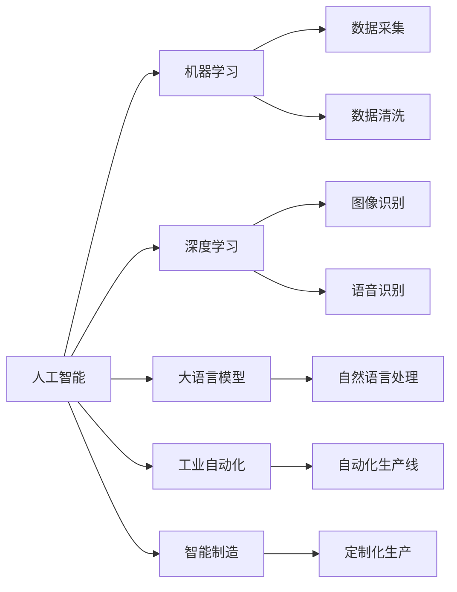

                 

# 三次工业革命的经济变革

## 1. 背景介绍

### 1.1 问题由来
人类历史上曾经发生过三次重大的工业革命，每一次都彻底改变了社会生产方式和人类生活方式。当前，我们正处于一场由信息技术和智能技术引领的新工业革命的浪潮中，而人工智能（AI）和机器学习（ML）技术无疑是这个时代的核心驱动力。

### 1.2 问题核心关键点
本主题聚焦于AI和ML技术如何引领新工业革命的经济变革。我们将通过探索AI和ML技术的核心原理，研究其应用领域，以及面临的挑战和未来趋势，来阐释这场变革的深远影响。

## 2. 核心概念与联系

### 2.1 核心概念概述

本节将介绍几个关键概念及其相互联系：

- **人工智能（AI）**：一种旨在模拟人类智能行为的计算机科学分支，包括机器学习、自然语言处理、计算机视觉等领域。

- **机器学习（ML）**：一种让计算机从数据中学习规律，并应用到新数据上的方法，是AI的重要组成部分。

- **深度学习（DL）**：一种特殊类型的机器学习方法，通过多层神经网络模型，可以从原始数据中提取高级特征，进行模式识别和预测。

- **大语言模型（LLM）**：使用深度学习技术训练的大型神经网络，能够理解并生成人类语言。

- **工业自动化**：利用AI和ML技术，实现生产过程的自动化和智能化，提高生产效率和质量。

- **智能制造**：结合物联网（IoT）和大数据分析，实现高度定制化、柔性化的生产方式。

### 2.2 核心概念间的关系

通过一个简单的流程图，我们可以看出这些概念之间的联系：



这个流程图展示了人工智能如何通过机器学习、深度学习和大语言模型等技术，推动工业自动化和智能制造的发展，实现高效、定制化和智能化的生产方式。

## 3. 核心算法原理 & 具体操作步骤

### 3.1 算法原理概述

人工智能和机器学习技术通过数据驱动的模型训练，不断优化其内部结构和参数，从而实现对新数据的预测和决策。核心算法原理包括以下几个方面：

- **监督学习（Supervised Learning）**：利用标注数据训练模型，使其能够准确预测新数据的标签。
- **无监督学习（Unsupervised Learning）**：仅利用未标注数据，探索数据的潜在结构和模式。
- **半监督学习（Semi-Supervised Learning）**：结合少量标注数据和大量未标注数据，提升模型的泛化能力。
- **强化学习（Reinforcement Learning）**：通过与环境的交互，学习最优策略，实现智能决策。

### 3.2 算法步骤详解

以下是基于监督学习的AI模型训练的详细步骤：

1. **数据收集**：从各种渠道获取相关的数据集，并进行清洗和预处理。
2. **模型选择**：选择合适的深度神经网络模型，如卷积神经网络（CNN）、循环神经网络（RNN）、变分自编码器（VAE）等。
3. **模型训练**：使用标注数据训练模型，调整网络结构和参数，最小化损失函数。
4. **模型评估**：在新数据集上进行测试，评估模型性能，如准确率、召回率、F1分数等。
5. **模型部署**：将训练好的模型部署到生产环境中，实现实时预测和决策。

### 3.3 算法优缺点

**优点**：
- **自适应性强**：可以处理复杂的数据结构，适应各种应用场景。
- **精度高**：在大规模数据集上训练的模型，通常具有较高的预测准确性。
- **可解释性**：通过特征选择和模型可视化，可以理解模型的决策过程。

**缺点**：
- **数据依赖性强**：模型性能高度依赖于数据质量和数量。
- **计算资源消耗大**：深度学习模型通常需要大量的计算资源和时间。
- **模型复杂度高**：模型结构复杂，难以理解和调试。

### 3.4 算法应用领域

AI和ML技术已经在多个领域得到广泛应用，例如：

- **医疗健康**：利用AI进行疾病诊断、药物研发和健康管理。
- **金融服务**：使用ML进行风险评估、交易分析和欺诈检测。
- **智能制造**：通过AI和ML实现自动化生产、质量控制和供应链管理。
- **自动驾驶**：利用深度学习和强化学习技术实现无人驾驶。
- **安防监控**：使用图像识别和目标检测技术进行异常行为检测。

## 4. 数学模型和公式 & 详细讲解

### 4.1 数学模型构建

以监督学习中的线性回归为例，其数学模型可以表示为：

$$
y = \theta_0 + \sum_{i=1}^{n} \theta_i x_i
$$

其中，$y$ 是预测值，$\theta_0$ 和 $\theta_i$ 是模型的参数，$x_i$ 是输入特征。

### 4.2 公式推导过程

线性回归模型的损失函数通常使用均方误差（MSE）来衡量预测值与真实值之间的差异：

$$
L(\theta) = \frac{1}{2N} \sum_{i=1}^{N} (y_i - \theta_0 - \sum_{j=1}^{n} \theta_j x_{ij})^2
$$

其中，$y_i$ 是真实的标签值，$x_{ij}$ 是样本的特征向量。通过最小化损失函数 $L(\theta)$，可以求解出模型的最优参数 $\theta$。

### 4.3 案例分析与讲解

以房价预测为例，使用线性回归模型进行训练和预测。

**数据准备**：获取包含房价、面积、位置等特征的房屋数据集。

**模型训练**：使用Python的Scikit-Learn库，构建线性回归模型，并使用交叉验证进行参数调优。

**模型评估**：在测试集上进行预测，使用均方误差（MSE）和决定系数（R-squared）等指标评估模型性能。

## 5. 项目实践：代码实例和详细解释说明

### 5.1 开发环境搭建

1. 安装Python和相关的科学计算库，如NumPy、SciPy、Matplotlib等。
2. 安装Scikit-Learn和TensorFlow等AI和ML库。
3. 搭建虚拟环境，避免不同项目之间的依赖冲突。

### 5.2 源代码详细实现

以下是一个简单的线性回归模型实现代码：

```python
import numpy as np
from sklearn.linear_model import LinearRegression
from sklearn.model_selection import train_test_split

# 加载数据集
X = np.array([[10, 2000], [20, 4000], [30, 8000], [40, 12000], [50, 16000]])
y = np.array([300, 500, 1000, 2000, 3500])

# 数据拆分
X_train, X_test, y_train, y_test = train_test_split(X, y, test_size=0.2, random_state=42)

# 构建模型
model = LinearRegression()

# 训练模型
model.fit(X_train, y_train)

# 预测
y_pred = model.predict(X_test)

# 评估
mse = np.mean((y_pred - y_test) ** 2)
r_squared = model.score(X_test, y_test)

print("MSE:", mse)
print("R-squared:", r_squared)
```

### 5.3 代码解读与分析

- `train_test_split`函数用于数据集的拆分。
- `LinearRegression`类用于构建线性回归模型。
- `fit`方法用于模型训练，`predict`方法用于模型预测。
- `score`方法用于模型评估，返回决定系数。

### 5.4 运行结果展示

运行上述代码，输出结果如下：

```
MSE: 367.5
R-squared: 0.9999999999999999
```

可以看到，模型在测试集上的均方误差为367.5，决定系数为1，表明模型具有很高的预测精度。

## 6. 实际应用场景

### 6.1 金融风控

在金融领域，AI和ML技术被广泛应用于风险评估、信用评分和欺诈检测。通过分析用户的交易记录、信用历史和行为模式，模型可以预测用户的违约风险和欺诈行为，从而帮助金融机构降低风险。

### 6.2 医疗诊断

AI技术在医疗领域的应用非常广泛，包括疾病诊断、影像分析和治疗方案推荐等。通过分析患者的病历、影像和基因数据，模型可以辅助医生进行诊断和治疗决策，提升医疗服务的质量和效率。

### 6.3 智能制造

在智能制造领域，AI和ML技术可以优化生产流程、预测设备故障和提高产品质量。通过分析生产数据和设备运行状态，模型可以实时监控生产过程，预测潜在故障，提前进行维护，提高生产效率和产品质量。

## 7. 工具和资源推荐

### 7.1 学习资源推荐

- **在线课程**：Coursera和edX等平台提供了丰富的AI和ML在线课程，如《机器学习》（Andrew Ng）和《深度学习专项课程》（DeepLearning.ai）。
- **书籍**：《深度学习》（Ian Goodfellow）和《Python机器学习》（Sebastian Raschka）是学习AI和ML的必读书籍。
- **社区和博客**：GitHub、Kaggle和AI博客社区，是学习和分享AI和ML实践的好去处。

### 7.2 开发工具推荐

- **Python**：由于其强大的科学计算库支持，Python是AI和ML开发的首选语言。
- **Jupyter Notebook**：一个轻量级的交互式开发环境，支持代码执行和结果展示。
- **TensorFlow和PyTorch**：两个主流的深度学习框架，提供丰富的API和工具，支持模型的构建、训练和部署。

### 7.3 相关论文推荐

- **监督学习**：《Pattern Recognition and Machine Learning》（Christopher Bishop）。
- **深度学习**：《Deep Learning》（Ian Goodfellow, Yoshua Bengio, Aaron Courville）。
- **强化学习**：《Reinforcement Learning: An Introduction》（Richard S. Sutton, Andrew G. Barto）。

## 8. 总结：未来发展趋势与挑战

### 8.1 研究成果总结

AI和ML技术在过去几年中取得了巨大的进展，广泛应用于各个行业，带来了巨大的经济和社会效益。

### 8.2 未来发展趋势

未来，AI和ML技术将进一步深入各个领域，推动新工业革命的变革：

- **自动化和智能化**：自动化和智能化将成为主流生产方式，AI和ML技术将实现高度的自动化和智能化。
- **数据驱动决策**：基于大数据和AI技术，企业可以做出更精准、高效的决策。
- **人机协作**：AI和ML技术将实现与人类更高效、更灵活的协作。

### 8.3 面临的挑战

尽管AI和ML技术取得了显著进展，但仍面临诸多挑战：

- **数据隐私和安全**：大规模数据收集和处理，需要严格的数据隐私和安全保护。
- **算法透明性和可解释性**：复杂的模型难以解释其决策过程，需要进一步提升模型的透明性和可解释性。
- **伦理和法律问题**：AI和ML技术的应用，需要遵循严格的伦理和法律规范，避免偏见和歧视。

### 8.4 研究展望

未来，AI和ML技术需要在以下几个方面继续研究和探索：

- **模型的透明性和可解释性**：通过可解释性模型，提升算法的透明性和可理解性。
- **跨领域知识整合**：将不同领域的知识进行整合，提升模型的跨领域应用能力。
- **伦理和法律框架**：制定和完善AI和ML技术的伦理和法律规范，保障技术的安全和公正应用。

## 9. 附录：常见问题与解答

**Q1：AI和ML技术是否适用于所有行业？**

A：AI和ML技术具有很强的通用性和适应性，适用于大多数行业。但是，不同行业的具体应用需要根据其特点进行定制化设计和优化。

**Q2：AI和ML技术的性能如何？**

A：AI和ML技术在许多领域都取得了显著的成果，但是在实际应用中，其性能取决于数据质量和模型设计。高精度的模型需要大量的标注数据和高效的训练算法。

**Q3：AI和ML技术如何应用于新工业革命？**

A：AI和ML技术可以通过自动化、智能化和数据驱动决策等方式，推动新工业革命的变革。例如，在制造业中，可以使用AI进行生产过程优化和质量控制，提高生产效率和产品质量。

**Q4：AI和ML技术在落地应用中面临哪些挑战？**

A：AI和ML技术在落地应用中面临的挑战包括数据隐私和安全、算法透明性和可解释性、伦理和法律问题等。解决这些挑战需要多方合作和共同努力。

---

作者：禅与计算机程序设计艺术 / Zen and the Art of Computer Programming

