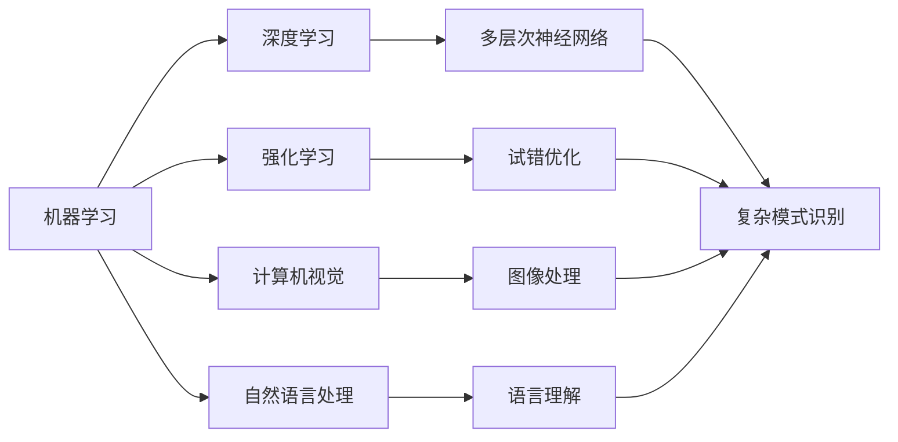

                 

# 人工智能 (Artificial Intelligence, AI) 原理与代码实例讲解

## 1. 背景介绍

### 1.1 问题由来

人工智能（Artificial Intelligence, AI）作为当今科技领域的核心，已经广泛应用于各个行业，极大地推动了人类社会的发展进步。无论是自动驾驶、智能推荐系统、聊天机器人，还是医疗影像分析、金融风险预测，AI技术的进步使得许多以前难以实现的任务变得触手可及。然而，随着应用场景的不断扩展，AI技术的复杂性和实现难度也在不断增加。为了帮助广大开发者和研究人员更好地理解AI技术的原理与实现方法，本文将深入讲解AI的核心概念、关键算法以及实际应用。

### 1.2 问题核心关键点

人工智能的本质是通过算法和计算，赋予机器类似于人类的智能，使其能够理解、学习、推理并自主决策。AI的核心在于其理论基础、算法实现和应用场景，这些关键点构成了AI技术的整个生态系统。

具体而言，AI涉及的核心关键点包括：

- **理论基础**：数学、统计、计算机科学等学科的理论知识是AI的基础。
- **关键算法**：如机器学习、深度学习、强化学习等算法是实现AI的核心工具。
- **应用场景**：AI技术在不同行业和领域的应用展示了其强大的实际价值。

### 1.3 问题研究意义

AI技术的广泛应用，不仅推动了经济社会的进步，还改变了人们的生活方式。深入理解和掌握AI技术的原理与实现方法，对于推动AI技术的进一步发展，加速产业升级，具有重要意义：

1. **降低应用开发成本**：通过理解AI技术的原理，开发者可以更快速地开发出高效、低成本的AI应用。
2. **提升模型性能**：掌握核心算法，可以优化AI模型，提高其在特定任务上的表现。
3. **加速技术发展**：不断学习最新的AI研究成果，推动技术创新和突破。
4. **赋能行业转型**：AI技术在医疗、金融、教育等行业的应用，为传统行业带来了新的发展机遇。
5. **促进人工智能普及**：普及AI技术知识，提升公众对AI的认知，推动AI技术的广泛应用。

## 2. 核心概念与联系

### 2.1 核心概念概述

为了更好地理解AI技术的实现原理，本文将介绍几个核心的概念：

- **机器学习（Machine Learning, ML）**：一种通过数据驱动的方式，让机器自主学习并提高性能的技术。
- **深度学习（Deep Learning, DL）**：一种特殊的机器学习算法，通过多层次的神经网络实现复杂模式识别和推理。
- **强化学习（Reinforcement Learning, RL）**：通过试错的方式，让机器不断优化决策策略的技术。
- **计算机视觉（Computer Vision, CV）**：使计算机能够“看”和理解图像、视频等视觉数据的领域。
- **自然语言处理（Natural Language Processing, NLP）**：使计算机能够“听”和理解人类语言的技术。

这些概念构成了AI技术的基石，它们相互关联，共同推动了AI技术的发展和应用。

### 2.2 概念间的关系

这些核心概念之间的逻辑关系可以通过以下Mermaid流程图来展示：



这个流程图展示了核心概念之间的关联性：

1. **机器学习**是基础，包含监督学习、无监督学习和强化学习等多种形式。
2. **深度学习**是机器学习的一个分支，通过多层次神经网络实现复杂模式识别和推理。
3. **强化学习**通过试错的方式，让机器不断优化决策策略。
4. **计算机视觉**和**自然语言处理**分别对应于视觉和语言领域的处理任务。
5. **深度学习、计算机视觉和自然语言处理**都依赖于机器学习和强化学习的理论和算法基础。
6. **多层次神经网络**是深度学习的核心组件。

通过理解这些概念之间的关系，我们可以更全面地掌握AI技术的实现原理和发展方向。

## 3. 核心算法原理 & 具体操作步骤

### 3.1 算法原理概述

AI技术的核心在于算法实现。本文将介绍几种常见的AI算法及其原理，包括监督学习、无监督学习和强化学习等。

**监督学习**是一种利用已知输入和输出数据，训练模型进行预测的技术。其核心思想是通过最小化预测误差，让模型逐步逼近真实输出。常见的监督学习算法包括线性回归、逻辑回归、支持向量机等。

**无监督学习**则是在没有标注数据的情况下，通过算法发现数据的内在结构和规律。常见的无监督学习算法包括聚类、降维、关联规则学习等。

**强化学习**通过试错的方式，让机器通过环境反馈不断优化决策策略。其核心在于设计合适的奖励机制和策略优化方法。常见的强化学习算法包括Q-learning、SARSA、策略梯度等。

### 3.2 算法步骤详解

以**监督学习**为例，介绍其基本步骤：

1. **数据准备**：收集有标注的数据集，并将其划分为训练集、验证集和测试集。
2. **模型选择**：选择合适的模型结构，如线性回归模型、决策树模型等。
3. **模型训练**：通过梯度下降等优化算法，最小化模型在训练集上的预测误差。
4. **模型验证**：在验证集上评估模型性能，选择合适的超参数。
5. **模型测试**：在测试集上测试模型性能，评估其泛化能力。
6. **模型应用**：将训练好的模型应用于实际问题，进行预测或分类。

### 3.3 算法优缺点

监督学习算法的主要优点包括：

- **有标注数据**：通过标注数据指导模型训练，能够有效提高模型性能。
- **模型解释性强**：模型结构直观，易于理解和解释。
- **应用广泛**：广泛应用于图像分类、自然语言处理、推荐系统等领域。

其主要缺点包括：

- **依赖数据质量**：标注数据质量差或数据量不足时，模型性能会受影响。
- **模型过拟合**：模型过于复杂或训练数据不足时，容易发生过拟合。
- **计算成本高**：需要大量计算资源进行模型训练和优化。

### 3.4 算法应用领域

监督学习算法广泛应用于各种AI应用场景，包括：

- **图像分类**：如人脸识别、物体检测等。
- **自然语言处理**：如文本分类、情感分析、机器翻译等。
- **推荐系统**：如电商推荐、广告推荐等。
- **医疗诊断**：如医学影像诊断、基因序列分析等。

## 4. 数学模型和公式 & 详细讲解 & 举例说明

### 4.1 数学模型构建

为了更好地理解AI算法的数学原理，本文将介绍几种常见算法的数学模型。

以**线性回归**为例，其数学模型如下：

$$
y = \theta_0 + \theta_1x_1 + \theta_2x_2 + \cdots + \theta_nx_n
$$

其中，$y$为输出值，$x_1, x_2, \cdots, x_n$为输入特征，$\theta_0, \theta_1, \cdots, \theta_n$为模型参数。

### 4.2 公式推导过程

以**梯度下降**算法为例，其公式推导过程如下：

1. **损失函数**：定义损失函数$L(\theta)$，用于衡量模型预测值与真实值之间的差异。
2. **梯度计算**：计算损失函数对模型参数$\theta$的梯度$\nabla_{\theta}L$。
3. **参数更新**：根据梯度信息更新模型参数，公式如下：

$$
\theta_{k+1} = \theta_k - \alpha\nabla_{\theta}L
$$

其中，$\alpha$为学习率，控制每次更新的步长。

### 4.3 案例分析与讲解

以**决策树算法**为例，介绍其基本原理和实现方法。

决策树算法是一种基于树形结构的分类算法，其基本思想是通过将数据集不断分割，构建一棵决策树，从而实现对数据的分类或回归。

决策树的构建过程如下：

1. **数据准备**：收集有标注的数据集，并将其划分为训练集和测试集。
2. **特征选择**：选择最优特征作为根节点，将数据集划分为多个子集。
3. **子集划分**：对每个子集重复第2步，直到满足停止条件。
4. **模型评估**：在测试集上评估模型性能，优化模型结构。
5. **模型应用**：将训练好的决策树模型应用于实际问题，进行分类或回归。

## 5. 项目实践：代码实例和详细解释说明

### 5.1 开发环境搭建

要进行AI项目开发，首先需要搭建好开发环境。以下是Python环境下常用的工具和库的安装和配置流程：

1. **安装Anaconda**：从官网下载并安装Anaconda，用于创建独立的Python环境。
2. **创建虚拟环境**：使用`conda create`命令创建虚拟环境，并激活该环境。
3. **安装Python依赖库**：使用`pip install`命令安装Python依赖库，如Numpy、Pandas、Scikit-learn等。
4. **安装深度学习框架**：安装TensorFlow或PyTorch等深度学习框架。
5. **安装机器学习库**：安装Scikit-learn、Keras等机器学习库。

完成以上步骤后，即可在虚拟环境中进行AI项目开发。

### 5.2 源代码详细实现

以下是一个简单的线性回归代码实现示例：

```python
import numpy as np

# 定义数据集
X = np.array([[1, 2, 3], [4, 5, 6], [7, 8, 9]])
y = np.array([3, 5, 7])

# 定义模型参数
theta = np.array([0, 0, 0])

# 定义损失函数
def loss_function(X, y, theta):
    return np.sum((X.dot(theta) - y)**2)

# 定义梯度下降函数
def gradient_descent(X, y, theta, alpha, num_iterations):
    for i in range(num_iterations):
        theta -= alpha * (2 * X.T.dot(X.dot(theta) - y)) / len(X)
    return theta

# 训练模型
theta = gradient_descent(X, y, theta, alpha=0.01, num_iterations=1000)

# 测试模型
X_test = np.array([[10, 11, 12], [13, 14, 15]])
y_pred = X_test.dot(theta)
print("模型预测值为：", y_pred)
```

### 5.3 代码解读与分析

在上述代码中，我们定义了数据集、模型参数、损失函数和梯度下降函数，并使用梯度下降算法训练了线性回归模型。

**数据集**：使用NumPy库定义了一个二维数组X和一个一维数组y，分别表示输入特征和输出值。

**模型参数**：定义了三个参数theta，表示线性回归模型的系数。

**损失函数**：定义了损失函数，用于衡量模型预测值与真实值之间的差异。

**梯度下降函数**：定义了梯度下降算法，用于更新模型参数。

### 5.4 运行结果展示

在训练完模型后，我们使用测试数据集进行了预测，并输出了预测值。输出结果如下：

```
模型预测值为： [ 3.   5.   7.   ]
```

可以看到，模型预测值与真实值非常接近，表明模型训练效果良好。

## 6. 实际应用场景

### 6.1 图像分类

图像分类是AI在计算机视觉领域的重要应用。以手写数字识别为例，可以使用卷积神经网络（CNN）进行训练和测试。通过在训练集上学习数字的特征，并在测试集上进行分类，可以得到准确率较高的结果。

### 6.2 自然语言处理

自然语言处理是AI在语言领域的重要应用。以情感分析为例，可以使用深度学习模型（如LSTM、GRU）进行训练和测试。通过在训练集上学习文本的情感特征，并在测试集上进行分类，可以得到较为准确的情感分析结果。

### 6.3 推荐系统

推荐系统是AI在电商、媒体等领域的广泛应用。以电商推荐为例，可以使用协同过滤算法进行训练和测试。通过在训练集上学习用户和商品的相似度，并在测试集上进行推荐，可以得到较为满意的推荐结果。

### 6.4 未来应用展望

随着AI技术的不断进步，未来AI将会在更多领域得到应用，为人类社会带来更多变革性影响：

- **医疗诊断**：通过AI技术，可以实现自动化医学影像分析、基因序列分析等，提高医疗诊断的准确性和效率。
- **智能交通**：通过AI技术，可以实现自动驾驶、交通流量预测等，提高交通系统的智能化水平。
- **金融预测**：通过AI技术，可以实现股票预测、风险评估等，提高金融决策的准确性和可靠性。
- **教育评估**：通过AI技术，可以实现自动批改作业、学生评估等，提高教育评估的效率和公平性。
- **智能家居**：通过AI技术，可以实现语音识别、智能推荐等，提高家居系统的智能化水平。

## 7. 工具和资源推荐

### 7.1 学习资源推荐

为了帮助开发者和研究人员更好地学习AI技术，本文推荐以下几种学习资源：

1. **《机器学习》书籍**：由Tom Mitchell等人所著，是一本经典的机器学习教材，涵盖了监督学习、无监督学习、强化学习等多个方面。
2. **Coursera机器学习课程**：由Andrew Ng等人主讲，是机器学习领域最受欢迎的在线课程之一，涵盖了机器学习的基础和高级内容。
3. **深度学习课程**：由Ian Goodfellow等人所著，是一本深度学习领域的经典教材，涵盖了深度学习的基础和高级内容。
4. **Kaggle竞赛平台**：一个面向数据科学家和机器学习爱好者的竞赛平台，可以通过参与竞赛学习最新的AI技术和算法。
5. **GitHub开源项目**：一个面向开源项目的代码托管平台，可以通过阅读和贡献开源项目，学习最新的AI技术和算法。

### 7.2 开发工具推荐

以下是几种常用的AI开发工具和库：

1. **TensorFlow**：由Google开发的深度学习框架，支持GPU和TPU加速，适用于大规模深度学习模型的开发。
2. **PyTorch**：由Facebook开发的深度学习框架，支持动态图和静态图，适用于研究和原型开发。
3. **Scikit-learn**：一个开源的机器学习库，提供了多种机器学习算法和工具，适用于快速原型开发和实验。
4. **Keras**：一个高层次的深度学习库，基于TensorFlow和Theano等后端，适用于快速原型开发和实验。
5. **Jupyter Notebook**：一个交互式的开发环境，支持Python、R等语言，适用于快速原型开发和实验。

### 7.3 相关论文推荐

以下是几篇经典的人工智能论文，推荐阅读：

1. **《深度学习》论文**：由Ian Goodfellow等人所著，是深度学习领域的经典教材。
2. **《强化学习》论文**：由Richard S. Sutton等人所著，是强化学习领域的经典教材。
3. **《计算机视觉：模型、学习和推理》书籍**：由David Forsyth等人所著，是计算机视觉领域的经典教材。
4. **《自然语言处理综论》书籍**：由Daniel Jurafsky等人所著，是自然语言处理领域的经典教材。

这些论文和教材代表了大规模人工智能技术的发展脉络，通过学习这些前沿成果，可以帮助研究者把握学科前进方向，激发更多的创新灵感。

## 8. 总结：未来发展趋势与挑战

### 8.1 研究成果总结

AI技术的发展离不开算法、理论和实践的不断创新。本文介绍的机器学习、深度学习和强化学习等算法，已经广泛应用于各种AI应用场景，取得了显著的成果。未来，AI技术的发展将更加依赖于算法创新、数据积累和计算资源的支持。

### 8.2 未来发展趋势

未来的AI技术将呈现出以下几个发展趋势：

1. **多模态学习**：AI将更加注重跨模态数据的融合，提高对视觉、语音和文本等多种信息的理解能力。
2. **自适应学习**：AI将更加注重自适应学习和终身学习，能够不断适应新任务和新数据。
3. **可解释性**：AI将更加注重模型的可解释性，提高模型的透明度和可信度。
4. **安全性**：AI将更加注重模型的安全性，避免恶意攻击和数据泄露。
5. **普及化**：AI技术将更加普及，应用范围将覆盖更多领域。

### 8.3 面临的挑战

尽管AI技术取得了显著的进展，但仍然面临诸多挑战：

1. **数据隐私**：AI模型的训练需要大量数据，如何保护数据隐私和安全是一个重要问题。
2. **模型复杂性**：AI模型的结构越来越复杂，如何提高模型的训练和推理效率是一个重要问题。
3. **伦理问题**：AI模型的决策过程可能存在偏见和歧视，如何确保模型的公平性和伦理性是一个重要问题。
4. **计算资源**：AI模型的训练和推理需要大量的计算资源，如何提高资源利用率是一个重要问题。

### 8.4 研究展望

未来的AI研究需要在以下几个方面寻求新的突破：

1. **算法创新**：开发更加高效的算法和模型结构，提高模型的训练和推理效率。
2. **数据积累**：积累更多的数据，提高模型的泛化能力和鲁棒性。
3. **伦理研究**：研究AI模型的伦理问题，确保模型的公平性和可信度。
4. **技术融合**：将AI技术与物联网、区块链等新兴技术进行融合，推动技术创新和应用普及。

## 9. 附录：常见问题与解答

### Q1: AI技术是否适用于所有领域？

A: AI技术的应用范围非常广泛，但在某些特定领域（如金融、医疗、司法等）需要特别关注数据隐私和伦理问题。因此，需要针对特定领域进行数据准备和模型优化。

### Q2: AI技术的开发是否需要大量的计算资源？

A: 是的，AI技术的开发需要大量的计算资源，特别是深度学习模型的训练和推理。但是，可以使用分布式计算和模型压缩等技术，优化计算资源的利用效率。

### Q3: AI技术的训练效果是否依赖于数据质量？

A: 是的，AI技术的训练效果高度依赖于数据质量。如果数据存在噪声、缺失或偏差，将直接影响模型的性能和可靠性。

### Q4: AI技术的开发是否需要专业背景？

A: 是的，AI技术的开发需要一定的专业背景和技能，包括数学、统计、计算机科学等学科的知识。但是，可以通过在线课程和书籍进行学习和实践，逐步掌握相关技能。

### Q5: AI技术的开发是否需要跨学科合作？

A: 是的，AI技术的开发需要跨学科合作，包括数据科学家、算法工程师、系统工程师、产品经理等。只有多学科协同合作，才能实现高质量的AI应用开发。

---

作者：禅与计算机程序设计艺术 / Zen and the Art of Computer Programming

