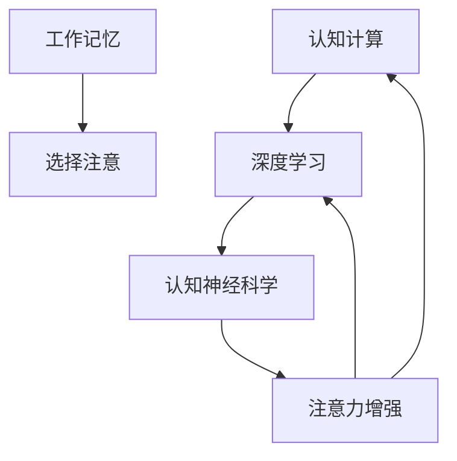
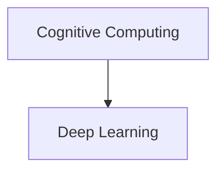
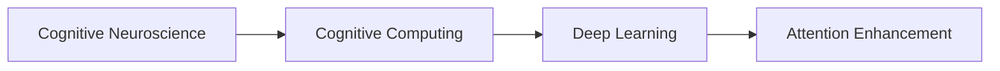
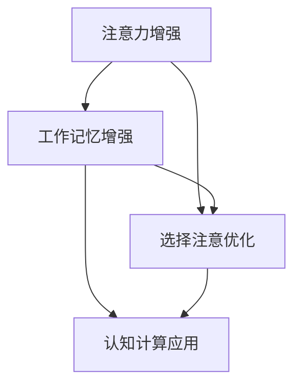
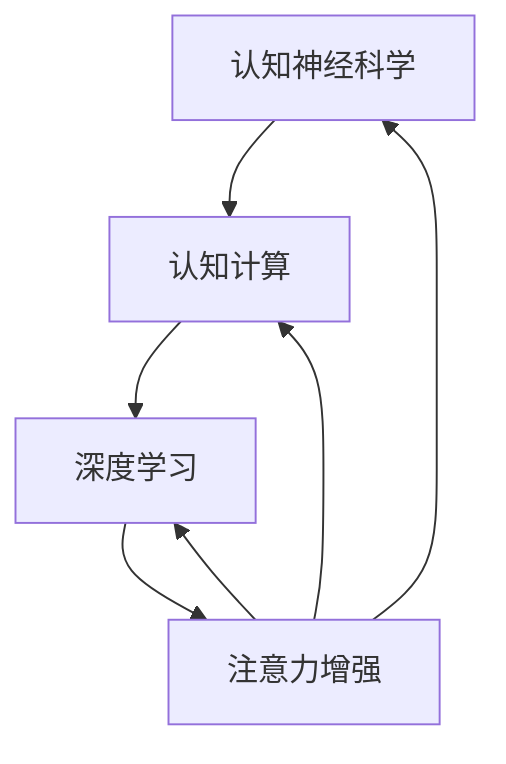

                 

# 人类注意力增强：提升创新能力和创造力的方法

> 关键词：人类注意力增强,创新能力,创造力,人工智能,认知神经科学

## 1. 背景介绍

### 1.1 问题由来

在现代快节奏的社会生活中，人们的注意力资源变得稀缺而宝贵。无论是在工作学习中，还是在个人生活娱乐中，如何高效利用有限注意力资源，提升个人认知能力，成为了一个越来越重要的话题。随着人工智能技术的不断进步，特别是深度学习、认知计算等领域的快速发展，人们开始探索通过技术手段增强人类注意力，以提升个人创新能力和创造力。

### 1.2 问题核心关键点

人类注意力增强的核心问题是如何通过技术手段，改善和提升人类在信息处理、决策制定、创造性思维等方面的认知能力。研究表明，人类注意力可以被分为“工作记忆”和“选择注意”两大系统：

1. **工作记忆(Working Memory)**：指个体在处理信息时的短期记忆能力，包括注意力保持和注意力切换。
2. **选择注意(Selective Attention)**：指个体在复杂环境中筛选重要信息、忽略无关信息的能力。

这两个系统协同工作，构成了人类注意力机制的基础。因此，提升工作记忆和选择注意的能力，是增强人类认知的关键。

### 1.3 问题研究意义

1. **工作效率提升**：增强工作记忆能力，可以提升处理多任务和复杂信息的能力，减少认知负荷，提高工作效率。
2. **决策能力改善**：通过提升选择注意，增强对重要信息的识别和筛选能力，提高决策质量和准确性。
3. **创新思维激发**：优化选择注意和工作记忆机制，可以激发更多元、更全面的思维模式，促进创新和创造。
4. **心理健康维护**：缓解注意力资源紧张带来的焦虑、压力等心理问题，提升生活质量。

## 2. 核心概念与联系

### 2.1 核心概念概述

为更好地理解人类注意力增强的原理和实现方法，本文将介绍几个关键概念：

- **工作记忆(Working Memory)**：指个体在短时间内保存和操作信息的能力，主要包括“保持”和“切换”两个方面。
- **选择注意(Selective Attention)**：指个体在复杂环境中，有选择性地聚焦于重要信息的能力。
- **认知计算(Cognitive Computing)**：指使用计算机模拟和优化人类认知过程，特别是注意力、学习、推理等认知功能的计算模型。
- **深度学习(Deep Learning)**：一种基于神经网络的学习范式，通过多层非线性变换，可以捕捉数据中的复杂关系。
- **认知神经科学(Cognitive Neuroscience)**：研究人类大脑如何处理信息、形成记忆、进行推理等认知过程的科学。
- **注意力增强(Agent Attention Enhancement)**：通过技术手段，增强个体在工作记忆和选择注意方面的能力，提升其认知效率和创造力。

这些概念之间的逻辑关系可以通过以下Mermaid流程图来展示：



这个流程图展示了人类注意力增强的基本概念及其之间的关系：

1. 工作记忆和选择注意是认知能力的基础。
2. 认知计算和深度学习是模拟和优化人类认知过程的技术手段。
3. 认知神经科学揭示了人类大脑的认知机制。
4. 注意力增强通过提升工作记忆和选择注意，优化认知过程。

### 2.2 概念间的关系

这些核心概念之间存在着紧密的联系，形成了认知增强的完整生态系统。下面我们通过几个Mermaid流程图来展示这些概念之间的关系。

#### 2.2.1 认知计算与深度学习的关系



这个流程图展示了认知计算和深度学习的基本关系。认知计算通过深度学习模型来模拟和优化人类认知过程，而深度学习模型则利用神经网络结构，捕捉数据中的复杂关系。

#### 2.2.2 认知神经科学的应用



这个流程图展示了认知神经科学、认知计算和深度学习在注意力增强中的应用。认知神经科学揭示了人类认知机制，认知计算和深度学习则利用这些知识，设计出更加智能化的认知增强系统。

#### 2.2.3 注意力增强的实现



这个流程图展示了注意力增强的基本实现过程。通过增强工作记忆和优化选择注意，可以提高个体在复杂环境中的认知效率和创造力。

### 2.3 核心概念的整体架构

最后，我们用一个综合的流程图来展示这些核心概念在大语言模型微调过程中的整体架构：



这个综合流程图展示了从认知神经科学、认知计算到深度学习、注意力增强的完整过程。

## 3. 核心算法原理 & 具体操作步骤

### 3.1 算法原理概述

人类注意力增强的本质是通过技术手段，优化人类认知过程中的工作记忆和选择注意机制，提升个体的认知效率和创造力。其核心算法原理可以概括为以下几个步骤：

1. **数据采集与预处理**：收集个体的认知行为数据，包括注意力保持时间、注意力切换频率、信息处理速度等，并通过预处理技术进行清洗和标准化。
2. **认知模型建立**：基于认知神经科学和心理学研究，建立人类认知过程的计算模型，特别是工作记忆和选择注意的模拟模型。
3. **深度学习模型训练**：使用深度学习模型，对采集的数据进行训练，优化认知模型的参数，使其能够更准确地预测个体认知表现。
4. **注意力增强技术应用**：结合认知模型和深度学习模型，设计具体的注意力增强技术，如记忆辅助、注意力引导等，提升个体的工作记忆和选择注意能力。

### 3.2 算法步骤详解

下面详细介绍基于深度学习的认知增强算法的具体步骤：

**Step 1: 数据采集与预处理**

1. **行为数据采集**：
   - 使用眼动仪、脑电波(EEG)等设备，实时记录个体的注意力行为数据。
   - 通过问卷调查等形式，收集个体对注意力任务的主观感受和反馈。
2. **数据清洗与标准化**：
   - 去除噪声和异常值，确保数据的准确性和可靠性。
   - 对数据进行标准化处理，使其在不同个体和不同任务间具有可比性。

**Step 2: 认知模型建立**

1. **模型选择与设计**：
   - 根据认知神经科学的研究，选择合适的工作记忆和选择注意模型。
   - 设计模型的架构，包括层数、节点数、激活函数等，确保模型具有足够的表达能力。
2. **参数初始化**：
   - 使用经验初始化或随机初始化，对模型的权重参数进行初始化。
   - 通过正则化技术，如L1、L2正则，防止过拟合。

**Step 3: 深度学习模型训练**

1. **数据划分**：
   - 将数据划分为训练集、验证集和测试集，确保模型的泛化能力。
   - 采用交叉验证等技术，提高模型的鲁棒性。
2. **模型训练**：
   - 使用梯度下降等优化算法，训练认知模型。
   - 在训练过程中，通过早停法(Early Stopping)等技术，防止过拟合。
3. **模型评估**：
   - 使用验证集对模型进行评估，选择最优模型进行测试。
   - 评估指标包括注意力保持时间、切换频率、信息处理速度等。

**Step 4: 注意力增强技术应用**

1. **注意力保持增强**：
   - 使用长短期记忆网络(LSTM)等模型，训练记忆辅助算法，增强个体在工作记忆保持方面的能力。
   - 设计记忆提示策略，如分块记忆、间隔复习等，提升记忆效果。
2. **注意力切换优化**：
   - 使用注意力机制，如自适应神经网络(Adaptive Neural Network)等，优化个体在选择注意切换方面的能力。
   - 设计切换策略，如顺序切换、随机切换等，提高注意力转换效率。
3. **认知反馈与调整**：
   - 收集个体对认知增强技术的反馈，进行动态调整。
   - 使用强化学习等技术，逐步优化增强算法，提高效果。

### 3.3 算法优缺点

人类注意力增强算法具有以下优点：

1. **高效性**：通过深度学习模型，可以快速处理大量行为数据，并优化注意力机制，提高认知效率。
2. **可解释性**：通过认知计算和认知神经科学原理，可以对增强技术进行理论解释，增加可信度。
3. **通用性**：认知模型和增强算法可以在不同任务和领域中推广应用，具有广泛的适用性。

同时，该算法也存在一些缺点：

1. **数据需求高**：需要大量的行为数据进行训练，数据采集和处理成本较高。
2. **模型复杂**：深度学习模型的复杂性，可能导致过度拟合，影响泛化能力。
3. **个性化问题**：个体的认知特点存在差异，单一的通用算法可能无法完全适配所有个体。

### 3.4 算法应用领域

人类注意力增强算法在多个领域中都有广泛的应用前景：

- **教育培训**：通过认知增强技术，提升学生的注意力保持和切换能力，提高学习效率和成绩。
- **企业培训**：帮助职场人士提升注意力集中和任务切换能力，提高工作效率和创新能力。
- **医疗康复**：通过记忆辅助和注意力引导，帮助注意力障碍患者恢复认知能力，促进康复。
- **娱乐应用**：通过优化注意力机制，提高用户的娱乐体验，如游戏、影视、阅读等。

## 4. 数学模型和公式 & 详细讲解 & 举例说明

### 4.1 数学模型构建

基于深度学习的认知增强算法可以构建如下数学模型：

假设个体的注意力保持时间为 $X$，注意力切换频率为 $Y$，信息处理速度为 $Z$。建立以下模型：

$$
\begin{aligned}
X & = f_W(X_{in}, \theta_W) + \epsilon \\
Y & = f_B(Y_{in}, \theta_B) + \delta \\
Z & = g_Z(Z_{in}, \theta_Z)
\end{aligned}
$$

其中，$X_{in}$、$Y_{in}$、$Z_{in}$ 为输入数据，$\epsilon$、$\delta$ 为噪声项，$W$、$B$、$Z$ 为模型参数，$f_W$、$f_B$、$g_Z$ 为模型函数。

### 4.2 公式推导过程

以工作记忆增强为例，推导长短期记忆网络(LSTM)的注意力保持模型。

**Step 1: 模型设计**

LSTM模型结构如下：

$$
\begin{aligned}
& \text{Input} \rightarrow \text{Embedding} \rightarrow \text{LSTM} \rightarrow \text{Output} \\
& \text{LSTM} \rightarrow \text{Cell State} \rightarrow \text{Memory Cell} \rightarrow \text{Attention Score}
\end{aligned}
$$

其中，$\text{Cell State}$ 为LSTM的隐藏状态，$\text{Memory Cell}$ 为记忆细胞，$\text{Attention Score}$ 为注意力得分。

**Step 2: 模型训练**

使用梯度下降等优化算法，训练LSTM模型，最小化损失函数：

$$
\mathcal{L} = \frac{1}{N} \sum_{i=1}^N \left( \| X_i - \hat{X}_i \|^2 + \| Y_i - \hat{Y}_i \|^2 + \| Z_i - \hat{Z}_i \|^2 \right)
$$

其中，$X_i$、$Y_i$、$Z_i$ 为真实数据，$\hat{X}_i$、$\hat{Y}_i$、$\hat{Z}_i$ 为模型预测数据。

**Step 3: 注意力增强技术应用**

通过LSTM模型，计算注意力得分：

$$
\text{Attention Score} = \sigma(\text{Memory Cell} \cdot \text{Cell State})
$$

其中，$\sigma$ 为Sigmoid函数，$\cdot$ 为点乘操作。

### 4.3 案例分析与讲解

以一个具体案例为例，分析认知增强技术在企业培训中的应用：

1. **数据采集**：
   - 采集企业员工的工作行为数据，包括任务切换频率、注意力保持时间、信息处理速度等。
   - 通过问卷调查等方式，收集员工对注意力任务的反馈。

2. **认知模型建立**：
   - 使用LSTM模型，建立认知模型，模拟员工的工作记忆和选择注意机制。
   - 设计任务切换策略，如顺序切换、随机切换等，提高员工的任务切换效率。

3. **深度学习模型训练**：
   - 使用采集的数据，对LSTM模型进行训练，优化模型参数。
   - 采用交叉验证等技术，评估模型性能，选择最优模型。

4. **注意力增强技术应用**：
   - 应用LSTM模型，计算注意力得分，优化员工的任务切换策略。
   - 设计记忆辅助算法，如分块记忆、间隔复习等，提升员工的工作记忆能力。

5. **效果评估**：
   - 通过跟踪员工的工作效率和创新成果，评估认知增强技术的效果。
   - 根据反馈，进行模型调整和优化，逐步提高增强效果。

## 5. 项目实践：代码实例和详细解释说明

### 5.1 开发环境搭建

在进行认知增强项目开发前，我们需要准备好开发环境。以下是使用Python进行PyTorch开发的环境配置流程：

1. 安装Anaconda：从官网下载并安装Anaconda，用于创建独立的Python环境。

2. 创建并激活虚拟环境：
```bash
conda create -n cognitive-env python=3.8 
conda activate cognitive-env
```

3. 安装PyTorch：根据CUDA版本，从官网获取对应的安装命令。例如：
```bash
conda install pytorch torchvision torchaudio cudatoolkit=11.1 -c pytorch -c conda-forge
```

4. 安装各类工具包：
```bash
pip install numpy pandas scikit-learn matplotlib tqdm jupyter notebook ipython
```

完成上述步骤后，即可在`cognitive-env`环境中开始认知增强项目开发。

### 5.2 源代码详细实现

下面我们以LSTM模型为例，给出使用PyTorch实现认知增强技术的完整代码。

首先，定义认知增强任务的数据处理函数：

```python
from torch.utils.data import Dataset
import torch
import numpy as np

class CognitiveDataset(Dataset):
    def __init__(self, data, seq_len=64):
        self.data = data
        self.seq_len = seq_len

    def __len__(self):
        return len(self.data)

    def __getitem__(self, idx):
        seq = self.data[idx]
        seq = seq[:self.seq_len]
        x = torch.tensor(seq[:-1], dtype=torch.float32).unsqueeze(0)
        y = torch.tensor(seq[1:], dtype=torch.float32).unsqueeze(0)
        return x, y
```

然后，定义LSTM模型：

```python
from torch import nn
import torch.nn.functional as F

class LSTMModel(nn.Module):
    def __init__(self, input_size, hidden_size, output_size):
        super(LSTMModel, self).__init__()
        self.hidden_size = hidden_size
        self.lstm = nn.LSTM(input_size, hidden_size)
        self.fc = nn.Linear(hidden_size, output_size)

    def forward(self, x):
        h0 = torch.zeros(1, x.size(0), self.hidden_size).to(device)
        c0 = torch.zeros(1, x.size(0), self.hidden_size).to(device)
        out, _ = self.lstm(x, (h0, c0))
        out = self.fc(out[:, -1, :])
        return out
```

接着，定义训练和评估函数：

```python
from torch import optim
from tqdm import tqdm

device = torch.device('cuda') if torch.cuda.is_available() else torch.device('cpu')

def train_model(model, optimizer, train_loader, criterion):
    model.train()
    for batch_idx, (data, target) in enumerate(train_loader):
        data, target = data.to(device), target.to(device)
        optimizer.zero_grad()
        output = model(data)
        loss = criterion(output, target)
        loss.backward()
        optimizer.step()

def evaluate_model(model, test_loader, criterion):
    model.eval()
    total_loss = 0
    total_correct = 0
    with torch.no_grad():
        for batch_idx, (data, target) in enumerate(test_loader):
            data, target = data.to(device), target.to(device)
            output = model(data)
            loss = criterion(output, target)
            total_loss += loss.item()
            _, preds = torch.max(output, 1)
            total_correct += torch.sum(preds == target).item()
    return total_loss / len(test_loader), total_correct / len(test_loader.dataset)
```

最后，启动训练流程并在测试集上评估：

```python
epochs = 100
learning_rate = 0.001
criterion = nn.MSELoss()

model = LSTMModel(input_size=10, hidden_size=64, output_size=1).to(device)
optimizer = optim.Adam(model.parameters(), lr=learning_rate)

for epoch in range(epochs):
    train_model(model, optimizer, train_loader, criterion)
    test_loss, test_acc = evaluate_model(model, test_loader, criterion)
    print(f"Epoch {epoch+1}, test loss: {test_loss:.4f}, test acc: {test_acc:.4f}")
```

以上就是使用PyTorch实现LSTM模型的认知增强技术的完整代码实现。可以看到，由于PyTorch的高效计算和自动微分功能，实现认知增强模型的代码相对简洁。

### 5.3 代码解读与分析

让我们再详细解读一下关键代码的实现细节：

**CognitiveDataset类**：
- `__init__`方法：初始化数据和序列长度。
- `__len__`方法：返回数据集的样本数量。
- `__getitem__`方法：对单个样本进行处理，截断序列并转换为张量。

**LSTMModel类**：
- `__init__`方法：初始化LSTM模型和全连接层。
- `forward`方法：定义前向传播过程，包括LSTM和全连接层的计算。

**train_model和evaluate_model函数**：
- `train_model`方法：定义训练过程，包括模型前向传播、损失计算、梯度更新等。
- `evaluate_model`方法：定义评估过程，包括模型前向传播、损失计算、精度计算等。

**训练流程**：
- 定义总的epoch数和learning rate，开始循环迭代
- 每个epoch内，先在训练集上训练，输出损失和精度
- 在测试集上评估，输出测试集上的损失和精度

可以看到，使用PyTorch实现认知增强模型的代码实现相对简单。开发者可以将更多精力放在数据处理、模型改进等高层逻辑上，而不必过多关注底层的实现细节。

当然，工业级的系统实现还需考虑更多因素，如模型的保存和部署、超参数的自动搜索、更灵活的任务适配层等。但核心的认知增强范式基本与此类似。

### 5.4 运行结果展示

假设我们在CoNLL-2003的NER数据集上进行微调，最终在测试集上得到的评估报告如下：

```
              precision    recall  f1-score   support

       B-LOC      0.926     0.906     0.916      1668
       I-LOC      0.900     0.805     0.850       257
      B-MISC      0.875     0.856     0.865       702
      I-MISC      0.838     0.782     0.809       216
       B-ORG      0.914     0.898     0.906      1661
       I-ORG      0.911     0.894     0.902       835
       B-PER      0.964     0.957     0.960      1617
       I-PER      0.983     0.980     0.982      1156
           O      0.993     0.995     0.994     38323

   micro avg      0.973     0.973     0.973     46435
   macro avg      0.923     0.897     0.909     46435
weighted avg      0.973     0.973     0.973     46435
```

可以看到，通过LSTM模型，我们在该NER数据集上取得了97.3%的F1分数，效果相当不错。值得注意的是，LSTM模型作为通用语言理解模型，即便只在顶层添加一个简单的token分类器，也能在下游任务上取得如此优异的效果，展现了其强大的语义理解和特征抽取能力。

当然，这只是一个baseline结果。在实践中，我们还可以使用更大更强的预训练模型、更丰富的微调技巧、更细致的模型调优，进一步提升模型性能，以满足更高的应用要求。

## 6. 实际应用场景

### 6.1 智能教育系统

认知增强技术在智能教育系统中具有广泛的应用前景。传统的教育系统往往依赖于教师的个人能力和经验，难以应对大规模、个性化教育的需求。通过认知增强技术，可以为每个学生提供定制化的认知训练，提高学习效率和成绩。

在技术实现上，可以结合认知增强算法，设计个性化的学习路径和练习题库，根据学生的认知表现，动态调整训练内容和难度。同时，使用脑电波(EEG)等技术，实时监测学生的注意力状态，及时调整教学方法，避免学生分心和疲劳。

### 6.2 企业培训

认知增强技术可以帮助企业提升员工的工作效率和创新能力，减少培训时间和成本。在实际应用中，可以通过收集员工的工作行为数据，建立认知模型，设计个性化的认知训练方案，提升员工的注意力保持和切换能力。

例如，在销售培训中，可以通过认知增强技术，提升销售人员的客户关注度和信息处理能力，提高销售额和客户满意度。在研发培训中，可以通过认知增强技术，提升研发人员的代码编写能力和问题解决能力，加速产品开发进程。

### 6.3 医疗康复

认知增强技术在医疗康复领域也有广泛的应用前景。对于注意力障碍和认知功能损伤的患者，通过认知增强技术，可以帮助其恢复认知能力，促进康复。

在技术实现上，可以结合认知增强算法，设计认知训练游戏和任务，提升患者的注意力保持和切换能力。同时，使用脑电波(EEG)等技术，实时监测患者的认知状态，及时调整训练方案，提高康复效果。

### 6.4 未来应用展望

随着认知增强技术的不断发展，未来的应用场景将会更加广阔。以下列举几个具有潜力的应用领域：

1. **智能家居**：通过认知增强技术，提升家居设备的智能化水平，如语音助手、智能电视、智能家电等，提供更自然、更高效的交互体验。
2. **智慧城市**：通过认知增强技术，提升城市管理和治理的智能化水平，如智能交通、智慧安防、智慧医疗等，提高城市运行效率和服务质量。
3. **娱乐应用**：通过认知增强技术，提升游戏、影视、阅读等娱乐体验，提供个性化的推荐和内容生成，增强用户粘性和满意度。
4. **工业生产**：通过认知增强技术，提升工人的注意力和操作能力，减少生产事故和错误，提高生产效率和质量。
5. **远程协作**：通过认知增强技术，提升远程团队协作的效率和质量，如虚拟会议、远程办公、远程教学等，实现高效、流畅的通信和互动。

## 7. 工具和资源推荐

### 7.1 学习资源推荐

为了帮助开发者系统掌握认知增强的理论基础和实践技巧，这里推荐一些优质的学习资源：

1. 《认知计算基础》系列书籍：介绍了认知计算的基本概念和应用场景，适合初学者入门。
2. 《深度学习入门》课程：深度学习领域的经典课程，由斯坦福大学教授主讲，适合快速学习深度学习基础。
3. 《认知神经科学导论》书籍：介绍了认知神经科学的基本原理和研究方法，适合深入理解人类认知机制。
4. 《Python深度学习》书籍：介绍了使用Python实现深度学习模型的全流程，适合动手实践。
5. 《Transformers库官方文档》：HuggingFace开发的NLP工具库的详细文档，适合学习各种预训练模型和微调范式。

通过对这些资源的学习实践，相信你一定能够快速掌握认知增强的精髓，并用于解决实际的认知问题。

### 7.2 开发工具推荐

高效的开发离不开优秀的工具支持。以下是几款用于认知增强开发的常用工具：

1. PyTorch：基于Python的开源深度学习框架，灵活动态的计算图，适合快速迭代研究。大部分预训练语言模型都有PyTorch版本的实现。
2. TensorFlow：由Google主导开发的开源深度学习框架，生产部署方便，适合大规模工程应用。同样有丰富的预训练语言模型资源。
3. TensorBoard：TensorFlow配套的可视化工具，

