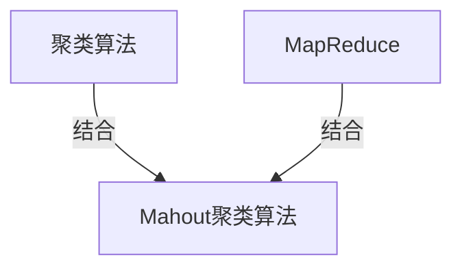

好的，按照您的要求，我将以《Mahout聚类算法原理与代码实例讲解》为主题，撰写一篇专业的技术博客文章。文章将遵循约束条件中提出的各项要求，包括字数、格式、完整性等。下面是正文部分：

# Mahout聚类算法原理与代码实例讲解

## 1. 背景介绍

### 1.1 问题的由来

在当今大数据时代，海量数据的存在使得数据挖掘和分析成为了一个前所未有的挑战。作为无监督学习的一种重要技术，聚类算法在发现数据内在结构、对数据进行分组和总结等方面发挥着关键作用。传统的聚类算法如K-Means虽然简单高效，但在处理大规模数据集时往往会遇到可扩展性和效率低下的问题。因此，需要一种能够高效处理大数据的聚类算法来满足现实需求。

### 1.2 研究现状

Apache Mahout是一个专门为大数据环境设计的机器学习库，它提供了多种可扩展的聚类算法实现。其中，Mahout聚类算法就是一种针对大数据场景优化的聚类算法。它基于MapReduce并行计算框架，能够在分布式环境下高效地对海量数据进行聚类分析。Mahout聚类算法已被广泛应用于推荐系统、文本挖掘、图像处理等多个领域。

### 1.3 研究意义

深入理解Mahout聚类算法的原理和实现对于以下几个方面具有重要意义：

1. 掌握大数据环境下的聚类算法思想和技术，为解决实际大数据挖掘问题奠定基础。
2. 了解Mahout聚类算法的优势和局限性，为算法选型和性能优化提供参考。
3. 通过代码实例加深对算法实现细节的理解，提高编程能力和代码阅读能力。
4. 探索Mahout聚类算法在不同应用场景中的实践，拓展算法的应用范围。

### 1.4 本文结构

本文将从以下几个方面全面介绍Mahout聚类算法：

1. 核心概念与联系
2. 核心算法原理和具体操作步骤
3. 数学模型和公式详细讲解
4. 项目实践：代码实例和详细解释
5. 实际应用场景
6. 工具和资源推荐
7. 总结：未来发展趋势与挑战
8. 附录：常见问题与解答

## 2. 核心概念与联系

在深入探讨Mahout聚类算法之前，我们需要先了解一些核心概念及其相互关系。

### 2.1 聚类算法

聚类算法是一种无监督学习技术，旨在根据数据之间的相似性将数据划分为多个组或簇。常见的聚类算法包括K-Means、层次聚类、密度聚类等。

### 2.2 MapReduce

MapReduce是一种分布式计算模型和编程框架，用于在大规模集群上并行处理大数据。它将计算过程划分为两个阶段：Map阶段和Reduce阶段。MapReduce框架能够自动实现任务的并行化、容错和负载均衡，从而提高大数据处理的效率和可扩展性。

### 2.3 Apache Mahout

Apache Mahout是一个可扩展的机器学习库，专门为分布式环境和大数据场景设计。它提供了多种算法实现，包括聚类、分类、协同过滤等。Mahout聚类算法就是基于MapReduce框架实现的一种可扩展聚类算法。

### 2.4 核心概念关系

Mahout聚类算法将聚类算法思想与MapReduce分布式计算框架相结合，从而实现了在大数据环境下高效进行聚类分析的目标。它利用了MapReduce的并行计算能力和容错机制，克服了传统聚类算法在处理大规模数据集时遇到的瓶颈。

## 3. 核心算法原理与具体操作步骤

### 3.1 算法原理概述

Mahout聚类算法的核心思想是将传统的聚类算法与MapReduce并行计算框架相结合。具体来说，它将聚类过程划分为多个MapReduce作业，每个作业完成聚类的一个子任务。通过多个作业的协同工作，最终实现对整个数据集的聚类。

Mahout聚类算法的主要步骤如下：

1. **数据准备**：将输入数据转换为Mahout可识别的向量格式。
2. **初始化**：选择初始聚类中心点。
3. **迭代聚类**：
   a. Map阶段：为每个数据点找到最近的聚类中心。
   b. Reduce阶段：根据Map阶段的结果重新计算聚类中心。
4. **收敛检测**：判断是否达到收敛条件（如最大迭代次数或聚类中心不再变化）。如果未收敛，则返回步骤3继续迭代。
5. **输出结果**：将最终的聚类结果输出。

### 3.2 算法步骤详解

#### 3.2.1 数据准备

Mahout聚类算法要求输入数据为向量格式，每个向量代表一个数据点。向量可以是稠密向量（Dense Vector）或者稀疏向量（Sparse Vector）。

对于文本数据，Mahout提供了一个名为`org.apache.mahout.vectorizer`的模块用于将文本转换为向量。对于其他类型的数据，则需要自行编写转换代码。

#### 3.2.2 初始化

在聚类过程开始之前，需要选择初始的聚类中心点。Mahout提供了多种初始化策略，如随机初始化、K-Means++初始化等。选择合适的初始化策略对最终的聚类结果有一定影响。

#### 3.2.3 迭代聚类

迭代聚类是Mahout聚类算法的核心步骤，它由多个MapReduce作业组成。

**Map阶段**

Map阶段的主要任务是为每个数据点找到最近的聚类中心。具体步骤如下：

1. 将输入数据划分为多个Split。
2. 每个Map任务处理一个Split，将Split中的数据点与所有聚类中心进行比较，找到最近的聚类中心。
3. 输出键值对`(clusterId, vector)`，其中`clusterId`是该数据点最近的聚类中心的ID。

**Reduce阶段**

Reduce阶段的主要任务是根据Map阶段的输出，重新计算每个聚类的中心点。具体步骤如下：

1. 将Map阶段的输出按照`clusterId`进行分组。
2. 每个Reduce任务处理一个`clusterId`及其对应的所有向量。
3. 计算这些向量的新的聚类中心，作为该`clusterId`的新中心点。
4. 输出新的聚类中心点。

#### 3.2.4 收敛检测

在每次迭代结束后，Mahout聚类算法会检查是否达到收敛条件。常见的收敛条件包括：

1. **最大迭代次数**：当迭代次数达到预设的最大值时，算法终止。
2. **聚类中心不再变化**：当新计算的聚类中心与上一次迭代的中心相同时，算法终止。
3. **聚类质量指标**：当某些聚类质量指标（如簇内平方和）达到预期阈值时，算法终止。

如果未达到收敛条件，算法将返回步骤3继续进行下一次迭代。

#### 3.2.5 输出结果

当算法收敛后，Mahout将输出最终的聚类结果。结果可以以多种格式存储，如文本文件、序列化对象等。用户可以根据需求选择合适的输出格式。

### 3.3 算法优缺点

**优点**：

1. **可扩展性**：基于MapReduce框架，能够在分布式环境下高效处理大规模数据集。
2. **容错性**：MapReduce框架提供了容错机制，确保计算过程的可靠性。
3. **通用性**：Mahout聚类算法支持多种聚类算法，如K-Means、Fuzzy K-Means、Canopy等。

**缺点**：

1. **算法选择有限**：虽然支持多种聚类算法，但与其他专业聚类库相比，算法种类仍然有限。
2. **参数调优困难**：Mahout聚类算法涉及多个参数，如聚类数量、初始化策略等，参数调优较为困难。
3. **内存开销大**：在处理大规模数据时，Mahout聚类算法可能会占用较多内存资源。

### 3.4 算法应用领域

Mahout聚类算法广泛应用于以下领域：

1. **推荐系统**：通过对用户行为数据进行聚类，发现用户群体，为个性化推荐提供支持。
2. **文本挖掘**：对文本数据进行聚类，发现主题或话题，用于文本分类、文本摘要等任务。
3. **图像处理**：对图像像素数据进行聚类，实现图像分割、图像压缩等功能。
4. **客户细分**：对客户数据进行聚类，发现不同的客户群体，为精准营销提供依据。
5. **异常检测**：将异常数据点聚集在同一簇，用于异常检测和异常分析。

## 4. 数学模型和公式详细讲解与举例说明

### 4.1 数学模型构建

在介绍Mahout聚类算法的数学模型之前，我们先定义一些基本符号和概念。

给定一个数据集$\mathcal{D} = \{x_1, x_2, \dots, x_n\}$，其中$x_i \in \mathbb{R}^d$是一个$d$维向量，表示第$i$个数据点。我们的目标是将$\mathcal{D}$划分为$k$个不相交的簇$\mathcal{C} = \{C_1, C_2, \dots, C_k\}$，使得簇内数据点相似度高，簇间数据点相似度低。

为了量化簇内和簇间的相似度，我们引入了两个概念：**簇内平方和**和**簇间平方和**。

**簇内平方和**（Intra-Cluster Sum of Squares，ISS）定义为：

$$\text{ISS}(\mathcal{C}) = \sum_{j=1}^k \sum_{x_i \in C_j} \|x_i - \mu_j\|^2$$

其中$\mu_j$是簇$C_j$的质心（中心点）。ISS越小，表示簇内数据点越紧密。

**簇间平方和**（Inter-Cluster Sum of Squares，ISS）定义为：

$$\text{ISS}(\mathcal{C}) = \sum_{j=1}^k n_j \|\mu_j - \mu\|^2$$

其中$n_j$是簇$C_j$的数据点数量，$\mu$是整个数据集$\mathcal{D}$的质心。ISS越大，表示簇间数据点越分散。

聚类算法的目标是找到一种划分$\mathcal{C}$，使得ISS最小化，同时ISS最大化。这相当于最小化以下目标函数：

$$J(\mathcal{C}) = \text{ISS}(\mathcal{C}) - \text{ISS}(\mathcal{C})$$

不同的聚类算法采用不同的优化策略来求解这一目标函数。

### 4.2 公式推导过程

接下来，我们将推导Mahout中K-Means聚类算法的数学模型。K-Means是一种经典的聚类算法，Mahout聚类算法就是基于K-Means算法进行了分布式优化和扩展。

K-Means算法的目标是最小化ISS，即：

$$\min_{\mathcal{C}} \sum_{j=1}^k \sum_{x_i \in C_j} \|x_i - \mu_j\|^2$$

其中$\mu_j$是簇$C_j$的质心，定义为：

$$\mu_j = \frac{1}{n_j} \sum_{x_i \in C_j} x_i$$

我们可以通过迭代的方式求解这一优化问题。在每一次迭代中，算法执行以下两个步骤：

1. **Assignment Step**：对于每个数据点$x_i$，将其分配到最近的簇中：

$$c_i^{(t)} = \arg\min_j \|x_i - \mu_j