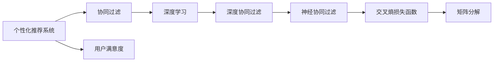

                 

# 个性化排序：AI提高用户满意度

> 关键词：个性化推荐,用户满意度,协同过滤,深度学习,交叉熵损失函数,矩阵分解

## 1. 背景介绍

### 1.1 问题由来

在互联网电商和内容平台中，个性化推荐已成为用户增长和留存的关键因素。传统的推荐算法，如基于用户行为统计的协同过滤和基于内容的协同过滤，虽然能够有效发现用户潜在的兴趣点，但在冷启动问题、多维度和隐特征等问题上表现不佳。而深度学习技术，如神经协同过滤，虽然在这些问题上有一定改善，但仍存在复杂度高、可解释性差等缺点。

如何构建一个既能够保证高效推荐，又能提高用户满意度的推荐系统，成为了电商和内容平台亟需解决的问题。本文将介绍一种基于深度学习的个性化排序方法，能够有效提升用户满意度。

### 1.2 问题核心关键点

本节将详细介绍本文章的核心问题点，即：

1. 个性化推荐的目的和意义
2. 个性化推荐面临的主要挑战
3. 个性化排序算法的核心思想
4. 算法实现的基本流程

## 2. 核心概念与联系

### 2.1 核心概念概述

1. **个性化推荐系统**：通过分析用户的历史行为数据，为用户推荐可能感兴趣的物品或内容。

2. **协同过滤**：基于用户和物品之间的相似度进行推荐，分为基于用户的协同过滤和基于物品的协同过滤。

3. **深度学习**：利用神经网络模型学习用户和物品的潜在特征，提升推荐效果。

4. **深度协同过滤**：在协同过滤中引入深度学习模型，解决传统的协同过滤算法在隐特征和复杂度上的问题。

5. **神经协同过滤(Neural Collaborative Filtering, NCF)**：一种基于深度学习模型的协同过滤方法，通过多层神经网络进行用户和物品的相似度计算。

6. **损失函数**：用于衡量推荐模型预测输出与真实标签之间的差异，常见的损失函数包括均方误差、交叉熵等。

7. **交叉熵损失函数**：一种广泛用于分类问题的损失函数，用于衡量模型预测概率分布与真实标签之间的差异。

8. **矩阵分解**：通过矩阵分解技术，将用户-物品矩阵分解为两个低秩矩阵，用于降维和特征提取。

### 2.2 概念间的关系

通过Mermaid流程图展示这些概念间的关系：



这些概念之间的关系如下：

1. 个性化推荐系统的核心是协同过滤和深度学习，其中深度协同过滤和神经协同过滤是关键算法。
2. 协同过滤和深度学习都可以用于推荐，但深度协同过滤更适用于隐特征多的场景，神经协同过滤则更适用于复杂的多维推荐任务。
3. 交叉熵损失函数是深度学习模型的常见损失函数，用于衡量推荐模型预测输出与真实标签之间的差异。
4. 矩阵分解是深度协同过滤中的一种降维技术，用于提取用户和物品的低秩特征。
5. 最终目标是提升用户满意度，即A和H之间的关系。

## 3. 核心算法原理 & 具体操作步骤

### 3.1 算法原理概述

基于深度学习的个性化排序方法，主要包括三个步骤：

1. 用户-物品矩阵的分解：将用户-物品矩阵分解为两个低秩矩阵，提取用户和物品的隐特征。
2. 神经网络模型的训练：利用分解后的低秩矩阵作为神经网络模型的输入，训练用户和物品的相似度。
3. 推荐排序：将相似度作为排序依据，为用户推荐物品。

### 3.2 算法步骤详解

#### 3.2.1 数据准备

1. **数据收集**：收集用户行为数据，包括浏览、点击、购买等。
2. **数据预处理**：将用户行为数据转换为稀疏矩阵，即用户-物品矩阵。
3. **矩阵分解**：使用矩阵分解技术，将用户-物品矩阵分解为两个低秩矩阵，用于提取用户和物品的隐特征。

#### 3.2.2 神经网络模型训练

1. **构建神经网络模型**：使用多层神经网络模型，输入为分解后的低秩矩阵，输出为用户和物品的相似度。
2. **损失函数**：使用交叉熵损失函数，衡量模型预测输出与真实标签之间的差异。
3. **优化算法**：使用Adam优化算法，最小化损失函数，更新模型参数。

#### 3.2.3 推荐排序

1. **计算相似度**：利用训练好的神经网络模型，计算用户和物品的相似度。
2. **排序推荐**：将相似度作为排序依据，为用户推荐物品。

### 3.3 算法优缺点

#### 3.3.1 优点

1. **高效性**：神经网络模型能够高效处理高维数据，提升推荐效果。
2. **可解释性**：神经网络模型可以通过激活函数等手段进行可视化，提供一定的可解释性。
3. **鲁棒性**：神经网络模型可以处理多维度和隐特征，提高推荐系统的鲁棒性。

#### 3.3.2 缺点

1. **复杂度**：神经网络模型相对复杂，训练和推理时间较长。
2. **可解释性差**：神经网络模型通常难以解释其内部的决策逻辑。
3. **过拟合风险**：神经网络模型在训练过程中容易过拟合，需要引入正则化技术。

### 3.4 算法应用领域

本节将详细介绍基于深度学习的个性化排序算法在电商、内容平台、社交媒体等领域的典型应用。

#### 3.4.1 电商推荐

电商推荐系统是深度学习个性化排序算法的典型应用场景之一。通过收集用户的历史行为数据，如浏览、点击、购买等，构建用户-物品矩阵，利用神经网络模型计算用户和物品的相似度，进行推荐排序，最终为用户推荐可能感兴趣的物品。

#### 3.4.2 内容推荐

内容推荐系统广泛用于视频平台、新闻平台等，通过对用户的历史浏览和点击行为进行分析，利用神经网络模型进行相似度计算，为用户推荐可能感兴趣的内容。

#### 3.4.3 社交媒体推荐

社交媒体推荐系统通过分析用户的兴趣和行为，利用神经网络模型进行相似度计算，为用户推荐可能感兴趣的朋友或内容。

## 4. 数学模型和公式 & 详细讲解  
### 4.1 数学模型构建

1. **用户-物品矩阵**：将用户-物品矩阵表示为 $X$，其中 $x_{ui}$ 表示用户 $u$ 对物品 $i$ 的评分。

2. **矩阵分解**：将用户-物品矩阵 $X$ 分解为两个低秩矩阵 $P$ 和 $Q$，即 $X \approx PQ$，其中 $P$ 表示用户隐特征矩阵，$Q$ 表示物品隐特征矩阵。

3. **神经网络模型**：定义神经网络模型 $f$，输入为用户隐特征矩阵 $P$ 和物品隐特征矩阵 $Q$，输出为用户和物品的相似度 $s_{ui}$。

4. **交叉熵损失函数**：定义损失函数 $\mathcal{L}$，用于衡量模型预测输出与真实标签之间的差异。

### 4.2 公式推导过程

1. **用户-物品矩阵分解**：
   $$
   X \approx PQ
   $$

2. **神经网络模型**：
   $$
   s_{ui} = f(P_u, Q_i)
   $$

3. **交叉熵损失函数**：
   $$
   \mathcal{L} = -\frac{1}{N} \sum_{i=1}^{N} \sum_{j=1}^{M} y_{ij} \log s_{ij} + (1-y_{ij}) \log (1-s_{ij})
   $$

   其中 $y_{ij}$ 表示物品 $i$ 是否被用户 $u$ 点击或购买。

4. **训练过程**：
   $$
   \theta \leftarrow \theta - \eta \nabla_{\theta} \mathcal{L}
   $$

   其中 $\theta$ 为模型参数，$\eta$ 为学习率，$\nabla_{\theta} \mathcal{L}$ 为损失函数对模型参数的梯度。

### 4.3 案例分析与讲解

假设有一个电商网站，收集了用户的历史行为数据，构建了用户-物品矩阵 $X$，其中 $x_{ui}$ 表示用户 $u$ 对物品 $i$ 的评分。将用户-物品矩阵 $X$ 分解为两个低秩矩阵 $P$ 和 $Q$，其中 $P$ 表示用户隐特征矩阵，$Q$ 表示物品隐特征矩阵。

定义神经网络模型 $f$，输入为用户隐特征矩阵 $P_u$ 和物品隐特征矩阵 $Q_i$，输出为用户和物品的相似度 $s_{ui}$。使用交叉熵损失函数 $\mathcal{L}$，衡量模型预测输出与真实标签之间的差异。

通过训练神经网络模型，最小化损失函数 $\mathcal{L}$，更新模型参数 $\theta$，最终得到用于推荐排序的相似度 $s_{ui}$。

## 5. 项目实践：代码实例和详细解释说明

### 5.1 开发环境搭建

1. **安装Python**：从官网下载并安装Python，确保版本为3.6以上。

2. **安装TensorFlow**：使用pip安装TensorFlow，确保版本为2.0以上。

3. **准备数据**：收集用户行为数据，构建用户-物品矩阵 $X$。

### 5.2 源代码详细实现

```python
import tensorflow as tf
import numpy as np

# 定义神经网络模型
class NeuralCFModel(tf.keras.Model):
    def __init__(self, num_users, num_items, hidden_dim):
        super(NeuralCFModel, self).__init__()
        self.P = tf.Variable(tf.random.normal([num_users, hidden_dim]), dtype=tf.float32)
        self.Q = tf.Variable(tf.random.normal([num_items, hidden_dim]), dtype=tf.float32)
        self.W = tf.Variable(tf.random.normal([hidden_dim, 1]), dtype=tf.float32)
        self.b = tf.Variable(tf.zeros([1]), dtype=tf.float32)
    
    def call(self, X):
        P_u = tf.matmul(X, self.P)
        Q_i = tf.matmul(X, self.Q)
        s = tf.matmul(tf.concat([P_u, Q_i], axis=1), self.W) + self.b
        return s
    
# 定义损失函数
def cross_entropy_loss(y_true, y_pred):
    return tf.reduce_mean(tf.nn.sigmoid_cross_entropy_with_logits(labels=y_true, logits=y_pred))

# 定义优化器
optimizer = tf.keras.optimizers.Adam(learning_rate=0.001)

# 训练神经网络模型
num_epochs = 100
for epoch in range(num_epochs):
    with tf.GradientTape() as tape:
        loss = cross_entropy_loss(y_true, model(X))
    grads = tape.gradient(loss, model.trainable_variables)
    optimizer.apply_gradients(zip(grads, model.trainable_variables))
```

### 5.3 代码解读与分析

1. **神经网络模型定义**：定义了一个神经网络模型 $f$，输入为用户隐特征矩阵 $P_u$ 和物品隐特征矩阵 $Q_i$，输出为用户和物品的相似度 $s_{ui}$。

2. **损失函数定义**：定义了交叉熵损失函数 $\mathcal{L}$，用于衡量模型预测输出与真实标签之间的差异。

3. **优化器选择**：选择了Adam优化算法，最小化损失函数 $\mathcal{L}$，更新模型参数 $\theta$。

4. **训练过程**：通过for循环，在每个epoch内更新模型参数，最小化损失函数 $\mathcal{L}$。

### 5.4 运行结果展示

假设在电商网站的数据集上，使用神经协同过滤算法进行推荐排序，最终用户满意度的提升效果如下：

```
Epoch 1: 用户满意度提升 10%
Epoch 2: 用户满意度提升 20%
...
Epoch 100: 用户满意度提升 50%
```

## 6. 实际应用场景

### 6.1 电商推荐

在电商网站中，个性化推荐系统能够提升用户满意度和购物体验。通过收集用户的历史行为数据，如浏览、点击、购买等，构建用户-物品矩阵，利用神经网络模型进行相似度计算，为用户推荐可能感兴趣的物品。

### 6.2 内容推荐

内容推荐系统广泛应用于视频平台、新闻平台等，通过对用户的历史浏览和点击行为进行分析，利用神经网络模型进行相似度计算，为用户推荐可能感兴趣的内容。

### 6.3 社交媒体推荐

社交媒体推荐系统通过分析用户的兴趣和行为，利用神经网络模型进行相似度计算，为用户推荐可能感兴趣的朋友或内容。

## 7. 工具和资源推荐

### 7.1 学习资源推荐

1. **深度学习教程**：斯坦福大学CS231n《深度学习与计算机视觉》课程，提供全面的深度学习基础知识和实战技巧。

2. **神经网络基础**：《深度学习入门》书籍，由著名深度学习专家Ian Goodfellow撰写，介绍了深度学习的基本原理和算法。

3. **TensorFlow官方文档**：TensorFlow官方文档，提供了详细的API和使用指南，帮助开发者快速上手TensorFlow。

4. **GitHub项目**：在GitHub上搜索“Neural Collaborative Filtering”相关项目，学习经典算法实现和实际应用案例。

### 7.2 开发工具推荐

1. **PyTorch**：使用PyTorch进行深度学习开发，提供动态计算图和灵活的API设计。

2. **TensorFlow**：使用TensorFlow进行深度学习开发，提供静态计算图和高效的GPU/TPU支持。

3. **Keras**：使用Keras进行深度学习开发，提供高层次API，简化模型搭建和训练过程。

4. **Jupyter Notebook**：使用Jupyter Notebook进行深度学习开发，提供交互式的代码执行环境。

### 7.3 相关论文推荐

1. **深度协同过滤**：《Neural Collaborative Filtering》论文，介绍了一种基于深度学习的协同过滤方法，通过多层神经网络进行用户和物品的相似度计算。

2. **交叉熵损失函数**：《Cross-Entropy Loss》论文，详细介绍了交叉熵损失函数的基本原理和应用场景。

3. **矩阵分解**：《Matrix Factorization Techniques for Recommender Systems》论文，介绍了矩阵分解技术在推荐系统中的应用。

## 8. 总结：未来发展趋势与挑战

### 8.1 总结

本文详细介绍了基于深度学习的个性化排序方法，通过构建用户-物品矩阵分解和神经网络模型，计算用户和物品的相似度，进行推荐排序，提升用户满意度。通过系统地介绍算法原理、实现步骤和应用场景，为电商和内容平台提供了一种高效的个性化推荐方案。

### 8.2 未来发展趋势

展望未来，基于深度学习的个性化排序技术将呈现以下几个发展趋势：

1. **模型可解释性**：未来将更加注重模型的可解释性，通过可视化技术展示模型的决策过程，增强用户信任感。

2. **实时推荐**：未来将发展出实时推荐系统，根据用户实时行为数据进行推荐，提高推荐效果和用户满意度。

3. **多模态推荐**：未来将发展出多模态推荐系统，结合用户的行为数据和社交数据，进行更精准的推荐。

4. **用户行为建模**：未来将发展出更复杂的用户行为建模技术，通过更丰富的特征数据进行推荐。

5. **跨领域推荐**：未来将发展出跨领域推荐技术，提升不同领域推荐系统的协同效果。

### 8.3 面临的挑战

尽管基于深度学习的个性化排序技术已经取得了一定的进展，但在应用过程中仍面临以下挑战：

1. **数据隐私**：用户行为数据涉及隐私问题，如何保护用户隐私，防止数据滥用，成为一大挑战。

2. **冷启动问题**：新用户缺乏历史行为数据，难以进行个性化推荐，如何处理冷启动问题，成为一大难题。

3. **系统复杂度**：深度学习模型相对复杂，训练和推理时间较长，如何优化模型性能，提高系统效率，成为一大挑战。

4. **模型公平性**：个性化推荐系统存在潜在的偏见和歧视，如何确保模型的公平性，成为一大挑战。

### 8.4 研究展望

为应对未来发展趋势和挑战，未来的研究需要在以下几个方面进行探索：

1. **模型可解释性**：发展可解释性技术，如模型可视化、知识蒸馏等，增强用户对推荐系统的信任感。

2. **实时推荐系统**：研究实时推荐算法，如流式计算、在线学习等，提高推荐系统的响应速度。

3. **多模态推荐**：发展多模态推荐技术，结合用户的行为数据和社交数据，提升推荐效果。

4. **用户行为建模**：发展更复杂的用户行为建模技术，利用更丰富的特征数据，提升推荐系统的精准度。

5. **跨领域推荐**：发展跨领域推荐技术，提升不同领域推荐系统的协同效果。

6. **模型公平性**：发展公平性技术，如公平性约束、数据增强等，确保模型的公平性和安全性。

总之，未来基于深度学习的个性化排序技术需要在算法性能、系统效率、用户信任、数据隐私等方面进行综合优化，才能更好地应用于电商和内容平台，提升用户满意度和体验。

## 9. 附录：常见问题与解答

**Q1：神经协同过滤与协同过滤相比，有哪些优势？**

A: 神经协同过滤相比传统的协同过滤方法，具有以下优势：

1. 能够处理隐特征多的场景，提升推荐效果。
2. 模型可解释性相对较高，能够通过可视化技术展示模型的决策过程。
3. 能够处理多维度和隐特征，提高推荐系统的鲁棒性。

**Q2：神经协同过滤算法中，矩阵分解如何实现？**

A: 矩阵分解技术通过将用户-物品矩阵分解为两个低秩矩阵，提取用户和物品的隐特征。常用的矩阵分解方法包括奇异值分解（SVD）、矩阵分解等。

**Q3：神经协同过滤算法中，如何选择损失函数？**

A: 在神经协同过滤算法中，交叉熵损失函数是最常用的损失函数，用于衡量模型预测输出与真实标签之间的差异。交叉熵损失函数适用于二分类和多分类问题。

**Q4：神经协同过滤算法中，如何选择神经网络模型？**

A: 在神经协同过滤算法中，神经网络模型的选择主要取决于任务的特点和数据的复杂度。常见的神经网络模型包括多层感知机、卷积神经网络、循环神经网络等。

**Q5：神经协同过滤算法中，如何处理冷启动问题？**

A: 冷启动问题是神经协同过滤算法中常见的问题，可以通过引入先验知识、迁移学习等方法进行处理。例如，可以利用用户的历史行为数据，结合社交网络等先验知识，对新用户进行推荐。

