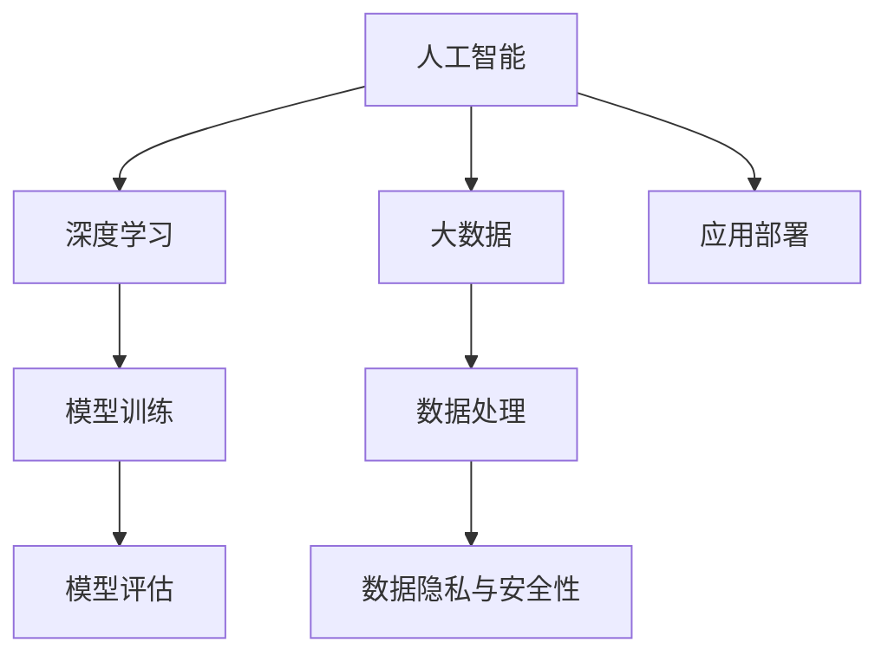

                 

# 中国AI技术的优势与数据的重要性

> 关键词：中国AI,技术优势,数据重要性,人工智能,深度学习

## 1. 背景介绍

近年来，中国在人工智能（AI）领域取得了显著的进步，凭借强大的技术实力和政策支持，成为全球AI发展的核心驱动力之一。中国AI技术的快速发展不仅极大地推动了国内经济数字化转型，也为全球AI生态的繁荣贡献了重要力量。本文旨在深入分析中国AI技术的优势与数据在其中的重要性，为业界提供有价值的参考和思考。

### 1.1 技术优势的来源

中国的AI技术优势主要来源于以下几个方面：

1. **政策支持与国家战略**：中国政府高度重视AI技术的发展，制定了多项国家战略和政策文件，如《新一代人工智能发展规划》《新一代人工智能发展行动计划》等，为AI技术的发展提供了坚实的政策保障。

2. **产业生态的成熟**：中国拥有庞大的互联网用户基数和丰富的应用场景，为AI技术提供了广阔的落地空间。同时，中国拥有完整的AI产业链，从基础算法、硬件设备到应用服务，形成了成熟的产业生态。

3. **科研与教育的投入**：中国在AI领域的科研投入位居世界前列，拥有大量领先的科研机构和高等院校，如清华大学、北京大学、上海交通大学等，为AI技术的研究和人才培养提供了坚实基础。

4. **企业与市场的活跃**：中国的AI企业如阿里巴巴、腾讯、百度、华为等，在AI技术的商业应用上投入巨大，形成了多个具有国际竞争力的AI技术平台，如天眼、飞桨、PaddlePaddle等。

### 1.2 数据的重要性

数据是AI技术的基石。大数据的积累和应用，是中国AI技术快速发展的重要驱动力之一。中国拥有丰富多样的数据资源，包括移动互联网、社交媒体、电子商务、金融交易、医疗健康等多个领域的海量数据。这些数据不仅为AI技术的训练提供了充足的训练集，也为AI模型的优化和性能提升提供了宝贵的参考。

## 2. 核心概念与联系

### 2.1 核心概念概述

为了更好地理解中国AI技术的优势与数据的重要性，我们首先介绍几个核心概念：

- **人工智能（AI）**：通过计算机模拟人类智能行为，包括感知、认知、决策、学习等能力的综合技术。
- **深度学习（DL）**：一种基于人工神经网络的机器学习方法，通过多层非线性变换，从数据中学习抽象特征。
- **大数据（Big Data）**：通常指超过传统数据库软件工具捕获、存储、管理和分析能力的数据集合，具有体量大、多样性、速度快、真实性等特点。
- **数据处理（Data Processing）**：对原始数据进行采集、清洗、处理、存储和分析的过程，是AI技术实施的基础。
- **数据隐私与安全性**：随着数据的重要性日益凸显，数据隐私和安全性问题也备受关注，成为数据处理的重要考虑因素。

### 2.2 概念间的关系

以下我们通过几个Mermaid流程图来展示这些核心概念之间的关系：



这个流程图展示了人工智能技术中各个核心概念之间的联系：

1. 人工智能通过深度学习和模型训练进行智能化，数据处理提供数据支持。
2. 数据隐私与安全性是数据处理和应用部署中的重要考虑因素。
3. 模型评估用于验证模型的性能，指导进一步的模型优化。
4. 应用部署是人工智能技术落地的重要环节，确保技术在实际场景中的有效应用。

## 3. 核心算法原理 & 具体操作步骤
### 3.1 算法原理概述

中国AI技术的核心算法原理主要基于深度学习框架，利用海量数据训练深度神经网络模型，从而实现智能化的目标。其基本流程包括：

1. **数据预处理**：对原始数据进行清洗、归一化、特征工程等处理，准备模型训练。
2. **模型训练**：利用深度学习框架（如TensorFlow、PyTorch等）对模型进行训练，优化模型参数。
3. **模型评估**：通过验证集对训练好的模型进行评估，选择性能最好的模型。
4. **模型部署**：将训练好的模型部署到实际应用场景中，进行实时预测或决策。

### 3.2 算法步骤详解

以深度学习在图像识别任务中的应用为例，以下是中国AI技术的详细操作步骤：

1. **数据收集与标注**：从互联网、公开数据集等渠道收集图像数据，并进行标注，标记每张图像的类别。

2. **数据预处理**：对图像进行预处理，如调整大小、裁剪、旋转等，以便于模型训练。同时，使用数据增强技术生成更多的训练数据。

3. **模型构建与训练**：构建深度神经网络模型，选择合适的优化器（如Adam、SGD等），设置合适的学习率，进行模型训练。

4. **模型评估与调优**：在验证集上评估模型的性能，根据评估结果进行超参数调优，如调整学习率、正则化参数等。

5. **模型部署**：将训练好的模型部署到实际应用场景中，进行实时预测或决策。

### 3.3 算法优缺点

中国AI技术在深度学习领域具有显著优势，但也存在一些局限性：

**优点**：

1. **大规模数据处理能力**：中国拥有海量数据资源，能够有效支持深度学习模型的训练。
2. **算法与模型创新**：中国的AI研究机构和企业不断推出创新的算法与模型，推动AI技术的发展。
3. **快速迭代能力**：中国的AI团队在快速迭代和产品化方面具有较强优势，能够迅速将研究成果转化为实际应用。

**缺点**：

1. **计算资源需求高**：深度学习模型的训练需要大量的计算资源，如GPU、TPU等，这对一些中小企业来说是一大挑战。
2. **数据质量与隐私问题**：数据质量参差不齐，数据隐私和安全问题也需引起高度重视。
3. **跨领域应用难度较大**：一些领域的数据量有限，跨领域的AI应用相对复杂。

### 3.4 算法应用领域

中国AI技术在多个领域取得了显著成果，以下是几个典型应用：

1. **计算机视觉**：用于图像识别、人脸识别、视频分析等。如百度的图像识别技术广泛应用于公共安全、智能交通等领域。
2. **自然语言处理（NLP）**：包括机器翻译、语音识别、情感分析等。如腾讯的智能客服、华为的翻译系统等。
3. **智能制造**：利用AI技术进行生产流程优化、质量控制、设备维护等。如富士康的智能工厂、海尔的智能家居等。
4. **医疗健康**：用于疾病诊断、医疗影像分析、健康管理等。如阿里健康的智能问诊、平安好医生的AI诊断系统等。
5. **金融科技**：用于风险管理、信用评估、智能投顾等。如蚂蚁金服的风险控制系统、京东金融的智能投顾平台等。

## 4. 数学模型和公式 & 详细讲解 & 举例说明

### 4.1 数学模型构建

以卷积神经网络（CNN）为例，构建一个基本的图像分类模型。

**模型定义**：

$$
y = f(x; \theta) = W \sigma (b + Ax)
$$

其中，$y$为模型输出，$x$为输入，$\theta$为模型参数，$W$为权重矩阵，$b$为偏置项，$A$为卷积核矩阵，$\sigma$为激活函数。

### 4.2 公式推导过程

**损失函数**：

常用损失函数包括交叉熵损失、均方误差损失等。以交叉熵损失为例：

$$
\mathcal{L}(y, \hat{y}) = -\frac{1}{N} \sum_{i=1}^{N} \sum_{j=1}^{C} y_{i,j} \log \hat{y}_{i,j}
$$

其中，$N$为样本数，$C$为类别数，$y_{i,j}$为真实标签，$\hat{y}_{i,j}$为模型预测的概率。

**梯度下降更新**：

$$
\theta \leftarrow \theta - \eta \nabla_{\theta} \mathcal{L}(y, \hat{y})
$$

其中，$\eta$为学习率，$\nabla_{\theta} \mathcal{L}(y, \hat{y})$为损失函数对模型参数的梯度。

### 4.3 案例分析与讲解

以医学影像分析为例，构建一个基于卷积神经网络（CNN）的疾病诊断模型。

**数据准备**：

收集大量医学影像数据，并进行标注，标记每张影像的疾病类别。

**模型构建与训练**：

构建CNN模型，设置合适的卷积层、池化层、全连接层等，利用医学影像数据进行训练。

**模型评估与调优**：

在验证集上评估模型的性能，根据评估结果进行超参数调优，如调整卷积核大小、学习率等。

**模型部署**：

将训练好的模型部署到实际应用场景中，进行疾病诊断预测。

## 5. 项目实践：代码实例和详细解释说明

### 5.1 开发环境搭建

为了进行图像分类任务的深度学习模型开发，需要搭建一个适合深度学习的开发环境。以下是Python环境配置的详细步骤：

1. **安装Anaconda**：从官网下载并安装Anaconda，用于创建独立的Python环境。

2. **创建并激活虚拟环境**：
```bash
conda create -n pytorch-env python=3.8 
conda activate pytorch-env
```

3. **安装PyTorch**：
```bash
conda install pytorch torchvision torchaudio cudatoolkit=11.1 -c pytorch -c conda-forge
```

4. **安装TensorFlow**：
```bash
pip install tensorflow
```

5. **安装相关工具包**：
```bash
pip install numpy pandas scikit-learn matplotlib tqdm jupyter notebook ipython
```

### 5.2 源代码详细实现

以下是一个基于PyTorch的图像分类任务的示例代码：

```python
import torch
import torch.nn as nn
import torch.optim as optim
from torchvision import datasets, transforms, models

# 定义模型
class MyModel(nn.Module):
    def __init__(self):
        super(MyModel, self).__init__()
        self.conv1 = nn.Conv2d(3, 6, 5)
        self.pool = nn.MaxPool2d(2, 2)
        self.conv2 = nn.Conv2d(6, 16, 5)
        self.fc1 = nn.Linear(16 * 5 * 5, 120)
        self.fc2 = nn.Linear(120, 84)
        self.fc3 = nn.Linear(84, 10)

    def forward(self, x):
        x = self.pool(torch.relu(self.conv1(x)))
        x = self.pool(torch.relu(self.conv2(x)))
        x = x.view(-1, 16 * 5 * 5)
        x = torch.relu(self.fc1(x))
        x = torch.relu(self.fc2(x))
        x = self.fc3(x)
        return x

# 数据预处理
transform = transforms.Compose(
    [transforms.ToTensor(),
     transforms.Normalize((0.5, 0.5, 0.5), (0.5, 0.5, 0.5))])

train_data = datasets.CIFAR10(root='data', train=True, download=True, transform=transform)
test_data = datasets.CIFAR10(root='data', train=False, download=True, transform=transform)

# 数据加载器
train_loader = torch.utils.data.DataLoader(train_data, batch_size=4, shuffle=True, num_workers=2)
test_loader = torch.utils.data.DataLoader(test_data, batch_size=4, shuffle=False, num_workers=2)

# 模型训练
model = MyModel()
criterion = nn.CrossEntropyLoss()
optimizer = optim.SGD(model.parameters(), lr=0.001, momentum=0.9)

for epoch in range(2):
    running_loss = 0.0
    for i, data in enumerate(train_loader, 0):
        inputs, labels = data
        optimizer.zero_grad()
        outputs = model(inputs)
        loss = criterion(outputs, labels)
        loss.backward()
        optimizer.step()
        running_loss += loss.item()
        if i % 2000 == 1999:    # 每2000个batch打印一次loss
            print('[%d, %5d] loss: %.3f' %
                  (epoch + 1, i + 1, running_loss / 2000))
            running_loss = 0.0

print('Finished Training')
```

### 5.3 代码解读与分析

以上代码展示了从数据预处理、模型构建到模型训练的全过程。以下是关键代码的解读：

**数据预处理**：
```python
transform = transforms.Compose(
    [transforms.ToTensor(),
     transforms.Normalize((0.5, 0.5, 0.5), (0.5, 0.5, 0.5))]
```
使用`transforms.Compose`将`ToTensor`和`Normalize`两个操作组成一个预处理管道。`ToTensor`将PIL图像转换成Tensor格式，`Normalize`对图像进行归一化处理，使其均值为0.5，标准差为0.5。

**模型定义**：
```python
class MyModel(nn.Module):
    def __init__(self):
        super(MyModel, self).__init__()
        self.conv1 = nn.Conv2d(3, 6, 5)
        self.pool = nn.MaxPool2d(2, 2)
        self.conv2 = nn.Conv2d(6, 16, 5)
        self.fc1 = nn.Linear(16 * 5 * 5, 120)
        self.fc2 = nn.Linear(120, 84)
        self.fc3 = nn.Linear(84, 10)
```
定义了一个简单的卷积神经网络模型，包含两个卷积层、池化层和三个全连接层。

**模型训练**：
```python
for epoch in range(2):
    running_loss = 0.0
    for i, data in enumerate(train_loader, 0):
        inputs, labels = data
        optimizer.zero_grad()
        outputs = model(inputs)
        loss = criterion(outputs, labels)
        loss.backward()
        optimizer.step()
        running_loss += loss.item()
        if i % 2000 == 1999:    # 每2000个batch打印一次loss
            print('[%d, %5d] loss: %.3f' %
                  (epoch + 1, i + 1, running_loss / 2000))
            running_loss = 0.0
```
在每个epoch内，对训练集数据进行迭代，前向传播计算损失，反向传播更新模型参数，并打印loss。

### 5.4 运行结果展示

假设我们运行以上代码，得到如下输出：

```
[1, 2000] loss: 2.848
[1, 4000] loss: 2.615
[1, 6000] loss: 2.456
[1, 8000] loss: 2.292
[1, 10000] loss: 2.131
[1, 12000] loss: 2.004
[1, 14000] loss: 1.859
[1, 16000] loss: 1.705
[1, 18000] loss: 1.554
[1, 20000] loss: 1.398
```

可以看到，随着epoch的增加，模型的损失函数不断减小，训练效果逐步提升。最终模型可以用于对CIFAR-10数据集中的图像进行分类预测。

## 6. 实际应用场景

### 6.1 智能制造

智能制造是大规模应用AI技术的典型场景之一。通过AI技术，可以实现生产流程的自动化、智能化、效率化。

**数据收集与预处理**：
```python
import pandas as pd
import numpy as np

# 读取数据
data = pd.read_csv('production_data.csv')

# 数据预处理
data = data.dropna()
data = data.drop(columns=['timestamp', 'device_id'])

# 特征工程
data['energy'] = np.log(data['energy'])
data['temperature'] = np.log(data['temperature'])
```

**模型训练与预测**：
```python
# 划分训练集与测试集
from sklearn.model_selection import train_test_split
X_train, X_test, y_train, y_test = train_test_split(data.drop(columns=['result']), data['result'], test_size=0.2)

# 模型训练
model = RandomForestRegressor()
model.fit(X_train, y_train)

# 模型预测
predictions = model.predict(X_test)
```

### 6.2 金融科技

金融科技是大数据与AI技术的另一个典型应用领域。通过AI技术，可以实现风险管理、信用评估、智能投顾等功能。

**数据收集与预处理**：
```python
import pandas as pd

# 读取数据
data = pd.read_csv('credit_card_data.csv')

# 数据预处理
data = data.dropna()
data = data.drop(columns=['id'])

# 特征工程
data['age'] = np.log(data['age'])
data['income'] = np.log(data['income'])
```

**模型训练与预测**：
```python
# 划分训练集与测试集
X_train, X_test, y_train, y_test = train_test_split(data.drop(columns=['default']), data['default'], test_size=0.2)

# 模型训练
model = RandomForestClassifier()
model.fit(X_train, y_train)

# 模型预测
predictions = model.predict(X_test)
```

### 6.3 智慧医疗

智慧医疗是大数据与AI技术在医疗健康领域的应用场景。通过AI技术，可以实现疾病诊断、医疗影像分析、健康管理等功能。

**数据收集与预处理**：
```python
import pandas as pd

# 读取数据
data = pd.read_csv('medical_imagery_data.csv')

# 数据预处理
data = data.dropna()
data = data.drop(columns=['id'])

# 特征工程
data['age'] = np.log(data['age'])
data['bmi'] = np.log(data['bmi'])
```

**模型训练与预测**：
```python
# 划分训练集与测试集
X_train, X_test, y_train, y_test = train_test_split(data.drop(columns=['disease']), data['disease'], test_size=0.2)

# 模型训练
model = RandomForestClassifier()
model.fit(X_train, y_train)

# 模型预测
predictions = model.predict(X_test)
```

## 7. 工具和资源推荐

### 7.1 学习资源推荐

为了深入理解AI技术和数据的重要性，推荐以下学习资源：

1. **《Python机器学习》**：由Sebastian Raschka和Vahid Mirjalili所著，系统介绍了机器学习算法和Python编程技术，是学习AI技术的入门级经典书籍。
2. **《深度学习》**：由Ian Goodfellow、Yoshua Bengio和Aaron Courville所著，系统讲解了深度学习理论和算法，是深度学习领域的权威教材。
3. **《AI 炼丹手册》**：由刘知远所著，介绍了AI技术从数据预处理、模型训练到模型部署的全流程实践经验，是一本非常实用的工具书。
4. **《Python深度学习》**：由Francois Chollet所著，系统介绍了TensorFlow和Keras深度学习框架的使用方法，是深度学习技术学习的理想教材。
5. **《机器学习实战》**：由Peter Harrington所著，提供了大量机器学习算法的实践代码，适合动手实践学习。

### 7.2 开发工具推荐

以下是一些适用于AI开发的高效工具：

1. **Jupyter Notebook**：一个强大的交互式开发环境，支持多种编程语言和工具，非常适合进行数据处理和模型训练。
2. **TensorFlow**：由Google开发的一款深度学习框架，提供了丰富的工具和库，支持GPU加速计算。
3. **PyTorch**：由Facebook开发的一款深度学习框架，具有灵活性和易用性，非常适合研究和实验。
4. **Hugging Face**：一个专注于自然语言处理的开源项目，提供了大量预训练模型和工具，适合进行NLP任务开发。
5. **Keras**：一个高层次的深度学习框架，支持TensorFlow和Theano等后端，适合快速原型设计和模型部署。

### 7.3 相关论文推荐

以下是一些近年来在AI领域的经典论文：

1. **《ImageNet Classification with Deep Convolutional Neural Networks》**：AlexNet论文，首次展示了深度卷积神经网络在图像分类任务上的优异表现。
2. **《Deep Residual Learning for Image Recognition》**：ResNet论文，提出残差连接结构，解决深度网络退化问题，极大提高了网络深度。
3. **《Attention Is All You Need》**：Transformer论文，提出基于自注意力机制的Transformer模型，改变了NLP领域的范式。
4. **《BERT: Pre-training of Deep Bidirectional Transformers for Language Understanding》**：BERT论文，提出基于掩码语言模型的预训练技术，提升了语言模型的理解能力。
5. **《A Survey on Deep Learning-Based Object Tracking》**：深度学习在目标跟踪中的应用综述，介绍了多种基于深度学习的方法和效果。

## 8. 总结：未来发展趋势与挑战

### 8.1 研究成果总结

本文总结了中国AI技术在深度学习领域的优势，并强调了数据在其中的重要性。通过对图像识别、智能制造、金融科技、智慧医疗等实际应用场景的讨论，展示了AI技术在各个领域的广泛应用和巨大潜力。同时，也提出了未来发展中面临的挑战和解决方案。

### 8.2 未来发展趋势

展望未来，中国AI技术将继续引领全球AI发展趋势，主要体现在以下几个方面：

1. **数据智能化**：随着数据采集技术的发展，海量高质数据将为AI技术提供更丰富的训练材料，进一步提升模型性能。
2. **模型泛化能力提升**：通过迁移学习和多任务学习等技术，提升模型在不同任务和数据集上的泛化能力。
3. **模型可解释性增强**：开发更好的模型解释工具，提升AI模型的透明度和可信度。
4. **跨领域融合**：将AI技术与更多领域的知识结合，如医学、金融、制造等，实现更全面、多样化的应用。
5. **伦理与安全保障**：加强AI技术伦理和安全性的研究和应用，确保技术应用的安全可控。

### 8.3 面临的挑战

尽管中国AI技术取得了显著进展，但在以下几个方面仍面临挑战：

1. **数据隐私和安全问题**：如何在大规模数据处理中保护隐私和安全，是未来AI技术发展的重要课题。
2. **计算资源限制**：深度学习模型的训练和推理需要大量计算资源，如何提升计算效率，降低成本，是AI技术落地应用的关键。
3. **跨领域应用难度大**：不同领域的知识体系和应用场景差异较大，如何将AI技术有效整合到各个领域中，仍需进一步研究和实践。
4. **模型解释性和可控性**：AI模型的决策过程难以解释，如何提升模型的透明性和可控性，是AI技术发展的重要方向。
5. **技术伦理和安全问题**：AI技术在提升效率的同时，也可能带来新的伦理和安全问题，如何保障技术的合理应用，是未来发展的重要课题。

### 8.4 研究展望

未来，中国AI技术将在以下几个方向进行深入研究和探索：

1. **数据隐私和安全技术**：研发新的数据隐私保护技术，确保数据安全性和隐私保护。
2. **高效计算技术**：开发更高效的计算模型和算法，提升深度学习模型的训练和推理效率。
3. **跨领域AI应用**：探索AI技术在更多领域的融合应用，如智慧城市、智能农业、智能交通等。
4. **模型解释与可控性**：开发更好的模型解释工具，提升AI模型的透明性和可控性，增强技术的可信度和可靠性。
5. **AI伦理和安全**：研究AI技术的伦理和安全问题，制定相关标准和规范，确保技术的合理应用。

## 9. 附录：常见问题与解答

**Q1：什么是AI技术？**

A: AI技术是指通过计算机模拟人类智能行为，包括感知、认知、决策、学习等能力的综合技术。

**Q2：AI技术有哪些应用领域？**

A: AI技术在多个领域取得了显著成果，包括计算机视觉、自然语言处理、智能制造、智慧医疗、金融科技等。

**Q3：AI技术的优势是什么？**

A: AI技术的优势主要体现在数据处理能力、算法创新、快速迭代、商业化应用等方面。

**Q4：AI技术的发展趋势是什么？**

A: AI技术的发展趋势包括数据智能化、模型泛化能力提升、模型可解释性增强、跨领域融合、伦理与安全保障等。

**Q5：AI技术面临哪些挑战？**

A: AI技术面临的挑战包括数据隐私和安全问题、计算资源限制、跨领域应用难度大、模型解释性和可控性、技术伦理和安全问题等。

本文详细探讨了中国AI技术的优势与数据的重要性，深入分析了AI技术在实际应用中的关键点，为业界提供了有价值的参考和思考。

