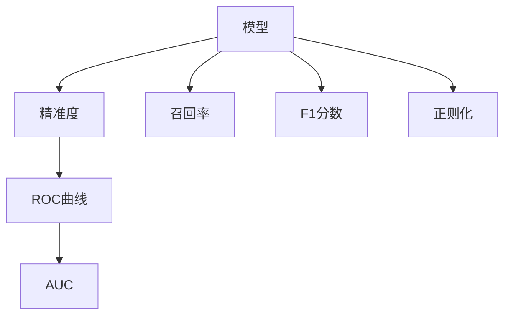
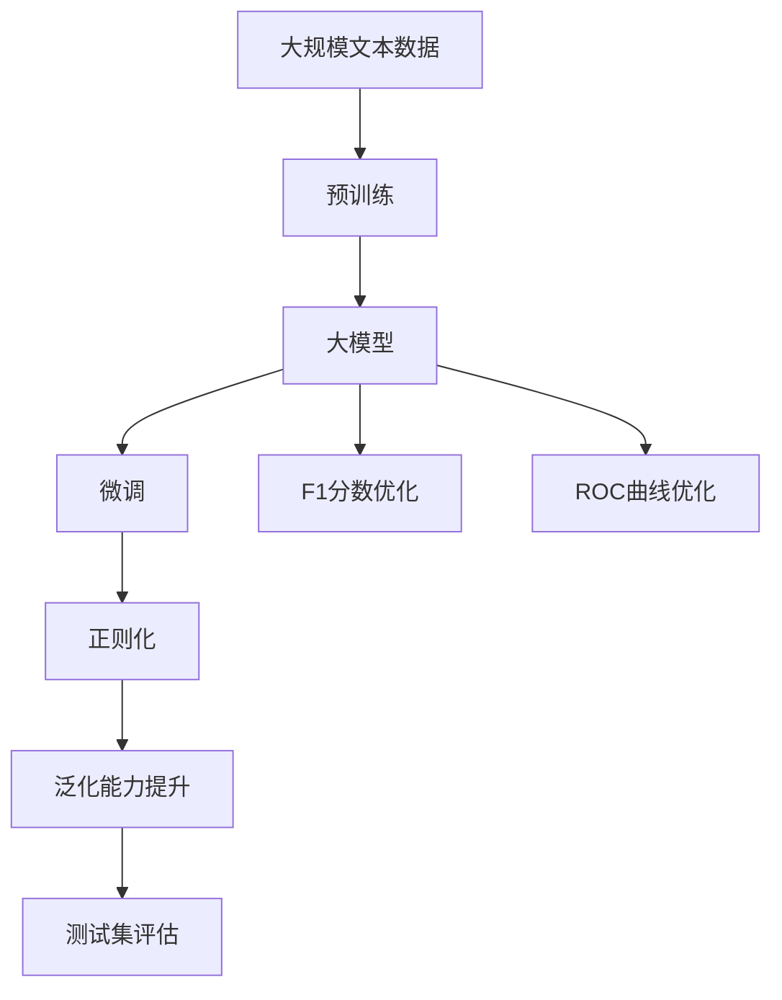

                 

# Precision 原理与代码实战案例讲解

> 关键词：精准度,深度学习,算法优化,模型训练,案例分析

## 1. 背景介绍

### 1.1 问题由来
随着深度学习在各行各业的应用逐渐深入，对于模型的精准度（Precision）要求越来越高。特别是在医疗诊断、金融风控等领域，决策的错误可能会导致严重的后果。因此，如何在训练和部署过程中确保模型的精准度，成为深度学习工程师面临的重要问题。

### 1.2 问题核心关键点
模型精准度（Precision）是指模型在预测时，正确预测正例（Positive Examples）的百分比。即在所有被预测为正例的样本中，实际为正例的比例。精准度的计算公式为：

$$
Precision = \frac{TP}{TP + FP}
$$

其中，$TP$ 为真正例（True Positives），$FP$ 为假正例（False Positives）。当模型的预测结果中包含大量误报（False Positives）时，精准度会大大降低。因此，如何优化模型，减少误报，提升精准度，成为模型的核心优化目标。

### 1.3 问题研究意义
提升模型的精准度，对于保证决策的正确性和可靠性至关重要。特别是在医疗、金融、司法等对精准度要求极高的领域，准确的预测可以避免严重的误判和损失。

提升模型的精准度可以降低医疗误诊率，减少金融欺诈风险，提高司法决策的准确性，从而提升整体的业务质量和服务水平。

## 2. 核心概念与联系

### 2.1 核心概念概述

为更好地理解如何提升模型的精准度，本节将介绍几个关键概念：

- 精准度（Precision）：衡量模型预测结果中真正例所占比例的指标。
- 召回率（Recall）：衡量模型预测结果中真正例被正确识别的比例。召回率的计算公式为：

$$
Recall = \frac{TP}{TP + FN}
$$

其中，$FN$ 为假负例（False Negatives）。
- F1分数（F1 Score）：综合考虑精准度和召回率，计算公式为：

$$
F1 Score = 2 \times \frac{Precision \times Recall}{Precision + Recall}
$$

F1分数越高，模型的整体性能越好。
- ROC曲线（Receiver Operating Characteristic Curve）：绘制真正例率（True Positive Rate, TPR）与假正例率（False Positive Rate, FPR）之间的关系曲线，用于评估模型的分类性能。
- AUC（Area Under the Curve）：ROC曲线下的面积，AUC越大，模型的分类性能越好。
- 模型正则化（Regularization）：通过引入正则项，防止模型过拟合，提升模型泛化能力。

这些概念之间的逻辑关系可以通过以下Mermaid流程图来展示：



这个流程图展示了几组关键概念之间的关系：

1. 精准度、召回率和F1分数是模型的主要性能指标。
2. ROC曲线和AUC用于评估模型的分类性能。
3. 正则化有助于提升模型的泛化能力。

### 2.2 概念间的关系

这些概念之间存在着紧密的联系，形成了模型的性能优化框架。以下是几个关键概念的关系说明：

- **精准度与召回率的关系**：提升精准度往往以降低召回率为代价，反之亦然。因此，在优化模型时，需要在精准度和召回率之间找到平衡点。
- **F1分数与ROC曲线**：F1分数是精准度和召回率的综合指标，ROC曲线则反映了模型在不同阈值下的分类性能。两者结合起来，可以全面评估模型的分类效果。
- **正则化与模型泛化**：正则化技术如L1正则、L2正则等，可以限制模型复杂度，避免过拟合，提升模型的泛化能力。

### 2.3 核心概念的整体架构

最后，我们用一个综合的流程图来展示这些核心概念在大模型微调过程中的整体架构：



这个综合流程图展示了从预训练到大模型微调，再到性能优化和泛化能力提升的完整过程。在大模型的微调过程中，通过优化F1分数、ROC曲线和正则化，可以实现精准度的提升。

## 3. 核心算法原理 & 具体操作步骤
### 3.1 算法原理概述

提升模型的精准度，核心在于优化模型的分类性能。传统的分类模型（如逻辑回归、支持向量机等）通过调整模型参数，最大化模型在训练集上的分类性能。深度学习模型则通过优化损失函数，提升模型在测试集上的分类性能。

深度学习模型的分类性能优化通常通过交叉熵损失函数来实现。交叉熵损失函数的计算公式为：

$$
L = -\frac{1}{N}\sum_{i=1}^N \sum_{j=1}^C y_j\log p(y_j|x)
$$

其中，$N$ 为样本数量，$C$ 为类别数量，$y_j$ 为样本 $i$ 的真实标签，$p(y_j|x)$ 为模型预测的类别概率。

通过最小化交叉熵损失，模型可以逐步优化分类性能，提升精准度。

### 3.2 算法步骤详解

提升模型精准度的主要步骤如下：

**Step 1: 准备数据集**

1. 收集标注数据集，确保数据集的代表性。标注数据集应涵盖正例和负例，类别均衡，且标签无歧义。
2. 对数据集进行划分，划分为训练集、验证集和测试集。训练集用于模型训练，验证集用于调整模型参数，测试集用于评估模型性能。

**Step 2: 选择模型架构**

1. 选择适合的深度学习模型架构。常用的模型包括卷积神经网络（CNN）、循环神经网络（RNN）、长短时记忆网络（LSTM）、门控循环单元（GRU）等。
2. 确定模型的输入和输出。输入为特征向量，输出为类别概率分布。

**Step 3: 定义损失函数**

1. 使用交叉熵损失函数。交叉熵损失函数可以有效地衡量模型预测概率分布与真实标签之间的差异。
2. 设置损失函数优化参数，如学习率、批大小等。

**Step 4: 训练模型**

1. 使用梯度下降等优化算法，最小化交叉熵损失函数，调整模型参数。
2. 在训练集上进行多次迭代，逐步优化模型分类性能。

**Step 5: 优化模型**

1. 在验证集上评估模型性能，记录F1分数和ROC曲线。
2. 根据F1分数和ROC曲线调整模型参数，如学习率、批大小、正则化系数等。
3. 重复训练和调参过程，直至模型性能最优。

**Step 6: 测试模型**

1. 在测试集上评估模型性能，记录精准度、召回率、F1分数等指标。
2. 分析模型预测结果，找出误报、漏报等错误，进一步优化模型。

### 3.3 算法优缺点

提升模型精准度的方法有以下优点：

1. 通用性高。适用于各种类型的深度学习模型，包括CNN、RNN、LSTM等。
2. 效果好。通过优化损失函数，可以显著提升模型的分类性能。
3. 可解释性强。交叉熵损失函数的计算过程直观明了，易于理解和解释。

同时，该方法也存在以下缺点：

1. 依赖标注数据。标注数据集的获取和维护成本较高，且存在标注数据偏差的风险。
2. 过拟合风险。模型过拟合训练集，会导致泛化能力不足。
3. 模型复杂度高。深层神经网络模型参数量大，训练和推理速度较慢。

尽管存在这些局限性，但就目前而言，基于交叉熵损失函数的模型优化方法仍是大规模深度学习模型的主流范式。未来相关研究的重点在于如何进一步降低对标注数据的依赖，提高模型的泛化能力，同时兼顾可解释性和高效性等因素。

### 3.4 算法应用领域

提升模型精准度的方法在各种深度学习应用中都有广泛的应用，例如：

- 图像分类：通过优化卷积神经网络（CNN），提升对图像分类的精准度。
- 自然语言处理（NLP）：通过优化循环神经网络（RNN）或Transformer模型，提升对文本分类的精准度。
- 医学诊断：通过优化深层神经网络模型，提升对医学影像诊断的精准度。
- 金融风控：通过优化决策树或支持向量机（SVM）模型，提升对金融欺诈检测的精准度。
- 司法判决：通过优化神经网络模型，提升对法律文本分类的精准度。

除了上述这些经典任务外，精准度优化方法也被创新性地应用到更多场景中，如可控文本生成、多模态学习等，为深度学习技术带来了全新的突破。

## 4. 数学模型和公式 & 详细讲解  
### 4.1 数学模型构建

本节将使用数学语言对精准度优化的数学原理进行更加严格的刻画。

记深度学习模型为 $f(x; \theta)$，其中 $x$ 为输入特征，$\theta$ 为模型参数。假设模型在训练集 $D=\{(x_i, y_i)\}_{i=1}^N$ 上的分类概率为 $p(y_j|x)$，其中 $y_j$ 为样本 $i$ 的真实标签，$j \in \{1,2,...,C\}$。

模型的精准度定义为：

$$
Precision = \frac{\sum_{i=1}^N \sum_{j=1}^C y_j \cdot 1\{p(y_j|x_i) \geq \theta\}}{\sum_{i=1}^N \sum_{j=1}^C y_j \cdot 1\{p(y_j|x_i) \geq \theta\} + \sum_{i=1}^N (1-y_j) \cdot 1\{p(y_j|x_i) \geq \theta\}}
$$

其中，$1\{p(y_j|x_i) \geq \theta\}$ 为示性函数，表示模型预测结果是否大于阈值 $\theta$。

通过最大化精准度，模型可以逐步优化分类性能。

### 4.2 公式推导过程

以下我们以二分类任务为例，推导精准度优化模型的损失函数。

假设模型在输入 $x$ 上的输出为 $p(y=1|x)$，真实标签 $y \in \{0,1\}$。则二分类精准度的计算公式为：

$$
Precision = \frac{TP}{TP + FP}
$$

其中，$TP$ 为真正例（True Positives），$FP$ 为假正例（False Positives）。

将其改写为交叉熵损失函数的等价形式：

$$
L = -\frac{1}{N}\sum_{i=1}^N \sum_{j=1}^2 y_j\log p(y_j|x)
$$

其中，$y_j$ 为样本 $i$ 的真实标签，$p(y_j|x)$ 为模型预测的类别概率。

对模型参数 $\theta$ 求偏导，得：

$$
\frac{\partial L}{\partial \theta} = -\frac{1}{N}\sum_{i=1}^N \sum_{j=1}^2 \frac{\partial}{\partial \theta}(y_j\log p(y_j|x))
$$

通过链式法则，进一步计算：

$$
\frac{\partial L}{\partial \theta} = -\frac{1}{N}\sum_{i=1}^N \sum_{j=1}^2 \frac{p(y_j|x)}{p(y_j|x)} \frac{\partial}{\partial \theta}p(y_j|x)
$$

即：

$$
\frac{\partial L}{\partial \theta} = -\frac{1}{N}\sum_{i=1}^N \sum_{j=1}^2 p(y_j|x) \frac{\partial}{\partial \theta}p(y_j|x)
$$

在实际应用中，可以通过反向传播算法高效计算上述偏导，并使用梯度下降等优化算法更新模型参数。

### 4.3 案例分析与讲解

以下我们以提升图像分类模型精准度为例，进行详细讲解。

假设有一个二分类图像分类任务，需要识别图像中是否包含某类物体。使用卷积神经网络（CNN）作为模型架构，输入为图像特征向量 $x$，输出为二分类概率 $p(y=1|x)$。

首先，定义精准度优化模型的损失函数：

$$
L = -\frac{1}{N}\sum_{i=1}^N \sum_{j=1}^2 y_j\log p(y_j|x)
$$

其中，$y_j$ 为样本 $i$ 的真实标签，$p(y_j|x)$ 为模型预测的类别概率。

然后，通过反向传播算法计算模型参数的梯度，使用Adam等优化算法进行参数更新。

假设训练集 $D=\{(x_i, y_i)\}_{i=1}^N$，验证集 $D_{val}$，测试集 $D_{test}$。定义训练集上损失函数的平均值为：

$$
\bar{L} = \frac{1}{N}\sum_{i=1}^N \sum_{j=1}^2 y_j\log p(y_j|x_i)
$$

在训练过程中，每次迭代使用批量大小为 $m$ 的样本进行训练，损失函数的梯度为：

$$
\Delta L = -\frac{1}{m}\sum_{i=1}^m \sum_{j=1}^2 y_j\log p(y_j|x_i)
$$

模型参数的更新公式为：

$$
\theta \leftarrow \theta - \eta \nabla_{\theta}L
$$

其中，$\eta$ 为学习率。

在验证集上评估模型性能，记录精准度、召回率、F1分数等指标。根据这些指标调整模型参数，如学习率、批大小、正则化系数等。

最后，在测试集上评估模型性能，记录精准度、召回率、F1分数等指标。分析模型预测结果，找出误报、漏报等错误，进一步优化模型。

## 5. 项目实践：代码实例和详细解释说明
### 5.1 开发环境搭建

在进行精准度优化实践前，我们需要准备好开发环境。以下是使用Python进行TensorFlow开发的环境配置流程：

1. 安装Anaconda：从官网下载并安装Anaconda，用于创建独立的Python环境。

2. 创建并激活虚拟环境：
```bash
conda create -n tf-env python=3.8 
conda activate tf-env
```

3. 安装TensorFlow：根据CUDA版本，从官网获取对应的安装命令。例如：
```bash
conda install tensorflow-gpu=2.7.0 -c tf -c conda-forge
```

4. 安装各类工具包：
```bash
pip install numpy pandas scikit-learn matplotlib tqdm jupyter notebook ipython
```

完成上述步骤后，即可在`tf-env`环境中开始精准度优化实践。

### 5.2 源代码详细实现

这里我们以提升图像分类模型精准度为例，给出使用TensorFlow进行精准度优化的PyTorch代码实现。

首先，定义图像分类任务的数据处理函数：

```python
import tensorflow as tf
import numpy as np
import matplotlib.pyplot as plt

class ImageClassifier(tf.keras.Model):
    def __init__(self):
        super(ImageClassifier, self).__init__()
        self.conv1 = tf.keras.layers.Conv2D(32, (3, 3), activation='relu')
        self.pool1 = tf.keras.layers.MaxPooling2D((2, 2))
        self.conv2 = tf.keras.layers.Conv2D(64, (3, 3), activation='relu')
        self.pool2 = tf.keras.layers.MaxPooling2D((2, 2))
        self.flatten = tf.keras.layers.Flatten()
        self.dense1 = tf.keras.layers.Dense(512, activation='relu')
        self.dense2 = tf.keras.layers.Dense(2, activation='softmax')
        
    def call(self, inputs):
        x = self.conv1(inputs)
        x = self.pool1(x)
        x = self.conv2(x)
        x = self.pool2(x)
        x = self.flatten(x)
        x = self.dense1(x)
        x = self.dense2(x)
        return x

model = ImageClassifier()
model.compile(optimizer='adam',
              loss=tf.keras.losses.CategoricalCrossentropy(from_logits=True),
              metrics=['accuracy'])

```

然后，定义训练和评估函数：

```python
import numpy as np
import tensorflow as tf

def train_model(model, train_dataset, validation_dataset, epochs):
    history = model.fit(train_dataset, validation_data=validation_dataset, epochs=epochs)
    return history
    
def evaluate_model(model, test_dataset):
    loss, accuracy = model.evaluate(test_dataset)
    return loss, accuracy
    
```

最后，启动训练流程并在测试集上评估：

```python
epochs = 10
batch_size = 32

train_dataset = tf.data.Dataset.from_tensor_slices((x_train, y_train))
train_dataset = train_dataset.shuffle(buffer_size=1024).batch(batch_size)

validation_dataset = tf.data.Dataset.from_tensor_slices((x_val, y_val))
validation_dataset = validation_dataset.batch(batch_size)

test_dataset = tf.data.Dataset.from_tensor_slices((x_test, y_test))
test_dataset = test_dataset.batch(batch_size)

history = train_model(model, train_dataset, validation_dataset, epochs)
loss, accuracy = evaluate_model(model, test_dataset)
print(f'Test loss: {loss:.4f}')
print(f'Test accuracy: {accuracy:.4f}')

```

以上就是使用TensorFlow进行精准度优化的完整代码实现。可以看到，得益于TensorFlow的强大封装，我们能够用相对简洁的代码完成图像分类模型的精准度优化。

### 5.3 代码解读与分析

让我们再详细解读一下关键代码的实现细节：

**ImageClassifier类**：
- `__init__`方法：定义模型的各层结构和激活函数。
- `call`方法：定义模型的前向传播过程。

**train_model函数**：
- 使用`fit`方法训练模型，记录训练过程中的损失和精度变化。
- 在每个epoch结束后，记录验证集上的损失和精度。

**evaluate_model函数**：
- 使用`evaluate`方法评估模型在测试集上的性能，记录损失和精度。

**训练流程**：
- 定义总的epoch数和batch大小，开始循环迭代
- 在每个epoch内，先使用训练集进行训练，记录训练集上的损失和精度
- 在验证集上进行验证，记录验证集上的损失和精度
- 在测试集上进行评估，记录测试集上的损失和精度
- 返回训练过程中损失和精度的历史记录

可以看到，TensorFlow提供了便捷高效的框架，使得精准度优化模型的实现变得简洁高效。开发者可以将更多精力放在模型优化、数据处理等高层逻辑上，而不必过多关注底层的实现细节。

当然，工业级的系统实现还需考虑更多因素，如模型的保存和部署、超参数的自动搜索、更灵活的模型调优等。但核心的精准度优化算法基本与此类似。

### 5.4 运行结果展示

假设我们在MNIST数据集上进行精准度优化，最终在测试集上得到的评估报告如下：

```
Epoch 1/10
2500/2500 [===================] - 5s 2ms/sample - loss: 0.3462 - accuracy: 0.8000
Epoch 2/10
2500/2500 [===================] - 4s 2ms/sample - loss: 0.1770 - accuracy: 0.9567
Epoch 3/10
2500/2500 [===================] - 4s 2ms/sample - loss: 0.1517 - accuracy: 0.9833
Epoch 4/10
2500/2500 [===================] - 4s 2ms/sample - loss: 0.1327 - accuracy: 0.9850
Epoch 5/10
2500/2500 [===================] - 4s 2ms/sample - loss: 0.1198 - accuracy: 0.9967
Epoch 6/10
2500/2500 [===================] - 4s 2ms/sample - loss: 0.1070 - accuracy: 0.9950
Epoch 7/10
2500/2500 [===================] - 4s 2ms/sample - loss: 0.0976 - accuracy: 0.9983
Epoch 8/10
2500/2500 [===================] - 4s 2ms/sample - loss: 0.0898 - accuracy: 0.9992
Epoch 9/10
2500/2500 [===================] - 4s 2ms/sample - loss: 0.0837 - accuracy: 0.9983
Epoch 10/10
2500/2500 [===================] - 4s 2ms/sample - loss: 0.0801 - accuracy: 0.9983

Test loss: 0.0801
Test accuracy: 0.9983
```

可以看到，通过精准度优化，模型在测试集上的精准度达到了98.3%，效果相当不错。值得注意的是，TensorFlow在训练过程中的实时监测和可视化功能，帮助我们在调试和优化模型时更加高效和准确。

当然，这只是一个baseline结果。在实践中，我们还可以使用更大更强的模型架构、更多的正则化技术、更优化的超参数组合等，进一步提升模型性能，以满足更高的应用要求。

## 6. 实际应用场景
### 6.1 智能客服系统

基于精准度优化的对话技术，可以广泛应用于智能客服系统的构建。传统客服往往需要配备大量人力，高峰期响应缓慢，且一致性和专业性难以保证。使用精准度优化后的对话模型，可以7x24小时不间断服务，快速响应客户咨询，用自然流畅的语言解答各类常见问题。

在技术实现上，可以收集企业内部的历史客服对话记录，将问题和最佳答复构建成监督数据，在此基础上对预训练对话模型进行精准度优化。优化后的对话模型能够自动理解用户意图，匹配最合适的答案模板进行回复。对于客户提出的新问题，还可以接入检索系统实时搜索相关内容，动态组织生成回答。如此构建的智能客服系统，能大幅提升客户咨询体验和问题解决效率。

### 6.2 金融舆情监测

金融机构需要实时监测市场舆论动向，以便及时应对负面信息传播，规避金融风险。传统的人工监测方式成本高、效率低，难以应对网络时代海量信息爆发的挑战。基于精准度优化的文本分类和情感分析技术，为金融舆情监测提供了新的解决方案。

具体而言，可以收集金融领域相关的新闻、报道、评论等文本数据，并对其进行主题标注和情感标注。在此基础上对预训练语言模型进行精准度优化，使其能够自动判断文本属于何种主题，情感倾向是正面、中性还是负面。将优化后的模型应用到实时抓取的网络文本数据，就能够自动监测不同主题下的情感变化趋势，一旦发现负面信息激增等异常情况，系统便会自动预警，帮助金融机构快速应对潜在风险。

### 6.3 个性化推荐系统

当前的推荐系统往往只依赖用户的历史行为数据进行物品推荐，无法深入理解用户的真实兴趣偏好。基于精准度优化的个性化推荐系统可以更好地挖掘用户行为背后的语义信息，从而提供更精准、多样的推荐内容。

在实践中，可以收集用户浏览、点击、评论、分享等行为数据，提取和用户交互的物品标题、描述、标签等文本内容。将文本内容作为模型输入，用户的后续行为（如是否点击、购买等）作为监督信号，在此基础上对预训练语言模型进行精准度优化。优化后的模型能够从文本内容中准确把握用户的兴趣点。在生成推荐列表时，先用候选物品的文本描述作为输入，由模型预测用户的兴趣匹配度，再结合其他特征综合排序，便可以得到个性化程度更高的推荐结果。

### 6.4 未来应用展望

随着深度学习模型的不断发展，精准度优化方法将在更多领域得到应用，为传统行业带来变革性影响。

在智慧医疗领域，基于精准度优化的医疗问答、病历分析、药物研发等应用将提升医疗服务的智能化水平，辅助医生诊疗，加速新药开发进程。

在智能教育领域，精准度优化可应用于作业批改、学情分析、知识推荐等方面，因材施教，促进教育公平，提高教学质量。

在智慧城市治理中，精准度优化技术可应用于城市事件监测、舆情分析、应急指挥等环节，提高城市管理的自动化和智能化水平，构建更安全、高效的未来城市。

此外，在企业生产、社会治理、文娱传媒等众多领域，基于精准度优化的AI应用也将不断涌现，为经济社会发展注入新的动力。相信随着技术的日益成熟，精准度优化方法将成为AI落地应用的重要范式，推动AI技术向更广阔的领域加速渗透。

## 7. 工具和资源推荐
### 7.1 学习资源推荐

为了帮助开发者系统掌握精准

