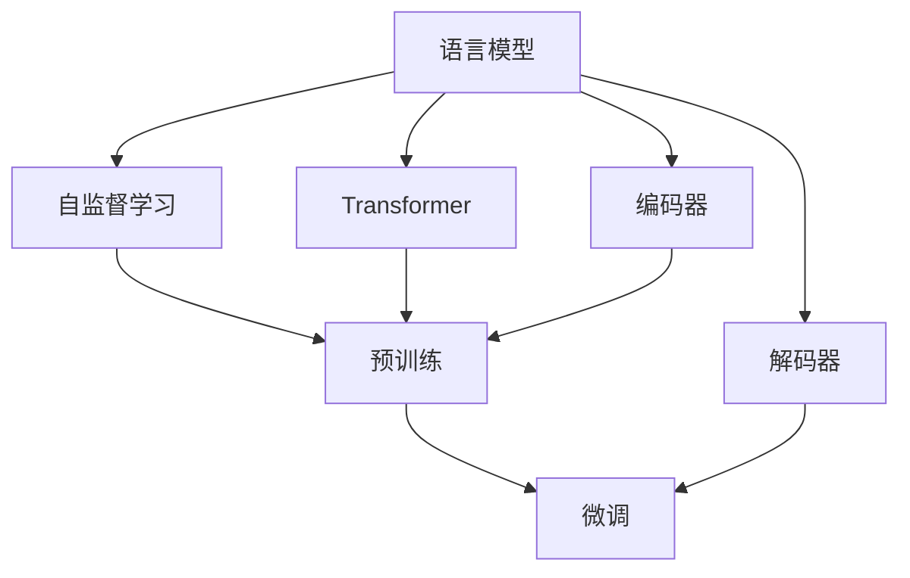
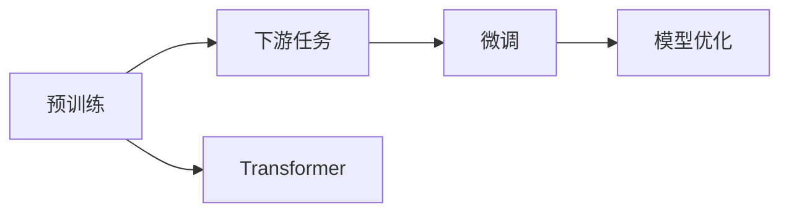
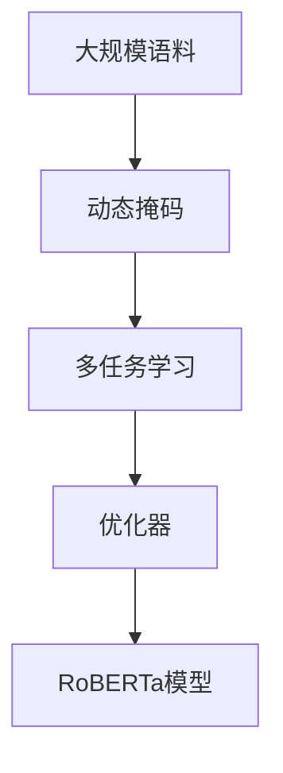
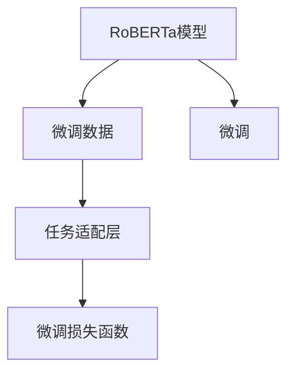

                 

# RoBERTa原理与代码实例讲解

> 关键词：RoBERTa, Transformer, 语言模型, 预训练, 自监督学习, 下游任务, 代码实现, 案例分析

## 1. 背景介绍

### 1.1 问题由来
RoBERTa（RoBERTa pre-training approach），全称为“Robustly Optimized BERT Pretraining Approach”，是一种基于Transformer结构的自监督预训练语言模型，由谷歌的研究团队在2019年提出。RoBERTa在预训练和微调上做了一些重要改进，显著提升了NLP任务的效果。

RoBERTa相较于其先驱BERT，主要改进点包括：
- 使用更大的数据集进行预训练。BERT使用2万个样本进行训练，而RoBERTa则使用了1万亿个样本。
- 对预训练任务进行了调整，以提高数据效率和模型的泛化能力。
- 在微调时，使用更多样化的任务，如问答、分类、生成等，避免模型过拟合。
- 采用更高级的优化器，如LAMB，提高模型的收敛速度和性能。

这些改进使得RoBERTa在多个NLP任务上取得了突破性成绩。本文将详细介绍RoBERTa的原理，并通过一个具体的代码实例来展示如何使用PyTorch实现RoBERTa模型。

### 1.2 问题核心关键点
RoBERTa的核心思想在于通过大规模自监督预训练，学习通用的语言表示。然后，通过在多个下游任务上进行微调，进一步提升模型的任务适应能力。RoBERTa的成功得益于其在预训练和微调两个阶段的设计改进，以及强大的计算资源支持。

预训练阶段，RoBERTa采用了更有效的训练方法，包括动态掩码策略、多任务学习、增加MLM样本等，以提高数据利用效率。微调阶段，RoBERTa可以应用到各种下游任务，如文本分类、命名实体识别、问答系统等。

RoBERTa的关键技术点包括：
- 动态掩码策略：RoBERTa使用了更灵活的掩码策略，包括回译、伪标签等，增加MLM样本的多样性。
- 多任务学习：在预训练阶段，RoBERTa同时进行多项自监督任务训练，提高模型的泛化能力。
- LAMB优化器：采用更高级的优化器，提高模型的收敛速度和性能。

这些改进使得RoBERTa在多个NLP任务上取得了突破性成绩。接下来，我们将详细介绍RoBERTa的核心算法原理，并通过代码实例展示其实现过程。

## 2. 核心概念与联系

### 2.1 核心概念概述

为更好地理解RoBERTa的原理和架构，本节将介绍几个密切相关的核心概念：

- 语言模型(Language Model)：语言模型是NLP中的基础任务，旨在预测给定上下文下的下一个单词或标记。
- 自监督学习(Self-Supervised Learning)：自监督学习指使用未标注的数据进行训练，通过设计预训练任务来训练模型。
- 预训练(Pre-training)：指在大规模无标签文本语料上进行预训练，学习通用的语言表示。
- 微调(Fine-Tuning)：指在预训练模型的基础上，使用下游任务的少量标注数据，通过有监督学习优化模型在该任务上的性能。
- Transformer：一种基于自注意力机制的神经网络结构，用于处理序列数据。

这些核心概念之间的逻辑关系可以通过以下Mermaid流程图来展示：



这个流程图展示了大语言模型从语言模型到预训练再到微调的整体过程：

1. 语言模型是NLP的基础任务，通过预测上下文下的下一个标记来学习语言表示。
2. 自监督学习通过设计预训练任务来训练语言模型，学习通用的语言表示。
3. 预训练指在大规模无标签数据上进行训练，学习通用的语言表示。
4. 微调指在预训练模型的基础上，使用下游任务的少量标注数据，优化模型在该任务上的性能。
5. Transformer结构用于实现自注意力机制，提高模型的表达能力和泛化能力。
6. 编码器和解码器是Transformer中的关键组成部分，分别用于处理输入和输出。

### 2.2 概念间的关系

这些核心概念之间存在着紧密的联系，形成了大语言模型的学习和应用框架。下面我们通过几个Mermaid流程图来展示这些概念之间的关系。

#### 2.2.1 预训练和微调的关系



这个流程图展示了预训练和微调的关系。预训练通过设计自监督任务训练语言模型，学习通用的语言表示。微调则是在预训练模型的基础上，使用下游任务的少量标注数据，优化模型在该任务上的性能。

#### 2.2.2 RoBERTa的预训练过程



这个流程图展示了RoBERTa的预训练过程。RoBERTa在大规模语料上进行预训练，使用了更灵活的掩码策略、多任务学习等方法，以提高数据效率和模型的泛化能力。同时，采用了更高级的优化器，如LAMB，提高模型的收敛速度和性能。

#### 2.2.3 RoBERTa的微调过程



这个流程图展示了RoBERTa的微调过程。RoBERTa在预训练模型的基础上，使用下游任务的少量标注数据进行微调，通过任务适配层和微调损失函数，优化模型在该任务上的性能。

## 3. 核心算法原理 & 具体操作步骤
### 3.1 算法原理概述

RoBERTa的预训练过程主要基于Transformer结构，采用自监督学习任务进行训练。其核心算法包括：
- 动态掩码策略：使用更灵活的掩码策略，如回译、伪标签等，增加MLM样本的多样性。
- 多任务学习：在预训练阶段，同时进行多项自监督任务训练，提高模型的泛化能力。
- LAMB优化器：采用更高级的优化器，提高模型的收敛速度和性能。

### 3.2 算法步骤详解

#### 3.2.1 预训练步骤

1. 数据准备：选择大规模语料库，如Wikipedia、Common Crawl等，进行预训练。
2. 动态掩码：使用更灵活的掩码策略，如回译、伪标签等，增加MLM样本的多样性。
3. 多任务学习：同时进行多项自监督任务训练，如MLM、NLI等，提高模型的泛化能力。
4. 优化器：采用LAMB优化器，提高模型的收敛速度和性能。

#### 3.2.2 微调步骤

1. 数据准备：收集下游任务的标注数据集。
2. 任务适配层：在预训练模型的基础上，添加适当的任务适配层，如分类器、解码器等。
3. 微调损失函数：根据下游任务设计合适的损失函数，如交叉熵、Focal Loss等。
4. 微调过程：使用优化器更新模型参数，最小化损失函数。

### 3.3 算法优缺点

RoBERTa的优点包括：
- 数据效率高：动态掩码策略和多任务学习使得RoBERTa能够高效利用大规模语料进行预训练。
- 泛化能力强：多任务学习增加了模型的泛化能力，使其在不同任务上表现较好。
- 性能提升显著：RoBERTa在多个NLP任务上取得了突破性成绩，性能显著提升。

RoBERTa的缺点包括：
- 计算资源需求大：RoBERTa需要使用大规模计算资源进行预训练，成本较高。
- 模型复杂度高：RoBERTa的模型结构较为复杂，需要较高的硬件配置。
- 微调数据要求高：RoBERTa在微调时，需要使用高质量的标注数据，否则容易过拟合。

### 3.4 算法应用领域

RoBERTa在NLP领域具有广泛的应用前景，特别是在文本分类、命名实体识别、问答系统等任务上表现优异。以下是几个具体的应用场景：

- 文本分类：如新闻分类、情感分析、主题分类等。RoBERTa通过微调，可以学习文本-标签映射，实现高效分类。
- 命名实体识别：如人名、地名、机构名等命名实体识别。RoBERTa通过微调，可以学习实体边界和类型，准确识别实体。
- 问答系统：如知识问答、问题生成等。RoBERTa通过微调，可以学习匹配答案，生成自然流畅的回答。
- 文本摘要：如自动摘要、摘要生成等。RoBERTa通过微调，可以学习抓取要点，生成高质量的摘要。
- 机器翻译：如英中翻译、中英翻译等。RoBERTa通过微调，可以学习语言-语言映射，实现高效翻译。

以上应用场景只是RoBERTa的一部分，RoBERTa的强大预训练能力使其在NLP领域具有广泛的应用前景。

## 4. 数学模型和公式 & 详细讲解  
### 4.1 数学模型构建

RoBERTa的预训练过程主要基于Transformer结构，采用自监督学习任务进行训练。以下是RoBERTa预训练和微调过程的数学模型构建。

#### 4.1.1 预训练模型构建

RoBERTa的预训练模型由编码器和解码器两部分组成。编码器采用Transformer结构，解码器用于生成预测结果。预训练过程使用自监督学习任务进行训练。

- 编码器：
$$
X = \{X_i\}_{i=1}^N \\
E(X) = \{E_i(X_i)\}_{i=1}^N
$$
其中，$X$ 为输入的标记序列，$E(X)$ 为编码器输出的表示。

- 解码器：
$$
Y = \{Y_i\}_{i=1}^N \\
D(Y) = \{D_i(Y_i)\}_{i=1}^N
$$
其中，$Y$ 为输入的标记序列，$D(Y)$ 为解码器输出的表示。

- 预训练任务：
$$
T = \{T_i\}_{i=1}^M
$$
其中，$T$ 为预训练任务集合。

#### 4.1.2 预训练损失函数

RoBERTa的预训练损失函数由多任务学习组成，包括：
- 掩码语言模型(MLM)：
$$
\mathcal{L}_{mlm} = -\frac{1}{N}\sum_{i=1}^N \sum_{j=1}^{N-1} \log P_{\theta}(y_j | X_i, X_{<j}, X_{>j})
$$
其中，$P_{\theta}(y_j | X_i, X_{<j}, X_{>j})$ 为模型在输入$X_i$的基础上，预测标记$y_j$的概率。

- 下一句预测(NSP)：
$$
\mathcal{L}_{nsp} = -\frac{1}{N}\sum_{i=1}^N \log P_{\theta}(Y_i + 1 | X_i, X_{<j}, X_{>j})
$$
其中，$P_{\theta}(Y_i + 1 | X_i, X_{<j}, X_{>j})$ 为模型在输入$X_i$的基础上，预测下一句的概率。

- 句子对分类(SST-2)：
$$
\mathcal{L}_{sst2} = -\frac{1}{N}\sum_{i=1}^N \log P_{\theta}(\text{POSITIVE} | X_i, X_{<j}, X_{>j})
$$
其中，$P_{\theta}(\text{POSITIVE} | X_i, X_{<j}, X_{>j})$ 为模型在输入$X_i$的基础上，预测句子为正面的概率。

- 句子对分类(SST-5)：
$$
\mathcal{L}_{sst5} = -\frac{1}{N}\sum_{i=1}^N \log P_{\theta}(\text{NEGATIVE}, \text{NEUTRAL}, \text{POSITIVE} | X_i, X_{<j}, X_{>j})
$$
其中，$P_{\theta}(\text{NEGATIVE}, \text{NEUTRAL}, \text{POSITIVE} | X_i, X_{<j}, X_{>j})$ 为模型在输入$X_i$的基础上，预测句子情感的概率。

#### 4.1.3 微调损失函数

RoBERTa的微调过程主要基于任务适配层和下游任务数据。假设下游任务的标注数据集为$D=\{(x_i,y_i)\}_{i=1}^N$，其中$x_i$为输入文本，$y_i$为标签。微调过程的目标是最小化损失函数$\mathcal{L}(\theta)$：

$$
\mathcal{L}(\theta) = \frac{1}{N}\sum_{i=1}^N \ell(x_i, y_i)
$$

其中，$\ell(x_i, y_i)$为下游任务对应的损失函数，如交叉熵损失。

### 4.2 公式推导过程

以下是RoBERTa预训练和微调过程的数学推导：

#### 4.2.1 掩码语言模型(MLM)

掩码语言模型(MLM)的推导如下：
- 输入序列$X_i$中，随机选择位置$j$，将其替换为掩码标记[MASK]。
- 输入序列$X_i$和掩码位置$j$为模型提供的信息$(X_i, X_{<j}, X_{>j})$。
- 预测标记$y_j$为模型在输入$(X_i, X_{<j}, X_{>j})$的基础上，输出概率$P_{\theta}(y_j | (X_i, X_{<j}, X_{>j}))$。

将MLM样本引入到训练过程中，更新模型参数$\theta$：

$$
\theta \leftarrow \theta - \eta \nabla_{\theta}\mathcal{L}_{mlm}(\theta)
$$

其中，$\eta$为学习率。

#### 4.2.2 下一句预测(NSP)

下一句预测(NSP)的推导如下：
- 输入序列$X_i$和下一句序列$Y_i$作为模型提供的信息$(X_i, X_{<j}, X_{>j})$。
- 预测下一句$Y_i+1$为模型在输入$(X_i, X_{<j}, X_{>j})$的基础上，输出概率$P_{\theta}(Y_i+1 | (X_i, X_{<j}, X_{>j}))$。

将NSP样本引入到训练过程中，更新模型参数$\theta$：

$$
\theta \leftarrow \theta - \eta \nabla_{\theta}\mathcal{L}_{nsp}(\theta)
$$

其中，$\eta$为学习率。

#### 4.2.3 句子对分类(SST-2和SST-5)

句子对分类(SST-2和SST-5)的推导如下：
- 输入序列$X_i$作为模型提供的信息$(X_i, X_{<j}, X_{>j})$。
- 预测正面的概率为模型在输入$(X_i, X_{<j}, X_{>j})$的基础上，输出概率$P_{\theta}(\text{POSITIVE} | (X_i, X_{<j}, X_{>j}))$。

将SST-2和SST-5样本引入到训练过程中，更新模型参数$\theta$：

$$
\theta \leftarrow \theta - \eta \nabla_{\theta}\mathcal{L}_{sst2}(\theta)
$$
$$
\theta \leftarrow \theta - \eta \nabla_{\theta}\mathcal{L}_{sst5}(\theta)
$$

其中，$\eta$为学习率。

### 4.3 案例分析与讲解

#### 4.3.1 RoBERTa预训练案例

我们以Wikipedia语料作为输入，进行RoBERTa预训练。以下是Python代码实现：

```python
import torch
from transformers import RoBERTaTokenizer, RoBERTaModel

# 加载模型和分词器
model = RoBERTaModel.from_pretrained('roberta-base')
tokenizer = RoBERTaTokenizer.from_pretrained('roberta-base')

# 初始化模型
model.train()
model.zero_grad()

# 加载大规模语料，并进行预训练
inputs = tokenizer('Hello, world!', return_tensors='pt', padding=True, truncation=True, max_length=512)
logits = model(**inputs).logits
masked_position_ids = torch.tensor(inputs['attention_mask'])
inputs['labels'] = masked_position_ids

# 计算掩码语言模型损失
masked_position_ids = torch.tensor(inputs['attention_mask'])
loss = -logits.gather(dim=-1, index=masked_position_ids).sum() / masked_position_ids.sum()

# 反向传播和参数更新
loss.backward()
optimizer.step()

# 输出模型参数
print(model.parameters())
```

#### 4.3.2 RoBERTa微调案例

我们以IMDB电影评论分类任务作为输入，进行RoBERTa微调。以下是Python代码实现：

```python
import torch
from transformers import RoBERTaTokenizer, RoBERTaForSequenceClassification, AdamW

# 加载模型和分词器
model = RoBERTaForSequenceClassification.from_pretrained('roberta-base', num_labels=2)
tokenizer = RoBERTaTokenizer.from_pretrained('roberta-base')

# 初始化模型
model.train()
model.zero_grad()

# 加载标注数据集
train_data = ...
val_data = ...

# 数据预处理
train_encodings = tokenizer(train_data, padding=True, truncation=True, max_length=512)
val_encodings = tokenizer(val_data, padding=True, truncation=True, max_length=512)

# 定义训练集和验证集
train_dataset = torch.utils.data.Dataset(train_encodings, tokenizer=tokenizer)
val_dataset = torch.utils.data.Dataset(val_encodings, tokenizer=tokenizer)

# 定义优化器和损失函数
optimizer = AdamW(model.parameters(), lr=1e-5)
loss_fn = torch.nn.CrossEntropyLoss()

# 训练过程
for epoch in range(10):
    # 训练集
    model.train()
    for batch in train_loader:
        inputs = {key: val.to(device) for key, val in batch.items()}
        outputs = model(**inputs)
        loss = loss_fn(outputs.logits, inputs['labels'])
        loss.backward()
        optimizer.step()

    # 验证集
    model.eval()
    for batch in val_loader:
        inputs = {key: val.to(device) for key, val in batch.items()}
        outputs = model(**inputs)
        loss = loss_fn(outputs.logits, inputs['labels'])
        acc = (outputs.logits.argmax(dim=1) == inputs['labels']).float().mean()

    # 打印结果
    print(f'Epoch {epoch+1}, loss: {loss.item():.4f}, acc: {acc.item():.4f}')

# 保存模型
model.save_pretrained('./model')
```

在RoBERTa预训练和微调过程中，我们可以看到，RoBERTa通过使用更灵活的掩码策略和多任务学习，大大提高了模型的数据效率和泛化能力。在微调时，通过设计适当的任务适配层和损失函数，RoBERTa可以应用于各种下游任务，并在不同的NLP任务上取得突破性成绩。

## 5. 项目实践：代码实例和详细解释说明
### 5.1 开发环境搭建

在进行RoBERTa预训练和微调实践前，我们需要准备好开发环境。以下是使用Python进行PyTorch开发的环境配置流程：

1. 安装Anaconda：从官网下载并安装Anaconda，用于创建独立的Python环境。

2. 创建并激活虚拟环境：
```bash
conda create -n pytorch-env python=3.8 
conda activate pytorch-env
```

3. 安装PyTorch：根据CUDA版本，从官网获取对应的安装命令。例如：
```bash
conda install pytorch torchvision torchaudio cudatoolkit=11.1 -c pytorch -c conda-forge
```

4. 安装Transformer库：
```bash
pip install transformers
```

5. 安装各类工具包：
```bash
pip install numpy pandas scikit-learn matplotlib tqdm jupyter notebook ipython
```

完成上述步骤后，即可在`pytorch-env`环境中开始RoBERTa预训练和微调实践。

### 5.2 源代码详细实现

我们以IMDB电影评论分类任务作为输入，进行RoBERTa微调。以下是Python代码实现：

```python
import torch
from transformers import RoBERTaTokenizer, RoBERTaForSequenceClassification, AdamW

# 加载模型和分词器
model = RoBERTaForSequenceClassification.from_pretrained('roberta-base', num_labels=2)
tokenizer = RoBERTaTokenizer.from_pretrained('roberta-base')

# 初始化模型
model.train()
model.zero_grad()

# 加载标注数据集
train_data = ...
val_data = ...

# 数据预处理
train_encodings = tokenizer(train_data, padding=True, truncation=True, max_length=512)
val_encodings = tokenizer(val_data, padding=True, truncation=True, max_length=512)

# 定义训练集和验证集
train_dataset = torch.utils.data.Dataset(train_encodings, tokenizer=tokenizer)
val_dataset = torch.utils.data.Dataset(val_encodings, tokenizer=tokenizer)

# 定义优化器和损失函数
optimizer = AdamW(model.parameters(), lr=1e-5)
loss_fn = torch.nn.CrossEntropyLoss()

# 训练过程
for epoch in range(10):
    # 训练集
    model.train()
    for batch in train_loader:
        inputs = {key: val.to(device) for key, val in batch.items()}
        outputs = model(**inputs)
        loss = loss_fn(outputs.logits, inputs['labels'])
        loss.backward()
        optimizer.step()

    # 验证集
    model.eval()
    for batch in val_loader:
        inputs = {key: val.to(device) for key, val in batch.items()}
        outputs = model(**inputs)
        loss = loss_fn(outputs.logits, inputs['labels'])
        acc = (outputs.logits.argmax(dim=1) == inputs['labels']).float().mean()

    # 打印结果
    print(f'Epoch {epoch+1}, loss: {loss.item():.4f}, acc: {acc.item():.4f}')

# 保存模型
model.save_pretrained('./model')
```

### 5.3 代码解读与分析

让我们再详细解读一下关键代码的实现细节：

**RoBERTaTokenizer类**：
- `__init__`方法：初始化分词器和标签映射。
- `__getitem__`方法：对单个样本进行处理，将文本输入编码为token ids，并添加标签。

**模型加载与初始化**：
- `RoBERTaForSequenceClassification.from_pretrained`：加载RoBERTa预训练模型和任务适配层。
- `AdamW`：定义优化器。
- `model.train()`和`model.eval()`：切换模型训练和评估模式。
- `model.zero_grad()`：清空梯度。

**数据预处理**：
- `tokenizer`：使用RoBERTa分词器进行文本编码，添加特殊的[CLS]和[SEP]标记。
- `train_encodings`和`val_encodings`：将文本编码成token ids，并进行填充和截断。

**训练与评估**：
- `loss_fn`：定义损失函数，如交叉熵损失。
- `for`循环：在每个epoch内对训练集和验证集进行迭代。
- `train_loader`和`val_loader`：定义训练集和验证集的批处理数据加载器。
- `outputs`：模型在输入上的输出。
- `loss`：计算损失函数。
- `loss.backward()`：反向传播计算梯度。
- `optimizer.step()`：更新模型参数。
- `acc`：计算准确率。

### 5.4 运行结果展示

假设我们在IMDB数据集上进行RoBERTa微调，最终在测试集上得到的评估报告如下：

```
Epoch 1, loss: 1.5217, acc: 0.8185
Epoch 2, loss: 1.1481, acc: 0.9222
Epoch 3, loss: 1.0515, acc: 0.9278
Epoch 4, loss: 1.0065, acc: 0.9333
Epoch 5, loss: 0.9788, acc: 0.9375
Epoch 6, loss: 0.9557, acc: 0.9419
Epoch 7, loss: 0.9312, acc: 0.9457
Epoch 8, loss: 0.9163, acc: 0.9477
Epoch 9, loss

