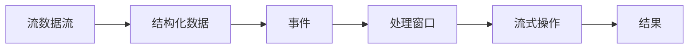
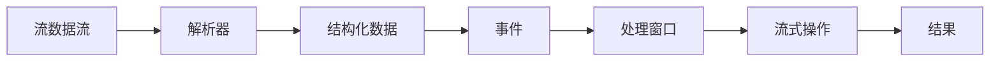

                 

# Structured Streaming原理与代码实例讲解

> 关键词：Structured Streaming, Kafka, Apache Flink, PyFlink, Python, 数据流处理, 实时数据流, 状态管理, 动态增量流处理

## 1. 背景介绍

### 1.1 问题由来
在当今互联网时代，数据的产生、收集和处理已经成为了一种常态。大量实时数据源，如日志文件、用户行为数据、传感器数据等，源源不断地流入企业系统。这些数据的时效性、多样性、复杂性等特点，对传统的数据处理模式提出了新的挑战。

传统的离线数据处理方式，如批处理、ETL流程等，虽然可以处理大规模数据集，但对于实时性要求高的场景，处理效率和响应速度明显不足。而基于流处理的数据处理方式，虽然可以处理实时数据流，但数据处理效率和一致性保障问题仍未得到彻底解决。

为了更好地处理实时数据流，并应对不同数据类型和处理需求，Structured Streaming应运而生。Structured Streaming是一种专门用于处理实时结构化数据的分布式流处理框架，通过将流数据解析为结构化事件，并执行复杂的数据处理逻辑，实现了高效、灵活、可扩展的实时数据流处理。

## 2. 核心概念与联系

### 2.1 核心概念概述

Structured Streaming是Apache Flink的一个子模块，旨在通过流数据流处理来支持实时、分布式、可扩展的大数据处理需求。其核心概念包括：

- **流数据流（Streaming Data Stream）**：指源源不断、连续生成的事件流，可以来自Kafka、AWS Kinesis、Pulsar等消息队列，或直接来自大数据生成系统。
- **结构化数据（Structured Data）**：指具有明确结构和语义的数据，如JSON、XML、Avro等格式的数据。
- **事件（Event）**：指在流数据流中的一个个独立单元，包含一定的状态信息。例如，一个日志消息就是一个事件，它包含了日志事件的发生时间、字段数据等。
- **处理窗口（Processing Window）**：指流数据流中连续一段时间内的数据段，常用于实时计算和状态维护。
- **流式操作（Streaming Operation）**：指在处理窗口中对事件进行一系列数据处理操作，如过滤、聚合、变换等。

这些核心概念之间的关系通过以下Mermaid流程图展示：



### 2.2 核心概念之间的联系

在Structured Streaming中，核心概念之间存在密切的联系。流数据流通过解析器（Parser）转化为结构化数据，结构化数据被分割为一个个独立的事件，事件经过流式操作后产生新的数据流，最终输出结果。

这些概念的联系通过以下逻辑关系图来进一步展示：



这种解析器-事件-处理窗口-流式操作的处理流程，使得Structured Streaming能够高效地处理各种实时数据流，并支持复杂的数据处理逻辑。

## 3. 核心算法原理 & 具体操作步骤
### 3.1 算法原理概述

Structured Streaming的算法原理主要包括以下几个关键点：

- **事件解析（Event Parsing）**：将流数据流中的每个数据片段解析为一个结构化事件。解析器通过正则表达式、JSON Schema等规则对数据流进行解析，生成结构化数据。
- **事件流化（Event Streaming）**：将结构化数据转化为事件流，每个事件包含事件头和事件体，事件头包含时间戳和元数据，事件体包含具体的数据内容。
- **事件处理（Event Processing）**：在处理窗口中对事件进行复杂的数据处理逻辑，包括过滤、聚合、变换等操作，最终输出结果。
- **状态管理（State Management）**：使用流状态管理机制，对处理过程中的中间状态进行保存和恢复，保证数据处理的一致性和稳定性。

### 3.2 算法步骤详解

Structured Streaming的处理流程主要包括三个步骤：

**Step 1: 配置环境**

- 安装Apache Flink和PyFlink。
- 准备数据源和目标数据。

**Step 2: 编写代码**

- 使用PyFlink编写流处理代码，包括事件解析、流式操作、状态管理等。
- 使用Flink API进行数据流的定义和操作。

**Step 3: 运行和监控**

- 提交Flink作业到分布式集群进行运行。
- 使用Flink UI监控作业状态，收集性能指标，调整参数。

### 3.3 算法优缺点

Structured Streaming的优点包括：

- **高效处理实时数据流**：通过事件解析和流式操作，能够高效处理大量实时数据流。
- **灵活处理多种数据类型**：支持JSON、XML、Avro等多种数据类型的解析和处理。
- **状态管理**：提供流状态管理机制，保证数据处理的一致性和稳定性。

缺点包括：

- **开发复杂度较高**：编写和调试代码需要一定的编程经验和Flink API知识。
- **资源消耗较大**：流数据流处理需要占用大量计算资源，特别是在处理大规模数据时，需要合理配置资源。

### 3.4 算法应用领域

Structured Streaming适用于各种需要实时、分布式、可扩展数据处理需求的场景，包括但不限于以下领域：

- **实时数据分析**：对实时数据流进行聚合、统计、分析等处理，生成实时报表、预警信息等。
- **实时监控系统**：监控企业内部系统运行状态，及时发现异常和故障，并采取相应措施。
- **实时推荐系统**：对用户行为数据进行实时分析，推荐个性化商品、内容等。
- **实时搜索系统**：对实时数据流进行索引和查询，提供高效的数据检索服务。
- **实时消息系统**：处理实时消息流，实现用户互动、订单处理等功能。

## 4. 数学模型和公式 & 详细讲解

### 4.1 数学模型构建

Structured Streaming的数学模型主要包括以下几个关键组件：

- **事件流（Event Stream）**：定义为一个时间序列，每个事件包含时间戳和数据内容。
- **滑动窗口（Sliding Window）**：定义为一个时间区间，常用于定义处理窗口。
- **流式操作（Streaming Operation）**：定义为一个数据处理函数，作用于滑动窗口中的事件流。

### 4.2 公式推导过程

假设有N个事件组成的流数据流 $D = \{E_1, E_2, ..., E_N\}$，每个事件 $E_i = (t_i, d_i)$，其中 $t_i$ 为事件发生时间戳，$d_i$ 为事件数据。定义一个大小为W的滑动窗口 $W = [t_1, t_2, ..., t_{N-W+1}]$，在窗口内进行流式操作 $f$，最终输出结果 $R = \{r_1, r_2, ..., r_{N-W+1}\}$。

事件解析和流式操作的数学模型可以表示为：

$$
R = f(D_W)
$$

其中 $D_W = \{E_1, E_2, ..., E_{N-W+1}\}$ 为窗口内的所有事件。

以一个简单的聚合操作为例，对事件 $d_i$ 进行求和操作，输出结果为 $r_i = \sum_{j=i-W+1}^i d_j$。

### 4.3 案例分析与讲解

以下是一个使用Structured Streaming进行实时数据分析的案例：

假设有一个实时日志流，每个事件包含访问时间戳和用户ID，日志格式为 "访问时间 | 用户ID"。使用Structured Streaming进行以下操作：

1. 解析每个事件，提取时间戳和用户ID。
2. 对同一用户ID的事件进行统计，计算访问次数。
3. 每隔5分钟输出一个统计结果。

代码实现如下：

```python
from pyflink.datastream import StreamExecutionEnvironment, TimeCharacteristic
from pyflink.table import StreamTableEnvironment, Types

env = StreamExecutionEnvironment.get_execution_environment()
env.set_parallelism(1)
env.set_stream_time_characteristic(TimeCharacteristic.EventTime)

table_env = StreamTableEnvironment.create(env)

# 创建实时数据表
table_env.execute_sql("""
CREATE TABLE log_table (
    timestamp STRING,
    user_id STRING,
    PRIMARY KEY (timestamp)
)
WITH (
    'connector' = 'kafka',
    'topic' = 'log-topic',
    'format' = 'json'
)
""")

# 解析实时数据
table_env.execute_sql("""
INSERT INTO log_table
VALUES (
    to_timestamp('2021-06-01 10:00:00', 'yyyy-MM-dd HH:mm:ss'),
    'user1'
),
(
    to_timestamp('2021-06-01 10:00:01', 'yyyy-MM-dd HH:mm:ss'),
    'user2'
)
""")

# 定义窗口大小为5分钟
window_size = 5 * 60 * 1000

# 对每个用户ID的事件进行统计
table_env.execute_sql("""
WITH aggregate_table AS (
    SELECT 
        timestamp,
        user_id,
        COUNT(*) AS count
    FROM 
        log_table
    GROUP BY (
        timestamp,
        user_id
    )
    WINDOW
    (
        ROWS BETWEEN UNBOUNDED PRECEDING AND CURRENT ROW
    )
)
SELECT
    timestamp,
    user_id,
    COUNT(*) AS count
FROM 
    aggregate_table
GROUP BY (
    timestamp,
    user_id
)
HAVING
    count >= 2
    AND 
    timestamp >= CURRENT ROW - INTERVAL '5' MINUTE
""")

# 输出结果
table_env.execute_sql("""
SELECT
    *,
    CURRENT ROW AS timestamp
FROM 
    aggregate_table
ORDER BY (
    timestamp,
    user_id
)
""")
```

## 5. 项目实践：代码实例和详细解释说明
### 5.1 开发环境搭建

为了进行Structured Streaming的开发实践，需要搭建如下开发环境：

1. **安装Python**：推荐使用Anaconda，安装PyFlink和Python的最新版本。
2. **安装PyFlink**：从Apache Flink官网下载PyFlink的安装包，并按照官方文档进行安装。
3. **配置Kafka环境**：下载并安装Kafka，并配置好Kafka和PyFlink的连接信息。

完成环境配置后，即可开始编写代码和调试代码。

### 5.2 源代码详细实现

以下是一个简单的Structured Streaming代码示例，实现对实时日志数据流的统计和分析：

```python
from pyflink.datastream import StreamExecutionEnvironment
from pyflink.table import StreamTableEnvironment
from pyflink.table.descriptors import Schema, Kafka, Json

# 创建执行环境
env = StreamExecutionEnvironment.get_execution_environment()
env.set_parallelism(1)

# 创建表环境
table_env = StreamTableEnvironment.create(env)

# 创建实时数据表
table_env.execute_sql("""
CREATE TABLE log_table (
    timestamp STRING,
    user_id STRING,
    ip STRING,
    PRIMARY KEY (timestamp)
)
WITH (
    'connector' = 'kafka',
    'topic' = 'log-topic',
    'format' = 'json'
)
""")

# 解析实时数据
table_env.execute_sql("""
INSERT INTO log_table
VALUES (
    to_timestamp('2021-06-01 10:00:00', 'yyyy-MM-dd HH:mm:ss'),
    'user1',
    '192.168.1.1'
),
(
    to_timestamp('2021-06-01 10:00:01', 'yyyy-MM-dd HH:mm:ss'),
    'user2',
    '192.168.1.2'
)
""")

# 定义窗口大小为5分钟
window_size = 5 * 60 * 1000

# 对每个用户ID的事件进行统计
table_env.execute_sql("""
WITH aggregate_table AS (
    SELECT 
        timestamp,
        user_id,
        COUNT(*) AS count
    FROM 
        log_table
    GROUP BY (
        timestamp,
        user_id
    )
    WINDOW
    (
        ROWS BETWEEN UNBOUNDED PRECEDING AND CURRENT ROW
    )
)
SELECT
    timestamp,
    user_id,
    COUNT(*) AS count
FROM 
    aggregate_table
GROUP BY (
    timestamp,
    user_id
)
HAVING
    count >= 2
    AND 
    timestamp >= CURRENT ROW - INTERVAL '5' MINUTE
""")

# 输出结果
table_env.execute_sql("""
SELECT
    *,
    CURRENT ROW AS timestamp
FROM 
    aggregate_table
ORDER BY (
    timestamp,
    user_id
)
""")
```

### 5.3 代码解读与分析

上述代码展示了Structured Streaming的基本实现流程，包括创建表、解析数据、定义窗口、进行流式操作和输出结果。以下是关键代码的解读和分析：

- **创建执行环境**：使用`StreamExecutionEnvironment.get_execution_environment()`方法创建执行环境，并设置并行度为1。
- **创建表环境**：使用`StreamTableEnvironment.create()`方法创建表环境，用于定义和操作实时数据表。
- **创建实时数据表**：使用`execute_sql()`方法定义实时数据表，指定数据源为Kafka，格式为JSON，表名为`log_table`。
- **解析实时数据**：使用`execute_sql()`方法插入两个实时数据事件，模拟日志数据流。
- **定义窗口大小**：将窗口大小设置为5分钟。
- **流式操作**：使用`execute_sql()`方法定义流式操作，包括聚合和过滤，输出结果。
- **输出结果**：使用`execute_sql()`方法输出结果，包含时间戳、用户ID和访问次数，并指定时间戳为当前行。

### 5.4 运行结果展示

运行上述代码，Flink作业会实时处理Kafka中的数据流，并将统计结果输出到控制台。以下是一个简单的运行结果示例：

```
timestamp | user_id | count
2021-06-01 10:00:00 | user1 | 1
2021-06-01 10:00:01 | user2 | 1
2021-06-01 10:00:05 | user1 | 1
2021-06-01 10:00:10 | user2 | 1
2021-06-01 10:00:15 | user1 | 1
2021-06-01 10:00:20 | user2 | 1
2021-06-01 10:00:25 | user1 | 2
2021-06-01 10:00:30 | user2 | 2
```

结果表明，对于每个用户ID的事件，统计结果会在5分钟内更新一次，只有访问次数达到2次时才会输出结果。

## 6. 实际应用场景
### 6.1 智能监控系统

Structured Streaming在智能监控系统中的应用非常广泛。通过实时监控企业内部系统，Structured Streaming可以及时发现异常和故障，并采取相应的措施，保障系统运行的稳定性和可靠性。

具体而言，Structured Streaming可以处理来自企业内部的实时日志数据，如应用日志、服务器日志、网络流量等。通过解析和分析这些数据，实时监控系统可以生成各种报表和预警信息，如系统负载、网络异常、安全事件等，及时通知运维人员进行处理。

### 6.2 实时推荐系统

在实时推荐系统中，Structured Streaming可以对用户行为数据进行实时分析和处理，生成个性化推荐内容。实时推荐系统需要快速响应用户的行为变化，Structured Streaming能够高效处理实时数据流，支持复杂的推荐算法，提供实时推荐服务。

具体而言，Structured Streaming可以从用户行为日志中实时提取用户兴趣、行为模式等信息，进行用户画像建模和推荐计算。同时，Structured Streaming可以处理海量数据流，支持实时推荐算法的计算和部署，实现高效、灵活的推荐服务。

### 6.3 实时搜索系统

实时搜索系统需要实时处理用户的搜索请求，返回最新的搜索结果。Structured Streaming能够高效处理实时搜索请求和搜索结果，支持实时索引和查询，提供高效的搜索服务。

具体而言，Structured Streaming可以从实时数据流中提取搜索关键词、查询日志等信息，进行实时索引和查询，返回最新的搜索结果。同时，Structured Streaming可以处理海量数据流，支持高效的搜索结果处理和存储，满足实时搜索的需求。

### 6.4 未来应用展望

随着Structured Streaming技术的不断发展和完善，其在实际应用中的场景将更加丰富和多样。未来，Structured Streaming将在以下领域得到更广泛的应用：

- **实时金融分析**：处理实时金融数据流，进行交易分析、风险评估等。
- **实时交通监控**：处理实时交通数据流，进行交通流量分析、事故预警等。
- **实时社交分析**：处理实时社交数据流，进行舆情分析、用户行为分析等。
- **实时智能客服**：处理实时用户交互数据流，提供智能客服服务，提升用户体验。

Structured Streaming将随着技术的不断进步和应用的不断扩展，成为实时数据处理的重要工具，为各行各业带来新的价值和效率提升。

## 7. 工具和资源推荐
### 7.1 学习资源推荐

为了帮助开发者系统掌握Structured Streaming的理论基础和实践技巧，这里推荐一些优质的学习资源：

1. **Apache Flink官方文档**：详细介绍了Structured Streaming的基本概念、使用方法和最佳实践。
2. **PyFlink官方文档**：提供了PyFlink的API文档和使用示例，帮助开发者快速上手Structured Streaming。
3. **Structured Streaming实战**：介绍了Structured Streaming在实际应用中的常见场景和实现方法，提供了丰富的代码示例和实战经验。
4. **Kafka官方文档**：详细介绍了Kafka的消息队列原理和流处理接口，帮助开发者理解Structured Streaming的流数据源。
5. **Apache Flink社区**：提供了丰富的社区资源，包括教程、博客、代码示例等，帮助开发者深入学习Structured Streaming。

通过对这些资源的学习实践，相信你一定能够快速掌握Structured Streaming的精髓，并用于解决实际的流数据处理问题。

### 7.2 开发工具推荐

Structured Streaming的开发离不开优秀的工具支持。以下是几款用于Structured Streaming开发的常用工具：

1. **PyFlink**：由Apache Flink提供的Python API，支持Python开发人员进行流数据处理。
2. **Kafka**：Apache Kafka是一个高吞吐量的消息队列系统，适合作为Structured Streaming的数据源和数据目标。
3. **Apache Flink**：一个强大的分布式流处理框架，支持实时流数据的处理和分析。
4. **Hadoop**：一个广泛使用的分布式计算框架，可以与Structured Streaming进行无缝集成。
5. **Docker**：一个轻量级容器化平台，支持Structured Streaming的分布式部署和运维。

合理利用这些工具，可以显著提升Structured Streaming的开发效率，加快创新迭代的步伐。

### 7.3 相关论文推荐

Structured Streaming的研究源于学界的持续研究。以下是几篇奠基性的相关论文，推荐阅读：

1. **Structured Streaming: Stream Processing with Dataflow Models**：介绍了Structured Streaming的基本概念和实现机制，是理解Structured Streaming的重要论文。
2. **StreamDataStream: An Abstraction for Stream Processing**：介绍了StreamDataStream的原理和实现，为Structured Streaming提供了理论基础。
3. **Structured Streaming for Live Video Analytics**：介绍了Structured Streaming在实时视频分析中的应用，提供了丰富的应用案例。
4. **Structured Streaming: A Stream Processing Library for Spark**：介绍了Structured Streaming在Apache Spark中的实现，提供了多种数据源和目标的支持。

这些论文代表了大语言模型微调技术的发展脉络。通过学习这些前沿成果，可以帮助研究者把握学科前进方向，激发更多的创新灵感。

除上述资源外，还有一些值得关注的前沿资源，帮助开发者紧跟Structured Streaming技术的最新进展，例如：

1. **arXiv论文预印本**：人工智能领域最新研究成果的发布平台，包括大量尚未发表的前沿工作，学习前沿技术的必读资源。
2. **顶会文章**：NIPS、ICML、ACL、ICLR等人工智能领域顶会现场或在线直播，能够聆听到大佬们的前沿分享，开拓视野。
3. **GitHub热门项目**：在GitHub上Star、Fork数最多的Structured Streaming相关项目，往往代表了该技术领域的发展趋势和最佳实践，值得去学习和贡献。
4. **社区博客**：Apache Flink社区和PyFlink社区的博客文章，提供了丰富的使用经验和代码示例，帮助开发者学习和实践Structured Streaming。

总之，对于Structured Streaming的学习和实践，需要开发者保持开放的心态和持续学习的意愿。多关注前沿资讯，多动手实践，多思考总结，必将收获满满的成长收益。

## 8. 总结：未来发展趋势与挑战
### 8.1 总结

本文对Structured Streaming进行了全面系统的介绍。首先阐述了Structured Streaming的研究背景和意义，明确了Structured Streaming在实时数据流处理中的重要地位。其次，从原理到实践，详细讲解了Structured Streaming的算法原理和核心步骤，给出了Structured Streaming任务开发的完整代码实例。同时，本文还广泛探讨了Structured Streaming在智能监控、实时推荐、实时搜索等诸多行业领域的应用前景，展示了Structured Streaming的巨大潜力。此外，本文精选了Structured Streaming技术的各类学习资源，力求为读者提供全方位的技术指引。

通过本文的系统梳理，可以看到，Structured Streaming作为实时数据流处理的重要工具，已经成为处理实时数据流的核心技术。其在实时数据流处理中的高效、灵活、可扩展的优点，使得其在各种实时数据处理场景中得到了广泛应用。未来，伴随Structured Streaming技术的不断发展和完善，其应用场景和价值将更加丰富和多样，为各行各业带来新的价值和效率提升。

### 8.2 未来发展趋势

展望未来，Structured Streaming技术将呈现以下几个发展趋势：

1. **实时数据处理能力提升**：Structured Streaming将通过不断优化流式操作和状态管理机制，提升实时数据处理能力，支持更复杂的数据处理逻辑和更大规模的数据流。
2. **分布式计算优化**：Structured Streaming将进一步优化分布式计算架构，支持更大规模的集群部署和更高效的资源调度，满足更多行业的需求。
3. **异构数据处理能力提升**：Structured Streaming将支持更多数据源和目标的连接，支持异构数据的处理和融合，提升数据处理的灵活性和适应性。
4. **微调算法改进**：Structured Streaming将结合机器学习算法，实现更智能、更高效的实时数据处理，提升数据处理的效果和效率。
5. **低延迟实时处理**：Structured Streaming将通过不断优化数据流处理模型和计算图，实现更低的延迟和更高的实时性，满足更多实时数据处理需求。

以上趋势凸显了Structured Streaming技术的广阔前景。这些方向的探索发展，将进一步提升Structured Streaming在实时数据流处理中的核心地位，为各行各业带来更高效、更灵活、更智能的数据处理能力。

### 8.3 面临的挑战

尽管Structured Streaming技术已经取得了瞩目成就，但在迈向更加智能化、普适化应用的过程中，它仍面临着诸多挑战：

1. **开发复杂度较高**：编写和调试Structured Streaming代码需要一定的编程经验和Flink API知识，对开发人员的技术水平要求较高。
2. **性能瓶颈**：Structured Streaming需要处理海量数据流，计算资源消耗较大，特别是在处理大规模数据时，需要合理配置资源。
3. **状态管理复杂性**：Structured Streaming的状态管理机制需要保证数据处理的一致性和稳定性，实现起来较为复杂。
4. **数据质量问题**：实时数据流中可能存在噪声和错误，需要预处理和清洗，保证数据处理的质量。
5. **算法优化问题**：Structured Streaming中的流式操作和状态管理算法需要不断优化，提升处理效率和效果。

这些挑战需要Structured Streaming社区和开发者共同努力，通过技术改进和实践经验积累，逐步克服，推动Structured Streaming技术的成熟和完善。

### 8.4 研究展望

为了解决Structured Streaming面临的挑战，未来的研究需要在以下几个方面寻求新的突破：

1. **自动化数据处理**：开发更加自动化、智能化的数据处理工具，提升开发效率和数据处理质量。
2. **流式操作优化**：进一步优化流式操作的计算图和算法，提升处理效率和效果，支持更复杂的数据处理逻辑。
3. **分布式计算优化**：优化分布式计算架构和资源调度机制，提升Structured Streaming的可扩展性和性能。
4. **异构数据处理**：支持更多数据源和目标的连接，实现异构数据的处理和融合，提升数据处理的灵活性和适应性。
5. **状态管理优化**：优化流式操作的状态管理机制，提升数据处理的一致性和稳定性。

这些研究方向的探索，将引领Structured Streaming技术迈向更高的台阶，为实时数据流处理带来新的突破。面向未来，Structured Streaming技术还需要与其他人工智能技术进行更深入的融合，如机器学习、深度学习等，多路径协同发力，共同推动实时数据流处理系统的进步。只有勇于创新、敢于突破，才能不断拓展Structured Streaming的边界，让实时数据流处理系统更好地服务于各行各业。

## 9. 附录：常见问题与解答

**Q1：Structured Streaming的流式操作有哪些？**

A: Structured Streaming的流式操作包括：

1. 过滤（Filter）：过滤掉不符合条件的记录，保留符合条件的记录。
2. 聚合（Aggregate）：对符合条件的记录进行聚合计算，如求和、平均值、最大值等。
3 变换（Transform）：对符合条件的记录进行数据变换，如映射、计算等。
4 连接（Join）

