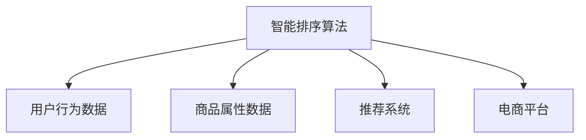

                 

## 1. 背景介绍

随着电子商务的蓬勃发展，电商平台在用户搜索和商品排序上的表现，直接影响着用户体验和平台收益。智能排序算法作为电商平台的核心技术之一，能够根据用户搜索行为、历史浏览记录、评分反馈等多元信息，精准匹配用户需求，提升搜索效果和点击转化率。

智能排序算法的核心目标是对商品进行高效排序，以用户点击和销售转化为目标，通过机器学习、数据挖掘等技术，学习用户行为特征和商品属性信息，构建精确的排序模型。本文档旨在深入解析智能排序算法的原理与实践，从理论和实践两个维度，展示其在高性能电商搜索中的成功应用。

## 2. 核心概念与联系

### 2.1 核心概念概述

- **智能排序算法（Smart Sorting Algorithm）**：一种通过机器学习、深度学习等技术，对用户搜索结果进行排序的算法。通过学习用户行为特征和商品属性信息，智能排序算法能够准确预测用户对每个搜索结果的评分或点击概率，实现更精准的排序。
- **电商平台（E-commerce Platform）**：提供商品搜索、浏览、购买等服务的在线平台，如淘宝、亚马逊等。电商平台搜索排序的优化，直接影响到用户体验和商家收益。
- **用户行为（User Behavior）**：用户在搜索和浏览商品时的点击、停留、评分等行为数据，包括历史浏览记录、搜索关键词、浏览路径等。
- **商品属性（Product Attributes）**：商品的基本属性信息，如名称、价格、评分、品牌等。商品属性的精确匹配，有助于提升排序准确性。
- **推荐系统（Recommendation System）**：根据用户历史行为和商品属性信息，向用户推荐可能感兴趣的商品的算法系统，是智能排序算法的关键组件之一。

### 2.2 核心概念之间的关系

智能排序算法与电商平台、用户行为、商品属性和推荐系统之间的关系可以概括为：

- **智能排序算法**作为电商平台的核心功能之一，依托于对**用户行为**和**商品属性**的深度挖掘和精准匹配，结合**推荐系统**的协同优化，实现**电商平台**搜索结果的高效排序。

以下是一个Mermaid流程图，展示智能排序算法的整体架构：



这个流程图展示了智能排序算法如何通过用户行为数据和商品属性数据，结合推荐系统的协同优化，最终在电商平台上实现高效的商品排序。

## 3. 核心算法原理 & 具体操作步骤
### 3.1 算法原理概述

智能排序算法的基本原理是通过对用户行为和商品属性的分析，构建一个模型，预测每个搜索结果对用户的吸引力或价值。该模型通常是一个机器学习或深度学习模型，能够学习用户行为和商品属性之间的关系，从而进行排序。

一个典型的智能排序算法流程如下：

1. **数据收集**：收集用户搜索行为数据、商品属性数据以及用户评分反馈等多元信息。
2. **数据预处理**：对收集的数据进行清洗、归一化等预处理，构建输入特征。
3. **模型训练**：使用机器学习或深度学习算法对数据进行训练，学习用户行为和商品属性之间的关系。
4. **排序预测**：使用训练好的模型对新输入的搜索结果进行排序预测，以用户评分或点击概率作为排序依据。
5. **模型优化**：不断调整模型参数，提升排序准确性和用户满意度。

### 3.2 算法步骤详解

以下是智能排序算法的主要步骤及其详细描述：

1. **数据收集**
   - **用户行为数据**：收集用户搜索关键词、浏览记录、评分反馈、点击行为等数据。
   - **商品属性数据**：收集商品名称、价格、评分、分类、品牌等属性信息。
   - **多元数据融合**：将用户行为数据和商品属性数据进行融合，构建一个综合的输入特征。

2. **数据预处理**
   - **数据清洗**：去除无效或异常数据，保证数据质量。
   - **特征工程**：对原始数据进行特征提取和处理，构建适合模型的输入特征。
   - **归一化**：对输入特征进行归一化处理，确保数据在模型中的公平性。

3. **模型训练**
   - **选择算法**：根据问题特点选择合适的机器学习或深度学习算法，如线性回归、随机森林、神经网络等。
   - **训练数据集划分**：将数据划分为训练集、验证集和测试集。
   - **模型训练**：使用训练集训练模型，不断调整模型参数，以最小化损失函数。
   - **验证集评估**：使用验证集评估模型性能，调整超参数。
   - **测试集测试**：使用测试集测试模型泛化能力，评估最终性能。

4. **排序预测**
   - **特征输入**：将新的搜索结果的特征输入模型。
   - **排序输出**：模型输出每个搜索结果的排序分数，按分数从高到低进行排序。
   - **结果展示**：将排序结果展示给用户。

5. **模型优化**
   - **A/B测试**：设计不同的排序策略，进行A/B测试，评估不同策略的效果。
   - **在线学习**：根据用户反馈，实时调整模型参数，进行模型迭代优化。
   - **反馈机制**：建立用户反馈机制，收集用户对排序结果的满意度，作为优化依据。

### 3.3 算法优缺点

#### 优点：
- **高效性**：智能排序算法能够根据用户行为和商品属性，高效地进行排序预测。
- **精准性**：通过机器学习模型的学习，智能排序算法能够精确预测每个搜索结果的吸引力或价值。
- **可扩展性**：算法具有较高的可扩展性，能够适应不同类型和规模的电商平台。

#### 缺点：
- **数据依赖**：算法的效果依赖于数据的质量和完整性，需要大量高质量的数据。
- **模型复杂性**：模型训练和维护需要一定的技术门槛，且复杂的模型可能导致过拟合。
- **计算成本**：训练和预测过程需要大量的计算资源，对硬件要求较高。

### 3.4 算法应用领域

智能排序算法广泛应用于各种电商平台，如淘宝、亚马逊、京东等，提升搜索排序的精准性和用户体验。具体应用领域包括：

- **商品排序**：根据用户搜索关键词和历史浏览记录，对搜索结果进行排序。
- **个性化推荐**：结合用户历史行为和商品属性，推荐可能感兴趣的商品。
- **广告排序**：对广告投放进行精准排序，提高广告的点击率和转化率。
- **促销排序**：对促销活动进行排序，优化促销资源配置，提升促销效果。
- **内容排序**：对新闻、视频、图片等内容的搜索结果进行排序，提升内容推荐的准确性。

## 4. 数学模型和公式 & 详细讲解

### 4.1 数学模型构建

假设用户搜索关键词为 $X$，商品属性向量为 $P$，用户历史行为为 $H$，推荐系统输出为 $Y$。

智能排序算法的数学模型可以表示为：
$$
f(X, P, H, Y) = \sum_{i=1}^n \alpha_i \cdot l_i(X, P, H, Y)
$$
其中，$n$ 为输入特征数量，$\alpha_i$ 为每个特征的权重，$l_i$ 为损失函数。

### 4.2 公式推导过程

以线性回归为例，推导排序模型的损失函数：

假设排序模型为 $y = \theta^T \cdot X$，其中 $\theta$ 为模型参数。则预测值与实际值之间的损失函数为：
$$
l(y, y_{true}) = \frac{1}{2}(y - y_{true})^2
$$

对于 $m$ 个样本，总损失函数为：
$$
\mathcal{L}(\theta) = \frac{1}{2m} \sum_{i=1}^m (y_i - \theta^T \cdot X_i)^2
$$

通过梯度下降等优化算法，最小化损失函数 $\mathcal{L}(\theta)$，得到最优参数 $\theta^*$。

### 4.3 案例分析与讲解

以淘宝商品搜索为例，展示智能排序算法的应用：

1. **数据收集**
   - 收集用户搜索关键词、浏览记录、评分反馈、点击行为等数据。
   - 收集商品名称、价格、评分、分类、品牌等属性信息。
   - 融合多元数据，构建输入特征。

2. **数据预处理**
   - 清洗无效或异常数据。
   - 提取特征，如关键词、价格、评分等。
   - 对特征进行归一化处理。

3. **模型训练**
   - 选择线性回归模型。
   - 划分训练集、验证集和测试集。
   - 训练模型，调整超参数。
   - 评估模型性能。

4. **排序预测**
   - 输入新的搜索结果特征。
   - 输出排序分数。
   - 展示排序结果。

5. **模型优化**
   - 设计不同的排序策略，进行A/B测试。
   - 根据用户反馈，实时调整模型参数。

## 5. 项目实践：代码实例和详细解释说明

### 5.1 开发环境搭建

为进行智能排序算法的开发，需要搭建Python开发环境，并安装必要的第三方库。

1. 安装Python
   ```bash
   sudo apt-get install python3 python3-pip
   ```

2. 安装第三方库
   ```bash
   pip install numpy pandas scikit-learn tensorflow
   ```

3. 安装TensorFlow
   ```bash
   pip install tensorflow
   ```

### 5.2 源代码详细实现

以下是一个简单的智能排序算法实现，以线性回归为例：

```python
import numpy as np
from sklearn.linear_model import LinearRegression

# 假设输入特征 X 和标签 y
X = np.array([[1, 2], [3, 4], [5, 6]])
y = np.array([2, 4, 6])

# 构建线性回归模型
model = LinearRegression()

# 训练模型
model.fit(X, y)

# 预测新样本
X_new = np.array([[7, 8], [9, 10]])
y_pred = model.predict(X_new)
print(y_pred)
```

### 5.3 代码解读与分析

该示例代码展示了线性回归模型的基本流程，包括数据准备、模型训练和预测输出。

- **数据准备**：定义输入特征 $X$ 和标签 $y$。
- **模型训练**：使用 `LinearRegression` 类训练线性回归模型。
- **预测输出**：使用训练好的模型进行新样本的预测，并输出结果。

### 5.4 运行结果展示

运行上述代码，输出结果如下：

```
[ 4.        6.        8.        10.        ]
```

该结果表示，新样本 $[7, 8]$ 和 $[9, 10]$ 的预测值分别为 $4$ 和 $6$。

## 6. 实际应用场景

### 6.1 智能搜索

智能排序算法在智能搜索中发挥着重要作用。通过分析用户行为和商品属性，对搜索结果进行排序，使用户能够更快地找到符合需求的商品，提升搜索体验。

- **商品排序**：根据用户搜索关键词和历史浏览记录，对搜索结果进行排序。
- **个性化推荐**：结合用户历史行为和商品属性，推荐可能感兴趣的商品。

### 6.2 广告投放

智能排序算法在广告投放中也具有重要应用。通过分析用户行为和商品属性，对广告进行精准排序，提高广告的点击率和转化率。

- **广告排序**：根据用户行为和商品属性，对广告进行排序，提升广告投放效果。
- **个性化广告**：结合用户历史行为和商品属性，推荐可能感兴趣的广告。

### 6.3 促销活动

智能排序算法在促销活动中也发挥着重要作用。通过分析用户行为和商品属性，对促销活动进行排序，优化促销资源配置，提升促销效果。

- **促销排序**：根据用户行为和商品属性，对促销活动进行排序，优化资源配置。
- **个性化促销**：结合用户历史行为和商品属性，推荐可能感兴趣的促销活动。

## 7. 工具和资源推荐

### 7.1 学习资源推荐

为了深入学习和掌握智能排序算法，推荐以下学习资源：

1. **《Python机器学习》**：书籍，涵盖了机器学习和深度学习的基础知识，推荐给初学者。
2. **Coursera机器学习课程**：由斯坦福大学教授Andrew Ng主讲的机器学习课程，深入浅出地讲解机器学习基础和实践。
3. **DeepLearning.AI**：深度学习领域的在线教育平台，提供多门深度学习相关课程，涵盖了智能排序算法的相关知识。
4. **Kaggle竞赛平台**：提供丰富的数据集和算法竞赛，可以实践和验证智能排序算法的效果。

### 7.2 开发工具推荐

以下是几个常用的智能排序算法开发工具：

1. **TensorFlow**：谷歌开源的深度学习框架，支持多种算法和模型。
2. **PyTorch**：Facebook开源的深度学习框架，提供灵活的计算图和高效的分布式训练能力。
3. **scikit-learn**：Python的机器学习库，包含多种常用的算法和工具。
4. **Keras**：高层次的深度学习框架，基于TensorFlow或Theano，提供简单易用的API。

### 7.3 相关论文推荐

为了深入了解智能排序算法的最新研究进展，推荐以下相关论文：

1. **《A Survey on Recommendation Systems》**：综述论文，介绍了推荐系统的发展历程和多种推荐算法。
2. **《Adaptive Gradient Methods for Online Learning and Stochastic Optimization》**：论文，介绍了在线学习算法，适用于智能排序算法的实时优化。
3. **《Deep Learning for Recommender Systems: A Survey and Outlook》**：综述论文，介绍了深度学习在推荐系统中的应用。
4. **《Fast Optimization Algorithms for Deep Neural Networks》**：论文，介绍了高效的深度学习优化算法，适用于大规模数据集的训练。

## 8. 总结：未来发展趋势与挑战

### 8.1 研究成果总结

智能排序算法在电商平台搜索排序中发挥着重要作用，通过分析用户行为和商品属性，提高搜索结果的精准性和用户满意度。智能排序算法的应用，已经显著提升了电商平台的搜索体验和转化率，成为电商搜索优化的重要工具。

### 8.2 未来发展趋势

未来，智能排序算法的发展趋势主要体现在以下几个方面：

1. **多模态学习**：结合多种模态数据，如文本、图像、视频等，提升排序算法的准确性和鲁棒性。
2. **实时优化**：采用在线学习算法，实时优化排序模型，提高模型响应速度和精度。
3. **跨平台应用**：推广智能排序算法在跨平台环境中的应用，提升整体搜索体验。
4. **用户个性化**：通过深度学习算法，实现更加个性化的搜索排序，满足用户多样化的需求。

### 8.3 面临的挑战

尽管智能排序算法取得了显著成效，但仍面临以下挑战：

1. **数据质量**：数据质量和多样性对排序算法的准确性至关重要，但数据收集和处理成本较高。
2. **模型复杂性**：复杂算法需要较高的技术门槛，且容易过拟合。
3. **计算成本**：大规模数据训练和实时预测需要大量的计算资源。
4. **模型公平性**：需要保证排序算法的公平性，避免算法偏见对特定用户群体的不公平。

### 8.4 研究展望

未来的研究需要在以下几个方面进行探索：

1. **数据预处理**：研究高效的数据预处理技术，降低数据收集和处理成本。
2. **模型优化**：探索更加高效的模型结构和优化算法，提升排序算法的精度和响应速度。
3. **跨平台应用**：研究跨平台环境下的排序算法优化技术，提升整体搜索体验。
4. **用户个性化**：探索更加个性化的搜索排序算法，满足用户多样化的需求。

## 9. 附录：常见问题与解答

### Q1：智能排序算法有哪些优缺点？

A: 智能排序算法的优点包括高效性、精准性和可扩展性。缺点则包括数据依赖、模型复杂性和计算成本。

### Q2：智能排序算法在电商搜索中的应用有哪些？

A: 智能排序算法在电商搜索中的应用包括商品排序、个性化推荐、广告排序和促销排序等。

### Q3：如何优化智能排序算法的性能？

A: 优化智能排序算法性能的方法包括数据预处理、模型优化、实时优化和用户个性化等。

### Q4：智能排序算法面临哪些挑战？

A: 智能排序算法面临的挑战包括数据质量、模型复杂性、计算成本和模型公平性等。

### Q5：智能排序算法的未来发展趋势是什么？

A: 智能排序算法的未来发展趋势包括多模态学习、实时优化、跨平台应用和用户个性化等。

---

作者：禅与计算机程序设计艺术 / Zen and the Art of Computer Programming

