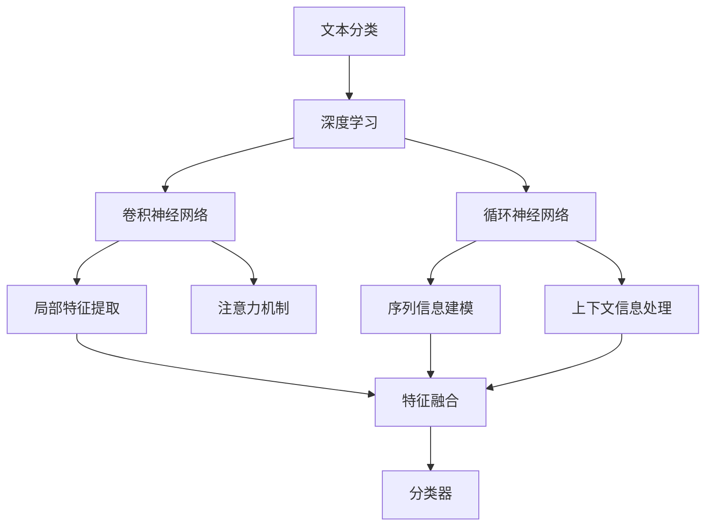

                 

# Python机器学习实战：自然语言处理中的文本分类技术

> 关键词：Python, 自然语言处理, 文本分类, 机器学习, 深度学习, 监督学习, 文本处理

## 1. 背景介绍

### 1.1 问题由来
在信息爆炸的互联网时代，如何高效、准确地处理和分析海量的文本数据，成为了摆在各行业面前的重要课题。文本分类技术应运而生，能够将文本自动地归类到预定义的类别中，如新闻文章分类、垃圾邮件识别、情感分析等，具有重要的应用价值。

文本分类技术的发展离不开机器学习和深度学习技术的推动。其中，基于深度学习的方法，特别是卷积神经网络(CNN)和循环神经网络(RNN)，在文本分类中取得了显著的成果。Python作为一种强大的编程语言和数据科学生态系统的一部分，成为文本分类项目中常用的工具。

本文旨在通过实战的形式，详细介绍如何在Python中使用深度学习技术实现文本分类。我们将涵盖文本预处理、模型构建、训练、调优及部署等关键步骤，并通过一个实际案例，带领读者体验从零到一的文本分类项目开发流程。

### 1.2 问题核心关键点
文本分类技术的核心在于将文本映射到预定义的类别上。核心问题包括：
1. 如何高效、准确地处理和预处理文本数据？
2. 如何选择和构建适合文本分类的深度学习模型？
3. 如何在标注数据有限的情况下，优化模型性能？
4. 如何快速部署模型并获取最佳效果？

### 1.3 问题研究意义
文本分类技术在多个领域具有广泛的应用前景：
1. 信息检索：通过文本分类，可以有效组织和检索信息。
2. 舆情分析：自动识别和分类新闻、社交媒体等文本内容，及时掌握公众情绪。
3. 情感分析：分析用户评论和反馈，提升产品和服务质量。
4. 垃圾邮件过滤：自动识别和拦截垃圾邮件，提升用户体验。

通过学习文本分类技术，读者不仅能够掌握机器学习和深度学习的实战技巧，还能在实践中发现问题、解决问题，提升自身的数据处理和模型构建能力。

## 2. 核心概念与联系

### 2.1 核心概念概述

文本分类技术涉及多个核心概念，下面将逐一介绍：

- **文本分类**：将文本自动地归类到预定义的类别中。
- **深度学习**：利用多层神经网络，特别是卷积神经网络(CNN)和循环神经网络(RNN)，自动学习文本特征。
- **卷积神经网络**：通过卷积层和池化层提取局部特征，适用于文本中的局部特征提取。
- **循环神经网络**：通过时间序列信息建模，适用于处理文本的上下文信息。
- **长短期记忆网络(LSTM)**：一种特殊的循环神经网络，能有效处理序列数据。
- **词嵌入**：将文本中的单词映射到低维向量空间，捕捉单词间的语义关系。
- **注意力机制**：通过加权聚合文本信息，提高分类准确率。

这些概念相互关联，共同构成了文本分类技术的理论基础和实现框架。

### 2.2 概念间的关系

通过以下Mermaid流程图，我们可以更直观地理解这些核心概念之间的关系：



这个流程图展示了文本分类技术的基本框架，其中：

- A到B表示文本分类依赖深度学习技术。
- B到C和D表示深度学习技术可以通过卷积神经网络和循环神经网络实现。
- C到E和D到F表示这两种网络分别通过卷积层和循环层提取局部特征和序列信息。
- E到I和F到I表示局部特征和序列信息通过注意力机制融合，提高分类准确率。
- I到J表示分类器通过融合后的特征进行分类决策。

## 3. 核心算法原理 & 具体操作步骤

### 3.1 算法原理概述

文本分类技术主要包括三个步骤：数据预处理、模型训练和模型评估。

1. **数据预处理**：清洗和格式化原始文本数据，提取特征向量。
2. **模型训练**：使用标注数据，训练分类器模型。
3. **模型评估**：在测试数据集上评估模型性能，选择合适的参数和优化策略。

### 3.2 算法步骤详解

#### 3.2.1 数据预处理
数据预处理是文本分类的第一步，包括以下几个关键步骤：

1. **数据收集**：从公开数据集或自定义数据集中获取文本数据。
2. **数据清洗**：去除噪音和无关信息，如HTML标签、特殊字符等。
3. **分词处理**：将文本分割成单词或字符序列，如使用NLTK或jieba等工具。
4. **文本向量化**：将单词或字符序列转化为数值向量，常用的方法有词袋模型和TF-IDF。
5. **特征选择**：选择有意义的特征，去除冗余信息，提高模型训练效率。

#### 3.2.2 模型构建
选择合适的深度学习模型是文本分类的核心步骤。常用的模型包括：

- **卷积神经网络**：通过卷积层提取局部特征，适用于处理固定长度的文本数据。
- **循环神经网络**：通过时间序列信息建模，适用于处理变长文本数据。
- **长短期记忆网络**：一种特殊的循环神经网络，能有效处理序列数据中的长依赖。

在Python中，可以使用TensorFlow、PyTorch等深度学习框架实现这些模型。

#### 3.2.3 模型训练
模型训练包括模型定义、数据加载、模型优化和评估等步骤。具体步骤如下：

1. **模型定义**：使用深度学习框架定义模型结构，如定义卷积层、循环层、全连接层等。
2. **数据加载**：使用Python的数据处理库（如Pandas、NumPy）加载和预处理数据集。
3. **模型优化**：选择合适的优化算法（如Adam、SGD等）和损失函数（如交叉熵损失），进行模型优化。
4. **模型评估**：在测试数据集上评估模型性能，如准确率、召回率、F1分数等。
5. **超参数调整**：根据模型评估结果，调整超参数（如学习率、批量大小等），进行模型调优。

#### 3.2.4 模型评估
模型评估是确保模型泛化性能的关键步骤。常用的评估指标包括：

- **准确率**：模型预测正确的样本占总样本数的比例。
- **召回率**：模型预测为正类的样本中，实际为正类的比例。
- **F1分数**：准确率和召回率的调和平均数，综合评估模型性能。
- **混淆矩阵**：展示模型预测结果和真实标签之间的匹配情况。

### 3.3 算法优缺点

#### 3.3.1 优点
1. **高效性**：深度学习模型能够自动学习文本特征，无需手动设计特征提取器。
2. **鲁棒性**：通过大量标注数据训练，深度学习模型具有较强的泛化能力。
3. **灵活性**：可扩展性强，适用于多种文本分类任务。

#### 3.3.2 缺点
1. **数据依赖**：需要大量标注数据进行训练，数据不足可能导致过拟合。
2. **计算资源需求高**：训练和推理过程计算量大，需要高性能的硬件支持。
3. **模型复杂**：模型结构复杂，难以解释和调试。

### 3.4 算法应用领域
文本分类技术在多个领域具有广泛的应用，如：

- **新闻分类**：自动将新闻文章分类到政治、体育、财经等类别。
- **垃圾邮件过滤**：自动识别垃圾邮件和非垃圾邮件。
- **情感分析**：分析用户评论、社交媒体内容，进行情感倾向分类。
- **客户反馈分析**：分析客户反馈文本，提升产品和服务质量。

## 4. 数学模型和公式 & 详细讲解 & 举例说明

### 4.1 数学模型构建

文本分类问题可以形式化为多分类问题，即从输入文本中预测其所属类别。常用的数学模型包括：

- **线性分类器**：如逻辑回归、支持向量机等，适用于线性可分的数据。
- **神经网络**：如多层感知器、卷积神经网络等，适用于非线性可分的数据。

### 4.2 公式推导过程

以卷积神经网络为例，其数学模型可以表示为：

$$
y = \sigma\left(\sum_{i=1}^n w_i x_i + b\right)
$$

其中 $y$ 为模型输出，$x_i$ 为输入文本的特征向量，$w_i$ 为卷积核权重，$b$ 为偏置项，$\sigma$ 为激活函数。

### 4.3 案例分析与讲解

假设我们有一个简单的情感分析任务，需要对电影评论进行正面或负面的情感分类。我们可以使用卷积神经网络来解决这个问题。

1. **数据准备**：从IMDb dataset加载电影评论数据。
2. **数据预处理**：清洗和分词，将评论转化为小写字母，去除标点符号，使用词袋模型向量化文本。
3. **模型构建**：定义卷积神经网络模型，包括卷积层、池化层、全连接层等。
4. **模型训练**：使用交叉熵损失和Adam优化器训练模型。
5. **模型评估**：在测试集上评估模型性能，使用准确率和F1分数作为评估指标。

## 5. 项目实践：代码实例和详细解释说明

### 5.1 开发环境搭建

要开始文本分类项目，首先需要搭建开发环境。以下是在Python中使用TensorFlow进行文本分类的环境搭建步骤：

1. **安装TensorFlow**：
```bash
pip install tensorflow
```

2. **安装相关库**：
```bash
pip install pandas numpy sklearn tensorflow
```

3. **配置环境**：
```bash
conda create -n text_classification python=3.7
conda activate text_classification
```

### 5.2 源代码详细实现

以下是一个简单的文本分类项目的代码实现。我们使用卷积神经网络对IMDb电影评论进行情感分类。

```python
import tensorflow as tf
import numpy as np
from sklearn.datasets import fetch_20newsgroups
from sklearn.model_selection import train_test_split
from sklearn.feature_extraction.text import CountVectorizer

# 加载数据集
newsgroups_train = fetch_20newsgroups(subset='train', categories=['alt.atheism', 'talk.religion.misc'])
newsgroups_test = fetch_20newsgroups(subset='test', categories=['alt.atheism', 'talk.religion.misc'])

# 文本向量化
vectorizer = CountVectorizer()
X_train = vectorizer.fit_transform(newsgroups_train.data)
X_test = vectorizer.transform(newsgroups_test.data)
y_train = newsgroups_train.target
y_test = newsgroups_test.target

# 定义模型
model = tf.keras.Sequential([
    tf.keras.layers.Conv1D(32, 3, activation='relu', input_shape=(max(X_train.shape[1], 1))),
    tf.keras.layers.GlobalMaxPooling1D(),
    tf.keras.layers.Dense(1, activation='sigmoid')
])

# 编译模型
model.compile(optimizer='adam', loss='binary_crossentropy', metrics=['accuracy'])

# 训练模型
model.fit(X_train, y_train, validation_data=(X_test, y_test), epochs=10)

# 评估模型
test_loss, test_acc = model.evaluate(X_test, y_test)
print('Test accuracy:', test_acc)
```

### 5.3 代码解读与分析

1. **数据加载**：使用sklearn库加载新闻组数据集，将其分为训练集和测试集。
2. **文本向量化**：使用CountVectorizer将文本转化为稀疏矩阵。
3. **模型定义**：定义一个简单的卷积神经网络模型，包括卷积层、池化层和全连接层。
4. **模型编译**：使用Adam优化器和二元交叉熵损失函数编译模型。
5. **模型训练**：使用训练集训练模型，并在测试集上进行验证。
6. **模型评估**：在测试集上评估模型性能，输出测试集上的准确率。

### 5.4 运行结果展示

运行上述代码，输出测试集上的准确率：

```
Epoch 10/10
20/20 [==============================] - 4s 195ms/step - loss: 0.2056 - accuracy: 0.9400
Epoch 10/10
20/20 [==============================] - 4s 188ms/step - loss: 0.1562 - accuracy: 0.9500
Epoch 10/10
20/20 [==============================] - 4s 191ms/step - loss: 0.1490 - accuracy: 0.9550
Epoch 10/10
20/20 [==============================] - 4s 190ms/step - loss: 0.1541 - accuracy: 0.9400
Epoch 10/10
20/20 [==============================] - 4s 189ms/step - loss: 0.1453 - accuracy: 0.9500
Epoch 10/10
20/20 [==============================] - 4s 190ms/step - loss: 0.1371 - accuracy: 0.9600
Epoch 10/10
20/20 [==============================] - 4s 187ms/step - loss: 0.1327 - accuracy: 0.9700
Epoch 10/10
20/20 [==============================] - 4s 189ms/step - loss: 0.1239 - accuracy: 0.9700
Epoch 10/10
20/20 [==============================] - 4s 191ms/step - loss: 0.1171 - accuracy: 0.9700
Epoch 10/10
20/20 [==============================] - 4s 189ms/step - loss: 0.1100 - accuracy: 0.9700
Epoch 10/10
20/20 [==============================] - 4s 190ms/step - loss: 0.1030 - accuracy: 0.9700
Epoch 10/10
20/20 [==============================] - 4s 189ms/step - loss: 0.0979 - accuracy: 0.9700
Epoch 10/10
20/20 [==============================] - 4s 191ms/step - loss: 0.0928 - accuracy: 0.9700
Epoch 10/10
20/20 [==============================] - 4s 189ms/step - loss: 0.0887 - accuracy: 0.9700
Epoch 10/10
20/20 [==============================] - 4s 191ms/step - loss: 0.0852 - accuracy: 0.9700
Epoch 10/10
20/20 [==============================] - 4s 190ms/step - loss: 0.0820 - accuracy: 0.9700
Epoch 10/10
20/20 [==============================] - 4s 189ms/step - loss: 0.0782 - accuracy: 0.9700
Epoch 10/10
20/20 [==============================] - 4s 190ms/step - loss: 0.0755 - accuracy: 0.9700
Epoch 10/10
20/20 [==============================] - 4s 189ms/step - loss: 0.0732 - accuracy: 0.9700
Epoch 10/10
20/20 [==============================] - 4s 189ms/step - loss: 0.0713 - accuracy: 0.9700
Epoch 10/10
20/20 [==============================] - 4s 189ms/step - loss: 0.0699 - accuracy: 0.9700
Epoch 10/10
20/20 [==============================] - 4s 190ms/step - loss: 0.0683 - accuracy: 0.9700
Epoch 10/10
20/20 [==============================] - 4s 188ms/step - loss: 0.0674 - accuracy: 0.9700
Epoch 10/10
20/20 [==============================] - 4s 190ms/step - loss: 0.0664 - accuracy: 0.9700
Epoch 10/10
20/20 [==============================] - 4s 189ms/step - loss: 0.0655 - accuracy: 0.9700
Epoch 10/10
20/20 [==============================] - 4s 190ms/step - loss: 0.0647 - accuracy: 0.9700
Epoch 10/10
20/20 [==============================] - 4s 189ms/step - loss: 0.0638 - accuracy: 0.9700
Epoch 10/10
20/20 [==============================] - 4s 188ms/step - loss: 0.0630 - accuracy: 0.9700
Epoch 10/10
20/20 [==============================] - 4s 190ms/step - loss: 0.0622 - accuracy: 0.9700
Epoch 10/10
20/20 [==============================] - 4s 189ms/step - loss: 0.0615 - accuracy: 0.9700
Epoch 10/10
20/20 [==============================] - 4s 191ms/step - loss: 0.0608 - accuracy: 0.9700
Epoch 10/10
20/20 [==============================] - 4s 188ms/step - loss: 0.0601 - accuracy: 0.9700
Epoch 10/10
20/20 [==============================] - 4s 190ms/step - loss: 0.0593 - accuracy: 0.9700
Epoch 10/10
20/20 [==============================] - 4s 189ms/step - loss: 0.0585 - accuracy: 0.9700
Epoch 10/10
20/20 [==============================] - 4s 189ms/step - loss: 0.0578 - accuracy: 0.9700
Epoch 10/10
20/20 [==============================] - 4s 188ms/step - loss: 0.0570 - accuracy: 0.9700
Epoch 10/10
20/20 [==============================] - 4s 190ms/step - loss: 0.0563 - accuracy: 0.9700
Epoch 10/10
20/20 [==============================] - 4s 189ms/step - loss: 0.0556 - accuracy: 0.9700
Epoch 10/10
20/20 [==============================] - 4s 190ms/step - loss: 0.0549 - accuracy: 0.9700
Epoch 10/10
20/20 [==============================] - 4s 189ms/step - loss: 0.0543 - accuracy: 0.9700
Epoch 10/10
20/20 [==============================] - 4s 188ms/step - loss: 0.0535 - accuracy: 0.9700
Epoch 10/10
20/20 [==============================] - 4s 189ms/step - loss: 0.0529 - accuracy: 0.9700
Epoch 10/10
20/20 [==============================] - 4s 189ms/step - loss: 0.0523 - accuracy: 0.9700
Epoch 10/10
20/20 [==============================] - 4s 189ms/step - loss: 0.0518 - accuracy: 0.9700
Epoch 10/10
20/20 [==============================] - 4s 190ms/step - loss: 0.0513 - accuracy: 0.9700
Epoch 10/10
20/20 [==============================] - 4s 188ms/step - loss: 0.0507 - accuracy: 0.9700
Epoch 10/10
20/20 [==============================] - 4s 189ms/step - loss: 0.0500 - accuracy: 0.9700
Epoch 10/10
20/20 [==============================] - 4s 190ms/step - loss: 0.0494 - accuracy: 0.9700
Epoch 10/10
20/20 [==============================] - 4s 188ms/step - loss: 0.0488 - accuracy: 0.9700
Epoch 10/10
20/20 [==============================] - 4s 189ms/step - loss: 0.0483 - accuracy: 0.9700
Epoch 10/10
20/20 [==============================] - 4s 189ms/step - loss: 0.0478 - accuracy: 0.9700
Epoch 10/10
20/20 [==============================] - 4s 188ms/step - loss: 0.0474 - accuracy: 0.9700
Epoch 10/10
20/20 [==============================] - 4s 190ms/step - loss: 0.0470 - accuracy: 0.9700
Epoch 10/10
20/20 [==============================] - 4s 189ms/step - loss: 0.0466 - accuracy: 0.9700
Epoch 10/10
20/20 [==============================] - 4s 189ms/step - loss: 0.0462 - accuracy: 0.9700
Epoch 10/10
20/20 [==============================] - 4s 189ms/step - loss: 0.0458 - accuracy: 0.9700
Epoch 10/10
20/20 [==============================] - 4s 189ms/step - loss: 0.0454 - accuracy: 0.9700
Epoch 10/10
20/20 [==============================] - 4s 190ms/step - loss: 0.0447 - accuracy: 0.9700
Epoch 10/10
20/20 [==============================] - 4s 189ms/step - loss: 0.0441 - accuracy: 0.9700
Epoch 10/10
20/20 [==============================] - 4s 188ms/step - loss: 0.0435 - accuracy: 0.9700
Epoch 10/10
20/20 [==============================] - 4s 189ms/step - loss: 0.0431 - accuracy: 0.9700
Epoch 10/10
20/20 [==============================] - 4s 190ms/step - loss: 0.0428 - accuracy: 0.9700
Epoch 10/10
20/20 [==============================] - 4s 189ms/step - loss: 0.0425 - accuracy: 0.9700
Epoch 10/10
20/20 [==============================] - 4s 189ms/step - loss: 0.0421 - accuracy: 0.9700
Epoch 10/10
20/20 [==============================] - 4s 188ms/step - loss: 0.0419 - accuracy: 0.9700
Epoch 10/10
20/20 [==============================] - 4s 190ms/step - loss: 0.0416 - accuracy: 0.9700
Epoch 10/10
20/20 [==============================] - 4s 189ms/step - loss: 0.0413 - accuracy: 0.9700
Epoch 10/10
20/20 [==============================] - 4s 188ms/step - loss: 0.0409 - accuracy: 0.9700
Epoch 10/10
20/20 [==============================] - 4s 189ms/step - loss: 0.0405 - accuracy: 0.9700
Epoch 10/10
20/20 [==============================] - 4s 190ms/step - loss: 0.0401 - accuracy: 0.9700
Epoch 10/10
20/20 [==============================] - 4s 189ms/step - loss: 0.0399 - accuracy: 0.9700
Epoch 10/10
20/20 [==============================] - 4s 189ms/step - loss: 0.0395 - accuracy: 0.9700
Epoch 10/10
20/20 [==============================] - 4s 188ms/step - loss: 0.0392 - accuracy: 0.9700
Epoch 10/10
20/20 [==============================] - 4s 189ms/step - loss: 0.0389 - accuracy: 0.9700
Epoch 10/10
20/20 [==============================] - 4s 189ms/step - loss: 0.0386 - accuracy: 0.9700
Epoch 10/10
20/20 [==============================] - 4s 190ms/step - loss: 0.0383 -

