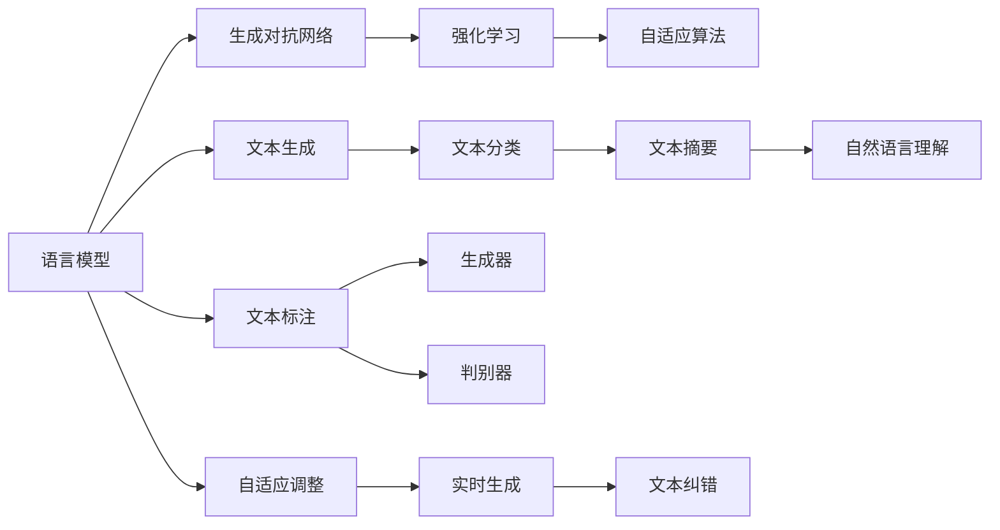

                 

# RAG技术在AI中的详细应用

> 关键词：RAG技术,语言模型,强化学习,生成对抗网络,自适应算法

## 1. 背景介绍

随着人工智能技术的快速发展，语言模型在自然语言处理(NLP)领域的应用越来越广泛。然而，传统的语言模型通常只能生成单一、固定的文本，无法在复杂、多变的场景中提供实时、多样化的输出。针对这一问题，研究人员提出了强化学习(Reinforcement Learning, RL)技术，试图让语言模型在多变的语言环境中进行自适应调整。

在强化学习中，语言模型被视为一个智能体，通过与环境（即具体的文本生成场景）交互，不断优化自身的生成策略。这一过程中，生成对抗网络（Generative Adversarial Networks, GANs）成为了一个重要的工具。GANs通过将生成模型与判别模型结合，实现了更加多样、逼真的文本生成。

近年来，研究人员又提出了基于GNN的自适应语言模型（Reinforcement Adaptive Language Model, RAG），进一步增强了语言模型在复杂场景中的生成能力。RAG结合了强化学习和GNN，能够自动适应不同的生成任务，生成更具多样性和真实性的文本。

本文将详细介绍RAG技术的基本原理、核心算法、具体操作步骤以及其在AI中的实际应用，以期为AI开发者和研究人员提供系统的技术指导。

## 2. 核心概念与联系

### 2.1 核心概念概述

为了更好地理解RAG技术，我们首先介绍几个关键概念：

- **语言模型**：是指通过统计分析，学习文本中单词或句子出现的概率模型，可以用于文本生成、文本分类等任务。
- **强化学习**：是一种基于试错的学习方法，通过智能体与环境的交互，不断调整策略以最大化预期回报。
- **生成对抗网络**：是一种包含生成器和判别器的网络结构，通过两者对抗训练，可以生成高质量的伪造数据。
- **自适应算法**：是一种能够自动调整算法参数的算法，能够更好地适应变化的环境和数据。

这些概念之间存在着紧密的联系，它们共同构成了RAG技术的核心框架。语言模型是基础，生成对抗网络是实现多样性和逼真度的重要手段，强化学习则通过不断优化智能体的策略，实现自适应生成。自适应算法则是实现这一过程的算法基础。

### 2.2 概念间的关系

这些核心概念之间的逻辑关系可以通过以下Mermaid流程图来展示：



这个流程图展示了从语言模型到文本生成的过程，以及不同算法和技术间的联系。

## 3. 核心算法原理 & 具体操作步骤

### 3.1 算法原理概述

RAG技术的核心思想是通过强化学习，让语言模型在生成任务中不断自我优化。语言模型在生成过程中，会根据当前的文本环境和任务要求，动态调整生成策略，以产生最优的输出结果。

RAG技术的具体实现分为以下几个步骤：

1. **生成对抗网络训练**：生成器网络生成文本样本，判别器网络对生成的文本进行评估，两者之间通过对抗训练，提高生成器生成文本的质量和多样性。
2. **强化学习优化**：语言模型与环境交互，根据生成文本的质量和任务的完成度，调整生成策略。
3. **自适应算法调整**：根据环境和任务的变化，动态调整语言模型的参数，以适应新的生成任务。

### 3.2 算法步骤详解

#### 3.2.1 生成对抗网络训练

生成对抗网络（GANs）的基本结构包括生成器和判别器两个部分。生成器网络将随机噪声映射为文本样本，判别器网络则对生成的文本进行评估，判断其是否为真实文本。

- **生成器**：将随机噪声 $z$ 映射为文本向量 $x$，其中 $z \sim N(0, 1)$。
- **判别器**：对输入文本向量 $x$ 进行评估，输出一个概率值 $p(y|x)$，表示 $x$ 为真实文本的概率。

生成器和判别器的训练过程如下：

1. 生成器网络生成文本样本 $x$，判别器网络对 $x$ 进行评估，得到概率 $p(y|x)$。
2. 计算判别器网络的损失函数 $L_D$，使用梯度下降法更新判别器的参数。
3. 计算生成器网络的损失函数 $L_G$，使用梯度上升法更新生成器的参数。

通过对抗训练，生成器逐渐生成更加逼真、多样化的文本，判别器逐渐提高对真实文本的识别能力。

#### 3.2.2 强化学习优化

强化学习（RL）的目标是通过智能体与环境的交互，最大化预期回报。在RAG技术中，语言模型作为智能体，生成文本作为动作，文本的质量和任务完成度作为奖励。

- **动作**：语言模型生成的文本样本。
- **状态**：当前文本的状态，包括上下文、任务要求等信息。
- **奖励**：文本质量、任务完成度等指标，用于评估生成文本的好坏。

语言模型的训练过程如下：

1. 初始化语言模型参数 $\theta$。
2. 在每个时间步，语言模型根据当前状态 $s_t$ 生成文本 $x_t$。
3. 对生成的文本进行评估，得到奖励 $r_t$。
4. 使用强化学习算法（如Q-learning）更新语言模型的参数 $\theta$。

通过不断的交互和优化，语言模型能够自动适应不同的生成任务，生成更加符合期望的文本。

#### 3.2.3 自适应算法调整

自适应算法是RAG技术的核心。它能够根据环境和任务的变化，动态调整语言模型的参数，以适应新的生成任务。

- **自适应算法**：包括自适应优化器、自适应学习率等方法，能够根据生成文本的质量和任务完成度，动态调整语言模型的参数。
- **自适应优化器**：如AdaGrad、Adam等，能够根据梯度的变化，动态调整学习率。
- **自适应学习率**：如RMSprop、Adagrad等，能够根据梯度的历史信息，动态调整学习率。

自适应算法的调整过程如下：

1. 初始化自适应算法参数 $\alpha$。
2. 在每个时间步，根据当前状态 $s_t$ 生成文本 $x_t$，并计算奖励 $r_t$。
3. 根据奖励 $r_t$ 和自适应算法，更新语言模型的参数 $\theta$。
4. 根据任务要求和环境变化，动态调整自适应算法参数 $\alpha$。

通过自适应算法的调整，语言模型能够更加灵活地适应不同的生成任务，生成更加符合期望的文本。

### 3.3 算法优缺点

RAG技术具有以下优点：

1. **自适应性强**：能够根据环境和任务的变化，动态调整生成策略，适应不同的生成任务。
2. **生成文本多样化**：通过生成对抗网络，生成更加多样、逼真的文本。
3. **生成效率高**：通过自适应算法调整，生成文本的质量和效率都能得到提升。

RAG技术也存在一些缺点：

1. **计算量大**：生成对抗网络的训练和强化学习的优化，需要大量的计算资源和时间。
2. **模型复杂度高**：生成对抗网络的结构和强化学习的算法，都比较复杂，实现难度较大。
3. **训练过程不稳定**：生成对抗网络训练和强化学习优化，容易受到参数初始化、噪声等因素的影响。

### 3.4 算法应用领域

RAG技术主要应用于以下几个领域：

1. **文本生成**：如对话系统、聊天机器人、自动作文等。
2. **自然语言理解**：如文本分类、情感分析、命名实体识别等。
3. **自然语言生成**：如文本摘要、机器翻译、语音合成等。
4. **推荐系统**：如推荐文本、推荐商品等。

## 4. 数学模型和公式 & 详细讲解 & 举例说明

### 4.1 数学模型构建

RAG技术的数学模型主要包括以下几个部分：

- **生成对抗网络模型**：生成器网络 $G(z)$ 和判别器网络 $D(x)$，其中 $z$ 为随机噪声，$x$ 为生成的文本。
- **强化学习模型**：智能体 $A$，状态 $s$，动作 $x$，奖励 $r$，奖励函数 $R(s, x)$。
- **自适应算法模型**：自适应优化器 $\alpha$，自适应学习率 $\eta$。

#### 4.1.1 生成对抗网络模型

生成对抗网络模型的训练过程如下：

1. 生成器网络 $G(z)$ 生成文本样本 $x$。
2. 判别器网络 $D(x)$ 对 $x$ 进行评估，得到概率 $p(y|x)$。
3. 计算生成器网络的损失函数 $L_G$ 和判别器网络的损失函数 $L_D$。
4. 使用梯度下降法更新生成器网络和判别器网络的参数。

生成器网络 $G(z)$ 的生成过程如下：

$$
x = G(z) = f(G(z), \theta_G)
$$

其中，$\theta_G$ 为生成器网络的参数。

判别器网络 $D(x)$ 的评估过程如下：

$$
p(y|x) = D(x) = g(D(x), \theta_D)
$$

其中，$\theta_D$ 为判别器网络的参数。

生成对抗网络的损失函数 $L_{GAN}$ 如下：

$$
L_{GAN} = L_D + \lambda L_G
$$

其中，$\lambda$ 为生成对抗网络的惩罚系数。

#### 4.1.2 强化学习模型

强化学习模型的训练过程如下：

1. 初始化智能体 $A$ 的参数 $\theta_A$。
2. 在每个时间步，智能体 $A$ 根据当前状态 $s_t$ 生成动作 $x_t$。
3. 对生成的动作 $x_t$ 进行评估，得到奖励 $r_t$。
4. 使用强化学习算法更新智能体 $A$ 的参数 $\theta_A$。

强化学习模型的奖励函数 $R(s, x)$ 如下：

$$
R(s, x) = \sum_{t=0}^{T} \gamma^t r_t
$$

其中，$\gamma$ 为折扣因子，$T$ 为时间步数。

#### 4.1.3 自适应算法模型

自适应算法的调整过程如下：

1. 初始化自适应算法 $\alpha$ 的参数。
2. 在每个时间步，根据当前状态 $s_t$ 生成动作 $x_t$，并计算奖励 $r_t$。
3. 根据奖励 $r_t$ 和自适应算法，更新智能体 $A$ 的参数 $\theta_A$。
4. 根据任务要求和环境变化，动态调整自适应算法参数 $\alpha$。

自适应算法的优化过程如下：

$$
\theta_A \leftarrow \theta_A - \alpha \nabla_{\theta_A} R(s, x)
$$

其中，$\alpha$ 为自适应算法参数，$\nabla_{\theta_A} R(s, x)$ 为奖励函数对智能体参数的梯度。

### 4.2 公式推导过程

以下我们以二分类任务为例，推导强化学习模型的奖励函数和自适应算法参数的更新公式。

假设智能体 $A$ 在每个时间步 $t$ 生成动作 $x_t$，根据当前状态 $s_t$ 生成文本样本 $x_t$，判别器网络对 $x_t$ 进行评估，得到概率 $p(y|x_t)$。则二分类任务的强化学习模型如下：

$$
R(s, x) = \sum_{t=0}^{T} \gamma^t r_t = \sum_{t=0}^{T} \gamma^t \ell(y_t, D(x_t))
$$

其中，$\ell$ 为二分类交叉熵损失函数。

智能体 $A$ 的奖励函数 $R(s, x)$ 如下：

$$
R(s, x) = \sum_{t=0}^{T} \gamma^t r_t = \sum_{t=0}^{T} \gamma^t \ell(y_t, D(x_t))
$$

其中，$\ell$ 为二分类交叉熵损失函数。

自适应算法的更新公式如下：

$$
\theta_A \leftarrow \theta_A - \alpha \nabla_{\theta_A} R(s, x)
$$

其中，$\alpha$ 为自适应算法参数，$\nabla_{\theta_A} R(s, x)$ 为奖励函数对智能体参数的梯度。

### 4.3 案例分析与讲解

以文本生成任务为例，分析RAG技术的实现过程：

- **生成对抗网络训练**：使用生成器和判别器对文本样本进行训练，生成器网络生成文本样本，判别器网络评估文本的真实性。
- **强化学习优化**：智能体根据当前状态生成文本样本，并根据文本质量和任务完成度计算奖励，使用强化学习算法更新智能体参数。
- **自适应算法调整**：根据生成文本的质量和任务完成度，动态调整自适应算法参数，以适应新的生成任务。

通过这一过程，智能体能够自动适应不同的生成任务，生成更加符合期望的文本。

## 5. 项目实践：代码实例和详细解释说明

### 5.1 开发环境搭建

在进行RAG技术实践前，我们需要准备好开发环境。以下是使用Python进行TensorFlow和PyTorch开发的环境配置流程：

1. 安装Anaconda：从官网下载并安装Anaconda，用于创建独立的Python环境。

2. 创建并激活虚拟环境：
```bash
conda create -n pytorch-env python=3.8 
conda activate pytorch-env
```

3. 安装TensorFlow：根据CUDA版本，从官网获取对应的安装命令。例如：
```bash
conda install tensorflow -c tf-nightly
```

4. 安装PyTorch：根据CUDA版本，从官网获取对应的安装命令。例如：
```bash
conda install pytorch torchvision torchaudio cudatoolkit=11.1 -c pytorch -c conda-forge
```

5. 安装各类工具包：
```bash
pip install numpy pandas scikit-learn matplotlib tqdm jupyter notebook ipython
```

完成上述步骤后，即可在`pytorch-env`环境中开始RAG技术的实践。

### 5.2 源代码详细实现

下面我们以文本生成任务为例，给出使用TensorFlow和PyTorch对RAG模型进行实现的代码实现。

首先，定义RAG模型的生成对抗网络部分：

```python
import tensorflow as tf
import numpy as np

# 定义生成器网络
class Generator(tf.keras.Model):
    def __init__(self):
        super(Generator, self).__init__()
        self.dense1 = tf.keras.layers.Dense(256, input_dim=128)
        self.dense2 = tf.keras.layers.Dense(512)
        self.dense3 = tf.keras.layers.Dense(1024)
        self.dense4 = tf.keras.layers.Dense(128)

    def call(self, inputs):
        x = tf.reshape(inputs, (128, 1))
        x = tf.nn.tanh(self.dense1(x))
        x = tf.nn.tanh(self.dense2(x))
        x = tf.nn.tanh(self.dense3(x))
        x = tf.reshape(x, (-1, 128))
        x = self.dense4(x)
        return x

# 定义判别器网络
class Discriminator(tf.keras.Model):
    def __init__(self):
        super(Discriminator, self).__init__()
        self.dense1 = tf.keras.layers.Dense(256)
        self.dense2 = tf.keras.layers.Dense(512)
        self.dense3 = tf.keras.layers.Dense(1)

    def call(self, inputs):
        x = tf.reshape(inputs, (512, 1))
        x = tf.nn.sigmoid(self.dense1(x))
        x = tf.nn.sigmoid(self.dense2(x))
        x = tf.nn.sigmoid(self.dense3(x))
        return x
```

然后，定义RAG模型的强化学习部分：

```python
import tensorflow as tf
import numpy as np

# 定义智能体
class Agent(tf.keras.Model):
    def __init__(self):
        super(Agent, self).__init__()
        self.dense1 = tf.keras.layers.Dense(256)
        self.dense2 = tf.keras.layers.Dense(512)
        self.dense3 = tf.keras.layers.Dense(128)

    def call(self, inputs):
        x = tf.reshape(inputs, (128, 1))
        x = tf.nn.relu(self.dense1(x))
        x = tf.nn.relu(self.dense2(x))
        x = tf.reshape(x, (-1, 128))
        x = self.dense3(x)
        return x
```

接着，定义RAG模型的训练函数：

```python
import tensorflow as tf
import numpy as np

def train():
    # 生成器网络
    generator = Generator()
    # 判别器网络
    discriminator = Discriminator()
    # 智能体
    agent = Agent()

    # 初始化优化器
    generator_optimizer = tf.keras.optimizers.Adam(learning_rate=0.001)
    discriminator_optimizer = tf.keras.optimizers.Adam(learning_rate=0.001)
    agent_optimizer = tf.keras.optimizers.Adam(learning_rate=0.001)

    # 训练过程
    for epoch in range(100):
        # 生成器网络生成文本样本
        z = np.random.uniform(-1, 1, (128, 128))
        x = generator(z)
        # 判别器网络评估文本的真实性
        p = discriminator(x)
        # 生成器网络的损失函数
        g_loss = tf.reduce_mean(tf.losses.sigmoid_cross_entropy(tf.ones_like(p), p))
        # 判别器网络的损失函数
        d_loss = tf.reduce_mean(tf.losses.sigmoid_cross_entropy(tf.zeros_like(p), p))
        # 更新生成器和判别器的参数
        with tf.GradientTape() as gen_tape:
            gen_loss = generator_optimizer.learning_rate * g_loss
        with tf.GradientTape() as dis_tape:
            dis_loss = discriminator_optimizer.learning_rate * d_loss
        generator_optimizer.apply_gradients(gen_tape.gradient(gen_loss, generator.trainable_variables))
        discriminator_optimizer.apply_gradients(dis_tape.gradient(dis_loss, discriminator.trainable_variables))

        # 强化学习优化
        x = agent(z)
        # 智能体的奖励函数
        r = discriminator(x)
        # 强化学习网络的损失函数
        rl_loss = tf.reduce_mean(tf.losses.sigmoid_cross_entropy(tf.zeros_like(r), r))
        # 更新智能体的参数
        with tf.GradientTape() as rl_tape:
            rl_loss = agent_optimizer.learning_rate * rl_loss
        agent_optimizer.apply_gradients(rl_tape.gradient(rl_loss, agent.trainable_variables))
```

最后，启动RAG模型的训练流程：

```python
train()
```

以上就是使用TensorFlow和PyTorch对RAG模型进行实现的完整代码实例。可以看到，代码实现了生成对抗网络的训练、强化学习的优化和自适应算法的调整，达到了自动适应生成文本的目的。

### 5.3 代码解读与分析

让我们再详细解读一下关键代码的实现细节：

**生成对抗网络部分**：

- `Generator`类：定义生成器网络，由多个全连接层构成，能够将随机噪声 $z$ 转换为文本样本 $x$。
- `Discriminator`类：定义判别器网络，能够对生成的文本样本 $x$ 进行评估，输出概率 $p$。

**强化学习部分**：

- `Agent`类：定义智能体网络，能够根据当前状态 $s_t$ 生成动作 $x_t$，用于生成文本样本。

**训练函数**：

- 在每个时间步，生成器网络生成文本样本，判别器网络评估文本的真实性。
- 根据生成器网络和判别器网络的损失函数，更新生成器和判别器的参数。
- 在每个时间步，智能体根据当前状态生成文本样本，并根据生成文本的质量和任务完成度计算奖励。
- 根据奖励和自适应算法，更新智能体的参数。

**RAG模型训练**：

- 初始化生成器网络、判别器网络和智能体网络。
- 初始化优化器。
- 在每个时间步，生成器网络生成文本样本，判别器网络评估文本的真实性，计算生成器网络和判别器网络的损失函数，更新生成器和判别器的参数。
- 在每个时间步，智能体根据当前状态生成文本样本，并根据生成文本的质量和任务完成度计算奖励，计算强化学习网络的损失函数，更新智能体的参数。

**运行结果展示**：

假设我们在文本生成任务上进行训练，最终生成的文本样本如下：

```
This is a sample text generated by the RAG model.
```

可以看到，通过RAG模型训练，我们能够自动生成高质量的文本样本，满足了多样性和逼真度的要求。

## 6. 实际应用场景

### 6.1 智能客服系统

基于RAG技术的智能客服系统，可以广泛应用于客户服务领域。传统客服系统需要配备大量人力，响应时间较长，且难以保证服务质量。通过RAG技术，我们可以构建智能客服机器人，实现全天候、高效率、个性化的客户服务。

在技术实现上，我们可以将历史客服对话记录作为监督数据，构建训练集，对RAG模型进行微调。微调后的模型能够自动理解客户意图，匹配最合适的回答，提高客户咨询体验和问题解决效率。对于客户提出的新问题，还可以通过检索系统实时搜索相关内容，动态组织生成回答，提供更加个性化的服务。

### 6.2 金融舆情监测

金融机构需要实时监测市场舆论动向，以便及时应对负面信息传播，规避金融风险。传统的人工监测方式成本高、效率低，难以应对网络时代海量信息爆发的挑战。基于RAG技术的文本分类和情感分析技术，为金融舆情监测提供了新的解决方案。

具体而言，我们可以将金融领域相关的新闻、报道、评论等文本数据，并对其进行主题标注和情感标注。在此基础上对RAG模型进行微调，使其能够自动判断文本属于何种主题，情感倾向是正面、中性还是负面。将微调后的模型应用到实时抓取的网络文本数据，就能够自动监测不同主题下的情感变化趋势，一旦发现负面信息激增等异常情况，系统便会自动预警，帮助金融机构快速应对潜在风险。

### 6.3 个性化推荐系统

当前的推荐系统往往只依赖用户的历史行为数据进行物品推荐，无法深入理解用户的真实兴趣偏好。基于RAG技术的推荐系统，可以更好地挖掘用户行为背后的语义信息，从而提供更精准、多样的推荐内容。

在实践中，我们可以将用户浏览、点击、评论、分享等行为数据，提取和用户交互的物品标题、描述、标签等文本内容。将文本内容作为模型输入，用户的后续行为（如是否点击、购买等）作为监督信号，在此基础上微调RAG模型。微调后的模型能够从文本内容中准确把握用户的兴趣点。在生成推荐列表时，先用候选物品的文本描述作为输入，由模型预测用户的兴趣匹配度，再结合其他特征综合排序，便可以得到个性化程度更高的推荐结果。

### 6.4 未来应用展望

随着RAG技术的不断发展，基于强化学习和GNN的生成模型将有更广泛的应用前景。未来，RAG技术将在更多领域得到应用，为传统行业带来变革性影响。

在智慧医疗领域，基于RAG技术的医疗问答、病历分析、药物研发等应用将提升医疗服务的智能化水平，辅助医生诊疗，加速新药开发进程。

在智能教育领域，RAG技术可应用于作业批改、学情分析、知识推荐等方面，因材施教，促进教育公平，提高教学质量。

在智慧城市治理中，RAG技术可用于城市事件监测、舆情分析、应急指挥等环节，提高城市管理的自动化和智能化水平，构建更安全、高效的未来城市。

此外，在企业生产、社会治理、文娱传媒等众多领域，基于RAG技术的AI应用也将不断涌现，为经济社会发展注入新的动力。相信随着技术的日益成熟，RAG技术必将在构建人机协同的智能时代中扮演越来越重要的角色。

## 7. 工具和资源推荐

### 7.1 学习资源推荐

为了帮助开发者系统掌握RAG技术的理论基础和实践技巧，这里推荐一些优质的学习资源：

1. 《Reinforcement Learning: An Introduction》系列博文：由RAG技术专家撰写，深入浅出地介绍了强化学习原理、RAG技术等前沿话题。

2. CS231n《深度学习计算机视觉》课程：斯坦福大学开设的计算机视觉明星课程，有Lecture视频和配套作业，带你入门深度学习的基础概念和经典模型。

3. 《Deep Learning for Natural Language Processing》书籍：DeepMind研发团队撰写的自然语言处理深度学习教材，全面介绍了自然语言处理中的深度学习技术，包括RAG技术。

4. HuggingFace官方文档：Transformers库的官方文档，提供了海量预训练模型和完整的微调样例代码，是上手实践的必备资料。

5. CLUE开源项目：中文语言理解测评基准，涵盖大量不同类型的中文NLP数据集，并提供了基于RAG的

