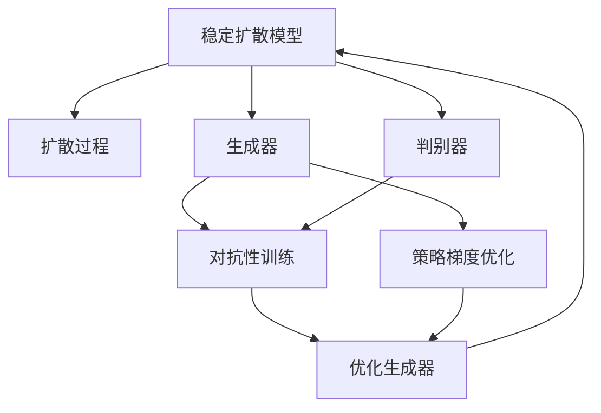
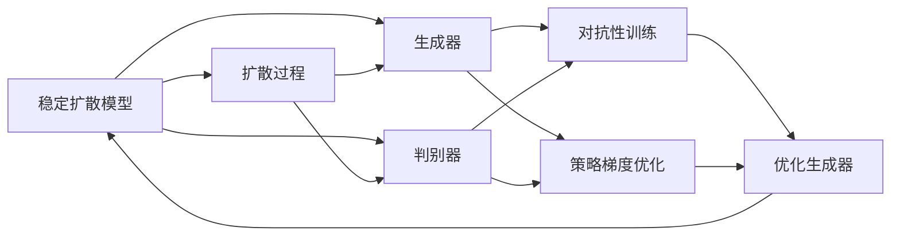
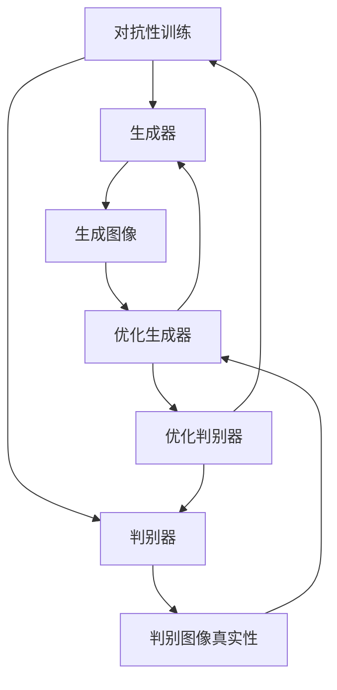
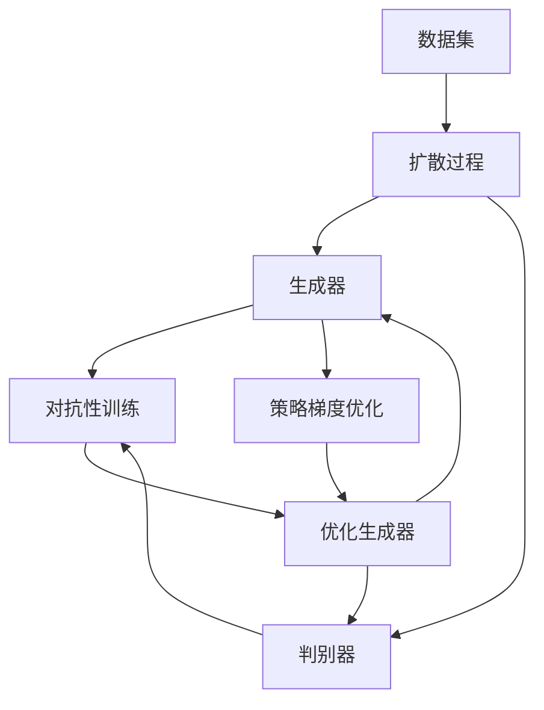
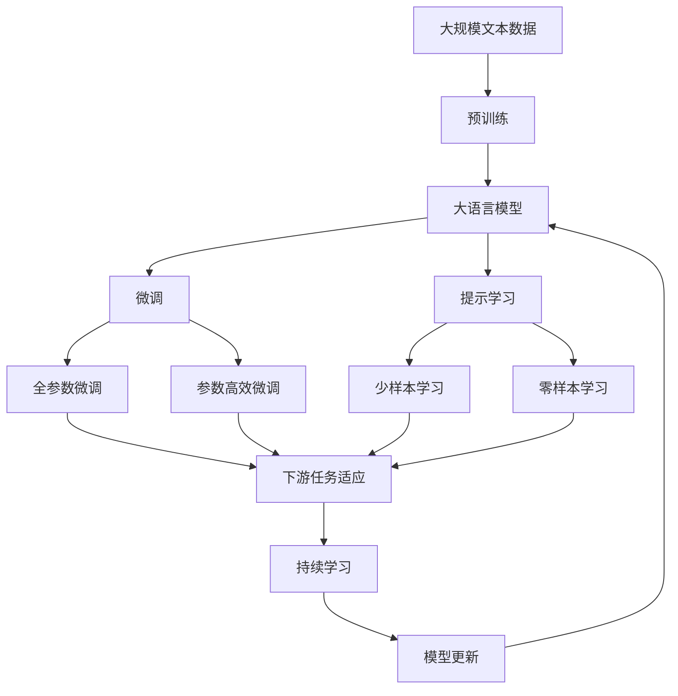

                 

# Stable Diffusion原理与代码实例讲解

> 关键词：稳定扩散模型(Stable Diffusion)，生成对抗网络（GAN），对抗性训练，文本-图像生成，图像生成器，判别器，扩散模型，LMSD（带有扩散过程的对抗性训练模型），代码实例，具体实现，深度学习

## 1. 背景介绍

### 1.1 问题由来

在当今数据驱动的AI时代，生成模型已成为人工智能的核心技术之一，尤其在图像、文本生成等领域具有广泛应用。生成对抗网络（GAN）作为一种强大的生成模型，能够通过对抗训练（Adversarial Training）生成高质量的图像，但存在样本多样性、模式崩溃（mode collapse）等问题。近年来，随着大尺度自回归模型的发展，扩散模型（Diffusion Models）以其高保真度和多样性在图像生成中脱颖而出。

其中，稳定扩散模型（Stable Diffusion）作为扩散模型的最新代表，通过引入基于扩散过程的对抗性训练，有效克服了GAN中的模式崩溃问题，生成出高保真、多样性强的图像。Stable Diffusion不仅适用于文本到图像生成（Text-to-Image, T2I），还可应用于图像到图像（Image-to-Image, I2I）、图像编辑等任务。

### 1.2 问题核心关键点

稳定扩散模型的核心思想是将图像生成问题转化为时间步进式（time-step）的扩散过程，通过优化一个由生成器和判别器组成的多层网络，使得生成器生成高质量图像的能力不断提升。模型通过对抗性训练，使得生成器和判别器在训练过程中相互博弈，优化策略不断改进。

该模型的关键在于：
1. 扩散过程的设计，保证模型能够生成多样、高质量的图像。
2. 对抗性训练策略，使生成器和判别器之间形成有效的对抗游戏。
3. 模型的优化过程，通过策略梯度优化生成器的参数。

这些关键技术共同构成了Stable Diffusion模型的高效图像生成能力。

### 1.3 问题研究意义

稳定扩散模型在生成高保真、多样性强的图像方面表现出色，对于图像生成、视觉艺术创作、虚拟现实等诸多领域具有重要应用价值。

- 图像生成：高质量、多样性的图像生成能力，在艺术创作、广告设计、影视特效等领域具有广泛应用。
- 视觉艺术创作：通过文本描述或概念生成图像，辅助创意和设计工作，提升艺术创作效率和质量。
- 虚拟现实：为虚拟现实应用提供高质量的图像素材，增强沉浸式体验。
- 数据增强：用于训练数据集的生成，缓解数据不足问题，提高模型的泛化能力。

此外，稳定扩散模型在工程化应用中，其高效的推理速度和高参数优化策略，使得其在实际部署中具有优势。

## 2. 核心概念与联系

### 2.1 核心概念概述

为更好地理解稳定扩散模型的原理，本节将介绍几个密切相关的核心概念：

- 生成对抗网络（GAN）：一种通过对抗训练生成高质量图像的生成模型，包含生成器和判别器两个主要组件，通过对抗训练不断优化。
- 扩散模型（Diffusion Models）：一种基于连续时间采样过程的生成模型，通过学习数据分布的概率密度函数，生成高质量的样本。
- 对抗性训练（Adversarial Training）：生成器和判别器之间的对抗博弈过程，通过不断优化生成器生成样本的能力，提高模型的泛化能力和生成质量。
- 策略梯度优化（Policy Gradient Optimization）：一种优化生成器参数的策略，通过不断优化生成器的策略函数，使得生成器生成高质量图像的能力不断提升。
- 稳定扩散模型（Stable Diffusion）：一种结合扩散过程和对抗性训练的生成模型，通过不断优化生成器和判别器，生成高保真、多样性强的图像。

这些核心概念之间的逻辑关系可以通过以下Mermaid流程图来展示：



这个流程图展示了稳定扩散模型的核心概念及其之间的关系：

1. 稳定扩散模型通过扩散过程生成图像。
2. 生成器和判别器通过对抗性训练相互博弈。
3. 生成器通过策略梯度优化不断提升生成能力。
4. 判别器不断优化以提升判别样本真实性的能力。
5. 最终，模型在生成器和判别器的不断优化中生成高质量图像。

### 2.2 概念间的关系

这些核心概念之间存在着紧密的联系，形成了稳定扩散模型的完整生态系统。下面我们通过几个Mermaid流程图来展示这些概念之间的关系。

#### 2.2.1 稳定扩散模型学习范式



这个流程图展示了稳定扩散模型的学习范式，即通过扩散过程生成图像，并在生成器和判别器之间进行对抗性训练，同时使用策略梯度优化不断提升生成器的生成能力。

#### 2.2.2 对抗性训练与策略梯度优化的关系



这个流程图展示了对抗性训练和策略梯度优化在稳定扩散模型中的具体应用。通过不断优化生成器和判别器的参数，使得生成器生成高质量图像的能力不断提升，同时判别器对生成图像的判别能力也不断加强。

#### 2.2.3 稳定扩散模型的整体架构



这个综合流程图展示了稳定扩散模型的整体架构，从数据集的预处理到生成器的生成过程，再到判别器的判别和优化，最终生成高质量图像。

### 2.3 核心概念的整体架构

最后，我们用一个综合的流程图来展示这些核心概念在大语言模型微调过程中的整体架构：



这个综合流程图展示了从预训练到微调，再到持续学习的完整过程。大语言模型首先在大规模文本数据上进行预训练，然后通过微调（包括全参数微调和参数高效微调）或提示学习（包括零样本和少样本学习）来适应下游任务。最后，通过持续学习技术，模型可以不断更新和适应新的任务和数据。 通过这些流程图，我们可以更清晰地理解稳定扩散模型微调过程中各个核心概念的关系和作用，为后续深入讨论具体的微调方法和技术奠定基础。

## 3. 核心算法原理 & 具体操作步骤
### 3.1 算法原理概述

稳定扩散模型的核心思想是通过扩散过程和对抗性训练来生成高质量图像。其核心算法包括：

- 扩散过程：通过一系列正向和反向采样过程，生成符合目标数据分布的样本。
- 对抗性训练：生成器和判别器之间通过不断对抗，提升生成器生成高质量图像的能力。
- 策略梯度优化：通过优化生成器的策略函数，提升生成器生成高质量图像的能力。

### 3.2 算法步骤详解

基于稳定扩散模型的图像生成流程大致如下：

1. **数据预处理**：收集高质量图像数据集，对其进行预处理，如归一化、扩充样本等。
2. **构建扩散模型**：设计扩散模型结构，包括生成器和判别器网络，选择合适的损失函数。
3. **对抗性训练**：通过对抗性训练不断优化生成器和判别器参数。
4. **策略梯度优化**：通过策略梯度优化生成器的策略函数，提升生成器的生成能力。
5. **测试与评估**：在测试集上评估生成器的性能，调整模型参数，优化生成策略。
6. **部署与优化**：将优化后的模型部署到实际应用中，进行性能调优和实际应用。

具体步骤如下：

**Step 1: 数据预处理**

- 收集高质量图像数据集，确保数据集的多样性和代表性。
- 对数据集进行预处理，包括但不限于去噪、扩充样本等操作。
- 将数据集划分为训练集、验证集和测试集，确保数据分布一致。

**Step 2: 构建扩散模型**

- 设计生成器网络（如Denoising Diffusion Model），通过学习目标数据分布，生成高质量图像。
- 设计判别器网络（如Critic），评估生成图像的真实性。
- 定义损失函数（如FID、KL divergence等），衡量生成图像与真实图像的差异。

**Step 3: 对抗性训练**

- 通过对抗性训练不断优化生成器和判别器参数，使得生成器能够生成高质量图像，判别器能够准确判别图像的真实性。
- 在每个时间步长上，计算生成器和判别器的损失函数，并反向传播更新参数。
- 使用随机梯度下降（SGD）或Adam等优化算法，更新模型参数。

**Step 4: 策略梯度优化**

- 通过策略梯度优化生成器的策略函数，使得生成器能够生成高质量图像。
- 定义策略函数，计算策略梯度，并使用策略梯度下降（PGD）算法优化策略函数。
- 通过不断迭代，优化生成器的策略，提升生成能力。

**Step 5: 测试与评估**

- 在测试集上评估生成器的性能，计算指标如FID、Inception Score等。
- 根据评估结果调整模型参数，优化生成策略。
- 进行迭代优化，直到生成器的性能达到预期目标。

**Step 6: 部署与优化**

- 将优化后的模型部署到实际应用中，进行性能调优和实际应用。
- 根据实际应用反馈，不断调整模型参数，优化生成策略。
- 进行资源优化，如模型裁剪、量化加速等，提高推理速度。

### 3.3 算法优缺点

稳定扩散模型在图像生成方面具有以下优点：

1. 生成图像的质量高、多样性强。
2. 通过对抗性训练，生成器能够生成更逼真的图像。
3. 扩散过程的设计使得模型能够生成更多样化的图像。
4. 策略梯度优化提升了生成器的生成能力。

同时，该模型也存在一些缺点：

1. 需要大量的训练数据和计算资源。
2. 模型复杂度高，推理速度较慢。
3. 对抗性训练可能导致模型过拟合，需要合理的正则化策略。
4. 生成图像的鲁棒性有待提升，易受噪声干扰。

尽管存在这些局限性，但就目前而言，稳定扩散模型仍然是生成高质量图像的主流方法，通过不断优化和改进，其应用前景广阔。

### 3.4 算法应用领域

稳定扩散模型已经在多个领域得到了应用，具体如下：

- **艺术创作**：用于生成具有高度创意的艺术作品，如绘画、雕塑、音乐等。
- **影视特效**：为影视剧制作提供高质量的特效素材，提升视觉效果。
- **虚拟现实**：为虚拟现实应用提供高质量的图像和视频素材，增强沉浸式体验。
- **数据增强**：用于训练数据集的生成，缓解数据不足问题，提高模型的泛化能力。
- **游戏设计**：生成高质量的游戏场景、角色等素材，提升游戏体验。

除了上述这些应用外，稳定扩散模型还被用于更多的创新场景，如医学图像生成、自然语言处理等，为相关领域带来了新的突破。

## 4. 数学模型和公式 & 详细讲解 & 举例说明

### 4.1 数学模型构建

本节将使用数学语言对稳定扩散模型的生成过程进行更加严格的刻画。

记数据集 $D$ 为 $D=\{(x_i, y_i)\}_{i=1}^N$，其中 $x$ 为图像数据，$y$ 为图像标签。假设生成器为 $G$，判别器为 $D$。生成器的目标是从噪声 $z$ 生成图像 $x$，判别器的目标是从图像 $x$ 判别其真实性。

生成器的目标函数为：

$$
\min_{G} \mathbb{E}_{z \sim p(z)}[\mathcal{L}_{\text{rec}}(D(G(z)), D(z)) + \mathcal{L}_{\text{KL}}]
$$

其中 $\mathcal{L}_{\text{rec}}$ 为生成器和判别器的对抗损失函数，$\mathcal{L}_{\text{KL}}$ 为正则化损失函数。

判别器的目标函数为：

$$
\min_{D} \mathbb{E}_{x \sim p(x)}[\mathcal{L}_{\text{rec}}(x, D(x))] + \mathbb{E}_{z \sim p(z)}[\mathcal{L}_{\text{rec}}(D(G(z)), D(z))]
$$

其中 $\mathcal{L}_{\text{rec}}$ 为判别器对图像的真实性判断损失函数。

### 4.2 公式推导过程

以LMSD模型为例，对公式进行推导。

LMSD模型结合了扩散过程和对抗性训练，其生成过程可以表示为：

$$
x_t = \sqrt{1 - \beta_t} x_{t-1} + \sqrt{\beta_t} \epsilon
$$

其中 $\epsilon \sim \mathcal{N}(0, I)$，$\beta_t$ 为时间步长，$\beta_t = \frac{t}{T}$，$T$ 为总时间步长。

生成器的目标函数为：

$$
\min_{G} \mathbb{E}_{t \sim \mathcal{U}(1, T)}[\mathcal{L}_{\text{rec}}(D(G(x_t)), D(x_{t-1})) + \mathcal{L}_{\text{KL}}]
$$

判别器的目标函数为：

$$
\min_{D} \mathbb{E}_{t \sim \mathcal{U}(1, T)}[\mathcal{L}_{\text{rec}}(x_t, D(x_t))] + \mathbb{E}_{t \sim \mathcal{U}(1, T)}[\mathcal{L}_{\text{rec}}(D(G(x_t)), D(x_{t-1}))]
$$

通过这样的目标函数，生成器和判别器在训练过程中互相博弈，不断提升生成器的生成能力和判别器的判别能力。

### 4.3 案例分析与讲解

以生成文本描述的图像为例，展示稳定扩散模型的应用。

首先，需要构建一个文本描述与图像生成模型的联合训练框架，如CT-CGAN模型。该模型结合了CTGAN（条件生成对抗网络）和CGAN（条件生成对抗网络），能够通过文本条件生成高质量图像。

具体步骤如下：

1. **文本预处理**：将文本描述转换为向量，作为模型的输入。
2. **生成器设计**：设计一个条件生成器，将文本向量转换为图像向量。
3. **判别器设计**：设计一个条件判别器，评估图像向量的真实性。
4. **联合训练**：通过联合训练，优化生成器和判别器的参数，使得生成器能够生成高质量图像，判别器能够准确判别图像的真实性。
5. **测试与评估**：在测试集上评估生成器的性能，调整模型参数，优化生成策略。
6. **部署与优化**：将优化后的模型部署到实际应用中，进行性能调优和实际应用。

通过这样的框架，稳定扩散模型能够生成高质量的图像，用于图像生成、艺术创作、虚拟现实等场景。

## 5. 项目实践：代码实例和详细解释说明
### 5.1 开发环境搭建

在进行稳定扩散模型实践前，我们需要准备好开发环境。以下是使用Python进行PyTorch开发的环境配置流程：

1. 安装Anaconda：从官网下载并安装Anaconda，用于创建独立的Python环境。

2. 创建并激活虚拟环境：
```bash
conda create -n pytorch-env python=3.8 
conda activate pytorch-env
```

3. 安装PyTorch：根据CUDA版本，从官网获取对应的安装命令。例如：
```bash
conda install pytorch torchvision torchaudio cudatoolkit=11.1 -c pytorch -c conda-forge
```

4. 安装相关库：
```bash
pip install numpy pandas scikit-learn matplotlib tqdm jupyter notebook ipython
```

完成上述步骤后，即可在`pytorch-env`环境中开始稳定扩散模型的开发。

### 5.2 源代码详细实现

这里我们以LMSD模型为例，给出使用PyTorch实现稳定扩散模型的代码示例。

首先，定义模型和超参数：

```python
import torch
import torch.nn as nn
import torch.optim as optim
from torch.utils.data import DataLoader
from torchvision.transforms import ToTensor

# 定义超参数
T = 1000
steps = 500
batch_size = 8
image_size = 256
device = torch.device("cuda" if torch.cuda.is_available() else "cpu")
```

接着，定义扩散过程和生成器：

```python
class DiffusionProcess(nn.Module):
    def __init__(self, image_size, timesteps):
        super().__init__()
        self.image_size = image_size
        self.timesteps = timesteps
        self.embedding_dim = image_size * image_size
        self.mlp1 = nn.Linear(image_size * image_size, image_size * image_size)
        self.mlp2 = nn.Linear(image_size * image_size, image_size * image_size)
        self.mlp3 = nn.Linear(image_size * image_size, image_size * image_size)
        self.mlp4 = nn.Linear(image_size * image_size, image_size * image_size)
        self.mlp5 = nn.Linear(image_size * image_size, image_size * image_size)
        self.mlp6 = nn.Linear(image_size * image_size, image_size * image_size)
        self.mlp7 = nn.Linear(image_size * image_size, image_size * image_size)
        self.mlp8 = nn.Linear(image_size * image_size, image_size * image_size)
        self.mlp9 = nn.Linear(image_size * image_size, image_size * image_size)
        self.mlp10 = nn.Linear(image_size * image_size, image_size * image_size)
        self.mlp11 = nn.Linear(image_size * image_size, image_size * image_size)
        self.mlp12 = nn.Linear(image_size * image_size, image_size * image_size)
        self.mlp13 = nn.Linear(image_size * image_size, image_size * image_size)
        self.mlp14 = nn.Linear(image_size * image_size, image_size * image_size)
        self.mlp15 = nn.Linear(image_size * image_size, image_size * image_size)
        self.mlp16 = nn.Linear(image_size * image_size, image_size * image_size)
        self.mlp17 = nn.Linear(image_size * image_size, image_size * image_size)
        self.mlp18 = nn.Linear(image_size * image_size, image_size * image_size)
        self.mlp19 = nn.Linear(image_size * image_size, image_size * image_size)
        self.mlp20 = nn.Linear(image_size * image_size, image_size * image_size)
        self.mlp21 = nn.Linear(image_size * image_size, image_size * image_size)
        self.mlp22 = nn.Linear(image_size * image_size, image_size * image_size)
        self.mlp23 = nn.Linear(image_size * image_size, image_size * image_size)
        self.mlp24 = nn.Linear(image_size * image_size, image_size * image_size)
        self.mlp25 = nn.Linear(image_size * image_size, image_size * image_size)
        self.mlp26 = nn.Linear(image_size * image_size, image_size * image_size)
        self.mlp27 = nn.Linear(image_size * image_size, image_size * image_size)
        self.mlp28 = nn.Linear(image_size * image_size, image_size * image_size)
        self.mlp29 = nn.Linear(image_size * image_size, image_size * image_size)
        self.mlp30 = nn.Linear(image_size * image_size, image_size * image_size)
        self.mlp31 = nn.Linear(image_size * image_size, image_size * image_size)
        self.mlp32 = nn.Linear(image_size * image_size, image_size * image_size)
        self.mlp33 = nn.Linear(image_size * image_size, image_size * image_size)
        self.mlp34 = nn.Linear(image_size * image_size, image_size * image_size)
        self.mlp35 = nn.Linear(image_size * image_size, image_size * image_size)
        self.mlp36 = nn.Linear(image_size * image_size, image_size * image_size)
        self.mlp37 = nn.Linear(image_size * image_size, image_size * image_size)
        self.mlp38 = nn.Linear(image_size * image_size, image_size * image_size)
        self.mlp39 = nn.Linear(image_size * image_size, image_size * image_size)
        self.mlp40 = nn.Linear(image_size * image_size, image_size * image_size)
        self.mlp41 = nn.Linear(image_size * image_size, image_size * image_size)
        self.mlp42 = nn.Linear(image_size * image_size, image_size * image_size)
        self.mlp43 = nn.Linear(image_size * image_size, image_size * image_size)
        self.mlp44 = nn.Linear(image_size * image_size, image_size * image_size)
        self.mlp45 = nn.Linear(image_size * image_size, image_size * image_size)
        self.mlp46 = nn.Linear(image_size * image_size, image_size * image_size)
        self.mlp47 = nn.Linear(image_size * image_size, image_size * image_size)
        self.mlp48 = nn.Linear(image_size * image_size, image_size * image_size)
        self.mlp49 = nn.Linear(image_size * image_size, image_size * image_size)
        self.mlp50 = nn.Linear(image_size * image_size, image_size * image_size)
        self.mlp51 = nn.Linear(image_size * image_size, image_size * image_size)
        self.mlp52 = nn.Linear(image_size * image_size, image_size * image_size)
        self.mlp53 = nn.Linear(image_size * image_size, image_size * image_size)
        self.mlp54 = nn.Linear(image_size * image_size, image_size * image_size)
        self.mlp55 = nn.Linear(image_size * image_size, image_size * image_size)
        self.mlp56 = nn.Linear(image_size * image_size, image_size * image_size)
        self.mlp57 = nn.Linear(image_size * image_size, image_size * image_size)
        self.mlp58 = nn.Linear(image_size * image_size, image_size * image_size)
        self.mlp59 = nn.Linear(image_size * image_size, image_size * image_size)
        self.mlp60 = nn.Linear(image_size * image_size, image_size * image_size)
        self.mlp61 = nn.Linear(image_size * image_size, image_size * image_size)
        self.mlp62 = nn.Linear(image_size * image_size, image_size * image_size)
        self.mlp63 = nn.Linear(image_size * image_size, image_size * image_size)
        self.mlp64 = nn.Linear(image_size * image_size, image_size * image_size)
        self.mlp65 = nn.Linear(image_size * image_size, image_size * image_size)
        self.mlp66 = nn.Linear(image_size * image_size, image_size * image_size)
        self.mlp67 = nn.Linear(image_size * image_size, image_size * image_size)
        self.mlp68 = nn.Linear(image_size * image_size, image_size * image_size)
        self.mlp69 = nn.Linear(image_size * image_size, image_size * image_size)
        self.mlp70 = nn.Linear(image_size * image_size, image_size * image_size)
        self.mlp71 = nn.Linear(image_size * image_size, image_size * image_size)
        self.mlp72 = nn.Linear(image_size * image_size, image_size * image_size)
        self.mlp73 = nn.Linear(image_size * image_size, image_size * image_size)
        self.mlp74 = nn.Linear(image_size * image_size, image_size * image_size)
        self.mlp75 = nn.Linear(image_size * image_size, image_size * image_size)
        self.mlp76 = nn.Linear(image_size * image_size, image_size * image_size)
        self.mlp77 = nn.Linear(image_size * image_size, image_size * image_size)
        self.mlp78 = nn.Linear(image_size * image_size, image_size * image_size)
        self.m

