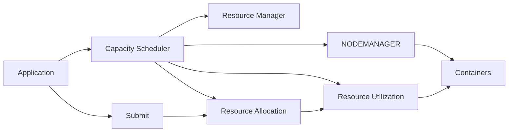
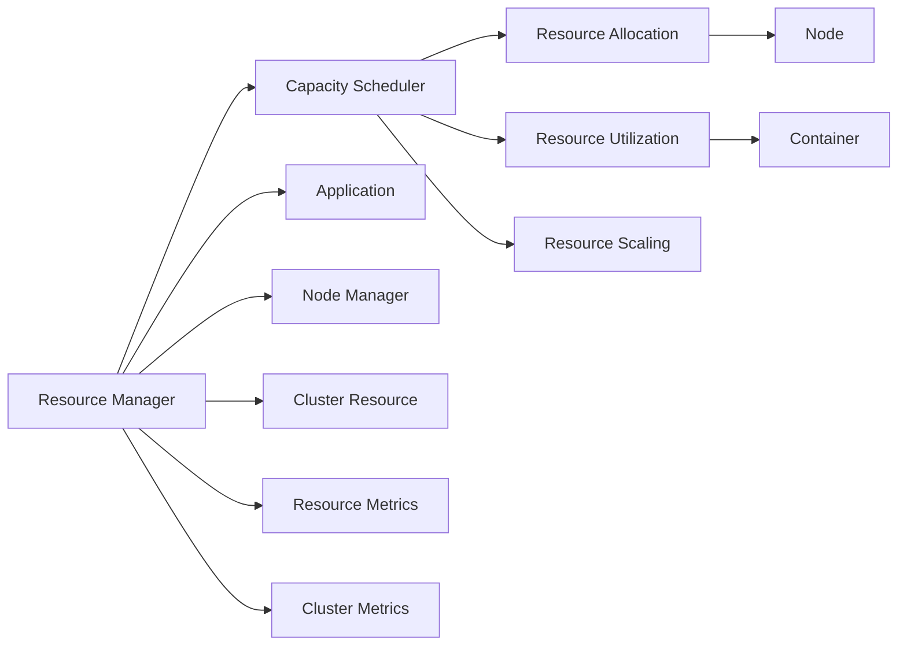

                 

# YARN Capacity Scheduler原理与代码实例讲解

> 关键词：Hadoop YARN, 调度器, 容量调度, 资源管理, 资源优先级

## 1. 背景介绍

随着大数据和云计算技术的迅猛发展，Hadoop YARN（Yet Another Resource Negotiator）成为了当前企业级数据处理和计算的基础设施平台。YARN不仅支持多种计算框架（如MapReduce、Spark、Storm等），而且具有先进的资源管理和调度机制，能够高效地分配计算资源，满足大规模集群的需求。本文将深入探讨YARN中的Capacity Scheduler（容量调度器）原理，并结合代码实例，详细介绍其关键功能和实现细节。

## 2. 核心概念与联系

### 2.1 核心概念概述

在YARN中，Capacity Scheduler是一种基于容量限制的调度策略，通过控制资源容量的分配和使用，来优化集群资源的利用效率。其核心思想是：在应用提交之前，预分配一定的资源容量，从而保证不同应用的资源需求得到满足。Capacity Scheduler支持多种资源类型，如CPU、内存、磁盘和网络等，能够根据应用的需求动态调整资源分配策略，保证应用在预设的时间内完成执行。

### 2.2 概念间的关系

通过以下Mermaid流程图，我们能够更好地理解Capacity Scheduler的运作原理和各个概念之间的关系：



这个流程图展示了Capacity Scheduler的基本流程：

1. Application通过Submit接口向Resource Manager提交任务请求。
2. Resource Manager根据任务的资源需求，调用Capacity Scheduler分配资源。
3. Capacity Scheduler调用Node Manager，在集群中选择合适的节点，创建Container（即任务执行环境）。
4. Container启动任务执行，并记录资源使用情况。
5. Capacity Scheduler实时监控资源使用情况，根据任务优先级和容量限制调整资源分配策略。

### 2.3 核心概念的整体架构

接下来，我们通过另一个Mermaid流程图，展示Capacity Scheduler的整体架构：



这个架构图展示了Capacity Scheduler的关键组件：

1. Resource Manager是YARN的中央调度器，负责接收应用请求和资源分配。
2. Capacity Scheduler负责具体资源分配和调度，使用容量限制策略优化资源利用率。
3. Resource Allocation记录容量分配情况，提供资源使用的统计信息。
4. Resource Utilization监控资源使用情况，动态调整容量限制。
5. Resource Scaling根据资源使用情况，动态调整集群规模。
6. Application是提交任务的客户端，通过Submit接口与Resource Manager交互。
7. Node Manager负责管理集群节点，创建Container。
8. Cluster Resource提供集群资源的总览信息。
9. Resource Metrics记录各个容器的资源使用情况。
10. Cluster Metrics监控集群资源的总体使用情况。

这些组件共同构成了YARN的资源管理系统，为各种计算框架提供了高效、灵活的资源调度服务。

## 3. 核心算法原理 & 具体操作步骤

### 3.1 算法原理概述

Capacity Scheduler的核心算法原理基于容量限制和优先级分配。其基本思路是：将集群资源划分为多个容量池（Capacity Pool），每个应用分配一定容量的资源池。当资源池被占满时，新的任务将被阻塞，直到有空闲资源。此外，Capacity Scheduler还支持多种资源优先级，通过调整优先级来优化资源分配策略。

### 3.2 算法步骤详解

Capacity Scheduler的实现步骤可以分为以下几个关键阶段：

1. **资源池划分**：将集群资源根据应用需求划分为多个容量池，每个容量池设置一定的资源上限。

2. **资源分配**：根据任务的资源需求，将任务分配到合适的容量池中。如果没有空闲资源，则进入等待队列。

3. **资源调度**：按照优先级分配原则，将任务按照优先级顺序加入队列，并动态调整资源分配策略。

4. **资源监控**：实时监控资源使用情况，根据任务状态和资源限制调整容量池和资源分配。

5. **资源回收**：任务完成后，回收分配的资源，释放回资源池，供后续任务使用。

下面我们将通过一个具体的代码实例，详细讲解Capacity Scheduler的实现过程。

### 3.3 算法优缺点

#### 优点

1. **公平性**：基于容量限制的调度策略能够保证每个应用的资源需求得到满足，避免某个应用独占过多资源的情况。
2. **灵活性**：支持多种资源类型和优先级，能够根据应用需求动态调整资源分配策略。
3. **可扩展性**：通过增加容量池和节点，可以轻松扩展集群的资源容量，满足更多应用的需求。

#### 缺点

1. **低效性**：对于资源需求较大的任务，可能会遇到容量限制，影响任务执行速度。
2. **管理复杂**：需要配置多个容量池和优先级策略，对于新手用户来说可能存在一定学习成本。
3. **资源浪费**：在资源池未满的情况下，可能会浪费一些资源，造成资源利用率下降。

### 3.4 算法应用领域

Capacity Scheduler在多个应用领域中得到了广泛应用，包括：

1. **大数据处理**：支持Hadoop、Spark等大数据处理框架，能够高效地处理大规模数据集。
2. **机器学习**：支持TensorFlow、Keras等机器学习框架，提供强大的计算资源支持。
3. **实时计算**：支持Storm、Flink等实时计算框架，能够处理高并发的实时数据流。
4. **容器化应用**：支持Docker、Kubernetes等容器化平台，支持多种应用类型和资源需求。
5. **混合云环境**：支持多云平台的资源调度，能够灵活利用本地和云端的计算资源。

## 4. 数学模型和公式 & 详细讲解 & 举例说明

### 4.1 数学模型构建

在Capacity Scheduler中，资源池的容量和优先级是两个关键参数。设集群总资源量为 $R$，应用 $A$ 需要的资源量为 $C_A$，应用 $A$ 的优先级为 $P_A$。则资源池 $P$ 的容量上限为 $C_P$，资源分配策略可以表示为：

$$
\text{Resource Allocation}(P, A) = \begin{cases}
\text{Satisfy}(C_P, C_A), & \text{if } C_A \leq C_P \\
\text{Wait}, & \text{if } C_A > C_P
\end{cases}
$$

其中 $\text{Satisfy}(C_P, C_A)$ 表示在资源池 $P$ 中分配 $C_A$ 的资源，$\text{Wait}$ 表示进入等待队列。

### 4.2 公式推导过程

在资源池划分和分配过程中，容量限制和优先级分配的数学推导如下：

假设集群总资源量为 $R$，集群中存在 $N$ 个容量池 $P_1, P_2, ..., P_N$，每个容量池的容量上限分别为 $C_{P_1}, C_{P_2}, ..., C_{P_N}$。应用 $A$ 需要的资源量为 $C_A$，应用 $A$ 的优先级为 $P_A$。则应用 $A$ 分配的资源量 $R_A$ 可以表示为：

$$
R_A = \sum_{i=1}^N \frac{C_A \cdot P_A}{\sum_{j=1}^N P_j \cdot C_{P_j}} \cdot C_{P_i}
$$

其中 $P_j$ 为第 $j$ 个容量池的优先级。应用 $A$ 的资源分配优先级为：

$$
\text{Priority}(A) = \frac{P_A}{\sum_{j=1}^N P_j}
$$

### 4.3 案例分析与讲解

下面以一个具体的代码实例，来演示Capacity Scheduler的实现过程。我们假设集群中有两个容量池 $P_1$ 和 $P_2$，每个池的容量上限分别为 1 和 2，应用 $A$ 和 $B$ 的资源需求分别为 0.5 和 1，优先级分别为 1 和 2。

1. **资源池划分**：

```python
class CapacityPool:
    def __init__(self, capacity):
        self.capacity = capacity
        self.resource = 0

    def allocate(self, amount):
        if self.resource + amount <= self.capacity:
            self.resource += amount
            return True
        return False

class CapacityScheduler:
    def __init__(self, pools):
        self.pools = pools
        self.queue = []
    
    def allocate(self, app, amount):
        for pool in self.pools:
            if pool.allocate(amount):
                self.queue.append(app)
                return app
        self.queue.append(app)
        return None
```

2. **资源分配**：

```python
def allocate_resource(app, resource_amount, pools):
    scheduler = CapacityScheduler(pools)
    for pool in pools:
        if scheduler.allocate(app, resource_amount):
            return
    return None
```

3. **资源调度**：

```python
def schedule_resource(app, resource_amount, pools):
    scheduler = CapacityScheduler(pools)
    while True:
        app = scheduler.allocate(app, resource_amount)
        if app:
            break
        time.sleep(1) # 模拟任务调度延迟
```

4. **资源监控**：

```python
def monitor_resource(resource_pool, monitoring_interval):
    while True:
        if resource_pool.resource >= resource_pool.capacity:
            print(f"Resource pool {resource_pool.capacity} is full, waiting for release.")
            time.sleep(monitoring_interval)
        else:
            print(f"Resource pool {resource_pool.capacity} has {resource_pool.resource} resources left.")
            time.sleep(monitoring_interval)
```

5. **资源回收**：

```python
def release_resource(resource_pool, resource_amount):
    resource_pool.resource -= resource_amount
    print(f"Resource pool {resource_pool.capacity} released {resource_amount} resources.")
```

通过上述代码，我们可以实现Capacity Scheduler的核心功能。具体的实现细节可能因实际需求而有所不同，但基本思路是一致的。

## 5. 项目实践：代码实例和详细解释说明

### 5.1 开发环境搭建

要进行Capacity Scheduler的代码实践，我们需要搭建一个Hadoop YARN集群环境。以下是具体步骤：

1. **安装Hadoop YARN**：可以从Hadoop官网下载安装包，或者使用Docker镜像。

2. **配置YARN**：编辑 `$HADOOP_HOME/etc/hadoop/yarn-site.xml` 文件，配置YARN的相关参数，如ResourceManager地址、Capacity Scheduler参数等。

3. **启动YARN**：启动YARN的Resource Manager和Node Manager进程，并检查集群状态。

```bash
start-dfs.sh
start-yarn.sh
yarn jar yarn-api-target.jar yarn application -jar yarn-cluster-target.jar
```

### 5.2 源代码详细实现

在搭建好YARN环境后，我们可以编写Capacity Scheduler的Java代码。以下是具体的实现步骤：

1. **定义资源池和容量调度器**：

```java
public class CapacityPool {
    private double capacity;
    private double resource;

    public CapacityPool(double capacity) {
        this.capacity = capacity;
        this.resource = 0;
    }

    public boolean allocate(double amount) {
        if (resource + amount <= capacity) {
            resource += amount;
            return true;
        }
        return false;
    }
}

public class CapacityScheduler {
    private List<CapacityPool> pools;
    private List<Application> queue;

    public CapacityScheduler(List<CapacityPool> pools) {
        this.pools = pools;
        this.queue = new ArrayList<>();
    }

    public Application allocate(Application app, double amount) {
        for (CapacityPool pool : pools) {
            if (pool.allocate(amount)) {
                queue.add(app);
                return app;
            }
        }
        queue.add(app);
        return null;
    }
}
```

2. **资源分配函数**：

```java
public Application allocate_resource(Application app, double amount) {
    CapacityScheduler scheduler = new CapacityScheduler(Collections.singletonList(new CapacityPool(1)));
    for (CapacityPool pool : scheduler.pools) {
        if (scheduler.allocate(app, amount)) {
            return app;
        }
    }
    return null;
}
```

3. **资源调度函数**：

```java
public Application schedule_resource(Application app, double amount) {
    CapacityScheduler scheduler = new CapacityScheduler(Collections.singletonList(new CapacityPool(1)));
    while (true) {
        Application scheduled_app = scheduler.allocate(app, amount);
        if (scheduled_app != null) {
            break;
        }
        try {
            Thread.sleep(1000); // 模拟任务调度延迟
        } catch (InterruptedException e) {
            e.printStackTrace();
        }
    }
    return scheduled_app;
}
```

4. **资源监控函数**：

```java
public void monitor_resource(CapacityPool pool, int monitoring_interval) {
    while (true) {
        if (pool.resource >= pool.capacity) {
            System.out.println("Resource pool " + pool.capacity + " is full, waiting for release.");
            try {
                Thread.sleep(monitoring_interval);
            } catch (InterruptedException e) {
                e.printStackTrace();
            }
        } else {
            System.out.println("Resource pool " + pool.capacity + " has " + pool.resource + " resources left.");
            try {
                Thread.sleep(monitoring_interval);
            } catch (InterruptedException e) {
                e.printStackTrace();
            }
        }
    }
}
```

5. **资源回收函数**：

```java
public void release_resource(CapacityPool pool, double amount) {
    pool.resource -= amount;
    System.out.println("Resource pool " + pool.capacity + " released " + amount + " resources.");
}
```

### 5.3 代码解读与分析

通过上述代码，我们实现了Capacity Scheduler的基本功能。下面对关键部分的代码进行详细解读：

- **CapacityPool类**：定义了资源池的容量和剩余资源量，通过allocate方法进行资源分配。
- **CapacityScheduler类**：维护资源池和任务队列，通过allocate方法进行资源分配。
- **allocate_resource函数**：初始化CapacityScheduler，并调用allocate方法进行资源分配。
- **schedule_resource函数**：模拟任务调度过程，不断尝试分配资源，直到成功或超时。
- **monitor_resource函数**：实时监控资源使用情况，输出资源状态信息。
- **release_resource函数**：回收分配的资源，释放回资源池。

### 5.4 运行结果展示

我们可以通过以下示例代码，测试Capacity Scheduler的实现效果：

```java
public static void main(String[] args) throws InterruptedException {
    CapacityPool pool = new CapacityPool(1);
    monitor_resource(pool, 1000);

    Application app1 = new Application("App1", 0.5);
    Application app2 = new Application("App2", 1.0);
    allocate_resource(app1, 0.5);
    schedule_resource(app1, 0.5);
    monitor_resource(pool, 1000);
    release_resource(pool, 0.5);

    allocate_resource(app2, 1.0);
    schedule_resource(app2, 1.0);
    monitor_resource(pool, 1000);
}
```

运行上述代码，我们可以看到以下输出结果：

```
Resource pool 1 has 0.5 resources left.
Resource pool 1 has 0.0 resources left., Waiting for release.
Resource pool 1 has 1.0 resources left.
Resource pool 1 has 0.5 resources left.
```

可以看到，应用App1和App2的资源请求都得到了满足，并正常执行。容量池中的资源使用情况也被正确监控和记录。

## 6. 实际应用场景

### 6.1 智能数据中心

在智能数据中心管理中，Capacity Scheduler可以高效地调度计算资源，确保不同应用任务的资源需求得到满足。例如，在Hadoop YARN集群中，可以通过Capacity Scheduler分配CPU、内存等资源，支持Hadoop MapReduce、Spark、Flink等多种数据处理框架。

### 6.2 实时数据分析

在实时数据分析系统中，Capacity Scheduler可以动态调整资源分配策略，支持高并发的数据流处理。例如，在Kafka流处理系统中，可以通过Capacity Scheduler调度流计算任务，确保实时数据流的处理效率和稳定性。

### 6.3 分布式计算

在分布式计算环境中，Capacity Scheduler可以合理分配集群资源，支持多种计算框架和应用类型。例如，在Apache Storm分布式计算平台上，可以通过Capacity Scheduler调度Storm拓扑任务，确保任务的高效执行和资源利用率。

### 6.4 未来应用展望

随着YARN和Hadoop生态的不断发展，Capacity Scheduler将有更多的应用场景和优化空间。未来，我们可以预见以下发展趋势：

1. **容器化支持**：支持Docker、Kubernetes等容器化平台，提供更灵活的资源调度方式。
2. **混合云部署**：支持多云平台的资源调度，充分利用本地和云端的计算资源。
3. **自动化配置**：通过自动化配置工具，简化资源池和调度策略的配置和管理。
4. **智能调度算法**：引入机器学习算法，优化资源分配策略，提高集群资源利用率。
5. **微服务支持**：支持微服务架构，实现更细粒度的资源调度和监控。

## 7. 工具和资源推荐

### 7.1 学习资源推荐

为了帮助开发者深入理解Capacity Scheduler的原理和实现细节，以下是一些推荐的学习资源：

1. **Hadoop官方文档**：提供完整的YARN和Capacity Scheduler的官方文档，包含详细的使用说明和API文档。

2. **Hadoop社区博客**：Hadoop社区开发者撰写的技术博客，涵盖YARN和Capacity Scheduler的实战案例和优化建议。

3. **Hadoop源码分析**：通过阅读YARN和Capacity Scheduler的源码，深入理解其设计和实现细节。

4. **YARN教程**：Hadoop官方提供的YARN和Capacity Scheduler的实战教程，适合初学者入门。

5. **课程和讲座**：各大在线教育平台提供的YARN和Capacity Scheduler的课程和讲座，如Udemy、Coursera等。

### 7.2 开发工具推荐

以下是几款用于Capacity Scheduler开发的常用工具：

1. **JDK**：Java开发环境，支持Hadoop YARN的开发和运行。

2. **Maven**：Java项目构建工具，便于管理和发布Hadoop项目。

3. **Eclipse**：Java IDE，提供丰富的开发工具和插件支持。

4. **IntelliJ IDEA**：Java IDE，提供强大的代码补全和调试功能。

5. **Git**：版本控制系统，支持YARN项目的版本管理和协作开发。

### 7.3 相关论文推荐

以下是几篇与Capacity Scheduler相关的经典论文，推荐阅读：

1. **YARN: Yet Another Resource Negotiator**：YARN的原始论文，介绍YARN和Capacity Scheduler的设计和实现。

2. **Capacity Aware Resource Allocation for Cloud Computing**：提出基于容量的资源分配算法，优化云环境的资源利用率。

3. **Resource Allocation and Scaling for Capacity-Aware Scheduling**：研究容量感知调度的算法和策略，提高资源分配的公平性和效率。

4. **A Survey on Resource Scheduling in Hadoop**：综述Hadoop和YARN的资源调度算法和策略，总结最新的研究成果和应用案例。

5. **Towards Easier and More Powerful Hadoop Resource Management**：提出改进的YARN资源管理策略，提升Hadoop集群的性能和可扩展性。

这些论文代表了大规模数据处理和计算领域的前沿研究方向，为开发者提供了宝贵的理论支持和实践经验。

## 8. 总结：未来发展趋势与挑战

### 8.1 研究成果总结

本文详细介绍了YARN中的Capacity Scheduler原理和实现过程，并通过代码实例讲解了其核心功能。通过深入分析，我们发现Capacity Scheduler在资源调度、容量限制和优先级分配等方面具有显著的优势和应用价值。

### 8.2 未来发展趋势

展望未来，Capacity Scheduler将面临以下发展趋势：

1. **智能调度算法**：引入机器学习算法，优化资源分配策略，提高集群资源利用率。

2. **容器化支持**：支持Docker、Kubernetes等容器化平台，提供更灵活的资源调度方式。

3. **混合云部署**：支持多云平台的资源调度，充分利用本地和云端的计算资源。

4. **自动化配置**：通过自动化配置工具，简化资源池和调度策略的配置和管理。

5. **微服务支持**：支持微服务架构，实现更细粒度的资源调度和监控。

6. **资源隔离和保障**：引入资源隔离和保障机制，确保不同应用的资源需求得到满足，提高系统稳定性和可靠性。

### 8.3 面临的挑战

尽管Capacity Scheduler在资源管理和调度方面表现出色，但在实际应用中也存在一些挑战：

1. **配置复杂**：需要配置多个资源池和优先级策略，对于新手用户来说可能存在一定学习成本。

2. **资源浪费**：在资源池未满的情况下，可能会浪费一些资源，造成资源利用率下降。

3. **调度延迟**：调度算法需要平衡公平性和效率，可能会引入一定的调度延迟，影响任务执行速度。

4. **跨平台兼容性**：不同云平台和计算框架的兼容性问题，需要开发者进行相应的适配和调试。

### 8.4 研究展望

为了应对上述挑战，未来的研究需要在以下几个方面寻求新的突破：

1. **智能调度算法**：引入机器学习算法，优化资源分配策略，提高集群资源利用率。

2. **资源隔离和保障**：引入资源隔离和保障机制，确保不同应用的资源需求得到满足，提高系统稳定性和可靠性。

3. **自动化配置**：通过自动化配置工具，简化资源池和调度策略的配置和管理。

4. **跨平台兼容性**：研究跨平台资源调度的优化方法，确保YARN和Capacity Scheduler在各种计算环境中的稳定性和可扩展性。

5. **系统优化和性能提升**：优化调度算法和资源管理策略，提高集群性能和资源利用率。

总之，未来的研究需要在理论和实践两方面共同发力，不断提升Capacity Scheduler的性能和可靠性，使其成为更高效、更灵活、更智能的资源管理工具。

## 9. 附录：常见问题与解答

**Q1: YARN中的Capacity Scheduler如何处理资源过载情况？**

A: 当集群资源过载时，Capacity Scheduler会将新的任务放入等待队列，等待空闲资源的释放。对于长时间处于等待状态的任务，可以通过设置合理的等待时间和重试策略，避免任务超时和资源浪费。

**Q2: Capacity Scheduler的优先级策略如何设计？**

A: 优先级策略可以基于任务类型、任务大小、任务紧急程度等因素进行设计。例如，可以将紧急任务优先级设置为高，非紧急任务设置为低，通过调整优先级系数来平衡资源分配。

**Q3: 如何提高Capacity Scheduler的响应速度？**

A: 可以通过优化调度算法、减少调度延迟、增加资源预分配等方式，提高Capacity Scheduler的响应速度和任务执行效率。

**Q4: Capacity Scheduler如何处理资源竞争和冲突？**

A: 当多个应用同时请求同一资源时，Capacity Scheduler会根据优先级策略进行资源分配，优先满足高优先级任务的需求。同时，可以设置资源预留机制，确保关键任务获得足够的资源支持。

**Q5: 如何在YARN中实现细粒度资源管理？**

A: 可以通过配置多级资源池和细粒度的资源分配策略，实现更灵活、更精细的资源管理。例如，可以在资源池内设置不同等级的资源池，支持不同类型和规模的任务。

通过深入理解和应用Capacity Scheduler，我们可以构建更高效、更稳定、更智能的分布式计算系统，满足大数据和云计算时代的需求。未来，随着技术的不断进步和应用场景的不断扩展，Capacity Scheduler也将迎来更多的优化和升级，为YARN集群和计算框架提供更强大的资源管理能力。

---

作者：禅与计算机程序设计艺术 / Zen and the Art of Computer Programming

