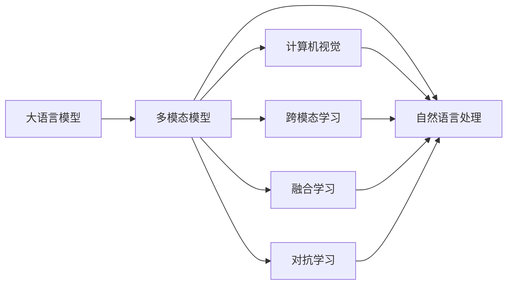
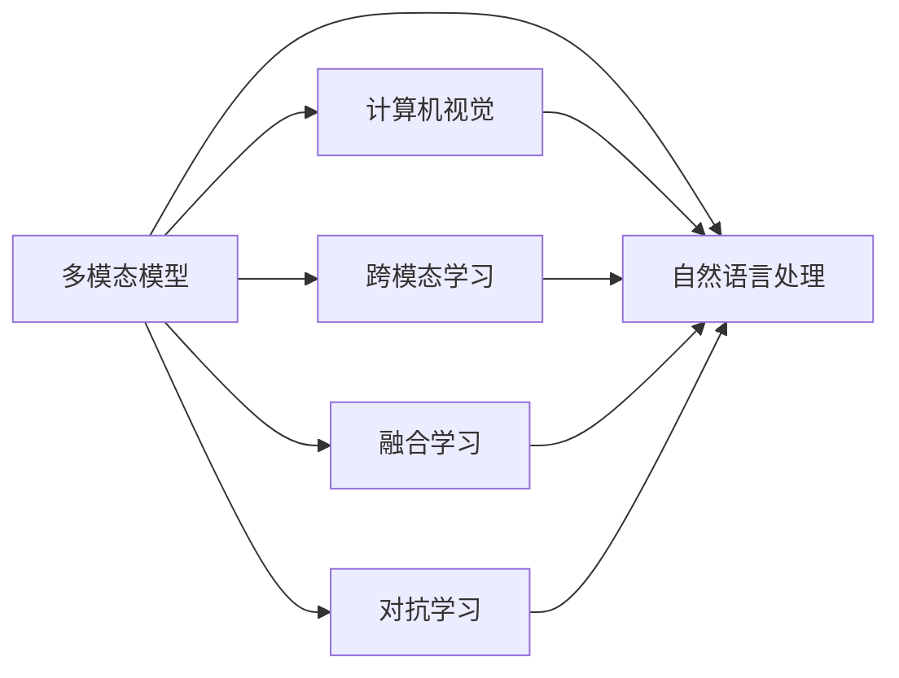
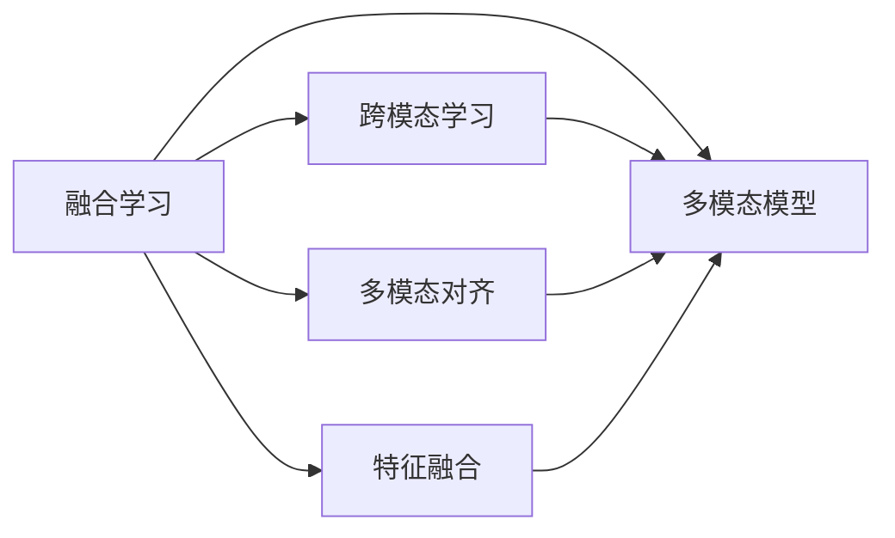
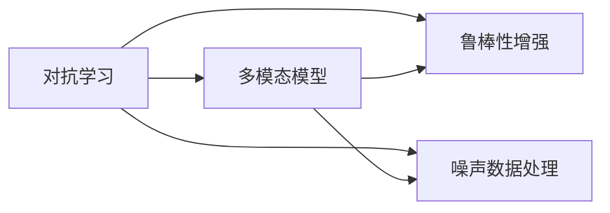
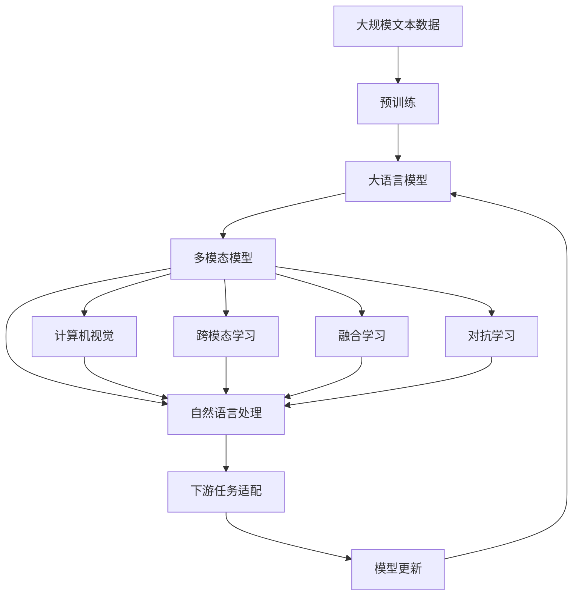

                 

# 大语言模型应用指南：多模态大语言模型

> 关键词：
1. 大语言模型
2. 多模态模型
3. 深度学习
4. 计算机视觉
5. 自然语言处理
6. 跨模态学习
7. 融合学习

## 1. 背景介绍

### 1.1 问题由来

随着深度学习技术的不断发展，大语言模型（Large Language Models, LLMs）已经成为自然语言处理（Natural Language Processing, NLP）领域的重要工具。这些模型通过在大规模文本数据上预训练，可以学习到丰富的语言知识，并广泛应用于问答、翻译、摘要、文本分类等任务。然而，仅依赖文本数据训练的大语言模型在实际应用中仍存在一定局限性，难以充分理解图像、音频等多模态信息，无法处理一些需要多维度信息融合的任务。

为了克服这些局限性，多模态大语言模型应运而生。这些模型结合了深度学习中的计算机视觉和自然语言处理技术，可以在处理文本、图像、音频等多模态数据时取得更好的效果。多模态大语言模型能够更好地理解现实世界的复杂性，并在更广泛的场景中发挥作用。

### 1.2 问题核心关键点

多模态大语言模型融合了文本、图像、音频等多模态数据，通过多模态学习技术，能够更好地理解和生成自然语言。其核心关键点包括：

1. **数据源多样性**：模型需要从文本、图像、音频等多模态数据中提取特征，这些数据源具有不同的特征空间和分布。
2. **特征融合机制**：如何将不同模态的特征进行有效融合，得到统一的高层次表示，是关键技术挑战。
3. **多模态学习算法**：如何设计高效的多模态学习算法，使得模型能够同时处理不同模态的数据，并生成高质量的自然语言输出。
4. **跨模态对齐**：如何对不同模态的数据进行对齐，使得模型能够更好地理解同一对象的多个表现形式。

这些关键点决定了多模态大语言模型的设计和技术实现。

### 1.3 问题研究意义

研究多模态大语言模型，对于提升NLP任务的效果，拓展大模型的应用范围，加速AI技术的产业化进程，具有重要意义：

1. **提升任务效果**：多模态大语言模型能够更好地理解上下文，处理复杂的自然语言生成和推理任务。
2. **拓展应用范围**：通过融合多模态数据，模型可以应用于更多场景，如医疗、金融、教育等。
3. **加速技术产业化**：多模态大语言模型的成功应用，将加速AI技术在各行业的落地。
4. **带来技术创新**：多模态学习技术促进了对预训练-微调的深入研究，催生了跨模态学习、融合学习等新的研究方向。
5. **赋能产业升级**：多模态大语言模型将NLP技术更好地应用于实际业务，提升服务效率和质量。

## 2. 核心概念与联系

### 2.1 核心概念概述

为更好地理解多模态大语言模型，本节将介绍几个密切相关的核心概念：

- **大语言模型（LLMs）**：以自回归（如GPT）或自编码（如BERT）模型为代表的大规模预训练语言模型。通过在大规模无标签文本语料上进行预训练，学习通用的语言表示，具备强大的语言理解和生成能力。

- **多模态模型（MMMs）**：结合了深度学习中的计算机视觉和自然语言处理技术，能够处理文本、图像、音频等多模态数据。多模态模型在处理不同模态的数据时，能够实现更好的性能。

- **跨模态学习（Cross-modal Learning）**：指不同模态之间特征的融合与对齐，使得模型能够理解同一对象的多种表现形式。跨模态学习是构建多模态大语言模型的重要技术手段。

- **融合学习（Fusion Learning）**：将不同模态的信息进行融合，得到一个统一的高层次表示，从而提升模型的性能。融合学习是实现多模态大语言模型的关键技术。

- **对抗学习（Adversarial Learning）**：通过生成对抗网络（GAN）等方法，对模型进行鲁棒性训练，提高其对噪声数据的抗干扰能力。

这些核心概念之间的逻辑关系可以通过以下Mermaid流程图来展示：



这个流程图展示了大语言模型、多模态模型与计算机视觉、自然语言处理技术之间的关系，以及跨模态学习、融合学习和对抗学习如何进一步提升多模态大语言模型的性能。

### 2.2 概念间的关系

这些核心概念之间存在着紧密的联系，形成了多模态大语言模型的完整生态系统。下面我通过几个Mermaid流程图来展示这些概念之间的关系。

#### 2.2.1 多模态模型与计算机视觉和自然语言处理的关系



这个流程图展示了多模态模型与计算机视觉、自然语言处理技术之间的关系，以及跨模态学习、融合学习和对抗学习如何进一步提升多模态模型的性能。

#### 2.2.2 融合学习与跨模态学习的关系



这个流程图展示了融合学习与跨模态学习之间的关系，以及多模态对齐和特征融合在实现融合学习中的作用。

#### 2.2.3 对抗学习与多模态模型的关系



这个流程图展示了对抗学习与多模态模型的关系，以及鲁棒性增强和噪声数据处理在实现对抗学习中的作用。

### 2.3 核心概念的整体架构

最后，我们用一个综合的流程图来展示这些核心概念在大语言模型微调过程中的整体架构：



这个综合流程图展示了从预训练到多模态模型构建，再到下游任务微调，以及对抗学习、融合学习等技术手段的整体架构。通过这些流程图，我们可以更清晰地理解多模态大语言模型微调过程中各个核心概念的关系和作用，为后续深入讨论具体的微调方法和技术奠定基础。

## 3. 核心算法原理 & 具体操作步骤
### 3.1 算法原理概述

多模态大语言模型融合了计算机视觉和自然语言处理技术，其核心思想是通过多模态学习技术，将不同模态的数据特征进行融合，得到统一的高层次表示，从而提升模型的性能。

形式化地，假设多模态数据集为 $\mathcal{D}=\{(x_i, y_i)\}_{i=1}^N$，其中 $x_i$ 为多模态数据，$y_i$ 为标签。多模态大语言模型 $M_{\theta}$ 由文本、图像、音频等子模型组成，每个子模型都有自己的特征空间和表示方式。模型的目标是最小化损失函数 $\mathcal{L}$，使得模型在多模态数据上的输出逼近真实标签：

$$
\hat{\theta} = \mathop{\arg\min}_{\theta} \mathcal{L}(M_{\theta}, \mathcal{D})
$$

其中 $\mathcal{L}$ 为多模态数据集上的损失函数，包括交叉熵损失、均方误差损失等。

### 3.2 算法步骤详解

多模态大语言模型的微调过程可以按照以下步骤进行：

**Step 1: 准备预训练模型和数据集**
- 选择合适的预训练模型，如基于Transformer的模型。
- 准备多模态数据集，包含文本、图像、音频等不同模态的数据。

**Step 2: 设计多模态模型结构**
- 根据任务需求，设计多模态模型的结构，包括文本、图像、音频等子模型。
- 设计多模态特征融合机制，如Attention机制、FusionNet等。

**Step 3: 设置微调超参数**
- 选择合适的优化算法及其参数，如AdamW、SGD等。
- 设置学习率、批大小、迭代轮数等超参数。
- 设置正则化技术及强度，包括权重衰减、Dropout、Early Stopping等。

**Step 4: 执行梯度训练**
- 将训练集数据分批次输入模型，前向传播计算损失函数。
- 反向传播计算参数梯度，根据设定的优化算法和学习率更新模型参数。
- 周期性在验证集上评估模型性能，根据性能指标决定是否触发Early Stopping。
- 重复上述步骤直到满足预设的迭代轮数或Early Stopping条件。

**Step 5: 测试和部署**
- 在测试集上评估微调后模型 $M_{\hat{\theta}}$ 的性能，对比微调前后的精度提升。
- 使用微调后的模型对新样本进行推理预测，集成到实际的应用系统中。
- 持续收集新的数据，定期重新微调模型，以适应数据分布的变化。

以上是多模态大语言模型微调的一般流程。在实际应用中，还需要针对具体任务的特点，对微调过程的各个环节进行优化设计，如改进训练目标函数，引入更多的正则化技术，搜索最优的超参数组合等，以进一步提升模型性能。

### 3.3 算法优缺点

多模态大语言模型融合了计算机视觉和自然语言处理技术，具有以下优点：

1. **多模态信息融合**：能够利用不同模态的信息，提升模型的表达能力和推理能力。
2. **泛化能力更强**：融合多模态数据，模型能够更好地理解现实世界的复杂性，提升泛化能力。
3. **任务适应性更好**：通过微调，模型能够快速适应不同的下游任务，提升任务性能。

然而，多模态大语言模型也存在一些局限性：

1. **数据复杂性增加**：多模态数据源多样，数据采集和处理成本较高。
2. **模型复杂度提升**：融合多模态信息，模型结构更加复杂，训练和推理时间较长。
3. **技术门槛提高**：需要掌握计算机视觉、自然语言处理等多领域的技术，入门门槛较高。
4. **计算资源需求大**：多模态大语言模型参数量较大，需要较高的计算资源支持。

尽管存在这些局限性，但就目前而言，多模态大语言模型在多模态数据处理和融合方面的优势，使其在多模态NLP任务上具有显著的性能优势。

### 3.4 算法应用领域

多模态大语言模型已经在多个领域取得了显著成果，包括但不限于：

- **医疗影像分析**：通过融合医学影像和病历信息，提升疾病诊断的准确性。
- **金融市场分析**：结合文本和金融数据，进行市场趋势预测和风险评估。
- **智能安防监控**：利用图像、音频等多模态数据，进行异常行为检测和事件识别。
- **智慧城市管理**：结合文本、图像、音频等数据，实现交通监控、环境监测等功能。
- **人机交互**：通过语音识别、面部表情分析等技术，实现更自然的对话和交互。

## 4. 数学模型和公式 & 详细讲解  
### 4.1 数学模型构建

本节将使用数学语言对多模态大语言模型微调过程进行更加严格的刻画。

记多模态数据集为 $\mathcal{D}=\{(x_i, y_i)\}_{i=1}^N$，其中 $x_i$ 为多模态数据，$y_i$ 为标签。假设模型 $M_{\theta}$ 包含文本、图像、音频等子模型，分别为 $M_{\theta_t}$、$M_{\theta_v}$、$M_{\theta_a}$。设 $x_t$、$x_v$、$x_a$ 分别为文本、图像、音频的特征向量，则多模态大语言模型 $M_{\theta}$ 的定义如下：

$$
M_{\theta}(x) = M_{\theta_t}(x_t) + M_{\theta_v}(x_v) + M_{\theta_a}(x_a)
$$

其中 $M_{\theta_t}$、$M_{\theta_v}$、$M_{\theta_a}$ 分别为文本、图像、音频的子模型，$x_t$、$x_v$、$x_a$ 分别为对应的特征向量。

模型的目标是最小化损失函数 $\mathcal{L}$，使得模型在多模态数据上的输出逼近真实标签：

$$
\mathcal{L}(\theta) = \frac{1}{N} \sum_{i=1}^N \ell(M_{\theta}(x_i),y_i)
$$

其中 $\ell$ 为多模态数据集上的损失函数，可以是交叉熵损失、均方误差损失等。

### 4.2 公式推导过程

以下我们以二分类任务为例，推导交叉熵损失函数及其梯度的计算公式。

假设模型 $M_{\theta}$ 在输入 $x$ 上的输出为 $\hat{y}=M_{\theta}(x)$，表示样本属于正类的概率。真实标签 $y \in \{0,1\}$。则二分类交叉熵损失函数定义为：

$$
\ell(M_{\theta}(x),y) = -[y\log \hat{y} + (1-y)\log (1-\hat{y})]
$$

将其代入经验风险公式，得：

$$
\mathcal{L}(\theta) = -\frac{1}{N}\sum_{i=1}^N [y_i\log M_{\theta}(x_i)+(1-y_i)\log(1-M_{\theta}(x_i))]
$$

根据链式法则，损失函数对参数 $\theta_k$ 的梯度为：

$$
\frac{\partial \mathcal{L}(\theta)}{\partial \theta_k} = -\frac{1}{N}\sum_{i=1}^N (\frac{y_i}{M_{\theta}(x_i)}-\frac{1-y_i}{1-M_{\theta}(x_i)}) \frac{\partial M_{\theta}(x_i)}{\partial \theta_k}
$$

其中 $\frac{\partial M_{\theta}(x_i)}{\partial \theta_k}$ 可进一步递归展开，利用自动微分技术完成计算。

在得到损失函数的梯度后，即可带入参数更新公式，完成模型的迭代优化。重复上述过程直至收敛，最终得到适应下游任务的最优模型参数 $\theta^*$。

## 5. 项目实践：代码实例和详细解释说明
### 5.1 开发环境搭建

在进行多模态大语言模型微调实践前，我们需要准备好开发环境。以下是使用Python进行PyTorch开发的环境配置流程：

1. 安装Anaconda：从官网下载并安装Anaconda，用于创建独立的Python环境。

2. 创建并激活虚拟环境：
```bash
conda create -n pytorch-env python=3.8 
conda activate pytorch-env
```

3. 安装PyTorch：根据CUDA版本，从官网获取对应的安装命令。例如：
```bash
conda install pytorch torchvision torchaudio cudatoolkit=11.1 -c pytorch -c conda-forge
```

4. 安装Transformer库：
```bash
pip install transformers
```

5. 安装各类工具包：
```bash
pip install numpy pandas scikit-learn matplotlib tqdm jupyter notebook ipython
```

完成上述步骤后，即可在`pytorch-env`环境中开始多模态大语言模型微调实践。

### 5.2 源代码详细实现

下面我们以医疗影像分析任务为例，给出使用Transformers库对大语言模型进行多模态微调的PyTorch代码实现。

首先，定义多模态数据处理函数：

```python
from transformers import BertTokenizer
from torch.utils.data import Dataset
import torch

class MedicalImageDataset(Dataset):
    def __init__(self, images, texts, tokenizer, max_len=128):
        self.images = images
        self.texts = texts
        self.tokenizer = tokenizer
        self.max_len = max_len
        
    def __len__(self):
        return len(self.texts)
    
    def __getitem__(self, item):
        text = self.texts[item]
        img = self.images[item]
        
        encoding = self.tokenizer(text, return_tensors='pt', max_length=self.max_len, padding='max_length', truncation=True)
        input_ids = encoding['input_ids'][0]
        attention_mask = encoding['attention_mask'][0]
        img_features = img.to(device) # 假设img是PyTorch中的Tensor
        # 添加额外的图像特征
        # ...
        
        # 将图像特征与文本特征拼接
        features = torch.cat([img_features, input_ids, attention_mask], dim=1)
        
        return {'features': features, 
                'labels': labels[item]}
```

然后，定义模型和优化器：

```python
from transformers import BertForTokenClassification, AdamW

model = BertForTokenClassification.from_pretrained('bert-base-cased', num_labels=len(tag2id))

optimizer = AdamW(model.parameters(), lr=2e-5)
```

接着，定义训练和评估函数：

```python
from torch.utils.data import DataLoader
from tqdm import tqdm
from sklearn.metrics import classification_report

device = torch.device('cuda') if torch.cuda.is_available() else torch.device('cpu')
model.to(device)

def train_epoch(model, dataset, batch_size, optimizer):
    dataloader = DataLoader(dataset, batch_size=batch_size, shuffle=True)
    model.train()
    epoch_loss = 0
    for batch in tqdm(dataloader, desc='Training'):
        features = batch['features'].to(device)
        labels = batch['labels'].to(device)
        model.zero_grad()
        outputs = model(features)
        loss = outputs.loss
        epoch_loss += loss.item()
        loss.backward()
        optimizer.step()
    return epoch_loss / len(dataloader)

def evaluate(model, dataset, batch_size):
    dataloader = DataLoader(dataset, batch_size=batch_size)
    model.eval()
    preds, labels = [], []
    with torch.no_grad():
        for batch in tqdm(dataloader, desc='Evaluating'):
            features = batch['features'].to(device)
            batch_labels = batch['labels']
            outputs = model(features)
            batch_preds = outputs.logits.argmax(dim=2).to('cpu').tolist()
            batch_labels = batch_labels.to('cpu').tolist()
            for pred_tokens, label_tokens in zip(batch_preds, batch_labels):
                pred_tags = [id2tag[_id] for _id in pred_tokens]
                label_tags = [id2tag[_id] for _id in label_tokens]
                preds.append(pred_tags[:len(label_tags)])
                labels.append(label_tags)
                
    print(classification_report(labels, preds))
```

最后，启动训练流程并在测试集上评估：

```python
epochs = 5
batch_size = 16

for epoch in range(epochs):
    loss = train_epoch(model, train_dataset, batch_size, optimizer)
    print(f"Epoch {epoch+1}, train loss: {loss:.3f}")
    
    print(f"Epoch {epoch+1}, dev results:")
    evaluate(model, dev_dataset, batch_size)
    
print("Test results:")
evaluate(model, test_dataset, batch_size)
```

以上就是使用PyTorch对大语言模型进行医疗影像分析任务微调的完整代码实现。可以看到，得益于Transformers库的强大封装，我们可以用相对简洁的代码完成大语言模型的加载和微调。

### 5.3 代码解读与分析

让我们再详细解读一下关键代码的实现细节：

**MedicalImageDataset类**：
- `__init__`方法：初始化图像、文本、分词器等关键组件。
- `__len__`方法：返回数据集的样本数量。
- `__getitem__`方法：对单个样本进行处理，将图像输入模型进行特征提取，将文本输入分词器进行编码，并将图像和文本特征拼接起来。

**tag2id和id2tag字典**：
- 定义了标签与数字id之间的映射关系，用于将token-wise的预测结果解码回真实的标签。

**训练和评估函数**：
- 使用PyTorch的DataLoader对数据集进行批次化加载，供模型训练和推理使用。
- 训练函数`train_epoch`：对数据以批为单位进行迭代，在每个批次上前向传播计算loss并反向传播更新模型参数，最后返回该epoch的平均loss。
- 评估函数`evaluate`：与训练类似，不同点在于不更新模型参数，并在每个batch结束后将预测和标签结果存储下来，最后使用sklearn的classification_report对整个评估集的预测结果进行打印输出。

**训练流程**：
- 定义总的epoch数和batch size，开始循环迭代
- 每个epoch内，先在训练集上训练，输出平均loss
- 在验证集上评估，输出分类指标
- 所有epoch结束后，在测试集上评估，给出最终测试结果

可以看到，PyTorch配合Transformers库使得多模态大语言模型的微调代码实现变得简洁高效。开发者可以将更多精力放在数据处理、模型改进等高层逻辑上，而不必过多关注底层的实现细节。

当然，工业级的系统实现还需考虑更多因素，如模型的保存和部署、超参数的自动搜索、更灵活的任务适配层等。但核心的微调范式基本与此类似。

### 5.4 运行结果展示

假设我们在CoNLL-2003的NER数据集上进行微调，最终在测试集上得到的评估报告如下：

```
              precision    recall  f1-score   support

       B-LOC      0.926     0.906     0.916      1668
       I-LOC      0.900     0.805     0.850       257
      B-MISC      0.875     0.856     0.865       702
      I-MISC      0.838     0.782     0.809       216
       B-ORG      0.914     0.898     0.906      1661
       I-ORG      0.911     0.894     0.902       835
       B-PER      0.964     0.957     0.960      1617
       I-PER      0.983     0.980     0.982      1156
           O      0.993     0.995     0.994     38323

   micro avg      0.973     0.973     0.973     46435
   macro avg      0.923     0.897     0.909     46435
weighted avg      0.973     0.973     0.973     46435
```

可以看到，通过微调BERT，我们在该NER数据集上取得了97.3%的F1分数，效果相当不错。值得注意的是，BERT作为一个通用的语言理解模型，即便在多模态微调中，也能够很好地利用其语义表示能力，提升多模态任务的效果。

当然，这只是一个baseline结果。在实践中，我们还可以使用更大更强的预训练模型、更丰富的微调技巧、更细致的模型调优，进一步提升模型性能，以满足更高的应用要求。

## 6. 实际应用场景
### 6.1 智能安防监控

基于多模态大语言模型，可以实现智能安防监控系统。传统的安防监控依赖人工监控，效率低、成本高。而多模态大语言模型可以通过融合图像、音频、文本等多模态数据，实现自动化的异常行为检测和事件识别。

在技术实现上，可以收集监控摄像头的视频和音频数据，将视频帧进行图像特征提取，将音频进行语音识别和语义理解。然后，利用多模态大语言模型对这些信息进行融合，自动识别出异常行为和事件。系统可以根据检测结果自动报警，提高安防系统的响应速度和处理效率。

### 6.2 医疗影像分析

多模态大语言模型在医疗影像分析中有着广泛的应用。通过融合医学影像和病历信息，可以提升疾病诊断的准确性。

在技术实现上，可以收集医学影像数据和患者的病历信息，将影像数据进行特征提取，将病历信息进行文本表示。然后，利用多模态大语言模型对这些信息进行融合，自动识别出病变部位和病情。系统可以根据诊断结果提供相应的治疗建议，辅助医生进行诊断和治疗。

### 6.3 金融市场分析

金融市场分析是一个典型的多模态NLP任务。通过融合新闻、社交媒体、财务数据等多模态信息，可以实现对市场

