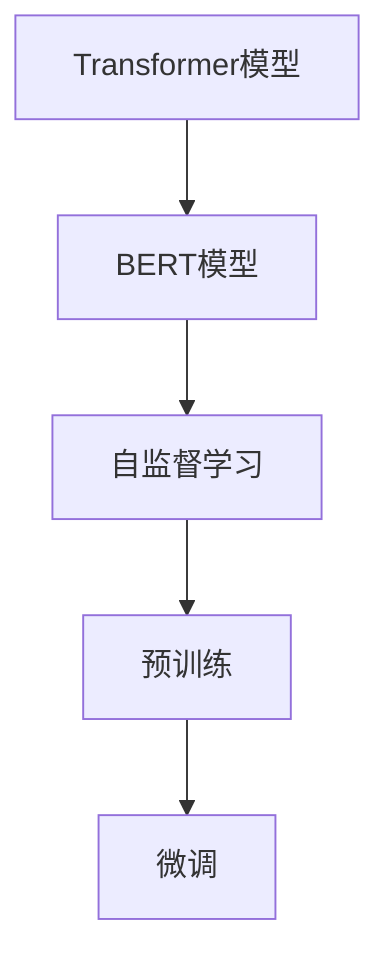
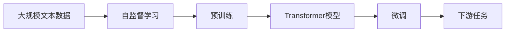
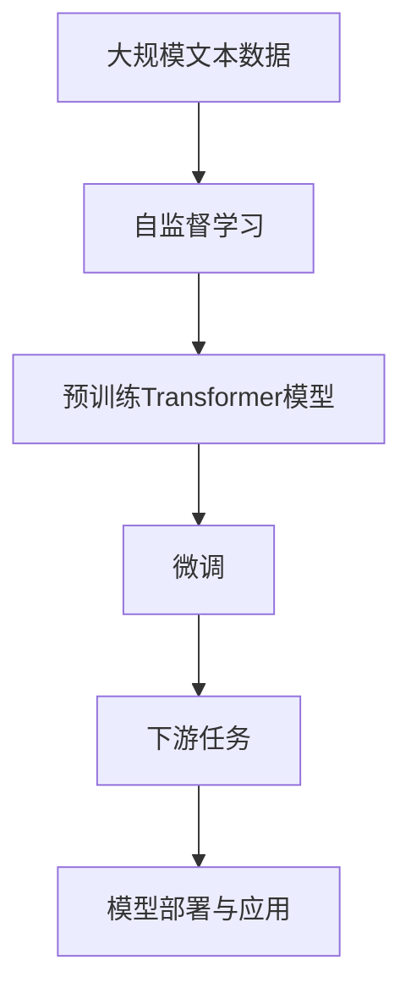

                 

# 大语言模型原理基础与前沿 Transformer

> 关键词：大语言模型,Transformer,BERT,自监督学习,自回归,预训练,语言理解,生成能力

## 1. 背景介绍

### 1.1 问题由来
近年来，深度学习技术在人工智能领域取得了飞速发展。大语言模型（Large Language Models, LLMs）作为深度学习的重要分支，凭借其庞大的参数量和复杂的模型结构，展现出强大的语言理解和生成能力，成为了自然语言处理（Natural Language Processing, NLP）领域的研究热点。

大语言模型的核心是Transformer模型，它采用自回归或自编码的机制进行预训练，学习到大量的语言知识。Transformer模型的成功不仅在于其出色的性能，还在于其高效的计算能力和广泛的应用场景。比如，BERT（Bidirectional Encoder Representations from Transformers）模型通过双向Transformer架构，在多项NLP任务上取得了SOTA（State-of-the-Art）的成绩，开启了预训练-微调范式的新纪元。

### 1.2 问题核心关键点
目前，基于Transformer的大语言模型在多个NLP任务上取得了显著的效果。其核心在于：
- 强大的语言理解和生成能力：Transformer模型通过自回归或自编码的方式，可以学习到大量的语言知识，具备复杂的语义理解能力和生成能力。
- 高效的计算能力：Transformer模型通过多头自注意力机制（Multi-Head Self-Attention），实现了高效的并行计算，适合在大规模数据集上训练。
- 广泛的应用场景：从文本分类、问答系统到机器翻译、文本生成等，Transformer模型在各种NLP任务上展现了巨大的潜力。

Transformer模型之所以成功，主要有以下几点原因：
- 自注意力机制：能够对文本中的不同位置进行灵活的注意力分配，捕捉长距离依赖关系。
- 残差连接和层归一化：有效解决了深层网络退化问题，提升了模型的稳定性。
- 多头注意力机制：对输入序列进行多维度的注意力计算，提升了模型的表达能力。

Transformer模型因其出色的性能和高效性，被广泛应用于各种NLP任务中。但同时，它也面临一些挑战，如模型规模庞大、训练成本高昂、推理速度慢等问题。因此，如何设计更高效的Transformer模型，并结合预训练和微调技术，成为了当前研究的重点。

### 1.3 问题研究意义
研究基于Transformer的大语言模型，对于推动NLP技术的发展，加速人工智能技术的产业化进程，具有重要意义：
- 提高模型的语言理解和生成能力：Transformer模型通过预训练-微调范式，能够在各种NLP任务上取得优异的效果，提升模型的性能。
- 降低应用开发成本：使用预训练大模型进行微调，可以显著减少从头开发所需的数据、计算和人力等成本投入。
- 加速模型迭代：微调过程可以快速适应新任务，缩短开发周期，加速模型迭代。
- 促进技术创新：微调范式促进了对预训练和微调技术的深入研究，催生了更多的研究方向，如知识蒸馏、少样本学习等。
- 赋能产业升级：大语言模型的应用有助于各行各业数字化转型升级，为传统行业带来新的发展机遇。

## 2. 核心概念与联系

### 2.1 核心概念概述

为更好地理解基于Transformer的大语言模型，本节将介绍几个密切相关的核心概念：

- **Transformer模型**：基于自注意力机制的深度学习模型，通过多头自注意力机制、残差连接和层归一化等技术，实现了高效的计算能力和强大的语义理解能力。
- **BERT模型**：一种预训练语言模型，通过双向Transformer架构，学习到丰富的语言知识，广泛应用于各种NLP任务中。
- **自监督学习**：一种无需标签数据进行训练的技术，利用语言模型预测任务、掩码语言模型等，学习到通用的语言表示。
- **自回归与自编码**：两种预训练的方式，自回归使用前文预测后文，自编码使用前文预测后文，均能有效学习语言知识。
- **预训练-微调范式**：利用预训练大模型进行微调，适应特定任务，提升模型性能。

这些核心概念之间的逻辑关系可以通过以下Mermaid流程图来展示：



这个流程图展示了大语言模型的核心概念及其之间的关系：

1. 基于Transformer模型进行预训练，学习到通用的语言表示。
2. 在预训练基础上，使用微调方法适应特定任务，提升模型性能。
3. 自监督学习可以用于预训练，提升模型的泛化能力。
4. 自回归与自编码是预训练的两种方式，均能学习到丰富的语言知识。

### 2.2 概念间的关系

这些核心概念之间存在着紧密的联系，形成了大语言模型的学习和应用框架。下面我们通过几个Mermaid流程图来展示这些概念之间的关系。

#### 2.2.1 大语言模型的学习范式



这个流程图展示了大语言模型的三种主要学习范式：预训练、微调和下游任务。预训练通过自监督学习任务，学习到通用的语言表示。微调通过下游任务的少量标注数据，对预训练模型进行优化，适应特定任务。

#### 2.2.2 Transformer模型的架构


这个流程图展示了Transformer模型的核心架构：输入序列通过编码器进行编码，经过多头自注意力机制和层归一化后，通过残差连接传递给解码器，最终输出序列。

#### 2.2.3 预训练与微调的关系


这个流程图展示了预训练和微调之间的关系。预训练通过自监督学习任务，学习到通用的语言表示，为微调提供初始化的权重。微调通过下游任务的少量标注数据，对预训练模型进行优化，适应特定任务。

### 2.3 核心概念的整体架构

最后，我们用一个综合的流程图来展示这些核心概念在大语言模型预训练和微调过程中的整体架构：



这个综合流程图展示了从预训练到微调，再到下游任务的完整过程。大语言模型首先在大规模文本数据上进行预训练，然后通过微调适应下游任务，最终部署到实际应用中。通过这些流程图，我们可以更清晰地理解大语言模型预训练和微调的流程和逻辑关系。

## 3. 核心算法原理 & 具体操作步骤
### 3.1 算法原理概述

基于Transformer的大语言模型预训练和微调，本质上是一个无监督和有监督学习的混合过程。其核心思想是：将预训练的Transformer模型视作一个强大的"特征提取器"，通过在大量的无标签文本数据上进行自监督学习，学习到通用的语言表示。然后，在特定任务的数据集上进行有监督微调，使模型能够输出符合任务要求的预测结果。

形式化地，假设预训练模型为 $M_{\theta}$，其中 $\theta$ 为预训练得到的模型参数。给定下游任务 $T$ 的标注数据集 $D=\{(x_i,y_i)\}_{i=1}^N$，微调的目标是找到新的模型参数 $\hat{\theta}$，使得：

$$
\hat{\theta}=\mathop{\arg\min}_{\theta} \mathcal{L}(M_{\theta},D)
$$

其中 $\mathcal{L}$ 为针对任务 $T$ 设计的损失函数，用于衡量模型预测输出与真实标签之间的差异。常见的损失函数包括交叉熵损失、均方误差损失等。

通过梯度下降等优化算法，微调过程不断更新模型参数 $\theta$，最小化损失函数 $\mathcal{L}$，使得模型输出逼近真实标签。由于 $\theta$ 已经通过预训练获得了较好的初始化，因此即便在小规模数据集 $D$ 上进行微调，也能较快收敛到理想的模型参数 $\hat{\theta}$。

### 3.2 算法步骤详解

基于Transformer的大语言模型预训练和微调一般包括以下几个关键步骤：

**Step 1: 准备预训练模型和数据集**
- 选择合适的预训练语言模型 $M_{\theta}$ 作为初始化参数，如 BERT、GPT 等。
- 准备下游任务 $T$ 的标注数据集 $D$，划分为训练集、验证集和测试集。一般要求标注数据与预训练数据的分布不要差异过大。

**Step 2: 添加任务适配层**
- 根据任务类型，在预训练模型顶层设计合适的输出层和损失函数。
- 对于分类任务，通常在顶层添加线性分类器和交叉熵损失函数。
- 对于生成任务，通常使用语言模型的解码器输出概率分布，并以负对数似然为损失函数。

**Step 3: 设置微调超参数**
- 选择合适的优化算法及其参数，如 AdamW、SGD 等，设置学习率、批大小、迭代轮数等。
- 设置正则化技术及强度，包括权重衰减、Dropout、Early Stopping 等。
- 确定冻结预训练参数的策略，如仅微调顶层，或全部参数都参与微调。

**Step 4: 执行梯度训练**
- 将训练集数据分批次输入模型，前向传播计算损失函数。
- 反向传播计算参数梯度，根据设定的优化算法和学习率更新模型参数。
- 周期性在验证集上评估模型性能，根据性能指标决定是否触发 Early Stopping。
- 重复上述步骤直到满足预设的迭代轮数或 Early Stopping 条件。

**Step 5: 测试和部署**
- 在测试集上评估微调后模型 $M_{\hat{\theta}}$ 的性能，对比微调前后的精度提升。
- 使用微调后的模型对新样本进行推理预测，集成到实际的应用系统中。
- 持续收集新的数据，定期重新微调模型，以适应数据分布的变化。

以上是基于Transformer的大语言模型预训练和微调的一般流程。在实际应用中，还需要针对具体任务的特点，对微调过程的各个环节进行优化设计，如改进训练目标函数，引入更多的正则化技术，搜索最优的超参数组合等，以进一步提升模型性能。

### 3.3 算法优缺点

基于Transformer的大语言模型预训练和微调方法具有以下优点：
1. 简单高效。只需准备少量标注数据，即可对预训练模型进行快速适配，获得较大的性能提升。
2. 通用适用。适用于各种NLP下游任务，包括分类、匹配、生成等，设计简单的任务适配层即可实现预训练和微调。
3. 参数高效。利用参数高效微调技术，在固定大部分预训练参数的情况下，仍可取得不错的提升。
4. 效果显著。在学术界和工业界的诸多任务上，基于预训练-微调的范式已经刷新了最先进的性能指标。

同时，该方法也存在一定的局限性：
1. 依赖标注数据。预训练和微调的效果很大程度上取决于标注数据的质量和数量，获取高质量标注数据的成本较高。
2. 迁移能力有限。当目标任务与预训练数据的分布差异较大时，预训练和微调的性能提升有限。
3. 负面效果传递。预训练模型的固有偏见、有害信息等，可能通过预训练和微调传递到下游任务，造成负面影响。
4. 可解释性不足。预训练模型和微调后的模型通常缺乏可解释性，难以对其推理逻辑进行分析和调试。

尽管存在这些局限性，但就目前而言，基于Transformer的大语言模型预训练和微调方法仍是大NLP应用的最主流范式。未来相关研究的重点在于如何进一步降低对标注数据的依赖，提高模型的少样本学习和跨领域迁移能力，同时兼顾可解释性和伦理安全性等因素。

### 3.4 算法应用领域

基于Transformer的大语言模型预训练和微调方法在NLP领域已经得到了广泛的应用，覆盖了几乎所有常见任务，例如：

- 文本分类：如情感分析、主题分类、意图识别等。通过预训练和微调使模型学习文本-标签映射。
- 命名实体识别：识别文本中的人名、地名、机构名等特定实体。通过预训练和微调使模型掌握实体边界和类型。
- 关系抽取：从文本中抽取实体之间的语义关系。通过预训练和微调使模型学习实体-关系三元组。
- 问答系统：对自然语言问题给出答案。将问题-答案对作为微调数据，训练模型学习匹配答案。
- 机器翻译：将源语言文本翻译成目标语言。通过预训练和微调使模型学习语言-语言映射。
- 文本摘要：将长文本压缩成简短摘要。将文章-摘要对作为微调数据，使模型学习抓取要点。
- 对话系统：使机器能够与人自然对话。将多轮对话历史作为上下文，微调模型进行回复生成。

除了上述这些经典任务外，大语言模型预训练和微调技术也被创新性地应用到更多场景中，如可控文本生成、常识推理、代码生成、数据增强等，为NLP技术带来了全新的突破。随着预训练模型和微调方法的不断进步，相信NLP技术将在更广阔的应用领域大放异彩。

## 4. 数学模型和公式 & 详细讲解 & 举例说明

### 4.1 数学模型构建

本节将使用数学语言对基于Transformer的大语言模型预训练和微调过程进行更加严格的刻画。

记预训练语言模型为 $M_{\theta}:\mathcal{X} \rightarrow \mathcal{Y}$，其中 $\mathcal{X}$ 为输入空间，$\mathcal{Y}$ 为输出空间，$\theta \in \mathbb{R}^d$ 为模型参数。假设微调任务的训练集为 $D=\{(x_i,y_i)\}_{i=1}^N, x_i \in \mathcal{X}, y_i \in \mathcal{Y}$。

定义模型 $M_{\theta}$ 在数据样本 $(x,y)$ 上的损失函数为 $\ell(M_{\theta}(x),y)$，则在数据集 $D$ 上的经验风险为：

$$
\mathcal{L}(\theta) = \frac{1}{N} \sum_{i=1}^N \ell(M_{\theta}(x_i),y_i)
$$

微调的目标是最小化经验风险，即找到最优参数：

$$
\theta^* = \mathop{\arg\min}_{\theta} \mathcal{L}(\theta)
$$

在实践中，我们通常使用基于梯度的优化算法（如SGD、Adam等）来近似求解上述最优化问题。设 $\eta$ 为学习率，$\lambda$ 为正则化系数，则参数的更新公式为：

$$
\theta \leftarrow \theta - \eta \nabla_{\theta}\mathcal{L}(\theta) - \eta\lambda\theta
$$

其中 $\nabla_{\theta}\mathcal{L}(\theta)$ 为损失函数对参数 $\theta$ 的梯度，可通过反向传播算法高效计算。

### 4.2 公式推导过程

以下我们以二分类任务为例，推导交叉熵损失函数及其梯度的计算公式。

假设模型 $M_{\theta}$ 在输入 $x$ 上的输出为 $\hat{y}=M_{\theta}(x) \in [0,1]$，表示样本属于正类的概率。真实标签 $y \in \{0,1\}$。则二分类交叉熵损失函数定义为：

$$
\ell(M_{\theta}(x),y) = -[y\log \hat{y} + (1-y)\log (1-\hat{y})]
$$

将其代入经验风险公式，得：

$$
\mathcal{L}(\theta) = -\frac{1}{N}\sum_{i=1}^N [y_i\log M_{\theta}(x_i)+(1-y_i)\log(1-M_{\theta}(x_i))]
$$

根据链式法则，损失函数对参数 $\theta_k$ 的梯度为：

$$
\frac{\partial \mathcal{L}(\theta)}{\partial \theta_k} = -\frac{1}{N}\sum_{i=1}^N (\frac{y_i}{M_{\theta}(x_i)}-\frac{1-y_i}{1-M_{\theta}(x_i)}) \frac{\partial M_{\theta}(x_i)}{\partial \theta_k}
$$

其中 $\frac{\partial M_{\theta}(x_i)}{\partial \theta_k}$ 可进一步递归展开，利用自动微分技术完成计算。

在得到损失函数的梯度后，即可带入参数更新公式，完成模型的迭代优化。重复上述过程直至收敛，最终得到适应下游任务的最优模型参数 $\theta^*$。

### 4.3 案例分析与讲解

我们以BERT模型为例，展示基于Transformer的大语言模型预训练和微调过程。BERT模型采用双向Transformer架构，通过自监督学习任务进行预训练，学习到丰富的语言知识。

在预训练过程中，BERT模型使用两种任务：掩码语言模型（Masked Language Model, MLM）和下一句预测（Next Sentence Prediction, NSP）。掩码语言模型通过随机掩码一部分输入序列，预测被掩码的词汇。下一句预测通过输入两句话，预测它们是否是连续的。

在微调过程中，我们可以将预训练模型 $M_{\theta}$ 作为初始化参数，使用下游任务的数据集 $D$ 进行有监督的微调。例如，在情感分析任务上，我们可以将评论文本和情感标签作为训练集，使用交叉熵损失函数进行微调，使模型学习到文本-情感映射。

在代码实现上，我们可以使用Hugging Face提供的Transformer库，封装好的BERT模型可以直接使用。以微调BERT模型为例，以下是代码实现：

```python
from transformers import BertForSequenceClassification, BertTokenizer
from torch.utils.data import Dataset, DataLoader
import torch

# 定义BERT模型和tokenizer
model = BertForSequenceClassification.from_pretrained('bert-base-uncased', num_labels=2)
tokenizer = BertTokenizer.from_pretrained('bert-base-uncased')

# 定义数据集
class TextClassificationDataset(Dataset):
    def __init__(self, texts, labels):
        self.texts = texts
        self.labels = labels
    
    def __len__(self):
        return len(self.texts)
    
    def __getitem__(self, idx):
        text = self.texts[idx]
        label = self.labels[idx]
        encoding = tokenizer(text, return_tensors='pt', padding='max_length', truncation=True)
        input_ids = encoding['input_ids']
        attention_mask = encoding['attention_mask']
        return {'input_ids': input_ids, 'attention_mask': attention_mask, 'labels': label}

# 定义数据加载器
dataset = TextClassificationDataset(texts, labels)
dataloader = DataLoader(dataset, batch_size=16, shuffle=True)

# 定义优化器和学习率调度
optimizer = AdamW(model.parameters(), lr=2e-5)
scheduler = get_linear_schedule_with_warmup(optimizer, num_warmup_steps=0, num_training_steps=len(dataloader) * epochs)

# 定义损失函数
criterion = nn.CrossEntropyLoss()

# 定义训练和评估函数
def train_epoch(model, dataloader, optimizer, scheduler, criterion):
    model.train()
    total_loss = 0
    for batch in dataloader:
        inputs = {key: val.to(device) for key, val in batch.items()}
        outputs = model(**inputs)
        loss = criterion(outputs.logits, batch['labels'].to(device))
        optimizer.zero_grad()
        loss.backward()
        optimizer.step()
        scheduler.step()
        total_loss += loss.item()
    return total_loss / len(dataloader)

def evaluate(model, dataloader, criterion):
    model.eval()
    total_loss = 0
    total_acc = 0
    for batch in dataloader:
        inputs = {key: val.to(device) for key, val in batch.items()}
        outputs = model(**inputs)
        loss = criterion(outputs.logits, batch['labels'].to(device))
        total_loss += loss.item()
        total_acc += (outputs.logits.argmax(dim=1) == batch['labels'].to(device)).float().sum().item()
    return total_loss / len(dataloader), total_acc / len(dataloader)

# 训练模型
epochs = 3
device = torch.device('cuda' if torch.cuda.is_available() else 'cpu')
model.to(device)
total_loss = 0
for epoch in range(epochs):
    loss = train_epoch(model, dataloader, optimizer, scheduler, criterion)
    print(f'Epoch {epoch+1}, train loss: {loss:.3f}')
    avg_loss, acc = evaluate(model, dataloader, criterion)
    print(f'Epoch {epoch+1}, dev results:')
    print(f'  Average loss: {avg_loss:.3f}')
    print(f'  Accuracy: {acc:.3f}')
```

可以看到，使用Hugging Face的Transformer库，可以很方便地进行BERT模型的预训练和微调。在微调过程中，我们只需要指定适当的超参数，如学习率、批量大小、迭代轮数等，即可完成模型的训练和评估。

## 5. 项目实践：代码实例和详细解释说明
### 5.1 开发环境搭建

在进行微调实践前，我们需要准备好开发环境。以下是使用Python进行PyTorch开发的环境配置流程：

1. 安装Anaconda：从官网下载并安装Anaconda，用于创建独立的Python环境。

2. 创建并激活虚拟环境：
```bash
conda create -n pytorch-env python=3.8 
conda activate pytorch-env
```

3. 安装PyTorch：根据CUDA版本，从官网获取对应的安装命令。例如：
```bash
conda install pytorch torchvision torchaudio cudatoolkit=11.1 -c pytorch -c conda-forge
```

4. 安装Transformers库：
```bash
pip install transformers
```

5. 安装各类工具包：
```bash
pip install numpy pandas scikit-learn matplotlib tqdm jupyter notebook ipython
```

完成上述步骤后，即可在`pytorch-env`环境中开始微调实践。

### 5.2 源代码详细实现

这里我们以情感分析任务为例，给出使用Transformers库对BERT模型进行微调的PyTorch代码实现。

首先，定义情感分析任务的数据处理函数：

```python
from transformers import BertTokenizer
from torch.utils.data import Dataset
import torch

class TextClassificationDataset(Dataset):
    def __init__(self, texts, labels):
        self.texts = texts
        self.labels = labels
    
    def __len__(self):
        return len(self.texts)
    
    def __getitem__(self, idx):
        text = self.texts[idx]
        label = self.labels[idx]
        encoding = tokenizer(text, return_tensors='pt', padding='max_length', truncation=True)
        input_ids = encoding['input_ids']
        attention_mask = encoding['attention_mask']
        return {'input_ids': input_ids, 'attention_mask': attention_mask, 'labels': label}

# 定义标签与id的映射
tag2id = {'negative': 0, 'positive': 1}
id2tag = {v: k for k, v in tag2id.items()}

# 创建dataset
tokenizer = BertTokenizer.from_pretrained('bert-base-uncased')

train_dataset = TextClassificationDataset(train_texts, train_labels)
dev_dataset = TextClassificationDataset(dev_texts, dev_labels)
test_dataset = TextClassificationDataset(test_texts, test_labels)
```

然后，定义模型和优化器：

```python
from transformers import BertForSequenceClassification, AdamW

model = BertForSequenceClassification.from_pretrained('bert-base-uncased', num_labels=len(tag2id))

optimizer = AdamW(model.parameters(), lr=2e-5)
```

接着，定义训练和评估函数：

```python
from torch.utils.data import DataLoader
from tqdm import tqdm
from sklearn.metrics import classification_report

device = torch.device('cuda' if torch.cuda.is_available() else 'cpu')
model.to(device)

def train_epoch(model, dataset, batch_size, optimizer, scheduler, criterion):
    dataloader = DataLoader(dataset, batch_size=batch_size, shuffle=True)
    model.train()
    total_loss = 0
    for batch in tqdm(dataloader, desc='Training'):
        inputs = {key: val.to(device) for key, val in batch.items()}
        outputs = model(**inputs)
        loss = criterion(outputs.logits, batch['labels'].to(device))
        optimizer.zero_grad()
        loss.backward()
        optimizer.step()
        scheduler.step()
        total_loss += loss.item()
    return total_loss / len(dataloader)

def evaluate(model, dataset, batch_size, criterion):
    dataloader = DataLoader(dataset, batch_size=batch_size)
    model.eval()
    total_loss = 0
    total_acc = 0
    for batch in dataloader:
        inputs = {key: val.to(device) for key, val in batch

