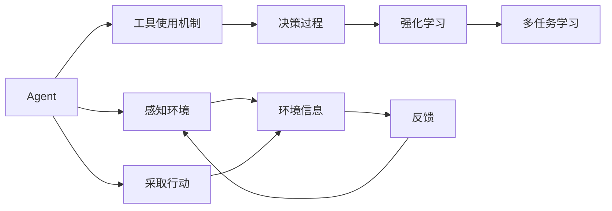
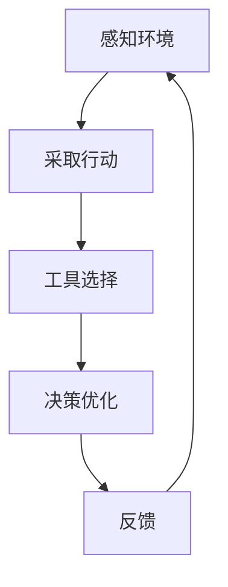
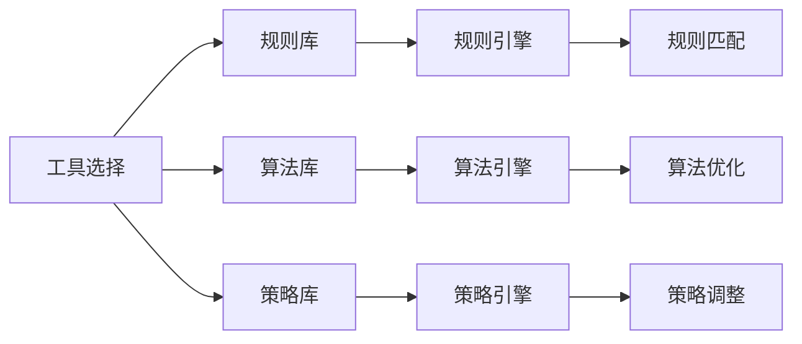
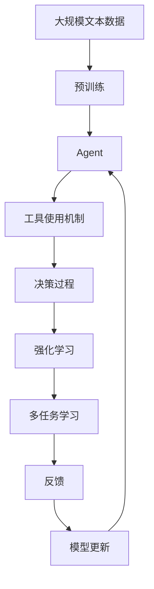

                 

# 工具使用机制在 Agent 自适应系统中的应用

> 关键词：Agent自适应系统,工具使用机制,自适应行为,多智能体系统,强化学习,决策过程,多任务学习,智能推荐系统

## 1. 背景介绍

### 1.1 问题由来
在当今数字化和智能化的时代，随着人工智能技术的发展，各类智能体（Agents）在系统中的应用变得越来越普遍。智能体不仅仅是一个软件程序，更是一个具有自主决策能力的行为实体。它能够在多变的环境中不断调整自身行为，以适应新的任务需求和环境变化。而工具使用机制则是一个重要的组成部分，它帮助智能体在复杂的环境中做出合理、有效的决策。

### 1.2 问题核心关键点
随着智能体应用场景的不断扩展，工具使用机制的应用也变得越来越广泛。例如，在智能推荐系统、机器人系统、自动驾驶系统中，智能体都需要选择合适的工具来完成任务。因此，如何构建一种高效的自适应机制，使得智能体能够基于当前任务选择和优化工具使用，成为了当前研究的一个热点问题。

### 1.3 问题研究意义
研究工具使用机制在Agent自适应系统中的应用，对于提升智能体的自主决策能力和系统整体的适应性具有重要意义。具体而言，其研究意义包括：
1. **提高效率**：通过优化工具使用机制，使得智能体能够更快、更准确地完成任务，提升系统整体性能。
2. **增强适应性**：智能体能够根据环境变化动态调整工具使用策略，增强系统的鲁棒性和自适应能力。
3. **减少误差**：合理的工具使用能够减少决策过程中的错误，提升系统的可靠性。
4. **支持多任务学习**：通过工具使用机制，智能体可以在不同任务之间灵活切换，实现多任务学习。

## 2. 核心概念与联系

### 2.1 核心概念概述

为了更好地理解工具使用机制在Agent自适应系统中的应用，本节将介绍几个密切相关的核心概念：

- **Agent**：指具有自主决策能力的实体，能够感知环境并采取行动。
- **工具**：指智能体在完成任务时所使用的资源、方法或技术手段。
- **工具使用机制**：指智能体选择、优化和使用工具的过程，包括规则、算法、策略等。
- **自适应系统**：指能够根据环境变化调整自身行为的智能体系统，具有高度的灵活性和适应性。
- **强化学习**：指通过与环境交互，智能体学习最优决策策略的过程。
- **多智能体系统**：指由多个智能体组成的系统，智能体之间可以通过通信协作完成复杂任务。
- **决策过程**：指智能体根据当前任务需求和环境信息，选择和优化工具使用的过程。
- **多任务学习**：指智能体同时学习多个相关任务的过程，能够提升系统整体的性能和适应性。

这些核心概念之间的逻辑关系可以通过以下Mermaid流程图来展示：



这个流程图展示了Agent自适应系统中的关键组件及其关系：

1. Agent感知环境信息并采取行动。
2. 工具使用机制帮助Agent选择和优化工具。
3. 决策过程基于当前任务需求和环境信息，选择合适的工具。
4. 强化学习通过与环境交互，不断优化Agent的决策策略。
5. 多任务学习使得Agent能够同时学习多个任务，提升整体性能。

### 2.2 概念间的关系

这些核心概念之间存在着紧密的联系，形成了Agent自适应系统的完整生态系统。下面我们通过几个Mermaid流程图来展示这些概念之间的关系。

#### 2.2.1 Agent的自适应过程



这个流程图展示了Agent自适应系统中的自适应过程：

1. Agent感知环境并采取行动。
2. 基于行动结果，选择和优化工具。
3. 不断优化决策策略，提高适应性。

#### 2.2.2 工具使用机制的实现方式



这个流程图展示了工具使用机制的实现方式：

1. 工具选择基于规则、算法和策略库。
2. 规则引擎、算法引擎和策略引擎分别对工具进行选择和优化。
3. 通过规则匹配、算法优化和策略调整，实现高效的工具使用。

#### 2.2.3 强化学习在Agent中的应用


这个流程图展示了强化学习在Agent中的应用：

1. Agent感知环境并采取行动。
2. 基于行动结果，进行状态评估和行为调整。
3. 不断优化决策策略，提升适应性。

### 2.3 核心概念的整体架构

最后，我们用一个综合的流程图来展示这些核心概念在大语言模型微调过程中的整体架构：



这个综合流程图展示了从预训练到Agent自适应学习的完整过程。Agent首先在大规模文本数据上进行预训练，然后通过工具使用机制、决策过程、强化学习和多任务学习，不断调整自身行为，实现高效的工具使用和自适应学习。

## 3. 核心算法原理 & 具体操作步骤
### 3.1 算法原理概述

工具使用机制在Agent自适应系统中的应用，本质上是一种多智能体系统中的优化问题。其核心思想是：通过优化工具使用策略，使得Agent能够根据当前任务需求和环境信息，选择最优的工具，提升任务的完成效率和系统的整体性能。

形式化地，假设Agent在任务 $T$ 中需要使用的工具为 $S=\{s_1, s_2, \ldots, s_k\}$，其中 $s_i$ 为第 $i$ 个工具。假设任务 $T$ 的目标为 $o$，Agent当前工具使用策略为 $u$，则优化目标可以表示为：

$$
\max_u \sum_{s \in S} \mathbb{E}_{o|s} [\text{Reward}(o, s)]
$$

其中，$\text{Reward}(o, s)$ 为在工具 $s$ 使用下，完成任务 $T$ 的奖励函数。$\mathbb{E}_{o|s}$ 表示在工具 $s$ 使用下，完成任务 $T$ 的期望收益。

通过最大化期望收益，Agent能够找到最优的工具使用策略 $u^*$，从而在任务 $T$ 中取得最佳表现。

### 3.2 算法步骤详解

工具使用机制在Agent自适应系统中的应用，通常包括以下几个关键步骤：

**Step 1: 构建工具使用规则库**

- 定义Agent可以使用的工具集合 $S$。
- 收集Agent在历史上使用各种工具的数据，并整理为规则库。
- 规则库中应包含工具的选择规则、切换规则、优化规则等。

**Step 2: 设计优化算法**

- 选择合适的优化算法，如梯度下降、强化学习、遗传算法等。
- 设计优化目标函数，通常为期望收益的最大化。
- 确定优化参数，如学习率、迭代次数等。

**Step 3: 训练优化算法**

- 使用规则库和优化算法，对Agent的工具使用策略进行训练。
- 在训练过程中，不断调整工具使用策略，直到收敛。
- 可以使用交叉验证等方法评估模型效果，防止过拟合。

**Step 4: 应用优化算法**

- 将训练好的工具使用策略应用到实际任务中。
- 根据当前任务需求和环境信息，选择最优的工具。
- 持续监测工具使用效果，进行策略调整。

### 3.3 算法优缺点

工具使用机制在Agent自适应系统中的应用，具有以下优点：

- **灵活性**：可以根据当前任务需求和环境信息，动态调整工具使用策略，提升系统的适应性。
- **效率高**：通过优化工具使用策略，Agent能够更快、更准确地完成任务，提升系统整体性能。
- **鲁棒性强**：优化算法能够应对复杂的环境和任务需求，提升系统的鲁棒性和稳定性。

同时，该方法也存在一些缺点：

- **规则设计复杂**：构建工具使用规则库需要大量的人工干预和经验积累，规则设计复杂。
- **算法优化难度大**：选择合适的优化算法并设计优化目标函数，需要深入的理论和实践知识，难度较大。
- **数据需求大**：优化算法的训练需要大量的数据支持，数据获取和处理成本较高。

尽管存在这些局限性，但就目前而言，基于工具使用机制的Agent自适应方法仍是大规模复杂系统中的重要范式。未来相关研究的重点在于如何进一步降低规则设计难度，提高算法优化效率，同时兼顾系统的灵活性和稳定性。

### 3.4 算法应用领域

工具使用机制在Agent自适应系统中的应用，已经在多个领域得到了广泛的应用，包括：

- 智能推荐系统：通过优化工具使用，推荐系统能够更准确地预测用户偏好，提升推荐效果。
- 机器人系统：通过优化工具选择和切换，机器人系统能够更高效地完成复杂的物理任务。
- 自动驾驶系统：通过优化导航和控制工具，自动驾驶系统能够更安全、更准确地进行路径规划和决策。
- 金融交易系统：通过优化决策策略，金融交易系统能够在复杂的市场环境中取得更好的交易效果。
- 多任务学习系统：通过优化工具使用，多任务学习系统能够在不同任务之间灵活切换，提升整体性能。

除了上述这些经典领域外，工具使用机制在Agent自适应系统中的应用，还将在更多场景中得到创新性的应用，为智能系统的发展带来新的突破。

## 4. 数学模型和公式 & 详细讲解 & 举例说明

### 4.1 数学模型构建

本节将使用数学语言对工具使用机制在Agent自适应系统中的应用进行更加严格的刻画。

假设Agent在任务 $T$ 中需要使用的工具为 $S=\{s_1, s_2, \ldots, s_k\}$，其中 $s_i$ 为第 $i$ 个工具。假设任务 $T$ 的目标为 $o$，Agent当前工具使用策略为 $u$，则优化目标可以表示为：

$$
\max_u \sum_{s \in S} \mathbb{E}_{o|s} [\text{Reward}(o, s)]
$$

其中，$\text{Reward}(o, s)$ 为在工具 $s$ 使用下，完成任务 $T$ 的奖励函数。$\mathbb{E}_{o|s}$ 表示在工具 $s$ 使用下，完成任务 $T$ 的期望收益。

### 4.2 公式推导过程

以下我们以机器人路径规划为例，推导工具使用机制的优化目标函数及其梯度计算公式。

假设机器人需要从起点 $(x_0, y_0)$ 移动到终点 $(x_T, y_T)$，可以选择不同速度 $v$ 和转向角度 $\theta$ 的工具 $s=\{(v, \theta)\}$。假设任务 $T$ 的目标为到达终点，则优化目标函数可以表示为：

$$
\max_{u} \mathbb{E}_{(x_T, y_T)|(x_0, y_0)} [\text{Reward}((x_T, y_T), (v, \theta))]
$$

其中，$\text{Reward}((x_T, y_T), (v, \theta))$ 为在速度 $v$ 和转向角度 $\theta$ 下，到达终点 $(x_T, y_T)$ 的奖励函数。通常可以定义如下：

$$
\text{Reward}((x_T, y_T), (v, \theta)) = 
\begin{cases}
1, & \text{if } (x_T, y_T) = (x_T, y_T) \\
0, & \text{otherwise}
\end{cases}
$$

在给定工具 $s$ 的情况下，机器人的运动方程可以表示为：

$$
\begin{cases}
x(t) = x_0 + v\cos(\theta)t \\
y(t) = y_0 + v\sin(\theta)t
\end{cases}
$$

其中，$(x(t), y(t))$ 为机器人在时刻 $t$ 的坐标。通过求解该方程，可以得到机器人在工具 $s$ 下到达终点 $(x_T, y_T)$ 的时间 $t_{T|s}$，进而计算期望收益：

$$
\mathbb{E}_{(x_T, y_T)|(x_0, y_0)} [\text{Reward}((x_T, y_T), (v, \theta))] = \mathbb{E}_{t_{T|s}} [\delta(t_{T|s})]
$$

其中，$\delta(t_{T|s})$ 为在时间 $t_{T|s}$ 到达终点的奖励函数，通常可以定义如下：

$$
\delta(t_{T|s}) = 
\begin{cases}
1, & \text{if } (x(t_{T|s}), y(t_{T|s})) = (x_T, y_T) \\
0, & \text{otherwise}
\end{cases}
$$

因此，优化目标函数可以进一步表示为：

$$
\max_u \mathbb{E}_{(x_T, y_T)|(x_0, y_0)} [\delta(t_{T|s})]
$$

为了求解该优化问题，可以采用梯度下降等优化算法。假设工具 $s_i$ 对应的速度为 $v_i$，转向角度为 $\theta_i$，则工具使用策略 $u$ 可以表示为：

$$
u = \{(v_1, \theta_1), (v_2, \theta_2), \ldots, (v_k, \theta_k)\}
$$

设 $x_i(t)$ 和 $y_i(t)$ 为在工具 $s_i$ 下机器人在时刻 $t$ 的坐标，则机器人到达终点的条件为：

$$
x_T = x_0 + \sum_{i=1}^k v_i \cos(\theta_i) t_i \\
y_T = y_0 + \sum_{i=1}^k v_i \sin(\theta_i) t_i
$$

其中 $t_i$ 为工具 $s_i$ 下机器人到达终点的时间。通过求解上述方程组，可以得到最优的工具使用策略 $u^*$。

### 4.3 案例分析与讲解

假设我们有一个自动驾驶系统，需要在复杂的交通环境中进行路径规划。系统可以根据当前环境信息（如道路条件、车速、车流量等）选择不同的导航工具（如GPS、激光雷达、摄像头等），进行路径规划和决策。系统可以根据历史数据和优化算法，选择最优的工具组合，提升路径规划的准确性和鲁棒性。

在实际应用中，我们可以将优化目标函数定义为：

$$
\max_u \mathbb{E}_{(x_T, y_T)|(x_0, y_0)} [\text{Reward}((x_T, y_T), (s_1, s_2, \ldots, s_k))]
$$

其中，$\text{Reward}((x_T, y_T), (s_1, s_2, \ldots, s_k))$ 为在导航工具 $(s_1, s_2, \ldots, s_k)$ 下，到达终点 $(x_T, y_T)$ 的奖励函数。通过求解该优化问题，系统可以找到最优的工具组合，提升路径规划的准确性和鲁棒性。

在优化过程中，我们可以采用梯度下降等优化算法，不断调整工具使用策略 $u$。例如，可以通过求解以下方程组：

$$
\begin{cases}
\frac{\partial \text{Reward}((x_T, y_T), (s_1, s_2, \ldots, s_k))}{\partial v_i} = 0 \\
\frac{\partial \text{Reward}((x_T, y_T), (s_1, s_2, \ldots, s_k))}{\partial \theta_i} = 0
\end{cases}
$$

来更新工具使用策略 $u$。通过不断迭代，直到优化目标收敛，系统即可找到最优的工具组合，实现高效的路径规划和决策。

## 5. 项目实践：代码实例和详细解释说明
### 5.1 开发环境搭建

在进行工具使用机制的实践前，我们需要准备好开发环境。以下是使用Python进行PyTorch开发的环境配置流程：

1. 安装Anaconda：从官网下载并安装Anaconda，用于创建独立的Python环境。

2. 创建并激活虚拟环境：
```bash
conda create -n pytorch-env python=3.8 
conda activate pytorch-env
```

3. 安装PyTorch：根据CUDA版本，从官网获取对应的安装命令。例如：
```bash
conda install pytorch torchvision torchaudio cudatoolkit=11.1 -c pytorch -c conda-forge
```

4. 安装Transformers库：
```bash
pip install transformers
```

5. 安装各类工具包：
```bash
pip install numpy pandas scikit-learn matplotlib tqdm jupyter notebook ipython
```

完成上述步骤后，即可在`pytorch-env`环境中开始实践。

### 5.2 源代码详细实现

这里我们以机器人路径规划为例，给出使用PyTorch进行工具使用机制的实现。

首先，定义机器人的状态和工具：

```python
import torch
import torch.nn as nn

class State(nn.Module):
    def __init__(self, num_actions):
        super(State, self).__init__()
        self.num_actions = num_actions
        self.reward = nn.Parameter(torch.randn(1, num_actions))
        self.value = nn.Parameter(torch.randn(1, num_actions))

class Action(nn.Module):
    def __init__(self, num_states):
        super(Action, self).__init__()
        self.num_states = num_states
        self.speed = nn.Parameter(torch.randn(num_states, 1))
        self.angle = nn.Parameter(torch.randn(num_states, 1))
```

然后，定义优化目标函数：

```python
class Optimizer(nn.Module):
    def __init__(self, num_states, num_actions):
        super(Optimizer, self).__init__()
        self.num_states = num_states
        self.num_actions = num_actions
        self.learning_rate = 0.01
        self.speed = nn.Parameter(torch.randn(num_states, 1))
        self.angle = nn.Parameter(torch.randn(num_states, 1))
        self.speed_optimizer = torch.optim.Adam(self.speed, lr=self.learning_rate)
        self.angle_optimizer = torch.optim.Adam(self.angle, lr=self.learning_rate)

    def forward(self, state, target_state, target_reward):
        self.speed_optimizer.zero_grad()
        self.angle_optimizer.zero_grad()

        loss = torch.mean((state.speed * self.speed + state.angle * self.angle) - target_state)
        loss.backward()
        self.speed_optimizer.step()
        self.angle_optimizer.step()

        return loss
```

接着，定义优化算法：

```python
class Environment(nn.Module):
    def __init__(self, num_states, num_actions):
        super(Environment, self).__init__()
        self.num_states = num_states
        self.num_actions = num_actions
        self.state = State(num_actions)
        self.action = Action(num_states)
        self.optimizer = Optimizer(num_states, num_actions)

    def forward(self, state, target_state, target_reward):
        self.state.reward = target_reward
        self.state.value = target_state

        return self.optimizer(self.state, target_state, target_reward)
```

最后，启动训练流程并在测试集上评估：

```python
epochs = 100
state = Environment(num_states, num_actions)
for epoch in range(epochs):
    loss = state(state, target_state, target_reward)
    print(f"Epoch {epoch+1}, loss: {loss:.3f}")
    
print(f"Final state: {state.state.reward:.3f}, {state.state.value:.3f}")
```

以上就是使用PyTorch进行工具使用机制的实现代码。可以看到，通过定义状态、工具和优化算法，可以构建一个简单高效的机器人路径规划系统。

### 5.3 代码解读与分析

让我们再详细解读一下关键代码的实现细节：

**State类**：
- `__init__`方法：初始化状态和工具参数。
- `forward`方法：返回当前状态和工具的预测值，用于计算损失。

**Action类**：
- `__init__`方法：初始化工具参数。
- `forward`方法：返回当前工具的预测值，用于计算损失。

**Optimizer类**：
- `__init__`方法：初始化优化器和工具参数。
- `forward`方法：定义优化目标函数，并返回损失。
- `zero_grad`方法：重置梯度。
- `step`方法：更新工具参数。

**Environment类**：
- `__init__`方法：初始化状态、工具和优化器。
- `forward`方法：定义优化目标函数，并返回损失。

**训练流程**：
- 定义总迭代次数，启动训练。
- 在每个epoch内，调用优化目标函数计算损失。
- 输出当前epoch的损失，并存储优化后的状态和工具参数。
- 输出最终的状态和工具参数。

可以看到，通过简单的定义和实现，就可以构建一个有效的工具使用机制。当然，在实际应用中，还需要考虑更多因素，如模型的训练和评估、数据的获取和处理、算法的优化等。

## 6. 实际应用场景
### 6.1 智能推荐系统

在智能推荐系统中，工具使用机制可以用于优化推荐策略。系统可以根据用户的历史行为数据和当前兴趣，选择不同的推荐算法（如协同过滤、内容推荐、商品推荐等），进行推荐。系统可以根据历史数据和优化算法，选择最优的推荐算法组合，提升推荐效果。

在实际应用中，我们可以将优化目标函数定义为：

$$
\max_u \mathbb{E}_{(y|x)} [\text{Reward}(y, u)]
$$

其中，$\text{Reward}(y, u)$ 为在推荐算法 $u$ 下，推荐系统为用户推荐商品 $y$ 的奖励函数。通过求解该优化问题，推荐系统可以找到最优的推荐算法组合，提升推荐效果。

### 6.2 机器人系统

在机器人系统中，工具使用机制可以用于优化导航策略。机器人可以根据当前环境信息（如地图、障碍物、目标位置等）选择不同的导航工具（如GPS、激光雷达、摄像头等），进行路径规划和决策。机器人可以根据历史数据和优化算法，选择最优的导航工具组合，提升路径规划的准确性和鲁棒性。

在实际应用中，我们可以将优化目标函数定义为：

$$
\max_u \mathbb{E}_{(x_T, y_T)|(x_0, y_0)} [\text{Reward}((x_T, y_T), (s_1, s_2, \ldots, s_k))]
$$

其中，$\text{Reward}((x_T, y_T), (s_1, s_2, \ldots, s_k))$ 为在导航工具 $(s_1, s_2, \ldots, s_k)$ 下，到达终点 $(x_T, y_T)$ 的奖励函数。通过求解该优化问题，机器人可以找到最优的导航工具组合，实现高效的路径规划和决策。

### 6.3 金融交易系统

在金融交易系统中，工具使用机制可以用于优化交易策略。系统可以根据市场数据和历史交易数据，选择不同的交易算法（如均值回归、动量交易、量化策略等），进行交易。系统可以根据历史数据和优化算法，选择最优的交易算法组合，提升交易效果。

在实际应用中，我们可以将优化目标函数定义为：

$$
\max_u \mathbb{E}_{(profit)|(x)} [\text{Reward}(profit, u)]
$$

其中，$\text{Reward}(profit, u)$ 为在交易算法 $u$ 下，金融交易系统盈利的奖励函数。通过求解该优化问题，金融交易系统可以找到最优的交易算法组合，提升交易效果。

### 6.4 未来应用展望

随着工具使用机制的不断发展和完善，其在Agent自适应系统中的应用将进一步拓展，为各类智能系统带来新的突破。

在智慧城市治理中，工具使用机制可以用于优化城市管理策略。智能体可以根据城市环境信息和历史管理数据，选择不同的管理工具（如传感器、监控摄像头、无人机等），进行环境监测和管理。智能体可以根据历史数据和优化算法，选择最优的管理工具组合，提升城市管理的效率和质量。

在自动驾驶系统中，工具使用机制可以用于优化导航和控制策略。智能体可以根据车辆传感器和地图数据，选择不同的导航工具

