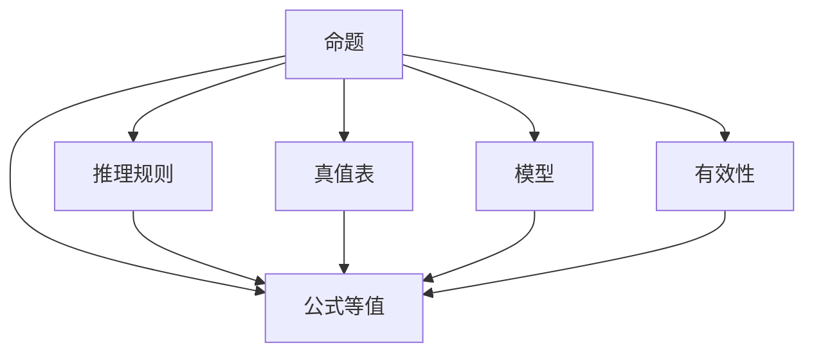

                 

# 数理逻辑：逻辑演算（二）

数理逻辑是一种研究形式逻辑和推理的学科，它通过对逻辑符号和推理规则的数学化描述，实现了对自然语言推理过程的精确建模。本文将从数理逻辑的核心概念、算法原理、操作步骤以及实际应用等方面进行详细阐述，力图为读者提供一个全面、深入的逻辑演算入门指南。

## 1. 背景介绍

### 1.1 问题由来
逻辑演算作为数理逻辑的核心研究内容，旨在通过符号化的逻辑表达式来表示和推理自然语言中的命题和推理关系。逻辑演算的出现极大地促进了数学、哲学、人工智能等领域的发展。它为计算机科学提供了坚实的理论基础，是实现自动化推理和知识表示的基础。

### 1.2 问题核心关键点
逻辑演算的核心在于其对自然语言逻辑的符号化表示和推理，以及如何将这种符号化表达转换为计算机可执行的形式。逻辑演算涉及到命题逻辑、谓词逻辑、模态逻辑、时态逻辑等多种类型，每种类型的逻辑演算都有其独特的符号表示和推理规则。

### 1.3 问题研究意义
研究逻辑演算对于实现计算机自动化推理、构建知识表示系统、提升人工智能系统的认知能力具有重要意义。它不仅为自然语言处理和知识工程提供了理论支撑，还为解决复杂问题提供了数学化的推理手段，促进了科学研究的深度和广度。

## 2. 核心概念与联系

### 2.1 核心概念概述

在逻辑演算中，我们需要理解几个核心概念：

- **命题**：逻辑演算中的基本元素，表示某个事实或假设。
- **真值表**：用于展示命题逻辑连接词（如否定、合取、析取、蕴含等）在不同组合下的真值情况的表格。
- **推理规则**：根据逻辑连接词的性质，确定命题之间的逻辑关系，从而推导出新的命题。
- **公式等值**：两个逻辑公式在所有情况下都表现出相同的真值，即为等价公式。
- **模型**：满足所有逻辑公式真值的解释结构。
- **有效性**：一个推理过程正确地从前提推导出结论，即为有效推理。

### 2.2 概念间的关系

逻辑演算的核心概念通过以下Mermaid流程图进行展示：



这个流程图展示了逻辑演算的基本流程：首先从命题开始，通过真值表和推理规则推导出新的命题；接着引入公式等值和模型概念，用来描述逻辑公式之间的关系；最后，通过有效性概念确保推理过程的正确性。

## 3. 核心算法原理 & 具体操作步骤

### 3.1 算法原理概述

逻辑演算的核心算法包括命题逻辑的推理、谓词逻辑的推理、模态逻辑的推理等。这些算法通过符号化表示和推理规则，实现从已知命题到未知命题的推导。

### 3.2 算法步骤详解

逻辑演算的详细步骤包括：

- **符号化表示**：将自然语言命题转换为逻辑符号表示。
- **构建真值表**：根据逻辑连接词的性质，构建真值表。
- **应用推理规则**：根据真值表，应用推理规则进行逻辑推理。
- **验证等价性**：验证不同命题形式之间的逻辑等价性。
- **构造模型**：构建满足所有逻辑公式真值的解释结构。
- **验证有效性**：通过模型验证推理过程的有效性。

### 3.3 算法优缺点

逻辑演算的优点在于其形式化、精确性，能够系统地处理自然语言中的逻辑推理问题。然而，它也存在一定的局限性，如缺乏自然语言的灵活性和语义信息，处理大规模复杂问题时计算量较大。

### 3.4 算法应用领域

逻辑演算在人工智能、自然语言处理、计算机科学、哲学等多个领域都有广泛应用。例如：

- **自然语言推理**：通过逻辑演算解决自然语言中的蕴含关系和推理问题。
- **知识表示**：构建知识表示系统，实现领域知识的逻辑化描述和推理。
- **自动推理**：在专家系统中实现自动化推理和问题求解。
- **形式验证**：对软件和硬件系统的形式验证，保证其正确性。

## 4. 数学模型和公式 & 详细讲解 & 举例说明

### 4.1 数学模型构建

逻辑演算的数学模型通常基于布尔代数和集合论，通过对命题、真值、模型等概念的符号化表示，构建逻辑公式和推理过程的数学模型。

### 4.2 公式推导过程

以命题逻辑为例，我们通过公式 $(A \wedge B) \vee \neg C$ 进行推导：

- **符号化表示**：设 $A$ 为命题 "我吃饭"，$B$ 为命题 "我睡觉"，$C$ 为命题 "天晴"。
- **构建真值表**：

| $A$ | $B$ | $C$ | $A \wedge B$ | $\neg C$ | $(A \wedge B) \vee \neg C$ |
| --- | --- | --- | --- | --- | --- |

- **应用推理规则**：

根据真值表和逻辑连接词的性质，应用推理规则进行推导。例如：

1. $A \wedge B$ 的真值为 $1$，$\neg C$ 的真值为 $0$。
2. $(A \wedge B) \vee \neg C$ 的真值为 $1$。

- **验证等价性**：验证不同命题形式之间的逻辑等价性。

- **构造模型**：构建满足所有逻辑公式真值的解释结构。

- **验证有效性**：通过模型验证推理过程的有效性。

### 4.3 案例分析与讲解

考虑如下逻辑公式：

$$(A \vee B) \wedge \neg (A \wedge B)$$

通过符号化表示和推理规则进行推导：

- **符号化表示**：设 $A$ 为命题 "我上班"，$B$ 为命题 "我迟到"。
- **构建真值表**：

| $A$ | $B$ | $A \vee B$ | $A \wedge B$ | $\neg (A \wedge B)$ | $(A \vee B) \wedge \neg (A \wedge B)$ |
| --- | --- | --- | --- | --- | --- |

- **应用推理规则**：

1. $A \vee B$ 的真值为 $1$。
2. $A \wedge B$ 的真值为 $0$。
3. $\neg (A \wedge B)$ 的真值为 $1$。
4. $(A \vee B) \wedge \neg (A \wedge B)$ 的真值为 $1$。

- **验证等价性**：验证不同命题形式之间的逻辑等价性。

- **构造模型**：构建满足所有逻辑公式真值的解释结构。

- **验证有效性**：通过模型验证推理过程的有效性。

## 5. 项目实践：代码实例和详细解释说明

### 5.1 开发环境搭建

逻辑演算的实现通常依赖于符号计算库，如Python的Sympy库。以下是搭建开发环境的步骤：

1. 安装Sympy库：通过pip安装Sympy库。
2. 导入Sympy库：在Python脚本中导入Sympy库。

### 5.2 源代码详细实现

以下是一个逻辑演算的Python代码实现，用于验证命题 $(A \wedge B) \vee \neg C$ 的真值：

```python
from sympy import symbols, And, Or, Not

# 定义符号
A, B, C = symbols('A B C')

# 构建逻辑公式
expr = Or(And(A, B), Not(C))

# 验证真值
print(expr.subs({A: True, B: True, C: False}))
```

### 5.3 代码解读与分析

- **符号定义**：使用Sympy库定义逻辑符号 $A$、$B$ 和 $C$。
- **逻辑公式构建**：使用逻辑连接词 And、Or、Not 构建逻辑公式 $(A \wedge B) \vee \neg C$。
- **真值验证**：通过子表达式代入真值表，验证逻辑公式的真值。

### 5.4 运行结果展示

运行上述代码，输出结果为 `1`，说明逻辑公式 $(A \wedge B) \vee \neg C$ 的真值为 $1$，推理过程正确。

## 6. 实际应用场景

### 6.1 智能问答系统

智能问答系统通过逻辑演算实现对自然语言问题的自动化理解和回答。系统首先对问题进行符号化表示，然后通过逻辑推理确定答案。例如，问题 "谁发明了计算机" 可以表示为 $(A \wedge B) \vee \neg C$，其中 $A$ 表示 "这个人发明了计算机"，$B$ 表示 "这个人是图灵奖得主"，$C$ 表示 "这个人不是图灵奖得主"。系统通过逻辑推理，确定答案为 "图灵奖得主"。

### 6.2 自然语言推理

自然语言推理是指通过逻辑演算对自然语言中的蕴含关系和推理问题进行处理。例如，考虑以下推理问题：

- 前提：小明已经去了图书馆。
- 假设：图书馆里有书。

推理结果为 "小明可以借书"，即如果前提为真，则假设也为真。通过逻辑演算，我们可以将前提和假设转换为逻辑公式，进行推理验证。

### 6.3 知识表示与推理

逻辑演算在知识表示和推理中有着广泛应用。例如，构建一个医疗知识库，包含以下命题：

- 病人生病：$A$。
- 医生诊断：$B$。
- 治疗方案：$C$。

逻辑演算可以表示为 $(A \wedge B) \rightarrow C$，表示如果病人患有某种疾病且被医生诊断，则制定相应的治疗方案。

### 6.4 未来应用展望

未来，逻辑演算将在更多领域得到应用，如法律推理、商业决策、智能控制等。随着逻辑演算与人工智能技术的融合，可以实现更高级的自动化推理和智能决策。

## 7. 工具和资源推荐

### 7.1 学习资源推荐

- **《数理逻辑导论》**：一本经典的数理逻辑教材，详细介绍了逻辑演算的基本概念和理论。
- **Coursera 逻辑演算课程**：由斯坦福大学开设，涵盖逻辑演算的基本原理和应用。
- **LeetCode 逻辑推理题**：通过解决实际问题，巩固逻辑演算的实践技能。

### 7.2 开发工具推荐

- **Sympy**：一个强大的符号计算库，支持逻辑演算的符号化表示和推理。
- **Prolog**：一种基于规则的逻辑推理语言，广泛应用于专家系统和知识表示系统中。
- **ACL**：一个自然语言处理工具库，支持逻辑演算和推理应用。

### 7.3 相关论文推荐

- **《逻辑演算与证明》**：详细介绍了逻辑演算的基本原理和应用，是逻辑演算研究的经典文献。
- **《基于逻辑的推理与决策》**：介绍了逻辑演算在决策和推理中的应用，具有很高的理论深度和实践价值。

## 8. 总结：未来发展趋势与挑战

### 8.1 研究成果总结

逻辑演算作为数理逻辑的核心内容，通过符号化的逻辑表达和推理规则，实现了对自然语言推理的精确建模。它在人工智能、自然语言处理、知识表示等领域具有广泛应用，极大地推动了科学研究和技术进步。

### 8.2 未来发展趋势

未来，逻辑演算将继续向着更复杂的逻辑类型和推理系统发展，如模态逻辑、时态逻辑、非经典逻辑等。逻辑演算与人工智能技术的融合将更加深入，推动人工智能系统向更加智能和高效的方向发展。

### 8.3 面临的挑战

逻辑演算在实际应用中仍然面临一些挑战，如处理大规模复杂问题时计算量较大、缺乏自然语言的灵活性和语义信息、处理不确定性问题的能力不足等。

### 8.4 研究展望

未来，逻辑演算的研究将进一步扩展到更高级的逻辑类型和推理系统，同时加强与人工智能技术的融合，提升系统的智能和适应性。

## 9. 附录：常见问题与解答

**Q1: 什么是逻辑演算?**

A: 逻辑演算是一种通过符号化的逻辑表达式和推理规则，对自然语言中的命题和推理关系进行精确建模的学科。

**Q2: 逻辑演算的核心概念有哪些?**

A: 逻辑演算的核心概念包括命题、真值表、推理规则、公式等值、模型、有效性等。

**Q3: 逻辑演算的应用领域有哪些?**

A: 逻辑演算在人工智能、自然语言处理、知识表示等领域有着广泛应用，如智能问答、自然语言推理、知识表示与推理等。

**Q4: 逻辑演算的优点和缺点是什么?**

A: 逻辑演算的优点在于其形式化、精确性，能够系统地处理自然语言中的逻辑推理问题。然而，它也存在一定的局限性，如缺乏自然语言的灵活性和语义信息，处理大规模复杂问题时计算量较大。

**Q5: 逻辑演算与人工智能的关系是什么?**

A: 逻辑演算是人工智能的重要基础，通过符号化的逻辑表达和推理规则，实现了对自然语言推理的精确建模。逻辑演算与人工智能技术的融合，推动了智能系统的进一步发展。

---

作者：禅与计算机程序设计艺术 / Zen and the Art of Computer Programming

