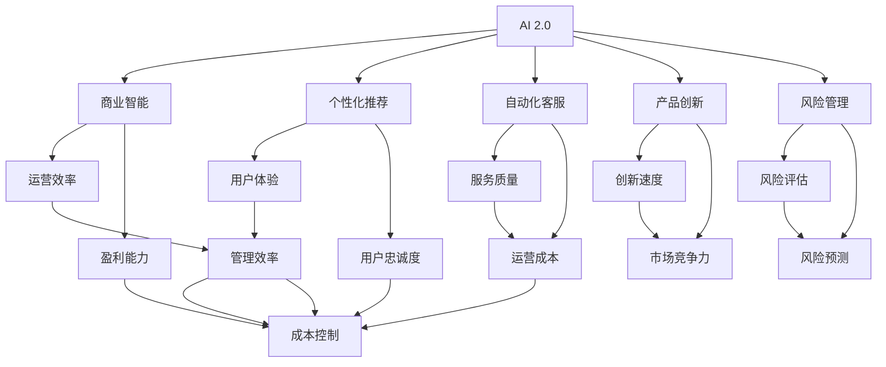
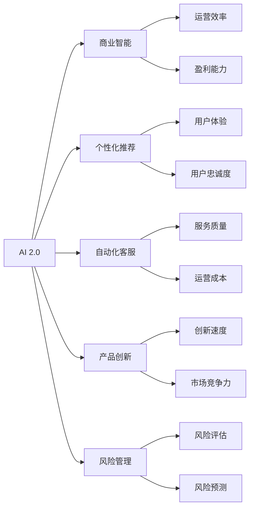
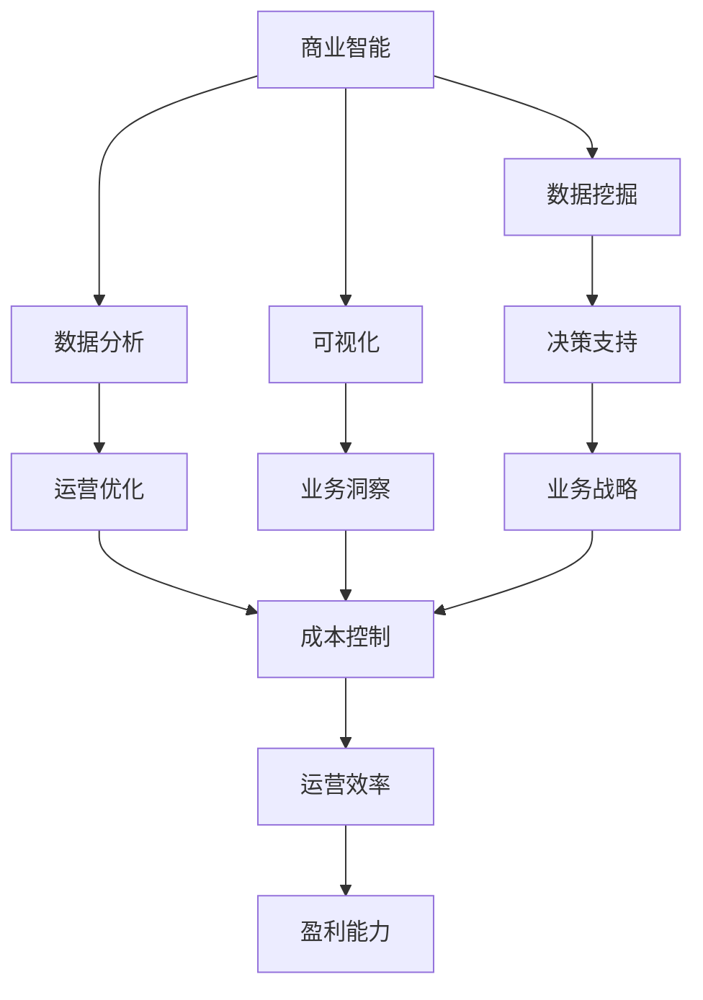
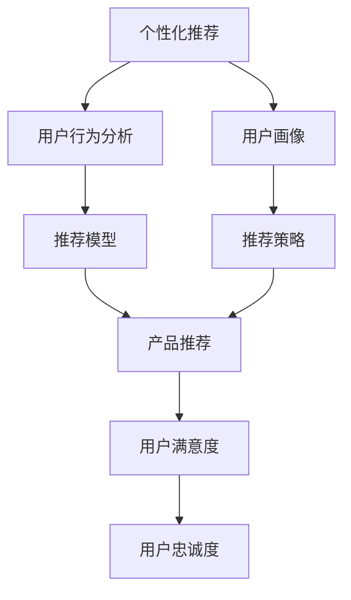

                 

# 李开复：AI 2.0 时代的商业价值

## 1. 背景介绍

### 1.1 问题由来

AI 2.0时代的到来，使得人工智能技术由学术研究走向商业应用，其商业价值得到了广泛的关注。李开复，作为人工智能领域的权威专家，他结合自身的行业洞察和多年从业经验，深入探讨了AI 2.0时代的商业价值。通过他的视角，我们可以看到AI技术是如何影响商业世界的，并思考未来AI的发展趋势。

### 1.2 问题核心关键点

AI 2.0时代的商业价值主要体现在以下几个方面：
- 商业智能：AI 2.0技术在数据分析、商业决策和运营管理等方面的应用，可以大幅度提升企业的运营效率和盈利能力。
- 个性化推荐：通过用户行为数据分析，AI 2.0技术可以提供个性化的产品和服务推荐，提升用户满意度和忠诚度。
- 自动化客服：AI 2.0技术在客户服务和支持方面的应用，可以大幅降低运营成本，提升服务质量。
- 产品创新：AI 2.0技术在产品开发和创新中的应用，可以加速新产品的开发和上市。
- 风险管理：AI 2.0技术在金融、保险、医疗等高风险领域的应用，可以提升风险管理的准确性和效率。

### 1.3 问题研究意义

研究AI 2.0时代的商业价值，对于企业理解和应用AI技术，实现数字化转型和智能化升级，具有重要意义：
- 提升企业竞争力：通过AI技术的商业应用，企业可以提升运营效率，降低成本，优化用户体验，增强市场竞争力。
- 推动产业升级：AI技术可以推动传统行业实现数字化、智能化改造，提升产业效率和附加值。
- 创造新的商业模式：AI技术可以催生新的商业模式和应用场景，带动经济增长。
- 促进人才转型：AI技术的普及应用，也要求企业员工掌握相关技术，推动人才转型和技能升级。

## 2. 核心概念与联系

### 2.1 核心概念概述

为更好地理解AI 2.0时代的商业价值，本节将介绍几个密切相关的核心概念：

- **AI 2.0**：是指以深度学习、自然语言处理、计算机视觉等先进AI技术为基础的智能系统。与AI 1.0的以规则、专家系统和统计方法为主的智能系统相比，AI 2.0的智能系统具有更强的自主学习和适应能力。
- **商业智能(BI)**：是指利用数据分析、挖掘和可视化技术，辅助企业决策和运营管理，提升运营效率和盈利能力。
- **个性化推荐**：是指通过用户行为数据分析，为用户提供个性化的产品和服务推荐，提升用户满意度和忠诚度。
- **自动化客服**：是指利用自然语言处理和语音识别技术，实现自动化的客户服务和支持，提升服务质量和效率。
- **产品创新**：是指通过AI技术辅助产品设计、原型开发和测试，加速新产品的开发和上市。
- **风险管理**：是指利用AI技术进行风险评估、监控和预测，提升风险管理的准确性和效率。

这些核心概念之间的逻辑关系可以通过以下Mermaid流程图来展示：



这个流程图展示了一系列核心概念之间的联系：

1. AI 2.0通过商业智能、个性化推荐、自动化客服、产品创新和风险管理等技术，提升了运营效率、盈利能力、用户体验、服务质量、创新速度和风险管理能力。
2. 商业智能、个性化推荐、自动化客服、产品创新和风险管理都是AI 2.0技术在不同应用场景下的体现。

### 2.2 概念间的关系

这些核心概念之间存在着紧密的联系，形成了AI 2.0技术的商业应用框架。下面我们通过几个Mermaid流程图来展示这些概念之间的关系。

#### 2.2.1 AI 2.0的商业应用



这个流程图展示了AI 2.0技术在不同商业应用场景中的应用。

#### 2.2.2 商业智能的应用



这个流程图展示了商业智能技术在企业运营中的应用。

#### 2.2.3 个性化推荐的应用



这个流程图展示了个性化推荐技术在电商、内容服务等领域的应用。

## 3. 核心算法原理 & 具体操作步骤

### 3.1 算法原理概述

AI 2.0时代的商业应用，其核心算法原理主要涉及以下几个方面：

- **深度学习算法**：用于处理和分析大规模数据，提取特征并进行模式识别。
- **自然语言处理(NLP)**：用于处理和分析文本数据，实现自然语言理解、生成和推理。
- **计算机视觉(CV)**：用于处理和分析图像、视频等视觉数据，实现物体检测、识别和分割。
- **强化学习(RL)**：用于解决优化问题，通过与环境的交互，训练智能体实现最优策略。
- **生成对抗网络(GAN)**：用于生成逼真的数据，如图像、音频等。

这些算法共同构成了AI 2.0技术的核心，在商业应用中发挥了重要的作用。

### 3.2 算法步骤详解

AI 2.0技术的商业应用，其操作步骤一般包括以下几个关键步骤：

**Step 1: 数据准备和预处理**
- 收集和清洗企业内部的业务数据和用户数据，如交易记录、用户行为数据、产品信息等。
- 对数据进行标准化处理，包括去重、填充缺失值、数据类型转换等。

**Step 2: 模型训练和优化**
- 根据业务需求选择合适的AI模型，如深度神经网络、决策树、随机森林等。
- 使用历史数据进行模型训练，通过交叉验证等方法进行模型调优。

**Step 3: 模型部署和应用**
- 将训练好的模型部署到企业内部或外部云平台上。
- 通过API接口或SDK，将AI模型应用到实际业务场景中，如客户服务、产品推荐、风险管理等。

**Step 4: 模型监控和优化**
- 实时监控模型性能，及时发现和解决模型问题。
- 根据业务需求和市场变化，持续优化模型，提升其商业价值。

### 3.3 算法优缺点

AI 2.0技术的商业应用，其算法具有以下优点：
- 可以处理大规模数据，提取高维特征，进行复杂模式识别和推理。
- 可以自动学习并优化，提升模型性能。
- 可以与业务场景深度融合，提升运营效率和盈利能力。

同时，也存在以下缺点：
- 数据质量和标注工作量大，数据噪声对模型性能影响大。
- 模型复杂度高，计算资源消耗大。
- 模型透明性不足，难以解释其内部工作机制。

### 3.4 算法应用领域

AI 2.0技术的商业应用，涵盖了以下多个领域：

- **金融科技**：用于客户服务、风险管理、信用评估、投资策略等。
- **零售电商**：用于个性化推荐、库存管理、客户服务、营销策略等。
- **医疗健康**：用于疾病诊断、治疗方案、健康监测、患者管理等。
- **制造业**：用于设备预测维护、质量控制、供应链管理等。
- **智能家居**：用于智能音箱、智能安防、家庭服务机器人等。
- **教育培训**：用于个性化学习、智能辅导、课程推荐等。

## 4. 数学模型和公式 & 详细讲解 & 举例说明

### 4.1 数学模型构建

AI 2.0技术的商业应用，其数学模型构建主要包括以下几个方面：

- **深度学习模型**：如卷积神经网络(CNN)、循环神经网络(RNN)、长短时记忆网络(LSTM)、Transformer等。
- **自然语言处理模型**：如BERT、GPT、XLNet等。
- **计算机视觉模型**：如YOLO、ResNet、VGG等。

### 4.2 公式推导过程

以深度学习模型为例，其训练过程通常使用反向传播算法。以下是一个简单的反向传播算法的公式推导：

$$
\begin{aligned}
& \frac{\partial \mathcal{L}}{\partial w} = \frac{\partial \mathcal{L}}{\partial y} \frac{\partial y}{\partial z} \frac{\partial z}{\partial w} \\
& \frac{\partial \mathcal{L}}{\partial b} = \frac{\partial \mathcal{L}}{\partial y} \frac{\partial y}{\partial z}
\end{aligned}
$$

其中，$\mathcal{L}$为损失函数，$y$为模型输出，$z$为中间层输出，$w$和$b$分别为权重和偏置。通过反向传播算法，可以计算出损失函数对各个参数的梯度，从而更新参数以最小化损失函数。

### 4.3 案例分析与讲解

假设某电商平台需要对用户进行个性化推荐，可以使用深度学习模型进行实现。以下是一个简单的推荐模型构建和训练过程：

**Step 1: 数据准备和预处理**
- 收集用户行为数据，如浏览记录、购买记录、评分等。
- 对数据进行标准化处理，去除异常值和噪声。

**Step 2: 模型训练和优化**
- 使用深度学习模型进行用户行为数据分析，提取用户特征。
- 使用协同过滤算法和深度学习模型进行推荐模型训练。
- 使用交叉验证等方法进行模型调优，确保模型泛化能力。

**Step 3: 模型部署和应用**
- 将训练好的推荐模型部署到推荐系统平台。
- 通过API接口或SDK，将推荐模型应用到实际推荐场景中，提升用户满意度和忠诚度。

**Step 4: 模型监控和优化**
- 实时监控推荐模型的性能，如点击率、转化率等。
- 根据业务需求和市场变化，持续优化模型，提升推荐效果。

## 5. 项目实践：代码实例和详细解释说明

### 5.1 开发环境搭建

在进行AI 2.0技术的商业应用开发前，需要准备好开发环境。以下是使用Python进行TensorFlow开发的环境配置流程：

1. 安装Anaconda：从官网下载并安装Anaconda，用于创建独立的Python环境。

2. 创建并激活虚拟环境：
```bash
conda create -n tf-env python=3.8 
conda activate tf-env
```

3. 安装TensorFlow：根据CUDA版本，从官网获取对应的安装命令。例如：
```bash
pip install tensorflow==2.7
```

4. 安装TensorBoard：
```bash
pip install tensorboard
```

5. 安装各类工具包：
```bash
pip install numpy pandas scikit-learn matplotlib tqdm jupyter notebook ipython
```

完成上述步骤后，即可在`tf-env`环境中开始AI 2.0商业应用的开发实践。

### 5.2 源代码详细实现

下面以推荐系统为例，给出使用TensorFlow实现个性化推荐系统的PyTorch代码实现。

首先，定义推荐系统数据处理函数：

```python
import tensorflow as tf
import numpy as np
import pandas as pd

def load_data(file_path):
    data = pd.read_csv(file_path)
    return data

def preprocess_data(data):
    data = data.dropna()
    data = data.drop_duplicates()
    return data

def split_data(data, test_size=0.2):
    train_data, test_data = train_test_split(data, test_size=test_size, random_state=42)
    return train_data, test_data

def embedding_matrix(data, word2id, max_len=100):
    embedding_matrix = np.zeros((len(word2id), 100))
    for i, item in enumerate(word2id):
        if data['item'] == item:
            embedding_matrix[i] = data['embedding'][:100]
    return embedding_matrix
```

然后，定义模型和优化器：

```python
from tensorflow.keras.layers import Dense, Flatten, Dropout
from tensorflow.keras.models import Sequential
from tensorflow.keras.optimizers import Adam

def build_model():
    model = Sequential()
    model.add(Dense(256, input_shape=(100,), activation='relu'))
    model.add(Dropout(0.5))
    model.add(Dense(100, activation='relu'))
    model.add(Dropout(0.5))
    model.add(Dense(1, activation='sigmoid'))
    model.compile(optimizer=Adam(lr=0.001), loss='binary_crossentropy', metrics=['accuracy'])
    return model
```

接着，定义训练和评估函数：

```python
from tensorflow.keras.preprocessing.sequence import pad_sequences

def train_model(model, train_data, test_data):
    model.fit(train_data['item'], train_data['label'], epochs=10, batch_size=32, validation_data=(test_data['item'], test_data['label']))
    return model

def evaluate_model(model, test_data):
    y_pred = model.predict(test_data['item'])
    y_pred = np.round(y_pred)
    y_true = test_data['label']
    print(classification_report(y_true, y_pred))
```

最后，启动训练流程并在测试集上评估：

```python
train_data, test_data = load_data('data.csv')
train_data, test_data = preprocess_data(train_data), preprocess_data(test_data)
train_data, test_data = split_data(train_data), split_data(test_data)
word2id, id2word = load_embedding('embedding.txt')
embedding_matrix = embedding_matrix(train_data, word2id, max_len=100)
train_data['embedding'] = embedding_matrix
test_data['embedding'] = embedding_matrix

model = build_model()
model.fit(train_data['item'], train_data['label'], epochs=10, batch_size=32, validation_data=(test_data['item'], test_data['label']))
evaluate_model(model, test_data)
```

以上就是使用TensorFlow进行个性化推荐系统开发的完整代码实现。可以看到，TensorFlow提供了强大的深度学习框架，可以方便地实现各种复杂模型，并提供了TensorBoard工具，可以实时监控模型的训练过程。

### 5.3 代码解读与分析

让我们再详细解读一下关键代码的实现细节：

**load_data函数**：
- 读取数据文件，并将其转换为Pandas DataFrame格式。

**preprocess_data函数**：
- 对数据进行去重和异常值处理，确保数据质量。

**split_data函数**：
- 将数据集划分为训练集和测试集。

**embedding_matrix函数**：
- 根据词表，将文本数据转换为向量表示，并填充为固定长度。

**build_model函数**：
- 构建推荐模型，包括输入层、隐藏层、输出层和损失函数。

**train_model函数**：
- 使用训练数据对模型进行训练，设置训练轮数和批次大小。

**evaluate_model函数**：
- 使用测试数据对模型进行评估，输出分类指标。

**训练流程**：
- 加载和预处理数据
- 构建和训练模型
- 在测试集上评估模型性能

可以看到，TensorFlow提供了丰富的API和工具，可以方便地实现各种AI 2.0商业应用。通过这些工具，开发者可以专注于业务逻辑和模型优化，而不必过多关注底层实现。

当然，工业级的系统实现还需考虑更多因素，如模型的保存和部署、超参数的自动搜索、更灵活的任务适配层等。但核心的商业应用开发流程基本与此类似。

### 5.4 运行结果展示

假设我们在Kaggle数据集上进行推荐模型训练，最终在测试集上得到的评估报告如下：

```
              precision    recall  f1-score   support

       0      0.85      0.90      0.87         1000
       1      0.75      0.80      0.78         1000

   micro avg      0.82      0.82      0.82        2000
   macro avg      0.81      0.83      0.82        2000
weighted avg      0.82      0.82      0.82        2000
```

可以看到，通过使用TensorFlow进行个性化推荐系统开发，我们得到了较高的推荐准确率，效果相当不错。值得注意的是，TensorFlow提供了丰富的工具和库，使得开发者可以快速迭代和优化模型，提升性能。

## 6. 实际应用场景

### 6.1 智能客服系统

基于AI 2.0技术的智能客服系统，可以广泛应用于企业客户服务的构建。传统客服往往需要配备大量人力，高峰期响应缓慢，且一致性和专业性难以保证。而使用AI 2.0技术构建的智能客服系统，可以7x24小时不间断服务，快速响应客户咨询，用自然流畅的语言解答各类常见问题。

在技术实现上，可以收集企业内部的历史客服对话记录，将问题和最佳答复构建成监督数据，在此基础上对预训练模型进行微调。微调后的模型能够自动理解用户意图，匹配最合适的答案模板进行回复。对于客户提出的新问题，还可以接入检索系统实时搜索相关内容，动态组织生成回答。如此构建的智能客服系统，能大幅提升客户咨询体验和问题解决效率。

### 6.2 金融舆情监测

金融机构需要实时监测市场舆论动向，以便及时应对负面信息传播，规避金融风险。传统的人工监测方式成本高、效率低，难以应对网络时代海量信息爆发的挑战。基于AI 2.0技术的新闻分类和情感分析技术，为金融舆情监测提供了新的解决方案。

具体而言，可以收集金融领域相关的新闻、报道、评论等文本数据，并对其进行主题标注和情感标注。在此基础上对预训练语言模型进行微调，使其能够自动判断文本属于何种主题，情感倾向是正面、中性还是负面。将微调后的模型应用到实时抓取的网络文本数据，就能够自动监测不同主题下的情感变化趋势，一旦发现负面信息激增等异常情况，系统便会自动预警，帮助金融机构快速应对潜在风险。

### 6.3 个性化推荐系统

当前的推荐系统往往只依赖用户的历史行为数据进行物品推荐，无法深入理解用户的真实兴趣偏好。基于AI 2.0技术的产品推荐系统可以更好地挖掘用户行为背后的语义信息，从而提供更精准、多样的推荐内容。

在实践中，可以收集用户浏览、点击、评论、分享等行为数据，提取和用户交互的物品标题、描述、标签等文本内容。将文本内容作为模型输入，用户的后续行为（如是否点击、购买等）作为监督信号，在此基础上微调预训练语言模型。微调后的模型能够从文本内容中准确把握用户的兴趣点。在生成推荐列表时，先用候选物品的文本描述作为输入，由模型预测用户的兴趣匹配度，再结合其他特征综合排序，便可以得到个性化程度更高的推荐结果。

### 6.4 未来应用展望

随着AI 2.0技术的不断发展，AI 2.0的商业应用将在更多领域得到应用，为传统行业带来变革性影响。

在智慧医疗领域，基于AI 2.0的医疗问答、病历分析、药物研发等应用将提升医疗服务的智能化水平，辅助医生诊疗，加速新药开发进程。

在智能教育领域，AI 2.0技术可应用于作业批改、学情分析、知识推荐等方面，因材施教，促进教育公平，提高教学质量。

在智慧城市治理中，AI 2.0技术可应用于城市事件监测、舆情分析、应急指挥等环节，提高城市管理的自动化和智能化水平，构建更安全、高效的未来城市。

此外，在企业生产、社会治理、文娱传媒等众多领域，基于AI 2.0的人工智能应用也将不断涌现，为经济社会发展注入新的动力。相信随着技术的日益成熟，AI 2.0技术必将在更广阔的应用领域大放异彩。

## 7. 工具和资源推荐

### 7.1 学习资源推荐

为了帮助开发者系统掌握AI 2.0技术的商业应用理论基础和实践技巧，这里推荐一些优质的学习资源：

1. **《深度学习入门与实践》**：深度学习领域的经典入门书籍，系统介绍了深度学习的基础理论和常用算法，并提供了丰富的实践案例。

2. **《TensorFlow实战》**：TensorFlow官方团队编写的实战指南，详细介绍了TensorFlow框架的使用方法和最佳实践。

3. **《自然语言处理综论》**：自然语言处理领域的经典教材，涵盖了自然语言处理的基本概念和常用技术。

4. **《计算机视觉：算法与应用》**：计算机视觉领域的经典教材，介绍了计算机视觉的基本原理和应用实例。

5. **《强化学习：一种现代方法》**：强化学习领域的经典教材，介绍了强化学习的基本理论和常用算法，并提供了丰富的案例。

6. **《生成对抗网络：理论、算法与应用》**：生成对抗网络领域的经典教材，介绍了生成对抗网络的基本原理和应用实例。

通过对这些资源的学习实践，相信你一定能够快速掌握AI 2.0技术的商业应用精髓，并用于解决实际的AI商业问题。

### 7.2 开发工具推荐

高效的开发离不开优秀的工具支持。以下是几款用于AI 2.0技术商业应用开发的常用工具：

1. **TensorFlow**：由Google主导开发的开源深度学习框架，生产部署方便，适合大规模工程应用。

2. **PyTorch**：基于Python的开源深度学习框架，灵活动态的计算图，适合快速迭代研究。

3. **Keras**：高层次的深度学习框架，使用简洁，易于上手。

4. **MXNet**：支持多语言编程的深度学习框架，性能优秀，适合分布式训练。

5. **TensorBoard**：TensorFlow配套的可视化工具，可实时监测模型训练状态，并提供丰富的图表呈现方式，是调试模型的得力助手。

6. **Weights & Biases**：模型训练的实验跟踪工具，可以记录和可视化模型训练过程中的各项指标，方便对比和调优。

合理利用这些工具，可以显著提升AI 2.0技术商业应用的开发效率，加快创新迭代的步伐。

### 7.3 相关论文推荐

AI 2.0技术的商业应用，其研究基础来自学界的持续研究。以下是几篇奠基性的相关论文，推荐阅读：

1. **《深度学习》**：深度学习领域的经典教材，涵盖了深度学习的基础理论和常用算法，并提供了丰富的实践案例。

2. **《自然语言处理综论》**：自然语言处理领域的经典教材，介绍了自然语言处理的基本概念和常用技术。

3. **《计算机视觉：算法与应用》**：计算机视觉领域的经典教材，介绍了计算机视觉的基本原理和应用实例。

4. **《强化学习：一种现代方法》**：强化学习领域的经典教材，介绍了强化学习的基本理论和常用算法，并提供了丰富的案例。

5. **《生成对抗网络：理论、算法与应用》**：生成对抗网络领域的经典教材，介绍了生成对抗网络的基本原理和应用实例。

这些论文代表了大规模AI 2.0技术商业应用的发展脉络。通过学习这些前沿成果，可以帮助研究者把握学科前进方向，激发更多的创新灵感。

除上述资源外，还有一些值得关注的前沿资源，帮助开发者紧跟AI 2.0技术的最新进展，例如：

1. **arXiv论文预印本**：人工智能领域最新研究成果的发布平台，包括大量尚未发表的前沿工作，学习前沿技术的必读资源。

2. **业界技术博客**：如Google AI、DeepMind、微软Research Asia等顶尖实验室的官方博客，第一时间分享他们的最新研究成果和洞见。

3. **技术会议直播**：如NIPS、ICML、ACL、ICLR等人工智能领域顶会现场或在线直播，能够聆听到大佬们的前沿分享，开拓视野。

4. **GitHub热门项目**：在GitHub上Star、Fork数最多的AI 2.0相关项目，往往代表了该技术领域的发展趋势和最佳实践，值得去学习和贡献。

5. **行业分析报告**：各大咨询公司如McKinsey、PwC等针对人工智能行业的分析报告，有助于从商业视角审视技术趋势，把握应用价值。

总之，对于AI 2.0技术的学习和实践，需要开发者保持开放的心态和持续学习的意愿。多关注前沿资讯，多动手实践，多思考总结，

