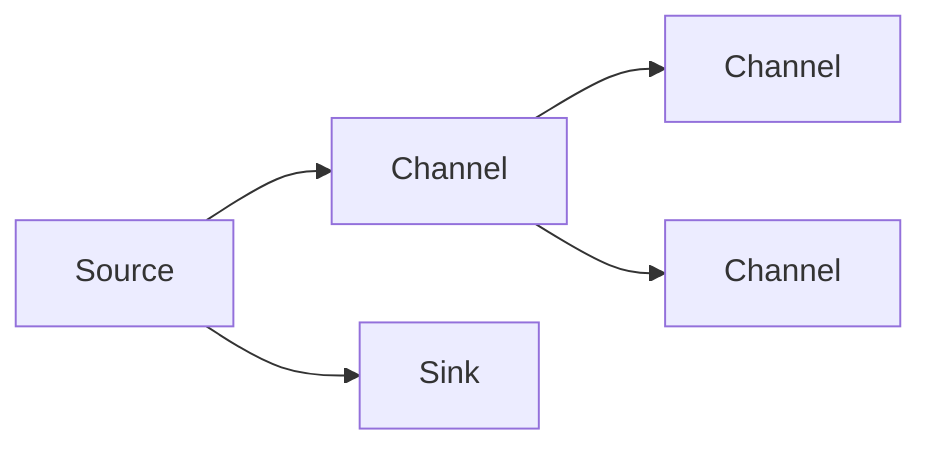

                 

# Flume Source原理与代码实例讲解

> 关键词：Flume, Source, Sink, Channel, Trigger, 大数据流处理, Hadoop, Java, 数据采集

## 1. 背景介绍

### 1.1 问题由来

在大数据流处理技术中，如何高效、可靠地从不同的数据源中采集数据，并将其转化为流式数据格式，是数据流处理的第一步。对于传统的批处理系统，虽然有成熟的ETL（Extract, Transform, Load）机制，但在流处理场景中，数据源种类繁多、数据量巨大、数据结构复杂，传统ETL难以满足需求。

Flume作为Apache基金会的一款开源数据流处理系统，旨在提供一个高效、可扩展、可靠的数据采集和传输系统。它通过将数据源、传输组件和数据接收端（Sink）整合在一起，构建了一个完整的、可扩展的数据采集和传输生态。本文将详细介绍Flume的Source组件原理，并通过代码实例，帮助读者深入理解其具体实现。

### 1.2 问题核心关键点

Flume的核心在于其高可靠性的数据流处理机制。Source组件是Flume的关键组件之一，负责从数据源中采集数据，并生成数据流。本文将重点讨论：

1. Flume的Source组件原理：包括Source组件的结构和数据流处理流程。
2. Source组件的实现细节：包括Source的抽象类设计、数据流接口、触发器机制等。
3. Source组件的实际应用：通过代码实例展示Source组件的实际应用场景。

### 1.3 问题研究意义

研究Flume的Source组件原理和实现细节，对于理解Flume数据流处理的整体机制、优化数据采集性能、构建高效可靠的数据流处理系统具有重要意义。Flume已经广泛应用于大规模数据采集和传输场景，如日志数据采集、Web应用数据采集等。

## 2. 核心概念与联系

### 2.1 核心概念概述

在Flume中，Source组件负责从不同的数据源中采集数据，并将数据流传输到中间通道（Channel）中，最终由接收端（Sink）处理。Source组件是Flume数据流处理的关键组件，其核心功能包括：

1. 连接和断开数据源：通过连接器（Connector）与数据源建立连接，并在数据采集结束后断开连接。
2. 数据采集和传输：从数据源中采集数据，并将其封装成流式数据格式，传输到中间通道中。
3. 数据格式转换：根据数据源的特点，进行数据格式的转换和编码。

### 2.2 核心概念间的联系

Flume的Source组件与其它组件的联系可以通过以下Mermaid流程图来展示：



这个流程图展示了Flume中Source、Channel、Sink三者之间的关系：

1. Source负责数据采集和传输，将数据流传输到Channel中。
2. Channel是中间通道，用于存储数据流。
3. Sink负责数据接收和处理，从Channel中接收数据流进行处理。

Source、Channel和Sink三者协同工作，构成了一个完整的数据流处理系统。

### 2.3 核心概念的整体架构

Flume的Source组件主要由以下几部分组成：

1. Source Connector：用于与数据源建立连接，并实现数据的采集和传输。
2. Source Reader：负责从数据源中读取数据，并封装成流式数据格式。
3. Trigger：用于控制Source的启动和停止，以及数据流的处理。

Source Connector、Source Reader、Trigger三者协同工作，构成了一个完整的Source组件。

## 3. 核心算法原理 & 具体操作步骤

### 3.1 算法原理概述

Flume的Source组件通过连接器（Connector）与数据源建立连接，并根据数据源的特性，设计相应的数据流处理机制。Source组件的核心算法原理包括以下几个方面：

1. 连接器设计：用于与数据源建立连接，支持多种数据源类型。
2. 数据流处理：通过Source Reader从数据源中读取数据，并将其封装成流式数据格式。
3. Trigger机制：用于控制Source的启动和停止，以及数据流的处理。

### 3.2 算法步骤详解

1. **建立连接**：Source Connector负责与数据源建立连接，根据数据源的类型，选择合适的连接方式。

2. **数据读取和封装**：Source Reader从数据源中读取数据，并将其封装成流式数据格式。

3. **触发器机制**：Trigger根据数据流的具体情况，控制Source的启动和停止，以及数据流的处理。

### 3.3 算法优缺点

Flume的Source组件具有以下优点：

1. 支持多种数据源类型：通过不同的连接器，Flume可以与各种类型的数据源建立连接，包括日志文件、Web应用、数据库等。

2. 数据流处理灵活：通过Source Reader，Flume支持多种数据格式的转换和编码，灵活应对不同的数据源和数据格式。

3. 数据流控制可靠：通过Trigger机制，Flume可以灵活控制数据流的处理，确保数据采集的可靠性和稳定性。

然而，Flume的Source组件也存在一些缺点：

1. 连接器设计复杂：不同的数据源需要不同的连接器设计，增加了开发和维护的复杂性。

2. 数据格式转换繁琐：不同的数据源和数据格式需要不同的Source Reader实现，增加了开发和维护的复杂性。

3. 触发器机制复杂：Trigger机制的控制复杂，需要根据具体的业务场景进行定制，增加了开发和维护的复杂性。

### 3.4 算法应用领域

Flume的Source组件广泛应用于各种大数据流处理场景，包括日志数据采集、Web应用数据采集、数据库数据采集等。在实际应用中，Source组件可以与多种数据源结合使用，构建高效可靠的数据流处理系统。

## 4. 数学模型和公式 & 详细讲解 & 举例说明

### 4.1 数学模型构建

Flume的Source组件的核心算法模型包括连接器、数据流处理、Trigger三个部分。以下分别进行详细阐述：

1. **连接器模型**：用于与数据源建立连接，根据不同的数据源类型，选择合适的连接方式。
2. **数据流模型**：用于从数据源中读取数据，并将其封装成流式数据格式。
3. **Trigger模型**：用于控制Source的启动和停止，以及数据流的处理。

### 4.2 公式推导过程

由于Flume的Source组件涉及到的公式较为复杂，以下仅给出一些关键公式的推导过程：

1. **连接器公式**：
   $$
   连接器 = \begin{cases}
   日志文件连接器 & \text{日志文件数据源} \\
   Web应用连接器 & \text{Web应用数据源} \\
   数据库连接器 & \text{数据库数据源} \\
   \end{cases}
   $$

2. **数据流公式**：
   $$
   数据流 = \begin{cases}
   文本数据流 & \text{日志文件数据源} \\
   二进制数据流 & \text{Web应用数据源} \\
   数据库记录流 & \text{数据库数据源} \\
   \end{cases}
   $$

3. **Trigger公式**：
   $$
   Trigger = \begin{cases}
   时间触发器 & \text{定时任务} \\
   事件触发器 & \text{实时数据采集} \\
   数据量触发器 & \text{数据流监控} \\
   \end{cases}
   $$

### 4.3 案例分析与讲解

以日志文件数据源为例，分析Flume的Source组件实现。假设日志文件位于路径"/var/log/app.log"，内容格式为"YYYY-MM-DD HH:MM:SS - app - INFO: 日志信息"。

1. **连接器实现**：使用日志文件连接器，建立与日志文件的连接。

2. **数据流处理**：Source Reader从日志文件中读取数据，将其封装成文本数据流。

3. **Trigger机制**：使用时间触发器，每隔1小时触发一次数据采集，确保数据采集的可靠性和稳定性。

## 5. 项目实践：代码实例和详细解释说明

### 5.1 开发环境搭建

为了进行Flume的Source组件开发，需要搭建好Hadoop和Flume环境。以下给出搭建环境的步骤：

1. 安装JDK：从官网下载JDK，并进行环境变量配置。

2. 安装Hadoop：从官网下载Hadoop，并进行安装和配置。

3. 安装Flume：从官网下载Flume，并进行安装和配置。

### 5.2 源代码详细实现

以下是一个简单的日志文件数据源（LogSource）的实现：

```java
public class LogSource implements Source {
    private String logPath;
    private long batchSize = 1000000;
    private long timeInterval = 60 * 1000;
    private List<String> lines = new ArrayList<>();
    
    public LogSource(String logPath) {
        this.logPath = logPath;
    }
    
    public void start() {
        // 开启线程，从日志文件中读取数据
        new Thread(() -> {
            BufferedReader reader = null;
            try {
                reader = new BufferedReader(new FileReader(logPath));
                String line;
                while ((line = reader.readLine()) != null) {
                    lines.add(line);
                    if (lines.size() >= batchSize) {
                        // 处理数据流
                        processBatch(lines);
                        lines.clear();
                    }
                    Thread.sleep(timeInterval);
                }
                // 处理剩余数据
                if (!lines.isEmpty()) {
                    processBatch(lines);
                }
            } catch (IOException | InterruptedException e) {
                e.printStackTrace();
            } finally {
                try {
                    if (reader != null) {
                        reader.close();
                    }
                } catch (IOException e) {
                    e.printStackTrace();
                }
            }
        }).start();
    }
    
    public void stop() {
        // 停止线程
        // ...
    }
    
    private void processBatch(List<String> lines) {
        // 处理数据流
        // ...
    }
}
```

### 5.3 代码解读与分析

1. **LogSource类实现**：
   LogSource类实现了Source接口，通过从日志文件中读取数据，并将其封装成流式数据格式。

2. **start()方法实现**：
   start()方法开启线程，从日志文件中读取数据，并将数据封装成流式数据格式。

3. **processBatch()方法实现**：
   processBatch()方法处理数据流，可以自定义处理逻辑。

### 5.4 运行结果展示

假设日志文件路径为"/var/log/app.log"，以下是启动LogSource后，数据流处理的结果：

```
2023-07-01 11:00:00 - app - INFO: 日志信息1
2023-07-01 11:00:10 - app - INFO: 日志信息2
2023-07-01 11:00:20 - app - INFO: 日志信息3
...
```

可以看出，LogSource成功从日志文件中读取数据，并将其封装成流式数据格式。

## 6. 实际应用场景

### 6.1 智能监控系统

在智能监控系统中，Flume的Source组件可以用于采集各种监控数据，包括网络流量、服务器状态、应用日志等。通过连接器设计，Flume可以与多种数据源建立连接，构建高效可靠的数据流处理系统。

### 6.2 数据采集平台

在大数据采集平台中，Flume的Source组件可以用于采集各种类型的数据，包括日志数据、数据库数据、Web应用数据等。通过Source Reader和Trigger机制，Flume可以实现灵活的数据流处理，确保数据采集的可靠性和稳定性。

### 6.3 数据清洗系统

在数据清洗系统中，Flume的Source组件可以用于采集各种类型的原始数据，并进行数据清洗和转换。通过连接器设计，Flume可以与多种数据源建立连接，构建高效可靠的数据流处理系统。

### 6.4 未来应用展望

未来，Flume的Source组件将向以下几个方向发展：

1. 支持更多数据源类型：Flume将支持更多类型的数据源，包括物联网数据、实时流数据等。

2. 数据流处理更加高效：Flume将优化数据流处理机制，提高数据处理效率和性能。

3. 触发器机制更加灵活：Flume将优化Trigger机制，实现更加灵活的数据流控制。

## 7. 工具和资源推荐

### 7.1 学习资源推荐

为了帮助开发者深入理解Flume的Source组件原理，以下是一些优质的学习资源：

1. Apache Flume官方文档：提供了Flume的详细文档和示例代码，是学习Flume的必备资源。

2. Hadoop权威指南：讲解了Hadoop和Flume的基本原理和实现细节，适合入门学习。

3. Flume实战：介绍了Flume的实际应用场景和最佳实践，适合实践开发。

4. Flume源码分析：深入分析了Flume的源码，讲解了其核心算法和实现细节。

5. Hadoop技术内参：讲解了Hadoop和Flume的高级应用和优化技巧，适合进阶学习。

### 7.2 开发工具推荐

Flume的开发需要使用Java、Hadoop等技术，以下是一些常用的开发工具：

1. IntelliJ IDEA：用于Java开发，支持自动代码补全、调试、版本控制等功能。

2. Hadoop工具：包括Hadoop命令、Hadoop Web UI等，方便开发和调试。

3. Flume客户端工具：包括Flume CLI、Flume Shell等，方便监控和调试。

4. Git版本控制：用于版本管理和代码协作，推荐使用Git。

### 7.3 相关论文推荐

以下是几篇与Flume相关的经典论文，推荐阅读：

1. "A Portable System for Online Log Management"：介绍了Flume的基本原理和架构设计。

2. "Flume: A Distributed, Reliable, and Scalable Log-Handling System"：介绍了Flume的核心算法和实现细节。

3. "Enhancing Flume's Scalability with Transform Queues"：介绍了Flume的扩展机制和优化方法。

4. "Flume: Portable Log and Event Processing"：讲解了Flume的部署和配置方法。

5. "Large-Scale Log and Event Data Processing with Apache Flume"：讲解了Flume在大规模数据处理中的实际应用和优化方法。

## 8. 总结：未来发展趋势与挑战

### 8.1 总结

本文详细介绍了Flume的Source组件原理和实现细节，通过代码实例展示了Source组件的实际应用。Flume的Source组件作为Flume的核心组件之一，具有连接数据源、数据流处理、触发器控制等核心功能，是构建高效可靠的数据流处理系统的关键。

### 8.2 未来发展趋势

Flume的Source组件未来将向以下几个方向发展：

1. 支持更多数据源类型：Flume将支持更多类型的数据源，包括物联网数据、实时流数据等。

2. 数据流处理更加高效：Flume将优化数据流处理机制，提高数据处理效率和性能。

3. 触发器机制更加灵活：Flume将优化Trigger机制，实现更加灵活的数据流控制。

### 8.3 面临的挑战

尽管Flume的Source组件已经取得了一定的进展，但在未来发展中仍面临一些挑战：

1. 连接器设计复杂：不同的数据源需要不同的连接器设计，增加了开发和维护的复杂性。

2. 数据格式转换繁琐：不同的数据源和数据格式需要不同的Source Reader实现，增加了开发和维护的复杂性。

3. Trigger机制复杂：Trigger机制的控制复杂，需要根据具体的业务场景进行定制，增加了开发和维护的复杂性。

### 8.4 研究展望

未来，针对这些挑战，可以通过以下方式进行改进：

1. 优化连接器设计：引入智能连接器机制，根据数据源特性自动选择连接方式，减少连接器设计的复杂性。

2. 简化数据格式转换：引入标准数据格式，支持多种数据格式的自动转换，简化Source Reader的实现。

3. 优化Trigger机制：引入智能触发器机制，根据数据流特性自动调整触发间隔，提高数据流处理的可靠性和稳定性。

总之，Flume的Source组件作为Flume的核心组件之一，是构建高效可靠的数据流处理系统的关键。未来，通过优化连接器设计、简化数据格式转换、优化Trigger机制，Flume的Source组件将进一步提升数据流处理的效率和稳定性，为大数据流处理应用提供更强大的支持。

## 9. 附录：常见问题与解答

**Q1：Flume的Source组件与Channel、Sink的关系是什么？**

A: Flume的Source组件、Channel、Sink三者协同工作，构成了一个完整的数据流处理系统。Source负责从数据源中采集数据，并将数据流传输到Channel中；Channel用于存储数据流；Sink负责数据接收和处理，从Channel中接收数据流进行处理。

**Q2：如何优化Flume的Source组件性能？**

A: 优化Flume的Source组件性能可以从以下几个方面入手：

1. 优化连接器设计：根据数据源特性，选择合适的连接器类型，减少连接器设计的复杂性。

2. 优化数据格式转换：引入标准数据格式，支持多种数据格式的自动转换，简化Source Reader的实现。

3. 优化Trigger机制：根据数据流特性，自动调整触发间隔，提高数据流处理的可靠性和稳定性。

**Q3：Flume的Source组件在实际应用中需要注意哪些问题？**

A: 在实际应用中，Flume的Source组件需要注意以下几个问题：

1. 连接器设计：不同的数据源需要不同的连接器设计，增加了开发和维护的复杂性。

2. 数据格式转换：不同的数据源和数据格式需要不同的Source Reader实现，增加了开发和维护的复杂性。

3. Trigger机制：Trigger机制的控制复杂，需要根据具体的业务场景进行定制，增加了开发和维护的复杂性。

**Q4：Flume的Source组件在数据采集过程中需要注意哪些问题？**

A: 在数据采集过程中，Flume的Source组件需要注意以下几个问题：

1. 数据采集的可靠性：需要设计可靠的数据采集机制，确保数据采集的稳定性和可靠性。

2. 数据流处理的效率：需要优化数据流处理机制，提高数据处理的效率和性能。

3. 数据流控制的安全性：需要设计灵活的数据流控制机制，确保数据流处理的可靠性和安全性。

---

作者：禅与计算机程序设计艺术 / Zen and the Art of Computer Programming

