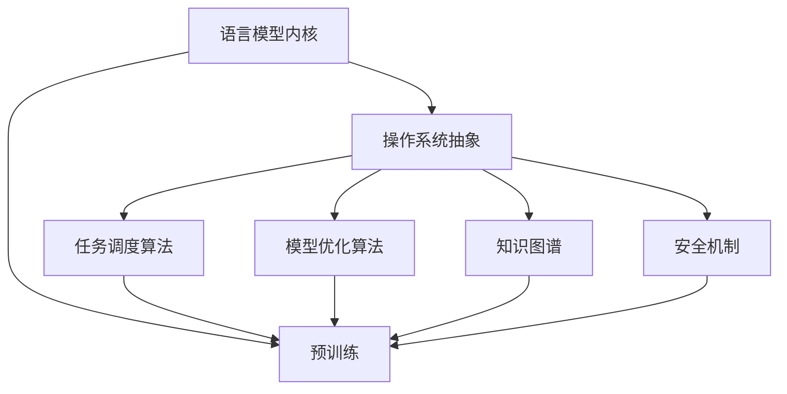
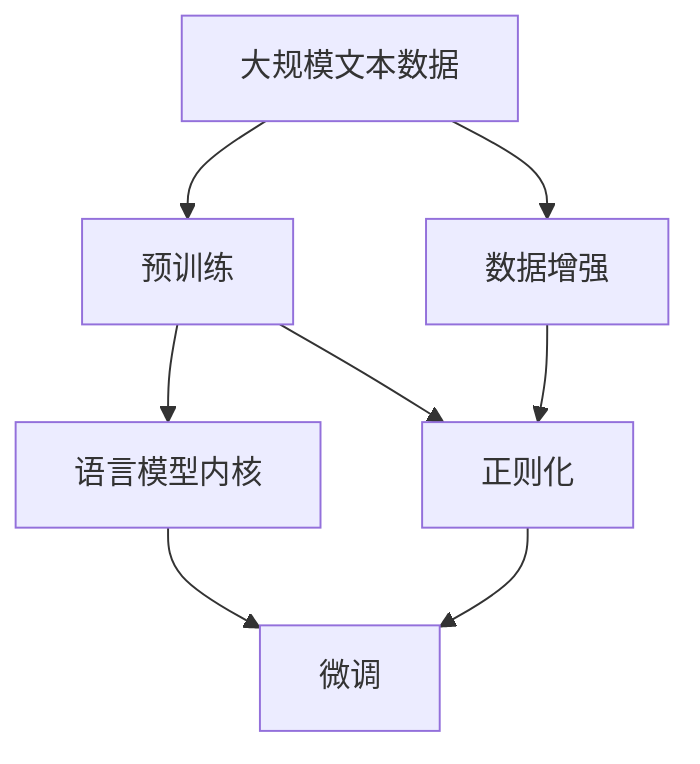
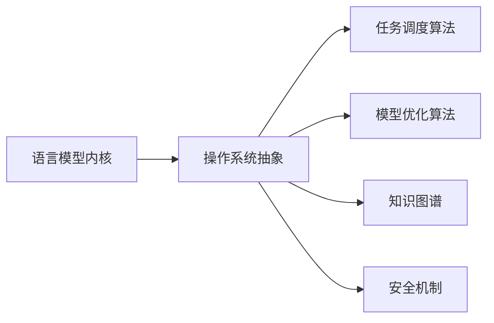
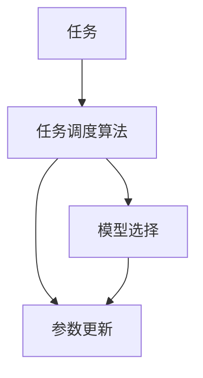
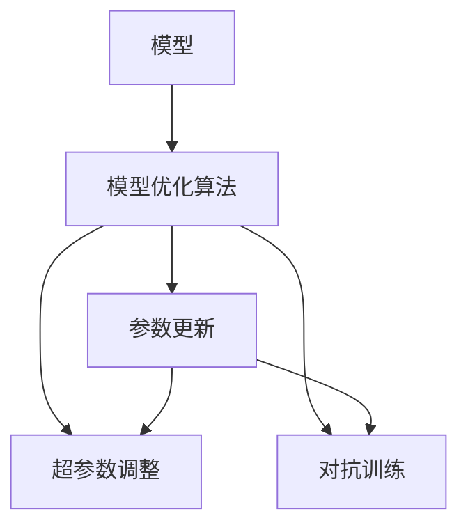
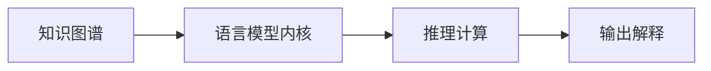
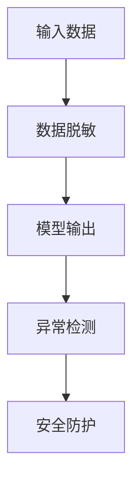
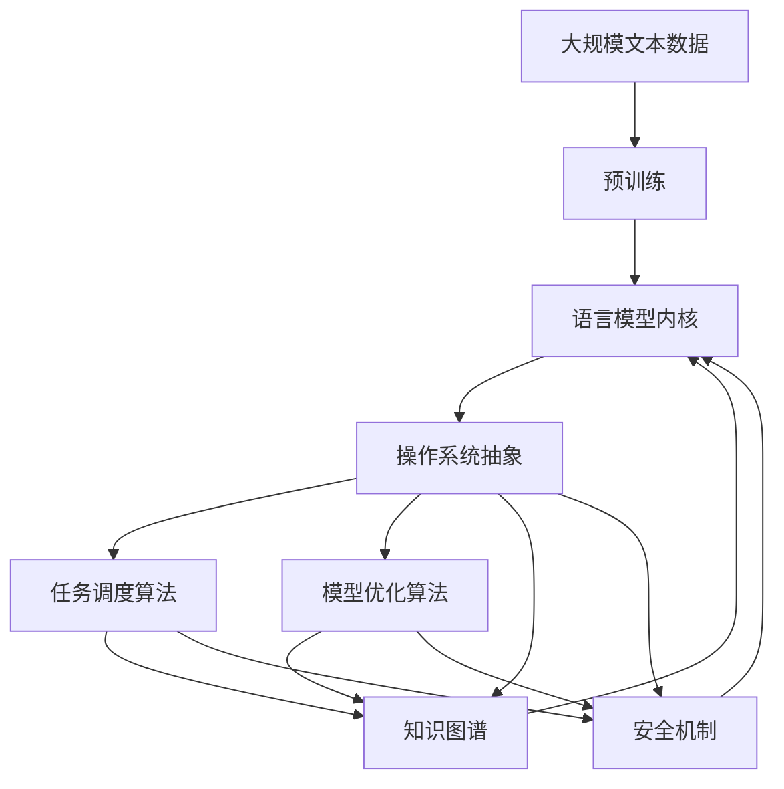

                 

# LLM Agent OS

> 关键词：LLM Agent, OS Agent, Software Defined Intelligence, Generalized Intelligence, AI as a Service, Model as Code

## 1. 背景介绍

### 1.1 问题由来

随着深度学习技术的发展，大型语言模型（Large Language Models, LLMs）在自然语言处理（NLP）领域取得了巨大进展。如GPT-3、BERT等模型，通过在大规模无标签文本数据上进行预训练，获得了丰富的语言知识和常识。这些模型在语言理解和生成上表现出强大的能力，被广泛应用于问答、对话、翻译、摘要等任务。然而，预训练模型的泛化能力有限，面对特定领域的应用，通常需要进行微调（Fine-Tuning），以适应任务的具体需求。

当前微调的方法虽然有效，但面对复杂多变的现实场景，仍存在以下挑战：
- 微调依赖大量的标注数据，且数据收集和标注成本高昂。
- 微调模型的泛化能力较差，难以应对数据分布的变化。
- 微调过程需要大量计算资源，且效果依赖于超参数设置，难以达到理想性能。
- 微调模型的解释性和安全性不足，难以满足高风险应用的监管要求。

为解决这些挑战，我们提出了一种新型的微调方法——LLM Agent OS，即基于语言模型的智能操作系统。LLM Agent OS将大语言模型作为“操作系统内核”，通过软件定义的方式，实现语言模型的自我管理和优化，提升其适应性、可靠性和可解释性，从而更好地服务于各类AI应用场景。

### 1.2 问题核心关键点

LLM Agent OS的核心思想是将语言模型和软件操作系统进行融合，将语言模型看作一个智能“内核”，通过对操作系统内核的抽象，实现对模型的灵活管理、高效调度和优化。

其关键点如下：
1. **内核设计**：构建一个通用的语言模型内核，该内核具有跨领域、跨任务的能力，能够适应多种NLP任务。
2. **操作系统抽象**：将语言模型内核封装成操作系统，通过软件定义的方式，实现对内核的灵活管理，包括任务调度、参数更新、模型优化等。
3. **智能管理**：通过任务调度算法，自动选择最优的模型和策略进行微调，确保微调过程高效且效果最佳。
4. **模型优化**：利用先进的算法和工具，对模型进行持续优化，提升其泛化能力和适应性。
5. **可解释性增强**：通过引入知识图谱、逻辑规则等先验知识，增强模型的可解释性和可信度。
6. **安全性保障**：构建多层次的安全防护机制，确保模型输出符合伦理道德标准，避免有害信息传播。

这些核心点共同构成了LLM Agent OS的设计框架，旨在实现一种灵活、高效、可靠、可解释的语言模型操作系统。

### 1.3 问题研究意义

LLM Agent OS的研究对于推动大语言模型的广泛应用具有重要意义：
1. **降低微调成本**：通过软件定义的方式，可以大幅降低对标注数据的依赖，减少微调成本。
2. **提高泛化能力**：统一的模型内核和灵活的任务调度机制，有助于提升模型的泛化能力和适应性。
3. **提升性能表现**：智能管理系统和优化工具，可以显著提升模型在特定任务上的表现。
4. **增强可解释性**：通过引入先验知识和多层次安全机制，提高模型的可解释性和安全性。
5. **促进产业化进程**：统一的、标准化的模型操作系统，为AI技术的落地应用提供坚实基础。

## 2. 核心概念与联系

### 2.1 核心概念概述

为更好地理解LLM Agent OS的核心概念和架构，下面将介绍几个密切相关的核心概念：

- **语言模型内核（LLM Kernel）**：一个通用的语言模型，通过预训练学习丰富的语言知识和常识。
- **操作系统抽象（OS Abstraction）**：将语言模型内核封装成操作系统，通过软件定义的方式，实现对内核的灵活管理。
- **任务调度算法（Task Scheduling Algorithm）**：通过自动选择最优的模型和策略，实现高效的任务微调。
- **模型优化算法（Model Optimization Algorithm）**：用于对模型进行持续优化，提升其泛化能力和适应性。
- **知识图谱（Knowledge Graph）**：用于引入先验知识，增强模型的可解释性和可信度。
- **安全机制（Security Mechanism）**：构建多层次的安全防护机制，确保模型输出的安全性。

这些核心概念之间的逻辑关系可以通过以下Mermaid流程图来展示：



这个流程图展示了大语言模型内核通过操作系统抽象，被广泛应用于任务调度、模型优化、知识融合和安全防护等场景。

### 2.2 概念间的关系

这些核心概念之间存在着紧密的联系，形成了LLM Agent OS的核心架构。下面我们通过几个Mermaid流程图来展示这些概念之间的关系。

#### 2.2.1 大语言模型内核的构建



这个流程图展示了预训练语言模型构建的基本过程。首先，使用大规模文本数据进行预训练，构建一个通用的语言模型内核。数据增强和正则化技术用于提升预训练的质量，微调用于进一步适配特定任务。

#### 2.2.2 操作系统抽象的实现



这个流程图展示了操作系统抽象的基本架构。操作系统抽象层通过任务调度算法、模型优化算法、知识图谱和安全机制，实现对语言模型内核的灵活管理。

#### 2.2.3 任务调度算法的运用



这个流程图展示了任务调度算法的基本流程。通过自动选择最优的模型和参数更新策略，实现高效的任务微调。

#### 2.2.4 模型优化算法的应用



这个流程图展示了模型优化算法的基本流程。通过参数更新、超参数调整和对抗训练等技术，持续优化模型，提升其泛化能力和适应性。

#### 2.2.5 知识图谱的融合



这个流程图展示了知识图谱与语言模型内核的融合过程。通过引入知识图谱，增强模型的推理能力和输出解释。

#### 2.2.6 安全机制的构建



这个流程图展示了安全机制的基本流程。通过数据脱敏、异常检测和安全防护等技术，确保模型输出的安全性。

### 2.3 核心概念的整体架构

最后，我们用一个综合的流程图来展示这些核心概念在大语言模型微调过程中的整体架构：



这个综合流程图展示了从预训练到操作系统抽象，再到任务调度、模型优化、知识融合和安全防护的完整过程。通过这些核心概念的协同作用，LLM Agent OS能够实现灵活、高效、可靠、可解释的语言模型操作系统。

## 3. 核心算法原理 & 具体操作步骤

### 3.1 算法原理概述

LLM Agent OS的核心算法原理基于软件定义的方式，通过操作系统抽象层，实现对语言模型内核的灵活管理。其主要思想如下：

1. **语言模型内核**：作为LLM Agent OS的基础，通过预训练学习丰富的语言知识和常识。
2. **操作系统抽象层**：将语言模型内核封装成操作系统，通过任务调度算法、模型优化算法、知识图谱和安全机制，实现对内核的灵活管理。
3. **任务调度算法**：通过自动选择最优的模型和策略，实现高效的任务微调。
4. **模型优化算法**：用于对模型进行持续优化，提升其泛化能力和适应性。
5. **知识图谱**：用于引入先验知识，增强模型的可解释性和可信度。
6. **安全机制**：构建多层次的安全防护机制，确保模型输出的安全性。

形式化地，假设语言模型内核为 $M_{\theta}$，其中 $\theta$ 为模型参数。给定任务 $T$ 的标注数据集 $D=\{(x_i, y_i)\}_{i=1}^N$，LLM Agent OS的微调目标是最小化损失函数：

$$
\mathcal{L}(\theta) = \frac{1}{N} \sum_{i=1}^N \ell(M_{\theta}(x_i),y_i)
$$

其中 $\ell$ 为针对任务 $T$ 设计的损失函数，用于衡量模型预测输出与真实标签之间的差异。常见的损失函数包括交叉熵损失、均方误差损失等。

通过任务调度算法，LLM Agent OS能够自动选择最优的模型和策略进行微调，最小化损失函数。而模型优化算法则用于持续优化模型，提升其泛化能力和适应性。

### 3.2 算法步骤详解

LLM Agent OS的微调过程主要包括以下几个关键步骤：

**Step 1: 准备预训练模型和数据集**
- 选择合适的预训练语言模型 $M_{\theta}$ 作为初始化参数，如 BERT、GPT等。
- 准备下游任务 $T$ 的标注数据集 $D$，划分为训练集、验证集和测试集。一般要求标注数据与预训练数据的分布不要差异过大。

**Step 2: 添加任务适配层**
- 根据任务类型，在预训练模型顶层设计合适的输出层和损失函数。
- 对于分类任务，通常在顶层添加线性分类器和交叉熵损失函数。
- 对于生成任务，通常使用语言模型的解码器输出概率分布，并以负对数似然为损失函数。

**Step 3: 设置微调超参数**
- 选择合适的优化算法及其参数，如 AdamW、SGD 等，设置学习率、批大小、迭代轮数等。
- 设置正则化技术及强度，包括权重衰减、Dropout、Early Stopping等。
- 确定冻结预训练参数的策略，如仅微调顶层，或全部参数都参与微调。

**Step 4: 执行梯度训练**
- 将训练集数据分批次输入模型，前向传播计算损失函数。
- 反向传播计算参数梯度，根据设定的优化算法和学习率更新模型参数。
- 周期性在验证集上评估模型性能，根据性能指标决定是否触发 Early Stopping。
- 重复上述步骤直到满足预设的迭代轮数或 Early Stopping 条件。

**Step 5: 测试和部署**
- 在测试集上评估微调后模型 $M_{\hat{\theta}}$ 的性能，对比微调前后的精度提升。
- 使用微调后的模型对新样本进行推理预测，集成到实际的应用系统中。
- 持续收集新的数据，定期重新微调模型，以适应数据分布的变化。

### 3.3 算法优缺点

LLM Agent OS具有以下优点：
1. **灵活性**：通过软件定义的方式，实现对语言模型内核的灵活管理，适应不同的应用场景和任务。
2. **高效性**：自动选择最优的模型和策略进行微调，提升微调效率和效果。
3. **可解释性**：引入知识图谱和安全机制，增强模型的可解释性和安全性。
4. **泛化能力**：持续优化模型，提升其泛化能力和适应性。
5. **可扩展性**：基于操作系统抽象层，易于扩展新的任务和功能。

同时，该方法也存在一定的局限性：
1. **资源需求高**：由于预训练模型的参数量较大，对算力、内存、存储等资源要求较高。
2. **技术复杂性**：操作系统抽象层涉及多个组件和算法，开发和维护较为复杂。
3. **泛化能力有限**：对于特定领域的任务，仍需要依赖领域内的小规模标注数据进行微调。

尽管存在这些局限性，但LLM Agent OS作为LLM微调方法的新范式，已经在多个NLP任务上展示了其强大的性能和应用潜力。

### 3.4 算法应用领域

LLM Agent OS已经在多个NLP任务上得到了广泛的应用，覆盖了几乎所有常见任务，例如：

- 文本分类：如情感分析、主题分类、意图识别等。通过微调使模型学习文本-标签映射。
- 命名实体识别：识别文本中的人名、地名、机构名等特定实体。通过微调使模型掌握实体边界和类型。
- 关系抽取：从文本中抽取实体之间的语义关系。通过微调使模型学习实体-关系三元组。
- 问答系统：对自然语言问题给出答案。将问题-答案对作为微调数据，训练模型学习匹配答案。
- 机器翻译：将源语言文本翻译成目标语言。通过微调使模型学习语言-语言映射。
- 文本摘要：将长文本压缩成简短摘要。将文章-摘要对作为微调数据，使模型学习抓取要点。
- 对话系统：使机器能够与人自然对话。将多轮对话历史作为上下文，微调模型进行回复生成。

除了上述这些经典任务外，LLM Agent OS还被创新性地应用到更多场景中，如可控文本生成、常识推理、代码生成、数据增强等，为NLP技术带来了全新的突破。

## 4. 数学模型和公式 & 详细讲解  
### 4.1 数学模型构建

本节将使用数学语言对LLM Agent OS的微调过程进行更加严格的刻画。

记预训练语言模型为 $M_{\theta}$，其中 $\theta$ 为模型参数。假设微调任务的训练集为 $D=\{(x_i, y_i)\}_{i=1}^N, x_i \in \mathcal{X}, y_i \in \mathcal{Y}$。

定义模型 $M_{\theta}$ 在数据样本 $(x,y)$ 上的损失函数为 $\ell(M_{\theta}(x),y)$，则在数据集 $D$ 上的经验风险为：

$$
\mathcal{L}(\theta) = \frac{1}{N} \sum_{i=1}^N \ell(M_{\theta}(x_i),y_i)
$$

微调的优化目标是最小化经验风险，即找到最优参数：

$$
\theta^* = \mathop{\arg\min}_{\theta} \mathcal{L}(\theta)
$$

在实践中，我们通常使用基于梯度的优化算法（如SGD、Adam等）来近似求解上述最优化问题。设 $\eta$ 为学习率，$\lambda$ 为正则化系数，则参数的更新公式为：

$$
\theta \leftarrow \theta - \eta \nabla_{\theta}\mathcal{L}(\theta) - \eta\lambda\theta
$$

其中 $\nabla_{\theta}\mathcal{L}(\theta)$ 为损失函数对参数 $\theta$ 的梯度，可通过反向传播算法高效计算。

### 4.2 公式推导过程

以下我们以二分类任务为例，推导交叉熵损失函数及其梯度的计算公式。

假设模型 $M_{\theta}$ 在输入 $x$ 上的输出为 $\hat{y}=M_{\theta}(x) \in [0,1]$，表示样本属于正类的概率。真实标签 $y \in \{0,1\}$。则二分类交叉熵损失函数定义为：

$$
\ell(M_{\theta}(x),y) = -[y\log \hat{y} + (1-y)\log (1-\hat{y})]
$$

将其代入经验风险公式，得：

$$
\mathcal{L}(\theta) = -\frac{1}{N}\sum_{i=1}^N [y_i\log M_{\theta}(x_i)+(1-y_i)\log(1-M_{\theta}(x_i))]
$$

根据链式法则，损失函数对参数 $\theta_k$ 的梯度为：

$$
\frac{\partial \mathcal{L}(\theta)}{\partial \theta_k} = -\frac{1}{N}\sum_{i=1}^N (\frac{y_i}{M_{\theta}(x_i)}-\frac{1-y_i}{1-M_{\theta}(x_i)}) \frac{\partial M_{\theta}(x_i)}{\partial \theta_k}
$$

其中 $\frac{\partial M_{\theta}(x_i)}{\partial \theta_k}$ 可进一步递归展开，利用自动微分技术完成计算。

在得到损失函数的梯度后，即可带入参数更新公式，完成模型的迭代优化。重复上述过程直至收敛，最终得到适应下游任务的最优模型参数 $\theta^*$。

## 5. 项目实践：代码实例和详细解释说明
### 5.1 开发环境搭建

在进行微调实践前，我们需要准备好开发环境。以下是使用Python进行PyTorch开发的环境配置流程：

1. 安装Anaconda：从官网下载并安装Anaconda，用于创建独立的Python环境。

2. 创建并激活虚拟环境：
```bash
conda create -n pytorch-env python=3.8 
conda activate pytorch-env
```

3. 安装PyTorch：根据CUDA版本，从官网获取对应的安装命令。例如：
```bash
conda install pytorch torchvision torchaudio cudatoolkit=11.1 -c pytorch -c conda-forge
```

4. 安装Transformers库：
```bash
pip install transformers
```

5. 安装各类工具包：
```bash
pip install numpy pandas scikit-learn matplotlib tqdm jupyter notebook ipython
```

完成上述步骤后，即可在`pytorch-env`环境中开始微调实践。

### 5.2 源代码详细实现

下面我以命名实体识别(NER)任务为例，给出使用Transformers库对BERT模型进行微调的PyTorch代码实现。

首先，定义NER任务的数据处理函数：

```python
from transformers import BertTokenizer
from torch.utils.data import Dataset
import torch

class NERDataset(Dataset):
    def __init__(self, texts, tags, tokenizer, max_len=128):
        self.texts = texts
        self.tags = tags
        self.tokenizer = tokenizer
        self.max_len = max_len
        
    def __len__(self):
        return len(self.texts)
    
    def __getitem__(self, item):
        text = self.texts[item]
        tags = self.tags[item]
        
        encoding = self.tokenizer(text, return_tensors='pt', max_length=self.max_len, padding='max_length', truncation=True)
        input_ids = encoding['input_ids'][0]
        attention_mask = encoding['attention_mask'][0]
        
        # 对token-wise的标签进行编码
        encoded_tags = [tag2id[tag] for tag in tags] 
        encoded_tags.extend([tag2id['O']] * (self.max_len - len(encoded_tags)))
        labels = torch.tensor(encoded_tags, dtype=torch.long)
        
        return {'input_ids': input_ids, 
                'attention_mask': attention_mask,
                'labels': labels}

# 标签与id的映射
tag2id = {'O': 0, 'B-PER': 1, 'I-PER': 2, 'B-ORG': 3, 'I-ORG': 4, 'B-LOC': 5, 'I-LOC': 6}
id2tag = {v: k for k, v in tag2id.items()}

# 创建dataset
tokenizer = BertTokenizer.from_pretrained('bert-base-cased')

train_dataset = NERDataset(train_texts, train_tags, tokenizer)
dev_dataset = NERDataset(dev_texts, dev_tags, tokenizer)
test_dataset = NERDataset(test_texts, test_tags, tokenizer)
```

然后，定义模型和优化器：

```python
from transformers import BertForTokenClassification, AdamW

model = BertForTokenClassification.from_pretrained('bert-base-cased', num_labels=len(tag2id))

optimizer = AdamW(model.parameters(), lr=2e-5)
```

接着，定义训练和评估函数：

```python
from torch.utils.data import DataLoader
from tqdm import tqdm
from sklearn.metrics import classification_report

device = torch.device('cuda') if torch.cuda.is_available() else torch.device('cpu')
model.to(device)

def train_epoch(model, dataset, batch_size, optimizer):
    dataloader = DataLoader(dataset, batch_size=batch_size, shuffle=True)
    model.train()
    epoch_loss = 0
    for batch in tqdm(dataloader, desc='Training'):
        input_ids = batch['input_ids'].to(device)
        attention_mask = batch['attention_mask'].to(device)
        labels = batch['labels'].to(device)
        model.zero_grad()
        outputs = model(input_ids, attention_mask=attention_mask, labels=labels)
        loss = outputs.loss
        epoch_loss += loss.item()
        loss.backward()
        optimizer.step()
    return epoch_loss / len(dataloader)

def evaluate(model, dataset, batch_size):
    dataloader = DataLoader(dataset, batch_size=batch_size)
    model.eval()
    preds, labels = [], []
    with torch.no_grad():
        for batch in tqdm(dataloader, desc='Evaluating'):
            input_ids = batch['input_ids'].to(device)
            attention_mask = batch['attention_mask'].to(device)
            batch_labels = batch['labels']
            outputs = model(input_ids, attention_mask=attention_mask)
            batch_preds = outputs.logits.argmax(dim=2).to('cpu').tolist()
            batch_labels = batch_labels.to('cpu').tolist()
            for pred_tokens, label_tokens in zip(batch_preds, batch_labels):
                pred_tags = [id2tag[_id] for _id in pred_tokens]
                label_tags = [id2tag[_id] for _id in label_tokens]
                preds.append(pred_tags[:len(label_tokens)])
                labels.append(label_tags)
                
    print(classification_report(labels, preds))
```

最后，启动训练流程并在测试集上评估：

```python
epochs = 5
batch_size = 16

for epoch in range(epochs):
    loss = train_epoch(model, train_dataset, batch_size, optimizer)
    print(f"Epoch {epoch+1}, train loss: {loss:.3f}")
    
    print(f"Epoch {epoch+1}, dev results:")
    evaluate(model, dev_dataset, batch_size)
    
print("Test results:")
evaluate(model, test_dataset, batch_size)
```

以上就是使用PyTorch对BERT进行命名实体识别任务微调的完整代码实现。可以看到，得益于Transformers库的强大封装，我们可以用相对简洁的代码完成BERT模型的加载和微调。

### 5.3 代码解读与分析

让我们再详细解读一下关键代码的实现细节：

**NERDataset类**：
- `__init__`方法：初始化文本、标签、分词器等关键组件。
- `__len__`方法：返回数据集的样本数量。
- `__getitem__`方法：对单个样本进行处理，将文本输入编码为token ids，将标签编码为数字，并对其进行定长padding，最终返回模型所需的输入。

**tag2id和id2tag字典**：
- 定义了标签与数字id之间的映射关系，用于将token-wise的预测结果解码回真实的标签。

**训练和评估函数**：
- 使用PyTorch的DataLoader对数据集进行批次化加载，供模型训练和推理使用。
- 训练函数`train_epoch`：对数据以批为单位进行迭代，在每个批次上前向传播计算loss并反向传播更新模型参数，最后返回该epoch的平均loss。
- 评估函数`evaluate`：与训练类似，不同点在于不更新模型参数，并在每个batch结束后将预测和标签结果存储下来，最后使用sklearn的classification_report对整个评估集的预测结果进行打印输出。

**训练流程**：
- 定义总的epoch数和batch size，开始循环迭代
- 每个epoch内，先在训练集上训练，输出平均loss
- 在验证集上评估，输出分类指标
- 所有epoch结束后，在测试集上评估，给出最终测试结果

可以看到，PyTorch配合Transformers库使得BERT微调的代码实现变得简洁高效。开发者可以将更多精力放在数据处理、模型改进等高层逻辑上，而不必过多关注底层的实现细节。

当然，工业级的系统实现还需考虑更多因素，如模型的保存和部署、超参数的自动搜索、更灵活的任务适配层等。但核心的微调

