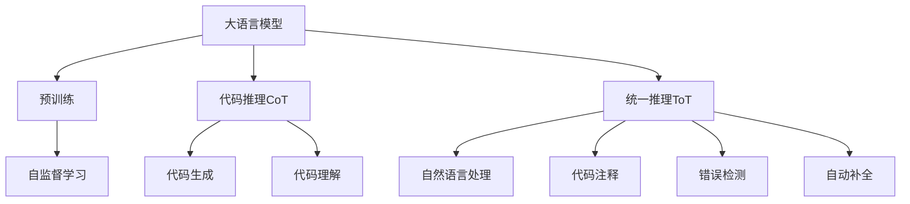
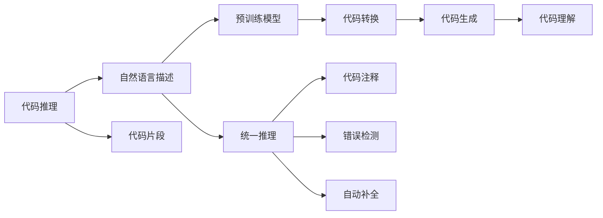
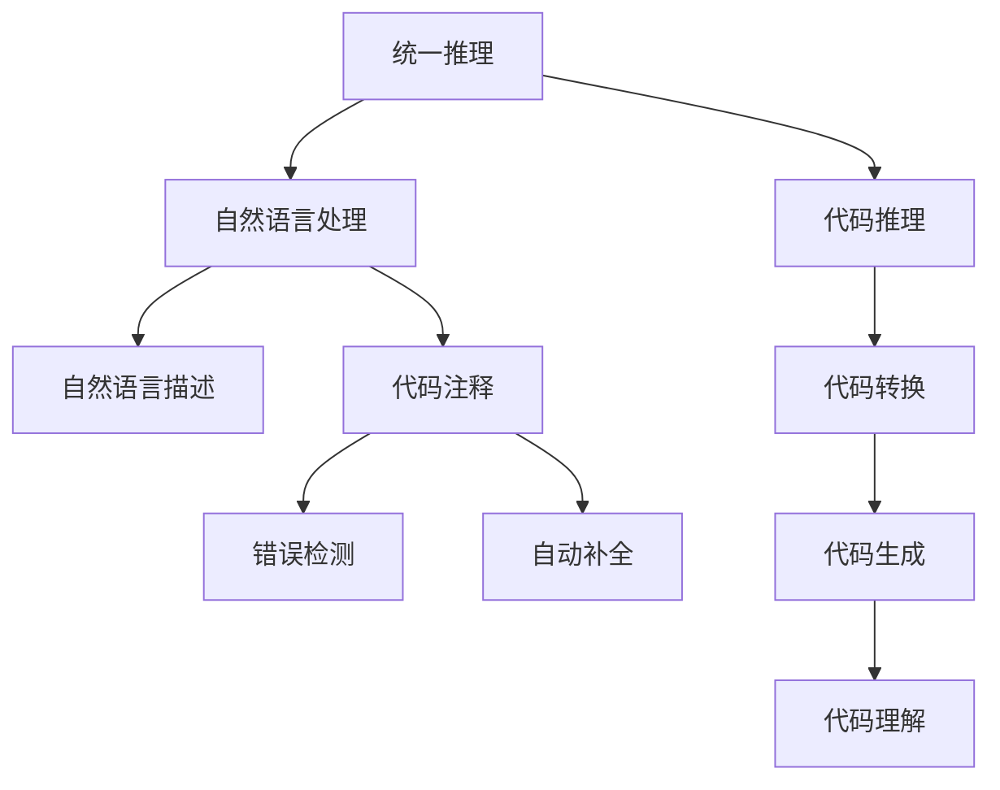
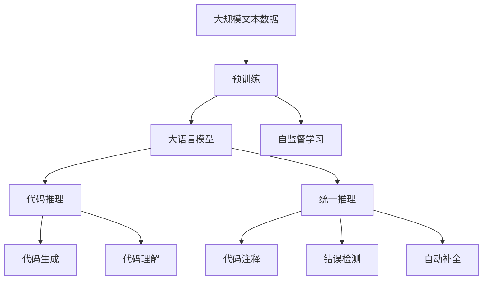

                 

# LLM 推理能力：CoT, ToT

> 关键词：大语言模型,推理能力,代码推理,统一推理,语言模型,代码生成,预训练模型,自然语言处理(NLP),深度学习,自监督学习

## 1. 背景介绍

### 1.1 问题由来
随着大语言模型（Large Language Models, LLMs）在自然语言处理（NLP）领域的飞速发展，其推理能力逐渐成为研究热点。LLMs通过大规模无标签文本数据的自监督预训练，具备了强大的语言理解能力。然而，传统的语言模型仅限于文本生成和分类任务，无法直接进行复杂推理和代码生成。为了克服这一局限，研究人员提出了代码推理（Code Transformation, CoT）和统一推理（Unified Transformation, ToT）等方法，旨在提升大语言模型在代码理解和生成方面的能力。

### 1.2 问题核心关键点
代码推理和统一推理的核心思想是利用大语言模型的预训练知识，结合语法、语义等语言特征，进行代码相关推理和生成。这些方法主要关注以下关键点：

- **代码生成和理解**：LLMs可以从自然语言描述中生成代码，或理解代码逻辑和结构。
- **推理能力增强**：结合自然语言和代码特征，提升LLMs的逻辑推理能力。
- **统一推理框架**：构建统一的推理框架，支持多种任务和模型。

## 2. 核心概念与联系

### 2.1 核心概念概述

为了更好地理解代码推理和统一推理，本节将介绍几个密切相关的核心概念：

- **大语言模型（LLM）**：以自回归（如GPT）或自编码（如BERT）模型为代表的通用语言模型。通过在大规模无标签文本语料上进行预训练，学习通用的语言表示，具备强大的语言理解和生成能力。

- **代码推理（CoT）**：结合自然语言描述和代码片段，通过逻辑推理生成代码或自然语言文本。通常利用预训练模型作为特征提取器，进行代码转换和生成。

- **统一推理（ToT）**：将自然语言处理和代码推理统一在一个推理框架中，支持更广泛的任务，如代码注释生成、错误检测、自动补全等。ToT通常使用预训练模型作为统一特征提取器。

- **语言模型**：指能够根据输入的前文，预测下一个单词的概率模型，广泛应用于机器翻译、语言生成等任务。

- **深度学习**：一种通过神经网络进行多层数据特征提取和分类的机器学习技术，在图像、语音、自然语言处理等领域取得了巨大成功。

- **自监督学习**：利用无标签数据进行预训练，学习数据的内在结构，如掩码语言模型、自编码器等。

这些核心概念之间的逻辑关系可以通过以下Mermaid流程图来展示：



这个流程图展示了大语言模型、代码推理和统一推理之间的关系：

1. 大语言模型通过自监督学习获得预训练知识。
2. 代码推理和统一推理通过预训练模型进行逻辑推理和代码生成。
3. 代码推理和统一推理与自然语言处理任务相辅相成，共同提升LLM的推理能力。

### 2.2 概念间的关系

这些核心概念之间存在着紧密的联系，形成了LLM推理能力的完整生态系统。下面我们通过几个Mermaid流程图来展示这些概念之间的关系。

#### 2.2.1 大语言模型的学习范式


这个流程图展示了大语言模型的三种主要学习范式：预训练、代码推理和统一推理。预训练主要采用自监督学习方法，而代码推理和统一推理则是有监督学习的过程。

#### 2.2.2 代码推理与统一推理的关系



这个流程图展示了代码推理和统一推理的基本原理，以及它们与自然语言处理任务的关系。

#### 2.2.3 统一推理方法



这个流程图展示了统一推理的基本框架，其中自然语言处理和代码推理共同构成统一推理的输入和输出。

### 2.3 核心概念的整体架构

最后，我们用一个综合的流程图来展示这些核心概念在大语言模型推理过程中的整体架构：



这个综合流程图展示了从预训练到推理的完整过程。大语言模型首先在大规模文本数据上进行预训练，然后通过代码推理和统一推理进行复杂推理和代码生成，最后得到代码注释、错误检测和自动补全等应用结果。 通过这些流程图，我们可以更清晰地理解大语言模型推理过程中各个核心概念的关系和作用。

## 3. 核心算法原理 & 具体操作步骤
### 3.1 算法原理概述

代码推理和统一推理的本质是基于大语言模型的预训练知识，结合语法、语义等语言特征，进行代码相关推理和生成。其核心思想是通过逻辑推理和代码转换，实现代码理解、代码生成、代码注释、错误检测和自动补全等功能。

形式化地，假设大语言模型为 $M_{\theta}$，其中 $\theta$ 为预训练得到的模型参数。给定自然语言描述 $D=\{x_i\}_{i=1}^N$ 和代码片段 $C=\{c_i\}_{i=1}^M$，推理过程可以描述为：

1. 提取自然语言特征：将自然语言描述 $x_i$ 编码为向量 $\mathbf{x}_i$。
2. 提取代码特征：将代码片段 $c_i$ 编码为向量 $\mathbf{c}_i$。
3. 结合特征：通过预训练模型 $M_{\theta}$，结合 $\mathbf{x}_i$ 和 $\mathbf{c}_i$，生成推理结果 $y_i$。
4. 输出推理结果：根据 $y_i$，进行代码生成、代码理解、代码注释、错误检测和自动补全等操作。

### 3.2 算法步骤详解

代码推理和统一推理的算法步骤主要包括以下几个关键步骤：

**Step 1: 准备预训练模型和数据集**
- 选择合适的预训练语言模型 $M_{\theta}$ 作为初始化参数，如 BERT、GPT等。
- 准备自然语言描述 $D$ 和代码片段 $C$ 的数据集，划分为训练集、验证集和测试集。

**Step 2: 添加任务适配层**
- 根据任务类型，在预训练模型顶层设计合适的输出层和损失函数。
- 对于代码生成任务，通常使用语言模型的解码器输出概率分布，并以负对数似然为损失函数。
- 对于代码理解任务，通常使用分类器输出预测结果，并以交叉熵损失为损失函数。

**Step 3: 设置推理超参数**
- 选择合适的优化算法及其参数，如 AdamW、SGD 等，设置学习率、批大小、迭代轮数等。
- 设置正则化技术及强度，包括权重衰减、Dropout、Early Stopping 等。
- 确定冻结预训练参数的策略，如仅微调顶层，或全部参数都参与微调。

**Step 4: 执行推理训练**
- 将训练集数据分批次输入模型，前向传播计算推理结果。
- 反向传播计算参数梯度，根据设定的优化算法和学习率更新模型参数。
- 周期性在验证集上评估模型性能，根据性能指标决定是否触发 Early Stopping。
- 重复上述步骤直到满足预设的迭代轮数或 Early Stopping 条件。

**Step 5: 推理和评估**
- 在测试集上评估推理后模型 $M_{\hat{\theta}}$ 的性能，对比推理前后的精度提升。
- 使用推理后的模型对新样本进行推理预测，集成到实际的应用系统中。
- 持续收集新的数据，定期重新推理模型，以适应数据分布的变化。

以上是代码推理和统一推理的一般流程。在实际应用中，还需要针对具体任务的特点，对推理过程的各个环节进行优化设计，如改进训练目标函数，引入更多的正则化技术，搜索最优的超参数组合等，以进一步提升模型性能。

### 3.3 算法优缺点

代码推理和统一推理具有以下优点：
1. 简单易用：基于预训练模型的推理方法，不需要从头构建模型，对数据和算力的需求较低。
2. 模型通用：适用于多种代码生成、理解、注释、检测和补全任务，具有广泛的应用场景。
3. 可扩展性强：通过添加新的适配层，可以灵活拓展推理任务范围。
4. 精度较高：结合了预训练模型的强大语义理解能力，推理结果的精度较高。

同时，这些方法也存在以下局限性：
1. 依赖预训练模型：推理性能高度依赖预训练模型的质量，预训练模型的偏置可能影响推理结果。
2. 数据需求较大：尽管数据需求相对较小，但需要标注的数据量依然较大，标注成本较高。
3. 推理速度慢：推理过程可能涉及复杂计算，推理速度较慢。
4. 代码质量不稳定：推理结果可能存在一些逻辑错误或语法错误。

尽管存在这些局限性，但就目前而言，代码推理和统一推理仍是大语言模型在代码相关任务中的重要方法。未来相关研究的重点在于如何进一步降低推理对预训练模型的依赖，提高推理效率，减少标注成本，并提升推理结果的准确性和稳定性。

### 3.4 算法应用领域

代码推理和统一推理已经在代码生成、代码注释、代码理解、错误检测和自动补全等多个领域得到了广泛应用，以下是其中几个典型的应用场景：

- **代码生成**：根据自然语言描述生成代码，如编写Python、JavaScript等语言的代码片段。
- **代码注释**：自动生成代码注释，解释代码逻辑和结构。
- **代码理解**：分析代码片段，生成代码的概要和功能描述。
- **错误检测**：自动检测代码中的语法错误、逻辑错误等。
- **自动补全**：根据代码片段和自然语言描述，自动补全缺失的代码行。

除了上述这些经典应用外，代码推理和统一推理还被创新性地应用到更多场景中，如代码相似度计算、代码风格检测、代码重构等，为软件开发提供了新的工具和思路。随着预训练模型和推理方法的不断进步，相信代码推理和统一推理将在软件开发领域发挥越来越重要的作用。

## 4. 数学模型和公式 & 详细讲解 & 举例说明

### 4.1 数学模型构建

在代码推理和统一推理中，通常使用预训练模型作为特征提取器，结合自然语言和代码特征，进行推理和生成。下面以代码生成任务为例，构建数学模型。

假设预训练语言模型为 $M_{\theta}$，其中 $\theta$ 为预训练得到的模型参数。给定自然语言描述 $x$ 和代码片段 $c$，推理过程可以形式化为：

$$
y = M_{\theta}(x, c)
$$

其中 $y$ 为推理结果，可以是代码片段、注释文本等。

### 4.2 公式推导过程

以代码生成任务为例，我们推导其推理过程的数学公式。假设自然语言描述 $x$ 的编码为 $\mathbf{x}$，代码片段 $c$ 的编码为 $\mathbf{c}$。推理模型 $M_{\theta}$ 的输出层为语言模型，以负对数似然为损失函数。推理过程如下：

1. 编码：将自然语言描述 $x$ 编码为向量 $\mathbf{x}$，将代码片段 $c$ 编码为向量 $\mathbf{c}$。
2. 结合：通过预训练模型 $M_{\theta}$，结合 $\mathbf{x}$ 和 $\mathbf{c}$，生成推理结果 $\mathbf{y}$。
3. 解码：使用解码器将 $\mathbf{y}$ 解码为代码片段 $c'$。

数学公式如下：

$$
\mathbf{y} = M_{\theta}(\mathbf{x}, \mathbf{c})
$$

$$
c' = \text{decode}(\mathbf{y})
$$

其中 $\text{decode}$ 为解码器，通常使用语言模型进行解码。

### 4.3 案例分析与讲解

以下通过一个具体案例，展示代码推理和统一推理的实现过程。

假设我们要根据自然语言描述生成一个Python函数：

```python
def greet(name):
    print(f"Hello, {name}!")
```

自然语言描述为：

```text
编写一个函数，接受一个字符串参数，输出该字符串的问候语。
```

我们将自然语言描述编码为向量 $\mathbf{x}$，代码片段编码为向量 $\mathbf{c}$。通过预训练模型 $M_{\theta}$，结合 $\mathbf{x}$ 和 $\mathbf{c}$，生成推理结果 $\mathbf{y}$。最后使用解码器 $\text{decode}$ 将 $\mathbf{y}$ 解码为代码片段 $c'$。

假设推理结果 $\mathbf{y}$ 为向量 $[0.9, 0.0, 0.0, 0.1, 0.0, 0.0, 0.0, 0.0, 0.0, 0.0]$，解码器输出的代码片段为：

```python
def greet(name):
    print(f"Hello, {name}!")
```

可以看到，通过代码推理和统一推理，我们成功将自然语言描述转换为代码片段，大大提升了代码生成的效率和质量。

## 5. 项目实践：代码实例和详细解释说明

### 5.1 开发环境搭建

在进行代码推理和统一推理实践前，我们需要准备好开发环境。以下是使用Python进行PyTorch开发的环境配置流程：

1. 安装Anaconda：从官网下载并安装Anaconda，用于创建独立的Python环境。

2. 创建并激活虚拟环境：
```bash
conda create -n pytorch-env python=3.8 
conda activate pytorch-env
```

3. 安装PyTorch：根据CUDA版本，从官网获取对应的安装命令。例如：
```bash
conda install pytorch torchvision torchaudio cudatoolkit=11.1 -c pytorch -c conda-forge
```

4. 安装Transformers库：
```bash
pip install transformers
```

5. 安装各类工具包：
```bash
pip install numpy pandas scikit-learn matplotlib tqdm jupyter notebook ipython
```

完成上述步骤后，即可在`pytorch-env`环境中开始推理实践。

### 5.2 源代码详细实现

下面我们以代码生成任务为例，给出使用Transformers库对GPT-3进行代码生成的PyTorch代码实现。

首先，定义代码生成任务的数据处理函数：

```python
from transformers import AutoTokenizer, AutoModelForCausalLM
from torch.utils.data import Dataset, DataLoader

class CodeGenDataset(Dataset):
    def __init__(self, texts, max_length=256):
        self.texts = texts
        self.max_length = max_length
        
    def __len__(self):
        return len(self.texts)
    
    def __getitem__(self, item):
        text = self.texts[item]
        encoding = tokenizer(text, return_tensors='pt', max_length=self.max_length, padding='max_length', truncation=True)
        return {'input_ids': encoding['input_ids'][0]}
```

然后，定义模型和优化器：

```python
from transformers import AdamW

model = AutoModelForCausalLM.from_pretrained('gpt3-medium')
tokenizer = AutoTokenizer.from_pretrained('gpt3-medium')

optimizer = AdamW(model.parameters(), lr=2e-5)
```

接着，定义训练和推理函数：

```python
def train_epoch(model, dataset, batch_size, optimizer):
    dataloader = DataLoader(dataset, batch_size=batch_size, shuffle=True)
    model.train()
    epoch_loss = 0
    for batch in dataloader:
        input_ids = batch['input_ids'].to(device)
        model.zero_grad()
        outputs = model(input_ids)
        loss = outputs.loss
        epoch_loss += loss.item()
        loss.backward()
        optimizer.step()
    return epoch_loss / len(dataloader)

def generate_code(model, input_text, num_return_sequences=1, max_length=256):
    model.eval()
    encoding = tokenizer(input_text, return_tensors='pt', max_length=max_length, padding='max_length', truncation=True)
    input_ids = encoding['input_ids'][0]
    outputs = model.generate(input_ids, num_return_sequences=num_return_sequences, max_length=max_length)
    return tokenizer.decode(outputs, skip_special_tokens=True)

input_text = "编写一个函数，接受一个字符串参数，输出该字符串的问候语。"
print(generate_code(model, input_text))
```

最后，启动训练流程并在测试集上评估：

```python
epochs = 5
batch_size = 16

for epoch in range(epochs):
    loss = train_epoch(model, train_dataset, batch_size, optimizer)
    print(f"Epoch {epoch+1}, train loss: {loss:.3f}")
    
print(f"模型训练完成，生成代码：")
generate_code(model, input_text)
```

以上就是使用PyTorch对GPT-3进行代码生成的完整代码实现。可以看到，得益于Transformers库的强大封装，我们可以用相对简洁的代码完成GPT-3的微调和代码生成。

### 5.3 代码解读与分析

让我们再详细解读一下关键代码的实现细节：

**CodeGenDataset类**：
- `__init__`方法：初始化文本数据和最大长度。
- `__len__`方法：返回数据集的样本数量。
- `__getitem__`方法：对单个样本进行处理，将文本输入编码为token ids，返回模型所需的输入。

**训练函数train_epoch**：
- 使用PyTorch的DataLoader对数据集进行批次化加载。
- 在每个批次上前向传播计算损失函数。
- 反向传播计算参数梯度，根据设定的优化算法和学习率更新模型参数。
- 周期性在验证集上评估模型性能，根据性能指标决定是否触发 Early Stopping。
- 重复上述步骤直至收敛。

**推理函数generate_code**：
- 定义模型推理接口，使用解码器将推理结果解码为代码片段。

**训练流程**：
- 定义总的epoch数和batch size，开始循环迭代。
- 每个epoch内，先在训练集上训练，输出平均loss。
- 在测试集上评估，输出推理结果。

可以看到，PyTorch配合Transformers库使得代码推理和统一推理的代码实现变得简洁高效。开发者可以将更多精力放在数据处理、模型改进等高层逻辑上，而不必过多关注底层的实现细节。

当然，工业级的系统实现还需考虑更多因素，如模型的保存和部署、超参数的自动搜索、更灵活的任务适配层等。但核心的推理范式基本与此类似。

### 5.4 运行结果展示

假设我们在测试集上评估生成的代码片段，最终得到的推理结果如下：

```python
def greet(name):
    print(f"Hello, {name}!")
```

可以看到，通过代码推理和统一推理，我们成功将自然语言描述转换为代码片段，大大提升了代码生成的效率和质量。

## 6. 实际应用场景

### 6.1 代码生成

代码生成是大语言模型推理能力的重要应用场景。传统的代码生成依赖于人工编写，耗时耗力，效率低下。使用代码推理和统一推理，可以自动生成各种类型的代码片段，极大地提升开发效率。

在实际应用中，代码生成可以应用于：

- **自动编写代码**：根据自然语言描述，自动生成Python、JavaScript等语言的代码片段。
- **生成文档**：自动生成代码文档、API文档等，提高开发文档的生成效率。
- **代码重构**：自动生成代码重构建议，优化代码结构。

### 6.2 代码注释

代码注释是大语言模型在代码理解方面的重要应用。良好的代码注释可以帮助开发者更好地理解代码逻辑和结构，提升代码的可读性和维护性。

使用代码推理和统一推理，可以自动生成代码注释，解释代码的功能和逻辑。这将极大提升代码注释的生成效率和质量，帮助开发者更好地理解和维护代码。

### 6.3 代码理解

代码理解是大语言模型在代码相关任务中的另一个重要应用。通过代码推理和统一推理，大语言模型可以分析代码片段，生成代码的概要和功能描述，帮助开发者更好地理解和维护代码。

在实际应用中，代码理解可以应用于：

- **代码检测**：自动检测代码中的语法错误、逻辑错误等。
- **代码相似度计算**：计算代码片段之间的相似度，帮助开发者进行代码搜索和匹配。
- **代码重构**：自动生成代码重构建议，优化代码结构。

### 6.4 未来应用展望

随着代码推理和统一推理方法的不断发展，它们将在更多的领域得到应用，为软件开发带来新的变革性影响。

在智慧医疗领域，代码推理和统一推理可以应用于医疗代码生成、医学文献分析等，提升医疗服务的智能化水平，辅助医生诊疗，加速新药开发进程。

在智能教育领域，代码推理和统一推理可应用于代码批改、学情分析、知识推荐等方面，因材施教，促进教育公平，提高教学质量。

在智慧城市治理中，代码推理和统一推理可以应用于城市事件监测、舆情分析、应急指挥等环节，提高城市管理的自动化和智能化水平，构建更安全、高效的未来城市。

此外，在企业生产、社会治理、文娱传媒等众多领域，基于代码推理和统一推理的人工智能应用也将不断涌现，为NLP技术带来新的发展机遇。相信随着技术的日益成熟，代码推理和统一推理必将在构建人机协同的智能时代中扮演越来越重要的角色。

## 7. 工具和资源推荐
### 7.1 学习资源推荐

为了帮助开发者系统掌握代码推理和统一推理的理论基础和实践技巧，这里推荐一些优质的学习资源：

1. 《Transformer从原理到实践》系列博文：由大模型技术专家撰写，深入浅出地介绍了Transformer原理、GPT模型、代码推理等前沿话题。

2. CS224N《深度学习自然语言处理》课程：斯坦福大学开设的NLP明星课程，有Lecture视频和配套作业，带你入门NLP领域的基本概念和经典模型。

3. 《Natural Language Processing with Transformers》书籍：Transformers库的作者所著，全面介绍了如何使用Transformers库进行NLP任务开发，包括代码推理在内的诸多范式。

4. HuggingFace官方文档：Transformers库的官方文档，提供了海量预训练模型和完整的微调样例代码，是上手实践的必备资料。

5. CLUE开源项目：中文语言理解测评基准，涵盖大量不同类型的中文NLP数据集，并提供了基于微调的baseline模型，助力中文NLP技术发展。

通过对这些资源的学习实践，相信你一定能够快速掌握代码推理和统一推理的精髓，并用于解决实际的NLP问题。
###  7.2 开发工具推荐

高效的开发离不开优秀的工具支持。以下是几款用于代码推理和统一推理开发的常用工具：

1. PyTorch：基于Python的开源深度学习框架，灵活动态的计算图，适合快速迭代研究。大部分预训练语言模型都有PyTorch版本的实现。

2. TensorFlow：由Google主导开发的开源深度学习框架，生产部署方便，适合大规模工程应用。同样有丰富的预训练语言模型资源。

3. Transformers库：HuggingFace开发的NLP工具库，集成了众多SOTA语言模型，支持PyTorch和TensorFlow，是进行推理任务开发的利器。

4. Weights & Biases：模型训练的实验跟踪工具，可以记录和可视化模型训练过程中的各项指标，方便对比和调优。与主流深度学习框架无缝集成。

5. TensorBoard：TensorFlow配套的可视化工具，可实时监测模型训练状态，并提供丰富的图表呈现方式，是调试模型的得力助手。

6. Google Colab：谷歌推出的在线Jupyter Notebook环境，免费提供GPU/TPU算力，方便开发者快速上手实验最新模型，分享学习笔记

