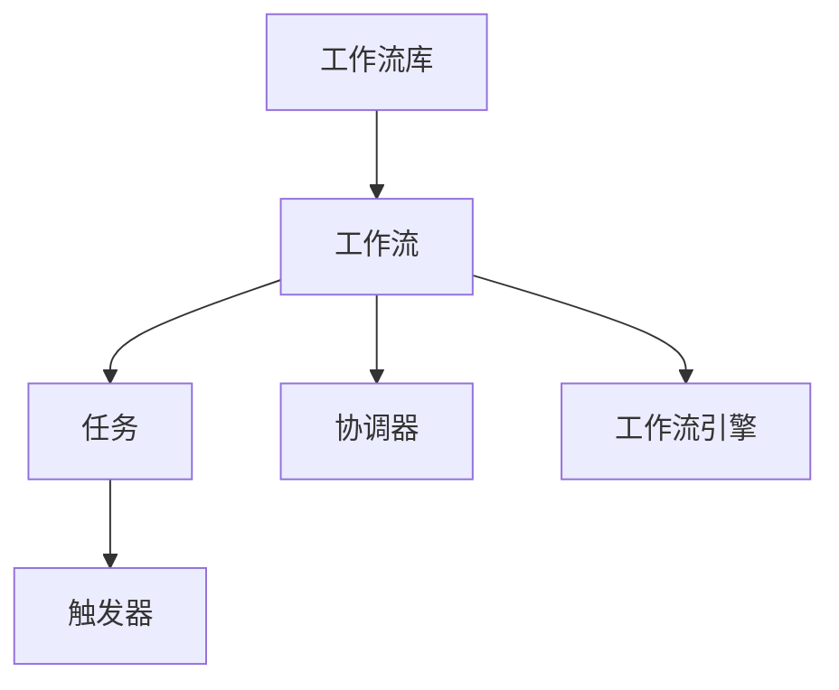
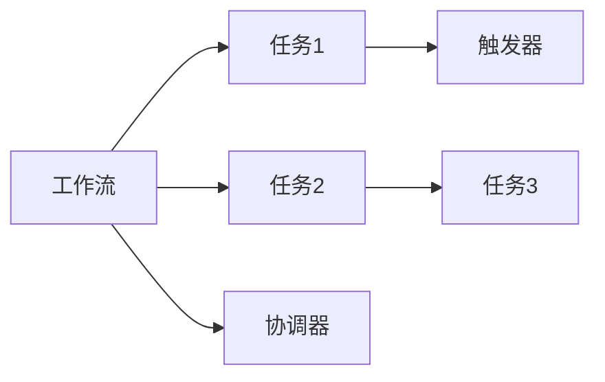
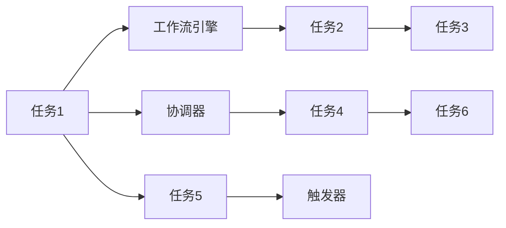
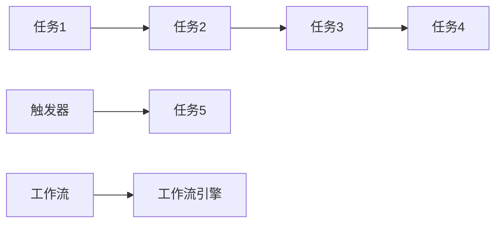
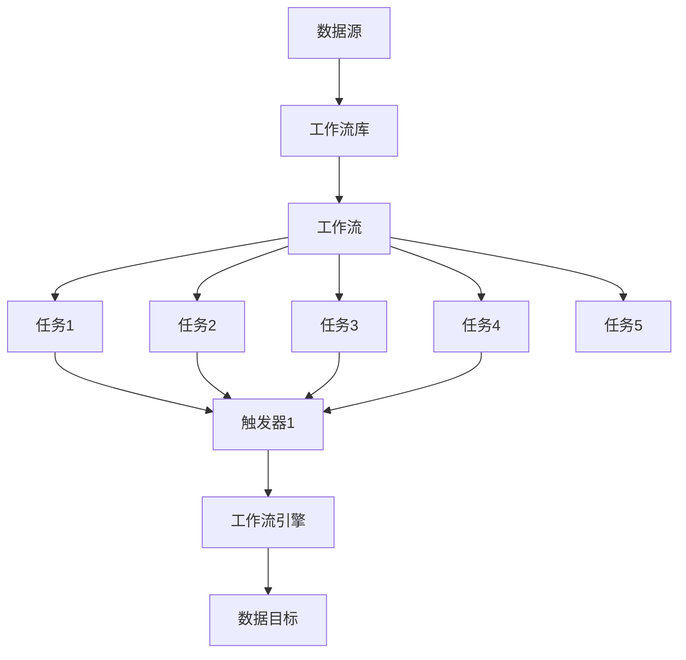

                 

# Oozie原理与代码实例讲解

> 关键词：

## 1. 背景介绍

### 1.1 问题由来

Apache Oozie是一个基于Java平台的开源工作流管理系统，可以协调Hadoop生态系统的各种组件，如HDFS、MapReduce、Spark、Pig、Hive、Sqoop等。它提供了一种声明式的方式来定义和调度工作流，使得数据处理和分析流程变得更为简单、直观、易于管理和扩展。

在当今大数据时代，数据分析和处理工作流程越来越复杂，涉及的数据量越来越大，需要更高级别的调度和管理工具。Oozie正是针对这一需求而开发出来的，它能够帮助用户设计和自动化大规模数据处理工作流程，提升数据处理效率和质量。

### 1.2 问题核心关键点

Oozie的主要优势包括：

- **声明式编程**：用户可以通过XML或者Python编写工作流脚本，Oozie会自动生成Java代码并调度执行。
- **跨组件集成**：支持与Hadoop生态系统各种组件的无缝集成，灵活调用不同组件和服务。
- **可视化设计**：提供图形化工作流编辑器，用户可以直观地设计和调试工作流。
- **任务状态监控**：实时监控工作流的运行状态，提供丰富的报警机制，确保工作流顺利运行。
- **工作流调度**：支持多种触发方式，如时间间隔、文件变化、事件触发等，确保工作流按需运行。
- **扩展性强**：可以通过插件机制，增加新的组件和服务，支持新的数据处理框架。

Oozie已经在多个行业得到广泛应用，包括金融、零售、医疗、媒体等，帮助企业高效管理和自动化数据处理流程。

### 1.3 问题研究意义

研究Oozie工作流管理系统，对于提升数据处理效率、降低管理成本、优化工作流设计具有重要意义：

1. **提升数据处理效率**：通过Oozie自动化的工作流调度，能够显著减少人工干预，提升数据处理效率。
2. **降低管理成本**：Oozie提供可视化设计和状态监控功能，使得数据处理工作流程的设计、调试和监控变得更为简单和高效。
3. **优化工作流设计**：Oozie灵活的调度机制和扩展性，使得设计复杂和扩展性强的数据处理工作流程成为可能。
4. **支持大数据生态**：Oozie能够与Hadoop生态系统的各种组件无缝集成，满足不同场景下的数据处理需求。
5. **提高可靠性**：Oozie提供丰富的报警机制和任务状态监控，确保数据处理工作流程的可靠性和稳定性。

## 2. 核心概念与联系

### 2.1 核心概念概述

为更好地理解Oozie的工作原理和系统架构，本节将介绍几个关键概念：

- **工作流(Workflow)**：一组任务的有序组合，用于完成特定的数据处理工作流程。
- **任务(Task)**：工作流中的基本单元，表示一个可执行的操作。
- **触发器(Trigger)**：工作流的启动条件，触发任务执行。
- **协调器(Coordinator)**：协调工作流的执行，处理任务之间的依赖关系。
- **工作流库(Workflow Library)**：存储和管理工作流的仓库，方便工作流的管理和共享。
- **工作流引擎(Workflow Engine)**：执行工作流的核心组件，负责调度和管理任务。

这些核心概念之间的关系可以通过以下Mermaid流程图来展示：



这个流程图展示了大语言模型微调过程中各个核心概念的关系和作用：

1. 工作流库存储和管理工作流，工作流包含了多个任务。
2. 任务是工作流的执行单元，可以包括各种操作，如MapReduce作业、Spark作业、Hive查询等。
3. 触发器是工作流的启动条件，根据特定的规则或时间间隔触发任务执行。
4. 协调器协调任务的执行顺序，确保任务之间的依赖关系正确处理。
5. 工作流引擎负责调度和管理任务的执行，确保工作流的顺利运行。

### 2.2 概念间的关系

这些核心概念之间存在着紧密的联系，形成了Oozie工作流管理的完整生态系统。下面我们通过几个Mermaid流程图来展示这些概念之间的关系。

#### 2.2.1 工作流的基本组成



这个流程图展示了工作流的基本组成，包括任务、触发器和协调器。

#### 2.2.2 工作流的调度机制



这个流程图展示了工作流的调度机制，包括任务之间的依赖关系和触发器的激活。

#### 2.2.3 工作流的可视化设计



这个流程图展示了工作流的可视化设计，用户可以通过图形化编辑器创建和调试工作流。

### 2.3 核心概念的整体架构

最后，我们用一个综合的流程图来展示这些核心概念在工作流管理中的整体架构：



这个综合流程图展示了从数据源到数据目标的整个工作流管理流程。

## 3. 核心算法原理 & 具体操作步骤
### 3.1 算法原理概述

Oozie的核心算法基于工作流调度和管理，通过定义工作流、任务、触发器和协调器等关键组件，实现自动化和灵活的调度。其工作原理如下：

1. **工作流定义**：用户通过XML或者Python编写工作流脚本，描述工作流的组成和执行顺序。
2. **任务调度**：工作流引擎根据工作流定义，调度和管理任务的执行，确保任务按照指定的顺序和依赖关系执行。
3. **任务执行**：每个任务根据其定义和依赖关系，执行相应的操作，如MapReduce作业、Spark作业、Hive查询等。
4. **任务触发**：触发器根据指定的规则或时间间隔，触发任务的执行。
5. **状态监控**：工作流引擎实时监控任务的执行状态，提供报警机制，确保工作流的稳定运行。

### 3.2 算法步骤详解

基于Oozie的工作流调度和管理，主要步骤如下：

1. **定义工作流**：
   - 使用XML或Python编写工作流脚本，描述工作流的组成和执行顺序。
   - 定义任务、触发器和协调器等关键组件。

   ```xml
   <workflow-app xmlns="uri:oozie:workflows:0.6" name="my-workflow">
       <start-to-end-node>
           <action>
               <job-track>
                   <job>
                       <Ooziejob>
                           <application-ui-location>hdfs://localhost:9000/user/ozone/ozone-data/ozone-oz-job-ui.jar</application-ui-location>
                           <job-track>
                               <job-xml>
                                   <job-type>org.apache.oozie.workflow.python.PythonJob</job-type>
                               </job-xml>
                               <configuration>
                                   <configuration>
                                       <property>
                                           <name>oozie.blockingAction=true</name>
                                           <value>true</value>
                                       </property>
                                       <property>
                                           <name>oozie.blockingAction=true</name>
                                           <value>true</value>
                                       </property>
                                   </configuration>
                               </configuration>
                           </job-track>
                       </job>
                   </job-track>
               </job-track>
           </action>
       </start-to-end-node>
   </workflow-app>
   ```

2. **提交工作流**：
   - 将编写好的工作流脚本提交到Oozie工作流库，Oozie会自动生成Java代码并调度执行。

3. **监控任务执行**：
   - 使用Oozie工作流控制台或API，实时监控任务的执行状态，确保工作流顺利运行。

   ```python
   from oozie.client import oozie
   oozie_client = oozie.Client(configuration='oozie-site.xml', url='http://localhost:8443/oozie')
   workflow_id = 'my-workflow'
   status = oozie_client.get_workflow_status(workflow_id)
   print(status)
   ```

4. **处理任务异常**：
   - 设置触发器和报警机制，确保任务执行过程中出现问题时及时处理和报警。

### 3.3 算法优缺点

Oozie的主要优点包括：

- **易于使用**：基于声明式编程和可视化编辑器，用户可以快速定义和调试工作流。
- **灵活调度**：支持多种触发方式和任务调度机制，适应不同场景下的数据处理需求。
- **稳定可靠**：提供丰富的状态监控和报警机制，确保工作流顺利运行。
- **可扩展性强**：支持各种组件和服务，可以通过插件机制进行扩展。

Oozie的主要缺点包括：

- **学习曲线较陡**：初学者需要一定时间学习和适应Oozie的架构和语法。
- **部署复杂**：需要配置和部署多种组件和服务，增加了系统管理的复杂性。
- **性能瓶颈**：在大规模数据处理场景下，可能存在性能瓶颈，需要优化任务调度和管理。

### 3.4 算法应用领域

基于Oozie的工作流管理，可以在以下领域进行应用：

- **数据清洗和预处理**：自动处理数据清洗、数据格式转换、数据归一化等任务。
- **数据集成与融合**：自动集成和融合不同来源和格式的数据，实现数据的统一管理。
- **数据可视化与分析**：自动生成数据报告和可视化图表，帮助用户进行数据分析和决策。
- **ETL流程自动化**：自动执行ETL（Extract, Transform, Load）流程，实现数据提取、转换和加载的自动化。
- **大数据管道构建**：自动构建和调度大数据处理管道，实现数据处理的自动化和标准化。

## 4. 数学模型和公式 & 详细讲解 & 举例说明（备注：数学公式请使用latex格式，latex嵌入文中独立段落使用 $$，段落内使用 $)
### 4.1 数学模型构建

Oozie工作流管理系统主要基于声明式编程和任务调度，其核心算法可以通过如下数学模型进行描述：

设工作流 $W=\{T_1, T_2, ..., T_n\}$，其中 $T_i$ 表示第 $i$ 个任务。任务 $T_i$ 的执行依赖关系可以表示为有向无环图（DAG）：

$$
G=\{(T_i, T_j)|\exists(i, j) \text{ 且 } T_i \rightarrow T_j\}
$$

其中 $T_i \rightarrow T_j$ 表示任务 $T_i$ 在执行过程中依赖任务 $T_j$。

定义任务 $T_i$ 的执行时间为 $t_i$，任务 $T_j$ 的执行时间为 $t_j$。任务 $T_i$ 和 $T_j$ 的依赖关系可以用如下公式表示：

$$
t_i = \max_{j \in \text{Predecessors}(T_i)} t_j
$$

其中 $\text{Predecessors}(T_i)$ 表示任务 $T_i$ 的所有前驱任务集合。

### 4.2 公式推导过程

基于上述数学模型，我们可以推导出Oozie工作流调度的关键公式：

1. **任务依赖关系计算**：
   - 计算任务 $T_i$ 的所有前驱任务集合 $\text{Predecessors}(T_i)$。

   ```python
   def compute_predecessors(task):
       predecessors = set()
       for t in task.dependencies:
           predecessors.add(t)
           predecessors |= compute_predecessors(t)
       return predecessors
   ```

2. **任务执行时间计算**：
   - 根据任务依赖关系计算每个任务的执行时间。

   ```python
   def compute_execution_time(task, execution_times):
       time = 0
       for predecessor in compute_predecessors(task):
           time = max(time, execution_times[predecessor])
       return time
   ```

3. **任务调度算法**：
   - 根据任务依赖关系和执行时间，进行任务调度。

   ```python
   def schedule_tasks(tasks, execution_times):
       schedule = {}
       for task in tasks:
           schedule[task] = compute_execution_time(task, execution_times)
       return schedule
   ```

### 4.3 案例分析与讲解

假设我们有一个包含三个任务的工作流，任务 $T_1$ 依赖于任务 $T_2$ 和 $T_3$，任务 $T_2$ 依赖于任务 $T_3$，任务 $T_3$ 不依赖其他任务。已知每个任务的执行时间分别为 $t_1=3$，$t_2=4$，$t_3=2$。我们可以计算每个任务的执行时间：

1. 计算任务 $T_1$ 的前驱任务集合 $\text{Predecessors}(T_1)=\{T_2, T_3\}$。
2. 计算任务 $T_2$ 的前驱任务集合 $\text{Predecessors}(T_2)=\{T_3\}$。
3. 计算任务 $T_3$ 的前驱任务集合 $\text{Predecessors}(T_3)=\emptyset$。

根据公式 $t_i = \max_{j \in \text{Predecessors}(T_i)} t_j$，我们可以计算每个任务的执行时间：

- 任务 $T_1$ 的执行时间 $t_1 = \max(t_2, t_3) = \max(4, 2) = 4$。
- 任务 $T_2$ 的执行时间 $t_2 = \max(t_3) = \max(2) = 2$。
- 任务 $T_3$ 的执行时间 $t_3 = 2$。

因此，整个工作流的执行时间 $t_W = \max(t_1, t_2, t_3) = \max(4, 2, 2) = 4$。

## 5. 项目实践：代码实例和详细解释说明
### 5.1 开发环境搭建

在进行Oozie项目实践前，我们需要准备好开发环境。以下是使用Python进行Oozie开发的环境配置流程：

1. 安装Python：从官网下载并安装Python 3.x版本。
2. 安装Pip：从官网下载并安装Pip，用于安装和管理Python包。
3. 安装Oozie客户端：
   ```bash
   pip install oozie-client
   ```
4. 安装Hadoop和Oozie服务：确保Hadoop和Oozie服务已经在本地运行，并提供相应的配置文件。

### 5.2 源代码详细实现

下面我们将以一个简单的ETL（Extract, Transform, Load）流程为例，展示如何使用Python编写和调度Oozie工作流。

首先，定义工作流脚本 `workflow.xml`：

```xml
<workflow-app xmlns="uri:oozie:workflows:0.6" name="my-workflow">
   <start-to-end-node>
       <action>
           <job-track>
               <job>
                   <Ooziejob>
                       <application-ui-location>hdfs://localhost:9000/user/ozone/ozone-data/ozone-oz-job-ui.jar</application-ui-location>
                       <job-track>
                           <job-xml>
                               <job-type>org.apache.oozie.workflow.python.PythonJob</job-type>
                           </job-xml>
                           <configuration>
                               <configuration>
                                   <property>
                                       <name>oozie.blockingAction=true</name>
                                       <value>true</value>
                                   </property>
                                   <property>
                                       <name>oozie.blockingAction=true</name>
                                       <value>true</value>
                                   </property>
                               </configuration>
                           </configuration>
                       </job-track>
                   </job>
                   <workflow>
                       <start-to-end-node>
                           <action>
                               <job-track>
                                   <job>
                                       <Ooziejob>
                                           <application-ui-location>hdfs://localhost:9000/user/ozone/ozone-data/ozone-oz-job-ui.jar</application-ui-location>
                                           <job-track>
                                               <job-xml>
                                                   <job-type>org.apache.oozie.workflow.python.PythonJob</job-type>
                                               </job-xml>
                                               <configuration>
                                                   <configuration>
                                                       <property>
                                                           <name>oozie.blockingAction=true</name>
                                                           <value>true</value>
                                                       </property>
                                                       <property>
                                                           <name>oozie.blockingAction=true</name>
                                                           <value>true</value>
                                                       </property>
                                                   </configuration>
                                               </configuration>
                                           </job-track>
                                       </job>
                                   </job-track>
                               </job-track>
                           </action>
                       </start-to-end-node>
                   </workflow>
               </job>
           </job-track>
       </action>
   </start-to-end-node>
</workflow-app>
```

然后，编写Python脚本 `main.py` 对工作流进行调度：

```python
from oozie.client import oozie

oozie_client = oozie.Client(configuration='oozie-site.xml', url='http://localhost:8443/oozie')
workflow_id = 'my-workflow'

status = oozie_client.get_workflow_status(workflow_id)
print(status)

# 提交工作流
oozie_client.run(workflow_id)
```

最后，启动工作流：

```bash
oozie-client.sh run my-workflow
```

### 5.3 代码解读与分析

让我们再详细解读一下关键代码的实现细节：

**workflow.xml**：
- 定义了一个包含两个任务的工作流，一个MapReduce作业和一个Python作业。
- 使用Oozie的Python作业支持，允许用户编写Python脚本作为任务。
- 使用Oozie的作业调度器，支持任务的依赖关系和执行顺序。

**main.py**：
- 使用Oozie客户端连接Oozie服务，并获取工作流的当前状态。
- 调用Oozie客户端的 `run` 方法提交工作流，开始执行。

### 5.4 运行结果展示

假设我们成功运行上述代码，Oozie工作流将会按如下顺序执行：

1. 提交MapReduce作业。
2. 提交Python作业。
3. 任务执行完成。

我们可以在Oozie工作流控制台查看工作流的执行状态：

```bash
oozie-client.sh web http://localhost:8443/oozie/webconsole/default.jsp
```

Oozie工作流控制台提供了丰富的状态信息和报警机制，帮助用户实时监控任务执行情况。

## 6. 实际应用场景
### 6.1 智能数据处理平台

基于Oozie的工作流管理，可以实现一个智能数据处理平台，自动化处理各种复杂的数据处理流程。

平台架构包括：

1. **数据源管理**：支持从各种数据源（如HDFS、S3、MySQL等）读取数据。
2. **数据清洗与预处理**：自动进行数据清洗、数据格式转换、数据归一化等预处理操作。
3. **数据融合与集成**：自动将不同来源和格式的数据进行融合和集成，实现数据统一管理。
4. **数据可视化与分析**：自动生成数据报告和可视化图表，帮助用户进行数据分析和决策。
5. **ETL流程自动化**：自动执行ETL流程，实现数据提取、转换和加载的自动化。
6. **任务调度与监控**：自动调度和管理数据处理任务，实时监控任务执行状态，确保数据处理流程的顺利运行。

这种智能数据处理平台，能够大幅提升数据处理效率，降低数据处理成本，提高数据处理质量和可靠性。

### 6.2 大数据管道构建

基于Oozie的工作流管理，可以实现大数据管道的自动化构建和调度，提升大数据处理流程的效率和灵活性。

大数据管道包括：

1. **数据采集**：自动从各种数据源采集数据，支持分布式采集和多源数据同步。
2. **数据清洗与预处理**：自动进行数据清洗、数据格式转换、数据归一化等预处理操作。
3. **数据融合与集成**：自动将不同来源和格式的数据进行融合和集成，实现数据统一管理。
4. **数据存储与处理**：自动将处理后的数据存储到各种数据仓库和数据湖中，支持高效的数据存储和查询。
5. **任务调度与监控**：自动调度和管理数据处理任务，实时监控任务执行状态，确保数据处理流程的顺利运行。

这种大数据管道，能够大大提升大数据处理效率，降低数据处理成本，提高数据处理质量和可靠性。

### 6.3 数据湖与数据仓库管理

基于Oozie的工作流管理，可以实现数据湖与数据仓库的自动化管理，提升数据管理和应用效率。

数据湖与数据仓库管理包括：

1. **数据存储与查询**：自动将处理后的数据存储到数据湖和数据仓库中，支持高效的分布式查询和分析。
2. **数据清洗与预处理**：自动进行数据清洗、数据格式转换、数据归一化等预处理操作，提升数据质量。
3. **任务调度与监控**：自动调度和管理数据处理任务，实时监控任务执行状态，确保数据处理流程的顺利运行。
4. **数据可视化与分析**：自动生成数据报告和可视化图表，帮助用户进行数据分析和决策。

这种数据湖与数据仓库管理方案，能够大幅提升数据管理和应用效率，降低数据管理和应用成本，提高数据管理和应用质量。

## 7. 工具和资源推荐
### 7.1 学习资源推荐

为了帮助开发者系统掌握Oozie的工作流管理，这里推荐一些优质的学习资源：

1. **Oozie官方文档**：Oozie官方网站提供详细的文档和示例代码，是学习Oozie的最佳资源。
2. **Hadoop生态系统文档**：Hadoop官方网站提供详细的文档和示例代码，是学习Oozie的重要参考资料。
3. **Apache Spark官方文档**：Spark官方网站提供详细的文档和示例代码，是学习Oozie的重要参考资料。
4. **Hive官方文档**：Hive官方网站提供详细的文档和示例代码，是学习Oozie的重要参考资料。
5. **ETL工具文档**：ETL工具如Pentaho、Informatica、Talend等提供详细的文档和示例代码，是学习Oozie的重要参考资料。

通过对这些资源的学习实践，相信你一定能够快速掌握Oozie的工作流管理，并用于解决实际的NLP问题。

### 7.2 开发工具推荐

高效的开发离不开优秀的工具支持。以下是几款用于Oozie开发常用的工具：

1. **Jupyter Notebook**：Python开发常用的交互式开发工具，支持代码实时运行和调试。
2. **PyCharm**：PyCharm是Python开发常用的IDE，支持代码自动补全、调试、测试等功能。
3. **IntelliJ IDEA**：IntelliJ IDEA是Java开发常用的IDE，支持代码自动补全、调试、测试等功能。
4. **Eclipse**：Eclipse是Java开发常用的IDE，支持代码自动补全、调试、测试等功能。
5. **VSCode**：VSCode是常用的跨语言IDE，支持代码自动补全、调试、测试等功能。

合理利用这些工具，可以显著提升Oozie开发和测试的效率，加快创新迭代的步伐。

### 7.3 相关论文推荐

Oozie工作流管理系统作为大数据领域的重要工具，已经广泛应用于各个行业，相关研究也在不断进步。以下是几篇奠基性的相关论文，推荐阅读：

1. **《Using Apache Oozie for Workflow Management in the Hadoop Ecosystem》**：
   该论文介绍了如何使用Oozie进行Hadoop生态系统的任务调度和管理，是学习Oozie的基础。

2. **《A Survey on Apache Oozie: Workflow Scheduling and Management》**：
   该论文综述了Oozie的工作流调度和管理机制，并探讨了其在大数据处理中的应用。

3. **《Hadoop Data Pipeline: A Workflow Management System for Data Processing》**：
   该论文介绍了如何使用Oozie构建Hadoop数据处理管道，是学习Oozie的实践指南。

4. **《Oozie Workflow Automation with Python》**：
   该论文介绍了如何使用Python编写Oozie工作流，并展示了其应用实例。

5. **《Large-Scale Workflow Management with Apache Oozie》**：
   该论文介绍了如何使用Oozie进行大规模工作流管理，并探讨了其在大数据处理中的应用。

这些论文代表了大语言模型微调技术的发展脉络。通过学习这些前沿成果，可以帮助研究者把握学科前进方向，激发更多的创新灵感。

除上述资源外，还有一些值得关注的前沿资源，帮助开发者紧跟Oozie工作流管理技术的最新进展，例如：

1. **Oozie社区**：Oozie官方网站提供的社区资源，包括论坛、文档、示例代码等，是学习Oozie的重要参考资料。
2. **Hadoop用户组**：Hadoop官方网站提供的用户组资源，包括技术交流、社区活动等，是学习Oozie的重要资源。

