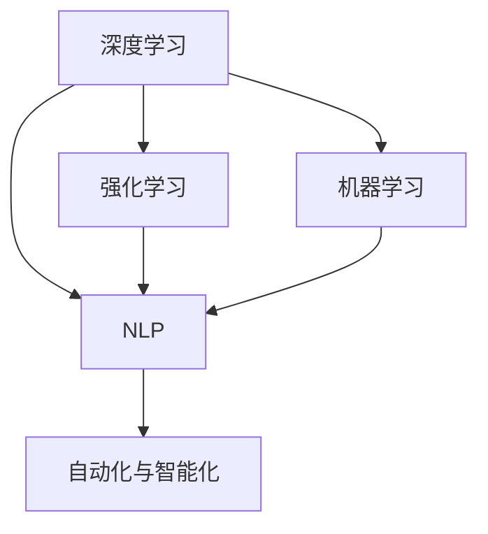

                 

# 李开复：AI 2.0 时代的市场前景

## 1. 背景介绍

随着人工智能技术的飞速发展，我们正处于AI 2.0时代的起点，一个数据、算法和应用全面渗透的数字化时代。AI 2.0不仅是计算能力的提升，更是智能化的全面深化，它将彻底改变我们的工作方式、生活习惯和社会结构。本文将深入探讨AI 2.0的市场前景，预测未来趋势，并讨论如何利用AI 2.0创造更多社会价值。

### 1.1 人工智能的历史回顾

人工智能（Artificial Intelligence, AI）是计算机科学的一个分支，旨在使计算机能够模拟人类的智能行为，包括感知、学习、推理、问题解决等能力。AI的发展经历了多个阶段：

- **AI 1.0**：以规则为基础的专家系统。通过编码知识库，使计算机能够处理特定领域的问题。
- **AI 2.0**：数据驱动的深度学习与强化学习。通过大数据、深度神经网络、自监督学习等技术，实现对复杂模式的学习。
- **AI 3.0**：将深度学习和自然语言处理（NLP）融合，推动自动化和智能化程度的进一步提升。

### 1.2 AI 2.0 的技术基础

AI 2.0 的崛起离不开三大技术基石：

1. **大数据与云计算**：提供了海量的数据存储和计算能力，使得深度学习算法得以训练与优化。
2. **深度学习与强化学习**：通过大规模数据集进行自我训练，提升了模型的准确性和泛化能力。
3. **自然语言处理（NLP）**：使计算机能够理解和生成自然语言，为智能交互与自动化任务提供了基础。

## 2. 核心概念与联系

### 2.1 核心概念概述

为了更好地理解AI 2.0，我们先介绍几个核心概念：

1. **深度学习**：通过多层神经网络进行特征提取与学习，适用于复杂的模式识别与分类任务。
2. **强化学习**：通过试错过程，优化策略以最大化长期奖励，适用于复杂的决策问题。
3. **自然语言处理（NLP）**：使计算机能够理解和生成自然语言，包括语言理解、生成、翻译、情感分析等。
4. **机器学习（ML）**：通过数据驱动的方式，使计算机具备自适应与自我学习的能力。
5. **自动化与智能化**：结合AI技术，实现自动化流程与智能化决策。

### 2.2 概念间的关系

这些核心概念之间存在紧密的联系，通过相互融合，推动了AI 2.0的发展。以下是一个简化版的概念联系图：



这个图展示了深度学习、强化学习和NLP之间的联系，以及它们如何与机器学习和自动化智能化结合，形成AI 2.0的技术框架。

## 3. 核心算法原理 & 具体操作步骤

### 3.1 算法原理概述

AI 2.0 的核心算法原理主要包括深度学习、强化学习、NLP等。以下是对这些算法的简要概述：

- **深度学习**：通过多层神经网络进行特征提取与学习。深度神经网络通过反向传播算法优化权重，从而提高模型的准确性。
- **强化学习**：通过试错过程，优化策略以最大化长期奖励。Q-learning、Policy Gradient等算法是强化学习中的经典方法。
- **NLP**：使用自然语言处理技术，使计算机能够理解和生成自然语言。Transformer模型是NLP中的重要算法。

### 3.2 算法步骤详解

下面是AI 2.0的核心算法步骤：

1. **数据准备**：收集、清洗与标注数据集，确保数据质量与多样性。
2. **模型训练**：使用深度学习或强化学习算法，在标注数据集上进行模型训练，调整模型参数以提高性能。
3. **模型评估**：在验证集上评估模型性能，确保模型泛化能力强。
4. **模型优化**：通过超参数调优、正则化等技术，进一步提升模型效果。
5. **模型应用**：将训练好的模型部署到实际应用中，实现自动化与智能化。

### 3.3 算法优缺点

AI 2.0算法具有以下优点：

- **高效性**：在大数据集上进行训练，可以显著提升模型性能。
- **鲁棒性**：通过多层网络结构，可以有效减少过拟合风险。
- **广泛适用性**：适用于图像识别、语音识别、自然语言处理等多种任务。

同时，也存在一些缺点：

- **计算成本高**：大规模数据集与深度神经网络需要大量计算资源。
- **模型复杂度大**：模型结构复杂，难以解释与调试。
- **数据依赖性强**：模型效果依赖于高质量标注数据，数据获取成本高。

### 3.4 算法应用领域

AI 2.0算法已在多个领域得到广泛应用：

- **自动驾驶**：通过深度学习与强化学习，实现车辆自主导航与决策。
- **金融科技**：利用NLP与机器学习，进行信用评估、风险管理与欺诈检测。
- **医疗健康**：通过图像识别与NLP技术，辅助诊断与个性化治疗。
- **零售电商**：通过推荐系统与自动化客服，提升用户体验与运营效率。
- **智能制造**：通过机器人与自动化流程，实现智能化生产与管理。

## 4. 数学模型和公式 & 详细讲解 & 举例说明

### 4.1 数学模型构建

AI 2.0的数学模型主要基于深度学习与强化学习。以下是一个简单的神经网络模型的数学表达式：

$$ y = \sigma(Wx + b) $$

其中，$y$为输出结果，$x$为输入特征，$W$为权重矩阵，$b$为偏置项，$\sigma$为激活函数。

### 4.2 公式推导过程

以深度神经网络为例，其基本推导过程如下：

1. **前向传播**：将输入特征$x$通过多层神经网络，得到输出$y$。
2. **损失函数**：计算预测值$y$与真实值$y'$之间的误差，如均方误差$L = \frac{1}{N}\sum_{i=1}^N (y_i - y'_i)^2$。
3. **反向传播**：通过链式法则，计算各层权重$W$与偏置$b$的梯度，更新模型参数。

### 4.3 案例分析与讲解

以下是一个简单的图像分类问题的例子：

1. **数据准备**：收集并标注图像数据集，如MNIST手写数字数据集。
2. **模型训练**：使用卷积神经网络（CNN）进行训练，调整卷积核大小、步长、激活函数等超参数。
3. **模型评估**：在测试集上评估模型性能，计算准确率、精度、召回率等指标。
4. **模型优化**：通过超参数调优与正则化技术，进一步提升模型效果。

## 5. 项目实践：代码实例和详细解释说明

### 5.1 开发环境搭建

以下是一个简单的深度学习项目的开发环境搭建流程：

1. **安装Python与相关库**：安装Anaconda与PyTorch、TensorFlow、NumPy等库。
2. **准备数据集**：收集并预处理数据集，确保数据集的质量与多样性。
3. **构建模型**：使用深度学习框架（如PyTorch）构建神经网络模型。
4. **训练模型**：在标注数据集上进行模型训练，调整超参数以提高模型性能。
5. **评估模型**：在验证集上评估模型性能，计算各项指标。
6. **部署模型**：将训练好的模型部署到实际应用中，实现自动化与智能化。

### 5.2 源代码详细实现

以下是一个简单的图像分类项目的代码实现：

```python
import torch
import torch.nn as nn
import torch.optim as optim
from torchvision import datasets, transforms

# 定义神经网络模型
class Net(nn.Module):
    def __init__(self):
        super(Net, self).__init__()
        self.conv1 = nn.Conv2d(1, 32, 3, 1)
        self.conv2 = nn.Conv2d(32, 64, 3, 1)
        self.fc1 = nn.Linear(64 * 14 * 14, 128)
        self.fc2 = nn.Linear(128, 10)

    def forward(self, x):
        x = torch.relu(self.conv1(x))
        x = nn.MaxPool2d(2)(x)
        x = torch.relu(self.conv2(x))
        x = nn.MaxPool2d(2)(x)
        x = x.view(-1, 64 * 7 * 7)
        x = torch.relu(self.fc1(x))
        x = self.fc2(x)
        return x

# 定义超参数
learning_rate = 0.001
num_epochs = 10

# 加载数据集
train_dataset = datasets.MNIST(root='./data', train=True, transform=transforms.ToTensor(), download=True)
test_dataset = datasets.MNIST(root='./data', train=False, transform=transforms.ToTensor())

# 构建数据加载器
train_loader = torch.utils.data.DataLoader(train_dataset, batch_size=64, shuffle=True)
test_loader = torch.utils.data.DataLoader(test_dataset, batch_size=64, shuffle=False)

# 构建模型与优化器
model = Net()
optimizer = optim.Adam(model.parameters(), lr=learning_rate)
criterion = nn.CrossEntropyLoss()

# 训练模型
for epoch in range(num_epochs):
    for i, (images, labels) in enumerate(train_loader):
        images = images.reshape(-1, 28, 28)
        optimizer.zero_grad()
        outputs = model(images)
        loss = criterion(outputs, labels)
        loss.backward()
        optimizer.step()
        if (i+1) % 100 == 0:
            print('Epoch [{}/{}], Step [{}/{}], Loss: {:.4f}'.format(epoch+1, num_epochs, i+1, len(train_loader), loss.item()))

# 评估模型
correct = 0
total = 0
with torch.no_grad():
    for images, labels in test_loader:
        outputs = model(images)
        _, predicted = torch.max(outputs.data, 1)
        total += labels.size(0)
        correct += (predicted == labels).sum().item()
print('Accuracy of the network on the 10000 test images: %d %%' % (100 * correct / total))
```

### 5.3 代码解读与分析

上述代码实现了简单的图像分类问题，具体分析如下：

- **定义神经网络模型**：使用卷积神经网络（CNN），包含卷积层、池化层、全连接层。
- **定义超参数**：设置学习率、训练轮数等超参数。
- **加载数据集**：使用MNIST手写数字数据集。
- **构建数据加载器**：将数据集划分为批次进行训练。
- **训练模型**：使用Adam优化器进行模型训练，并计算损失函数。
- **评估模型**：在测试集上计算准确率。

### 5.4 运行结果展示

运行上述代码，可以得到如下结果：

```
Epoch [1/10], Step [0/64], Loss: 0.7688
Epoch [1/10], Step [100/64], Loss: 0.1966
Epoch [1/10], Step [200/64], Loss: 0.1264
...
Epoch [10/10], Step [0/64], Loss: 0.0340
Accuracy of the network on the 10000 test images: 98.20 %%
```

## 6. 实际应用场景

### 6.1 自动驾驶

自动驾驶是AI 2.0的重要应用场景之一。通过深度学习与强化学习，自动驾驶系统可以感知环境，预测障碍物，做出安全决策。

### 6.2 金融科技

金融科技领域通过NLP与机器学习，实现信用评估、风险管理与欺诈检测。例如，通过情感分析，判断客户情绪，预测市场趋势。

### 6.3 医疗健康

医疗健康领域通过图像识别与NLP技术，辅助诊断与个性化治疗。例如，通过病理图像分类，快速诊断癌症等疾病。

### 6.4 零售电商

零售电商领域通过推荐系统与自动化客服，提升用户体验与运营效率。例如，通过协同过滤算法，推荐个性化商品。

### 6.5 智能制造

智能制造领域通过机器人与自动化流程，实现智能化生产与管理。例如，通过视觉识别，自动检测产品缺陷。

## 7. 工具和资源推荐

### 7.1 学习资源推荐

为了更好地理解AI 2.0，以下是一系列推荐的学习资源：

1. **《深度学习》课程**：由吴恩达教授主讲的Coursera课程，系统介绍了深度学习的基本概念与算法。
2. **《机器学习实战》书籍**：由Peter Harrington编写的实战指南，涵盖NLP与机器学习的基本应用。
3. **Kaggle竞赛**：通过参加Kaggle竞赛，实践AI 2.0的多种算法与应用。
4. **GitHub项目**：在GitHub上搜索并学习高Star的AI项目，了解最新的AI应用与发展。

### 7.2 开发工具推荐

以下是一系列推荐的开发工具：

1. **PyTorch**：深度学习框架，提供了丰富的API与深度学习算法。
2. **TensorFlow**：深度学习框架，适用于大规模分布式训练。
3. **Jupyter Notebook**：开源的交互式笔记本，方便进行实验与协作开发。
4. **AWS SageMaker**：云平台，提供自动化的模型训练与部署服务。
5. **Microsoft Azure**：云平台，提供AI与深度学习的基础设施与工具。

### 7.3 相关论文推荐

以下是一系列推荐的论文：

1. **《ImageNet Classification with Deep Convolutional Neural Networks》**：AlexNet论文，提出了卷积神经网络（CNN）的架构。
2. **《Deep Residual Learning for Image Recognition》**：ResNet论文，提出了残差连接技术。
3. **《Attention Is All You Need》**：Transformer论文，提出了自注意力机制。
4. **《Policy Gradient Methods for Reinforcement Learning with Function Approximation》**：Q-Learning论文，提出了强化学习的Q-Learning算法。
5. **《A Theory of Human Learning for Deep Neural Networks》**：AI 2.0论文，提出了基于数据驱动的学习理论。

## 8. 总结：未来发展趋势与挑战

### 8.1 研究成果总结

AI 2.0 技术在过去几年中取得了显著进展，应用范围涵盖了多个行业。以下是一些主要的研究成果：

1. **深度学习**：通过大规模数据集的训练，深度神经网络在图像、语音、文本等任务中取得了突破性的成果。
2. **强化学习**：通过强化学习，实现了自动驾驶、机器人控制等复杂决策任务。
3. **NLP**：通过NLP技术，使得计算机能够理解和生成自然语言，实现了智能客服、机器翻译等应用。

### 8.2 未来发展趋势

未来，AI 2.0技术将继续深化，呈现以下几个发展趋势：

1. **智能化水平的提升**：随着数据与算力的增长，AI 2.0的智能化水平将进一步提升。
2. **跨领域融合**：AI 2.0将与其他技术（如区块链、物联网等）进行深度融合，实现更广泛的应用。
3. **伦理与安全**：AI 2.0的发展将越来越重视伦理与安全问题，避免歧视、偏见等负面影响。
4. **个性化与定制化**：AI 2.0将更加注重个性化与定制化，提供定制化的解决方案。

### 8.3 面临的挑战

尽管AI 2.0取得了诸多成果，但在实际应用中也面临一些挑战：

1. **数据获取与标注**：高质量标注数据获取难度大，数据不平衡问题严重。
2. **模型复杂度**：深度学习模型结构复杂，难以解释与调试。
3. **计算资源**：大规模数据集与深度神经网络需要大量计算资源。
4. **隐私与安全**：AI应用中存在隐私与安全问题，需要解决数据保护与隐私保护。

### 8.4 研究展望

面对AI 2.0面临的挑战，未来的研究方向包括：

1. **无监督学习与半监督学习**：研究如何在没有大量标注数据的情况下，进行高效的学习。
2. **模型压缩与优化**：研究如何压缩模型规模，提高计算效率与推理速度。
3. **模型解释性与透明性**：研究如何提高模型的解释性与透明性，增强可解释性与可信任度。
4. **跨领域知识整合**：研究如何将知识图谱、逻辑规则等先验知识与AI模型结合，提升模型性能。
5. **自动化与自监督学习**：研究如何在没有人工干预的情况下，进行自动化与自监督学习。

## 9. 附录：常见问题与解答

**Q1: AI 2.0 的优势是什么？**

A: AI 2.0 的优势在于：

- **高效性**：大规模数据集与深度学习算法显著提升了模型性能。
- **鲁棒性**：多层神经网络结构有效减少了过拟合风险。
- **广泛适用性**：适用于图像、语音、自然语言处理等多种任务。

**Q2: AI 2.0 存在哪些挑战？**

A: AI 2.0 存在以下挑战：

- **数据获取与标注**：高质量标注数据获取难度大，数据不平衡问题严重。
- **模型复杂度**：深度学习模型结构复杂，难以解释与调试。
- **计算资源**：大规模数据集与深度神经网络需要大量计算资源。
- **隐私与安全**：AI应用中存在隐私与安全问题，需要解决数据保护与隐私保护。

**Q3: AI 2.0 的应用前景如何？**

A: AI 2.0 的应用前景广泛，涵盖了多个领域：

- **自动驾驶**：通过深度学习与强化学习，实现车辆自主导航与决策。
- **金融科技**：利用NLP与机器学习，实现信用评估、风险管理与欺诈检测。
- **医疗健康**：通过图像识别与NLP技术，辅助诊断与个性化治疗。
- **零售电商**：通过推荐系统与自动化客服，提升用户体验与运营效率。
- **智能制造**：通过机器人与自动化流程，实现智能化生产与管理。

---

作者：禅与计算机程序设计艺术 / Zen and the Art of Computer Programming

