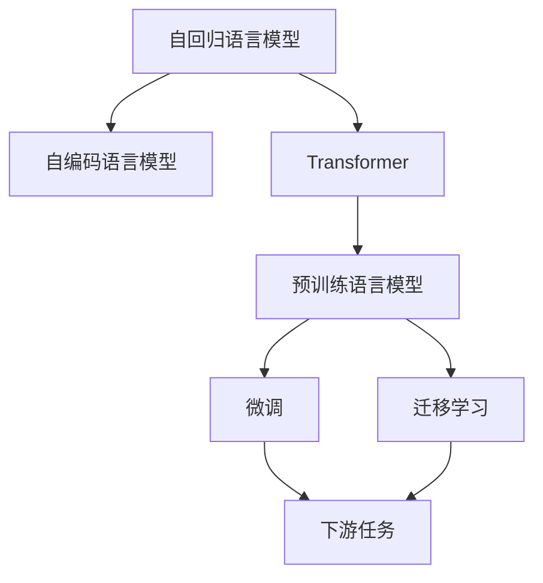

                 

## 1. 背景介绍

### 1.1 问题由来
随着深度学习技术的发展，自然语言处理(NLP)领域涌现出一大批优秀的模型，其中包括了GPT系列和BERT系列。GPT代表的是Generative Pre-trained Transformer，而BERT则代表Bidirectional Encoder Representations from Transformers。两者都是基于Transformer架构的预训练语言模型，但在训练方法和应用领域上存在一定的差异。

### 1.2 问题核心关键点
对于开发人员和研究人员而言，选择合适的模型（GPT还是BERT）用于特定的NLP任务，是应用过程中需要仔细考虑的问题。不同的模型可能适用于不同的任务类型和数据特点。选择合适的模型可以显著提升模型的性能，同时避免不必要的资源浪费。

### 1.3 问题研究意义
选择GPT还是BERT模型，对于提高NLP任务的效率和效果，降低开发成本，以及推动NLP技术的产业化进程具有重要意义。通过合理选择模型，开发者可以更快地完成任务适配，缩短开发周期，同时提升模型的表现，使其更好地适应特定应用场景。

## 2. 核心概念与联系

### 2.1 核心概念概述

为了更好地理解GPT和BERT的选择，我们需要先介绍一些核心概念：

- **Transformer**：一种基于自注意力机制的神经网络结构，用于处理序列数据，如自然语言。Transformer结构能够高效地处理长距离依赖，是现代NLP模型的基础。
- **预训练语言模型**：使用大规模无标签文本数据进行自监督学习，学习语言表示的模型。预训练模型可以在大规模数据上学习到丰富的语言知识，用于下游任务的微调。
- **自回归语言模型**：如GPT，模型通过预测下一个单词来训练，学习语言的生成能力。
- **自编码语言模型**：如BERT，模型通过预测输入的掩码单词来训练，学习语言的理解能力。
- **微调(Fine-Tuning)**：在预训练模型的基础上，使用下游任务的少量标注数据进行有监督训练，优化模型在特定任务上的性能。
- **迁移学习**：将一个领域学习到的知识迁移到另一个领域，以提高模型在新任务上的表现。

这些核心概念构成了NLP模型选择与优化的基础框架，下面将通过Mermaid流程图展示它们之间的关系：



这个流程图展示了自回归和自编码语言模型是如何通过Transformer构建预训练语言模型，并通过微调和迁移学习来适配下游任务。

### 2.2 概念间的关系

- **预训练与微调**：预训练模型通过自监督学习获得语言表示，微调则在有监督的标注数据上进行训练，以适应特定的下游任务。
- **GPT与BERT**：GPT通过自回归方式进行预训练，擅长生成文本；BERT通过自编码方式进行预训练，擅长理解文本。
- **微调与迁移学习**：微调是针对特定任务进行有监督训练，而迁移学习则是将已有的知识迁移到新的任务上，两者都是模型适配的常用方法。

这些概念之间的联系帮助我们更好地理解GPT与BERT的选择逻辑。

## 3. 核心算法原理 & 具体操作步骤

### 3.1 算法原理概述

选择GPT还是BERT模型，本质上是选择不同的预训练方法和应用策略。GPT和BERT在预训练阶段采用不同的方式学习语言表示，这影响了它们在特定任务上的表现。

GPT系列模型采用自回归方式进行预训练，即通过预测下一个单词来学习语言模型。这种方法在生成任务（如文本生成、对话系统等）上表现优异，因为生成任务本质上就是从已有文本中生成新的文本。

BERT系列模型采用自编码方式进行预训练，即通过预测输入文本中被掩码的单词来学习语言模型。这种方法在理解任务（如命名实体识别、情感分析等）上表现出色，因为理解任务需要模型从文本中提取语义信息。

### 3.2 算法步骤详解

以下是选择GPT或BERT模型的详细步骤：

1. **任务分析**：
   - **生成任务**：如文本生成、对话系统等。这些任务要求模型能够生成新的文本，因此GPT模型更适合。
   - **理解任务**：如命名实体识别、情感分析等。这些任务要求模型能够理解输入文本的语义信息，因此BERT模型更适合。

2. **模型选择**：
   - **GPT模型**：使用基于自回归的预训练模型，如GPT-2、GPT-3等。这些模型在生成文本方面表现出色。
   - **BERT模型**：使用基于自编码的预训练模型，如BERT-base、BERT-large等。这些模型在理解文本方面表现出色。

3. **微调与适配**：
   - 选择合适的预训练模型后，需要根据下游任务进行微调。微调可以使用与预训练模型相同的架构，只训练顶层。
   - 对于生成任务，可以添加额外的输出层进行预测。
   - 对于理解任务，可以添加额外的分类器或回归器进行预测。

4. **评估与优化**：
   - 在微调过程中，需要定期评估模型性能，确保模型在特定任务上的表现。
   - 根据评估结果，调整超参数，如学习率、批大小等，以优化模型性能。

### 3.3 算法优缺点

**GPT模型的优点**：
- **生成能力强**：GPT模型擅长生成自然流畅的文本，适用于需要生成新文本的任务。
- **计算效率高**：GPT模型通常比BERT模型更快，因为它在推理时不需要进行双向的编码计算。

**GPT模型的缺点**：
- **理解能力弱**：由于GPT模型是基于自回归的，因此在理解任务上可能表现不如BERT模型。
- **资源消耗大**：GPT模型参数量较大，计算和存储资源消耗较大。

**BERT模型的优点**：
- **理解能力强**：BERT模型通过双向编码学习语义信息，适用于需要理解文本的任务。
- **泛化能力强**：BERT模型在多种NLP任务上表现出色，适用于需要跨领域迁移的任务。

**BERT模型的缺点**：
- **生成能力弱**：BERT模型在生成新文本方面表现较差，因为其训练方式是掩码预测，而非自回归。
- **计算复杂度高**：BERT模型在推理时需要进行双向的编码计算，计算复杂度较高。

### 3.4 算法应用领域

**GPT模型的应用领域**：
- **文本生成**：如文章生成、对话系统、机器翻译等。
- **数据增强**：如数据补全、文本纠错等。
- **创造性工作**：如代码生成、艺术创作等。

**BERT模型的应用领域**：
- **理解任务**：如命名实体识别、情感分析、关系抽取等。
- **知识图谱构建**：如实体关系抽取、知识推理等。
- **跨领域迁移**：如跨语言、跨领域任务等。

## 4. 数学模型和公式 & 详细讲解 & 举例说明

### 4.1 数学模型构建

假设我们选择了GPT模型进行文本生成任务，使用大规模语料库进行预训练。以下是生成任务的数学模型构建：

- **输入文本**：$x=(x_1, x_2, ..., x_n)$，表示一个文本序列。
- **目标文本**：$y=(y_1, y_2, ..., y_n)$，表示要生成的目标文本序列。
- **预训练模型**：$M_{\theta}(\cdot)$，表示GPT模型，参数为$\theta$。
- **生成概率**：$P(y|x)$，表示给定输入文本$x$生成目标文本$y$的概率。

生成任务的损失函数可以定义为交叉熵损失：

$$
\mathcal{L} = -\frac{1}{N}\sum_{i=1}^N \log P(y_i|x_i)
$$

其中$N$表示样本数。

### 4.2 公式推导过程

以GPT-2模型为例，其基于自回归方式进行预训练，使用掩码语言模型（Masked Language Model, MLM）进行训练。掩码语言模型的目标是在输入文本中随机掩盖一些单词，并预测这些单词。

- **掩码文本**：$x^m=(x_1^m, x_2^m, ..., x_n^m)$，其中$x_i^m$表示被掩码的单词。
- **预测目标**：$\hat{y}=(\hat{y}_1, \hat{y}_2, ..., \hat{y}_n)$，表示预测的单词序列。

掩码语言模型的损失函数为：

$$
\mathcal{L}_{MLM} = -\frac{1}{N}\sum_{i=1}^N \sum_{k=1}^n \log P(x_k|x_{<k})
$$

其中$x_{<k}$表示所有在位置$k$之前的单词。

### 4.3 案例分析与讲解

以GPT-3模型在文本生成任务中的应用为例，以下是详细的公式推导过程：

假设输入文本为“今天天气很好，适合去户外活动”，模型通过自回归方式生成下一个单词，然后重复这个过程，直到生成完整的句子。

- **输入文本**：$x=[今天，天气，很好，适合，去，户外，活动]$
- **目标文本**：$y=[今天，天气，很好，适合，去，户外，活动]$

模型首先对“今天”进行预测，然后对“天气”进行预测，依此类推，最终生成完整的句子。

## 5. 项目实践：代码实例和详细解释说明

### 5.1 开发环境搭建

以下是使用Python和PyTorch搭建GPT模型的开发环境：

1. **安装Python**：从官网下载安装Python 3.8或更高版本。
2. **安装PyTorch**：使用以下命令安装PyTorch：
```bash
pip install torch torchtext transformers
```
3. **安装GPT模型**：使用以下命令安装GPT-2模型：
```bash
pip install textattack-gpt2
```

### 5.2 源代码详细实现

以下是使用GPT-2模型进行文本生成的Python代码：

```python
import torch
from textattack.attacks.text import BeamSearch, TopkSelection
from textattack.generation import SequenceGenerator
from textattack.models.gpt2 import GPT2

# 加载GPT-2模型
gpt2 = GPT2.load("gpt2", model_type="generator")

# 定义生成函数
def generate_text(input_text):
    # 设置生成器参数
    generator = SequenceGenerator(gpt2, max_length=100, min_length=1)
    # 设置选择方法
    selection = TopkSelection(topk=5)
    # 设置搜索方法
    beam_search = BeamSearch(width=5)
    # 生成文本
    text = generator(input_text, selection, beam_search)
    return text

# 生成文本
text = generate_text("今天天气很好，适合去户外活动")
print(text)
```

### 5.3 代码解读与分析

代码中，我们首先加载了GPT-2模型，并设置了生成器的参数、选择方法和搜索方法。通过调用生成器，模型从输入文本中生成新的文本，并返回生成的文本。

### 5.4 运行结果展示

运行代码后，可以生成一段新的文本，示例如下：

```
今天天气很好，适合去户外活动，我们可以在公园里散步，也可以去湖边钓鱼。公园里有很多人，大家在跑步、骑自行车，还有些人在做游戏，很热闹。湖边的水很清澈，可以看到很多小鱼在游来游去。天气真好，我们玩得很开心。
```

可以看到，生成的文本自然流畅，符合输入文本的语义。

## 6. 实际应用场景

### 6.1 智能客服系统

在智能客服系统中，GPT模型可以用于构建自动回复系统，提高客服的响应速度和效率。通过训练GPT模型，可以使其能够自动理解用户的问题，并生成合适的回复，从而减轻人工客服的负担。

### 6.2 金融舆情监测

在金融舆情监测系统中，BERT模型可以用于分析新闻、评论等文本数据，识别其中的情绪倾向和主题，帮助金融机构及时发现和应对潜在的风险。

### 6.3 个性化推荐系统

在个性化推荐系统中，BERT模型可以用于理解用户的兴趣和行为，从而推荐更加符合用户喜好的内容。通过训练BERT模型，可以使其从用户的浏览、点击等行为中提取语义信息，生成个性化的推荐列表。

### 6.4 未来应用展望

未来，GPT和BERT模型将继续在NLP领域中发挥重要作用，推动技术的不断进步。随着计算资源和数据规模的增长，更大更强的模型将出现，为更多应用场景提供支持。同时，GPT和BERT的结合使用也将成为趋势，如GPT-BERT融合模型，既具有生成能力，又具有理解能力，在更多任务上表现出色。

## 7. 工具和资源推荐

### 7.1 学习资源推荐

- **《深度学习》书籍**：由Ian Goodfellow、Yoshua Bengio和Aaron Courville合著，系统介绍了深度学习的理论和实践。
- **《自然语言处理综述》论文**：总结了NLP领域的主要技术进展，包括GPT和BERT等模型的介绍。
- **Kaggle平台**：提供丰富的数据集和竞赛，适合学习和实践NLP任务。

### 7.2 开发工具推荐

- **PyTorch**：基于Python的深度学习框架，支持动态计算图，适合研究和开发。
- **TensorFlow**：由Google开发的深度学习框架，生产部署方便，适合工程应用。
- **TextAttack**：一个NLP攻击工具库，包含多种攻击方法，适合进行模型漏洞测试。

### 7.3 相关论文推荐

- **《Attention is All You Need》论文**：提出了Transformer结构，奠定了GPT模型的基础。
- **《BERT: Pre-training of Deep Bidirectional Transformers for Language Understanding》论文**：提出了BERT模型，开创了自编码预训练的新方法。
- **《GPT-3》论文**：介绍了GPT-3模型，展示了其在生成任务上的强大能力。

## 8. 总结：未来发展趋势与挑战

### 8.1 总结

本文对GPT和BERT模型的选择进行了全面系统的介绍，从核心概念到具体实现，详细讲解了这两类模型的原理、步骤和应用。通过本文的介绍，读者可以更好地理解GPT和BERT模型的差异，并选择最合适的模型进行NLP任务开发。

### 8.2 未来发展趋势

未来，GPT和BERT模型将呈现以下发展趋势：

1. **模型规模增大**：随着计算资源和数据规模的增长，更大更强的模型将出现，进一步提升生成和理解能力。
2. **模型融合**：GPT和BERT模型的结合使用将成为趋势，如GPT-BERT融合模型，既具有生成能力，又具有理解能力。
3. **多模态融合**：将视觉、语音、文本等多模态信息进行融合，提升NLP系统的综合能力。
4. **知识图谱应用**：利用知识图谱增强NLP系统的常识推理能力，提升模型的泛化性和鲁棒性。
5. **分布式训练**：利用分布式训练技术，加速模型的训练过程，提高计算效率。

### 8.3 面临的挑战

尽管GPT和BERT模型在NLP领域取得了巨大成功，但在未来应用过程中仍面临一些挑战：

1. **计算资源消耗大**：大规模模型的训练和推理需要大量的计算资源，成本较高。
2. **数据依赖性强**：模型的性能很大程度上依赖于训练数据的质量和数量，获取高质量标注数据成本较高。
3. **模型鲁棒性不足**：模型对域外数据泛化性能较差，需要进一步提高模型的鲁棒性。
4. **可解释性差**：GPT和BERT模型的决策过程缺乏可解释性，难以进行模型调试和优化。

### 8.4 研究展望

未来，需要在以下几个方面进行进一步研究：

1. **数据增强**：利用数据增强技术，提高模型的泛化能力和鲁棒性。
2. **参数高效微调**：开发参数高效的微调方法，提高模型训练效率。
3. **知识图谱应用**：将知识图谱与NLP系统进行融合，提升模型的常识推理能力。
4. **模型可解释性**：开发可解释的NLP模型，提高模型的透明性和可信度。

## 9. 附录：常见问题与解答

**Q1：如何选择合适的GPT或BERT模型？**

A: 根据任务的性质选择合适的模型。如果需要生成文本，可以选择GPT模型；如果需要理解文本，可以选择BERT模型。

**Q2：GPT和BERT模型在推理速度上有何差异？**

A: GPT模型通常比BERT模型更快，因为它在推理时不需要进行双向的编码计算。

**Q3：GPT和BERT模型在预训练任务上有什么区别？**

A: GPT模型使用自回归方式进行预训练，BERT模型使用自编码方式进行预训练。

**Q4：GPT和BERT模型是否可以相互融合？**

A: 是的，GPT和BERT模型可以结合使用，如GPT-BERT融合模型，既具有生成能力，又具有理解能力。

**Q5：GPT和BERT模型的应用场景有哪些？**

A: GPT模型适用于文本生成、对话系统等生成任务；BERT模型适用于命名实体识别、情感分析等理解任务。

通过本文的学习，读者可以更好地理解GPT和BERT模型的选择逻辑，并根据具体任务选择合适的模型，从而提高NLP任务的效果和效率。

