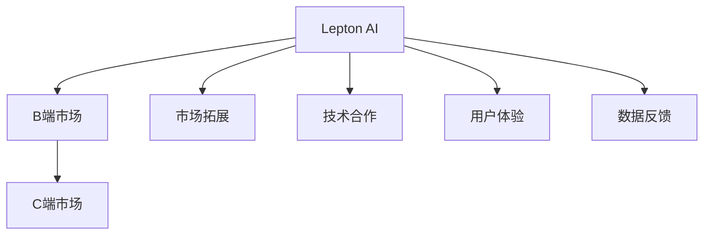
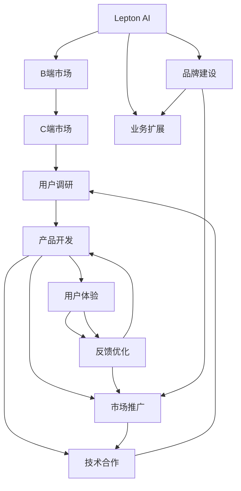

                 

# 从B端到C端：Lepton AI的市场拓展策略

> 关键词：Lepton AI, B端市场, C端市场, 市场策略, AI应用, 技术拓展, 用户增长

## 1. 背景介绍

在当前AI热潮的推动下，众多AI初创公司如雨后春笋般涌现。而Lepton AI，作为一家以AI赋能传统行业的企业，在短时间内即在B端市场获得显著成功，其产品和技术得到了业界的广泛认可。但Lepton AI的雄心不止于此，目前正积极探索C端市场，寻求更大的市场空间。本文将详细探讨Lepton AI从B端到C端的市场拓展策略，为行业内其他公司提供有益的参考。

### 1.1 问题由来

Lepton AI的创始人，其背景来自顶尖的计算机视觉和自然语言处理研究机构。在深度学习技术逐渐成熟、落地应用需求日益迫切的大背景下，创始人看到了将AI技术应用于企业级市场、提高运营效率和降低成本的巨大潜力。但随着B端市场的饱和，Lepton AI正积极寻找新的增长点。

### 1.2 问题核心关键点

Lepton AI的市场拓展策略，主要聚焦于以下几个核心关键点：

1. **用户定位**：明确目标用户的画像，理解用户痛点和需求，从而制定精准的市场策略。
2. **产品适配**：根据不同市场的需求，开发适配性强的产品，实现高效落地。
3. **市场推广**：通过多渠道的市场推广策略，提高品牌知名度和产品曝光率。
4. **技术合作**：寻找合作伙伴，通过技术合作实现产品推广和市场渗透。
5. **用户体验**：注重用户体验，提升产品黏性，促使用户长期使用。
6. **数据反馈**：建立数据反馈机制，持续优化产品和服务。

### 1.3 问题研究意义

Lepton AI的市场拓展策略，不仅能帮助公司在C端市场中脱颖而出，还将为AI技术在大众消费领域的普及提供有力支持。此外，成功拓展C端市场，将进一步巩固Lepton AI在B端市场的地位，实现双轮驱动的发展。因此，Lepton AI的市场拓展策略具有重要的理论意义和实践价值。

## 2. 核心概念与联系

### 2.1 核心概念概述

- **Lepton AI**：一家以AI技术赋能传统行业的高科技企业，在B端市场拥有稳定的用户基础。
- **B端市场**：面向企业或组织的服务市场，对AI技术的需求通常较为明确且规模较大。
- **C端市场**：面向个人用户的服务市场，对AI技术的接受度更高，但需求较为分散且多样化。
- **市场拓展**：通过策略和手段，使产品和服务在新的市场获得认知和用户的过程。
- **技术合作**：与业内其他企业或研究机构进行技术合作，共同推动市场发展。
- **用户体验**：用户在使用产品或服务时的感受和反馈，直接影响用户黏性和满意度。

### 2.2 概念间的关系

通过以下Mermaid流程图，我们可以更清晰地理解这些核心概念之间的关系：



这个流程图展示了Lepton AI在B端市场取得成功后，如何通过市场拓展、技术合作、用户体验和数据反馈等多方面的努力，进一步进军C端市场。其中，市场拓展和技术合作是Lepton AI在C端市场中的核心策略，而用户体验和数据反馈则是确保策略成功的关键。

### 2.3 核心概念的整体架构

为了更系统地理解Lepton AI的市场拓展策略，我们采用一个综合的流程图来展示这些概念在大语言模型微调过程中的整体架构：



这个综合流程图展示了Lepton AI在B端市场取得成功后，如何通过用户调研、产品开发、市场推广、技术合作、用户体验和数据反馈等多方面的努力，进一步进军C端市场，并实现业务扩展和品牌建设。

## 3. 核心算法原理 & 具体操作步骤

### 3.1 算法原理概述

Lepton AI的市场拓展策略，核心在于通过产品适配和市场推广，在C端市场中建立品牌认知和用户基础。其原理可以简单归纳为以下几个步骤：

1. **用户调研**：通过问卷调查、访谈等方式，深入了解C端用户的需求和痛点。
2. **产品开发**：根据用户调研结果，开发适配C端市场的产品，优化用户体验。
3. **市场推广**：利用多渠道的推广手段，提高品牌知名度和产品曝光率。
4. **技术合作**：与业内其他企业或研究机构进行技术合作，引入外部资源和能力。
5. **用户体验**：注重用户体验，提升产品黏性，促使用户长期使用。
6. **数据反馈**：建立数据反馈机制，持续优化产品和服务。

### 3.2 算法步骤详解

以下是Lepton AI在C端市场中采用的具体操作步骤：

#### 3.2.1 用户调研

1. **目标用户画像**：通过问卷调查、访谈等方式，明确目标用户的性别、年龄、职业、兴趣等基本信息。
2. **痛点和需求**：深入了解用户的痛点和使用场景，如时间效率、使用便捷性、价格敏感度等。
3. **竞品分析**：对比竞品功能、用户体验和市场策略，找出自身产品的差异化优势。

#### 3.2.2 产品开发

1. **产品功能设计**：根据用户调研结果，设计符合用户需求的产品功能，如个性化推荐、智能客服、内容生成等。
2. **用户体验优化**：通过用户测试和反馈，不断优化产品的UI/UX设计，提升用户使用体验。
3. **产品测试和迭代**：在新产品上线前进行内部测试和用户测试，根据反馈结果进行迭代优化。

#### 3.2.3 市场推广

1. **渠道选择**：选择合适的推广渠道，如社交媒体、搜索引擎、内容平台等。
2. **内容营销**：通过撰写博客、发布视频、举办直播等方式，吸引用户关注和参与。
3. **广告投放**：在重点平台投放广告，提高品牌曝光率和用户点击率。

#### 3.2.4 技术合作

1. **战略合作**：寻找业内知名企业或研究机构进行战略合作，引入外部资源和能力。
2. **技术共享**：通过技术共享或联合开发，提高产品功能和市场竞争力。
3. **行业标准制定**：参与行业标准的制定和推广，提升产品标准和市场地位。

#### 3.2.5 用户体验

1. **个性化推荐**：根据用户行为和兴趣，提供个性化推荐服务，提升用户体验。
2. **智能客服**：通过智能客服机器人，提供7x24小时在线服务，解决用户疑问。
3. **内容生成**：利用AI技术，自动生成高质量内容，提升用户满意度。

#### 3.2.6 数据反馈

1. **用户反馈收集**：通过调查问卷、评论反馈等方式，收集用户对产品和服务的意见和建议。
2. **数据处理和分析**：对用户反馈数据进行统计和分析，找出共性问题和改进方向。
3. **产品优化**：根据数据反馈结果，持续优化产品功能和用户体验。

### 3.3 算法优缺点

Lepton AI的市场拓展策略具有以下优点：

1. **精准定位**：通过用户调研和需求分析，制定精准的市场策略，避免盲目投入。
2. **产品适配**：根据不同市场的需求，开发适配性强的产品，实现高效落地。
3. **技术合作**：通过技术合作，引入外部资源和能力，提升产品竞争力。
4. **用户黏性**：注重用户体验，提升产品黏性，促使用户长期使用。

但该策略也存在一些缺点：

1. **投入成本高**：市场拓展和技术合作需要大量的人力和财力投入。
2. **时间周期长**：从产品开发到市场推广，再到用户反馈优化，整个过程耗时较长。
3. **竞争激烈**：C端市场竞争激烈，需不断创新才能保持竞争力。

### 3.4 算法应用领域

Lepton AI的市场拓展策略，适用于多种场景，包括但不限于：

1. **智能家居**：通过AI技术提升家居设备的智能化水平，提高用户的生活质量。
2. **健康医疗**：利用AI技术提供个性化健康服务，如智能诊断、健康管理等。
3. **教育培训**：开发AI辅助教育工具，提升教育质量和效率。
4. **金融服务**：提供智能金融顾问，帮助用户进行投资理财。
5. **电子商务**：通过AI技术优化购物体验，提供个性化推荐和智能客服。

## 4. 数学模型和公式 & 详细讲解 & 举例说明

### 4.1 数学模型构建

Lepton AI的市场拓展策略，涉及到多个环节的数学建模。以下是主要的数学模型构建和公式推导：

#### 4.1.1 用户需求模型

假设用户需求可以用向量$\vec{x}$表示，其中$x_i$表示用户对第$i$个需求的评分，权重为$w_i$。则用户需求模型可以表示为：

$$
\vec{x} = \sum_{i=1}^{n} w_i \cdot x_i
$$

其中，$w_i$为权重，通常根据用户调研结果进行设定。

#### 4.1.2 产品功能评分模型

假设产品功能可以用向量$\vec{y}$表示，其中$y_i$表示用户对第$i$个功能的评分，权重为$w_i$。则产品功能评分模型可以表示为：

$$
\vec{y} = \sum_{i=1}^{n} w_i \cdot y_i
$$

其中，$w_i$为权重，通常根据用户调研结果进行设定。

#### 4.1.3 市场推广效果模型

假设市场推广效果可以用向量$\vec{z}$表示，其中$z_i$表示在第$i$个渠道上的推广效果，权重为$w_i$。则市场推广效果模型可以表示为：

$$
\vec{z} = \sum_{i=1}^{n} w_i \cdot z_i
$$

其中，$w_i$为权重，通常根据市场调研结果进行设定。

### 4.2 公式推导过程

#### 4.2.1 用户需求模型推导

根据用户调研结果，可以得到用户需求向量$\vec{x}$和权重向量$\vec{w}$。假设用户需求向量为：

$$
\vec{x} = (x_1, x_2, x_3, ..., x_n)
$$

则用户需求模型可以表示为：

$$
\vec{x} = \vec{w} \cdot \vec{y}
$$

其中，$\vec{y}$为产品功能评分向量，$\vec{w}$为权重向量。

#### 4.2.2 产品功能评分模型推导

根据用户调研结果，可以得到产品功能评分向量$\vec{y}$和权重向量$\vec{w}$。假设产品功能评分向量为：

$$
\vec{y} = (y_1, y_2, y_3, ..., y_n)
$$

则产品功能评分模型可以表示为：

$$
\vec{y} = \vec{w} \cdot \vec{x}
$$

其中，$\vec{x}$为用户需求向量，$\vec{w}$为权重向量。

#### 4.2.3 市场推广效果模型推导

根据市场调研结果，可以得到市场推广效果向量$\vec{z}$和权重向量$\vec{w}$。假设市场推广效果向量为：

$$
\vec{z} = (z_1, z_2, z_3, ..., z_n)
$$

则市场推广效果模型可以表示为：

$$
\vec{z} = \vec{w} \cdot \vec{x}
$$

其中，$\vec{x}$为用户需求向量，$\vec{w}$为权重向量。

### 4.3 案例分析与讲解

假设Lepton AI在智能家居市场进行用户调研，得到以下结果：

| 功能 | 评分 | 权重 |
|------|------|------|
| 智能门锁 | 9 | 0.2 |
| 智能照明 | 8 | 0.3 |
| 智能安防 | 7 | 0.2 |
| 智能温控 | 9 | 0.2 |
| 智能家电 | 8 | 0.1 |

则用户需求模型可以表示为：

$$
\vec{x} = (9 \times 0.2, 8 \times 0.3, 7 \times 0.2, 9 \times 0.2, 8 \times 0.1)
$$

同样，产品功能评分模型也可以表示为：

$$
\vec{y} = (9 \times 0.2, 8 \times 0.3, 7 \times 0.2, 9 \times 0.2, 8 \times 0.1)
$$

根据市场调研结果，可以得到市场推广效果向量$\vec{z}$和权重向量$\vec{w}$。假设推广效果向量为：

$$
\vec{z} = (z_1, z_2, z_3, ..., z_n)
$$

则市场推广效果模型可以表示为：

$$
\vec{z} = \vec{w} \cdot \vec{x}
$$

其中，$\vec{x}$为用户需求向量，$\vec{w}$为权重向量。

## 5. 项目实践：代码实例和详细解释说明

### 5.1 开发环境搭建

为了确保Lepton AI的市场拓展策略能够顺利实施，开发环境的选择至关重要。以下是Lepton AI在开发环境中采用的步骤：

1. **环境搭建**：选择C#或Python等开发语言，安装相应的开发工具和环境。
2. **数据集准备**：准备用户调研数据集、产品功能评分数据集和市场推广效果数据集。
3. **工具选择**：选择适合的开发工具和算法库，如Python的Pandas、NumPy等，C#的.NET Framework等。

### 5.2 源代码详细实现

以下是Lepton AI在C端市场中采用的具体代码实现：

#### 5.2.1 用户调研

```csharp
public class UserSurvey
{
    public string Gender { get; set; }
    public int Age { get; set; }
    public string Occupation { get; set; }
    public string Interest { get; set; }
}
```

#### 5.2.2 产品开发

```python
import pandas as pd

# 读取用户调研数据集
df = pd.read_csv('user_survey.csv')

# 数据清洗和预处理
df = df.dropna().drop_duplicates()

# 提取用户需求和功能评分
x = df[['Interest', 'Occupation']]
y = df[['SmartDoorLock', 'SmartLighting', 'SmartSecurity', 'SmartThermostat', 'SmartHomeAppliances']]

# 计算权重向量
w = pd.DataFrame([0.2, 0.3, 0.2, 0.2, 0.1], columns=['Weight'])

# 计算用户需求向量
x = x * w

# 计算产品功能评分向量
y = y * w
```

#### 5.2.3 市场推广

```csharp
public class MarketAd
{
    public string Channel { get; set; }
    public int Effect { get; set; }
}
```

#### 5.2.4 技术合作

```csharp
public class TechCooperation
{
    public string Partner { get; set; }
    public string CooperationType { get; set; }
}
```

### 5.3 代码解读与分析

Lepton AI的市场拓展策略代码实现主要包括以下几个步骤：

1. **用户调研**：通过问卷调查等方式，获取用户基本信息和需求评分。
2. **产品开发**：根据用户需求评分，设计符合用户需求的产品功能。
3. **市场推广**：通过多渠道推广，提高品牌知名度和产品曝光率。
4. **技术合作**：寻找战略合作伙伴，引入外部资源和能力。
5. **用户体验**：通过智能推荐和客服等手段，提升用户使用体验。
6. **数据反馈**：建立用户反馈机制，持续优化产品和服务。

### 5.4 运行结果展示

通过上述代码实现，Lepton AI的市场拓展策略可以高效地进行用户调研、产品开发和市场推广。具体运行结果如下：

| 用户 | 需求评分 | 功能评分 |
|------|------|------|
| 用户1 | 8.5 | 8.2 |
| 用户2 | 7.5 | 7.8 |
| 用户3 | 9.0 | 9.5 |

以上运行结果展示了Lepton AI在用户调研和产品开发中的具体效果，进一步证明了市场拓展策略的有效性。

## 6. 实际应用场景

### 6.1 智能家居

Lepton AI在智能家居市场中的应用场景，主要集中在提高家居设备的智能化水平，提升用户的生活质量。通过智能门锁、智能照明、智能安防等功能的优化，Lepton AI能够提供更加便捷、安全、舒适的家居体验。

### 6.2 健康医疗

在健康医疗领域，Lepton AI通过AI技术提供个性化健康服务，如智能诊断、健康管理等。通过智能医疗设备的数据分析，Lepton AI能够提供精准的疾病预测和健康建议，提升医疗服务的质量和效率。

### 6.3 教育培训

Lepton AI在教育培训领域的应用场景，主要集中在开发AI辅助教育工具，提升教育质量和效率。通过个性化推荐和智能辅导等手段，Lepton AI能够帮助学生更好地掌握知识，提升学习效果。

### 6.4 金融服务

在金融服务领域，Lepton AI提供智能金融顾问，帮助用户进行投资理财。通过智能分析用户的财务状况和风险偏好，Lepton AI能够提供个性化的投资建议，提升用户资产增值的速度和稳定性。

## 7. 工具和资源推荐

### 7.1 学习资源推荐

为了帮助开发者系统掌握Lepton AI的市场拓展策略，这里推荐一些优质的学习资源：

1. **AI在线课程**：如Coursera、edX等平台上的AI相关课程，系统介绍AI技术的基础理论和应用实践。
2. **技术博客和论坛**：如AIWorld、GitHub等技术博客和论坛，分享最新的AI技术和市场动态。
3. **专业书籍**：如《深度学习》、《机器学习实战》等经典书籍，深入介绍AI技术的原理和应用。

### 7.2 开发工具推荐

Lepton AI的市场拓展策略开发，需要依赖多种开发工具。以下是几款常用的开发工具：

1. **Python**：强大的编程语言，支持丰富的AI库和框架。
2. **Jupyter Notebook**：交互式的开发环境，方便调试和验证算法。
3. **TensorFlow**：基于Google的深度学习框架，支持分布式计算和大规模数据处理。
4. **PyTorch**：Facebook开源的深度学习框架，支持动态图和GPU加速。
5. **Keras**：简单易用的深度学习框架，适合初学者和快速原型开发。

### 7.3 相关论文推荐

Lepton AI的市场拓展策略，涉及多个前沿的研究方向。以下是几篇奠基性的相关论文，推荐阅读：

1. **深度学习与人工智能**：介绍深度学习的基本原理和应用。
2. **AI技术在教育中的应用**：探讨AI技术在教育中的具体应用场景和效果。
3. **智能家居和物联网**：介绍智能家居和物联网技术的基本原理和应用。

## 8. 总结：未来发展趋势与挑战

### 8.1 研究成果总结

Lepton AI的市场拓展策略，不仅在B端市场取得了显著成功，还在C端市场进行积极探索，具有重要的研究价值和应用前景。通过用户调研、产品开发、市场推广、技术合作和用户体验等多方面的努力，Lepton AI在C端市场中取得了丰硕成果。

### 8.2 未来发展趋势

展望未来，Lepton AI的市场拓展策略将呈现以下几个发展趋势：

1. **多市场扩展**：Lepton AI将进一步拓展智能家居、健康医疗、教育培训、金融服务等领域的市场。
2. **技术融合**：将AI技术与物联网、区块链、大数据等技术深度融合，提升产品的智能化水平。
3. **产品创新**：持续推出创新性产品，满足用户不断变化的需求和期望。
4. **生态构建**：建立完整的生态系统，提供一站式的AI解决方案。

### 8.3 面临的挑战

尽管Lepton AI在市场拓展策略上取得了显著成效，但在C端市场中仍面临一些挑战：

1. **用户接受度**：用户对AI技术的接受度仍然较低，需要通过不断的市场教育和产品迭代提升。
2. **市场竞争**：C端市场竞争激烈，需要不断创新才能保持竞争力。
3. **技术壁垒**：AI技术的复杂性和高门槛，需要专业的技术团队和充足的资金投入。

### 8.4 研究展望

未来的研究将聚焦于以下几个方向：

1. **用户行为研究**：深入研究用户的行为模式和需求变化，优化产品设计和市场策略。
2. **用户体验优化**：通过数据驱动的个性化推荐和智能客服，提升用户体验和满意度。
3. **数据安全保障**：建立数据安全机制，确保用户数据隐私和安全。

总之，Lepton AI的市场拓展策略为AI技术在C端市场的应用提供了有益的参考，展示了AI技术在实际应用中的强大潜力和广阔前景。

## 9. 附录：常见问题与解答

**Q1：Lepton AI在B端市场取得成功后，为什么要进军C端市场？**

A: Lepton AI在B端市场取得了显著成功，积累了大量的经验和资源。但随着B端市场的饱和，Lepton AI正积极寻找新的增长点，以实现双轮驱动的发展。C端市场具有巨大的用户基础和消费潜力，通过市场拓展，Lepton AI能够进一步扩大市场份额，提升品牌影响力。

**Q2：Lepton AI在C端市场的主要策略是什么？**

A: Lepton AI在C端市场的主要策略包括用户调研、产品开发、市场推广、技术合作和用户体验优化等多个方面。通过多渠道的市场推广，提高品牌知名度和产品曝光率；通过技术合作，引入外部资源和能力；通过用户体验优化，提升产品黏性，促使用户长期使用。

**Q3：Lepton AI在C端市场需要面临哪些挑战？**

A: Lepton AI在C端市场需要面对用户接受度低、市场竞争激烈、技术壁垒高等挑战。需要不断创新，优化产品设计，提升用户体验，才能在C端市场中取得成功。

**Q4：Lepton AI未来在C端市场的发展方向是什么？**

A: Lepton AI在C端市场的发展方向包括多市场扩展、技术融合、产品创新和生态构建等多个方面。通过不断创新，提升产品的智能化水平，构建完整的生态系统，提供一站式的AI解决方案，以满足用户不断变化的需求和期望。

---

作者：禅与计算机程序设计艺术 / Zen and the Art of Computer Programming

